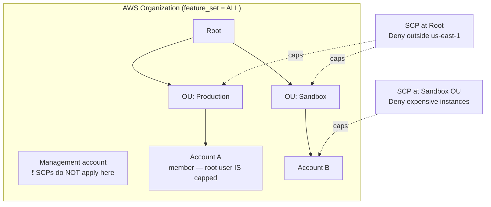
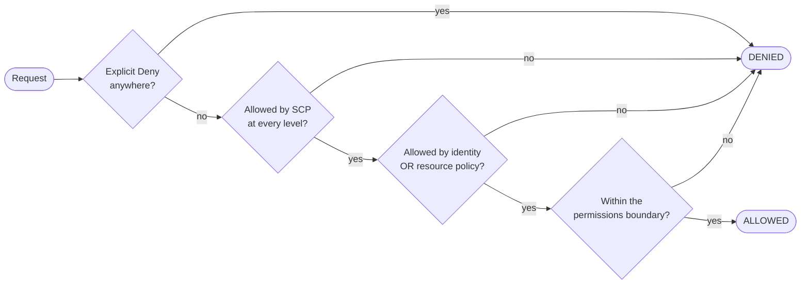

# 01b – IAM Advanced (Organizations, SCPs, boundaries, ABAC)

The multi-account layer of IAM. [[01-iam]] answered *"what may this principal do?"* — this note answers a different question: *"what is anyone in this account **permitted to be allowed** to do?"*

> [!warning] Build tier — **conceptual-only**
> Do **not** create an organization or attach SCPs in your learning account. An SCP mistake can lock you out of your own account, the management account can't be changed once set, and leaving an organization is deliberately awkward. This topic is learned from notes + the exam framing, not from `terraform apply`.

## What problem does this solve?

One AWS account is one blast radius. Everything inside it can potentially reach everything else, and one careless IAM policy is all it takes.

So real companies don't use one account. They use dozens or hundreds — one per team, per environment, per product — so that a mistake in one cannot reach the others.

That solves the first problem and creates a second one: **how do you enforce a rule across all of them?**

Say the rule is "nobody may switch off CloudTrail," or "nothing may run outside Europe." You could email every account administrator and ask them to write that policy themselves. You'd be trusting a hundred people to get it right, and to keep getting it right, forever.

**AWS Organizations** is the container that holds all those accounts. **Service Control Policies** are how you set a rule that nobody inside them can escape — not even their own administrator.

> In one line: many accounts limit the damage; SCPs enforce the rules across all of them.

## How it actually works

### The one idea: granting versus capping

Think of two separate lists.

- **List 1 — your IAM policy.** The things *you* are allowed to do.
- **List 2 — the SCP.** The things *anyone in this account* is allowed to do at all.

You can only do something that appears on **both** lists.

Which means an SCP can **never give you anything**. If EC2 is on the SCP's list but not on yours, you still can't launch an instance. The SCP didn't grant it — it only permitted it to be granted, and nobody granted it.

This catches people out because an SCP *looks* exactly like an IAM policy. It has `"Effect": "Allow"` in it. But `Allow` in an SCP doesn't mean "you may do this." It means "this isn't forbidden here."

Here's the consequence, and it turns up in exam questions constantly:

> An account administrator attaches `AdministratorAccess` to themselves — full power, every action, every resource. They try to launch an EC2 instance. It fails.
>
> Nothing is broken, and their IAM policy is being read correctly. But the SCP above their account never permitted EC2 at all. "Everything" on their list overlaps with a list that doesn't contain EC2, and the overlap is empty.

> In one line: IAM grants, the SCP caps, and you get whichever is smaller.

### Why an Allow has to exist at every level

Accounts sit in a chain: the **root** at the top, then one or more **OUs**, then the account itself. An SCP can be attached at any of those levels.

Each level is its own "what's permitted here" list — and you have to be on **all of them**.

Walk a real one:

| Level | SCP attached | What that level permits |
|---|---|---|
| Root | `FullAWSAccess` | everything |
| Production OU | `Allow: ec2:*` | **only EC2** |
| Account B | `FullAWSAccess` | everything |

Account B ends up able to use **EC2 and nothing else**. Everything ∩ EC2 ∩ everything = EC2. The account's own permissive SCP can't widen what the OU already narrowed.

Now the trap that takes down entire environments. Someone wants to block S3 in the Sandbox OU. They write an SCP containing **only** a `Deny` on S3, detach `FullAWSAccess`, and attach theirs.

Every account under Sandbox immediately loses access to **everything** — not just S3.

Why? A Deny-only policy grants nothing, so that level's "permitted" list is now **empty**. Anything intersected with an empty list is empty.

That is what `FullAWSAccess` is for. AWS attaches it to every root, OU and account so that by default every level says "everything is permitted here," leaving your `Deny` statements to do the actual restricting.

> In one line: every level in the chain has to say yes; one silent level means no.

### The root-user rule that catches everyone

Two facts, pointing in opposite directions:

- The **management account** is **completely exempt** from SCPs. Not partly — entirely. Its root user, its IAM users, its roles: none of them can be capped.
- A **member account's root user is not exempt.** It gets capped like everyone else in that account.

The asymmetry isn't arbitrary. The management account is where the rules are *written*. If SCPs could constrain it, you could attach one bad policy and lock yourself out of your own organisation permanently, with no way back in.

Which is exactly why AWS recommends **keeping no workloads in the management account** — nothing there can be restricted.

> In one line: the account that writes the rules is exempt from them; every other account's root user is not.

### Permissions boundaries — the same idea, one identity at a time

An SCP caps a whole account. A **permissions boundary** caps exactly one user or one role.

Why you'd want that: you need your junior admin to handle user onboarding, but they must not be able to create an administrator — including for themselves.

Three pieces make it work:

1. A policy describing the **maximum** any new user may ever have.
2. The junior admin's own IAM policy, allowing `iam:CreateUser`.
3. The junior admin's own **boundary**, which allows `iam:CreateUser` **only when** the user being created is stamped with that maximum-permissions policy.

Now if they create a user and forget to attach the boundary, the call simply fails. They cannot mint anything more powerful than the ceiling they're forced to apply.

> In one line: an SCP caps an account, a boundary caps one identity, and neither one grants anything.

### Why one combining rule is the odd one out

Nearly every policy type **narrows** your access:

- identity policy **+ SCP** → both must allow
- identity policy **+ permissions boundary** → both must allow

Exactly one type **widens** it:

- identity policy **+ resource-based policy** → **either** one allowing is enough

That exception looks inconsistent until you notice what a resource policy actually is: the *owner of the resource* saying "I permit this principal." That's a genuine grant arriving from the other direction — and it's the only reason cross-account access can work at all. If resource policies only narrowed, a bucket in account A could never give anything to a principal in account B.

Above all of it: an **explicit `Deny` anywhere wins.** In any policy, of any type, at any level. Nothing overrides it.

> In one line: resource policies add access, everything else subtracts it, and an explicit Deny beats the lot.

## Exam recap

*Now that the mechanisms are clear, this is the compressed version to revise from.*

> [!info] Exam TL;DR
> - **An SCP never grants anything.** It sets a **ceiling**. Effective permissions = **intersection** of the SCP and the identity/resource policies. A user with no IAM policy still has no access, however permissive the SCP.
> - **SCPs do not affect the management account** — member accounts only. But they **do** cap the **root user of a member account**. That asymmetry is the single most tested SCP fact.
> - **An `Allow` must exist at *every* level** root → OU → account. A **`Deny` at *any* level** kills it for everything beneath. This is why **`FullAWSAccess`** is attached by default — remove it without replacing it and every action in that subtree fails.
> - SCPs require **all features enabled**; they don't exist in consolidated-billing-only mode.
> - **Permissions boundary** = a managed policy setting the max an **identity-based policy** can grant to **one user or role**. Also grants nothing. Effective = **intersection**.
> - **Combining rules:** identity + resource-based = **UNION**. identity + boundary = **INTERSECTION**. identity + SCP = **INTERSECTION**. **Explicit `Deny` anywhere wins, always.**
> - **ABAC** = access by **tags** — `aws:PrincipalTag/x` compared against `aws:ResourceTag/x`. Scales where RBAC needs a new policy per team.
> - **`aws:PrincipalOrgID`** lets one resource policy trust a whole organization without listing account IDs.
> - **MFA conditions must use `BoolIfExists`**, not `Bool` — the key is absent for long-term access keys, so plain `Bool` denies things you didn't mean to.

## AWS console ↔ Terraform map

| Concept | Terraform | Notes |
|---|---|---|
| The organization | `aws_organizations_organization` | `feature_set = "ALL"` is required for SCPs. |
| An OU | `aws_organizations_organizational_unit` | Nests under the root or another OU. |
| A member account | `aws_organizations_account` | Created *by* the org; removing it from state does not close it. |
| An SCP | `aws_organizations_policy` (`type = "SERVICE_CONTROL_POLICY"`) | Written as a policy document, same syntax as IAM. |
| Attaching it | `aws_organizations_policy_attachment` | `target_id` = a root, OU, or account. |
| Permissions boundary | `permissions_boundary` argument on `aws_iam_role` / `aws_iam_user` | Takes a **policy ARN**. Not a separate resource. |
| Restrict who may set boundaries | `iam:PermissionsBoundary` condition key | The delegation pattern — see the worked example. |

## Architecture diagram

## Key facts, limits & pricing

- **Organizations is free.** You pay only for what the member accounts use. Consolidated billing aggregates usage across accounts, which can earn **volume discounts** and lets **Reserved Instances / Savings Plans** be shared across the organization.
- **Two feature sets:** *All features* (default, and required for SCPs, RCPs and service integrations) and *Consolidated billing only* (billing aggregation, no policy control). Upgrading to all features requires every invited member account to accept.
- **One root per organization.** OU hierarchy can nest **five levels deep** below the root.
- The **management account cannot be changed** after the organization is created, and it is the payer. A member account belongs to **only one organization** at a time.
- **SCPs grant nothing.** AWS is explicit: *"No permissions are granted by an SCP."* A user with zero IAM policies has zero access no matter what the SCP allows.
- **`Allow` must be present at every level** from the root through each OU down to the account. Miss one and the permission is denied — SCP evaluation is deny-by-default.
- **`Deny` at any single level** applies to everything beneath it, overriding any `Allow` lower down.
- **`FullAWSAccess`** is auto-attached to every root, OU and account. Removing it without a replacement blocks **all** actions in that subtree.
- **SCPs don't restrict:** anything done by the **management account**, anything done via a **service-linked role**, registering for Enterprise Support as root, CloudFront trusted-signer functions, and configuring reverse DNS for Lightsail/EC2 as root.
- **SCPs don't reach outside the organization.** If your bucket policy grants access to an account that isn't in your org, your SCP does nothing about it — SCPs constrain *your* principals, not other people's.
- **Disabling the SCP policy type detaches every SCP** and those attachments are **not recoverable** — you must reattach manually.
- **Permissions boundaries apply to users and roles — not groups.** They use a managed policy and grant nothing on their own.
- **Implicit denies in a boundary don't limit resource-based policies.** If a Secrets Manager resource policy grants the user directly and the boundary merely fails to mention Secrets Manager, the access still works. An **explicit** `Deny` in the boundary *does* block it. (Same nuance applies to session policies.)
- **`aws:MultiFactorAuthPresent` is absent for long-term access keys.** Use **`BoolIfExists`**; a plain `Bool` test denies CLI access-key requests unintentionally.
- **`aws:SourceIp` is not present for requests through a VPC endpoint** — use `aws:VpcSourceIp` there, or the endpoint's own policy.
- **Control Tower is free itself**; you pay for what it provisions (CloudTrail, Config, S3 logging).

## Comparisons

### The four things that can cap a permission

|   | **SCP** | **RCP** | **Permissions boundary** | **Session policy** |
|---|---|---|---|---|
| Attached to | root / OU / account | root / OU / account | one IAM **user or role** | passed at `AssumeRole` |
| Limits | **principals** in member accounts | **resources** in member accounts | that one identity | that one session |
| Grants permissions? | **never** | **never** | **never** | **never** |
| Needs Organizations | ✅ (all features) | ✅ (all features) | ❌ | ❌ |
| Typical use | "no one may leave the org / use other regions" | "only our org's identities may touch our buckets" | "you may create users, but not admins" | temporary least-privilege on assume |

### How policy types combine

| Combination | Result |
|---|---|
| Identity-based **+ resource-based** | **UNION** — either one allowing is enough |
| Identity-based **+ permissions boundary** | **INTERSECTION** — both must allow |
| Identity-based **+ SCP / RCP** | **INTERSECTION** — both must allow |
| Identity **+ SCP + boundary** | all **three** must allow |
| **Explicit `Deny`** in any of them | **denied**, unconditionally |

*The union case is the odd one out — but it's a union **within one account**. A cross-account request is evaluated twice: the caller's identity policy **and** the bucket policy must both allow it.*

### RBAC vs ABAC

|   | RBAC (roles) | **ABAC (tags)** |
|---|---|---|
| How access is decided | which role you assumed | tags on **you** vs tags on the **resource** |
| Adding a new team | write a new policy + role | **nothing** — tag the people and the resources |
| Key condition keys | — | `aws:PrincipalTag/x`, `aws:ResourceTag/x`, `aws:RequestTag/x` |
| Exam trigger | "separate permissions per job function" | "**scales** as teams grow / avoid policy sprawl / permissions based on project or cost-centre **tags**" |

### Condition keys worth memorising

| Key | Matches | Use it for |
|---|---|---|
| `aws:PrincipalOrgID` | the caller's organization ID | trust a whole org in one resource policy, no account list |
| `aws:RequestedRegion` | region the request targets | data-residency / cost control ("only eu-west-1") |
| `aws:MultiFactorAuthPresent` | was MFA used | sensitive actions — **`BoolIfExists`** |
| `aws:PrincipalTag/x` / `aws:ResourceTag/x` | tags on caller / resource | ABAC |
| `aws:SourceIp` | caller's public IP | corporate-network-only (**not** via VPC endpoints) |
| `aws:PrincipalArn` | the caller's ARN | pin a specific role; prefer `ArnEquals`/`ArnLike` |
| `aws:SecureTransport` | HTTPS? | the TLS-only guardrail — see [[09-s3-security]] |

## Worked examples

> [!example] Worked example — "no resources outside eu-west-1, and nobody can turn off CloudTrail"
> A company must keep data in Ireland for GDPR. Doing this with IAM policies means trusting every account admin to write and keep them — one mistake and it's broken. Instead: enable **all features** in Organizations, and attach an SCP at the **root** with two `Deny` statements — one on `cloudtrail:StopLogging` and `cloudtrail:DeleteTrail`, one denying everything when `aws:RequestedRegion` is not `eu-west-1` (with a `NotAction` carve-out for global services like IAM, Route 53, CloudFront and Organizations, which are only reachable through `us-east-1`). Because a `Deny` at the root applies to every OU and account beneath it, an account admin holding `AdministratorAccess` still cannot launch in `us-east-2` or stop the trail. Keep `FullAWSAccess` attached alongside it — the Deny does the work; removing the Allow would block everything.

> [!example] Worked example — letting a junior admin create users, safely
> Maria wants Zhang to handle user onboarding without letting him mint an administrator. Three pieces: **(1)** a managed policy `XCompanyBoundaries` listing the maximum any new user may ever have; **(2)** Zhang's own permissions policy granting `iam:CreateUser` etc.; **(3)** the important one — Zhang's *own* permissions boundary allows `iam:CreateUser` only under the condition `StringEquals: {"iam:PermissionsBoundary": "<arn of XCompanyBoundaries>"}`, plus explicit `Deny` on editing or deleting boundary policies. Now if Zhang creates a user and forgets to attach the boundary, the call **fails with AccessDenied**. He physically cannot create a principal more powerful than the boundary he's forced to stamp on it. This "delegate administration without privilege escalation" scenario is the canonical exam use of permissions boundaries.

> [!failure] Failure mode — the deny-only SCP that locked out the whole organization
> A team wants to block S3 in the Sandbox OU, so they write an SCP containing **only** a `Deny` on `s3:*`, detach `FullAWSAccess`, and attach theirs. Every account under Sandbox immediately loses access to **everything** — not just S3. The cause is that SCP evaluation is **deny-by-default and requires an explicit `Allow` at every level**: with `FullAWSAccess` gone there is no `Allow` anywhere in the path, so nothing is permitted. The fix is to keep `FullAWSAccess` attached *and* add the Deny policy alongside it. The same trap in reverse: attaching an allow-list SCP at the **root** silently caps every OU beneath it, because the effective permission is the **intersection** down the path — a `FullAWSAccess` on the OU cannot widen what the root already narrowed.

## Traps

> [!warning] Trap — "attach an SCP to give that account access"
> SCPs **never grant**. If a question's correct-sounding answer is "create an SCP allowing the developers to use S3," it's wrong — you also need an IAM policy, and the SCP only ever removes. Any answer phrased as *"use an SCP to grant/enable/allow"* is a distractor.

> [!warning] Trap — root user and SCPs
> Both halves matter and they point opposite ways. The **management account** is immune to SCPs entirely — including its root user and every IAM principal in it. A **member account's root user is not immune** — it is capped like everyone else. That's exactly why AWS recommends keeping no workloads in the management account.

> [!warning] Trap — permissions boundary vs SCP
> Same idea, different blast radius. **SCP** = whole account(s), needs Organizations. **Boundary** = one user or role, works in a standalone account. If the scenario is a single account delegating admin duties → **boundary**. If it's "enforce across all accounts / prevent anyone in the org" → **SCP**.

> [!warning] Trap — `Bool` vs `BoolIfExists` for MFA
> `aws:MultiFactorAuthPresent` is **not present at all** for long-term access-key requests. A `Deny` on `Bool: {"aws:MultiFactorAuthPresent": "false"}` therefore does **not** fire for CLI access-key calls (the key is missing, not false), while an `Allow` gated on `Bool ... "true"` blocks them. Use `BoolIfExists` to get the behaviour you actually meant.

> [!warning] Trap — Control Tower vs Organizations
> **Organizations** is the primitive: accounts, OUs, SCPs. **Control Tower** *orchestrates* it — it builds a **landing zone** using Organizations + IAM Identity Center + Service Catalog, provides **Account Factory** for standardised account vending, and applies **controls/guardrails** (*preventive* — implemented as SCPs; *detective* — implemented as AWS Config rules; *proactive* — CloudFormation hooks), plus **drift detection**. "Set up a compliant multi-account environment quickly, following best practices" → **Control Tower**. "Apply a specific permission guardrail" → **SCP**.

> [!warning] Trap — `aws:SourceIp` behind a VPC endpoint
> The key is simply **absent** for requests that traverse a VPC endpoint, so an IP-allowlist policy silently fails closed for in-VPC traffic. Use `aws:VpcSourceIp`, or scope on `aws:SourceVpce` / `aws:SourceVpc` instead.

> [!example]- Recall drill
> (1) Does an SCP grant permissions? (2) Which account is exempt from SCPs, and is a *member* account's root user exempt? (3) What must be true at every level of the OU path for an action to be allowed? (4) Identity policy + resource policy — union or intersection? Identity + boundary? (5) Which condition key trusts an entire organization in one line? (6) Why `BoolIfExists` for MFA?
> > [!success]- Answers
> > (1) Never — it only caps; you still need an IAM policy. (2) The **management** account is exempt; a **member** account's root user is **not**. (3) An explicit `Allow` covering the action, at root, every OU in the path, and the account — which is what `FullAWSAccess` provides by default. (4) Resource policy = **union**; boundary = **intersection**. (5) `aws:PrincipalOrgID`. (6) The key is absent for long-term access keys, so plain `Bool` produces denials you didn't intend.

## 🔴 My weak spots (this topic)   #weak-spot

- [ ] **Never studied — the Udemy "IAM Advanced" section was skipped entirely** (realised 2026-08-30). This note was written to cover it; nothing here has been tested yet.
- [ ] **SCPs grant nothing** — the instinct to read a policy document as "granting" is strong and wrong.
- [ ] **The root-user asymmetry** — management account exempt, member-account root capped.
- [ ] **`Allow` needed at every level** vs `Deny` at any level.
- [ ] **Union vs intersection** — resource policies widen, boundaries and SCPs narrow.

## 🔗 Docs

- [Service control policies](https://docs.aws.amazon.com/organizations/latest/userguide/orgs_manage_policies_scps.html) — "no permissions are granted by an SCP", management-account exemption, member root capped, FullAWSAccess, service-linked-role exemption, unrestricted tasks; verified 2026-08-30
- [SCP evaluation](https://docs.aws.amazon.com/organizations/latest/userguide/orgs_manage_policies_scps_evaluation.html) — Allow needed at every level, Deny at any level, allow-list vs deny-list strategy, the seven scenarios; verified 2026-08-30
- [Permissions boundaries](https://docs.aws.amazon.com/IAM/latest/UserGuide/access_policies_boundaries.html) — intersection semantics, the delegation example, `iam:PermissionsBoundary`, resource-policy nuance; verified 2026-08-30
- [Policy evaluation logic](https://docs.aws.amazon.com/IAM/latest/UserGuide/reference_policies_evaluation-logic.html) — union vs intersection per policy-type pairing; verified 2026-08-30
- [Organizations terminology & concepts](https://docs.aws.amazon.com/organizations/latest/userguide/orgs_getting-started_concepts.html) — feature sets, OU depth, management vs member, SCP/RCP/declarative policy types; verified 2026-08-30
- [Global condition keys](https://docs.aws.amazon.com/IAM/latest/UserGuide/reference_policies_condition-keys.html) — `aws:PrincipalOrgID`, `aws:RequestedRegion`, `aws:MultiFactorAuthPresent`, tag keys, `aws:SourceIp` VPC-endpoint caveat; verified 2026-08-30
- [What is AWS Control Tower](https://docs.aws.amazon.com/controltower/latest/userguide/what-is-control-tower.html) — landing zone, controls (preventive/detective/proactive), Account Factory, drift; verified 2026-08-30

---
**Self-test for this topic:** [[revision/01-iam-advanced-revision#Self-test]] · **Foundations:** [[01-iam]]
