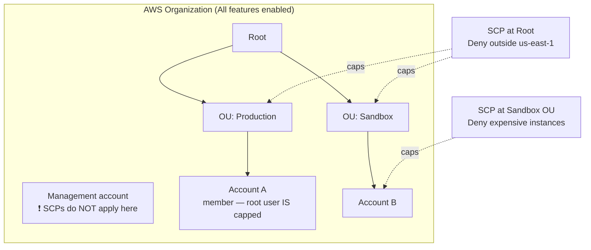
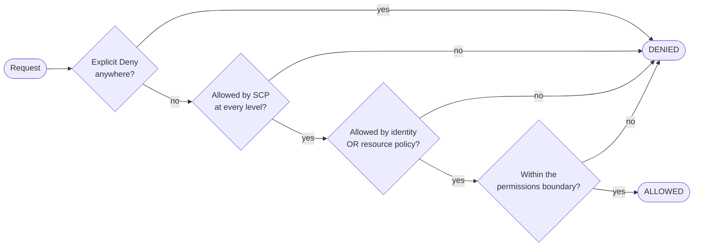

# 01b – IAM Advanced (Organizations, SCPs, boundaries, ABAC)

The multi-account layer of IAM. [[01-iam]] answered *"what may this principal do?"* — this note answers a different question: *"what is anyone in this account **permitted to be allowed** to do?"*

> [!info] Exam TL;DR
> - **An SCP never grants anything.** It sets a **ceiling**. Effective permissions = **intersection** of the SCP and the identity/resource policies. A user with no IAM policy still has no access, however permissive the SCP.
> - **SCPs do not affect the management account** — member accounts only. But they **do** cap the **root user of a member account**. That asymmetry is the single most tested SCP fact.
> - **An `Allow` must exist at *every* level** root → OU → account. A **`Deny` at *any* level** kills it for everything beneath. This is why **`FullAWSAccess`** is attached by default — remove it without replacing it and every action in that subtree fails.
> - SCPs require **all features enabled**; they don't exist in consolidated-billing-only mode.
> - **Permissions boundary** = a managed policy setting the max an **identity-based policy** can grant to **one user or role**. Also grants nothing. Effective = **intersection**.
> - **Combining rules:** identity + resource-based = **UNION** — *within one account*, and not for a KMS key policy. identity + boundary = **INTERSECTION**. identity + SCP = **INTERSECTION**. A **cross-account** request is evaluated twice, so there both sides must allow. **Explicit `Deny` anywhere wins, always.**
> - **ABAC** = access by **tags** — `aws:PrincipalTag/x` compared against `aws:ResourceTag/x`. Scales where RBAC needs a new policy per team.
> - **`aws:PrincipalOrgID`** lets one resource policy trust a whole organization without listing account IDs.
> - **Use `BoolIfExists` for MFA conditions, not `Bool`** — AWS's own recommendation, at the cost of breaking scripts that authenticate with access keys. The key is *absent* — not `false` — for long-term access keys, so plain `Bool` misbehaves in **both** directions: a `Deny` on `"false"` never fires (access-key calls slip through), and an `Allow` on `"true"` never matches (access-key calls are blocked). Which way it bites depends on whether your statement is a `Deny` or an `Allow`.

> [!warning] Build tier — **conceptual-only**
> Do **not** create an organization or attach SCPs in your learning account. An SCP mistake can lock you out of your own account, the management account can't be changed once set, and leaving an organization is deliberately awkward. This topic is learned from the notes and the exam framing, not by building it.

## What problem does this solve?

One AWS account is one blast radius. Everything inside it can potentially reach everything else, and one careless IAM policy is all it takes.

The vocabulary first, because every rule below is phrased in it. Inside an organization, accounts are grouped into **OUs (organizational units)** — nestable folders such as *Production* or *Sandbox*. The **root** is the single node above all of them. One account is the **management account**: the one that created the organization, pays the consolidated bill and writes the policies. Every other account is a **member account**. A policy can be attached at the root, at an OU, or at one account — and whatever is attached above an account applies to it.

So real companies don't use one account. They use dozens or hundreds — one per team, per environment, per product — so that a mistake in one cannot reach the others.

That solves the first problem and creates a second one: **how do you enforce a rule across all of them?**

Say the rule is "nobody may switch off CloudTrail," or "nothing may run outside Europe." You could email every account administrator and ask them to write that policy themselves. You'd be trusting a hundred people to get it right, and to keep getting it right, forever.

**AWS Organizations** is the container that holds all those accounts. **Service Control Policies** are how you set a rule that nobody inside them can escape — not even their own administrator.

> In one line: many accounts limit the damage; SCPs enforce the rules across all of them.

## How it actually works

### The one idea: granting versus capping

Think of two separate lists.

- **List 1 — your IAM policy.** The things *you* are allowed to do.
- **List 2 — the SCP.** The things *anyone in this account* is allowed to do at all.

You can only do something that appears on **both** lists.

Which means an SCP can **never give you anything**. If EC2 is on the SCP's list but not on yours, you still can't launch an instance. The SCP didn't grant it — it only permitted it to be granted, and nobody granted it.

This catches people out because an SCP *looks* exactly like an IAM policy. It has `"Effect": "Allow"` in it. But `Allow` in an SCP doesn't mean "you may do this." It means "this isn't forbidden here."

Here's the consequence, and it turns up in exam questions constantly:

> An account administrator attaches `AdministratorAccess` to themselves — full power, every action, every resource. They try to launch an EC2 instance. It fails.
>
> Nothing is broken, and their IAM policy is being read correctly. But the SCP above their account never permitted EC2 at all. "Everything" on their list overlaps with a list that doesn't contain EC2, and the overlap is empty.

> In one line: IAM grants, the SCP caps, and you get whichever is smaller.

### Why an Allow has to exist at every level

Accounts sit in a chain: the **root** at the top, then one or more **OUs**, then the account itself. An SCP can be attached at any of those levels.

Each level is its own "what's permitted here" list — and you have to be on **all of them**.

Walk a real one:

| Level | SCP attached | What that level permits |
|---|---|---|
| Root | `FullAWSAccess` | everything |
| Production OU | `Allow: ec2:*` | **only EC2** |
| Account B | `FullAWSAccess` | everything |

Account B ends up able to use **EC2 and nothing else**. Everything ∩ EC2 ∩ everything = EC2. The account's own permissive SCP can't widen what the OU already narrowed.

Now the trap that takes down entire environments. Someone wants to block S3 in the Sandbox OU. They write an SCP containing **only** a `Deny` on S3, detach `FullAWSAccess`, and attach theirs.

Every account under Sandbox immediately loses access to **everything** — not just S3.

Why? A Deny-only policy grants nothing, so that level's "permitted" list is now **empty**. Anything intersected with an empty list is empty.

That is what `FullAWSAccess` is for. AWS attaches it to every root, OU and account so that by default every level says "everything is permitted here," leaving your `Deny` statements to do the actual restricting.

> In one line: every level in the chain has to say yes; one silent level means no.

### The root-user rule that catches everyone

Two facts, pointing in opposite directions:

- The **management account** is **completely exempt** from SCPs. Not partly — entirely. Its root user, its IAM users, its roles: none of them can be capped.
- A **member account's root user is not exempt.** It gets capped like everyone else in that account.

The asymmetry isn't arbitrary. The management account is where the rules are *written*. If SCPs could constrain it, you could attach one bad policy and lock yourself out of your own organisation permanently, with no way back in.

Which is exactly why AWS recommends **keeping no workloads in the management account** — nothing there can be restricted.

> In one line: the account that writes the rules is exempt from them; every other account's root user is not.

### Permissions boundaries — the same idea, one identity at a time

An SCP caps a whole account. A **permissions boundary** caps exactly one user or one role.

Why you'd want that: you need your junior admin to handle user onboarding, but they must not be able to create an administrator — including for themselves.

Three pieces make it work:

Two boundaries are in play, and the difference is the whole trick. **Boundary A** is the ceiling every *new* user must be created with. **Boundary B** is the junior admin's own boundary, which permits `iam:CreateUser` only if the request attaches Boundary A to the new user. So the admin is capped by B, and everyone the admin creates is capped by A.

1. **Boundary A** — a policy describing the **maximum** any new user may ever have.
2. The junior admin's own IAM policy, allowing `iam:CreateUser`.
3. **Boundary B** — the junior admin's own boundary, which allows `iam:CreateUser` **only when** the user being created is stamped with Boundary A.

Now if they create a user and forget to attach the boundary, the call simply fails. They cannot mint anything more powerful than the ceiling they're forced to apply.

> In one line: an SCP caps an account, a boundary caps one identity, and neither one grants anything.

### Why one combining rule is the odd one out

A caution on what is being compared here. [[01-iam]] counts which policy types can **hand out** access at all (four of the nine can). This section asks a different question: when a type is combined **with an identity policy**, does the pair behave as an intersection or a union? Almost all of them intersect:

- identity policy **+ SCP** → both must allow
- identity policy **+ permissions boundary** → both must allow

Exactly one combination **widens**:

- identity policy **+ resource-based policy** → **either** one allowing is enough — **except a KMS key policy**: *"Unlike other AWS resource policies, an AWS KMS key policy does not automatically give permission to the account or any of its identities."* The key policy must permit it — either by naming the principal, **or** by carrying the default `Enable IAM User Permissions` statement (principal = the account root, action = `kms:*`) that delegates to IAM. Without that statement *"IAM policies that allow access to the key are ineffective, although IAM policies that deny access to the key are still effective"* (see [[21-security#KMS is the exception to the resource-policy rule]])

That exception looks inconsistent until you notice what a resource policy actually is: the *owner of the resource* saying "I permit this principal." That's a genuine grant arriving from the other direction — and it's the only reason cross-account access can work at all. If resource policies only narrowed, a bucket in account A could never give anything to a principal in account B.

Above all of it: among the policies that **apply** to a request, an **explicit `Deny` wins** — any policy, any type, any level, nothing overrides it. The qualifier is the exam-relevant part: an SCP or RCP `Deny` never *applies* to the management account or to a service-linked role in the first place, so there it has nothing to win.

> In one line: a resource policy can add access on its own; SCPs, RCPs, boundaries and session policies only ever subtract; and an explicit `Deny` beats the lot.

## Architecture diagram

```mermaid
flowchart TB
    subgraph ORG["AWS Organization (All features enabled)"]
      MGMT["Management account<br/>❗ SCPs do NOT apply here"]
      ROOT["Root"]
      OU1["OU: Production"]
      OU2["OU: Sandbox"]
      A1["Account A<br/>member — root user IS capped"]
      A2["Account B"]
      ROOT --> OU1 --> A1
      ROOT --> OU2 --> A2
    end
    SCP1["SCP at Root<br/>Deny outside us-east-1"] -.caps.-> OU1
    SCP1 -.caps.-> OU2
    SCP2["SCP at Sandbox OU<br/>Deny expensive instances"] -.caps.-> A2
```

```mermaid
flowchart LR
    REQ([Request]) --> D{"Explicit Deny<br/>anywhere?"}
    D -->|yes| NO([DENIED])
    D -->|no| S{"Allowed by SCP<br/>at every level?"}
    S -->|no| NO
    S -->|yes| P{"Allowed by identity<br/>OR resource policy?"}
    P -->|no| NO
    P -->|yes| B{"Within the<br/>permissions boundary?"}
    B -->|no| NO
    B -->|yes| YES([ALLOWED])
```

## Key facts, limits & pricing

- **Tag policies** are a **separate Organizations policy type** from SCPs: *"Tag policies allow you to standardize the tags attached to the AWS resources in your organization's accounts"*, including the **preferred case** of tag keys and the **allowed values**. So "standardise the case and allowed values of tag keys across the OU, and report what is
non-compliant" is a **tag policy** — but do not eliminate the neighbours, because all three
mechanisms are real and the stem's verb picks between them:
  - **Prevention** → an **SCP** (or any IAM policy) using `aws:RequestTag/x` and `aws:TagKeys`. AWS presents these as the alternative to a tag policy for the same job: *"use the `aws:TagKeys` condition to define the tag keys that your users can apply, **or** use tag policies"*. This is the answer when the stem wants resource creation actually **blocked** unless the right tag is passed.
  - **Standardisation + reporting** → a **tag policy**. Two limits decide questions: *"Untagged resources or tags that aren't defined in the tag policy aren't evaluated for compliance"*, so a tag policy can never **require** a tag; and blocking needs *enforcement* turned on, and only for specified resource types.
  - **Detection after the fact** → **AWS Config's `required-tags`** rule, which checks for missing tags but *"does not prevent you from creating resources with incorrect tags"*.
  *(Verified 2026-10-04.)*
- **Organizations is free.** You pay only for what the member accounts use. (What consolidated billing changes about discounts is in the Comparisons table below, and in [[13-cost-optimization]].)
- **Two feature sets:** *All features* (default, and required for SCPs, RCPs and service integrations) and *Consolidated billing only* (billing aggregation, no policy control). Upgrading to all features requires every invited member account to accept.
- **One root per organization.** OU hierarchy can nest **five levels deep** below the root.
- The **management account cannot be changed** after the organization is created, and it is the payer. A member account belongs to **only one organization** at a time.
- **SCPs grant nothing.** AWS is explicit: *"No permissions are granted by an SCP."* A user with zero IAM policies has zero access no matter what the SCP allows.
- **`Allow` must be present at every level** from the root through each OU down to the account. Miss one and the permission is denied — SCP evaluation is deny-by-default.
- **`Deny` at any single level** applies to everything beneath it, overriding any `Allow` lower down.
- **`FullAWSAccess`** is auto-attached to every root, OU and account. Removing it without a replacement blocks **all** actions in that subtree.
- **SCPs don't restrict:** anything done by the **management account**, anything done via a **service-linked role**, registering for Enterprise Support as root, CloudFront trusted-signer functions, and configuring reverse DNS for Lightsail/EC2 as root.
- **SCPs don't reach outside the organization.** If your bucket policy grants access to an account that isn't in your org, your SCP does nothing about it — SCPs constrain *your* principals, not other people's.
- **Disabling the SCP policy type detaches every SCP** and those attachments are **not recoverable** — you must reattach manually.
- **Permissions boundaries apply to users and roles — not groups.** They use a managed policy and grant nothing on their own.
- **Implicit denies in a boundary don't limit a resource-based policy that names an IAM *user* ARN** — *"resource-based policies that grant permissions to an IAM user ARN … are not limited by an implicit deny in an identity-based policy or permissions boundary"*. So if a Secrets Manager resource policy grants the **user** directly and the boundary merely fails to mention Secrets Manager, the access still works. **It is the opposite for a role ARN:** *"Resource-based policies that grant permissions to an IAM role ARN **are** limited by an implicit deny in a permissions boundary or session policy."* An assumed-role **session** ARN behaves like the user case — granted directly to the session, not limited by an implicit deny. An **explicit** `Deny` in the boundary blocks all three. This is the one place the "identity + boundary = intersection" rule bends, so read the boundary box in the diagram above as gating what the *identity-based* policy grants. *(Verified 2026-10-04.)*
- **`aws:MultiFactorAuthPresent` is absent for long-term access keys** — absent, not `false`. AWS *recommends* `BoolIfExists` rather than requiring it, and warns the stricter form *"can break any code or scripts that use access keys"*. Which way a plain `Bool` misfires depends on the effect: see the trap below.
- **Control Tower is free itself**; you pay for what it provisions (CloudTrail, Config, S3 logging).

## Comparisons

### Which multi-account requirement does this solve?

One service in this table has not been introduced yet. **IAM Identity Center** is the single front door: an employee signs in once, then picks which AWS account and which role to enter. Each choice in that picker is a **permission set**, and assigning one creates a matching IAM role in the target account. It can draw its users from a company directory rather than from IAM.

| The requirement in the stem | The answer | The detail that decides it |
|---|---|---|
| "one bill across all our accounts", volume discounts, shared RIs / Savings Plans | **AWS Organizations — consolidated billing** | the **management account pays for everything** — AWS: *"Every organization in AWS Organizations has a management account that pays the charges of all the member accounts"*, and *"The member account bills are for informational purpose only."* Combined usage *"shares the volume pricing discounts, Reserved Instance discounts, and Savings Plans"* |
| "bring our **existing** accounts under one organization" | **Invite** each account from the management account; its owner accepts | invitations can be sent **only from the management account**, expire after **15 days**, and an account can join **only one organization**. Accounts *created* by Organizations join automatically. **To move an account between organizations, remove it from the old one first, then invite it** — the one-org rule makes the order mandatory |
| "one sign-on for all accounts, using our on-prem AD" | **IAM Identity Center**, with **AD Connector** (or AWS Managed Microsoft AD) as the identity source | within an organization, the **organization instance is enabled from the management account** — AWS: *"Required to create an organization instance"*, and it is the only instance type with multi-account permissions (a standalone account outside Organizations can create one too, but gets no multi-account access); **permission sets** ([[01-iam]] has the mechanics) need one, since *"Account instances do not support permission sets and therefore do not support access to AWS accounts"*. The directory must reside in the management account (or the delegated admin account, if one exists) |
| "divisions keep their own accounts, corporate IT keeps oversight" | **cross-account IAM role** in each member account trusting the management account | the built-in one is **`OrganizationAccountAccessRole`** — created automatically for accounts Organizations **creates**, and **not** created for **invited** accounts, where you add it yourself |
| "stop anyone in these accounts from doing X" | **SCP** | caps only — it answers **none of the rows above**. No billing, no sign-on, no access granted |

### The four things that can cap a permission

Two of these need introducing. An **RCP (resource control policy)** is the mirror image of an SCP: attached the same way — root, OU or account — but where an SCP caps what *principals* in your member accounts may do, an RCP caps what may be done *to the resources* in them, including by principals from outside your organization. A **session policy** is a policy handed over at the moment a role is assumed; it narrows that one session and dies with it.

|   | **SCP** | **RCP** | **Permissions boundary** | **Session policy** |
|---|---|---|---|---|
| Attached to | root / OU / account | root / OU / account | one IAM **user or role** | passed when a session is created — `AssumeRole*` or `GetFederationToken` |
| Limits | **principals** in member accounts | **resources** in member accounts | that one identity | that one session |
| Grants permissions? | **never** | **never** | **never** | **never** |
| Needs Organizations | ✅ (all features) | ✅ (all features) | ❌ | ❌ |
| Covers which services | all | **a subset only** — S3, STS, SQS, KMS, Secrets Manager, CloudWatch Logs, CloudFront and others, *not* EC2 or RDS | all | all |
| Typical use | "no one may leave the org / use other regions" | "only our org's identities may touch our buckets" | "you may create users, but not admins" | temporary least-privilege on assume |

Full RCP detail — the services it covers and the two things it cannot touch — is in [[01-iam]] under *Key facts, limits & pricing*.

### How policy types combine

| Combination | Result |
|---|---|
| Identity-based **+ resource-based**, same account | **UNION** — either one allowing is enough (a **KMS key policy** is the exception: it must allow independently) |
| Identity-based **+ permissions boundary** | **INTERSECTION** — both must allow |
| Identity-based **+ SCP / RCP** | **INTERSECTION** — both must allow |
| Identity **+ SCP + boundary** | all **three** must allow |
| Identity-based **+ resource-based, cross-account** | **BOTH must allow** — the union rule holds only inside one account |
| **Explicit `Deny`** in any of them | **denied**, unconditionally |

*The union case is the odd one out — but it's a union **within one account**. A cross-account request is evaluated twice: the caller's identity policy **and** the bucket policy must both allow it.*

### RBAC vs ABAC

|   | RBAC (roles) | **ABAC (tags)** |
|---|---|---|
| How access is decided | which role you assumed | tags on **you** vs tags on the **resource** |
| Adding a new team | write a new policy + role | **nothing** — tag the people and the resources |
| Key condition keys | — | `aws:PrincipalTag/x`, `aws:ResourceTag/x`, `aws:RequestTag/x` |
| Exam trigger | "separate permissions per job function" | "**scales** as teams grow / avoid policy sprawl / permissions based on project or cost-centre **tags**" |

### Condition keys worth memorising

| Key | Matches | Use it for |
|---|---|---|
| `aws:PrincipalOrgID` | the caller's organization ID | trust a whole org in one resource policy, no account list |
| `aws:RequestedRegion` | region the request targets | data-residency / cost control ("only eu-west-1") |
| `aws:MultiFactorAuthPresent` | was MFA used | sensitive actions — **`BoolIfExists`** |
| `aws:PrincipalTag/x` / `aws:ResourceTag/x` | tags on caller / resource | ABAC |
| `aws:SourceIp` | caller's public IP | corporate-network-only (**not** via VPC endpoints) |
| `aws:PrincipalArn` | the caller's ARN | pin a specific role; prefer `ArnEquals`/`ArnLike` |
| `aws:SecureTransport` | HTTPS? | the TLS-only guardrail — see [[09-s3-security]] |

### RAM shares resources; it never enforces policy

Two misses in one mock picked **AWS RAM** for governance questions. RAM and the governance
services sit at different layers and are never substitutes:

| You want to… | Service |
|---|---|
| **share a resource** across accounts — subnets (`ec2:Subnet`), **transit gateways** (`ec2:TransitGateway` — the gateway itself; the consumer account then creates its own attachment to it), Resolver rules, License Manager configs | **AWS RAM** |
| **forbid an action** across accounts — "only these instance types may launch" | **SCP** (a `Deny`) |
| **stand up new accounts** with pre-approved configuration and ongoing guardrails | **AWS Control Tower** — landing zone + guardrails |
| **see and pay for everything centrally** | **Organizations** consolidated billing |

RAM managed permissions are **Allow-only** — *"For a managed permission, the effect is always
`Allow`"* — so RAM can never express a prohibition. It *does* support a `Condition` element
(*"Conditions are available for customer managed permissions and supported resource types for AWS
managed permissions"*), so do not eliminate RAM just because a stem mentions conditional sharing
by IP range or MFA. What RAM has no form of is a **`Deny`** and any **compliance reporting**. If
the requirement is a prohibition, a standard, or an account factory, RAM cannot be the answer
however much the scenario stresses "multiple accounts". *(Verified 2026-10-04.)*

> [!warning] Trap — RAM offered where an SCP or Control Tower belongs
> The word "multi-account" pulls toward RAM, but ask what the requirement *does*. **Restricting
> what may be launched is an SCP** — a deny at the OU, which is also the least-effort answer
> because it applies to every account at once. **Provisioning new accounts with preapproved
> configuration is Control Tower**, whose landing zone and guardrails exist for exactly that.
> RAM is only ever the answer when something concrete is being *shared* — most often **VPC
> subnets** ([[05-vpc-endpoints-peering]]) or a **transit gateway**, both of which AWS documents
> as headline RAM use cases (*"Create and manage transit gateways centrally, and share them with
> other AWS accounts or your organization"*). Do not eliminate RAM on a transit-gateway stem.
> What RAM never does is forbid, enforce a standard, or vend accounts.

## Worked examples

> [!example] Worked example — "no resources outside eu-west-1, and nobody can turn off CloudTrail"
> A company must keep data in Ireland for GDPR. Doing this with IAM policies means trusting every account admin to write and keep them — one mistake and it's broken. Instead: enable **all features** in Organizations, and attach an SCP at the **root** with two `Deny` statements — one on `cloudtrail:StopLogging` and `cloudtrail:DeleteTrail`, one denying everything when `aws:RequestedRegion` is not `eu-west-1` (with a `NotAction` carve-out for the global services whose single endpoint sits in `us-east-1` — AWS's example names `cloudfront:*`, `iam:*`, `organizations:*`, `route53:*` and `support:*`, and tells you to add others you use such as `budgets`, `globalaccelerator` or `waf`. Not every global service anchors there: AWS Device Farm, for one, is *"physically located in the `us-west-2` region"*). Because a `Deny` at the root applies to every OU and account beneath it, an account admin holding `AdministratorAccess` still cannot launch in `us-east-2` or stop the trail. Keep `FullAWSAccess` attached alongside it — the Deny does the work; removing the Allow would block everything.

> [!example] Worked example — letting a junior admin create users, safely
> Maria wants Zhang to handle user onboarding without letting him mint an administrator. Three pieces: **(1)** a managed policy `XCompanyBoundaries` listing the maximum any new user may ever have; **(2)** Zhang's own permissions policy granting `iam:CreateUser` etc.; **(3)** the important one — Zhang's *own* permissions boundary allows `iam:CreateUser` only under the condition `StringEquals: {"iam:PermissionsBoundary": "<arn of XCompanyBoundaries>"}`, plus explicit `Deny` on editing or deleting boundary policies. Now if Zhang creates a user and forgets to attach the boundary, the call **fails with AccessDenied**. He physically cannot create a principal more powerful than the boundary he's forced to stamp on it. This "delegate administration without privilege escalation" scenario is the canonical exam use of permissions boundaries.

> [!failure] Failure mode — the deny-only SCP that locked out the whole organization
> A team wants to block S3 in the Sandbox OU, so they write an SCP containing **only** a `Deny` on `s3:*`, detach `FullAWSAccess`, and attach theirs. Every account under Sandbox immediately loses access to **everything** — not just S3. The cause is that SCP evaluation is **deny-by-default and requires an explicit `Allow` at every level**: with `FullAWSAccess` gone there is no `Allow` anywhere in the path, so nothing is permitted. The fix is to keep `FullAWSAccess` attached *and* add the Deny policy alongside it. The same trap in reverse: attaching an allow-list SCP at the **root** silently caps every OU beneath it, because the effective permission is the **intersection** down the path — a `FullAWSAccess` on the OU cannot widen what the root already narrowed.

## ⚠️ Traps & why the wrong answers are wrong   #trap

> [!warning] Trap — "attach an SCP to give that account access"
> SCPs **never grant**. If a question's correct-sounding answer is "create an SCP allowing the developers to use S3," it's wrong — you also need an IAM policy, and the SCP only ever removes. Any answer phrased as *"use an SCP to grant/enable/allow"* is a distractor.

> [!warning] Trap — root user and SCPs
> Both halves matter and they point opposite ways. The **management account** is immune to SCPs entirely — including its root user and every IAM principal in it. A **member account's root user is not immune** — it is capped like everyone else. That's exactly why AWS recommends keeping no workloads in the management account.

> [!warning] Trap — permissions boundary vs SCP
> Same idea, different blast radius. **SCP** = whole account(s), needs Organizations. **Boundary** = one user or role, works in a standalone account. If the scenario is a single account delegating admin duties → **boundary**. If it's "enforce across all accounts / prevent anyone in the org" → **SCP**.

> [!warning] Trap — `Bool` vs `BoolIfExists` for MFA
> `aws:MultiFactorAuthPresent` is **not present at all** for long-term access-key requests. A `Deny` on `Bool: {"aws:MultiFactorAuthPresent": "false"}` therefore does **not** fire for CLI access-key calls (the key is missing, not false), while an `Allow` gated on `Bool ... "true"` blocks them. Use `BoolIfExists` to get the behaviour you actually meant.

**Control Tower**, before the trap compresses it: it is the "set it up for me" layer on top of Organizations. It builds a ready-made multi-account environment, lets you stamp out new pre-configured accounts, and applies a standard set of rules — some of which block an action outright, while others only report that it happened. The named parts follow.

> [!warning] Trap — Control Tower vs Organizations
> **Organizations** is the primitive: accounts, OUs, SCPs. **Control Tower** *orchestrates* it — it builds a **landing zone** using Organizations + IAM Identity Center + Service Catalog, provides **Account Factory** for standardised account vending, and applies **controls/guardrails** in three flavours: *preventive*, implemented using **SCPs, RCPs and declarative policies** (all part of Organizations); *detective*, implemented using **AWS Config rules**; and *proactive*, implemented using **CloudFormation hooks**, plus **drift detection**. "Set up a compliant multi-account environment quickly, following best practices" → **Control Tower**. "Apply a specific permission guardrail" → **SCP**.

> [!warning] Trap — `aws:SourceIp` behind a VPC endpoint
> The key is simply **absent** for requests that traverse a VPC endpoint, so an IP-allowlist policy silently fails closed for in-VPC traffic. Use `aws:VpcSourceIp`, or scope on `aws:SourceVpce` / `aws:SourceVpc` instead.

## 🔴 My weak spots (this topic)   #weak-spot

- [ ] **Never studied — the Udemy "IAM Advanced" section was skipped entirely** (realised 2026-08-30). This note was written to cover it; nothing here has been tested yet.
- [ ] **SCPs grant nothing** — the instinct to read a policy document as "granting" is strong and wrong.
- [ ] **The root-user asymmetry** — management account exempt, member-account root capped.
- [ ] **`Allow` needed at every level** vs `Deny` at any level.
- [ ] **Union vs intersection** — resource policies widen, boundaries and SCPs narrow.

## 🔗 Docs
- [Organizations tag policies](https://docs.aws.amazon.com/organizations/latest/userguide/orgs_manage_policies_tag-policies.html)
- [Resource control policies (RCPs)](https://docs.aws.amazon.com/organizations/latest/userguide/orgs_manage_policies_rcps.html) — SCP-vs-RCP split, supported services, management-account and service-linked-role exceptions; verified 2026-10-04
- [Permissions boundaries](https://docs.aws.amazon.com/IAM/latest/UserGuide/access_policies_boundaries.html) — the user-ARN vs role-ARN implicit-deny difference, and what a session policy is; verified 2026-10-04
- [KMS default key policy](https://docs.aws.amazon.com/kms/latest/developerguide/key-policy-default.html) — "unlike other AWS resource policies", and the `Enable IAM User Permissions` delegation; verified 2026-10-04
- [AWS RAM — managing permissions](https://docs.aws.amazon.com/ram/latest/userguide/security-ram-permissions.html) — effect is always `Allow`; `Condition` is supported; verified 2026-10-04
- [AWS RAM — shareable resources](https://docs.aws.amazon.com/ram/latest/userguide/shareable.html) — `ec2:Subnet`, `ec2:TransitGateway` (the gateway, not an attachment); verified 2026-10-04
- [Control Tower control behavior](https://docs.aws.amazon.com/controltower/latest/controlreference/control-behavior.html) — preventive = SCPs + RCPs + declarative policies; verified 2026-10-04
- [Controlling access using tags](https://docs.aws.amazon.com/IAM/latest/UserGuide/access_tags.html) — `aws:TagKeys` / `aws:RequestTag` as the alternative to a tag policy; verified 2026-10-04
- [AWS Config `required-tags`](https://docs.aws.amazon.com/config/latest/developerguide/required-tags.html) — "does not prevent you from creating resources with incorrect tags"; verified 2026-10-04
- [Deny access based on requested Region](https://docs.aws.amazon.com/IAM/latest/UserGuide/reference_policies_examples_aws_deny-requested-region.html) — the `NotAction` carve-out list, and the services that anchor outside `us-east-1`; verified 2026-10-04
- [IAM Identity Center instances](https://docs.aws.amazon.com/singlesignon/latest/userguide/identity-center-instances.html) — organization vs account instance, and which gets multi-account permissions; verified 2026-10-04
- [Consolidated billing](https://docs.aws.amazon.com/awsaccountbilling/latest/aboutv2/consolidated-billing.html) — who pays, shared volume/RI/Savings Plans discounts, member bills informational only; verified 2026-10-04
- [Service control policies](https://docs.aws.amazon.com/organizations/latest/userguide/orgs_manage_policies_scps.html) — "no permissions are granted by an SCP", management-account exemption, member root capped, FullAWSAccess, service-linked-role exemption, unrestricted tasks; verified 2026-08-30
- [SCP evaluation](https://docs.aws.amazon.com/organizations/latest/userguide/orgs_manage_policies_scps_evaluation.html) — Allow needed at every level, Deny at any level, allow-list vs deny-list strategy, the seven scenarios; verified 2026-08-30
- [Permissions boundaries](https://docs.aws.amazon.com/IAM/latest/UserGuide/access_policies_boundaries.html) — intersection semantics, the delegation example, `iam:PermissionsBoundary`, resource-policy nuance; verified 2026-08-30
- [Policy evaluation logic](https://docs.aws.amazon.com/IAM/latest/UserGuide/reference_policies_evaluation-logic.html) — union vs intersection per policy-type pairing; verified 2026-08-30
- [Organizations terminology & concepts](https://docs.aws.amazon.com/organizations/latest/userguide/orgs_getting-started_concepts.html) — feature sets, OU depth, management vs member, SCP/RCP/declarative policy types; verified 2026-08-30
- [Global condition keys](https://docs.aws.amazon.com/IAM/latest/UserGuide/reference_policies_condition-keys.html) — `aws:PrincipalOrgID`, `aws:RequestedRegion`, `aws:MultiFactorAuthPresent`, tag keys, `aws:SourceIp` VPC-endpoint caveat; verified 2026-08-30
- [What is AWS Control Tower](https://docs.aws.amazon.com/controltower/latest/userguide/what-is-control-tower.html) — landing zone, controls (preventive/detective/proactive), Account Factory, drift; verified 2026-08-30
