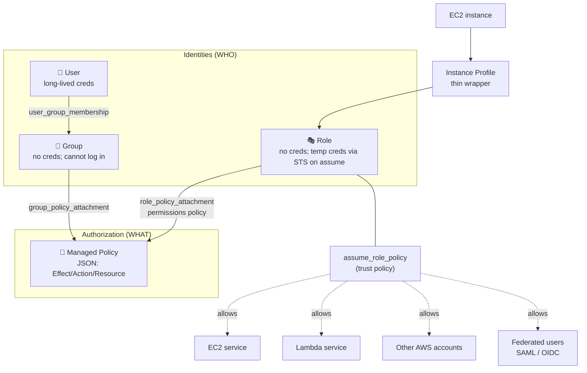

# 01 – IAM (Identity and Access Management)

The global, free AWS service that authenticates and authorizes every AWS API call — every console click, every CLI command, every SDK request gets evaluated against IAM before it reaches the underlying service.

> [!info] Exam TL;DR
> - **IAM is global, free, and always-on.** No region selection. Same identities and policies seen from every region.
> - **Four core objects:** User, Group, Role, Policy. Groups can't log in; only Users can.
> - **Explicit Deny always wins.** Evaluation: implicit deny (default) → explicit Allow lifts it → explicit Deny overrides everything. One Deny anywhere in any attached policy = no access. Order, count, and specificity all don't matter.
> - **Users have long-lived credentials** (password, access key). **Roles have none** — on assume, AWS STS issues temporary credentials (default 1h, max 12h). Prefer Roles + federation for both humans and services.
> - **Roles use two distinct policies:** *trust policy* (`assume_role_policy` — WHO can assume) + *permissions policy* (attached separately — WHAT can be done once assumed). Either half missing = role doesn't work.
> - **Roles reach past AWS APIs.** With **IAM database authentication** an EC2/Lambda role can log in to RDS with a 15-minute token instead of a password — the IAM action is `rds-db:connect` (note: *not* the `rds:` management prefix). See [[07-rds-aurora]].
> - **Existing corporate users?** Don't create IAM users — federate. **AD groups map to IAM roles** via IAM Identity Center (or SAML 2.0), backed by AWS Managed Microsoft AD or AD Connector.
> - **EC2 doesn't attach to a role directly** — it attaches to an *Instance Profile*, a thin wrapper around a role (see [[02-ec2]]). Console hides this; Terraform makes it explicit. (Lambda, ECS, etc. take roles directly.)

## Concept (plain English)

Without IAM, anyone with the AWS account credentials would have full god-level access — no separation of duties, no audit trail, no safe way for services to talk to each other. IAM solves authentication ("who are you?") and authorization ("what are you allowed to do?") for every AWS API call. Identities prove WHO; policies declare WHAT. IAM is global, free, and always-on; it costs nothing to use and there is no opt-in.

## AWS console ↔ Terraform map

| Console / what you want | Terraform resource | Notes |
|---|---|---|
| Create an IAM user | `aws_iam_user` | Console password is separate (`aws_iam_user_login_profile`); access keys are separate (`aws_iam_access_key`). |
| Create an IAM group | `aws_iam_group` | IAM Groups do **not** support tags (AWS-side limitation). |
| Put a user in a group | `aws_iam_user_group_membership` | Additive (user-side). **NOT** `aws_iam_group_membership`, which is exclusive group-side. |
| Create a customer-managed policy | `aws_iam_policy` | `policy` argument takes JSON. Build with `data "aws_iam_policy_document"` for native HCL + plan-time validation. |
| Attach a managed policy to a user/group/role | `aws_iam_user_policy_attachment` / `aws_iam_group_policy_attachment` / `aws_iam_role_policy_attachment` | One resource per (principal, policy) pair. **Avoid** the prefix-less `aws_iam_policy_attachment` — see Traps. |
| Inline policy on a principal | `aws_iam_user_policy` / `aws_iam_group_policy` / `aws_iam_role_policy` | Lives and dies with the principal; not reusable. Prefer managed for reusability. |
| Exclusively manage all policies on one principal | `aws_iam_user_policy_attachments_exclusive` / `aws_iam_group_policy_attachments_exclusive` / `aws_iam_role_policy_attachments_exclusive` | The safe modern way to say "Terraform owns all attachments on this principal." |
| Create a role | `aws_iam_role` | `assume_role_policy` argument = **trust policy**, NOT permissions. |
| Attach the role to an EC2 instance | `aws_iam_instance_profile` + reference from `aws_instance.iam_instance_profile` | EC2 takes an instance profile, not a role directly. Lambda/ECS take roles directly. See [[02-ec2]]. |
| Reference an existing AWS-managed policy | `data "aws_iam_policy"` data source | Or hardcode the ARN (`arn:aws:iam::aws:policy/AmazonS3ReadOnlyAccess` — stable). |
| Build policy JSON natively in HCL | `data "aws_iam_policy_document"` | Validated at plan time; supports interpolation/loops; the idiomatic pattern. |

## Architecture diagram



## Key facts, limits & pricing

- **Global service** — no region picker. Same IAM seen from every region. (The IAM API endpoint historically lives in `us-east-1` infrastructure, but the concept and the data are global.)
- **Free** — no per-user, per-policy, or per-API-call charge. STS calls are free too. Only some advanced features (IAM Identity Center premium features, IAM Access Analyzer findings) have separate pricing.
- **Eventually consistent** — newly created users/roles/policies may take a few seconds to become globally visible. A `terraform apply` that creates a role and immediately tries to use it can race; usually a retry resolves it. Worth knowing for real-world AND exam scenarios.
- **Principal identification is by name; policy identification is by ARN.** Reason: principals only exist within your account (name is unambiguous in that scope); policies may live in the `aws` account namespace (AWS-managed, e.g. `arn:aws:iam::aws:policy/AmazonS3ReadOnlyAccess`) or your account namespace, so the full ARN with account ID is needed for disambiguation.
- **Inline vs managed policies:**
  - *Managed* — standalone, reusable, versioned (up to 5 versions retained, can roll back), attachable to many principals.
  - *Inline* — embedded directly on one principal; deleted when the principal is deleted; not reusable; no versioning.
- **`aws_iam_user.name` is in-place updatable** in the v6 provider (uses AWS `UpdateUser` API). **`aws_iam_policy.name` is NOT** — it has `ForceNew: true`, so renaming a policy destroys and recreates it (the policy ARN embeds the name, so AWS can't rename in place). **Lesson:** behavior is NOT consistent across the IAM resource family; read the plan.
- **Service quotas** (max users per account, max policies per principal, policy size limits, etc.) change over time. ⚠️ Don't memorize specific numbers — refer to the AWS service quotas page (linked in Docs).

## Comparisons

### User vs Role

|   | User | Role |
|---|---|---|
| Credentials | Long-lived (password and/or access key + secret) | None of its own; temporary credentials via STS on assume (default 1h, configurable to 12h) |
| "Owned" by | A specific identity (usually a human) | Nobody — a hat anyone allowed can wear |
| When to use | A specific human (legacy), a specific service account (legacy) | AWS services accessing other AWS services; cross-account access; federated humans; temporary privilege elevation |
| Modern best practice | **Avoid for humans** — prefer IAM Identity Center (federation → role) | Default for everything else |
| Leak risk | Until you rotate the long-lived key, attacker has access | Temporary credentials expire on their own (≤ 12h) |

### Inline vs Managed policy

|   | Inline | Managed (Customer- or AWS-) |
|---|---|---|
| Lifecycle | Lives and dies with the principal | Standalone resource; survives reattach |
| Reusability | One principal only | Attachable to many principals |
| Versioning | None | Up to 5 versions retained; can roll back |
| Use case | Truly one-off (a single role's bespoke permission) | Default; anything reusable |

### Trust policy vs Permissions policy (on a Role)

|   | Trust policy | Permissions policy |
|---|---|---|
| Lives on | The role itself (`assume_role_policy` argument on `aws_iam_role`) | Attached separately (`aws_iam_role_policy_attachment` for managed, `aws_iam_role_policy` for inline) |
| Answers | **Who is allowed to assume me?** | **What can I do once assumed?** |
| Without it | Nobody can assume the role | Role can be assumed but does nothing |
| Common values | `Service: ec2.amazonaws.com`, `Service: lambda.amazonaws.com`, `AWS: arn:aws:iam::<acct>:root` (cross-account), `Federated: <SAML/OIDC provider ARN>` | Standard policy JSON over S3, DynamoDB, etc. |

### Bringing existing corporate identities into AWS (Directory Service + federation)

The exam's phrasing is almost always *"we already have users/groups in on-premises Active Directory — give them AWS access **without creating IAM users**."* The answer is never "create IAM users"; it's federation, and AD groups get **mapped to IAM roles**.

| | **AWS Managed Microsoft AD** | **AD Connector** | **Simple AD** |
|---|---|---|---|
| What it is | a **real** Microsoft AD, run by AWS in your VPC | a **proxy** to your existing on-prem AD | Samba 4, AD-**compatible** (not real AD) |
| Stores directory data in AWS? | ✅ yes | ❌ **no** — forwards sign-in to your on-prem DCs, no sync | ✅ yes (standalone) |
| Trust with on-prem AD? | ✅ yes | n/a (it *is* your on-prem AD) | ❌ **not supported** |
| MFA | ✅ | ✅ (via your existing RADIUS) | ❌ |
| Schema extensions / LDAPS | ✅ | via on-prem | ❌ |
| RDS for SQL Server | ✅ | ❌ not compatible | ❌ not compatible |
| Pick it when | you need actual AD in the cloud, AD-aware apps, or a standalone AD | you *only* need on-prem users to sign in to AWS, no data in AWS | small, cheap, basic AD features / LDAP for Linux |

**How AD groups become AWS permissions.** Either route ends at a role:
- **IAM Identity Center** (the successor to AWS SSO, and the modern answer) connects to AD (or an external IdP), and you map **AD groups → permission sets**, which become IAM roles provisioned into each account. Users get short-term credentials for the console, CLI and SDK.
- **SAML 2.0 federation direct to IAM** — an IAM SAML identity provider plus roles whose trust policy trusts `Federated: <provider ARN>` for `sts:AssumeRoleWithSAML`. Older, more moving parts, still valid.

Either way the AD group is the unit of assignment and the IAM **role** is what actually carries the permissions — the same trust-policy mechanic as the EC2 instance profile and the GitHub OIDC example below, only the trusted principal differs.

> [!tip] Production gap
> For human access, **IAM Identity Center + your existing IdP** (Entra ID, Okta, or AWS Managed Microsoft AD) is the target state — no IAM users, no long-lived access keys, centrally revocable. IAM users survive in production mainly for break-glass and for a few legacy service accounts that can't assume a role.

## Worked examples

> [!example] Worked example — third-party auditor via cross-account role + ExternalId
> Acme Corp hires a cost-optimization vendor that needs read-only access to Acme's account. The vendor monitors many customers, so the trust must be scoped tightly:
> 1. The vendor provides their **AWS account ID** and a **unique customer identifier** — the *ExternalId*. Crucially, the vendor generates it (one per customer); it is *not* a secret, just unique (AWS treats it as viewable by anyone who can see the role).
> 2. Acme creates a role. Trust policy: `"Principal": {"AWS": "<vendor account ID>"}` **plus** `"Condition": {"StringEquals": {"sts:ExternalId": "<id>"}}`. Permissions policy: read-only (e.g. the AWS-managed `ReadOnlyAccess`, or scoped down to Cost Explorer/billing APIs).
> 3. Acme hands the vendor the role ARN; the vendor calls `sts:AssumeRole` with ARN + ExternalId and receives temporary credentials.
>
> In Terraform this is the exact `aws_iam_role` + `data.aws_iam_policy_document` pattern from `01-iam/`, with a `condition {}` block added inside the trust-policy `statement`.

> [!failure] Failure mode — confused deputy (the missing ExternalId)
> The vendor stores role ARNs for hundreds of customers. An attacker signs up as a *legitimate customer* of the vendor, then feeds the vendor **someone else's role ARN** (ARNs are guessable: account ID + role name). The vendor's system dutifully calls `AssumeRole` on the victim's role — and it *works*, because the victim's trust policy trusts the vendor's whole account. The vendor just became a **confused deputy**: tricked into using its legitimate access on behalf of the wrong principal.
> With one ExternalId per customer, the vendor attaches the *attacker's* ExternalId to the call, the victim's trust policy condition fails, and the assume is rejected with `AccessDenied`. This is why AWS docs say the third party must generate the ExternalId — if customers chose their own, an attacker could supply the victim's.

> [!example] Worked example — CI deploys with zero long-lived keys (GitHub Actions OIDC)
> The modern answer to "how does CI get AWS credentials?" — federation, not access keys in CI secrets:
> 1. Register GitHub's OIDC provider in IAM: URL `https://token.actions.githubusercontent.com`, audience `sts.amazonaws.com` (Terraform: `aws_iam_openid_connect_provider`).
> 2. Create a deploy role whose trust policy trusts `Federated: <provider ARN>` for action `sts:AssumeRoleWithWebIdentity`, with a condition on the token's `sub` claim, e.g. `repo:acme/platform:ref:refs/heads/main` — only workflows from *that repo, that branch* can assume it.
> 3. The workflow exchanges its short-lived OIDC token for temporary AWS credentials. Nothing stored, nothing to rotate, nothing to leak.
>
> Same mental model as the EC2 instance profile in [[02-ec2]] — a role with a trust policy — only the trusted principal differs (federated IdP vs `ec2.amazonaws.com`).

## The Terraform I wrote

Code: [`01-iam/main.tf`](../01-iam/main.tf)

Built a minimal user → group → policy → attachment chain (5 resources). Non-obvious bits I hit while writing:

- **`.arn` vs `.name`** — IAM principal cross-references want `.name`; policy references want `.arn`. Got this wrong on the first pass for `user`, `groups`, and `group` arguments; `validate` and `plan` did NOT catch it because both shapes are strings.
- **Quoted vs unquoted references** — wrote `groups = ["aws_iam_group.developers"]` (literal string!) on the first pass instead of `[aws_iam_group.developers.name]` (HCL reference). Same trap: type-valid, only fails at apply.
- **Idiomatic policy authoring** — used `data "aws_iam_policy_document"` to build the policy JSON in HCL instead of a heredoc. Plan-time validation catches Effect/Action typos before AWS sees them.

### Recap lab — `01-iam-lab/` (built 2026-08-29)

A second root module (own state, so it touches nothing in `01-iam`) built to close the two IAM weaknesses the 2026-08-28 mock exposed: **instance profiles** and **`Condition` blocks**. An EC2 role that may read exactly one S3 prefix, and cannot do it over plain HTTP.

Three statements, deliberately three different shapes:

| # | Effect | Action | How it's scoped |
|---|---|---|---|
| 1 | Allow | `s3:GetObject` | **resource ARN** — `bucket/reports/*` |
| 2 | Allow | `s3:ListBucket` | **condition** — `StringLike` on `s3:prefix` |
| 3 | Deny | `s3:*` | **condition** — `Bool aws:SecureTransport = false`, over *both* ARNs |

The lesson is statement 2: `ListBucket` acts on the **bucket**, not the objects, so its resource ARN has no `/*` and cannot express "only this prefix." The scoping has to be a condition. Get it wrong and the role enumerates the whole bucket while the plan looks perfectly reasonable.

> [!tip] Verify a policy without assuming the role — `simulate-principal-policy`
> The role trusts only `ec2.amazonaws.com`, so you can't assume it from your CLI to test it. `aws iam simulate-principal-policy` evaluates the policy for a principal without anyone assuming anything — free, instant, and it accepts `--context-entries` so you can test **condition keys** directly. Crucially it returns `allowed` / `implicitDeny` / **`explicitDeny`** as distinct verdicts, which S3's uniform `AccessDenied` never tells you. Verified results for this lab:
> ```
> ls prefix=reports/            -> allowed        get reports/ok.txt          -> allowed
> ls prefix=secret/             -> implicitDeny   get secret/no.txt           -> implicitDeny
> ls no prefix                  -> implicitDeny   get reports/ok.txt via HTTP -> explicitDeny
> ```

> [!warning] Trap — "the plan showed the policy was fine"
> It didn't, and it couldn't. Because the policy document interpolates `aws_s3_bucket.this.arn`, Terraform reports `data.aws_iam_policy_document.permissions will be read during apply` and the policy renders as `(known after apply)` — while the **trust** policy, which references nothing, renders in full. For any IAM policy built from references to resources created in the same apply, **the plan is not the artifact**. Read it after apply with `aws iam get-policy-version`, or simulate it.

## Scenario MCQs

> [!question]- 1. Alice belongs to `developers`, which has `Allow s3:GetObject` on `my-bucket`. An inline policy is then attached directly to Alice that explicitly Denies `s3:GetObject` on `my-bucket/*`. Can Alice GetObject?
> **A.** Yes — the group's policy was attached first.
> **B.** Yes — there are more Allow statements than Deny.
> **C.** No — explicit Deny in any attached policy overrides any Allow.
> **D.** No — inline policies are more specific than managed policies.
>
> **Answer: C.** IAM evaluation is order-independent and count-independent. One explicit Deny anywhere is sufficient. "Specificity" is not an IAM concept (it is in NTFS ACLs, which is why D is a plausible distractor).

> [!question]- 2. A Lambda function needs to read from a DynamoDB table. Which is the MOST secure approach?
> **A.** Create an IAM user with `dynamodb:GetItem`, put its access keys in the Lambda's environment variables.
> **B.** Create an IAM role with `dynamodb:GetItem` permissions and a trust policy allowing `lambda.amazonaws.com` to assume it; attach the role to the Lambda function.
> **C.** Make the DynamoDB table public and authenticate at the application layer.
> **D.** Share the AWS account's root access key with the Lambda runtime.
>
> **Answer: B.** Role + service trust policy is the canonical pattern; Lambda gets temporary credentials via STS, auto-rotated. A puts a long-lived key in environment variables (leak risk, no rotation); C breaks the security model; D is catastrophic.

> [!question]- 3. You attach an IAM role to an EC2 instance via Terraform. After apply, the instance still says it can't access S3. What's the MOST likely cause?
> **A.** IAM is regional and the role was created in the wrong region.
> **B.** The instance profile is missing or not referenced; you may have attached the role directly to the instance.
> **C.** IAM changes can take a few seconds to propagate; retry the request.
> **D.** Either B or C, depending on how the resource graph was wired.
>
> **Answer: D.** B is a real common bug — `aws_instance.iam_instance_profile` takes an instance profile, not a role. C is the classic propagation race when a role is created and immediately used in the same apply. A is wrong — IAM is global.

> [!question]- 4. Your team wants to give an auditor in another AWS account read-only access to your S3 buckets. Which is the canonical approach?
> **A.** Create an IAM user in your account for the auditor and share access keys.
> **B.** Make the buckets public.
> **C.** Create an IAM role with `s3:Get*` / `s3:List*` permissions and a trust policy allowing the auditor's account as principal; the auditor assumes the role.
> **D.** Add the auditor's email to the bucket ACL.
>
> **Answer: C.** Cross-account role assumption is the standard pattern. A is the legacy/anti-pattern (long-lived keys, no audit trail). B is unsafe. D is the legacy S3 ACL model, increasingly discouraged.

> [!question]- 5. You change `name = "alice"` to `name = "alice2"` on `aws_iam_user.alice`. What does `terraform plan` show?
> **A.** Plans `-/+` (destroy and recreate) because IAM doesn't support renaming.
> **B.** Plans `~` (in-place update) — the provider calls AWS `UpdateUser` with `NewUserName`.
> **C.** Fails at validate — `name` is immutable.
> **D.** Plans no change — `name` is just metadata.
>
> **Answer: B.** `aws_iam_user.name` is NOT `ForceNew` in the v6 provider; it uses the AWS `UpdateUser` API for renames. Different IAM resources behave differently: `aws_iam_policy.name` IS `ForceNew` (destroys and recreates, because the ARN embeds the name). Never assume consistency across the family — read the plan.

## ⚠️ Traps & why the wrong answers are wrong   #trap

> [!warning] Trap — Policy order or count matters
> It doesn't. IAM evaluation is order-independent and count-independent. One explicit Deny anywhere is sufficient.

> [!warning] Trap — Specificity wins
> No. IAM has no "more specific resource ARN wins" rule like NTFS ACLs. A plausible-sounding distractor.

> [!warning] Trap — Roles are only for AWS services
> Roles are also used for cross-account access, federated humans (SAML/OIDC → role), and temporary privilege elevation. Modern best practice prefers roles even for humans.

> [!warning] Trap — Long-lived access keys are fine for service-to-service
> Strongly discouraged — roles + temporary STS credentials are the secure default. Long-lived keys in env vars are an audit and leak risk.

> [!warning] Trap — IAM is regional
> No — global service. Frequent distractor; almost everything else AWS is regional.

> [!warning] Trap — Attach a role directly to an EC2 instance
> EC2 needs an instance profile in between (see [[02-ec2]]). Lambda doesn't.

> [!warning] Trap — All `name` arguments on IAM resources behave the same
> They don't — `aws_iam_user.name` is in-place updatable; `aws_iam_policy.name` forces destroy-and-recreate (ARN embeds the name). Always read the plan for `~` vs `-/+`.

> [!warning] Trap — `validate`/`plan` catch reference bugs (`.arn` vs `.name`, quoted strings)
> They don't — both shapes are type-valid strings. The errors surface only at apply (or silently produce wrong results).

> [!warning] Trap — "create IAM users for the on-premises staff"
> Any question that establishes users **already exist** in Active Directory (or any corporate IdP) and asks how to give them AWS access is testing federation. Creating IAM users duplicates the identity source, and you now have two places to deprovision someone — the exact failure the question is built around. Correct shape: directory (AWS Managed Microsoft AD / AD Connector) → **IAM Identity Center** → AD group mapped to a permission set → **IAM role**. "No new IAM users / no long-term credentials / use existing corporate credentials" are all the same trigger.

> [!warning] Trap — AD Connector vs AWS Managed Microsoft AD
> If the requirement is "**don't store directory data in AWS**" or "keep managing users on-premises with our existing tools," that's **AD Connector** — a proxy that forwards authentication and synchronizes nothing. If they need AD-aware workloads *in* AWS (RDS for SQL Server, .NET apps, EC2 Windows domain join with a standalone directory) or a **trust** with on-prem, that's **AWS Managed Microsoft AD**. **Simple AD** is the cheap one, and it's disqualified the moment a question mentions **trusts, MFA, schema extensions, LDAPS, or RDS SQL Server** — it supports none of them.

> [!warning] Trap — `rds:` vs `rds-db:` for database login
> Giving an application `rds:*` does **not** let it log in to a database — that's the RDS *management* API (create/describe/modify instances). Logging in with IAM auth requires `rds-db:connect` on an `arn:aws:rds-db:…:dbuser:…` resource. See [[07-rds-aurora]].

## 🛠️ Recreate-from-memory drill

> [!example]- Recreate-from-memory drill
> Without looking at `01-iam/main.tf`, write a Terraform config in a fresh directory that:
> 1. Creates an IAM user named `bob`.
> 2. Creates an IAM group named `analysts`.
> 3. Adds `bob` to `analysts` *additively* (don't kick out anyone else).
> 4. Creates a customer-managed policy allowing `s3:GetObject` and `s3:ListBucket` on a bucket named `analytics-data`.
> 5. Attaches the policy to `analysts` using the principal-prefixed (safe) attachment resource.
>
> Use `data "aws_iam_policy_document"` to build the JSON. Run `fmt` → `validate` → `plan`. Goal: a clean plan with `5 to add, 0 to change, 0 to destroy`. No need to apply.
>
> > [!success]- Reference solution
> > See `01-iam/main.tf` — substitute `bob` for `alice`, `analysts` for `developers`, `analytics-data` for `my-bucket`. Structure (5 resources, identical types and reference patterns) is the same.

## 🔴 My weak spots (this topic)   #weak-spot

- [ ] **Enumerating IAM core objects under "list them" framing** — forgot Role in the orient step, even though I clearly knew it (used it correctly in the very next answer). Quick recall under enumeration is a different muscle than recognising/using a concept.
- [ ] **HCL: quoted "reference" vs unquoted reference** — wrote `groups = ["aws_iam_group.developers"]` (literal string) instead of `[aws_iam_group.developers.name]`. Plan didn't catch it because the string is type-valid.
- [ ] **`.arn` vs `.name` in IAM cross-references** — got it wrong for `user`, `groups`, `group` arguments on first pass. Internalize: principals → `.name`, policies → `.arn`.
- [ ] **Reading plan symbols** — was unsure whether renaming a user shows `~` (in-place) or `-/+` (replacement). The deeper habit: trust the plan output, never your memory of provider behavior. Verify against source for anything you'd put in notes.
- [ ] **AD groups mapped to IAM roles — missed while marked _sure_** (mock 2026-08-28, trainer-sourced). Directory Service and IAM Identity Center were **absent from this note** until 2026-08-29. Trigger phrase to catch: *"users already exist in Active Directory."*
- [x] **Instance profile delivers role credentials to EC2 — missed while marked _sure_** (mock 2026-08-28, trainer-sourced). Was decay, not a gap. **Rebuilt from scratch in `01-iam-lab/` on 2026-08-29**, this time in an IAM frame rather than as one line of an EC2 lab, alongside the `Condition` blocks that were the other half of the weakness.
- [ ] **IAM database authentication (`rds-db:connect`) — missed twice, both _sure_** (mock 2026-08-28, trainer-sourced). Roles authenticate to things that aren't AWS API endpoints. See [[07-rds-aurora]].
- [ ] **Scope of `aws_iam_policy_attachment`** — initially explained it as group-side exclusive; it's actually **per-policy** exclusive (manages all attachments of one specific policy across all principals). A different policy added to the same group is invisible to it.

## 🔗 Docs

- [AWS IAM User Guide (entry point)](https://docs.aws.amazon.com/IAM/latest/UserGuide/)
- [IAM Policy Evaluation Logic](https://docs.aws.amazon.com/IAM/latest/UserGuide/reference_policies_evaluation-logic.html) — canonical explanation of explicit-Deny-wins
- [IAM Service Quotas](https://docs.aws.amazon.com/IAM/latest/UserGuide/reference_iam-quotas.html) — current numerical limits; check this rather than memorize
- [Terraform AWS provider — `aws_iam_user`](https://registry.terraform.io/providers/hashicorp/aws/latest/docs/resources/iam_user)
- [Terraform AWS provider — `aws_iam_role`](https://registry.terraform.io/providers/hashicorp/aws/latest/docs/resources/iam_role)
- [Terraform AWS provider — `aws_iam_policy`](https://registry.terraform.io/providers/hashicorp/aws/latest/docs/resources/iam_policy)
- [Terraform AWS provider — `aws_iam_policy_document` data source](https://registry.terraform.io/providers/hashicorp/aws/latest/docs/data-sources/iam_policy_document)
- Verified against v6 provider source (2026-05): `aws_iam_user.name` is NOT `ForceNew` (uses `UpdateUser`); `aws_iam_policy.name` IS `ForceNew` (destroys-and-recreates). `aws_iam_group_policy_attachments_exclusive` exists and ships in v6.
- [ExternalId for third-party access](https://docs.aws.amazon.com/IAM/latest/UserGuide/id_roles_create_for-user_externalid.html) — confused-deputy mitigation; condition syntax verified 2026-06
- [What is AWS Directory Service?](https://docs.aws.amazon.com/directoryservice/latest/admin-guide/what_is.html) — Managed Microsoft AD vs AD Connector vs Simple AD, trust/MFA/LDAPS/RDS-SQL-Server support matrix; verified 2026-08-29
- [GitHub Actions OIDC ↔ AWS](https://docs.github.com/en/actions/deployment/security-hardening-your-deployments/configuring-openid-connect-in-amazon-web-services) — provider URL, audience, `sub` claim format verified 2026-06

---
**Cards for this topic:** [[cards/01-iam-cards]]
