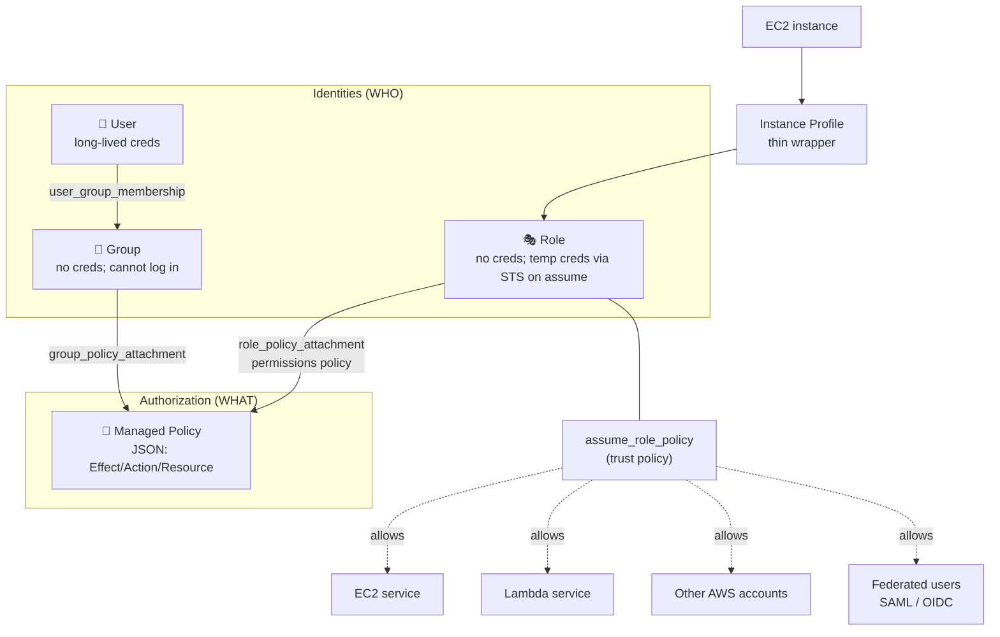

# 01 – IAM (Identity and Access Management)

The global, free AWS service that authenticates and authorizes every AWS API call — every console click, every CLI command, every SDK request gets evaluated against IAM before it reaches the underlying service.

> [!info] Exam TL;DR
> - **IAM is global, free, and always-on.** No region selection. Same identities and policies seen from every region.
> - **Four core objects:** User, Group, Role, Policy. Groups can't log in; only Users can.
> - **Explicit Deny always wins.** Evaluation: implicit deny (default) → explicit Allow lifts it → explicit Deny overrides everything. One Deny anywhere in any attached policy = no access. Order, count, and specificity all don't matter.
> - **Users have long-lived credentials** (password, access key). **Roles have none** — on assume, AWS STS issues temporary credentials (default 1h, max 12h). Prefer Roles + federation for both humans and services.
> - **Roles use two distinct policies:** *trust policy* (`assume_role_policy` — WHO can assume) + *permissions policy* (attached separately — WHAT can be done once assumed). Either half missing = role doesn't work.
> - **Roles reach past AWS APIs.** With **IAM database authentication** an EC2/Lambda role can log in to RDS with a 15-minute token instead of a password — the IAM action is `rds-db:connect` (note: *not* the `rds:` management prefix). See [[07-rds-aurora]].
> - **Existing corporate users?** Don't create IAM users — federate. **AD groups map to IAM roles** via IAM Identity Center (or SAML 2.0), backed by AWS Managed Microsoft AD or AD Connector.
> - **EC2 doesn't attach to a role directly** — it attaches to an *Instance Profile*, a thin wrapper around a role (see [[02-ec2]]). The console hides the wrapper entirely. (Lambda, ECS, etc. take roles directly.)

> [!tip] Multi-account layer
> Organizations, SCPs, permissions boundaries, ABAC and Control Tower live in **[[01-iam-advanced]]** — the Udemy "IAM Advanced" section. This note is the foundations.

## What problem does this solve?

Imagine an AWS account with no IAM. There is one set of credentials, and whoever holds them can do everything: read every bucket, delete every database, spin up anything, close the account. No separation of duties. No audit trail. And no safe way for one service to talk to another — the only thing you could hand your application is that same god-level credential.

IAM is the layer that fixes this. It answers two questions on every single request: **"who are you?"** (authentication) and **"what are you allowed to do?"** (authorization). Nothing reaches S3 or EC2 or RDS until both have been answered.

The split matters, because it's the split the whole service is built on. **Identities prove WHO.** **Policies declare WHAT.** They are separate objects and you wire them together. There are four things to know: **User**, **Group**, **Role**, **Policy**. User, Group and Role sit on the identity side; the Policy is the WHAT. A Group holds no credentials of its own and cannot log in — you drop Users into it and attach the policy to the Group.

Two properties are easy to skim past. IAM is **global** — there is no region picker, and the user you create is the same user seen from every region. And IAM is **free** and always-on: no per-user, per-policy or per-call charge, nothing to enable, nothing to opt into.

> In one line: IAM decides who you are and what you may do on every AWS API call — global, free, and never optional.

## How it actually works

### Explicit Deny wins, and nothing else counts

Some access systems do resolve conflicts by ranking rules — NTFS ACLs, where the more specific rule wins. IAM has no such rule, and expecting one is exactly the kind of plausible-sounding wrong answer the exam is built out of.

There are only three states, and they resolve in a fixed order:

| State | What it means |
|---|---|
| **Implicit deny** | The default. You start with nothing. Say nothing about an action and it stays denied. |
| **Explicit Allow** | Lifts the implicit deny for that action. |
| **Explicit Deny** | Overrides everything. Nothing lifts it. |

Walk a real one. Alice is in the `developers` group, which carries `Allow s3:GetObject` on `my-bucket`. Someone then attaches an inline policy directly to Alice that explicitly Denies `s3:GetObject` on `my-bucket/*`. Can she read the object?

No. And the reasons people give for "yes" are all the traps:

- *"The group's Allow was attached first."* Order is irrelevant — IAM evaluates the whole set, not a sequence.
- *"There are more Allows than Denies."* Count is irrelevant too. One Deny anywhere in any attached policy is enough.
- *"The inline policy is more specific."* There is no specificity rule in IAM. That rule exists in NTFS ACLs, which is exactly why it *sounds* right.

Once you see that the default is deny, the rest follows. An Allow is the only thing that can open anything, so nothing is ever accidentally left open. And a Deny can never be out-voted by piling on more Allows, so a Deny is a guarantee rather than a vote.

The three states are real, not just a mental model — `aws iam simulate-principal-policy` reports them as distinct verdicts: `allowed`, `implicitDeny`, `explicitDeny`. Worth knowing, because the service itself won't tell you: S3 returns the same flat `AccessDenied` whichever of the two denials it was.

> In one line: the default is no, an Allow lifts it, and an explicit Deny puts it back forever — order, count and specificity change nothing.

### A role is a hat, and it needs two policies

A User is a specific someone. It owns long-lived credentials — a console password, an access key and secret — and those stay valid until you rotate them. Which is the problem: if one leaks, the attacker has access for as long as you don't notice.

A Role is not a someone. It's a hat that anybody permitted may put on. It owns **no credentials at all**. When something assumes it, AWS STS mints **temporary** credentials on the spot — default one hour, up to twelve. Nothing to store, nothing to rotate, and a leak expires on its own.

Because a role belongs to nobody, one object has to answer two completely different questions, and it does so with two completely separate policies:

| | **Trust policy** | **Permissions policy** |
|---|---|---|
| The question | *Who is allowed to wear this hat?* | *What can the wearer do?* |
| Where it lives | On the role itself — the `assume_role_policy` argument | Attached separately, like any other policy |
| If it's missing | Nobody can assume the role at all | The role assumes fine and then does nothing |

Both halves are required, and the failure modes look nothing alike, which is what makes the distinction stick. Forget the trust policy and the door won't open. Forget the permissions policy and the door opens onto an empty room.

The trust policy is also where a role's reach comes from. Change nothing but the principal it trusts and the same mechanic covers wildly different cases: `Service: ec2.amazonaws.com` for an instance, `Service: lambda.amazonaws.com` for a function, another account's ARN for cross-account access, or `Federated: <provider ARN>` for a human arriving via SAML or a CI job arriving via OIDC. It's one pattern wearing different clothes.

And roles reach past AWS's own APIs. With **IAM database authentication**, an EC2 or Lambda role logs in to RDS using a 15-minute token instead of a stored database password. Watch the action name: it is `rds-db:connect`, *not* the `rds:` management prefix.

> In one line: a role is a credential-less hat — the trust policy says who may wear it, the permissions policy says what it can do, and either half missing breaks it differently.

### The instance profile — the wrapper the console hides

Here is a rule that looks like a typo until you've been bitten by it. **An EC2 instance cannot be given a role directly.** It is given an *instance profile*, a thin wrapper around a role that delivers the role's credentials to the instance.

Lambda takes a role directly. ECS takes a role directly. EC2 is the odd one.

You never notice this in the console, because the console creates the instance profile for you, silently, and shows you only the role.

Which gives this failure a signature worth memorising: the apply succeeds, the role exists, the role's permissions are correct — and the instance still can't reach S3. Two likely causes, and both are ordinary. Either the instance profile is missing or unreferenced (a role went where a profile belonged), or you hit IAM's **eventual consistency** — a brand-new role can take a few seconds to become visible everywhere, so an apply that creates a role and immediately uses it can race. Usually a retry resolves that one.

> In one line: EC2 wears the hat through an instance profile, not the role itself — the console hides that wrapper, and EC2 is the only service with it.

### When the users already exist somewhere else

A company with an on-premises Active Directory has, say, four hundred staff. They need AWS access. The instinct is to create four hundred IAM users. That is always the wrong answer, and exam questions are built on the instinct.

The reason is deprovisioning. Copy the identities into IAM and the same person now exists in two systems. When they leave, someone has to remember to remove them from both — and the day someone forgets is the failure the question is really about. Federation avoids that duplicate: nobody gets a parallel IAM user, so there stays exactly one place to deprovision them.

The route ends at a **role** in every case. **AD groups map to IAM roles.** Two ways to get there:

- **IAM Identity Center** (the successor to AWS SSO, and the modern answer). It connects to AD or an external IdP; you map AD groups to **permission sets**, which are provisioned into each account as IAM roles. Users get short-term credentials for the console, the CLI and the SDK.
- **SAML 2.0 federation straight to IAM** — register a SAML identity provider, then create roles whose trust policy trusts `Federated: <provider ARN>` for `sts:AssumeRoleWithSAML`. Older, more moving parts, still valid.

Behind either one sits a directory, and which one is a question in its own right. **AWS Managed Microsoft AD** is a real Microsoft AD run by AWS in your VPC — pick it when you need actual AD in the cloud, AD-aware apps, RDS for SQL Server, or a trust with on-prem. **AD Connector** is a proxy: it forwards sign-ins to your on-prem domain controllers and stores no directory data in AWS at all, which is precisely the phrase a question will use to point at it. **Simple AD** is the cheap Samba-4 lookalike, and it's disqualified the instant a question mentions trusts, MFA, schema extensions, LDAPS or RDS SQL Server — it supports none of them.

Notice that this is the trust-policy mechanic again. AD group, EC2 instance, GitHub Actions workflow — every one of them ends up assuming a role. Only the principal the trust policy names changes.

> In one line: if the users already exist, don't copy them — federate, and the AD group ends up wearing an IAM role.

### Reading a policy document in twenty seconds

Nearly a quarter of the IAM questions in the practice bank show you a JSON policy and ask
what it does. It is a **skill**, not a fact, and it is worth drilling as one. Read the
elements in this order — the answer usually falls out before you reach the end:

1. **`Effect`** — `Allow` or `Deny`. A `Deny` anywhere wins, so read denies first.
2. **`Action`** — what verb, and is it wildcarded? `s3:*Object` is not `s3:DeleteObject`.
3. **`Resource`** — and specifically **where the `/*` sits**. `arn:aws:s3:::bucket` is the
   *bucket*; `arn:aws:s3:::bucket/*` is the *objects*. `bucket*` is neither — it is a
   prefix match on bucket **names**. Bucket-level actions like `s3:ListBucket` need the
   bare bucket ARN; object actions need `/*`. A policy that gets this wrong fails silently.
4. **`Condition`** — which key, and what does it actually measure?
   - `aws:SourceIp` — the IP the **API call originates from**. Not the instance's public
     IP, not an Elastic IP, not a private IP.
   - `aws:RequestedRegion` — the region the **API call targets**. The caller can sit
     anywhere; this constrains *where the resource goes*, not *where you are*.
   - `aws:MultiFactorAuthPresent` — MFA used for this session.
5. **`Principal`** — present only in a **resource-based** policy. If you see one, you are
   reading a bucket policy or a trust policy, not an identity policy.

> In one line: read Effect → Action → Resource (watch the `/*`) → Condition, and the
> condition key is almost always the thing being tested.

## Architecture diagram


```mermaid
flowchart TD
    subgraph IDS["Identities (WHO)"]
        U["👤 User<br/>long-lived creds"]
        G["👥 Group<br/>no creds; cannot log in"]
        R["🎭 Role<br/>no creds; temp creds via STS on assume"]
    end

    subgraph POL["Authorization (WHAT)"]
        P1["📜 Managed Policy<br/>JSON: Effect/Action/Resource"]
    end

    U -- user_group_membership --> G
    G -- group_policy_attachment --> P1
    R -- role_policy_attachment<br/>permissions policy --> P1

    R --- T["assume_role_policy<br/>(trust policy)"]
    T -. allows .-> EC2svc["EC2 service"]
    T -. allows .-> Lambdasvc["Lambda service"]
    T -. allows .-> XAcct["Other AWS accounts"]
    T -. allows .-> Fed["Federated users<br/>SAML / OIDC"]

    EC2I["EC2 instance"] --> IP["Instance Profile<br/>thin wrapper"] --> R
```

## Key facts, limits & pricing

- **Securing a brand-new account (the root user):** use a **strong, unique password** and **turn on MFA for the root user** — AWS now states that **all account types (standalone, management, member) require MFA for their root user**, registered within **35 days** of the first console sign-in attempt, and you may register **up to 8 MFA devices**. Use root only for [the tasks that require it](https://docs.aws.amazon.com/IAM/latest/UserGuide/root-user-tasks.html), and **never share** the root password, MFA, access keys, CloudFront key pairs or signing certificates. For accounts inside **Organizations**, AWS recommends **removing root credentials from member accounts** entirely — password, access keys, signing certificates and MFA — after which those accounts cannot sign in as root at all.
  **The testable point:** root **access keys should not exist**. Distractors that offer to *encrypt* root keys and store them in S3, or share them "only with the owner", or email them, are all wrong however careful the handling sounds. *(Verified 2026-10-01.)*

- **The trust policy is the only resource-based policy IAM itself supports.** AWS's wording: *"The IAM service supports only one type of resource-based policy called a role trust policy, which is attached to an IAM role."* A role is therefore **both an identity and a resource**, which is why it needs two policies. If a question asks "which is the only resource-based policy in IAM", the answer is the **trust policy** — permissions boundaries, SCPs and ACLs are all something else.
- **AWS now lists nine policy types:** identity-based · resource-based · VPC endpoint policies · permissions boundaries · SCPs · **RCPs** · ACLs · **RAM resource shares** · session policies. Only identity-based and resource-based ones *grant*; the rest only ever **cap**.

- **Global service** — no region picker. Same IAM seen from every region. (The IAM API endpoint historically lives in `us-east-1` infrastructure, but the concept and the data are global.)
- **Free** — no per-user, per-policy, or per-API-call charge. STS calls are free too, and **IAM Identity Center is free**. Access Analyzer's external-access findings, policy validation and policy generation are free; only its **unused access** and **internal access** analyzers and custom policy checks bill.
- **Eventually consistent** — newly created users/roles/policies may take a few seconds to become globally visible. Automation that creates a role and uses it a second later can race; a retry usually resolves it. Worth knowing for real-world AND exam scenarios.
- **Principal identification is by name; policy identification is by ARN.** Reason: principals only exist within your account (name is unambiguous in that scope); policies may live in the `aws` account namespace (AWS-managed, e.g. `arn:aws:iam::aws:policy/AmazonS3ReadOnlyAccess`) or your account namespace, so the full ARN with account ID is needed for disambiguation.
- **Inline vs managed policies:**
  - *Managed* — standalone, reusable, versioned (up to 5 versions retained, can roll back), attachable to many principals.
  - *Inline* — embedded directly on one principal; deleted when the principal is deleted; not reusable; no versioning.
- **Service quotas** (max users per account, max policies per principal, policy size limits, etc.) change over time. ⚠️ Don't memorize specific numbers — refer to the AWS service quotas page (linked in Docs).

## Comparisons

### User vs Role

|   | User | Role |
|---|---|---|
| Credentials | Long-lived (password and/or access key + secret) | None of its own; temporary credentials via STS on assume (default 1h, configurable to 12h) |
| "Owned" by | A specific identity (usually a human) | Nobody — a hat anyone allowed can wear |
| When to use | A specific human (legacy), a specific service account (legacy) | AWS services accessing other AWS services; cross-account access; federated humans; temporary privilege elevation |
| Modern best practice | **Avoid for humans** — prefer IAM Identity Center (federation → role) | Default for everything else |
| Leak risk | Until you rotate the long-lived key, attacker has access | Temporary credentials expire on their own (≤ 12h) |

### Inline vs Managed policy

|   | Inline | Managed (Customer- or AWS-) |
|---|---|---|
| Lifecycle | Lives and dies with the principal | Standalone resource; survives reattach |
| Reusability | One principal only | Attachable to many principals |
| Versioning | None | Up to 5 versions retained; can roll back |
| Use case | Truly one-off (a single role's bespoke permission) | Default; anything reusable |

### Trust policy vs Permissions policy (on a Role)

|   | Trust policy | Permissions policy |
|---|---|---|
| Lives on | The role itself — it is part of the role | Attached to the role separately, as a managed or inline policy |
| Answers | **Who is allowed to assume me?** | **What can I do once assumed?** |
| Without it | Nobody can assume the role | Role can be assumed but does nothing |
| Common values | `Service: ec2.amazonaws.com`, `Service: lambda.amazonaws.com`, `AWS: arn:aws:iam::<acct>:root` (cross-account), `Federated: <SAML/OIDC provider ARN>` | Standard policy JSON over S3, DynamoDB, etc. |

### How an application authenticates to RDS

|   | Password in config | Password in Secrets Manager | **IAM database authentication** |
|---|---|---|---|
| What the app presents to the DB | a long-lived password | a password fetched at runtime from the secret | an **authentication token, lifetime 15 minutes** |
| Credential stored anywhere? | yes, forever | yes — but Secrets Manager rotates it on a schedule (a **Lambda rotation function** for application credentials; **managed rotation**, no Lambda, for RDS/Aurora *master user* credentials) | **no password at all** |
| Who the DB is really trusting | whoever holds the password | whoever may read the secret | the caller's **IAM role** — e.g. the EC2 instance profile or the Lambda role |
| IAM action required | — | `secretsmanager:GetSecretValue` | **`rds-db:connect`** on `arn:aws:rds-db:…:dbuser:…` |
| Traffic encrypted in transit? | only if you configure SSL/TLS yourself | only if you configure SSL/TLS yourself | **yes** — AWS lists it as a benefit: *"Network traffic to and from the database is encrypted using Secure Socket Layer (SSL) or Transport Layer Security (TLS)"*. Not the same as "no TLS setup": the client still points at the RDS CA bundle (`--ssl-ca` / `sslrootcert`) |
| Extra setup beyond IAM | — | rotation function with network access to the DB | **enable IAM DB auth on the instance/cluster**, **create the DB user** — MySQL/MariaDB `CREATE USER 'jane_doe' IDENTIFIED WITH AWSAuthenticationPlugin AS 'RDS';`, PostgreSQL `CREATE USER db_userx; GRANT rds_iam TO db_userx;` — and pass the CA bundle from the client |
| Engines | all | all | **RDS MariaDB, MySQL, PostgreSQL; Aurora MySQL, Aurora PostgreSQL** — not Oracle, not SQL Server |
| Exam trigger | — | "rotate the database password automatically" | "**short-lived / temporary credentials** to the database", "**no password stored** in the application", "use the **EC2 instance's profile credentials** to reach the database" |

### Bringing existing corporate identities into AWS (Directory Service + federation)

The exam's phrasing is almost always *"we already have users/groups in on-premises Active Directory — give them AWS access **without creating IAM users**."* The answer is never "create IAM users"; it's federation, and AD groups get **mapped to IAM roles**.

| | **AWS Managed Microsoft AD** | **AD Connector** | **Simple AD** |
|---|---|---|---|
| What it is | a **real** Microsoft AD, run by AWS in your VPC | a **proxy** to your existing on-prem AD | Samba 4, AD-**compatible** (not real AD) |
| Stores directory data in AWS? | ✅ yes | ❌ **no** — forwards sign-in to your on-prem DCs, no sync | ✅ yes (standalone) |
| Trust with on-prem AD? | ✅ yes | n/a (it *is* your on-prem AD) | ❌ **not supported** |
| MFA | ✅ | ✅ (via your existing RADIUS) | ❌ |
| Schema extensions / LDAPS | ✅ | via on-prem | ❌ |
| RDS for SQL Server | ✅ | ❌ not compatible | ❌ not compatible |
| Pick it when | you need actual AD in the cloud, AD-aware apps, or a standalone AD | you *only* need on-prem users to sign in to AWS, no data in AWS | small, cheap, basic AD features / LDAP for Linux |

**How AD groups become AWS permissions.** Either route ends at a role:
- **IAM Identity Center** (the successor to AWS SSO, and the modern answer) connects to AD (or an external IdP), and you map **AD groups → permission sets**, which become IAM roles provisioned into each account. Users get short-term credentials for the console, CLI and SDK.
- **SAML 2.0 federation direct to IAM** — an IAM SAML identity provider plus roles whose trust policy trusts `Federated: <provider ARN>` for `sts:AssumeRoleWithSAML`. Older, more moving parts, still valid.

Either way the AD group is the unit of assignment and the IAM **role** is what actually carries the permissions — the same trust-policy mechanic as the EC2 instance profile and the GitHub OIDC example below, only the trusted principal differs.

> [!tip] Production gap
> For human access, **IAM Identity Center + your existing IdP** (Entra ID, Okta, or AWS Managed Microsoft AD) is the target state — no IAM users, no long-lived access keys, centrally revocable. IAM users survive in production mainly for break-glass and for a few legacy service accounts that can't assume a role.

## Worked examples

> [!example] Worked example — third-party auditor via cross-account role + ExternalId
> Acme Corp hires a cost-optimization vendor that needs read-only access to Acme's account. The vendor monitors many customers, so the trust must be scoped tightly:
> 1. The vendor provides their **AWS account ID** and a **unique customer identifier** — the *ExternalId*. Crucially, the vendor generates it (one per customer); it is *not* a secret, just unique (AWS treats it as viewable by anyone who can see the role).
> 2. Acme creates a role. Trust policy: `"Principal": {"AWS": "<vendor account ID>"}` **plus** `"Condition": {"StringEquals": {"sts:ExternalId": "<id>"}}`. Permissions policy: read-only (e.g. the AWS-managed `ReadOnlyAccess`, or scoped down to Cost Explorer/billing APIs).
> 3. Acme hands the vendor the role ARN; the vendor calls `sts:AssumeRole` with ARN + ExternalId and receives temporary credentials.
>

> [!failure] Failure mode — confused deputy (the missing ExternalId)
> The vendor stores role ARNs for hundreds of customers. An attacker signs up as a *legitimate customer* of the vendor, then feeds the vendor **someone else's role ARN** (ARNs are guessable: account ID + role name). The vendor's system dutifully calls `AssumeRole` on the victim's role — and it *works*, because the victim's trust policy trusts the vendor's whole account. The vendor just became a **confused deputy**: tricked into using its legitimate access on behalf of the wrong principal.
> With one ExternalId per customer, the vendor attaches the *attacker's* ExternalId to the call, the victim's trust policy condition fails, and the assume is rejected with `AccessDenied`. This is why AWS docs say the third party must generate the ExternalId — if customers chose their own, an attacker could supply the victim's.

> [!example] Worked example — CI deploys with zero long-lived keys (GitHub Actions OIDC)
> The modern answer to "how does CI get AWS credentials?" — federation, not access keys in CI secrets:
> 1. Register GitHub's OIDC provider in IAM: URL `https://token.actions.githubusercontent.com`, audience `sts.amazonaws.com`.
> 2. Create a deploy role whose trust policy trusts `Federated: <provider ARN>` for action `sts:AssumeRoleWithWebIdentity`, with a condition on the token's `sub` claim, e.g. `repo:acme/platform:ref:refs/heads/main` — only workflows from *that repo, that branch* can assume it.
> 3. The workflow exchanges its short-lived OIDC token for temporary AWS credentials. Nothing stored, nothing to rotate, nothing to leak.
>
> Same mental model as the EC2 instance profile in [[02-ec2]] — a role with a trust policy — only the trusted principal differs (federated IdP vs `ec2.amazonaws.com`).

> [!tip] Verify a policy without assuming the role — `simulate-principal-policy`
> The role trusts only `ec2.amazonaws.com`, so you can't assume it from your CLI to test it. `aws iam simulate-principal-policy` evaluates the policy for a principal without anyone assuming anything — free, instant, and it accepts `--context-entries` so you can test **condition keys** directly. Crucially it returns `allowed` / `implicitDeny` / **`explicitDeny`** as distinct verdicts, which S3's uniform `AccessDenied` never tells you. Verified results for this lab:
> ```
> ls prefix=reports/            -> allowed        get reports/ok.txt          -> allowed
> ls prefix=secret/             -> implicitDeny   get secret/no.txt           -> implicitDeny
> ls no prefix                  -> implicitDeny   get reports/ok.txt via HTTP -> explicitDeny
> ```

> [!warning] Trap — "the plan showed the policy was fine"
> It didn't, and it couldn't. A policy whose `Resource` is the ARN of a bucket being created in the same operation cannot be rendered before that bucket exists — so the permissions policy is unknowable in advance, while the **trust** policy, which references nothing, is fully known. The lesson: for any IAM policy built from resources created alongside it, **inspect the policy after it exists** with `aws iam get-policy-version`, or test it with the policy simulator. Do not assume the version you intended is the version that shipped.

## ⚠️ Traps & why the wrong answers are wrong   #trap

> [!warning] Trap — Policy order or count matters
> It doesn't. IAM evaluation is order-independent and count-independent. One explicit Deny anywhere is sufficient.

> [!warning] Trap — Specificity wins
> No. IAM has no "more specific resource ARN wins" rule like NTFS ACLs. A plausible-sounding distractor.

> [!warning] Trap — Roles are only for AWS services
> Roles are also used for cross-account access, federated humans (SAML/OIDC → role), and temporary privilege elevation. Modern best practice prefers roles even for humans.

> [!warning] Trap — Long-lived access keys are fine for service-to-service
> Strongly discouraged — roles + temporary STS credentials are the secure default. Long-lived keys in env vars are an audit and leak risk.

> [!warning] Trap — IAM is regional
> No — global service. Frequent distractor; almost everything else AWS is regional.

> [!warning] Trap — Attach a role directly to an EC2 instance
> EC2 needs an instance profile in between (see [[02-ec2]]). Lambda doesn't.

> [!warning] Trap — All `name` arguments on IAM resources behave the same
> A policy's **ARN embeds its name**, so AWS cannot rename one in place — renaming means creating a new policy and re-attaching it everywhere. A **user** can be renamed in place.

> [!warning] Trap — `validate`/`plan` catch reference bugs (`.arn` vs `.name`, quoted strings)
> They don't — both shapes are type-valid strings. The errors surface only at apply (or silently produce wrong results).

> [!warning] Trap — "create IAM users for the on-premises staff"
> Any question that establishes users **already exist** in Active Directory (or any corporate IdP) and asks how to give them AWS access is testing federation. Creating IAM users duplicates the identity source, and you now have two places to deprovision someone — the exact failure the question is built around. Correct shape: directory (AWS Managed Microsoft AD / AD Connector) → **IAM Identity Center** → AD group mapped to a permission set → **IAM role**. "No new IAM users / no long-term credentials / use existing corporate credentials" are all the same trigger.

> [!warning] Trap — "IAM Groups" in a federation question
> The word *group* carries two meanings in these questions and only one of them is an answer. An **IAM group is a container of IAM users and nothing else** — AWS: *"User groups can't be nested; they can contain only users, not other IAM groups"*, and *"You cannot identify a user group as a `Principal` in a policy … because groups relate to permissions, not authentication."* So a federated identity — an AD user arriving via IAM Identity Center or SAML — can **never** land in an IAM group; there is no IAM user for it to be a member of.
> In "our users already exist in Active Directory", the group being mapped is the **AD group**, and the thing it maps to is always an **IAM role** (via IAM Identity Center: *"When you assign a permission set, IAM Identity Center creates corresponding IAM Identity Center-controlled IAM roles in each account"*). If an option offers "IAM Groups" as the identity landing point, it is the distractor; if an option offers "configure an IAM role and a policy", that is the half of the answer you must select, not skip.

> [!warning] Trap — AD Connector vs AWS Managed Microsoft AD
> If the requirement is "**don't store directory data in AWS**" or "keep managing users on-premises with our existing tools," that's **AD Connector** — a proxy that forwards authentication and synchronizes nothing. If they need AD-aware workloads *in* AWS (RDS for SQL Server, .NET apps, EC2 Windows domain join with a standalone directory) or a **trust** with on-prem, that's **AWS Managed Microsoft AD**. **Simple AD** is the cheap one, and it's disqualified the moment a question mentions **trusts, MFA, schema extensions, LDAPS, or RDS SQL Server** — it supports none of them.

> [!warning] Trap — `rds:` vs `rds-db:` for database login
> Giving an application `rds:*` does **not** let it log in to a database — that's the RDS *management* API (create/describe/modify instances). Logging in with IAM auth requires `rds-db:connect` on an `arn:aws:rds-db:…:dbuser:…` resource. See [[07-rds-aurora]].

> [!warning] Trap — SSL/TLS is not authentication
> "The application must connect **without a stored database password**" is answered by **IAM database authentication**, never by an SSL/TLS option. `--ssl-ca`, "configure SSL", "force TLS" change how the connection is *encrypted*; they say nothing about *who may log in*. IAM DB auth brings the encryption with it — AWS: *"Network traffic to and from the database is encrypted using Secure Socket Layer (SSL) or Transport Layer Security (TLS)"* — but that is **not** the same as "no TLS setup": AWS's own connect command still passes the RDS CA bundle (`mysql … --ssl-ca=global-bundle.pem --enable-cleartext-plugin`). The point is which *question* the option answers, not that TLS configuration disappears.
> Two sibling distractors on the same stem:
> - **"Create an IAM role and attach it to the EC2 instances"** — only half the answer. You must also **enable IAM DB authentication on the DB instance** *and* **create the matching DB user** (`IDENTIFIED WITH AWSAuthenticationPlugin AS 'RDS'` for MySQL/MariaDB, `GRANT rds_iam` for PostgreSQL). A role alone logs in to nothing.
> - **"Use STS"** — what the database sees is not an STS token. It is an RDS auth token (`aws rds generate-db-auth-token`), SigV4-signed, **valid 15 minutes**, passed as the password. STS is still upstream — the instance-profile credentials that sign the token are STS credentials, and they must still be valid at connect time — but STS is not what you present to the database.

## 🔴 My weak spots (this topic)   #weak-spot

- [ ] **Enumerating IAM core objects under "list them" framing** — forgot Role in the orient step, even though I clearly knew it (used it correctly in the very next answer). Quick recall under enumeration is a different muscle than recognising/using a concept.
- [ ] **HCL: quoted "reference" vs unquoted reference** — wrote `groups = ["aws_iam_group.developers"]` (literal string) instead of `[aws_iam_group.developers.name]`. Plan didn't catch it because the string is type-valid.
- [ ] **`.arn` vs `.name` in IAM cross-references** — got it wrong for `user`, `groups`, `group` arguments on first pass. Internalize: principals → `.name`, policies → `.arn`.
- [ ] **Reading plan symbols** — was unsure whether renaming a user shows `~` (in-place) or `-/+` (replacement). The deeper habit: trust the plan output, never your memory of provider behavior. Verify against source for anything you'd put in notes.
- [ ] **AD groups mapped to IAM roles — missed while marked _sure_** (mock 2026-08-28, trainer-sourced). Directory Service and IAM Identity Center were **absent from this note** until 2026-08-29. Trigger phrase to catch: *"users already exist in Active Directory."*
- [x] **Instance profile delivers role credentials to EC2 — missed while marked _sure_** (mock 2026-08-28, trainer-sourced). Was decay, not a gap. **Rebuilt from scratch in `01-iam-lab/` on 2026-08-29**, this time in an IAM frame rather than as one line of an EC2 lab, alongside the `Condition` blocks that were the other half of the weakness.
- [ ] **IAM database authentication (`rds-db:connect`) — missed twice, both _sure_** (mock 2026-08-28, trainer-sourced). Roles authenticate to things that aren't AWS API endpoints. See [[07-rds-aurora]].

## 🔗 Docs
- [Root user best practices](https://docs.aws.amazon.com/IAM/latest/UserGuide/root-user-best-practices.html)

- [AWS IAM User Guide (entry point)](https://docs.aws.amazon.com/IAM/latest/UserGuide/introduction.html)
- [IAM Policy Evaluation Logic](https://docs.aws.amazon.com/IAM/latest/UserGuide/reference_policies_evaluation-logic.html) — canonical explanation of explicit-Deny-wins
- [IAM Service Quotas](https://docs.aws.amazon.com/IAM/latest/UserGuide/reference_iam-quotas.html) — current numerical limits; check this rather than memorize
- [ExternalId for third-party access](https://docs.aws.amazon.com/IAM/latest/UserGuide/id_roles_create_for-user_externalid.html) — confused-deputy mitigation; condition syntax verified 2026-06
- [What is AWS Directory Service?](https://docs.aws.amazon.com/directoryservice/latest/admin-guide/what_is.html) — Managed Microsoft AD vs AD Connector vs Simple AD, trust/MFA/LDAPS/RDS-SQL-Server support matrix; verified 2026-08-29
- [GitHub Actions OIDC ↔ AWS](https://docs.github.com/en/actions/deployment/security-hardening-your-deployments/configuring-openid-connect-in-amazon-web-services) — provider URL, audience, `sub` claim format verified 2026-06
