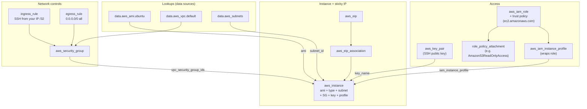

# 02 – EC2 (Elastic Compute Cloud)

The IaaS foundation of AWS: virtual servers (instances) you rent on AWS infrastructure with full OS control. AWS's first major service (2006). Many other AWS services run on EC2 under the hood (RDS, EKS data plane, classic ECS) — abstracted away from you, but the compute is there.

## What problem does this solve?

You need a computer to run your software on. Buying one means choosing its size before you know what you need, and then living with that choice.

EC2 rents you one instead. You pick an OS image, you pick a hardware shape, and a virtual server boots in an AWS data centre with you holding full control of the operating system. Linux on-demand instances bill **per second** after a 60-second minimum, so a machine you needed for ten minutes costs you ten minutes. Stop it and the compute billing stops.

Got the size wrong? Change it. The hardware shape is a setting, not a purchase.

This was AWS's first major service (2006), and it is still the floor the rest stands on — RDS, the EKS data plane and classic ECS all run on EC2 underneath, abstracted away from you.

The price of that control is that everything a physical machine used to decide for you — where it sits, what disk it has, who may reach it, what identity it carries — is now a separate decision you have to make on purpose.

> In one line: EC2 rents you a virtual server by the second and hands you every decision a physical one would have made for you.

## How it actually works

### What an instance is actually made of

An instance isn't a single thing you create. It's an assembly, and the console launch wizard walks you through the parts in order:

| Part | What it decides |
|---|---|
| AMI | the template it boots from — for modern EBS-backed AMIs, metadata plus a reference to EBS snapshots |
| Instance type | CPU, memory and network sizing |
| Subnet | which VPC, and which AZ |
| Security group(s) | who may reach it over the network |
| Key pair | how you SSH in |
| EBS volumes | its storage |
| User data | a script run at boot (optional) |
| IAM instance profile | its identity for calling AWS APIs (optional) |
| Tags | the labels you hang on it |

Two of those parts are quietly more consequential than they look.

**The AMI is region-scoped.** An `ami-…` ID means something in exactly one region. The same image in another region is a different ID, produced by `aws ec2 copy-image`. This is why hardcoding an AMI ID in Terraform is a trap: the config silently stops being portable. Use `data "aws_ami"` with `owners` + a name filter and let it look up the latest match for whatever region you happen to be in.

**The subnet decides the Availability Zone.** You pick a subnet, and that subnet already lives in one AZ inside one VPC — so picking the subnet is what settles both. That makes placement effectively permanent: you cannot stop an instance and start it in a different AZ. Moving means snapshot and relaunch there.

Those two facts also explain which changes Terraform can make in place and which force a replacement. Change `instance_type` and it's an in-place update (`~`): the provider stops the instance, modifies it, starts it again — about 1–3 minutes of downtime, same instance ID, EBS and EIP intact. Change the `ami` and it's destroy-and-recreate (`-/+`), because you can't swap the disk image out from under a running OS. Change `subnet_id` and it replaces too, because the subnet determines the AZ. Read the plan symbols; they're telling you which category you're in.

> In one line: the AMI is regional and the subnet fixes the AZ — those are the two parts you cannot swap under a live instance.

### Stop is not terminate, and only part of it survives

Two ways to switch a machine off, and the difference is where most of the exam questions live.

**Stop** parks it. The EBS root volume, the instance ID, the private IP and the AMI metadata all survive. Compute billing stops; EBS keeps billing. On the next start it may land on a different physical host.

**Terminate** ends it. The instance ID is released and can never be reused. The private IP goes. Billing stops entirely.

Storage is where people lose the mark, and there are two separate layers to it.

**Layer one — EBS versus instance store.** EBS is network-attached: the volume lives on the network and is mapped to your instance, which is exactly why it can survive the instance landing on a different host. Instance store is physically on that host's local SSDs. Stop the instance, come back on another host, and that data is simply not there any more — not deleted in anger, just left behind on a machine you no longer have. That's why instance store dies on **stop** as well as on terminate, which feels wrong until you notice the data was tied to the *host*, never to the instance.

**Layer two — the asymmetric default.** On terminate, an EBS volume is deleted only if `delete_on_termination` is true, and that flag defaults differently depending on the volume's job:

| Volume | Default | Result on terminate |
|---|---|---|
| Root volume | `true` | deleted with the instance |
| Additional EBS volume | `false` | survives — sits in your account, still billing, attachable to another instance in the same AZ |

The two defaults point opposite ways, and that lack of uniformity is exactly what makes it exam-frequent — expect to be asked what happened to the data volume.

> In one line: stop keeps EBS and kills instance store; terminate kills the root volume too but leaves extra volumes behind.

### Why the public IP walks away when you stop

There are two kinds of public IPv4 address here, and one difference that matters.

An **auto-assigned** public IP comes out of the AWS public pool, and you only get one if the subnet has `map_public_ip_on_launch = true` (the default VPC's public subnets do). It belongs to the running instance, not to you. Stop the instance and it's released; start again and you get a different address. It also changes across an instance-type change, because that change is a stop and a start.

An **Elastic IP** is allocated to your account. It's yours until you release it, so it rides through stop/start, and you can move it to another instance by disassociating and re-associating. Soft limit of 5 per region, raisable.

So when the scenario is "a DNS record and someone else's firewall allowlist must not break when this box restarts", the answer for the instance itself is an EIP. (In the real world you'd more often put an ALB in front and hand out its DNS name — but that's answering a different question, because the ALB's stability isn't the instance's.)

The part to actively unlearn: an EIP used to be free while attached and charged only while idle, which trained everyone to treat "attached EIP" as free. Since **Feb 2024** every public IPv4 address bills at roughly $0.005/hour — auto-assigned or Elastic, attached or unattached, no exemption. Old study material still teaches the old rule, and the exam still tests it.

> In one line: an auto-assigned IP belongs to the instance and changes on stop, an EIP belongs to you and doesn't — and since Feb 2024 both are billed.

### Giving the instance an identity without putting a secret on it

Code on the instance needs to call S3. The obvious move is to SSH in, run `aws configure`, and paste an IAM user's access keys. Don't. Those keys are long-lived, they sit on disk (or in user data, or an env file), nothing rotates them, and whoever gets a copy keeps the access until a human notices.

The AWS answer is to give the *instance* an identity. Create an IAM role whose trust policy lets `ec2.amazonaws.com` assume it, attach the permissions it needs (`AmazonS3ReadOnlyAccess`, say), and attach that to the instance. The SDK on the box then receives **temporary, auto-rotating credentials**, and no secret is written to disk.

The wrinkle that catches people: **EC2 does not take a role — it takes an instance profile**, a wrapper around the role. Lambda and ECS take a role directly; EC2 is the exception. In Terraform that's `aws_iam_role` → `aws_iam_instance_profile` → the `iam_instance_profile` argument on the instance. Attaching one to a running instance is an in-place update, so your SSH session stays up.

One caveat worth holding: IAM is eventually consistent. A role created seconds ago can briefly fail to be assumed. Retry with backoff instead of concluding the trust policy is wrong.

> In one line: EC2 gets its permissions from a role, but the thing you hand the instance is the instance profile wrapping that role.

### Why a plain curl to the metadata endpoint returns nothing

Where do those temporary credentials actually arrive from? The **instance metadata service** at `169.254.169.254` — a link-local address reachable only from inside the instance. Ask it and it describes you to yourself, including the attached IAM info and the credentials.

On a modern AMI this comes back empty:

```bash
curl http://169.254.169.254/latest/meta-data/iam/info
```

It fails quietly — empty, or a 401, with nothing that reads like a permissions verdict — which is why the usual conclusion is "the instance profile didn't attach", and why that conclusion is usually wrong.

The cause is **IMDSv2**, required by default on modern AMIs (Ubuntu 24.04 noble, recent AL2023). IMDSv1 answered any plain GET from anywhere on the host. IMDSv2 makes you take a session token first — PUT to `/latest/api/token`, then send it back on every GET in an `X-aws-ec2-metadata-token` header:

```bash
curl -s -X PUT "http://169.254.169.254/latest/api/token" -H "X-aws-ec2-metadata-token-ttl-seconds: 21600"
```

Why bother with the extra round trip? SSRF. If an attacker can trick your application into fetching a URL of their choosing, `http://169.254.169.254/...` is the first one they try — and under IMDSv1 that hands over your instance's credentials through a bug in some unrelated feature. Requiring a PUT first breaks the pattern, because a naive "go fetch this URL" is a GET; and the token that comes back is TTL-limited and tied to the context that asked for it.

So learn the signature rather than the syntax: **a silent response from the metadata endpoint means you skipped the token**, not that IAM said no.

> In one line: IMDSv2 wants a PUT for a token before any GET, and skipping it fails quietly instead of loudly.

## Exam recap

*Now that the mechanisms are clear, this is the compressed version to revise from.*

> [!info] Exam TL;DR
> - **An EC2 instance is composed of**: AMI (template), instance type (CPU/memory/network sizing), **subnet** (determines VPC + AZ), security group(s), key pair (SSH), EBS volumes (storage), optional user data (boot script), optional IAM instance profile (AWS API access), tags. The console wizard mirrors exactly this.
> - **AMI is region-scoped.** `ami-…` IDs are unique to one region — `aws ec2 copy-image` to move. Don't hardcode in Terraform; use `data "aws_ami"` to look up the latest matching for the current region.
> - **Stop ≠ Terminate.** Stop preserves EBS, instance ID, private IP, AMI ID, EIP; releases auto-assigned public IP and instance store. Terminate destroys the instance and any `delete_on_termination=true` volumes. **Root volume default `true`; additional EBS volumes default `false`** — asymmetric, exam-frequent.
> - **EBS = network-attached, persistent, AZ-scoped.** Instance Store = local NVMe, ephemeral. Both lose instance store data on stop or terminate.
> - **EC2 → other AWS APIs**: NEVER long-lived IAM user keys. Use IAM **role** wrapped in **instance profile** attached to the instance (see [[01-iam]]). EC2 takes an *instance profile*, not a role directly (unlike Lambda/ECS which take roles).
> - **IMDSv2 is default** on modern AMIs. Plain `curl http://169.254.169.254/...` returns empty — you must PUT to `/latest/api/token` first and pass the token in an `X-aws-ec2-metadata-token` header on subsequent GETs. SSRF defence.
> - **Public IPv4 is billed** since Feb 2024 (~$0.005/hour for both auto-assigned and EIPs, regardless of attachment state). The legacy "EIP free while attached" rule no longer holds.

## AWS console ↔ Terraform map

| Console / what you want | Terraform | Notes |
|---|---|---|
| Look up the latest matching AMI for current region | `data "aws_ami"` | `owners` + `filter { name="name", values=[...] }`. **Need `most_recent = true`** or you'll error on multiple matches. Owner IDs: `amazon` (Amazon-published), `099720109477` (Canonical/Ubuntu), `self` (your own). |
| Look up the default VPC | `data "aws_vpc" { default = true }` | One-liner. |
| List subnets in a VPC | `data "aws_subnets"` (plural) | Returns `.ids` — a list/set of strings. **No `.id` attribute** — to get one, `tolist(data.aws_subnets.X.ids)[0]` or filter narrower (e.g. by AZ). |
| Look up a single subnet by ID | `data "aws_subnet"` (singular) | Useful chained after `aws_subnets` when you need AZ/CIDR etc. |
| Create a security group container | `aws_security_group` | Name, description, `vpc_id`. Does **not** define rules — those are separate resources. |
| Add an ingress (inbound) rule | `aws_vpc_security_group_ingress_rule` (modern, v6 preferred) | One resource per rule. `ip_protocol` is `"tcp"`/`"udp"`/`"icmp"`/`"-1"` (all). Ports are integers, not strings. |
| Add an egress (outbound) rule | `aws_vpc_security_group_egress_rule` | Same shape as ingress. |
| Register/upload an SSH public key | `aws_key_pair` | `public_key` takes a string. Use `file(pathexpand(var.path))` to load from disk. Ed25519 and RSA both supported. |
| Launch the instance | `aws_instance` | AMI, type, subnet, SG list, key pair, optional user data/IAM profile/root_block_device. |
| Allocate an Elastic IP | `aws_eip { domain = "vpc" }` | All EIPs are VPC EIPs now. |
| Associate EIP to instance | `aws_eip_association` | Or set `instance` on `aws_eip` directly (legacy inline style). |
| Attach an IAM role to the instance | `aws_iam_instance_profile` + `iam_instance_profile` on the instance | EC2 takes the **profile**, not the role directly. See [[01-iam]]. |

## Architecture diagram



## Key facts, limits & pricing

- **Regional service, but every instance lives in one AZ.** You pick a subnet → that determines VPC + AZ. Cannot stop/start to move AZ; only snapshot + relaunch in target AZ.
- **AMI region-scoped.** Unique `ami-…` per region. Copy with `aws ec2 copy-image` (snapshot storage + cross-region transfer charges).
- **AMI = metadata + reference to EBS snapshots** for modern EBS-backed AMIs. Snapshots hold the disk data; AMI bundles them with kernel/architecture/virtualization-type metadata to make them launchable.
- **Billing:**
  - **On-Demand Linux** — per-second after 60-second minimum. Windows + some Linux AMIs are per-hour.
  - **t2.micro / t3.micro** — Free Tier (750 hrs/month, 12 months from account creation); standard rate after.
  - **Public IPv4** — since **Feb 2024**, all IPv4 public addresses cost ~$0.005/hour. Old "EIP free while attached" rule no longer applies.
  - **EBS** — `gp3` ~$0.08/GB-month in `us-east-1`; ⚠️ verify current pricing.
- **`delete_on_termination` defaults differ by volume role:**
  - **Root volume** → `true` (deleted with instance).
  - **Additional EBS volume** → `false` (survives termination).
- **Instance type change** = **in-place** (`~`) in Terraform. Provider stops, modifies, restarts the instance. ~1–3 min downtime; instance ID, EBS, EIP preserved; auto-assigned public IP changes; instance store dies.
- **AMI change** = **destroy-and-recreate** (`-/+`). You can't swap the OS image on a running instance. ⚠️ verify against provider source for v6 — confirmed empirically in past plans.
- **Instance type naming:** `family.size` with a **literal period** (`t3.micro`, `t3.small`, `m5.large`). Families: `t` (burstable), `m` (general), `c` (compute), `r` (memory), `g`/`p` (GPU), `i` (storage). Generations: `t3`, `t3a` (AMD), `t4g` (Graviton/ARM). Hyphens (`t3-micro`) are rejected.
- **IMDS endpoint** is the link-local `169.254.169.254`, reachable only from inside the instance.

## Comparisons

### Stop vs Terminate

|   | Stop | Terminate |
|---|---|---|
| EBS root volume | Preserved | Deleted (default `delete_on_termination=true`) |
| Additional EBS volumes | Preserved | Preserved (default `delete_on_termination=false`) |
| Instance store data | **Lost** | **Lost** |
| Instance ID | Preserved | Released, can never be reused |
| Private IP | Preserved | Released |
| Auto-assigned public IP | **Released** | Released |
| Elastic IP (if associated) | Stays associated | Disassociated; EIP retained in your account |
| AMI ID metadata | Preserved | Preserved |
| Physical host | May change on start | N/A |
| Billing | Compute stops; EBS still bills | Stops entirely |

### EBS vs Instance Store

|   | EBS | Instance Store |
|---|---|---|
| Persistence | Yes — across stop/start (and terminate, if not `delete_on_termination`) | Ephemeral — lost on stop/terminate/host failure |
| Attachment | Network-attached, can detach/reattach | Physically on the host's local SSDs |
| Scope | AZ-scoped (cross-AZ move = snapshot + restore) | Host-scoped |
| Performance | Up to ~256K IOPS (`io2 Block Express`) | Very high local NVMe; usually faster than non-provisioned EBS |
| Cost | Per-GB-month + provisioned IOPS where applicable | Free with the instance |
| Multi-attach | `io1`/`io2` only, up to 16 instances, same AZ | Single-host by definition |
| Snapshots | Yes (point-in-time, to S3) | No — manually copy elsewhere |
| Use case | Anything you need to keep | Scratch, cache, big-data shuffle, swap |

### Auto-assigned Public IP vs Elastic IP

|   | Auto-assigned | Elastic IP |
|---|---|---|
| Source | AWS public IPv4 pool | Allocated to your account |
| Sticky across stop/start | **No** — released and reassigned | **Yes** |
| Default availability | Only if subnet has `map_public_ip_on_launch = true` (default VPC's public subnets do) | You allocate explicitly |
| Limit | None (one per public-subnet instance) | Soft 5 per region; raisable |
| Cost | ~$0.005/hour (since Feb 2024) | ~$0.005/hour, same |
| Move to another instance | No | Yes — disassociate + re-associate |
| Protocol | IPv4 only | IPv4 only (no IPv6 equivalent — addresses abundant) |

### IMDSv1 vs IMDSv2

|   | IMDSv1 | IMDSv2 |
|---|---|---|
| Request style | `GET http://169.254.169.254/…` directly | `PUT /latest/api/token` first → `GET` with `X-aws-ec2-metadata-token: <token>` header |
| Default on new AMIs | Was default until ~2023 | **Default required** on modern AMIs (Ubuntu 24.04 noble, recent AL2023, etc.) |
| Security model | Trusts anyone on the host | Session token; mitigates SSRF — an attacker who tricks your app into hitting `169.254.169.254` can't get the token because the PUT has to come from inside the SSRF-vulnerable process AND the response token has TTL+IP-tied semantics |
| If you forget the token | — | Endpoint returns empty / 401 silently |
| Get the token | — | `curl -s -X PUT "http://169.254.169.254/latest/api/token" -H "X-aws-ec2-metadata-token-ttl-seconds: 21600"` |

## Worked examples

> [!example] Worked example — a t3 instance under real load (CPU credit mechanics)
> A small API runs on `t3.micro` (2 vCPUs). Verified mechanics: it earns **12 CPU credits/hour**, its baseline is **10% per vCPU**, and it can bank at most **288 credits** (24h of earnings). Overnight the API idles and banks credits; the 9 a.m. traffic spike spends them bursting both vCPUs to 100%. That's the T family working as designed — burst capacity at a fraction of `m`-family price.
> Sizing rule: T family fits **bursty** workloads (web/API with idle periods, dev boxes, cron runners). If *sustained* CPU exceeds baseline, T is the wrong family — move to `m` (general) or `c` (compute) with fixed CPU. Decide by watching `CPUCreditBalance` in CloudWatch for a week.

> [!failure] Failure mode — credit exhaustion (it bites two different ways)
> **Standard mode:** sustained load drains the bank to zero → the instance is pinned at baseline (a `t3.micro` shows ~10% CPU in CloudWatch and won't go higher). Symptoms: latency explodes, health checks flap, and the box "mysteriously" refuses to use the CPU you're paying for. Signature: `CPUCreditBalance` flatlined at 0 while users report a slow app.
> **Unlimited mode — and this is the T3 default:** no throttle ever. Instead the instance spends *surplus* credits, and if its average CPU over a rolling 24h exceeds baseline, AWS bills the overage at a flat additional rate per vCPU-hour. Symptoms: nothing — the app stays fast and the bill quietly grows. Many teams discover their "cheap" t3 fleet was billing surplus charges for months only when someone audits Cost Explorer.
> Fix either way: right-size to `m`/`c` for sustained load, or consciously keep unlimited mode and alarm on the surplus-credit metrics. The CloudWatch metrics to watch (verified): `CPUCreditBalance` (accrued, flatlines at 0 when throttled in standard mode), `CPUSurplusCreditBalance` (surplus spent while balance is 0, unlimited only), and `CPUSurplusCreditsCharged` (surplus that exceeded the 24h earn cap and is being **billed** — alarm on this one).

> [!example] Worked example — moving a stateful workload to another AZ
> A reporting app with a 200 GB EBS data volume lives in `us-east-1a`; the team needs it in `us-east-1b` (AZ consolidation, or recovering from an AZ-level event). EBS is **AZ-scoped** — detach-in-1a/attach-in-1b is impossible. The move: **snapshot** the volume (snapshots are *region*-scoped) → create a new volume *from the snapshot* in `1b` → launch the instance in a `1b` subnet and attach. In production the snapshot half is pre-automated with **Amazon Data Lifecycle Manager (DLM)** schedules, so a recent snapshot already exists the day you need it. Note the exam echo: managed services (e.g. RDS Multi-AZ) exist precisely so you don't hand-roll this dance — "run the database on EC2 and snapshot it yourself" is usually the distractor, not the answer.

## The Terraform I wrote

Code: [`02-ec2/main.tf`](../02-ec2/main.tf) + [`variables.tf`](../02-ec2/variables.tf) + [`outputs.tf`](../02-ec2/outputs.tf)

10 managed resources end-to-end:

- **Lookups**: `data.aws_ami.ubuntu` (Canonical owner `099720109477`, filter on `ubuntu/images/hvm-ssd-gp3/ubuntu-noble-24.04-amd64-server-*`, `most_recent=true`); `data.aws_vpc.default { default = true }`; `data.aws_subnets.default_vpc` (filtered by `vpc-id`).
- **Network**: `aws_security_group.allow_ssh` (just the container, `vpc_id` from the data source). `aws_vpc_security_group_ingress_rule.allow_ssh_ipv4` (port 22 TCP from `var.admin_ssh_cidr` = my own IP `/32`). `aws_vpc_security_group_egress_rule.allow_all_traffic_ipv4` (open).
- **Access**: `aws_key_pair.admin` (ed25519, loaded via `file(pathexpand(var.ssh_public_key_path))`). `data.aws_iam_policy_document.ec2_assume_role` (trust policy: `Service = ec2.amazonaws.com`). `aws_iam_role.ec2_s3_read` (with `assume_role_policy = data...json`). `aws_iam_role_policy_attachment.ec2_s3_read` (attaches AWS-managed `arn:aws:iam::aws:policy/AmazonS3ReadOnlyAccess`). `aws_iam_instance_profile.ec2_s3_read` (wraps the role). IAM concepts: see [[01-iam]].
- **Instance**: `aws_instance.this` — `t3.micro`, `subnet_id = tolist(data.aws_subnets.default_vpc.ids)[0]`, references all of the above plus `iam_instance_profile = aws_iam_instance_profile.ec2_s3_read.name`.
- **EIP**: `aws_eip.this { domain = "vpc" }` + `aws_eip_association.this`.
- **Outputs**: `instance_public_ip`, `instance_public_dns`, `ssh_command` (built with `trimsuffix(var.ssh_public_key_path, ".pub")` to derive the private key path).

Non-obvious things hit while writing:

- **`aws_subnets.ids` is a list/set, not a single value.** First three attempts at referencing it crashed with "no attribute `.id`"; the fix was `tolist(...)[0]`.
- **`ip_protocol = "ssh"`** was rejected — value is the IP-layer protocol (`tcp`), not the application protocol. Port 22 is what makes it SSH.
- **`instance_type = "t3-micro"`** — hyphen instead of dot; AWS rejected with `InvalidParameterValue`.
- **`terraform console` showed `(known after apply)` after a successful plan** — plan reads data sources into memory, doesn't persist. Fix: `terraform apply -refresh-only` to commit the read to state.
- **Ubuntu 24.04 dropped `awscli` from `apt`** — `apt install awscli` returns "no installation candidate". Use AWS official installer (`curl awscliv2.zip` + `sudo ./aws/install`) or `snap install aws-cli --classic`. (Baking this into an AMI: see [[03-ami-bake]].)
- **IMDSv1-style `curl` returns empty** on Ubuntu 24.04. IMDSv2 enforced by default; need the PUT-token-first flow.
- **Adding `iam_instance_profile` is an in-place update** on a running instance (`~`); no replacement, SSH stays live.

## Scenario MCQs

> [!question]- 1. An EC2 instance with an attached EBS data volume (default `delete_on_termination=false`) is terminated. What happens to the data volume?
> **A.** Deleted along with the instance.
> **B.** Deleted only if the root volume's `delete_on_termination` is also false.
> **C.** Survives — sits in the account with storage charges, detachable to another instance in the same AZ.
> **D.** Moves automatically to S3 as a snapshot.
>
> **Answer: C.** Additional EBS volumes default `delete_on_termination=false`. The root volume defaults to `true` and goes with the instance. Asymmetric defaults are exam-frequent.

> [!question]- 2. You need to give an EC2 instance read-only access to S3. Which is the MOST secure approach?
> **A.** SSH in, run `aws configure`, paste an IAM user's access keys.
> **B.** Create an IAM role with `s3:Get*`/`s3:List*` + trust policy allowing `ec2.amazonaws.com`; wrap in an instance profile; attach to the instance.
> **C.** Add an SG ingress rule allowing the S3 service endpoint as source.
> **D.** Allow `0.0.0.0/0` egress on port 443 from the instance.
>
> **Answer: B.** Long-lived keys (A) are the anti-pattern. SGs are network firewall, not IAM (C). D is unrelated. The role + instance profile pattern gets the SDK temporary credentials via IMDSv2 — auto-rotating, no secrets on disk.

> [!question]- 3. You want to give your EC2 web server a fixed public IP so DNS records and external firewalls don't break when the instance restarts. Which is the BEST approach?
> **A.** Use an auto-assigned public IP and document the IP.
> **B.** Allocate an Elastic IP and associate it with the instance.
> **C.** Move the instance to a private subnet and add a NAT gateway.
> **D.** Place an ALB in front and use the ALB's DNS name.
>
> **Answer: B** is the direct answer. **D** is a superior real-world pattern for web traffic (ALB DNS is sticky, the backends can scale), but the question asks about giving *the EC2 instance itself* a fixed IP. A fails on stop/start. C is wrong (private subnets have no public IP at all). For SAA-C03, "fixed IP for a single instance" → EIP.

> [!question]- 4. You change `instance_type` from `t3.micro` to `t3.small` in `main.tf` and apply. What happens?
> **A.** Terraform destroys and recreates the instance.
> **B.** Terraform calls `StopInstance` → `ModifyInstanceAttribute` → `StartInstance`. Instance ID, EBS, EIP preserved; ~1–3 min downtime.
> **C.** Terraform fails — instance type is immutable.
> **D.** Terraform succeeds with no disruption.
>
> **Answer: B.** In-place update (`~`). Instance type is NOT `ForceNew` in the v6 provider — uses the AWS modify-instance API. But there IS user-visible disruption (stop+start). Auto-assigned public IP would change too (yours doesn't because EIP). Instance store data dies.

> [!question]- 5. You SSH into your fresh Ubuntu 24.04 EC2 instance, run `curl http://169.254.169.254/latest/meta-data/iam/info`, and it returns nothing. The instance profile IS attached. What's wrong?
> **A.** The instance has no internet access.
> **B.** IMDSv2 is required and you didn't get a session token first.
> **C.** IAM permissions denied the request.
> **D.** The role hasn't propagated yet.
>
> **Answer: B.** Modern AMIs default to IMDSv2 required. You need a PUT to `/latest/api/token` first, then GET with the `X-aws-ec2-metadata-token` header. With `curl -s`, IMDSv1-style requests fail silently. D is plausible (IAM propagation IS real) but the symptom — empty silent return — is the IMDSv2 signature.

## ⚠️ Traps & why the wrong answers are wrong   #trap

> [!warning] Trap — All EC2 attributes can be changed in-place
> No — `ami` forces replacement, `subnet_id` forces replacement (subnet determines AZ), most network-affecting attributes force replacement. Type, key name, security groups (mostly), and IAM profile are in-place. Always read the plan.

> [!warning] Trap — `ip_protocol` accepts `"ssh"` / `"http"`
> No — IP-layer protocols only: `tcp`/`udp`/`icmp`/`icmpv6`/`-1`. Application-layer names are friendly console labels, not API inputs.

> [!warning] Trap — `t3-micro` works
> No — AWS instance types are `family.size` with a literal dot. Hyphens get rejected at apply.

> [!warning] Trap — `aws_subnets.X.id` returns one subnet ID
> No — that data source returns a list under `.ids`. There is no singular `.id` on the plural resource.

> [!warning] Trap — IAM changes are instant
> Often near-instant, but eventually consistent — newly created roles can briefly fail to be assumed (propagation race). Retry-with-backoff is the answer. See [[01-iam]].

> [!warning] Trap — EBS volumes can be moved across AZs by detach + attach
> No — EBS is AZ-scoped. Cross-AZ requires snapshot → restore in target AZ.

> [!warning] Trap — Instance store survives stop
> No — instance store dies on stop AND terminate. EBS is what survives.

> [!warning] Trap — Long-lived access keys on an instance are fine for service-to-service
> Don't. Use an IAM role + instance profile. Long-lived keys in env files / user data are an audit and leak risk.

> [!warning] Trap — EIP is free while attached
> Was true pre-Feb 2024. Now every public IPv4 (auto-assigned and EIP) bills hourly regardless of attachment state.

## 🛠️ Recreate-from-memory drill

> [!example]- Recreate-from-memory drill
> Without looking at `02-ec2/main.tf`, build a fresh Terraform config in a new directory that:
> 1. Looks up the latest Ubuntu 24.04 noble amd64 AMI for the current region.
> 2. Uses the default VPC and one of its subnets.
> 3. Creates a security group + ingress rule allowing SSH from `<your IP>/32` only, plus open egress.
> 4. Registers an SSH public key from `~/.ssh/...pub`.
> 5. Launches a `t3.micro` instance using all of the above.
> 6. Allocates an EIP and associates it.
> 7. Outputs the public IP + a ready-to-paste SSH command.
>
> Use `data.aws_ami` for AMI lookup, `data.aws_vpc { default = true }` for the VPC, `tolist(data.aws_subnets.X.ids)[0]` for picking a subnet. Plan should show **7 resources to add**. Don't apply — the drill is to reach a clean plan from scratch.
>
> > [!success]- Reference solution
> > See `02-ec2/main.tf`. Identical resource set minus the IAM instance-profile section (which is optional Layer 2). Same patterns: `data` blocks at top, SG + rules, key pair, instance, EIP + association. Tag the resources with `Project = "saa-c03-learning"` via `default_tags` in `versions.tf`.

## 🔴 My weak spots (this topic)   #weak-spot

- [ ] **`aws_subnets.X.id` vs `.ids`** — got bitten three times before internalizing it. Plural data source = list. The `.id` (singular) attribute literally doesn't exist.
- [ ] **`t3.micro` vs `t3-micro`** — instance types are dot-separated. Hyphen looks plausible (e.g. AMI names use hyphens), but rejected at apply.
- [ ] **`ip_protocol` accepts only IP-layer names** (`tcp`/`udp`/`icmp`/`icmpv6`/`-1`), not application names like `"ssh"`. Console labels mislead.
- [ ] **IMDSv2 token flow** — IMDSv1-style raw curl returns empty silently on modern Ubuntu. PUT for token, then GET with `X-aws-ec2-metadata-token` header.
- [ ] **`terraform console` reads state, not plan-in-memory** — needs `apply` or `apply -refresh-only` for data source values to be queryable.
- [ ] **Ubuntu 24.04 dropped `awscli` from `apt`** — AWS official installer or snap.
- [ ] **Stop vs terminate granularity** — which attributes persist, which change, which die. Especially auto-assigned IP changes vs EIP staying; instance store always dies; root volume default `delete_on_termination=true` vs additional `false`.
- [ ] **Trust policy vs permissions policy on a Role** — `assume_role_policy` (on the role itself) says WHO can assume; permissions are attached separately and say WHAT they can do once assumed. Continued exam-frequent gap from [[01-iam]].
- [ ] **Naming decision paralysis** — got slowed down picking labels. §14 of CLAUDE.md now captures the rule: describe role not type, snake_case, "this"/"main" for singletons, rename freely before apply.
- [ ] **Storage choice: regeneratable + highest-throughput + lowest-cost = instance store, NOT io2.** (Missed on the 2026-07 mock.) "High provisioned IOPS" (io2) is the trap — it's the most expensive EBS type and durable, so it fails "lowest cost" when the data is throwaway. Keywords "can be regenerated" → ephemeral is fine → local NVMe instance store.

## 🔗 Docs

- [AWS EC2 User Guide](https://docs.aws.amazon.com/AWSEC2/latest/UserGuide/concepts.html) — entry point
- [Instance lifecycle (stop, terminate, hibernate)](https://docs.aws.amazon.com/AWSEC2/latest/UserGuide/ec2-instance-lifecycle.html)
- [AMIs](https://docs.aws.amazon.com/AWSEC2/latest/UserGuide/AMIs.html) — including region-scoping and copy-image
- [IMDSv2](https://docs.aws.amazon.com/AWSEC2/latest/UserGuide/configuring-instance-metadata-service.html) — security model + token flow
- [IAM roles for EC2](https://docs.aws.amazon.com/AWSEC2/latest/UserGuide/iam-roles-for-amazon-ec2.html) — instance profile pattern
- [EC2 pricing](https://aws.amazon.com/ec2/pricing/) — on-demand + IPv4 charge details
- [EBS volume types](https://docs.aws.amazon.com/AWSEC2/latest/UserGuide/ebs-volume-types.html) — gp3/gp2/io1/io2/st1/sc1
- [Terraform `aws_instance`](https://registry.terraform.io/providers/hashicorp/aws/latest/docs/resources/instance)
- [Terraform `aws_ami` data source](https://registry.terraform.io/providers/hashicorp/aws/latest/docs/data-sources/ami)
- [Terraform `aws_vpc_security_group_ingress_rule`](https://registry.terraform.io/providers/hashicorp/aws/latest/docs/resources/vpc_security_group_ingress_rule)
- [Terraform `aws_iam_instance_profile`](https://registry.terraform.io/providers/hashicorp/aws/latest/docs/resources/iam_instance_profile)
- Verified against v6 provider source (2026-05): `aws_iam_user.name` is NOT `ForceNew`; `aws_iam_policy.name` IS `ForceNew`; `aws_iam_group_policy_attachments_exclusive` exists.
- [Burstable instances — key concepts & credit table](https://docs.aws.amazon.com/AWSEC2/latest/UserGuide/burstable-credits-baseline-concepts.html) — t3.micro 12 credits/hr, 10%/vCPU baseline, 288 max, T3 defaults to unlimited; verified 2026-06
- [Monitor CPU credits (CloudWatch metrics)](https://docs.aws.amazon.com/AWSEC2/latest/UserGuide/burstable-performance-instances-monitoring-cpu-credits.html) — `CPUCreditBalance` / `CPUSurplusCreditBalance` / `CPUSurplusCreditsCharged` metric names verified 2026-06

---
**Cards for this topic:** [[cards/02-ec2-cards]]
