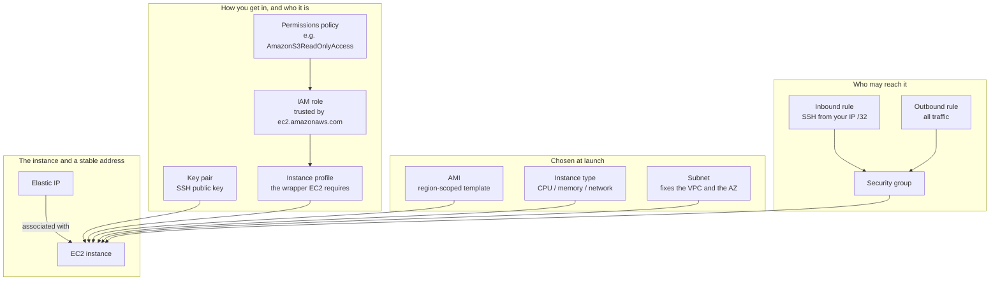

# 02 – EC2 (Elastic Compute Cloud)

The IaaS foundation of AWS: virtual servers (instances) you rent on AWS infrastructure with full OS control. One of AWS's founding services, launched in 2006, a few months after S3. Other compute services are built on EC2 in the open — the **EKS** data plane and the **ECS** EC2 launch type are instances you own and can see in your own account. Fully managed services like **RDS** are sized with EC2-style instance classes (`db.t3.micro`) but run on hosts AWS operates and you never see, so treat them as a separate layer: "how many EC2 instances are in this account" does not count them.

> [!info] Exam TL;DR
> - **An EC2 instance is composed of**: AMI (template), instance type (CPU/memory/network sizing), **subnet** (determines VPC + AZ), security group(s), key pair (SSH), EBS volumes (storage), optional user data (boot script), optional IAM instance profile (AWS API access), tags. The console wizard mirrors exactly this.
> - **AMI is region-scoped.** `ami-…` IDs are unique to one region — `aws ec2 copy-image` to move. Never hardcode an AMI ID; look the latest one up for the current region.
> - **Stop ≠ Terminate.** Stop preserves EBS, instance ID, private IP, AMI ID, EIP; releases auto-assigned public IP and instance store. Terminate destroys the instance and any volume whose **Delete on termination** flag is set. That flag is **asymmetric and exam-frequent: root volume deletes, data volumes survive** — with the caveat that a data volume attached at launch *via the CLI or API* defaults to Delete.
> - **EBS = network-attached, persistent, AZ-scoped.** Instance Store = local NVMe, ephemeral. Both lose instance store data on stop or terminate.
> - **EC2 → other AWS APIs**: NEVER long-lived IAM user keys. Use IAM **role** wrapped in **instance profile** attached to the instance (see [[01-iam]]). EC2 takes an *instance profile*, not a role directly (unlike Lambda/ECS which take roles).
> - **IMDSv2 is required by the AMI, not by the service.** AWS's service-level default is still *"you can use either IMDSv1 or IMDSv2, or both"* — what makes v2 mandatory is an AMI registered with `imds-support = v2.0` (Amazon Linux 2023 ships that way and *"disables IMDSv1 by default"*), or an account-level default you set. On such an AMI a plain `curl http://169.254.169.254/...` returns empty: you must PUT to `/latest/api/token` first and pass the token in an `X-aws-ec2-metadata-token` header on subsequent GETs. This defends against **SSRF** — an attacker tricking your app into fetching a URL of their choosing.
> - **Public IPv4 is billed** since Feb 2024 (~$0.005/hour for both auto-assigned and EIPs, regardless of attachment state). The legacy "EIP free while attached" rule no longer holds.

## What problem does this solve?

You need a computer to run your software on. Buying one means choosing its size before you know what you need, and then living with that choice.

EC2 rents you one instead. You pick an OS image, you pick a hardware shape, and a virtual server boots in an AWS data centre with you holding full control of the operating system. Linux on-demand instances bill **per second** after a 60-second minimum, so a machine you needed for ten minutes costs you ten minutes. Stop it and the compute billing stops.

Got the size wrong? Change it. The hardware shape is a setting, not a purchase.

It arrived in 2006 alongside S3, and it is still the floor much of the rest stands on.

The price of that control is that everything a physical machine used to decide for you — where it sits, what disk it has, who may reach it, what identity it carries — is now a separate decision you have to make on purpose.

> In one line: EC2 rents you a virtual server by the second and hands you every decision a physical one would have made for you.

## How it actually works

### What an instance is actually made of

An instance isn't a single thing you create. It's an assembly, and the console launch wizard walks you through the parts in order:

| Part | What it decides |
|---|---|
| AMI | the template it boots from — for modern EBS-backed AMIs, metadata plus a reference to EBS snapshots |
| Instance type | CPU, memory and network sizing |
| Subnet | which VPC, and which AZ |
| Security group(s) | who may reach it over the network |
| Key pair | how you SSH in |
| EBS volumes | its storage |
| User data | a script run at boot (optional) |
| IAM instance profile | its identity for calling AWS APIs (optional) |
| Tags | the labels you hang on it |

Two of those parts are quietly more consequential than they look.

**The AMI is region-scoped.** An `ami-…` ID means something in exactly one region. The same image in another region is a different ID, produced by `aws ec2 copy-image`. This is why hardcoding an AMI ID is a trap: anything built from it silently stops being portable across regions. Look the image up by owner and name filter instead, and take the latest match for whichever region you are in. (Building your own AMI, and why you would, is [[03-ami-bake]].)

**The subnet decides the Availability Zone.** You pick a subnet, and that subnet already lives in one AZ inside one VPC ([[05-vpc-core]]) — so picking the subnet is what settles both. That makes placement effectively permanent: you cannot stop an instance and start it in a different AZ. Moving means snapshot and relaunch there.

Those two facts also explain which changes an instance survives and which need a new one. Changing the **instance type** is stop-modify-start — *"While your instance is in the `stopped` state, you can modify certain attributes of the instance, including the instance type"* — so there is real downtime (a stop plus a full boot; AWS publishes no figure). Across it the instance ID, EBS volumes and any Elastic IP survive. Changing the **AMI** cannot be done in place at all — you can't swap the disk image out from under a running OS — so you launch a replacement. Changing the **subnet** likewise needs a new instance, because the subnet fixes the AZ.

> In one line: the AMI is regional and the subnet fixes the AZ — those are the two parts you cannot swap under a live instance.

### Stop is not terminate, and only part of it survives

Two ways to switch a machine off, and the difference is where most of the exam questions live.

**Stop** parks it. The EBS root volume, the instance ID, the private IP and the AMI metadata all survive. Compute billing stops; EBS keeps billing. On the next start it may land on a different physical host.

**Terminate** ends it. The instance ID is released and can never be reused. The private IP goes. Billing stops entirely.

Storage is where people lose the mark, and there are two separate layers to it.

**Layer one — EBS versus instance store.** EBS is network-attached: the volume lives on the network and is mapped to your instance, which is exactly why it can survive the instance landing on a different host. Instance store is physically on that host's local SSDs. Stop the instance, come back on another host, and that data is simply not there any more — not deleted in anger, just left behind on a machine you no longer have. That's why instance store dies on **stop** as well as on terminate, which feels wrong until you notice the data was tied to the *host*, never to the instance.

**Layer two — the asymmetric default.** On terminate, an EBS volume is deleted only if its **Delete on termination** flag is set, and that flag defaults differently depending on the volume's job: a **root** volume deletes with the instance, while an **additional** volume survives — sitting in your account, still billing, attachable to another instance in the same AZ. The two defaults point opposite ways, and that lack of uniformity is exactly what makes it exam-frequent: expect to be asked what happened to the data volume.

What the exam glosses over is that "survives" is the **console** default only, and that the launch-time value is inherited from the image: *"The default value at launch for an EBS volume is determined by the `DeleteOnTermination` attribute set on the AMI."* The full five-way split is in the Comparisons table below — the short version is that anything built through the API, which is nearly everything automated, deletes the extra volume with the instance.

> In one line: stop keeps EBS and kills instance store; terminate kills the root volume too but leaves extra volumes behind.

### Why the public IP walks away when you stop

There are two kinds of public IPv4 address here, and one difference that matters.

An **auto-assigned** public IP comes out of the AWS public pool. Whether you get one is normally the subnet's **Auto-assign public IPv4 address** setting (the default VPC's subnets have it on) — but **the same setting chosen at launch, on the instance, overrides the subnet default in either direction**, switching it on in a subnet that defaults off or off in one that defaults on. It belongs to the running instance, not to you. Stop the instance and it's released; start again and you get a different address. It also changes across an instance-type change, because that change is a stop and a start.

An **Elastic IP** is allocated to your account. It's yours until you release it, so it rides through stop/start, and you can move it to another instance by disassociating and re-associating. Soft limit of 5 per region, raisable.

So when the scenario is "a DNS record and someone else's firewall allowlist must not break when this box restarts", the answer for the instance itself is an EIP. (In the real world you'd more often put an ALB in front and hand out its DNS name — but that's answering a different question, because the ALB's stability isn't the instance's.)

The part to actively unlearn: an EIP used to be free while attached and charged only while idle, which trained everyone to treat "attached EIP" as free. Since **Feb 2024** every public IPv4 address bills at $0.005/hour — auto-assigned or Elastic, **attached or unattached alike**. Two exemptions AWS does document: addresses you bring yourself via **BYOIP** stay free, and the 12-month Free Tier covers **750 in-use public-IPv4 hours per month**. What is gone is any exemption for *being attached*. Old study material still teaches the old rule, and the exam still tests it.

> In one line: an auto-assigned IP belongs to the instance and changes on stop, an EIP belongs to you and doesn't — and since Feb 2024 both are billed.

### Giving the instance an identity without putting a secret on it

Code on the instance needs to call S3. The obvious move is to SSH in, run `aws configure`, and paste an IAM user's access keys. Don't. Those keys are long-lived, they sit on disk (or in user data, or an env file), nothing rotates them, and whoever gets a copy keeps the access until a human notices.

The AWS answer is to give the *instance* an identity. Create an IAM role whose trust policy lets `ec2.amazonaws.com` assume it, attach the permissions it needs (`AmazonS3ReadOnlyAccess`, say), and attach that to the instance. The SDK on the box then receives **temporary, auto-rotating credentials**, and no secret is written to disk.

The wrinkle that catches people: **EC2 does not take a role — it takes an instance profile**, a wrapper around the role. Lambda and ECS take a role directly; EC2 is the exception. The chain is role → instance profile → instance, and [[01-iam#The instance profile — the wrapper the console hides]] has the mechanics. The EC2-specific part worth holding: attaching one to a **running** instance takes effect without a restart, so an open SSH session survives it — which is why "the app can't reach S3" is rarely a reason to relaunch.

One caveat: IAM is eventually consistent, so a role created seconds ago can briefly fail to be assumed. Retry with backoff rather than concluding the trust policy is wrong (see [[01-iam]]).

> In one line: EC2 gets its permissions from a role, but the thing you hand the instance is the instance profile wrapping that role.

### Why a plain curl to the metadata endpoint returns nothing

Where do those temporary credentials actually arrive from? The **instance metadata service** at `169.254.169.254` — a link-local address reachable only from inside the instance. Ask it and it describes you to yourself, including the attached IAM info and the credentials.

On a modern AMI this comes back empty:

```bash
curl http://169.254.169.254/latest/meta-data/iam/info
```

It fails quietly — empty, or a 401, with nothing that reads like a permissions verdict — which is why the usual conclusion is "the instance profile didn't attach", and why that conclusion is usually wrong.

The cause is **IMDSv2**, which the AMI requires (Ubuntu 24.04 noble, recent AL2023) even though the EC2 service itself still accepts either version. IMDSv1 answered any plain GET from anywhere on the host. IMDSv2 makes you take a session token first — PUT to `/latest/api/token`, then send it back on every GET in an `X-aws-ec2-metadata-token` header:

```bash
curl -s -X PUT "http://169.254.169.254/latest/api/token" -H "X-aws-ec2-metadata-token-ttl-seconds: 21600"
```

Why bother with the extra round trip? SSRF. If an attacker can trick your application into fetching a URL of their choosing, `http://169.254.169.254/...` is the first one they try — and under IMDSv1 that hands over your instance's credentials through a bug in some unrelated feature. Requiring a PUT first breaks the pattern, because a naive "go fetch this URL" is a GET; and the token that comes back is TTL-limited and tied to the context that asked for it.

So learn the signature rather than the syntax: **a silent response from the metadata endpoint means you skipped the token**, not that IAM said no.

> In one line: IMDSv2 wants a PUT for a token before any GET, and skipping it fails quietly instead of loudly.

### Placement groups — telling EC2 where to put the instances relative to each other

By default EC2 spreads your instances across the underlying hardware on its own. A
**placement group** overrides that when the workload cares. There is **no charge**, an
instance can be in **one group at a time**, and groups **cannot be merged**.

Three strategies, and they answer opposite questions:

- **Cluster** — packs instances **close together inside a single Availability Zone** for
  low-latency, high-throughput node-to-node traffic. HPC. **It cannot span AZs**, which is
  the whole trade: you are buying network performance by giving up AZ redundancy.
- **Spread** — places each instance on **distinct hardware** (separate rack, network and
  power) to avoid correlated failure. For a **small number of critical instances**.
  **Maximum seven running instances per AZ**, and it *can* span AZs — so three AZs allows 21.
- **Partition** — divides the group into **partitions that share no racks**, for large
  distributed systems that already replicate: **HDFS, HBase, Cassandra, Kafka**. **Maximum
  seven partitions per AZ**, instance count limited only by your account quotas. The
  application can *see* which partition an instance is in and place replicas accordingly.

The tell in a stem is the workload, not the wording: *tightly coupled / HPC / lowest latency*
→ cluster. *A handful of critical instances that must not fail together* → spread. *A big
replicated cluster like Cassandra* → partition.

Cluster pairs with **enhanced networking** — instances inside a cluster group get up to
**10 Gbps single-flow** versus **5 Gbps** outside one. Two network adapters sit behind that phrase. The **ENA (Elastic Network Adapter)** is the ordinary
enhanced-networking card — free, on by default on current AMIs, and the baseline every modern
instance gets. The **EFA (Elastic Fabric Adapter)** is the specialist one for HPC and ML: it
bypasses the OS kernel for node-to-node communication, which is what wins the last slice of
latency. "Tightly coupled HPC" plus a **cluster** placement group is the usual EFA shape — but
**HPC wording alone is not enough**, because EFA has two hard prerequisites ENA does not.
**ENA works on every Nitro-based instance type** (Nitro being the platform all current-generation
instances run on) **while EFA has
a restricted supported list** (no burstable `t`-family), and **EFA's supported-OS table is Linux
only** — Amazon Linux 2023, RHEL 8/9/10, Debian 11/12/13, Rocky Linux 8/9, Ubuntu 22.04/24.04/26.04
and SUSE Linux Enterprise 15 SP2+ (note: **not** Amazon Linux 2). Windows appears only as one narrow
carve-out: AWS supports the EFA device on Windows *"only for AWS Cloud Digital Interface Software
Development Kit (AWS CDI SDK) based applications"*, and otherwise *"it functions as an ENA interface,
without the added EFA device capabilities"*. CDI is video transport, not MPI or NCCL — so for a
Windows HPC workload, or one on a `t3`/`t3a` instance, EFA is not the answer and plain **ENA**
enhanced networking is — which is free, on by default on current AMIs, and still delivers the
bandwidth, packet-rate and latency gain. *(Verified 2026-10-04.)*

> [!warning] Trap — EFA offered for any HPC stem
> The word "HPC" is not the discriminator; the OS and the instance family are. **Linux on a
> supported non-`t` instance type → EFA is available.** **Windows (outside AWS CDI SDK
> applications), or any `t3`/`t3a`/burstable type → EFA is not available, and the answer is
> plain ENA enhanced networking**, which still delivers the bandwidth, packet-rate and latency
> gain. A stem that says "HPC" and "Windows" in the same breath is testing exactly this.

> In one line: cluster buys latency at the cost of one AZ, spread buys isolation capped at
> seven per AZ, partition buys rack isolation for replicated clusters at seven partitions per AZ.

### Hibernate — the third way to switch an instance off

Alongside stop and terminate there is **hibernate**: the instance's **RAM is written to the
encrypted EBS root volume**, and on start it is restored, so processes resume where they
left off rather than booting cold. It is for long-warm-up applications — big in-memory
caches, licence servers. The root volume must be **encrypted and large enough to hold RAM**,
and you pay for that EBS while hibernated. Instance store still dies.

**Hibernation is a launch-time decision.** It must be enabled when the instance is launched — you
cannot switch it on for an instance that is already running. So "we want to hibernate this
existing server" is answered by **launching a replacement with hibernation enabled** (or migrating
to one), never by changing a setting on the current one. *(Verified 2026-10-04.)*

## Architecture diagram


```mermaid
flowchart TD
    subgraph CHOOSE["Chosen at launch"]
        AMI["AMI<br/>region-scoped template"]
        TYPE["Instance type<br/>CPU / memory / network"]
        SUBNET["Subnet<br/>fixes the VPC and the AZ"]
    end

    subgraph NETWORK["Who may reach it"]
        SG["Security group"]
        IN["Inbound rule<br/>SSH from your IP /32"]
        EG["Outbound rule<br/>all traffic"]
    end

    subgraph ACCESS["How you get in, and who it is"]
        KP["Key pair<br/>SSH public key"]
        POL["Permissions policy<br/>e.g. AmazonS3ReadOnlyAccess"]
        ROLE["IAM role<br/>trusted by ec2.amazonaws.com"]
        PROFILE["Instance profile<br/>the wrapper EC2 requires"]
    end

    subgraph INST["The instance and a stable address"]
        EC2["EC2 instance"]
        EIP["Elastic IP"]
    end

    AMI --> EC2
    TYPE --> EC2
    SUBNET --> EC2
    IN --> SG
    EG --> SG
    SG --> EC2
    KP --> EC2
    POL --> ROLE
    ROLE --> PROFILE
    PROFILE --> EC2
    EIP -->|associated with| EC2
```

*One instance, assembled: an AMI and an instance type give it an OS and a shape, a subnet
decides which VPC and AZ it sits in, a security group decides who may reach it, a key pair
lets you in, and a role wrapped in an instance profile lets it call AWS APIs without a stored
secret. The Elastic IP is the optional part — it keeps the public address stable across a stop.*

## Key facts
## Key facts, limits & pricing

- **Billing by instance state.** An instance is billed only while `running`. `pending`, `stopped`, `shutting-down` and `terminated` are all unbilled. The one asymmetry: toward a plain **stop** you *"stop incurring charges for an instance as soon as its state changes to `stopping`"*, but toward a **hibernate** you *"incur charges while the instance is in the `stopping` state"* — memory is being written to the root volume — and stop once it reaches `stopped`. Separately, a **Reserved Instance keeps billing**: *"Reserved Instances that applied to terminated instances are billed until the end of their term according to their payment option."* Each `stopped`→`running` transition starts a new billing period with a fresh one-minute minimum; a **reboot** does not. *(Verified 2026-10-04.)*

- **Placement groups are free**, an instance can belong to **one at a time**, and they **can't be merged**. **Dedicated Hosts can't be launched into one.**
- **Cluster** placement group: **single AZ only**, may span **peered VPCs in the same Region**. With enhanced networking, **10 Gbps single-flow inside** the group vs **5 Gbps outside**; internet and Direct Connect traffic is capped at **5 Gbps**. Burstable (T-family) instances are **not supported**.
- **Spread** placement group: **maximum 7 running instances per AZ** (rack-level), and it **can span AZs** in a Region — 3 AZs ⇒ 21 instances. **Not supported for Dedicated Instances.**
- **Partition** placement group: **maximum 7 partitions per AZ**, can span AZs, instance count limited only by account quotas. Each partition has its own racks, network and power. With **Dedicated Instances, maximum 2 partitions**.
- **Elastic Volumes** — resize or retune a live disk without taking it offline. You can *"increase the volume size, change the volume type, or adjust the performance"* of an EBS volume **without detaching it or restarting the instance** — AWS qualifies this with *"if your instance supports Elastic Volumes"*; on older instance types you detach a data volume, or stop the instance for a root volume. So on current hardware "grow the disk or change its type without downtime" is a modify, not a snapshot-and-restore dance. (Size can only grow, never shrink.)
- **EBS encryption by default** — one account setting that makes every *new* volume in a Region encrypted, so you cannot forget. It is a **per-Region account setting**, not a per-volume one: *"If you enable it for a Region, you **cannot disable it for individual volumes or snapshots** in that Region."* It has **no effect on existing** volumes or snapshots, only new ones. Encryption uses a **symmetric** KMS key — EBS does not support asymmetric keys — and you **cannot remove** encryption once applied, so anything restored from an encrypted snapshot, or a copy of one, is **always encrypted**. (How EBS encryption sits against the other AWS encryption options is in [[09-s3-security]].)
- **Recycle Bin** recovers **accidentally deleted EBS volumes, snapshots and EBS-backed AMIs**. You create a **retention rule** with a period you choose; the resource sits recoverable until that expires, then is permanently deleted. It is the no-custom-code answer to "protect against accidental snapshot deletion" — an IAM deny would also block legitimate cleanup, and **DLM only creates and expires snapshots on a schedule, it recovers nothing**.
- **A secondary ENI carries its private IP with it.** An **ENI (elastic network interface)** is a virtual network card holding a private IP; every instance has a primary one, and you can attach more. Detach it from a failed instance and attach it to a standby, and traffic addressed to that private IP resumes on the replacement — which is the failover trick when an on-premises system or an internal DNS record is pinned to a **private** address. An Elastic IP does not help there, because the mapping is to the private IP, not a public one. *(Verified 2026-10-04.)*

- **Burstable (T) instances.** The plain version first: a T instance is sold a *fraction* of a CPU as its steady allowance, and banks the difference while it is idle. It earns **CPU credits** at a fixed rate per hour, spends them whenever it pushes above its **baseline**, and the bank is capped at 24 hours' worth of earnings. Credits persist 7 days across a stop on T3/T3a/T4g/T8i, and are lost immediately on T2. **The baseline differs by size** — *baseline % per vCPU = (credits earned per hour ÷ vCPUs) ÷ 60* — e.g. `t3.nano` **5%** (6 credits/hr ÷ 2 vCPUs ÷ 60), `t3.micro` **10%**, `t3.small`/`t3.medium` **20%**, `t3.large` **30%**, `t3.xlarge`/`t3.2xlarge` **40%**. Never carry one size's baseline to another. *(Verified 2026-10-04.)* **T8i, T3, T3a and T4g launch in `unlimited` mode by default**; **T2 defaults to `standard`**. One exception: *"T3 instances launched on a Dedicated Host launch as `standard` by default; `unlimited` mode is not supported for T3 instances on a Dedicated Host."* In **standard** mode, exhausting credits throttles you to baseline. In **unlimited** mode the burst always succeeds, free if average CPU stays **at or below baseline over a rolling 24 hours** — beyond that you pay a flat rate per vCPU-hour for **surplus credits** — the credits an instance spends once its earned balance is already at zero. AWS recommends **standard** for Spot, which has no idle time to accrue credits.
- **Hibernate** saves RAM to the **encrypted EBS root volume** and restores it on start; the root volume must be encrypted and large enough for the RAM. Instance store is still lost.
- **EFA (Elastic Fabric Adapter)** is the HPC/ML network interface that bypasses the kernel for node-to-node traffic; **ENA** is standard enhanced networking. EFA belongs with a **cluster** placement group.

- **Regional service, but every instance lives in one AZ.** You pick a subnet → that determines VPC + AZ. Cannot stop/start to move AZ; only snapshot + relaunch in target AZ.
- **AMI region-scoped.** Unique `ami-…` per region. Copy with `aws ec2 copy-image` (snapshot storage + cross-region transfer charges).
- **AMI = metadata + reference to EBS snapshots** for modern EBS-backed AMIs. Snapshots hold the disk data; AMI bundles them with kernel/architecture/virtualization-type metadata to make them launchable.
- **Billing:**
  - **On-Demand** — per-second after a 60-second minimum for Linux, Windows and RHEL/Ubuntu Pro. **SLES is the one still billed as a full hour.**
  - **Free Tier** — accounts created before **15 Jul 2025**: `t2.micro`/`t3.micro`, 750 hrs/month, 12 months. Accounts created on or after: `t3.micro`/`t3.small`/`t4g.micro`/`t4g.small`/`c7i-flex.large`/`m7i-flex.large`, funded by credits — **$100 on sign-up plus up to $100 more** as you use foundational services — and ending at **6 months or when the credits run out**.
  - **Public IPv4** — since **Feb 2024**, all IPv4 public addresses cost ~$0.005/hour. Old "EIP free while attached" rule no longer applies.
  - **EBS** — `gp3` was ~$0.08/GB-month in `us-east-1`; storage prices move, so check current pricing rather than memorising this one.
- **"Delete on termination" (`DeleteOnTermination`) defaults differ by volume role** — root deletes, data survives, with the CLI/API exception. Full five-way table under *Comparisons*.
- **Instance type change** = **stop, modify, start** — the instance must be `stopped` to modify it, so expect a stop plus a boot (AWS publishes no duration). Instance ID, EBS and Elastic IP are preserved; an **auto-assigned** public IPv4 is replaced; **instance-store data is lost**.
- **AMI change needs a replacement instance.** You cannot swap the OS image out from under a running instance, so moving to a new AMI means launching a new instance from it and cutting over.
- **Instance type naming:** `family.size` with a **literal period** (`t3.micro`, `t3.small`, `m5.large`). Families: `t` (burstable), `m` (general), `c` (compute), `r` (memory), `g`/`p` (GPU), `i` (storage). Generations: `t3`, `t3a` (AMD), `t4g` (Graviton/ARM). Hyphens (`t3-micro`) are rejected.
- **IMDS endpoint** is the link-local `169.254.169.254`, reachable only from inside the instance.

## Comparisons

### Stop vs Terminate

|   | Stop | Terminate |
|---|---|---|
| EBS root volume | Preserved | **Deleted** — *Delete on termination* defaults on |
| Additional EBS volumes | Preserved | **Preserved** via the console; **deleted** if attached at launch via the CLI/API |
| Instance store data | **Lost** | **Lost** |
| Instance ID | Preserved | Released, can never be reused |
| Private IP | Preserved | Released |
| Auto-assigned public IP | **Released** | Released |
| Elastic IP (if associated) | Stays associated | Disassociated; EIP retained in your account |
| AMI ID metadata | Preserved | Preserved |
| Physical host | May change on start | N/A |
| Billing | Compute stops; EBS still bills | Stops entirely |

### Root volume vs data volume — the "Delete on termination" default

AWS's table splits five ways, not two. On the exam answer **root deletes, data survives**; in
practice set the flag explicitly, because the automated path defaults the other way.

| Volume type | Attached when | Attached how | Default on terminate |
|---|---|---|---|
| Root | at launch | console or CLI | **Delete** |
| Root | after launch | console or CLI | Preserve |
| Data | at launch | **console** | Preserve |
| Data | at launch | **CLI / API** | **Delete** |
| Data | after launch | console or CLI | Preserve |

### EBS vs Instance Store

|   | EBS | Instance Store |
|---|---|---|
| Persistence | Yes — across stop/start, and across terminate unless *Delete on termination* is set | Ephemeral — lost on stop/terminate/host failure |
| Attachment | Network-attached, can detach/reattach | Physically on the host's local SSDs |
| Scope | AZ-scoped (cross-AZ move = snapshot + restore) | Host-scoped |
| Performance | Up to ~256K IOPS (`io2 Block Express`) | Very high local NVMe; usually faster than non-provisioned EBS |
| Cost | Per-GB-month + provisioned IOPS where applicable | Free with the instance |
| Multi-attach | `io1`/`io2` only, up to 16 instances, same AZ | Single-host by definition |
| Snapshots | Yes (point-in-time, to S3) | No — manually copy elsewhere |
| Use case | Anything you need to keep | Scratch, cache, big-data shuffle, swap |

### EBS volume types — the numbers the exam asks for

| | `gp3` | `gp2` | `io2` Block Express | `io1` | `st1` | `sc1` |
|---|---|---|---|---|---|---|
| Kind | SSD general | SSD general | SSD provisioned | SSD provisioned | HDD throughput | HDD cold |
| **Max IOPS / volume** | **80,000** | **16,000** | **256,000** | **64,000** | 500 | 250 |
| Max throughput | 2,000 MiB/s | 250 MiB/s | 4,000 MiB/s | 1,000 MiB/s | 500 MiB/s | 250 MiB/s |
| Volume size | 1 GiB–64 TiB | 1 GiB–16 TiB | 4 GiB–64 TiB | 4 GiB–16 TiB | 125 GiB–16 TiB | 125 GiB–16 TiB |
| Durability | 99.8–99.9% | 99.8–99.9% | **99.999%** | 99.8–99.9% | 99.8–99.9% | 99.8–99.9% |
| Reach for it when | the default; IOPS and throughput bought **independently of size** | legacy default; performance **scales with size** and bursts on credits | sustained very high IOPS **and** the highest durability | sustained high IOPS, Multi-attach | big **sequential** throughput — logs, big data | **cheapest** per GB; infrequent sequential access |

Three things this table decides:

- **"We need 25,000 IOPS on one volume."** `gp2` **cannot** — it stops at **16,000**. Historically
  that made it an `io1` question. ⚠️ Currency: `gp3` now reaches **80,000**, so on current limits
  gp3 also qualifies and is cheaper; older question banks still expect `io1`. Read what the stem
  offers.
- **"Cheapest storage for infrequently accessed data."** `sc1` — AWS's documented use case is
  literally *"Throughput-oriented storage for data that is infrequently accessed"* and *"Scenarios
  where the lowest storage cost is important"*, which is the exam's own wording. It is the cheapest
  per GB of the **current-generation** types (the previous-generation `standard` Magnetic type still
  exists). `st1` is also HDD but costs more and is for *frequent* throughput work.
- **"Consistent low latency for a sustained high-IOPS database."** `io1`/`io2`, because the IOPS
  are **provisioned** rather than earned. `gp2` is credit-based and bursts, HDD types are built
  for throughput and not latency, and `io2` Block Express adds **99.999%** durability — two orders
  of magnitude better than everything else in the table.

*(Verified against the EBS user guide 2026-10-04.)*

### The three placement strategies

|   | **Cluster** | **Spread** | **Partition** |
|---|---|---|---|
| Puts instances | **close together** | on **distinct hardware** | in **rack-isolated partitions** |
| Availability Zones | **single AZ only** | can span AZs | can span AZs |
| Hard limit | — | **7 running instances per AZ** | **7 partitions per AZ** |
| Buys you | lowest latency, highest throughput | no correlated failure | contained blast radius |
| Costs you | **all eggs in one AZ** | a 7-per-AZ ceiling | complexity |
| The stem says | HPC, tightly coupled, node-to-node | "a few critical instances" | HDFS, HBase, **Cassandra**, Kafka |

> [!warning] Trap — cluster chosen for availability, or spread for scale
> They pull in opposite directions and the wrong one is always offered. **Cluster is a
> single AZ** — picking it for "high availability" actively concentrates risk; it is a
> *performance* choice. **Spread caps at 7 instances per AZ**, so it can never be the answer
> for a large fleet, however much the scenario stresses isolation — a big replicated cluster
> is **partition**. And a stem naming **Cassandra, HDFS, HBase or Kafka** is naming partition
> placement by its documented use case, not testing whether you know what those are.

### Auto-assigned Public IP vs Elastic IP

|   | Auto-assigned | Elastic IP |
|---|---|---|
| Source | AWS public IPv4 pool | Allocated to your account |
| Sticky across stop/start | **No** — released and reassigned | **Yes** |
| Default availability | Only if the subnet's **Auto-assign public IPv4** is on (the default VPC's subnets are) — **but the launch-time setting on the instance overrides the subnet either way** | You allocate explicitly |
| Limit | None (one per public-subnet instance) | Soft 5 per region; raisable |
| Cost | ~$0.005/hour (since Feb 2024) | ~$0.005/hour, same |
| Move to another instance | No | Yes — disassociate + re-associate |
| Protocol | IPv4 only | IPv4 only (no IPv6 equivalent — addresses abundant) |

### IMDSv1 vs IMDSv2

|   | IMDSv1 | IMDSv2 |
|---|---|---|
| Request style | `GET http://169.254.169.254/…` directly | `PUT /latest/api/token` first → `GET` with `X-aws-ec2-metadata-token: <token>` header |
| Default on new AMIs | Was default until ~2023 | **Default required** on modern AMIs (Ubuntu 24.04 noble, recent AL2023, etc.) |
| Security model | Trusts anyone on the host | Session token; mitigates SSRF and open reverse proxies — a plain GET can't mint a token, a PUT carrying `X-Forwarded-For` is **rejected**, and the PUT response has an **IP hop limit of 1** so the token can't leave the instance. The token is **instance-specific** and lasts up to 6h |
| If you forget the token | — | Endpoint returns empty / 401 silently |
| Get the token | — | `curl -s -X PUT "http://169.254.169.254/latest/api/token" -H "X-aws-ec2-metadata-token-ttl-seconds: 21600"` |

## Worked examples

> [!example] Worked example — a t3 instance under real load (CPU credit mechanics)
> A small API runs on `t3.micro` (2 vCPUs). Verified mechanics: it earns **12 CPU credits/hour**, its baseline is **10% per vCPU**, and it can bank at most **288 credits** (24h of earnings). Overnight the API idles and banks credits; the 9 a.m. traffic spike spends them bursting both vCPUs to 100%. That's the T family working as designed — burst capacity at a fraction of `m`-family price.
> Sizing rule: T family fits **bursty** workloads (web/API with idle periods, dev boxes, cron runners). If *sustained* CPU exceeds baseline, T is the wrong family — move to `m` (general) or `c` (compute) with fixed CPU. Decide by watching `CPUCreditBalance` in CloudWatch for a week.

> [!failure] Failure mode — credit exhaustion (it bites two different ways)
> **Standard mode:** sustained load drains the bank to zero → the instance is pinned at baseline (a `t3.micro` shows ~10% CPU in CloudWatch and won't go higher). Symptoms: latency explodes, health checks flap, and the box "mysteriously" refuses to use the CPU you're paying for. Signature: `CPUCreditBalance` flatlined at 0 while users report a slow app.
> **Unlimited mode — and this is the T3 default:** no throttle ever. Instead the instance spends *surplus* credits, and if its average CPU over a rolling 24h exceeds baseline, AWS bills the overage at a flat additional rate per vCPU-hour. Symptoms: nothing — the app stays fast and the bill quietly grows. Many teams discover their "cheap" t3 fleet was billing surplus charges for months only when someone audits Cost Explorer.
> Fix either way: right-size to `m`/`c` for sustained load, or consciously keep unlimited mode and alarm on the surplus-credit metrics. The CloudWatch metrics to watch (verified): `CPUCreditBalance` (accrued, flatlines at 0 when throttled in standard mode), `CPUSurplusCreditBalance` (surplus spent while balance is 0, unlimited only), and `CPUSurplusCreditsCharged` (surplus that exceeded the 24h earn cap and is being **billed** — alarm on this one).

> [!example] Worked example — moving a stateful workload to another AZ
> A reporting app with a 200 GB EBS data volume lives in `us-east-1a`; the team needs it in `us-east-1b` (AZ consolidation, or recovering from an AZ-level event). EBS is **AZ-scoped** — detach-in-1a/attach-in-1b is impossible. The move: **snapshot** the volume (snapshots are *region*-scoped) → create a new volume *from the snapshot* in `1b` → launch the instance in a `1b` subnet and attach. In production the snapshot half is pre-automated with **Amazon Data Lifecycle Manager (DLM)** schedules, so a recent snapshot already exists the day you need it. Note the exam echo: managed services (e.g. RDS Multi-AZ) exist precisely so you don't hand-roll this dance — "run the database on EC2 and snapshot it yourself" is usually the distractor, not the answer.

## ⚠️ Traps & why the wrong answers are wrong   #trap

> [!warning] Trap — any EC2 attribute can be changed on a live instance
> No, and the line is AWS's, not any tool's. **Changeable on the existing instance:** the
> **instance type** (the instance must be `stopped` first — *"While your instance is in the
> `stopped` state, you can modify certain attributes of the instance, including the instance
> type"*), its **security groups**, and its **instance profile**, which attaches to a running
> instance with no restart. **Needs a brand-new instance:** the **AMI** (you cannot swap a
> running OS image) and the **subnet** (it fixes the AZ, and nothing moves an instance between
> AZs but snapshot-and-relaunch). So "resize this box" is a stop/start, while "move it to
> another AZ" or "put it on a new base image" is a rebuild.

> [!warning] Trap — `t3-micro` works
> No — AWS instance types are `family.size` with a literal dot (`t3.micro`). A hyphen is not a
> valid instance type and the API rejects it. AMI *names* do use hyphens, which is where the
> habit comes from.

> [!warning] Trap — IAM changes are instant
> Often near-instant, but eventually consistent — newly created roles can briefly fail to be assumed (propagation race). Retry-with-backoff is the answer. See [[01-iam]].

> [!warning] Trap — EBS volumes can be moved across AZs by detach + attach
> No — EBS is AZ-scoped. Cross-AZ requires snapshot → restore in target AZ.

> [!warning] Trap — Instance store survives stop
> No — instance store dies on stop AND terminate. EBS is what survives.

> [!warning] Trap — Long-lived access keys on an instance are fine for service-to-service
> Don't. Use an IAM role + instance profile. Long-lived keys in env files / user data are an audit and leak risk.

> [!warning] Trap — EIP is free while attached
> Was true pre-Feb 2024. Now every public IPv4 (auto-assigned and EIP) bills hourly regardless of attachment state.

## 🔴 My weak spots (this topic)   #weak-spot

- [ ] **IMDSv2 token flow** — IMDSv1-style raw curl returns empty silently on modern Ubuntu. PUT for token, then GET with `X-aws-ec2-metadata-token` header.
- [ ] **Stop vs terminate granularity** — which attributes persist, which change, which die. Especially auto-assigned IP changes vs EIP staying; instance store always dies; root volume deletes vs additional volume surviving.
- [ ] **Trust policy vs permissions policy on a role** — which one says *who may assume* and which says *what they may do*. Owned by [[01-iam]]; still an exam-frequent gap.
- [ ] **Storage choice when the data is regeneratable and raw throughput matters most** — instance store, NOT io2. (Missed on the 2026-07 mock.) "High provisioned IOPS" (io2) is the trap — it's the most expensive EBS type and durable, so it fails "lowest cost" when the data is throwaway. Keywords "can be regenerated" → ephemeral is fine → local NVMe instance store.

## 🔗 Docs
- [Elastic Fabric Adapter](https://docs.aws.amazon.com/AWSEC2/latest/UserGuide/efa.html) — supported instance types, the Linux-only OS table, and the Windows/AWS-CDI-SDK carve-out; verified 2026-10-04
- [Burstable instances — key concepts & credit table](https://docs.aws.amazon.com/AWSEC2/latest/UserGuide/burstable-credits-baseline-concepts.html) — the per-size baseline table (t3.nano **5%**, t3.micro 10%, t3.large 30%, t3.xlarge 40%), 24h accrual cap, 7-day credit persistence, and the Dedicated Host exception to `unlimited`; verified 2026-10-04
- [Preserve data when an instance is terminated](https://docs.aws.amazon.com/AWSEC2/latest/UserGuide/preserving-volumes-on-termination.html) — the five-way `DeleteOnTermination` default table, and the AMI as the source of the launch-time value; verified 2026-10-04
- [Public IPv4 Free Tier announcement](https://aws.amazon.com/about-aws/whats-new/2024/02/aws-free-tier-750-hours-free-public-ipv4-addresses/) — 750 in-use hours/month free, BYOIP free; verified 2026-10-04
- [Placement groups](https://docs.aws.amazon.com/AWSEC2/latest/UserGuide/placement-groups.html) · [Placement strategies](https://docs.aws.amazon.com/AWSEC2/latest/UserGuide/placement-strategies.html) — the three strategies, "a cluster placement group can't span multiple Availability Zones", 7 instances per AZ for spread, 7 partitions per AZ; verified 2026-09-27
- [Burstable performance instances](https://docs.aws.amazon.com/AWSEC2/latest/UserGuide/burstable-performance-instances.html) · [Unlimited mode](https://docs.aws.amazon.com/AWSEC2/latest/UserGuide/burstable-performance-instances-unlimited-mode.html) — T3/T3a/T4g/T8i default to unlimited, T2 to standard; surplus credits billed per vCPU-hour beyond a rolling-24h baseline; verified 2026-09-27

- [AWS EC2 User Guide](https://docs.aws.amazon.com/AWSEC2/latest/UserGuide/concepts.html) — entry point
- [Instance lifecycle (stop, terminate, hibernate)](https://docs.aws.amazon.com/AWSEC2/latest/UserGuide/ec2-instance-lifecycle.html) — billing by state, the hibernate `stopping` exception, the RI-after-terminate rule, and what survives a stop/start; verified 2026-10-04
- [AMIs](https://docs.aws.amazon.com/AWSEC2/latest/UserGuide/AMIs.html) — including region-scoping and copy-image
- [IMDSv2](https://docs.aws.amazon.com/AWSEC2/latest/UserGuide/configuring-instance-metadata-service.html) — security model + token flow
- [IAM roles for EC2](https://docs.aws.amazon.com/AWSEC2/latest/UserGuide/iam-roles-for-amazon-ec2.html) — instance profile pattern
- [EC2 pricing](https://aws.amazon.com/ec2/pricing/) — on-demand + IPv4 charge details
- [EBS volume types](https://docs.aws.amazon.com/ebs/latest/userguide/ebs-volume-types.html) — gp3/gp2/io1/io2/st1/sc1 (EBS moved to its own guide; the old `AWSEC2/…` path is dead)
- [Elastic Volumes — modify in place](https://docs.aws.amazon.com/ebs/latest/userguide/ebs-modify-volume.html) · [EBS encryption by default](https://docs.aws.amazon.com/ebs/latest/userguide/encryption-by-default.html) · [Recycle Bin](https://docs.aws.amazon.com/ebs/latest/userguide/recycle-bin.html)
- [Monitor CPU credits (CloudWatch metrics)](https://docs.aws.amazon.com/AWSEC2/latest/UserGuide/burstable-performance-instances-monitoring-cpu-credits.html) — `CPUCreditBalance` / `CPUSurplusCreditBalance` / `CPUSurplusCreditsCharged` metric names verified 2026-06
