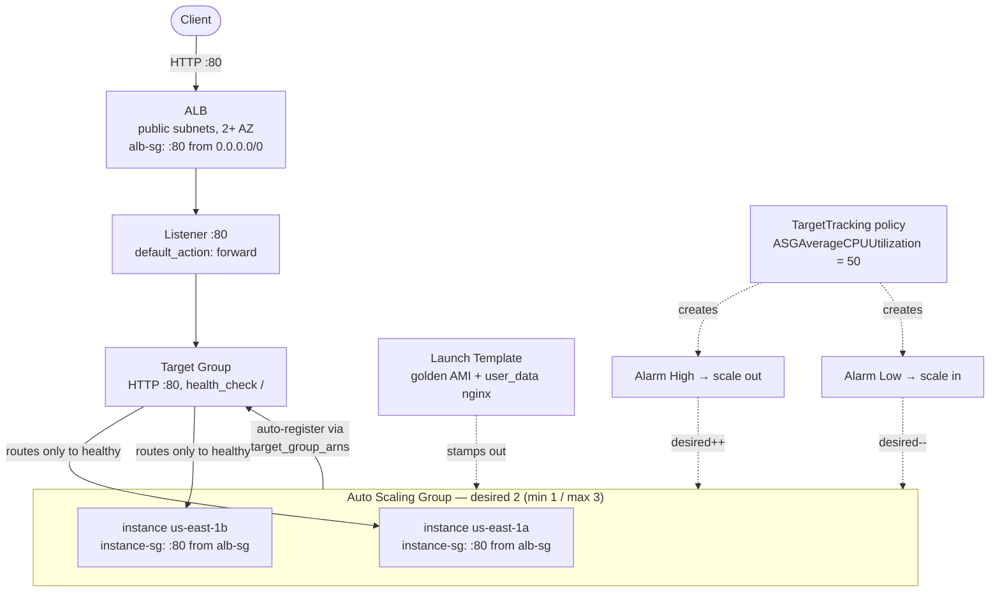

# 04 – ALB + Auto Scaling Group

The two halves of horizontal scaling on EC2: an **Application Load Balancer** spreads incoming traffic across many instances (Layer 7), and an **Auto Scaling Group** keeps the right number of instances running and replaces the dead ones. Together they turn a single fragile server into a self-healing, elastic fleet.

## What problem does this solve?

One EC2 instance gives you two problems that look like one.

The first is failure. If that instance dies, the site is gone. There is nothing else to send traffic to.

The second is size. You picked an instance type once, and that fixed the capacity you have. Traffic doesn't stay fixed — so a single instance is only ever the right size by accident, and it cannot grow or shrink to follow the load.

Running several instances instead of one is the obvious answer, and it doesn't work on its own. Clients need a single address to talk to. Something has to decide which instance gets each request, and stop sending requests to the broken ones. And something has to decide how many instances there should even be right now.

Those are two separate jobs, so AWS gives you two separate things.

- The **ALB** is the traffic director. Clients hit its DNS name. It forwards each request to a healthy instance, and checks health continuously so it never sends traffic to a broken one. It also spans failure domains by design — an ALB requires **at least two Availability Zones**; you cannot build a single-AZ one.
- The **ASG** is the capacity manager. You give it a floor (`min`), a ceiling (`max`) and a target (`desired`). It launches and terminates instances — stamped out from a **launch template** — to hold that count, and replaces any that fail.

Neither one knows about the other. The piece joining them is the **target group**.

> In one line: the ALB decides which instance gets a request, the ASG decides how many instances exist, and the target group is the only thing connecting the two.

## How it actually works

### The ALB opens your HTTP request, and everything follows from that

Start with the load balancer that doesn't. An **NLB** works at Layer 4. It sees a TCP or UDP flow, hashes it (protocol, source/destination IP and port), and forwards the packets. It never looks inside. That buys ultra-low latency, a **static IP per AZ** (you can attach an EIP), and the client's real source IP arriving untouched at your instance.

An **ALB** works at Layer 7: it parses the HTTP request. That costs latency, and it costs you the client's IP — the ALB terminates the connection itself, so the instance sees the ALB as the source and the original address arrives in an `X-Forwarded-For` header. There is no static IP either; you get a DNS name.

What you buy with all that: the ALB can route on anything *inside* the request — host, path, header, method, query-string, source IP.

And here's the consequence people miss. Because the ALB has already read the request, it can **answer** it. A listener rule's action doesn't have to be `forward`. Every rule ends in exactly one of `forward`, `redirect`, or `fixed-response`.

That is why forcing HTTPS needs no application change and no second load balancer. Two listeners on the same ALB:

| Listener | Action |
|---|---|
| :443 (carries the ACM certificate) | `forward` to the target group — the real traffic |
| :80 | `default_action` of type `redirect` → protocol `HTTPS`, port `443`, `HTTP_301` |

Leave host, path and query unset on the redirect and the reserved keywords (`#{host}`, `#{path}`, `#{query}`) carry the originals through, so `http://site/a/b?c=1` lands on `https://site/a/b?c=1`. The redirect is served **by the load balancer** — the request never reaches an instance. It consumes no capacity, and it still works when every target is unhealthy.

Two redirect rules look arbitrary until you see what they prevent:

- You must change **at least one** of protocol, hostname, port or path. If you change nothing, the redirect points at the same URI it came from, and you've built a loop.
- `HTTP→HTTPS`, `HTTP→HTTP` and `HTTPS→HTTPS` are all allowed. **`HTTPS→HTTP` is not.** The one direction that isn't offered is the one that downgrades a secure connection to an insecure one.

An NLB can do none of this. At Layer 4 there is no HTTP to inspect or rewrite, so "redirect HTTP to HTTPS on an NLB" is always the wrong answer.

> In one line: the ALB reads the request, so it can route on anything inside it and answer some requests itself; the NLB can't, but hands you a static IP and the true client IP.

### The target group is the joint — and two health checks meet inside it

The ALB never points at instances. It points at a **target group**, and instances are members of that group.

You don't put them there by hand. The ASG does it: give the ASG `target_group_arns` and every instance it launches registers itself, every instance it terminates deregisters. (`aws_autoscaling_attachment` exists, but it's for pre-existing instances you manage yourself — not for an ASG-managed fleet.)

Now the part that catches everyone. There are **two** health checks. They measure different things, and by default they don't talk to each other.

|   | Target-group health check | ASG `health_check_type` |
|---|---|---|
| Question it asks | does the app answer on this path with the expected status code? | is this instance healthy? |
| What it decides | **routing** | **replacement** |
| Default | — | `EC2` — hypervisor status checks only |

Walk a real one. A Java app deadlocks. The JVM process is still alive, so EC2 status checks pass. Every HTTP request hangs, so the ALB's check on `/health` returns 504.

- The ALB stops routing to that instance. Correct behaviour.
- The ASG, on the default `EC2`, sees a live VM and does nothing.

So the instance sits there forever, serving nothing, and you quietly run at N-1 capacity. Nobody complains, because with one healthy target left the ALB just routes around the broken one and users are fine. A failed health check only means user-visible errors when **no** targets are healthy. The silence is the danger.

Set `health_check_type = "ELB"` and the ALB's verdict becomes the ASG's verdict: mark unhealthy → drain it (`deregistration_delay`, default **300s**, letting in-flight requests finish; state goes `draining` → `unused`) → terminate → launch a replacement from the launch template.

Note what the ALB never does: **terminate anything**. It only stops routing. Termination is the ASG's job, and only when you've set `ELB`.

There is a second knob and it is not a nicety. `health_check_grace_period` is how many seconds after launch the ASG waits before counting health against a new instance. Get it wrong and you build a boot loop that looks like a scaling bug:

| Stage | Time |
|---|---|
| boot | ~30s |
| `apt install nginx` at boot | ~60s |
| health-check convergence (`healthy_threshold` 3 × `interval` 30s) | ~90s |
| **actually ELB-healthy** | **~180s** |

Set the grace period to 120s and the ASG starts honouring the ELB verdict at 120s, sees "unhealthy", terminates, and launches a replacement that hits the exact same wall. Instances cycle every few minutes and the target group never reaches a steady healthy state. Two fixes: raise the grace period above the true time-to-healthy (~300s here), or bake nginx into the AMI so an instance is healthy in ~40s and the problem evaporates. That second option is the clearest argument for golden images there is.

> In one line: the ASG registers instances into the target group, but only acts on the ALB's health verdict when `health_check_type = "ELB"` — and only after the grace period expires.

### Target tracking scales out fast and scales in slowly, deliberately

You set one number — keep `ASGAverageCPUUtilization` at 50 — and EC2 Auto Scaling **creates and manages** the CloudWatch alarms for you: an `AlarmHigh` at 50% to scale out, and an `AlarmLow` at 35% (the lower band AWS picks) to scale in. Don't hand-edit or delete them; they aren't yours.

Then the behaviour that reads like a bug. **You cannot provoke a scale-out by lowering the target value.** Target tracking never scales out while the metric is *below* target. An idle fleet serving a static nginx page sits at near-zero CPU; drop the target and all you trigger is a scale-*in*. The only way to see a scale-out is genuine load above the target — `stress` on the instances, or real traffic.

The asymmetry is the design, not an oversight: EC2 Auto Scaling prioritises **availability**. It scales out aggressively and scales in gradually, so a brief dip in traffic doesn't leave you under-provisioned the moment the traffic comes back.

Practical consequence when you're learning this: scale-in is free to watch — leave an idle fleet alone and it drifts down toward `min_size`. Scale-out is the one you have to pay for with generated load.

> In one line: target tracking is asymmetric on purpose — nothing below the target will ever scale you out, only real load above it will.

### Which instance dies when it scales in

"The oldest one" is wrong in two separate ways.

**First**, before any termination policy is consulted at all, AWS picks the **Availability Zone with the most instances** that has at least one instance unprotected from scale-in. Zonal balance takes precedence over the policy. So you can watch a *newer* instance get terminated ahead of an older one, simply because it was sitting in the over-weighted AZ.

**Second**, within that AZ, among the unprotected instances, the default policy hunts for the **oldest configuration** — not the oldest instance — in this order:

1. instances launched from a **launch configuration** (the deprecated predecessor to launch templates)
2. instances launched from a **different** launch template than the current one
3. instances on the **oldest version** of the current launch template

Only if none of that resolves a tie does it fall through to the instance **closest to its next billing hour** — largely vestigial now that most EC2 usage bills per second — and then to **random**.

If you actually want oldest-instance behaviour (say you're rolling the fleet onto a new instance *type*), `OldestInstance` is a separate policy you opt into.

One exception sits outside the whole ordering: **unhealthy instances skip it entirely.** Termination policies only apply to instances the ASG doesn't already consider unhealthy. An unhealthy instance is replaced regardless of policy.

Last thing, because it looks like a malfunction the first time: terminating an instance yourself, out of band, is **not** instant to the ASG. It notices on its periodic health-check cycle — roughly 1–2 minutes — and then launches the replacement. Console pages are static snapshots, so an instance can still read "Healthy" there long after you killed it. Refresh, and trust the **Activity tab**, which is the authoritative event log.

> In one line: AZ balance first, then oldest *configuration*, then billing hour, then random — and unhealthy instances bypass the whole ordering.

### Scheduling capacity without freezing the group

Target tracking is reactive by nature. It responds *after* load arrives, and instances need to boot and pass health checks before they help — so the first few minutes of a known 09:00 rush are slow no matter how good the policy is.

A scheduled action fixes exactly that: at 08:45 raise `desired_capacity` to 6 so the capacity is already warm when users show up.

The subtlety is worth the whole section: **set only desired capacity.** Leave `min` and `max` alone and the target-tracking policy keeps making its own decisions afterwards — at 09:30 it can still climb to 9 if the day is heavier than usual, and come back down when it isn't. Scheduled and dynamic scaling **compose**: the scheduled action moves the dial once, the dynamic policy keeps adjusting within the min/max it finds.

Pin `min = max = 6` instead and you've bought a fixed block of capacity and switched dynamic scaling off for the day. "Guarantee 10 instances at 9am" and "run exactly 10 instances at 9am" are different requirements and they have different answers.

(The one time you *must* supply min/max: when the new desired capacity would fall outside the group's current limits.)

The schedule itself is **5-field cron** — `[Minute] [Hour] [Day_of_Month] [Month_of_Year] [Day_of_Week]` — in **UTC** unless you set an IANA `time_zone` like `America/New_York`, which then auto-adjusts for DST.

And then the Terraform trap, which has no console equivalent. In `aws_autoscaling_schedule`, `min_size`, `max_size` and `desired_capacity` are all optional — but an omitted one defaults to **`0`**, not to "leave unchanged." The sentinel meaning "don't touch this" is **`-1`**, and you have to write it out. So this:

```hcl
resource "aws_autoscaling_schedule" "morning" {
  desired_capacity = 6          # min_size and max_size omitted -> both become 0
  recurrence       = "0 13 * * 1-5"
}
```

…quietly sets `max_size = 0` at 13:00 UTC, which clamps desired to 0 and **terminates your entire fleet on a schedule, every weekday**. The plan looks harmless because the resource is new; the damage happens later, at the cron time.

> In one line: schedule desired capacity only, so dynamic scaling keeps working — and in Terraform write `min_size = -1` / `max_size = -1`, because omitted means zero, not unchanged.

## Exam recap

*Now that the mechanisms are clear, this is the compressed version to revise from.*

> [!info] Exam TL;DR
> - **ALB = Layer 7** (reads the HTTP request → routes on host / path / header / method / query-string / source-IP). **NLB = Layer 4** (TCP/UDP, flow-hash, ultra-low latency, millions of connections, static IP / EIP per AZ). **GWLB = Layer 3** (GENEVE, for inline appliances).
> - ALB routes to a **target group**, not to instances directly. An **ASG registers its instances into the target group automatically** via `target_group_arns` — never attach by hand.
> - **`health_check_type` decides self-healing.** Default `EC2` only checks the VM is alive; a failed *ALB* health check won't replace it → zombie serving 500s. Set **`ELB`** so the load balancer's verdict triggers ASG replacement.
> - **ASG = min / desired / max.** `max` caps scale-out, `min` floors scale-in. Unhealthy instance → terminate + launch replacement to restore `desired`.
> - **Scaling policies:** *dynamic* (target-tracking → recommended, step, simple), *predictive* (ML on history), *scheduled* (known times). **Target tracking auto-creates & manages the CloudWatch alarms** — don't hand-edit them.
> - **ALB needs ≥ 2 AZs.** Cross-zone load balancing is **always on** for ALB (free); **off by default** for NLB (and enabling it adds inter-AZ data charges).
> - **Scale-in order:** **Availability-Zone balance wins first**, then instances on **outdated configurations**, then closest to the next billing hour, then random. It is *not* simply "the oldest instance."
> - **Scheduled scaling** sets `desired_capacity` at a wall-clock time, and *optionally* min/max. Setting only desired leaves dynamic scaling free to keep adjusting afterwards; pinning `min = max` freezes the group.
> - **HTTP→HTTPS redirect is a native ALB listener action** (`redirect`, `HTTP_301`) — no instance, Lambda, or second load balancer needed. NLB can't do it (Layer 4).
> - Production tiering: **ALB in public subnets, instances in private subnets** (only the ALB SG can reach them) + NAT/VPC-endpoints for outbound.

## AWS console ↔ Terraform map

| Console / what you want | Terraform | Notes |
|---|---|---|
| Instance blueprint for the fleet | `aws_launch_template` | AMI, type, SGs, key, `user_data`, IAM profile. **Replaces the deprecated launch *configuration*.** |
| The fleet manager | `aws_autoscaling_group` | `min/max/desired`, `vpc_zone_identifier` (2+ AZs), `launch_template { version = "$Latest" }`, `target_group_arns`, `health_check_type`, `health_check_grace_period`. |
| The load balancer | `aws_lb` | `load_balancer_type = "application"`, `subnets` (2+ AZ), `security_groups`, `internal`. |
| Where the ALB sends traffic | `aws_lb_target_group` | `port`/`protocol`/`vpc_id` + `health_check {}`. |
| The front door + routing | `aws_lb_listener` (+ `aws_lb_listener_rule`) | Listener = protocol/port + `default_action`; rules add host/path/etc. routing. |
| Scale automatically | `aws_autoscaling_policy` | `policy_type = "TargetTrackingScaling"` + `target_tracking_configuration {}`. Auto-manages its CloudWatch alarms. |
| Tie instances to the LB | `target_group_arns` on the ASG | **NOT** `aws_autoscaling_attachment` — that's for pre-existing instances. |
| Force HTTPS | `aws_lb_listener` on :80 with `default_action { type = "redirect" }` | ALB-native. The :443 listener does the real `forward`. |
| Scale at known times | `aws_autoscaling_schedule` | `recurrence` (cron), `time_zone`, `desired_capacity` (+ optional `min_size`/`max_size`). |
| Control which instance dies on scale-in | `termination_policies` on `aws_autoscaling_group` | List, evaluated in order; default is `["Default"]`. |
| "Only the LB can reach my app" | instance SG ingress with `referenced_security_group_id = <alb SG>` | Source is the ALB's SG, not a CIDR. The core security pattern. |

## Architecture diagram



## Key facts, limits & pricing

- **ALB requires at least 2 AZs** (enforced). NLB recommended 2+, not strictly required.
- **Cross-zone load balancing:** ALB — always on at the LB level, can't disable there (only override off per target group); **free**. NLB/GWLB — **off by default**; enabling it means each node spreads to all AZs but **inter-AZ data transfer is billed**. (Exam-frequent.)
- **Default routing algorithm** (ALB target group) = **round robin**; also *least outstanding requests* and *weighted random*.
- **Deregistration delay (connection draining)** default = **300 seconds**. Draining target finishes in-flight requests, state `draining` → `unused`, then the ASG may terminate it. Range 0–3600s.
- **Health checks are two independent systems:** the *ALB/target-group* health check (does the app answer on the path with the matcher code?) decides **routing**; the *ASG* `health_check_type` decides **replacement**. `EC2` = hypervisor status checks only; `ELB` = honor the target-group health. They only cooperate if you set `ELB`.
- **`health_check_grace_period`** — seconds after launch before the ASG counts health against an instance. Must exceed boot + bootstrap + health-check convergence, or you get a **boot loop**. With boot-time `apt install`, ~300s is safe; with a baked AMI you can drop it low.
- **Target tracking:** EC2 Auto Scaling **creates and manages** the CloudWatch alarms (one high, one low) — do not edit/delete them. It **scales out aggressively and scales in gradually** (prioritizes availability). It **cannot scale out when the metric is below target** — scale-out needs real load above the target value. Predefined metrics: `ASGAverageCPUUtilization`, `ASGAverageNetworkIn`, `ASGAverageNetworkOut`, `ALBRequestCountPerTarget`.
- **Pricing gotcha:** an ALB bills **hourly (~$0.0225/hr in us-east-1) + LCUs** (new connections, active connections, processed bytes, rule evaluations) — it bills even with zero traffic and zero healthy targets. Free-tier: 750 ALB-hrs + 15 LCUs/month for 12 months. ⚠️ check current pricing.
- **Default termination policy — the exact order.** AWS first picks the **Availability Zone with the most instances** that has at least one instance unprotected from scale-in (**zonal balance takes precedence over the termination policy**). Within that AZ it evaluates unprotected instances for **outdated configurations**, in this priority: (1) instances launched from a **launch configuration**, (2) instances launched from a **different** launch template than the current one, (3) instances on the **oldest version** of the current launch template. If that doesn't resolve it, it picks the instance **closest to the next billing hour** (largely vestigial now that most EC2 usage is billed per second), then **at random**.
- **Unhealthy instances skip the termination policy entirely.** AWS applies termination policies only to instances the ASG does *not* already consider unhealthy — an unhealthy instance is replaced regardless of policy.
- **Scheduled scaling:** a scheduled action sets `DesiredCapacity` and *optionally* new `MinSize`/`MaxSize` at a given time; you may set just one of them, but you must include min/max whenever the new desired would fall outside the current limits. Recurrence uses **5-field cron** — `[Minute] [Hour] [Day_of_Month] [Month_of_Year] [Day_of_Week]` — defaulting to **UTC**, with an optional **IANA time zone** (`America/New_York`) that auto-adjusts for DST. Limits: **max 125 scheduled actions per ASG**, names unique per group, each action needs a unique start time, and an action may be delayed **up to 2 minutes**. Pause them all by suspending the **`ScheduledActions`** process.
- **Scheduled scaling and dynamic scaling compose.** After a scheduled action runs, the target-tracking/step policy keeps making its own decisions — it just has to stay within the min/max the scheduled action set. That's the point of scheduling *desired* only: you pre-warm capacity for a known event and let dynamic scaling handle the actual shape of the load.
- **ALB `redirect` action:** a URI is `protocol://hostname:port/path?query`; you must change **at least one** of protocol, hostname, port or path or you create a redirect loop. Status codes are **`HTTP_301`** (permanent) and **`HTTP_302`** (temporary). Reserved keywords carry the original parts through: `#{protocol}`, `#{host}`, `#{port}`, `#{path}`, `#{query}`. **You can redirect HTTP→HTTPS, HTTP→HTTP and HTTPS→HTTPS — but never HTTPS→HTTP.** Every rule must end in exactly one of `forward`, `redirect`, or `fixed-response`.
- **Manual (out-of-band) termination is not instant to the ASG** — it detects via its periodic health-check cycle (~1–2 min to notice), then launches a replacement. The console pages are **static snapshots** — refresh to see truth; the **Activity tab** is the authoritative event log.

## Comparisons

### ALB vs NLB vs GWLB

|   | ALB | NLB | GWLB |
|---|---|---|---|
| OSI layer | 7 (HTTP/HTTPS) | 4 (TCP/UDP/TLS) | 3 (IP, GENEVE :6081) |
| Routes on | host, path, header, method, query-string, source-IP | flow hash (proto, src/dst IP+port, seq) | 5-tuple flow hash |
| Latency | higher (parses HTTP) | ultra-low | n/a (appliance insertion) |
| Static IP | ❌ DNS name only | ✅ one per AZ, can attach EIP | via endpoints |
| Preserves client source IP | ❌ (adds `X-Forwarded-For`) | ✅ natively | ✅ |
| Cross-zone default | always on (free) | off (inter-AZ charged) | off |
| Use it for | web apps, path/host routing, WebSockets, HTTP-aware | TCP/UDP, extreme perf, static IP, non-HTTP | inline firewalls/IDS/IPS appliances |

### Scaling policy types

|   | Reacts to | When |
|---|---|---|
| Target tracking (dynamic) | keep a metric AT a target (e.g. CPU 50%) | **default choice** — simplest, auto-manages alarms |
| Step scaling (dynamic) | different adjustments per alarm-breach size | need graduated response |
| Simple scaling (dynamic) | one adjustment + cooldown | legacy, avoid |
| Predictive | ML forecast on historical load | known cyclical patterns; pairs with dynamic |
| Scheduled | wall-clock time | predictable spikes (9am rush, batch window) |

### Predefined termination policies

| Policy | Terminates | Use when |
|---|---|---|
| `Default` | the ordered logic above | almost always |
| `OldestInstance` | the oldest instance in the group | upgrading the fleet to a new instance **type** |
| `NewestInstance` | the newest instance | testing a new config you don't want to keep |
| `OldestLaunchConfiguration` | noncurrent launch **configuration** first | phasing out an old launch configuration |
| `OldestLaunchTemplate` | noncurrent launch template first, then oldest version of the current one | phasing out an old launch **template** |
| `ClosestToNextInstanceHour` | whichever is nearest its next billing hour | hourly-billed instances (rare now) |
| `AllocationStrategy` | whatever realigns the group to its Spot/On-Demand allocation strategy | mixed-instances groups whose preferred types changed |

*Zonal balance is applied before **all** of these, so you can legitimately see a newer instance terminated before an older one when one AZ is over-weighted.*

## Worked examples

> [!example] Worked example — the ALB↔ASG health-check split that saves (or sinks) you
> A `t3.micro` fleet behind an ALB runs a Java app that occasionally deadlocks: the JVM process is alive (so EC2 status checks pass) but every HTTP request hangs and the ALB health check on `/health` returns 504. With `health_check_type = "EC2"` (the default), the ASG sees "VM healthy" and does nothing — the ALB stops routing to the bad instance (good) but never gets it replaced, so you silently run at N-1 capacity until someone notices. Flip the ASG to `health_check_type = "ELB"` and the ALB's 504 verdict now propagates: after `health_check_grace_period`, the ASG marks it unhealthy, drains it (`deregistration_delay`, default 300s), terminates it, and launches a fresh one from the launch template. This is exactly the behaviour verified live in this topic by terminating an instance and watching the Activity log show `Terminating…` + `Launching…`.

> [!failure] Failure mode — the grace-period boot loop
> Set `health_check_grace_period` too low relative to how long an instance takes to become **ELB-healthy** and you get a self-inflicted outage that looks like a scaling bug. With boot-time `apt install nginx` (~60s) + boot (~30s) + health-check convergence (`healthy_threshold` × `interval`, e.g. 3 × 30s = 90s), an instance isn't healthy until ~180s. A grace period of 120s means the ASG starts honouring the ELB verdict at 120s, sees "unhealthy," **terminates and replaces** — and the replacement hits the same wall. Result: instances cycle every few minutes, the target group never reaches steady healthy state, and you burn money launching doomed instances. Fixes: raise the grace period above the true time-to-healthy (~300s here), **or bake nginx into the AMI** (see [[03-ami-bake]]) so instances are healthy in ~40s and the whole problem evaporates — the clearest argument for golden images there is.

> [!example] Worked example — target tracking, and why it only heals one direction cheaply
> The target-tracking policy (`ASGAverageCPUUtilization = 50`) auto-created two CloudWatch alarms with zero hand-wiring: `TargetTracking-…-AlarmHigh` at 50% (scale out) and `-AlarmLow` at 35% (scale in — the lower band AWS picks). Observed behaviour: an idle fleet sits well below 35%, so after a sustained period the low alarm scales it in toward `min_size` — cheap to watch, no load needed. But you **cannot** provoke a scale-*out* by lowering the target: target tracking never scales out when the metric is below target, and a static nginx page produces near-zero CPU, so the only way to see scale-out is to generate real load (`stress` on the instances). This asymmetry is by design — EC2 Auto Scaling **prioritizes availability**: it scales out fast and scales in conservatively so a brief dip doesn't strand you under-provisioned when traffic returns.

> [!example] Worked example — forcing HTTPS with two listeners, not one
> You've attached an ACM certificate and want every visitor on TLS. The wrong instinct is to make the app redirect, or to run a second load balancer. The ALB does it natively with **two listeners**: :443 carries the certificate and `forward`s to the target group; :80 carries a single `default_action` of type `redirect` sending `HTTPS` on port `443` with `HTTP_301`. Because you leave host, path and query unset, the reserved keywords apply implicitly and `http://site/a/b?c=1` lands on `https://site/a/b?c=1`. The redirect is served **by the load balancer** — the request never reaches an instance, so it costs no capacity and works even when every target is unhealthy. Terraform shape:
> ```hcl
> default_action {
>   type = "redirect"
>   redirect {
>     port        = "443"
>     protocol    = "HTTPS"
>     status_code = "HTTP_301"
>   }
> }
> ```
> Exam framing: "redirect HTTP to HTTPS with no application changes" → an ALB listener rule, not CloudFront, not a Lambda, not an instance-level rewrite.

> [!example] Worked example — a predictable 9am rush
> A payroll app is idle overnight and slammed from 09:00 on weekdays. Target tracking alone reacts *after* the load arrives, so the first few minutes are slow while instances boot and pass health checks. The fix is **both**: a scheduled action at 08:45 local raises `desired_capacity` to 6 so capacity is warm before users arrive, and the existing target-tracking policy then handles whatever the day actually does. Crucially the scheduled action sets **only desired capacity** and leaves min/max alone — so at 09:30 the CPU policy can still scale to 9 if the day is heavier than usual, and scale back down when it isn't. If you had pinned `min = max = 6` instead, you'd have bought a fixed block of capacity and disabled dynamic scaling for the day.

> [!failure] Failure mode — `aws_autoscaling_schedule` silently scaling your group to zero
> This one is a **Terraform-specific** trap with no AWS-console equivalent. In `aws_autoscaling_schedule`, `min_size`, `max_size` and `desired_capacity` are all *optional* — but their default is **`0`**, not "leave unchanged." The sentinel for "don't touch this value" is **`-1`**, and you must write it explicitly. So a schedule that looks like it only bumps desired capacity:
> ```hcl
> resource "aws_autoscaling_schedule" "morning" {
>   desired_capacity = 6          # min_size and max_size omitted -> both become 0
>   recurrence       = "0 13 * * 1-5"
> }
> ```
> …sets `max_size = 0` at 13:00 UTC, which clamps desired to 0 and **terminates the entire fleet on a schedule**, every weekday. The plan looks harmless because the resource is new and the damage happens later, at the cron time. Always write `min_size = -1` and `max_size = -1` when you mean "leave them as they are." (Also worth knowing: `recurrence` is UTC unless you set `time_zone`, so a schedule written in local-time thinking fires at the wrong hour and shifts again at DST.)

## The Terraform I wrote

Code: [`04-alb-asg/main.tf`](../04-alb-asg/main.tf) + `variables.tf` / `outputs.tf` / `user_data.sh`

13 resources: 2 SGs + 4 rules, `aws_launch_template` (golden AMI from [[03-ami-bake]] via `data.aws_ami` on `tag:BakedBy=packer`, `owners=["self"]`, `user_data = base64encode(file(...))`), `aws_lb` + `aws_lb_target_group` + `aws_lb_listener`, `aws_autoscaling_group` (`min 1 / max 3 / desired 2`, `health_check_type = "ELB"`, `grace 120→300`), and `aws_autoscaling_policy` (target tracking, CPU 50).

Non-obvious bits:
- The **instance SG sources from the ALB SG** via `referenced_security_group_id` — the "only the LB reaches my app" pattern (different argument from the `cidr_ipv4` used in [[02-ec2]]).
- **Scoped the ALB to `us-east-1a`+`us-east-1b`** on purpose: the default VPC includes a `us-east-1e` subnet, and that AZ historically doesn't support ALBs → apply error if you hand it *all* subnets.
- ASG auto-registers into the target group via `target_group_arns`; no `aws_autoscaling_attachment`.
- The golden AMI is a **data source**, so `terraform destroy` leaves it intact.

> [!warning] Trap — "the ALB terminates the unhealthy instance"
> It doesn't. The ALB only stops *routing* to it. Termination is the **ASG's** job, and only if `health_check_type = "ELB"`. Two separate systems; the default (`EC2`) leaves them disconnected.

> [!warning] Trap — "a failed ALB health check means users get errors"
> Only if **no** targets are healthy. With ≥1 healthy target the ALB quietly routes around the bad one and users are fine — you're at reduced capacity with nobody alerted. Silence is the danger.

> [!warning] Trap — NLB vs ALB for a static IP / source-IP
> "Need a static IP for the LB" or "must preserve client source IP with no app changes" → **NLB** (static IP/EIP per AZ, native source-IP preservation). ALB is DNS-only and needs `X-Forwarded-For`. Frequent distractor pairing.

> [!warning] Trap — cross-zone billing
> Cross-zone is free & always-on for ALB, but **off by default and inter-AZ-billed for NLB**. "Cheapest option that spreads evenly across AZs" nuances hinge on this.

> [!warning] Trap — "scale-in terminates the oldest instance"
> Two errors in one. First, **AZ balance is evaluated before the termination policy**, so the instance chosen may be a *newer* one sitting in an over-weighted AZ. Second, the default policy targets the oldest **configuration** (launch configuration, then non-current launch template, then oldest template version) — not the oldest *instance*. `OldestInstance` is a separate policy you have to opt into.

> [!warning] Trap — a scheduled action that also pins min and max
> "Guarantee 10 instances at 9am" and "run exactly 10 instances at 9am" are different requirements. Setting only `desired_capacity` pre-warms capacity and lets dynamic scaling keep working; setting `min = max = 10` freezes the group at 10 until another action changes it. When a question stresses *predictable baseline plus unpredictable spikes*, the answer is scheduled scaling for the baseline **plus** a dynamic policy on top — not one or the other.

> [!warning] Trap — redirect on the wrong load balancer, or the wrong direction
> `redirect` is an **ALB** (Layer 7) listener action; an **NLB** operates at Layer 4 and cannot inspect or rewrite HTTP, so "redirect HTTP to HTTPS on an NLB" is always wrong. And the redirect only runs one way: HTTP→HTTPS is supported, **HTTPS→HTTP is not**.

> [!example]- Recreate-from-memory drill
> From scratch (default VPC ok), build: golden-AMI launch template → ALB (2 AZ) + target group + listener → ASG (min 1/max 3/desired 2, `health_check_type = "ELB"`) auto-registered to the target group → target-tracking CPU-50 policy → the two SGs (ALB open on 80, instance SG from ALB SG only). Goal: browse the ALB DNS, see the served instance-id flip; terminate one instance and watch the ASG replace it in the Activity tab. `destroy` after.
> > [!success]- Reference solution
> > See `04-alb-asg/main.tf` — 13 resources in dependency order (data → SGs → launch template → ALB → TG → listener → ASG → policy). The one line people forget is `health_check_type = "ELB"` on the ASG.

## 🔴 My weak spots (this topic)   #weak-spot

- [ ] **Conflated "ALB health check fails" with "instance gets terminated."** A failed ALB health check only stops routing; termination needs the ASG with `health_check_type = "ELB"`. Two systems, one linking knob.
- [ ] **Console staleness vs ASG detection lag** — saw an instance as "Healthy" in the ASG tab right after terminating it and thought something was broken. It was a stale page snapshot + the ASG's periodic detection cycle (1–2 min), not a bug. Use the Activity tab + refresh.
- [ ] **Target tracking can't scale OUT from idle** — lowering `target_value` triggers scale-*in*, not out; scale-out genuinely needs load above target. (Corrected mid-session.)
- [ ] **ASG termination order — missed while marked _sure_** (mock 2026-08-28, trainer-sourced). Discriminator: "oldest launch configuration terminated first." I had no model of scale-in ordering at all; **AZ balance first**, then outdated configurations, then billing hour.
- [ ] **Scheduled desired capacity vs pinning min/max — missed while marked _sure_** (mock 2026-08-28, trainer-sourced). Scheduled and dynamic scaling **compose**; setting only `desired_capacity` is what preserves that.
- [ ] **ALB `redirect` listener action — missed while marked _sure_** (mock 2026-08-28, trainer-sourced). Discriminator: "redirect action on the existing HTTP listener." The fact lived in [[05-vpc-security]] and [[06-capstone]] but not in this note, where I'd look for it.
- [ ] **Cross-zone defaults differ by LB type** — ALB always-on/free vs NLB off-by-default/inter-AZ-charged. Easy to blur.

## 🔗 Docs

- [How ELB works — cross-zone, routing, schemes](https://docs.aws.amazon.com/elasticloadbalancing/latest/userguide/how-elastic-load-balancing-works.html) — ALB cross-zone always-on, NLB/GWLB off by default; round-robin default; verified 2026-06
- [Target group attributes — deregistration delay](https://docs.aws.amazon.com/elasticloadbalancing/latest/application/edit-target-group-attributes.html) — default 300s draining; verified 2026-06
- [Target tracking scaling policies](https://docs.aws.amazon.com/autoscaling/ec2/userguide/as-scaling-target-tracking.html) — auto-managed alarms, scale-out-fast/scale-in-gradual, can't scale out below target; verified 2026-06
- [Terraform `aws_autoscaling_group`](https://registry.terraform.io/providers/hashicorp/aws/latest/docs/resources/autoscaling_group)
- [Terraform `aws_lb` / `aws_lb_target_group` / `aws_lb_listener`](https://registry.terraform.io/providers/hashicorp/aws/latest/docs/resources/lb)
- [Terraform `aws_launch_template`](https://registry.terraform.io/providers/hashicorp/aws/latest/docs/resources/launch_template)
- [Termination policies](https://docs.aws.amazon.com/autoscaling/ec2/userguide/ec2-auto-scaling-termination-policies.html) — zonal balance precedence, outdated-configuration ordering, predefined policy list; verified 2026-08-29
- [Scheduled scaling](https://docs.aws.amazon.com/autoscaling/ec2/userguide/ec2-auto-scaling-scheduled-scaling.html) — desired/min/max semantics, cron + IANA time zone, 125-action limit, composition with dynamic scaling; verified 2026-08-29
- [ALB rule action types](https://docs.aws.amazon.com/elasticloadbalancing/latest/application/rule-action-types.html) — `redirect` config, 301/302, `#{host}`/`#{path}`/`#{query}` keywords, no HTTPS→HTTP; verified 2026-08-29
- [Terraform `aws_autoscaling_schedule`](https://registry.terraform.io/providers/hashicorp/aws/latest/docs/resources/autoscaling_schedule) — min/max/desired default to `0`; use `-1` to leave unchanged
- [Terraform `aws_autoscaling_policy`](https://registry.terraform.io/providers/hashicorp/aws/latest/docs/resources/autoscaling_policy)

---
**Cards for this topic:** [[cards/04-alb-asg-cards]]
