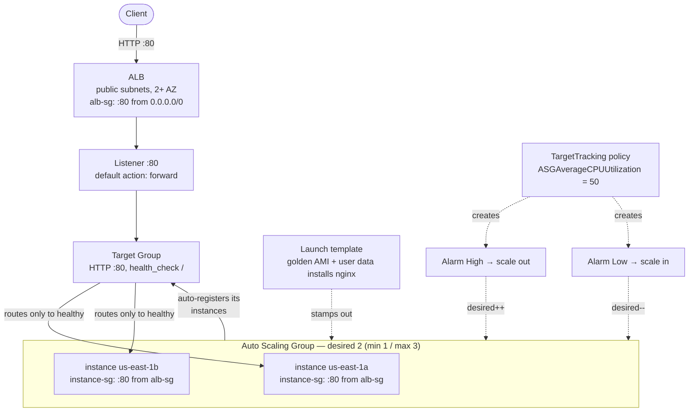

# 04 – ALB + Auto Scaling Group

The two halves of horizontal scaling on EC2: an **Application Load Balancer** spreads incoming traffic across many instances (Layer 7), and an **Auto Scaling Group** keeps the right number of instances running and replaces the dead ones. Together they turn a single fragile server into a self-healing, elastic fleet.

> [!info] Exam TL;DR
> - **ALB = Layer 7** (reads the HTTP request → routes on host / path / header / method / query-string / source-IP). **NLB = Layer 4** (TCP/UDP, flow-hash, ultra-low latency, millions of connections, static IP / EIP per AZ). **GWLB = Layer 3** (GENEVE, for inline appliances).
> - ALB routes to a **target group**, not to instances directly. An **ASG registers its instances into the target group automatically** once you attach the target group to the group — never register instances by hand.
> - **The ASG's health-check type decides self-healing.** The default (`HealthCheckType = EC2`) only checks the VM is alive; a failed *ALB* health check won't replace it → zombie serving 500s. Set **`ELB`** so the load balancer's verdict triggers ASG replacement.
> - **ASG = min / desired / max.** `max` caps scale-out, `min` floors scale-in. Unhealthy instance → terminate + launch replacement to restore `desired`.
> - **Scaling policies:** *dynamic* (target-tracking → recommended, step, simple), *predictive* (ML on history), *scheduled* (known times). **Target tracking auto-creates & manages the CloudWatch alarms** — don't hand-edit them.
> - **ALB needs ≥ 2 AZs** (in a Region). Cross-zone load balancing is **always on at the load-balancer level** for ALB and free — you can only override it *off per target group*; it is **off by default** for NLB, and enabling it there adds inter-AZ data-transfer charges.
> - **Scale-in order:** **Availability-Zone balance wins first**, then instances on **outdated configurations**, then closest to the next billing hour, then random. It is *not* simply "the oldest instance."
> - **Scheduled scaling** sets **desired capacity** at a wall-clock time, and *optionally* min/max. Setting only desired leaves dynamic scaling free to keep adjusting afterwards; pinning `min = max` freezes the group.
> - **HTTP→HTTPS redirect is a native ALB listener action** (`redirect`, `HTTP_301`) — no instance, Lambda, or second load balancer needed. NLB can't do it (Layer 4).
> - Production tiering: **ALB in public subnets, instances in private subnets** (only the ALB SG can reach them) + NAT/VPC-endpoints for outbound.

## What problem does this solve?

One EC2 instance gives you two problems that look like one.

The first is failure. If that instance dies, the site is gone. There is nothing else to send traffic to.

The second is size. You picked an instance type once, and that fixed the capacity you have. Traffic doesn't stay fixed — so a single instance is only ever the right size by accident, and it cannot grow or shrink to follow the load.

Running several instances instead of one is the obvious answer, and it doesn't work on its own. Clients need a single address to talk to. Something has to decide which instance gets each request, and stop sending requests to the broken ones. And something has to decide how many instances there should even be right now.

Those are two separate jobs, so AWS gives you two separate things.

- The **ALB** is the traffic director. Clients hit its DNS name. It forwards each request to a healthy instance, and checks health continuously so it never sends traffic to a broken one. It also spans failure domains by design — in a Region, *"[Application Load Balancers] You must specify subnets from at least two Availability Zones"*, and the API rejects fewer. (The documented exceptions sit outside Regions: an ALB **on Outposts** takes *"one Outpost subnet"*, and one **on Local Zones** takes *"subnets from one or more Local Zones"*.)
- The **ASG** is the capacity manager. You give it a floor (`min`), a ceiling (`max`) and a target (`desired`). It launches and terminates instances — stamped out from a **launch template**, which carries the AMI, instance type and everything else from [[02-ec2]] — to hold that count, and replaces any that fail.

Neither one knows about the other. The piece joining them is the **target group**.

> In one line: the ALB decides which instance gets a request, the ASG decides how many instances exist, and the target group is the only thing connecting the two.

## How it actually works

### The ALB opens your HTTP request, and everything follows from that

Start with the load balancer that doesn't. An **NLB** works at Layer 4. It sees a TCP or UDP flow and hashes it on *"The protocol, The source IP address and source port, The destination IP address and destination port, The TCP sequence number"*, then forwards the packets. It never looks inside. That buys ultra-low latency, a **static IP per AZ** (you can attach an EIP), and the client's real source IP arriving untouched at your instance.

An **ALB** works at Layer 7: it parses the HTTP request. That costs latency, and it costs you the client's IP — the ALB terminates the connection itself, so the instance sees the ALB as the source and the original address arrives in an `X-Forwarded-For` header. There is no static IP in the NLB sense either — no fixed address per AZ, and *"[Application Load Balancers] You can't specify Elastic IP addresses for your subnets"*; you get a DNS name. Since **March 2025** an ALB can draw its node addresses from a public **VPC IPAM** pool (your own BYOIP range, or an Amazon-provided contiguous block), which is what actually solves downstream allowlisting — but the addresses still come and go within that pool, and fall back to AWS-managed ones if it is depleted. It is a narrower, known *range*, not a static IP.

What you buy with all that: the ALB can route on anything *inside* the request — host, path, header, method, query-string, source IP.

And here's the consequence people miss. Because the ALB has already read the request, it can **answer** it. A listener rule's action doesn't have to be `forward`. Every rule ends in exactly one of `forward`, `redirect`, or `fixed-response`.

That is why forcing HTTPS needs no application change and no second load balancer. Two listeners on the same ALB:

| Listener | Action |
|---|---|
| :443 (carries the ACM certificate) | `forward` to the target group — the real traffic |
| :80 | default action of type `redirect` → protocol `HTTPS`, port `443`, `HTTP_301` |

Leave host, path and query unset on the redirect and the reserved keywords (`#{host}`, `#{path}`, `#{query}`) carry the originals through, so `http://site/a/b?c=1` lands on `https://site/a/b?c=1`. The redirect is served **by the load balancer** — the request never reaches an instance. It consumes no capacity, and it still works when every target is unhealthy.

Two redirect rules look arbitrary until you see what they prevent:

- You must change **at least one** of protocol, hostname, port or path. If you change nothing, the redirect points at the same URI it came from, and you've built a loop.
- `HTTP→HTTPS`, `HTTP→HTTP` and `HTTPS→HTTPS` are all allowed. **`HTTPS→HTTP` is not.** The one direction that isn't offered is the one that downgrades a secure connection to an insecure one.

An NLB can do none of this. At Layer 4 there is no HTTP to inspect or rewrite, so "redirect HTTP to HTTPS on an NLB" is always the wrong answer.

> In one line: the ALB reads the request, so it can route on anything inside it and answer some requests itself; the NLB can't, but hands you a static IP and the true client IP.

### The target group is the joint — and two health checks meet inside it

The ALB never points at instances. It points at a **target group**, and instances are members of that group.

You don't put them there by hand. **Attach the target group to the Auto Scaling group** and every instance the ASG launches registers itself, every instance it terminates deregisters. A standalone instance that is not in an ASG has to be registered with the target group directly.

Now the part that catches everyone. There are **two** health checks. They measure different things, and by default they don't talk to each other.

One asks *"does the app answer on this path with the expected status code?"* and decides
**routing**. The other asks *"is this instance healthy?"* and decides **replacement**. Side by
side in *Comparisons* below.

Walk a real one. A Java app deadlocks. The JVM process is still alive, so EC2 status checks pass. Every HTTP request hangs, so the ALB's check on `/health` returns 504.

- The ALB stops routing to that instance. Correct behaviour.
- The ASG, on the default `EC2`, sees a live VM and does nothing.

So the instance sits there forever, serving nothing, and you quietly run at N-1 capacity. Nobody complains, because with one healthy target left the ALB just routes around the broken one and users are fine. And if *every* target fails, the ALB does not start erroring either — it **fails open**: *"if all targets fail health checks at the same time in all enabled Availability Zones, the load balancer fails open"* and routes to all of them regardless of health. So a failing health check is never announced to you by an error page. The silence is the danger.

Turn on **ELB health checks** (`HealthCheckType = ELB`) and the ALB's verdict becomes the ASG's verdict: mark unhealthy → drain it (deregistration delay, default **300s**, letting in-flight requests finish; state goes `draining` → `unused`) → terminate → launch a replacement from the launch template.

Note what the ALB never does: **terminate anything**. It only stops routing. Termination is the ASG's job, and the *ALB's* verdict only reaches the ASG once ELB health checks are on. It is not the only route to replacement, though: **EC2 application status checks** replace an instance on an app-level HTTP/HTTPS failure with *"No additional Auto Scaling group configuration … required"*, and custom, VPC Lattice and EBS health checks each reach the ASG too.

There is a second knob and it is not a nicety. The **health check grace period** is how long the
ASG waits before counting health against an instance — and the clock starts not at launch but
*"after it enters the `InService` state"*. An instance reaches `InService` once it passes the EC2
status checks and finishes registering with the load balancer, which can easily be *before* your
bootstrap script has finished, and ELB health checks *"run in parallel, starting when the instance
is registered with the load balancer"*. So what has to fit inside the grace period is **whatever
bootstrap remains after `InService`, plus the first health check landing**:

| From `InService` | Time |
|---|---|
| rest of `apt install nginx` at boot | up to ~60s |
| first health check lands and passes (interval default **30s**) | ~30s |
| **grace period must comfortably exceed** | **~90s** |

The defaults are a trap in themselves: the console sets the grace period to **300 seconds**, but
via the **CLI or SDK the default is 0**, which turns it off entirely. One thing it never shields
against: *"During the health check grace period, if Amazon EC2 Auto Scaling detects that an
instance is no longer in the Amazon EC2 `running` state, it immediately marks the instance
`Unhealthy` and replaces it."* It also applies to instances returning from standby and ones you
attach manually. *(Verified 2026-10-04.)*

Worth being precise about the convergence number, because it is easy to get wrong in the
pessimistic direction. A **newly registered** target does not need `HealthyThresholdCount`
passes: AWS says *"After your target is registered, it must pass **one** health check to be
considered healthy."* `HealthyThresholdCount` (default **5**) is the number of consecutive
successes needed to bring an **already-unhealthy** target back, and `UnhealthyThresholdCount`
(default **2**) is what takes a healthy one out. So a fresh instance is healthy roughly one
interval after its app answers, not five.

Set the grace period below the true time-to-healthy and the ASG starts honouring the ELB verdict
while the instance is still bootstrapping, sees "unhealthy", terminates it, and launches a
replacement that hits the exact same wall. Instances cycle every few minutes and the target group
never reaches a steady healthy state. Two fixes: raise the grace period comfortably above the real
time-to-healthy, or bake nginx into the AMI so an instance is healthy in ~40s and the problem
evaporates. That second option is the clearest argument for golden images there is.

> In one line: the ASG registers instances into the target group, but only acts on the ALB's health verdict once you turn on **ELB health checks** (`HealthCheckType = ELB`) — and only after the grace period expires.

### Target tracking scales out fast and scales in slowly, deliberately

You set one number — keep `ASGAverageCPUUtilization` at 50 — and EC2 Auto Scaling **creates and manages** the CloudWatch alarms for you: an `AlarmHigh` at the target value to scale out, and an `AlarmLow` somewhere **below** it to scale in. In this lab the low alarm came out at 35%, but AWS publishes no formula for that band and reserves the right to *"create, edit, or delete"* these alarms itself — so treat 35% as an observation, not a rule. Either way: don't hand-edit or delete them; they aren't yours.

Then the behaviour that reads like a bug. **You cannot provoke a scale-out by lowering the target value.** Target tracking never scales out while the metric is *below* target. An idle fleet serving a static nginx page sits at near-zero CPU; drop the target and all you trigger is a scale-*in*. The only way to see a scale-out is genuine load above the target — `stress` on the instances, or real traffic.

The asymmetry is the design, not an oversight: EC2 Auto Scaling prioritises **availability**. It scales out aggressively and scales in gradually, so a brief dip in traffic doesn't leave you under-provisioned the moment the traffic comes back.

Practical consequence when you're learning this: scale-in is free to watch — leave an idle fleet alone and it drifts down toward **minimum capacity**. Scale-out is the one you have to pay for with generated load.

> In one line: target tracking is asymmetric on purpose — nothing below the target will ever scale you out, only real load above it will.

### Which instance dies when it scales in

"The oldest one" is wrong in two separate ways.

**First**, before any termination policy is consulted at all, AWS picks the **Availability Zone with the most instances** that has at least one instance unprotected from scale-in. Zonal balance takes precedence over the policy. So you can watch a *newer* instance get terminated ahead of an older one, simply because it was sitting in the over-weighted AZ.

**Second**, within that AZ, among the unprotected instances, the default policy hunts for the **oldest configuration** — not the oldest instance. The three things it ranks need placing first: a group launches instances from a **launch template**, which carries **numbered versions**; a **launch configuration** is the legacy predecessor to launch templates. An instance is "outdated" if it is running the legacy thing, the wrong template, or an older version of the right one — in that order:

1. instances launched from a **launch configuration** (the deprecated predecessor to launch templates)
2. instances launched from a **different** launch template than the current one
3. instances on the **oldest version** of the current launch template

Only if none of that resolves a tie does it fall through to the instance **closest to its next billing hour** — largely vestigial now that most EC2 usage bills per second — and then to **random**.

If you actually want oldest-instance behaviour (say you're rolling the fleet onto a new instance *type*), `OldestInstance` is a separate policy you opt into.

One exception sits outside the whole ordering: **unhealthy instances skip it entirely.** Termination policies only apply to instances the ASG doesn't already consider unhealthy. An unhealthy instance is replaced regardless of policy.

Last thing, because it looks like a malfunction the first time: terminating an instance yourself, out of band, is **not** instant to the ASG. It has to notice first, and AWS publishes no detection interval — only that once it finds an instance no longer running it *"immediately replaces"* it. In this lab the gap was a minute or two. Console pages are static snapshots, so an instance can still read "Healthy" there long after you killed it. Refresh, and trust the **Activity tab**, which is the authoritative event log.

> In one line: AZ balance first, then oldest *configuration*, then billing hour, then random — and unhealthy instances bypass the whole ordering.

### Scheduling capacity without freezing the group

Target tracking is reactive by nature. It responds *after* load arrives, and instances need to boot and pass health checks before they help — so the first few minutes of a known 09:00 rush are slow no matter how good the policy is.

A scheduled action fixes exactly that: at 08:45 raise **desired capacity** to 6 so the capacity is already warm when users show up.

The subtlety is worth the whole section: **set only desired capacity.** Leave `min` and `max` alone and the target-tracking policy keeps making its own decisions afterwards — at 09:30 it can still climb to 9 if the day is heavier than usual, and come back down when it isn't. Scheduled and dynamic scaling **compose**: the scheduled action moves the dial once, the dynamic policy keeps adjusting within the min/max it finds.

Pin `min = max = 6` instead and you've bought a fixed block of capacity and switched dynamic scaling off for the day. "Guarantee 10 instances at 9am" and "run exactly 10 instances at 9am" are different requirements and they have different answers.

(The one time you *must* supply min/max: when the new desired capacity would fall outside the group's current limits.)

The schedule itself is **5-field cron** — `[Minute] [Hour] [Day_of_Month] [Month_of_Year] [Day_of_Week]` — in **UTC** unless you set an IANA `TimeZone` like `America/New_York`, which then auto-adjusts for DST.

> In one line: schedule desired capacity only and leave min/max alone, so dynamic scaling keeps working for the rest of the day.

### Scaling a queue-driven worker fleet

The queue side of this — SQS itself, its metrics and its delivery semantics — belongs to
[[15-decoupling]]. What follows is only the Auto Scaling half: which metric you can usefully
target-track on, and why the obvious one fails.

CPU is the wrong signal for a worker reading a queue. An idle worker waiting on I/O shows almost
no CPU while a backlog piles up, so CPU target tracking never fires. But the obvious fix —
target-track on **`ApproximateNumberOfMessagesVisible`** — is also wrong, and AWS says why:

> *"The number of messages in the queue might not change proportionally to the size of the Auto
> Scaling group that processes messages… the number of messages in your SQS queue does not solely
> define the number of instances needed."*

Target tracking needs a metric that moves **in proportion to fleet size**. Queue depth doesn't:
double the fleet and the depth is unchanged. AWS's answer is a **backlog per instance** metric:

- **backlog per instance** = queue depth ÷ instances in the **`InService`** state. (The CloudWatch metric is `ApproximateNumberOfMessagesVisible`; AWS's formula writes the same quantity as `ApproximateNumberOfMessages`.)
- **target value** = acceptable latency ÷ average processing time per message

AWS's own worked example: 10 instances, 1,500 messages, 0.1s per message, 10s acceptable latency.
Target = 10 / 0.1 = **100 messages per instance**. Current = 1500 / 10 = **150**, which is over
target, so the group scales out. The step the example skips: at 100 per instance you need
1500 / 100 = **15** instances, and you have 10, so it adds **five**.

⚠️ Currency: AWS now adds that *"you can save the cost and effort put into publishing your own
metric by using **metric math**"*, so the classic "write a Lambda to publish a custom metric"
step is no longer required. Older courses still teach the custom-metric version.

For a pure **latency SLA** the sharper signal is **`ApproximateAgeOfOldestMessage`** — "the age of
the oldest unprocessed message in the queue", in seconds — because that *is* the thing the SLA is
about. One caveat worth knowing: on a **standard** queue, a message received three or more times
without being deleted gets moved to the **back** of the queue, and the metric then reports the
*next* message's age, so reordering can make it understate.

> In one line: never scale a queue consumer on CPU, and never on raw queue depth either — use
> backlog per instance, or message age when the requirement is stated as latency.

### Taking one instance out of service without the ASG fighting you

Patching a running instance inside an Auto Scaling group is a scenario the exam likes, because
the group's instinct is to replace anything that looks unhealthy. There are two purpose-built
answers and they are often both correct in one question.

**Standby.** *"You can put an instance that is in the `InService` state into the `Standby` state,
update or troubleshoot the instance, and then return the instance to service. Instances that are
on standby are **still part of the Auto Scaling group, but they do not actively handle load
balancer traffic**."* It stays in the group, so health checks and scale-in cannot
touch it (*"Amazon EC2 Auto Scaling does not perform health checks on instances that are in a
standby state"*), and it comes back with exit-standby. What happens to **desired capacity is your
choice**: *"you can either decrement the desired capacity through this operation, or keep it the
same value"*. Keep it, and the group *launches a replacement* and you pay for both — and that is
the **console default** (the *Replace instance* box is pre-ticked). Decrement it, and no
replacement launches. Either way *"You are billed for instances that are in a standby state."* Two neighbours to keep apart: **detaching** removes it from the group
entirely (for managing it standalone or moving it to another group), and **instance refresh**
terminates and replaces instances rather than preserving one.

**Suspending a process.** An ASG runs nine processes you can suspend individually:

| Process | What suspending it stops |
|---|---|
| `Launch` | the group adding instances at all |
| `Terminate` | the group removing instances at all |
| `AddToLoadBalancer` | new instances being registered with the load balancer |
| `AlarmNotification` | the group reacting to its CloudWatch alarms (so dynamic scaling stalls) |
| `AZRebalance` | the group evening instances out across AZs |
| **`HealthCheck`** | the group **forming** a health verdict on an instance |
| `InstanceRefresh` | a rolling replace-and-update of the fleet |
| **`ReplaceUnhealthy`** | the group **acting** on an unhealthy verdict |
| `ScheduledActions` | scheduled scaling actions firing — *and nothing else* |

To stop
the group replacing an instance you are working on, AWS's own recommendation names **two**:
*"we recommend that you suspend the `ReplaceUnhealthy` and `HealthCheck` process"* — `HealthCheck`
stops the group forming a verdict, `ReplaceUnhealthy` stops it acting on one. Suspending
`ScheduledActions` only pauses *scheduled scaling* and does nothing about replacement.

Simpler still for one instance: **`Standby`**, because *"Amazon EC2 Auto Scaling does not perform
health checks on instances that are in the `Standby` state until you put the instances back in
service."*

> [!warning] Trap — suspending `ScheduledActions` to protect an instance during maintenance
> It is the wrong process. `ScheduledActions` pauses **scheduled scaling actions**; the process
> that terminates and relaunches an instance the group considers unhealthy is
> **`ReplaceUnhealthy`** — and AWS pairs it with **`HealthCheck`**, which stops the verdict being
> formed in the first place. A stem about patching one instance "as quickly as possible" usually
> wants **Standby** (the group stops health-checking a standby instance entirely) and/or
> suspending **`ReplaceUnhealthy`**; `ScheduledActions` sits there as the plausible distractor
> precisely because it is the one process everyone has heard of.

### Cooldown is a simple-scaling-only mechanism

Three policy types are being told apart here, so in one line each: **simple scaling** makes one
adjustment per alarm and then waits out a cooldown before doing anything else; **step scaling**
makes graduated adjustments sized by how far the alarm was breached; **target tracking** holds a
metric at a number and works out the adjustments itself. Cooldown belongs to the first.

*"After your Auto Scaling group launches or terminates instances, it waits for a cooldown period
to end before any further scaling activities **initiated by simple scaling policies** can start.
The intention… is to let your Auto Scaling group stabilize and prevent it from launching or
terminating additional instances **before the effects of the previous scaling activity are
visible**."* The API default is **`DefaultCooldown`: 300 seconds**.

The discrimination that matters, and it is about **scale-out**: target tracking and step scaling
*"can initiate a scale-out activity immediately without waiting for the cooldown period to end"*
and use **instance warm-up** instead. Scale-*in* is not so clean — AWS adds that *"While a
scale-out activity is in progress, all target tracking and step scaling scale-in activities are
blocked until the instances finish warming up. Scale-in activities **can also be delayed when an
Auto Scaling group is in a cooldown period**."* So "ignores cooldown" is only true of scaling out.
Two more things bypass it entirely: a **scheduled action**, and replacing an **unhealthy**
instance — *"Amazon EC2 Auto Scaling does not wait for the cooldown period to end before
replacing the unhealthy instance."* *(Verified 2026-10-04.)*

So a group **oscillating up and down within the hour** under simple scaling is fixed by
**raising the cooldown** (and widening the CloudWatch alarm thresholds so the two policies stop
tripping over each other). Two more details: when several instances launch at once the cooldown
starts from the **last** one finishing, and **manual** scaling does *not* honour the cooldown by
default.

⚠️ Currency: AWS now says *"we recommend that you do not use simple scaling policies and scaling
cooldowns"* — target tracking is preferred. The exam still asks the cooldown mechanics.

### Three ASG mechanics the exam asks about

**Instance warm-up.** A newly launched instance is counted toward capacity but its metrics are
excluded until its **warm-up** has elapsed, which stops a slow-booting instance from provoking
another scale-out. AWS recommends setting the **default instance warmup** on the group rather
than per policy, so one change updates every policy. Instances still warming up **do** count toward the group's capacity when EC2 Auto Scaling
decides how many *more* to add — *"multiple alarm breaches that require a similar amount of
capacity to be added result in a single scaling activity"*. What warm-up excludes is their
**metrics**, not their existence; that is the mechanism that stops repeated alarm breaches from
stacking into runaway scale-out. Note it is **not enabled by default**: without it, target
tracking and step scaling fall back to the default cooldown value as the warm-up time, and
instance refresh falls back to the health check grace period. *(Verified 2026-10-04.)*

**Lifecycle hooks** pause an instance in a **wait state** so you can act before it joins or
leaves — install software on launch, drain logs on termination. The default (heartbeat) timeout
is **one hour**; the global maximum is **48 hours or 100× the heartbeat, whichever is smaller**;
`complete-lifecycle-action` releases it early. Critically, **termination hooks are best-effort**:
*"If a termination lifecycle hook times out, or is abandoned, Amazon EC2 Auto Scaling proceeds
with terminating the instance immediately."* The state names are documented on the
lifecycle page: a launch hook moves the instance `Pending` → **`Pending:Wait`** → **`Pending:Proceed`**
→ `InService`, and a termination hook moves it `Terminating` → **`Terminating:Wait`** →
**`Terminating:Proceed`** → `Terminated`. The hook's outcome is **`continue`** or **`abandon`**: on
launch, `abandon` means *"we can terminate and replace the instance"*; on termination both let it
terminate, but `abandon` skips any remaining hooks. *(Verified 2026-10-04.)*

**An ASG of one is still an HA answer.** For a single-instance, non-distributed app that must
survive an AZ failure, the cheapest design is an Auto Scaling group with
**min = max = desired = 1** spanning **two or more AZs**. Nothing scales, but if the AZ fails the
group relaunches the instance in the other AZ automatically. A stem that says "single instance",
"cannot be load balanced", "cheapest", and "survive an AZ outage" is describing exactly this — not
a second standby instance, and not an ALB.

### Sizing min / desired / max for the loss of an AZ

An ASG spread over two AZs is not the same thing as an ASG that still works when one of them
is gone. Spreading is **placement**; surviving is **how much**. AWS calls the property
**static stability** — pre-provision the capacity you will need *during* the failure, so
recovery needs no control-plane call.

You don't place instances per AZ yourself: the ASG maintains equivalent numbers in each
enabled AZ and launches into the zone with the fewest. So the **total** is the only dial, and
**minimum capacity** is the floor no scale-in policy can breach.

The arithmetic, and the reason for the odd divisor: if one AZ is lost, the **A − 1** zones that
survive have to carry the whole load **N** between them — so each zone must hold **N ÷ (A − 1)**,
and the group's total is **A** times that. One zone's worth is spare by construction.

> **per-AZ = N ÷ (A − 1)**  ·  **total = A × N ÷ (A − 1)**

Set **minimum capacity** to that **total**, not to N, and start **desired capacity** there. **maximum capacity**
goes at or above the stated peak. The overhead is **1 ÷ (A − 1)** — **+100% across 2 AZs,
+50% across 3, +33% across 4** — which is the concrete reason to span three zones rather
than two.

AWS's own worked example, worth memorising because it is the shape the scenarios use:

> *"your workload requires **six** instances to serve customer traffic across **three**
> Availability Zones. To be statically-stable against a single Availability Zone failure, you
> would deploy **three instances in each**, for a total of **nine**… you are running **50%
> additional instances**."*

Read the requirement, not the adjective — "highly available" and "fault tolerant" get used
interchangeably. The question to extract is: must the fleet still serve **N** with a zone
gone (→ raise the minimum), or merely be spread so one zone's loss isn't total (→ ≥2 AZs,
desired = N)?

And note what the ASG does *after* a zone fails: it launches replacements in the survivors.
Correct behaviour — and an **EC2 control-plane call at the worst possible moment**. A control-plane
call is just an API request to EC2 asking it to launch something; the point is that during a zone
failure that is exactly when the API is busiest and least likely to give you what you asked for.
Static stability means the spare instances are **already running**, so nothing has to be launched
while the zone is on fire ([[14-dr-resilience]]).

> In one line: spreading is placement, surviving is arithmetic — per-AZ = N ÷ (A − 1), and
> the minimum is A times that.

## Architecture diagram

```mermaid
flowchart TD
    Client([Client]) -->|HTTP :80| ALB[ALB<br/>public subnets, 2+ AZ<br/>alb-sg: :80 from 0.0.0.0/0]
    ALB --> LST[Listener :80<br/>default action: forward]
    LST --> TG[Target Group<br/>HTTP :80, health_check /]

    subgraph ASGX["Auto Scaling Group — desired 2 (min 1 / max 3)"]
      direction LR
      I1[instance us-east-1a<br/>instance-sg: :80 from alb-sg]
      I2[instance us-east-1b<br/>instance-sg: :80 from alb-sg]
    end

    LT[Launch template<br/>golden AMI + user data installs nginx] -.stamps out.-> ASGX
    ASGX -->|auto-registers its<br/>instances| TG
    TG -->|routes only to healthy| I1
    TG -->|routes only to healthy| I2

    POL[TargetTracking policy<br/>ASGAverageCPUUtilization = 50] -.creates.-> AH[Alarm High → scale out]
    POL -.creates.-> AL[Alarm Low → scale in]
    AH -.->|desired++| ASGX
    AL -.->|desired--| ASGX
```

## Key facts, limits & pricing

- **One HTTPS listener can hold many certificates, via SNI.** **SNI (Server Name Indication)** is the TLS extension in which the client states, in the handshake, which hostname it is trying to reach — so the load balancer can choose a certificate before decrypting anything. You attach a **certificate list** to the listener; the load balancer *"uses a smart certificate selection algorithm with support for SNI"*. Two cases, and that is all: (1) the client sends a hostname and the listener serves the listed certificate whose **CN or SAN matches** it; (2) the client sends **no SNI**, or nothing in the list matches, and the listener serves the **default certificate**. So **several unrelated domains behind one ALB** is "add each certificate to the listener", at no extra charge: not a wildcard (which covers only **one** domain's subdomains, and only one level), not a SAN re-issue, and certainly not a new CloudFront distribution. *(Verified 2026-10-04.)*

- **`Standby`** holds an `InService` instance **in the group but out of load-balancer traffic** for patching; **detach** removes it from the group; **instance refresh** replaces instances instead.
- **Suspendable ASG processes:** `Launch`, `Terminate`, `AddToLoadBalancer`, `AlarmNotification`, `AZRebalance`, **`HealthCheck`**, `InstanceRefresh`, **`ReplaceUnhealthy`**, `ScheduledActions`. To patch in place AWS recommends suspending **`ReplaceUnhealthy` *and* `HealthCheck`** — **not** `ScheduledActions`, which only pauses scheduled scaling. `Standby` is the simpler answer for a single instance, since the group stops health-checking it.
- **Cooldown** (`DefaultCooldown`, default **300 s**) applies **only to simple scaling policies** — target tracking and step scaling scale out immediately and use **instance warm-up** instead. Starts from the **last** instance finishing; **manual** scaling ignores it by default. Raising it is the fix for a simple-scaling group oscillating.
- **An `impaired` status check does not trigger immediate replacement** — confirmed: *"Amazon EC2 Auto Scaling lets the status checks fail occasionally, without taking any action. When a status check fails, Amazon EC2 Auto Scaling waits a few minutes for AWS to fix the issue. It does not immediately mark an instance `Unhealthy` when its status for the status checks becomes `impaired`."* It also ignores `insufficient-data`. The exception is **not running**: if the instance leaves the `running` state (`stopping`, `stopped`, `shutting-down`, `terminated`) that *"is treated as an immediate failure"* and it is replaced at once.
- **ASG health checks come in five flavours, not two.** The note's `EC2` vs `ELB` split is the exam's framing, but AWS lists: **EC2 status checks and scheduled events** (the default, *"always enabled"*, and *"Amazon EC2 Auto Scaling does not provide a way of removing"* them), **Elastic Load Balancing**, **VPC Lattice**, **Amazon EBS** (volumes reachable and passing I/O checks) and **custom health checks you define** — each of the middle three must be turned on for the group. So an ASG *does* act on custom health checks (you report them with `set-instance-health`); only the EC2 ones are non-optional. A **scheduled event** on an instance also makes the ASG consider it unhealthy and replace it. *(Verified 2026-10-04.)*
- **Replacement is rate-limited.** AWS replaces *"only up to 10 percent of the group's desired capacity at a time"*, waits for each replacement to pass an initial health check and finish warmup, and if a scaling activity is in progress and the group is ≥10% below desired it waits for that first. An **instance maintenance policy** changes the 10%. For a tiny group where 10% is under one instance it replaces one at a time. *(Verified 2026-10-04.)*
- **On termination, an Elastic IP is disassociated and is *not* re-associated with the replacement**, and attached EBS volumes are detached or deleted per `DeleteOnTermination`. Re-attaching either is your job — typically via a launch lifecycle hook. This is why an EIP is the wrong tool for an ASG-managed fleet. *(Verified 2026-10-04.)*
- **You are billed from launch, not from `InService`** — *"You are billed for instances as soon as they are launched, including the time that they are not yet in service."* So a boot loop bills you for every doomed instance.

- **ALB requires at least 2 AZs** (enforced). NLB recommended 2+, not strictly required.
- **Cross-zone load balancing:** ALB — *"always enabled at the load balancer level"*, and *"At the target group level, cross-zone load balancing can be disabled"*; and it is free: *"No. Since cross-zone load balancing is always on with Application Load Balancer, you are not charged for this type of regional data transfer."* NLB/GWLB — *"disabled by default"*, and turning it on for an NLB bills you: *"Yes, you will be charged for regional data transfer between Availability Zones with Network Load Balancer when cross-zone load balancing is enabled."* Classic LB is the odd one: disabled by default via API/CLI, **enabled** by default via the console. (Exam-frequent.) *(Verified 2026-10-04.)*
- **Scaling a queue consumer:** not CPU, and not raw queue depth — **backlog per instance** = `ApproximateNumberOfMessages` ÷ `InService` instances, target = acceptable latency ÷ per-message processing time. **Metric math** now replaces publishing a custom metric. For a latency SLA use **`ApproximateAgeOfOldestMessage`**.
- **Lifecycle hooks:** instance parks in a **wait state**; heartbeat timeout **1 hour** default, global cap **48 h or 100× heartbeat** (smaller wins); `complete-lifecycle-action` continues early. **Termination hooks are best-effort** — on timeout or abandon, ASG terminates anyway.
- **Instance warm-up** excludes a new instance's metrics from scaling decisions until it elapses; set the **default instance warmup** on the group, not per policy.
- **min = max = desired = 1 across 2+ AZs** is the cheapest way to make a single non-distributed instance survive an AZ failure — the group relaunches it elsewhere. *(Verified 2026-10-01.)*

- **Default routing algorithm** (ALB target group) = **round robin**; also *least outstanding requests* and *weighted random*. An **NLB does not use these at all** — it distributes by flow hash.
- **ALB target-group health-check defaults:** `HealthyThresholdCount` **5**, `UnhealthyThresholdCount` **2**, `HealthCheckIntervalSeconds` **30**, `HealthCheckTimeoutSeconds` **5**, path `/`, success code **200**. Read the thresholds carefully: *"After your target is registered, it must pass **one** health check to be considered healthy"* — so a **new** target enters service about one interval (~30s) after its app answers. `HealthyThresholdCount` is *"the number of consecutive successful health checks required before considering an **unhealthy** target healthy"*, i.e. for recovery, and `UnhealthyThresholdCount` **2** × 30s = **60s** of failures takes a healthy target out. Thresholds range **2–10**, interval **5–300s**, timeout **2–120s**. *(Verified 2026-10-04.)*
- **Deregistration delay (connection draining)** default = **300 seconds**. Draining target finishes in-flight requests, state `draining` → `unused`, then the ASG may terminate it. Range 0–3600s.
- **Health checks are two independent systems:** the *ALB/target-group* health check (does the app answer on the path with the matcher code?) decides **routing**; the *ASG's* health-check type (`HealthCheckType`) decides **replacement**. `EC2` = hypervisor status checks only; `ELB` = honor the target-group health. They only cooperate if you set `ELB`.
- **the **health check grace period**** — seconds after launch before the ASG counts health against an instance. Must exceed boot + bootstrap + health-check convergence, or you get a **boot loop**. With boot-time `apt install`, ~300s is safe; with a baked AMI you can drop it low.
- **Target tracking:** EC2 Auto Scaling **creates and manages** the CloudWatch alarms (one high, one low) — do not edit/delete them. It **scales out aggressively and scales in gradually** (prioritizes availability). It **cannot scale out when the metric is below target** — scale-out needs real load above the target value. Predefined metrics: `ASGAverageCPUUtilization`, `ASGAverageNetworkIn`, `ASGAverageNetworkOut`, `ALBRequestCountPerTarget`.
- **Pricing gotcha:** an ALB bills **hourly (~$0.0225/hr in us-east-1) + LCUs** (new connections, active connections, processed bytes, rule evaluations) — it bills even with zero traffic and zero healthy targets. Legacy free tier: 750 LB-hrs/month (**shared with Classic LBs**) + 15 LCUs — but accounts opened since **2025-07-15** get the credits-based Free plan instead, so an ALB **spends your credits from hour one**. ⚠️ check current pricing.
- **Default termination policy — the exact order.** AWS first picks the **Availability Zone with the most instances** that has at least one instance unprotected from scale-in (**zonal balance takes precedence over the termination policy**). Within that AZ it evaluates unprotected instances for **outdated configurations**, in this priority: (1) instances launched from a **launch configuration**, (2) instances launched from a **different** launch template than the current one, (3) instances on the **oldest version** of the current launch template. If that doesn't resolve it, it picks the instance **closest to the next billing hour** (largely vestigial now that most EC2 usage is billed per second), then **at random**.
- **Unhealthy instances skip the termination policy entirely.** AWS applies termination policies only to instances the ASG does *not* already consider unhealthy — an unhealthy instance is replaced regardless of policy.
- **Scheduled scaling:** a scheduled action sets `DesiredCapacity` and *optionally* new `MinSize`/`MaxSize` at a given time; you may set just one of them, but you must include min/max whenever the new desired would fall outside the current limits. Recurrence uses **5-field cron** — `[Minute] [Hour] [Day_of_Month] [Month_of_Year] [Day_of_Week]` — defaulting to **UTC**, with an optional **IANA time zone** (`America/New_York`) that auto-adjusts for DST. Limits: **max 125 scheduled actions per ASG**, names unique per group, each action needs a unique start time, and an action may be delayed **up to 2 minutes**. Pause them all by suspending the **`ScheduledActions`** process.
- **Scheduled scaling and dynamic scaling compose.** After a scheduled action runs, the target-tracking/step policy keeps making its own decisions — it just has to stay within the min/max the scheduled action set. That's the point of scheduling *desired* only: you pre-warm capacity for a known event and let dynamic scaling handle the actual shape of the load.
- **ALB `redirect` action:** a URI is `protocol://hostname:port/path?query`; you must change **at least one** of protocol, hostname, port or path or you create a redirect loop. Status codes are **`HTTP_301`** (permanent) and **`HTTP_302`** (temporary). Reserved keywords carry the original parts through: `#{protocol}`, `#{host}`, `#{port}`, `#{path}`, `#{query}`. **You can redirect HTTP→HTTPS, HTTP→HTTP and HTTPS→HTTPS — but never HTTPS→HTTP.** Every rule must end in exactly one of `forward`, `redirect`, or `fixed-response`.
- **Manual (out-of-band) termination is not instant to the ASG** — it detects via its periodic health-check cycle (~1–2 min to notice), then launches a replacement. The console pages are **static snapshots** — refresh to see truth; the **Activity tab** is the authoritative event log.

## Comparisons

### ALB vs NLB vs GWLB

|   | ALB | NLB | GWLB |
|---|---|---|---|
| OSI layer | 7 (HTTP/HTTPS) | 4 (TCP/UDP/TLS) | 3 (IP, GENEVE :6081) |
| Routes on | host, path, header, method, query-string, source-IP | flow hash (proto, src/dst IP+port, seq) | 5-tuple flow hash |
| Latency | higher (parses HTTP) | ultra-low | n/a (appliance insertion) |
| Static IP | ❌ DNS name only | ✅ one per AZ, can attach EIP | via endpoints |
| Preserves client source IP | ❌ (adds `X-Forwarded-For`, `X-Forwarded-Proto`, `X-Forwarded-Port`) | ✅ natively — but **on by default only for `instance`-type target groups** and for UDP/TCP_UDP/QUIC; for **`ip`-type TCP/TLS groups it is off by default** | ✅ |
| Cross-zone default | always on (free) | off (inter-AZ charged) | off |
| Use it for | web apps, path/host routing, WebSockets, HTTP-aware | TCP/UDP, extreme perf, static IP, non-HTTP | inline firewalls/IDS/IPS appliances |

### Target-group health check vs ASG health-check type

|   | Target-group health check | ASG health-check type (`HealthCheckType`) |
|---|---|---|
| Question it asks | does the app answer on this path with the expected status code? | is this instance healthy? |
| What it decides | **routing** — the ALB stops sending traffic | **replacement** — the ASG terminates and relaunches |
| Who acts on it | the load balancer | the Auto Scaling group |
| Default | on, path `/`, 200 expected | `EC2` — system **and** instance status checks plus scheduled events, never the app |
| How they connect | — | only once **ELB health checks** are turned on |

### Scaling policy types

|   | Reacts to | When |
|---|---|---|
| Target tracking (dynamic) | keep a metric AT a target (e.g. CPU 50%) | **default choice** — simplest, auto-manages alarms |
| Step scaling (dynamic) | different adjustments per alarm-breach size | need graduated response |
| Simple scaling (dynamic) | one adjustment + cooldown | legacy, avoid |
| Predictive | ML forecast on historical load | known cyclical patterns; pairs with dynamic |
| Scheduled | wall-clock time | predictable spikes (9am rush, batch window) |

### Predefined termination policies

| Policy | Terminates | Use when |
|---|---|---|
| `Default` | the ordered logic above | almost always |
| `OldestInstance` | the oldest instance in the group | upgrading the fleet to a new instance **type** |
| `NewestInstance` | the newest instance | testing a new config you don't want to keep |
| `OldestLaunchConfiguration` | noncurrent launch **configuration** first | phasing out an old launch configuration |
| `OldestLaunchTemplate` | noncurrent launch template first, then oldest version of the current one | phasing out an old launch **template** |
| `ClosestToNextInstanceHour` | whichever is nearest its next billing hour | hourly-billed instances (rare now) |
| `AllocationStrategy` | whatever realigns the group to its Spot/On-Demand allocation strategy | mixed-instances groups whose preferred types changed |

*Zonal balance is applied before **all** of these, so you can legitimately see a newer instance terminated before an older one when one AZ is over-weighted.*

### What cross-zone actually changes — the arithmetic

The defaults are covered above; this is how to *compute* a distribution, which is how the
question is actually asked.

DNS hands traffic to **one load balancer node per AZ, evenly**. Two AZs means **50% each**,
before any target is considered. What cross-zone decides is what a node does next:

- **Cross-zone ON** — a node may forward to targets in **any** AZ. Every target in the load
  balancer gets an equal share: *1 ÷ total targets*.
- **Cross-zone OFF** — a node forwards **only to targets in its own AZ**. Each AZ's 50% is
  split among *that AZ's* targets alone: *1 ÷ (AZs × targets in this AZ)*.

So with **4 targets in AZ-A and 6 in AZ-B**, cross-zone **off**: AZ-A's four each get
50% ÷ 4 = **12.5%**, AZ-B's six each get 50% ÷ 6 ≈ **8.3%**. The smaller AZ's targets work
*harder* — which is the whole hazard of uneven AZs with cross-zone off, and the reason the
answer is never "everything gets 10%".

Cross-zone **on**, the same fleet: 1 ÷ 10 = **10%** each.

> [!warning] Trap — cross-zone distribution computed as if the AZs were merged
> With cross-zone **off**, traffic splits **per AZ first**, then within the AZ. The wrong
> answer divides by the total target count and gives every target the same share — which is
> the **cross-zone-on** answer. Remember which default you are in: **ALB cross-zone is always
> on**, **NLB is off by default**. An NLB question with unequal targets per AZ is almost
> always testing this arithmetic — and turning cross-zone on for an NLB is not free, while on an
> ALB it is: AWS answers both in one FAQ, *"Yes, you will be charged … with Network Load
> Balancer"* versus *"No … with Application Load Balancer"*.

### Sizing for AZ loss — required capacity × AZ count

| Requirement | AZs | Per AZ | `min` / `desired` | Overhead |
|---|---:|---:|---|---:|
| serve **2** with a zone gone | 2 | 2 | `4` / `4` | **+100%** |
| serve **4** with a zone gone | 3 | 2 | `6` / `6` | **+50%** |
| serve **6** with a zone gone | 3 | 3 | `9` / `9` | **+50%** (AWS's example) |
| serve **6** with a zone gone | 4 | 2 | `8` / `8` | **+33%** |
| serve **2**, spread only | 2 | 1 | `2` / `2` | none |

*`max` sits at or above the stated peak in every row. The last row is what the wrong answers
are built from: it satisfies "spread across two AZs" and fails "still serving 2 after one is gone."*

> [!warning] Trap — minimum capacity set to N when an AZ must be survivable
> The stem gives a required capacity and an AZ count, and the wrong options are near-misses on
> the same arithmetic: **min set to N** (right total, no spare zone) · the correct total parked
> in **one AZ** · **one instance per AZ across N AZs** (total right, per-AZ wrong) · **max below
> the stated peak**. A whole zone's worth must be spare: per-AZ = **N ÷ (A − 1)**, minimum =
> **A ×** that. For N=2 over two AZs the minimum is **4**, not 2. The other recurring decoy is
> spreading across **Regions** instead of AZs — that is disaster recovery, a different question
> ([[14-dr-resilience]]), and it does not satisfy a single-Region AZ-loss requirement.

## Worked examples

> [!example] Worked example — the ALB↔ASG health-check split that saves (or sinks) you
> A `t3.micro` fleet behind an ALB runs a Java app that occasionally deadlocks: the JVM process is alive (so EC2 status checks pass) but every HTTP request hangs and the ALB health check on `/health` returns 504. With the default (`HealthCheckType = EC2`, EC2 status checks only), the ASG sees "VM healthy" and does nothing — the ALB stops routing to the bad instance (good) but never gets it replaced, so you silently run at N-1 capacity until someone notices. Flip the ASG to **ELB health checks turned on** (`HealthCheckType = ELB`) and the ALB's 504 verdict now propagates: after the **health check grace period**, the ASG marks it unhealthy, drains it (deregistration delay, default 300s), terminates it, and launches a fresh one from the launch template. This is exactly the behaviour verified live in this topic by terminating an instance and watching the Activity log show `Terminating…` + `Launching…`.

> [!failure] Failure mode — the grace-period boot loop
> Set the **health check grace period** too low relative to how long an instance takes to become **ELB-healthy** and you get a self-inflicted outage that looks like a scaling bug. With boot (~30s) + boot-time `apt install nginx` (~60s) + one health-check interval for the first check to land (~30s), an instance isn't healthy until roughly **120s** — a new target needs only **one** passing check, not `HealthyThresholdCount` of them. Set the grace period at or under that and the ASG starts honouring the ELB verdict while the instance is still bootstrapping, sees "unhealthy," **terminates and replaces** — and the replacement hits the same wall. Result: instances cycle every few minutes, the target group never reaches steady healthy state, and you burn money launching doomed instances. Fixes: raise the grace period comfortably above the true time-to-healthy, **or bake nginx into the AMI** (see [[03-ami-bake]]) so instances are healthy in ~40s and the whole problem evaporates — the clearest argument for golden images there is.

> [!example] Worked example — target tracking, and why it only heals one direction cheaply
> The target-tracking policy (`ASGAverageCPUUtilization = 50`) auto-created two CloudWatch alarms with zero hand-wiring: `TargetTracking-…-AlarmHigh` at the 50% target (scale out) and `-AlarmLow` below it (scale in — 35% in this particular lab; AWS publishes no formula for the low band). Observed behaviour: an idle fleet sits well below 35%, so after a sustained period the low alarm scales it in toward **minimum capacity** — cheap to watch, no load needed. But you **cannot** provoke a scale-*out* by lowering the target: target tracking never scales out when the metric is below target, and a static nginx page produces near-zero CPU, so the only way to see scale-out is to generate real load (`stress` on the instances). This asymmetry is by design — EC2 Auto Scaling **prioritizes availability**: it scales out fast and scales in conservatively so a brief dip doesn't strand you under-provisioned when traffic returns.

> [!example] Worked example — forcing HTTPS with two listeners, not one
> You've attached an ACM certificate and want every visitor on TLS. The wrong instinct is to make the app redirect, or to run a second load balancer. The ALB does it natively with **two listeners**: :443 carries the certificate and `forward`s to the target group; :80 carries a single default action of type `redirect` sending `HTTPS` on port `443` with `HTTP_301`. Because you leave host, path and query unset, the reserved keywords apply implicitly and `http://site/a/b?c=1` lands on `https://site/a/b?c=1`. The redirect is served **by the load balancer** — the request never reaches an instance, so it costs no capacity and works even when every target is unhealthy.
> Exam framing: "redirect HTTP to HTTPS with no application changes" → an ALB listener rule, not CloudFront, not a Lambda, not an instance-level rewrite.

> [!example] Worked example — a predictable 9am rush
> A payroll app is idle overnight and slammed from 09:00 on weekdays. Target tracking alone reacts *after* the load arrives, so the first few minutes are slow while instances boot and pass health checks. The fix is **both**: a scheduled action at 08:45 local raises **desired capacity** to 6 so capacity is warm before users arrive, and the existing target-tracking policy then handles whatever the day actually does. Crucially the scheduled action sets **only desired capacity** and leaves min/max alone — so at 09:30 the CPU policy can still scale to 9 if the day is heavier than usual, and scale back down when it isn't. If you had pinned `min = max = 6` instead, you'd have bought a fixed block of capacity and disabled dynamic scaling for the day.

> [!warning] Trap — "the ALB terminates the unhealthy instance"
> It doesn't. The ALB only stops *routing* to it. Termination is the **ASG's** job, and only if you have turned on **ELB health checks** (`HealthCheckType = ELB`). Two separate systems; the default (`EC2`) leaves them disconnected.

> [!warning] Trap — "a failed ALB health check means users get errors"
> It never does, in either direction. With **at least one** healthy target the ALB quietly routes around the bad one and users are fine — you are simply at reduced capacity with nobody alerted. And with **no** healthy targets it does not start erroring either: it *"fails open"* and routes to every target regardless of health. A failing health check is therefore invisible from the outside both when it barely matters and when it matters most. Silence is the danger.

> [!warning] Trap — NLB vs ALB for a static IP / source-IP / PrivateLink
> Three different stems, one answer, and it is always the NLB:
> - **"Need a static IP for the load balancer"** → **NLB**: one static address per AZ, and you may attach an EIP per subnet. An ALB gives you a DNS name and *"can't specify Elastic IP addresses for your subnets"*.
> - **"Must preserve the client source IP with no application changes"** → **NLB**, natively. An ALB terminates the connection and hands you `X-Forwarded-For`, which *is* an application change.
> - **"Expose one service to another VPC or account without exposing the rest of the VPC"** → **PrivateLink**, whose endpoint service must be fronted by an **NLB or a GWLB** — never an ALB directly ([[05-vpc-endpoints-peering]]).
>
> Two traps inside the third: a **security group** narrows *who may reach* something already reachable and creates no route, so "tighten the security group" is the wrong shape of answer. And if you need Layer 7 routing behind PrivateLink, you register the **ALB as a target of the NLB** — target group type **`alb`**, protocol TCP, one ALB per target group.

> [!warning] Trap — cross-zone billing
> Cross-zone is free & always-on for ALB, but **off by default and inter-AZ-billed for NLB**. "Cheapest option that spreads evenly across AZs" nuances hinge on this.

> [!warning] Trap — "scale-in terminates the oldest instance"
> Two errors in one. First, **AZ balance is evaluated before the termination policy**, so the instance chosen may be a *newer* one sitting in an over-weighted AZ. Second, the default policy targets the oldest **configuration** (launch configuration, then non-current launch template, then oldest template version) — not the oldest *instance*. `OldestInstance` is a separate policy you have to opt into.

> [!warning] Trap — a scheduled action that also pins min and max
> "Guarantee 10 instances at 9am" and "run exactly 10 instances at 9am" are different requirements. Setting only **desired capacity** pre-warms capacity and lets dynamic scaling keep working; setting `min = max = 10` freezes the group at 10 until another action changes it. When a question stresses *predictable baseline plus unpredictable spikes*, the answer is scheduled scaling for the baseline **plus** a dynamic policy on top — not one or the other.

> [!warning] Trap — redirect on the wrong load balancer, or the wrong direction
> `redirect` is an **ALB** (Layer 7) listener action; an **NLB** operates at Layer 4 and cannot inspect or rewrite HTTP, so "redirect HTTP to HTTPS on an NLB" is always wrong. And the redirect only runs one way: HTTP→HTTPS is supported, **HTTPS→HTTP is not**.

## 🔴 My weak spots (this topic)   #weak-spot

- [ ] **Conflated "ALB health check fails" with "instance gets terminated."** A failed ALB health check only stops routing; termination needs the ASG to have **ELB health checks turned on** (`HealthCheckType = ELB`). Two systems, one linking knob.
- [ ] **Console staleness vs ASG detection lag** — saw an instance as "Healthy" in the ASG tab right after terminating it and thought something was broken. It was a stale page snapshot + the ASG's periodic detection cycle (1–2 min), not a bug. Use the Activity tab + refresh.
- [ ] **Target tracking can't scale OUT from idle** — lowering target value triggers scale-*in*, not out; scale-out genuinely needs load above target. (Corrected mid-session.)
- [ ] **ASG termination order — missed while marked _sure_** (mock 2026-08-28, trainer-sourced). Discriminator: "oldest launch configuration terminated first." I had no model of scale-in ordering at all; **AZ balance first**, then outdated configurations, then billing hour.
- [ ] **Scheduled desired capacity vs pinning min/max — missed while marked _sure_** (mock 2026-08-28, trainer-sourced). Scheduled and dynamic scaling **compose**; setting only **desired capacity** is what preserves that.
- [ ] **ALB `redirect` listener action — missed while marked _sure_** (mock 2026-08-28, trainer-sourced). Discriminator: "redirect action on the existing HTTP listener." It was missing from this note, which is where I would look for it; it is covered here now.
- [ ] **Cross-zone defaults differ by LB type** — ALB always-on/free vs NLB off-by-default/inter-AZ-charged. Easy to blur.

## 🔗 Docs
- [HTTPS listener certificates and SNI](https://docs.aws.amazon.com/elasticloadbalancing/latest/application/https-listener-certificates.html)
- [Temporarily remove an instance (Standby)](https://docs.aws.amazon.com/autoscaling/ec2/userguide/as-enter-exit-standby.html) · [Suspend and resume processes](https://docs.aws.amazon.com/autoscaling/ec2/userguide/as-suspend-resume-processes.html) · [Scaling cooldowns](https://docs.aws.amazon.com/autoscaling/ec2/userguide/ec2-auto-scaling-scaling-cooldowns.html)
- [Scaling based on an SQS queue (backlog per instance)](https://docs.aws.amazon.com/autoscaling/ec2/userguide/as-using-sqs-queue.html) · [Lifecycle hooks](https://docs.aws.amazon.com/autoscaling/ec2/userguide/lifecycle-hooks.html) · [Step and simple scaling (warm-up)](https://docs.aws.amazon.com/autoscaling/ec2/userguide/as-scaling-simple-step.html)
- [ALB target group health checks](https://docs.aws.amazon.com/elasticloadbalancing/latest/application/target-group-health-checks.html) — all six defaults and ranges; "must pass **one** health check" on registration vs `HealthyThresholdCount` for recovery; the **fail-open** behaviour when every target is unhealthy; verified 2026-10-04
- [About ASG health checks](https://docs.aws.amazon.com/autoscaling/ec2/userguide/health-checks-overview.html) — the five health-check types, EC2 checks always on, `impaired` tolerated for a few minutes, application status checks replacing with no ASG config, the 10%-at-a-time replacement cap, EIP/EBS not re-attached; verified 2026-10-04
- [Health check grace period](https://docs.aws.amazon.com/autoscaling/ec2/userguide/health-check-grace-period.html) — clock starts at `InService`; console default 300s but CLI/SDK default 0; the not-running override; verified 2026-10-04
- [Default instance warmup](https://docs.aws.amazon.com/autoscaling/ec2/userguide/ec2-auto-scaling-default-instance-warmup.html) — warming-up instances **do** count toward capacity; not enabled by default; fallbacks; verified 2026-10-04
- [Temporarily remove instances (Standby)](https://docs.aws.amazon.com/autoscaling/ec2/userguide/as-enter-exit-standby.html) — decrementing desired capacity is a choice, console default replaces, standby instances are billed and not health-checked; verified 2026-10-04
- [ASG instance lifecycle](https://docs.aws.amazon.com/autoscaling/ec2/userguide/ec2-auto-scaling-lifecycle.html) — `Pending:Wait` / `Pending:Proceed` / `Terminating:Wait` / `Terminating:Proceed`; verified 2026-10-04
- [CreateLoadBalancer API](https://docs.aws.amazon.com/elasticloadbalancing/latest/APIReference/API_CreateLoadBalancer.html) — ALB two-AZ requirement, the Outposts and Local Zones exceptions, no EIPs on an ALB, `IpamPools`; verified 2026-10-04
- [ELB FAQ — cross-zone data transfer](https://aws.amazon.com/elasticloadbalancing/faqs/) — charged for NLB, not charged for ALB, in AWS's own words; verified 2026-10-04
- [NLB target group attributes](https://docs.aws.amazon.com/elasticloadbalancing/latest/network/edit-target-group-attributes.html) — cross-zone default and charge, client-IP preservation defaults by target type; verified 2026-10-04
- [ALB + VPC IPAM public IP pools (Mar 2025)](https://aws.amazon.com/about-aws/whats-new/2025/03/application-load-balancer-integration-vpc-ipam/) — BYOIP / contiguous blocks for allowlisting; verified 2026-10-04

- [Zonal services — static stability capacity example](https://docs.aws.amazon.com/whitepapers/latest/aws-fault-isolation-boundaries/zonal-services.html) — the six-across-three-AZs → nine total example and the "50% additional instances" cost; verified 2026-09-27
- [REL11-BP05 Use static stability to prevent bimodal behavior](https://docs.aws.amazon.com/wellarchitected/latest/reliability-pillar/rel_withstand_component_failures_static_stability.html) — pre-provision for the loss of an AZ; verified 2026-09-27

- [How ELB works — cross-zone, routing, schemes](https://docs.aws.amazon.com/elasticloadbalancing/latest/userguide/how-elastic-load-balancing-works.html) — ALB cross-zone always-on, NLB/GWLB off by default; round-robin default; verified 2026-06
- [Target group attributes — deregistration delay](https://docs.aws.amazon.com/elasticloadbalancing/latest/application/edit-target-group-attributes.html) — default 300s draining; verified 2026-06
- [Target tracking scaling policies](https://docs.aws.amazon.com/autoscaling/ec2/userguide/as-scaling-target-tracking.html) — auto-managed alarms, scale-out-fast/scale-in-gradual, can't scale out below target; verified 2026-06
- [Termination policies](https://docs.aws.amazon.com/autoscaling/ec2/userguide/ec2-auto-scaling-termination-policies.html) — zonal balance precedence, outdated-configuration ordering, predefined policy list; verified 2026-08-29
- [Scheduled scaling](https://docs.aws.amazon.com/autoscaling/ec2/userguide/ec2-auto-scaling-scheduled-scaling.html) — desired/min/max semantics, cron + IANA time zone, 125-action limit, composition with dynamic scaling; verified 2026-08-29
- [ALB rule action types](https://docs.aws.amazon.com/elasticloadbalancing/latest/application/rule-action-types.html) — `redirect` config, 301/302, `#{host}`/`#{path}`/`#{query}` keywords, no HTTPS→HTTP; verified 2026-08-29
