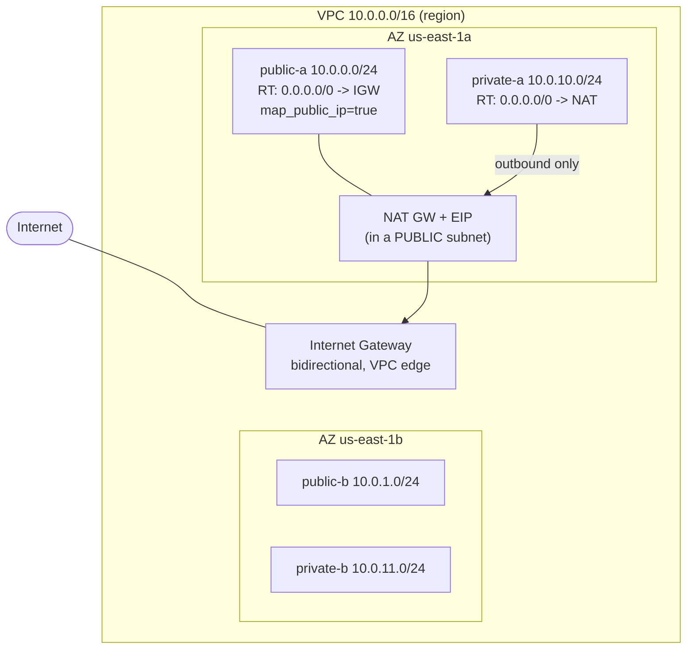

# 05.1 – VPC Core (subnets, routing, IGW, NAT)

The plumbing of a VPC: how you carve address space into public and private subnets and control which way traffic can flow. Part of the [[05-vpc]] topic.

## What problem does this solve?

Your servers have to live on a network. Something has to decide which addresses they get, which of them can be reached from the internet, and which can only reach out.

AWS hands you that network as something you define rather than something you're given: a **VPC** — a private virtual network, scoped to one region, whose address range you choose yourself as a CIDR block like `10.0.0.0/16`. Inside it you cut smaller ranges, **subnets**, and each subnet is pinned to a single Availability Zone.

Then comes the part that trips people up. Nothing on a subnet says "this one is exposed to the internet." Exposure is a *consequence* — of the routes attached to that subnet, and of whether its instances got a public IP. Change the routing and the same subnet flips from public to private without moving a single server.

That indirection is the entire design. It is also what lets a private subnet still reach *out* — to fetch updates, to call an API — while nothing on the internet can start a conversation *in*. That inbound/outbound asymmetry is the core of the public/private design.

> In one line: a VPC is a network you define; whether any part of it is public is a routing decision, not a property of the subnet.

## How it actually works

### The address space, and the five IPs you never get

A VPC spans a whole region. A subnet lives in exactly **one** AZ. That one fact drives most VPC layouts: to survive an AZ failure you need a subnet in each AZ, which is why the build here has public-a *and* public-b, private-a *and* private-b, rather than one of each.

The VPC's CIDR must be between `/16` and `/28`. Choose it with a second thing in mind: if you ever want to peer two VPCs, their CIDRs must not overlap. Two VPCs both sitting on `10.0.0.0/16` can't be peered.

Then the arithmetic that catches people. A `/24` looks like 256 addresses. You get **251**, because AWS reserves five in *every* subnet:

| Address | Reserved for |
|---|---|
| `.0` | network address |
| `.1` | the VPC router |
| `.2` | DNS |
| `.3` | future use |
| last (`.255` in a `/24`) | broadcast |

Five gone in *every* subnet, whatever its size — the two worth remembering by name are `.1`, the VPC router, and `.2`, DNS. This is exam-frequent, and the trap is pure arithmetic — size a subnet for exactly 256 hosts and you come up five short.

> In one line: a subnet is one AZ, a VPC is one region, and every subnet is five addresses smaller than it looks.

### There is no public subnet checkbox

A subnet is public only when **both** of these are true:

1. Its route table carries `0.0.0.0/0 → Internet Gateway`.
2. Its instances get a public IP — via `map_public_ip_on_launch` on the subnet, or an Elastic IP.

Miss either and the subnet is effectively private, and it's worth seeing *why* each half fails on its own. A route to the IGW but no public IP: nothing on the internet has an address to send to. A public IP but no IGW route: the address exists, but the subnet's route table offers no path to the internet, so it still can't be reached.

So the thing doing the deciding is the **route table**, not the subnet.

Which raises an obvious question — what routes a subnet you never associated with a route table? Every VPC has a **main route table**, and any subnet not explicitly associated falls back to it.

That fallback is exactly why there is a hard rule here: **never add an IGW route to the main route table**. Do it and every subnet you forget to wire up becomes internet-exposed by default. Leave it alone, keep custom route tables and explicit associations, and a forgotten subnet fails *closed* — private, useless, and safe. Failing closed rather than open is the whole point.

The Internet Gateway itself is the least fussy piece here. One per VPC, attached at the VPC edge, horizontally scaled and redundant, no bandwidth limit, and free — you pay for the data transfer, not the gateway. And unlike everything else in this note, it is **bidirectional**: traffic flows both ways through it.

> In one line: public = IGW route + public IP, both required; the route table decides, and the main route table must never be the one that says yes.

### Why the NAT gateway has to live in a public subnet

A private subnet still needs to reach out. That is the NAT gateway's job: it takes traffic from private instances, sends it to the internet on their behalf, and returns the replies. Because it only ever tracks connections *started from inside*, unsolicited inbound traffic has nothing to match against and is dropped. That is the outbound-only asymmetry, implemented.

Now the counter-intuitive bit — the one that cost an hour of debugging while building this topic. The NAT gateway sits **in a public subnet**, not in the private subnets it serves.

The reason becomes obvious once you trace the packet. The NAT has to reach the internet itself, so *its* subnet's route table must point at the IGW. There are two hops, not one:

| Route table | Default route |
|---|---|
| the private subnets' RT | `0.0.0.0/0 → NAT gateway` |
| the NAT's own (public) subnet RT | `0.0.0.0/0 → IGW` |

Put the NAT in a private subnet whose default route is the NAT itself and you have built a loop: the NAT's own egress follows `0.0.0.0/0 → itself` and never reaches the IGW. AWS **creates this without an error**. There is no failure message anywhere — the private instances just silently have no internet, and you burn an hour debugging "why can't my instance apt-install."

Two more properties follow from what a NAT gateway is. It needs an **EIP**, because it has to present a real public address to the internet. And it has **no security group** at all — there is nothing to attach, so nothing to misconfigure.

One boundary worth holding: a NAT gateway does no IPv6-to-IPv6 translation — IPv6 addresses are globally routable, so there is nothing to translate. For **outbound-only IPv6** the answer is the **egress-only Internet Gateway**, which sits at the VPC edge rather than inside a subnet. The one IPv6 job a NAT gateway *does* have is **NAT64**: always on, and paired with **DNS64** on the subnet it lets IPv6-only workloads reach IPv4-only destinations.

> In one line: the NAT needs its own door to the internet, so it lives in a public subnet — the private RT points at the NAT, and the NAT's RT points at the IGW.

### Why one NAT gateway is not enough

A NAT gateway is redundant *within* its AZ — and AZ-scoped. Those two facts together are the trap.

Route every private subnet, across every AZ, through a single NAT gateway and it works perfectly, which is the problem. If that NAT's AZ goes down, **every** private subnet in **every** AZ loses egress, not only the ones sharing its AZ. And in normal operation, traffic crossing from another AZ to reach it is billed as cross-AZ traffic — you pay extra, every day, for the privilege of a single point of failure.

The production answer is one NAT gateway per AZ, with each AZ's private route table pointing at its local NAT. That costs more up front — a NAT bills roughly $0.045/hr plus per-GB data processed (⚠️ check current pricing) — which is exactly the cost-versus-resilience tradeoff the exam likes to probe.

The legacy alternative is a **NAT instance**: an EC2 box you run yourself. It is worth knowing for two odd properties. It needs its **source/destination check disabled**, which the managed gateway has no equivalent setting for. And because it *is* an instance, it has a security group and can double as a bastion. Reach for it on the exam when the question emphasises cost at tiny scale, or wants the NAT box to also be a bastion — otherwise the answer is the NAT gateway.

> In one line: a NAT gateway is redundant inside its AZ and nowhere else — one per AZ, or you have built a single point of failure with a cross-AZ bill attached.

### The defaults that behave backwards from what you create

Creating a VPC quietly creates three more things:

- a **main route table**,
- a **default NACL** — allows all traffic, in and out,
- a **default security group** — self-referencing inbound, allow-all outbound.

Here is the flip that gets tested. A **custom** NACL you create yourself **denies everything** until you add numbered rules. A **new** security group denies inbound. So the defaults are permissive and anything you make is restrictive — the opposite pairing to the one most people assume, which is what makes it such a reliable distractor.

There is no rationale to reason your way back to here — just hold the direction: what AWS made for you is open, what you make yourself is closed. One exception, and it gets tested: **outbound on a security group is allow-all** whether AWS created it or you did.

Terraform knows about none of the three. They are not in your state unless you deliberately adopt them with the `aws_default_*` resources — which is why the console showed a **third** route table after an apply that only defined two.

> In one line: AWS's own defaults are open, anything you create is closed, and Terraform ignores the defaults until you adopt them.

## Exam recap

*Now that the mechanisms are clear, this is the compressed version to revise from.*

> [!info] Exam TL;DR
> - A **subnet is public** iff **(1)** its route table has `0.0.0.0/0 → Internet Gateway` **and (2)** instances get a public IP (`map_public_ip_on_launch` or an EIP). Miss either and it's effectively private. There is no "public" checkbox.
> - **Route tables decide public vs private**, not the subnet itself. Any subnet not explicitly associated uses the VPC's **main route table**.
> - **IGW = bidirectional**, sits at the VPC edge, one per VPC. **NAT = outbound-only** for private subnets, lives *in a public subnet*, needs an EIP.
> - Creating a VPC auto-creates **3 defaults**: main route table, default NACL (allow-all), default SG (self-referencing). A **new custom** NACL denies all; a **new custom** SG denies inbound — opposite of the defaults.
> - Subnets are **AZ-scoped**; a VPC spans a region. AWS reserves **5 IPs per subnet** (first 4 + last 1).
> - **NAT gateway** = managed, AZ-scoped, one-per-AZ for HA, no SG. **NAT instance** = legacy EC2, needs source/dest-check off, has an SG, can double as a bastion.

## AWS console ↔ Terraform map

| Console / concept | Terraform | Key args / notes |
|---|---|---|
| Create a VPC | `aws_vpc` | `cidr_block`; set `enable_dns_hostnames = true` + `enable_dns_support = true` (public DNS + required for interface endpoints). |
| Look up AZ names | `data "aws_availability_zones" { state = "available" }` | `.names[0]`, `.names[1]` — don't hardcode `"us-east-1a"`. |
| Create a subnet | `aws_subnet` | `vpc_id`, `cidr_block`, `availability_zone`, `map_public_ip_on_launch` (true for public). |
| Internet gateway | `aws_internet_gateway` | `vpc_id` attaches it. One per VPC. |
| Route table | `aws_route_table` | Inline `route {}` OR separate `aws_route` — pick one, don't mix (drift). |
| Add a route | `aws_route` (or inline) | `gateway_id` (IGW), `nat_gateway_id` (NAT), `destination_cidr_block`. |
| Associate subnet ↔ RT | `aws_route_table_association` | One per (subnet, RT). Unassociated subnets fall back to the main RT. |
| Allocate EIP for NAT | `aws_eip` | `domain = "vpc"`. |
| NAT gateway | `aws_nat_gateway` | `allocation_id` (EIP) + `subnet_id` = a **public** subnet; `depends_on = [igw]` recommended. |
| Adopt the auto-created defaults | `aws_default_route_table` / `aws_default_network_acl` / `aws_default_security_group` | Manage (not create) the freebies AWS made. Optional; use to lock them down. |

## Architecture diagram

## Key facts, limits & pricing

- **A subnet lives in exactly one AZ.** A VPC spans all AZs in its region. To be multi-AZ you create one subnet per AZ (that's why we build public-a/public-b, private-a/private-b).
- **The two conditions for "public"** (both required): route to IGW **and** a public IP on the instance. A subnet with an IGW route but no public IP, or a public IP but no IGW route, can't be reached from the internet.
- **AWS reserves 5 IP addresses in every subnet**: network address (`.0`), VPC router (`.1`), DNS (`.2`), future use (`.3`), and broadcast (`.255`, last). So a `/24` gives 251 usable, not 256. (Exam-frequent.)
- **VPC CIDR** must be `/16`–`/28`. CIDR blocks can't overlap if you plan to peer VPCs later.
- **Every new VPC gets 3 freebies**: a **main route table**, a **default NACL** (allow-all in/out), and a **default security group** (self-referencing inbound + allow-all outbound). Terraform ignores these unless you adopt them with the `aws_default_*` resources. **Best practice: never add an IGW route to the main route table** — so a subnet you forget to associate fails *closed* (private), not open.
- **IGW**: horizontally scaled, redundant, no bandwidth limit, one per VPC, free (you pay for the data transfer, not the IGW). Bidirectional.
- **NAT gateway**: managed, **5 Gbps scaling automatically to 100 Gbps**, redundant **within one AZ** but **AZ-scoped** — for real HA you deploy **one NAT gateway per AZ** and point each private subnet's RT at the NAT in its own AZ (else an AZ failure cuts egress, and cross-AZ NAT traffic is billed). Has **no security group**. Needs an EIP. Bills **~$0.045/hr + per-GB data processed** — ⚠️ check current pricing. Outbound-only; drops unsolicited inbound.
- **Egress-only Internet Gateway (`aws_egress_only_internet_gateway`)**: the **IPv6** equivalent of a NAT gateway — outbound-only internet for IPv6 (IPv6 is globally routable, so you can't use NAT; you use this instead). IPv4 has no analog need because private IPv4 isn't routable.

## Comparisons

### NAT Gateway vs NAT Instance

|   | NAT Gateway | NAT Instance (legacy) |
|---|---|---|
| Managed by | AWS | You (it's an EC2 instance) |
| HA | Redundant within an AZ; 1 per AZ for cross-AZ HA | Manual (script failover / ASG) |
| Bandwidth | Scales automatically | Bounded by instance type |
| Security group | **None** (can't attach) | Yes (it's an EC2 instance) |
| Source/dest check | N/A | **Must be disabled** |
| Bastion / port-forward | No | Yes (can double as bastion) |
| Maintenance/patching | AWS | You |
| Cost | Hourly + data processing | EC2 hourly (+ can be smaller/cheaper) |

Exam default: **NAT gateway** unless the question emphasizes cost-at-tiny-scale or needing the NAT box to also be a bastion → NAT instance.

### IGW vs NAT Gateway vs Egress-only IGW

|   | IGW | NAT Gateway | Egress-only IGW |
|---|---|---|---|
| Protocol | IPv4 + IPv6 | IPv4 (+ IPv6→IPv4 via NAT64/DNS64) | IPv6 |
| Direction | Bidirectional | Outbound only | Outbound only |
| Lives | VPC edge | In a public subnet | VPC edge |
| For | public subnets | private subnets (IPv4) | private IPv6 egress |

## Worked examples

> [!example] Worked example — the three-tier web app network
> A classic layout your [[04-alb-asg]] stack belongs in: **public subnets** (2 AZs) hold the internet-facing ALB and a bastion; **private "app" subnets** (2 AZs) hold the ASG instances (reachable only from the ALB's SG); **private "data" subnets** (2 AZs) hold RDS (reachable only from the app SG). Only the ALB has a public path in; instances pull updates *out* via a **per-AZ NAT gateway**; the database has no internet route at all. Every tier is one route-table decision. This is the canonical SAA-C03 diagram — memorize the shape.

> [!failure] Failure mode — NAT gateway in the wrong subnet (the routing loop)
> Placing the NAT gateway in a **private** subnet (or pointing the private RT's default route at a NAT that lives in that same private subnet) creates a loop: the NAT's own egress follows `0.0.0.0/0 → itself`, never reaching the IGW. AWS **creates it without error**, so there's no failure message — private instances just silently have no internet, and you burn an hour debugging "why can't my instance apt-install." Fix: the NAT gateway must sit in a **public** subnet (one whose RT routes to the IGW); the private RT points *at* the NAT, the NAT's own subnet points at the IGW. (Hit live while building this topic.)

> [!failure] Failure mode — single NAT gateway as an AZ SPOF
> Deploying one NAT gateway and routing *all* private subnets (across AZs) through it saves money but makes that AZ a single point of failure: if the NAT's AZ goes down, every private subnet in every AZ loses egress, and in normal operation cross-AZ traffic to the NAT is billed. Production fix: **one NAT gateway per AZ**, each AZ's private RT → its local NAT. Cost vs resilience tradeoff the exam probes.

## The Terraform I wrote

Code: [`05-vpc/network.tf`](../05-vpc/network.tf) (core) + [`05-vpc/nat.tf`](../05-vpc/nat.tf) (paid peek)

- `data.aws_availability_zones` → `.names[0]/[1]` for the AZs; `aws_vpc.this` with DNS attributes on; 4 subnets (2 public with `map_public_ip_on_launch = true`, 2 private without); `aws_internet_gateway`; `aws_route_table.public` (inline `route` → IGW) + `aws_route_table.private` (no internet route); 4 `aws_route_table_association`.
- NAT peek: `aws_eip.nat` + `aws_nat_gateway.this` (in **public-a**, `depends_on` the IGW) + `aws_route.private_nat` (`0.0.0.0/0 → nat` on the private RT).
- Console showed a **3rd route table** — the auto-created **main route table** AWS makes with every VPC (plus the default NACL + default SG). None are Terraform-managed.

> [!warning] Trap — "the default NACL and a new NACL behave the same"
> Opposite. The **default** NACL allows all traffic both ways; a **custom** NACL you create **denies all** until you add numbered rules. Same flip exists for the default vs custom SG. Getting the direction of the default wrong is a classic distractor.

> [!warning] Trap — "add the IGW route to the main route table to make setup simpler"
> Never. That makes every unassociated subnet public by default — a subnet you forget to wire becomes internet-exposed. Keep custom route tables and explicit associations so forgotten subnets fail closed.

> [!example]- Recreate-from-memory drill
> Build a 2-AZ VPC (`10.0.0.0/16`): 2 public + 2 private subnets, an IGW, a public RT (`0.0.0.0/0 → IGW`) associated to the public subnets, a private RT associated to the private subnets, then a NAT gateway (public subnet + EIP) with the private RT routing `0.0.0.0/0 → NAT`. Confirm in the console: public subnets auto-assign public IPs; the route-table Subnet-associations tabs match; NAT sits in a public subnet.
> > [!success]- Reference solution
> > See `05-vpc/network.tf` + `nat.tf`. The one people get wrong is the NAT gateway's `subnet_id` — it must be a **public** subnet.

## 🔴 My weak spots (this topic)   #weak-spot

- [ ] **NAT gateway subnet placement** — put it in a *private* subnet on the first try; it must be **public** (that's its own door to the IGW). The private RT points *at* it.
- [ ] **Default vs custom NACL/SG behavior flips** — default NACL allows all, custom NACL denies all; default SG self-references, new SG denies inbound. Easy to state backwards.
- [ ] **The 3 auto-created VPC defaults** (main RT, default NACL, default SG) — didn't expect the 3rd route table in the console; they're AWS freebies, not Terraform-managed.
- [ ] **Single-NAT AZ SPOF** — one NAT for all AZs is a resilience + cross-AZ-cost trap; production uses one per AZ.

## 🔗 Docs

- [VPC subnets & routing](https://docs.aws.amazon.com/vpc/latest/userguide/configure-subnets.html)
- [Subnet reserved IPs (5 per subnet)](https://docs.aws.amazon.com/vpc/latest/userguide/subnet-sizing.html)
- [NAT gateways](https://docs.aws.amazon.com/vpc/latest/userguide/vpc-nat-gateway.html) — per-AZ HA, no SG, needs public subnet + EIP
- [NAT gateway vs NAT instance comparison](https://docs.aws.amazon.com/vpc/latest/userguide/vpc-nat-comparison.html)
- [Egress-only internet gateways (IPv6)](https://docs.aws.amazon.com/vpc/latest/userguide/egress-only-internet-gateway.html)
- [Terraform `aws_vpc`](https://registry.terraform.io/providers/hashicorp/aws/latest/docs/resources/vpc) / [`aws_nat_gateway`](https://registry.terraform.io/providers/hashicorp/aws/latest/docs/resources/nat_gateway)

---
**Self-test for this topic:** [[revision/05-vpc-core-revision#Self-test]]
