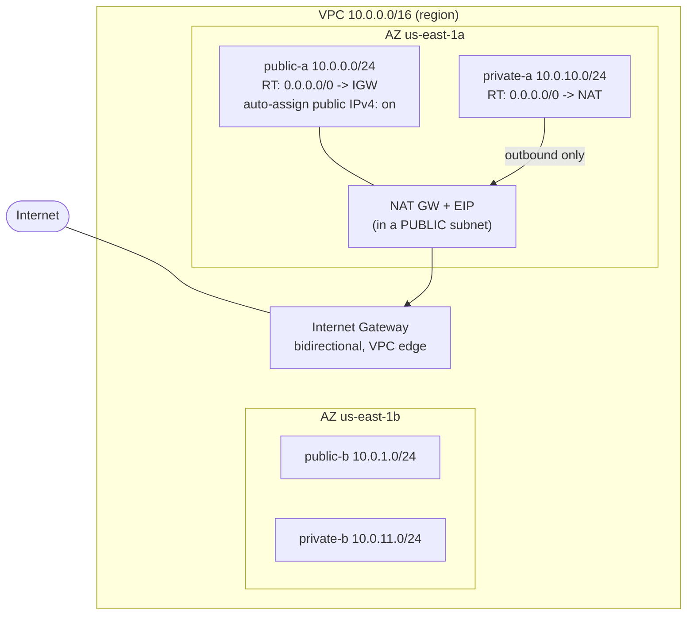

# 05.1 – VPC Core (subnets, routing, IGW, NAT)

The plumbing of a VPC: how you carve address space into public and private subnets and control which way traffic can flow. Part of the [[05-vpc]] topic.

> [!info] Exam TL;DR
> - **AWS defines a subnet's type by its routing alone**: *"Public subnet – The subnet has a direct route to an internet gateway"*; private means no such route. **Reachability needs a second thing**: the instance also needs a public IP (the subnet's **Auto-assign public IPv4 address** setting, or an **EIP**, an Elastic IP — a static public IPv4 address allocated to your account rather than to an instance), because *"instances in the private subnet can't communicate with the internet, even if they have public IP addresses"* and a public subnet's instances *"must have public IP addresses or Elastic IP addresses"*. So the route decides the **label**; route + IP decides whether anything actually works. There is no "public" checkbox either way.
> - **Route tables decide public vs private**, not the subnet itself. Any subnet not explicitly associated uses the VPC's **main route table**.
> - **IGW = bidirectional** — traffic can start on either side — and it sits at the VPC edge, one per VPC. **NAT = outbound-only**: private instances can start connections out, nothing on the internet can start one in.
> - Creating a VPC auto-creates **3 defaults**: main route table, default NACL (allow-all), default SG (self-referencing). A **new custom** NACL denies all; a **new custom** SG denies inbound — opposite of the defaults.
> - Subnets are **AZ-scoped**; a VPC spans a region. AWS reserves **5 IPs per subnet** (first 4 + last 1).
> - **Default to the NAT gateway**; pick a NAT instance only if the stem stresses tiny-scale cost or wants the NAT box to double as a bastion. **NAT gateway** = managed, AZ-scoped, one-per-AZ for HA, **no SG ever**. A **public** NAT gateway needs an EIP and lives in a public subnet; a **private** one cannot have an EIP and is for reaching other VPCs or on-prem, not the internet. **NAT instance** = legacy EC2, needs source/dest-check off, has an SG, can double as a bastion.

## What problem does this solve?

Your servers have to live on a network. Something has to decide which addresses they get, which of them can be reached from the internet, and which can only reach out.

AWS hands you that network as something you define rather than something you're given: a **VPC** — a private virtual network, scoped to one region, whose address range you choose yourself as a CIDR block like `10.0.0.0/16`. Inside it you cut smaller ranges, **subnets**, and each subnet is pinned to a single Availability Zone.

Then comes the part that trips people up. Nothing on a subnet says "this one is exposed to the internet." Exposure is a *consequence* — of the routes attached to that subnet, and of whether its instances got a public IP. Change the routing and the same subnet flips from public to private without moving a single server.

That indirection is the entire design. It is also what lets a private subnet still reach *out* — to fetch updates, to call an API — while nothing on the internet can start a conversation *in*. That inbound/outbound asymmetry is the core of the public/private design.

> In one line: a VPC is a network you define; whether any part of it is public is a routing decision, not a property of the subnet.

## How it actually works

### The address space, and the five IPs you never get

A VPC spans a whole region. A subnet lives in exactly **one** AZ. That one fact drives most VPC layouts: to survive an AZ failure you need a subnet in each AZ, which is why a standard layout carries public-a *and* public-b, private-a *and* private-b, rather than one of each. (It is also why an instance's subnet choice fixes its AZ — see [[02-ec2]].)

The VPC's CIDR must be between `/16` and `/28`. Choose it with a second thing in mind: if you ever want to peer two VPCs, their CIDRs must not overlap. Two VPCs both sitting on `10.0.0.0/16` can't be peered.

Then the arithmetic that catches people. A `/24` looks like 256 addresses. You get **251**, because AWS reserves five in *every* subnet:

| Address | Reserved for |
|---|---|
| `.0` | network address |
| `.1` | the VPC router |
| `.2` | DNS |
| `.3` | future use |
| last (`.255` in a `/24`) | broadcast |

Five gone in effectively every subnet you will build, whatever its size — the two worth remembering by name are `.1`, the VPC router, and `.2`, DNS. (One documented exception, on the same page: in a range you brought to AWS via **BYOIP**, *"you can use all of the IP addresses in the range, including the first address (the network address) and the last address (the broadcast address)"*.) This is exam-frequent, and the trap is pure arithmetic — size a subnet for exactly 256 hosts and you come up five short.

> In one line: a subnet is one AZ, a VPC is one region, and every subnet is five addresses smaller than it looks.

### There is no public subnet checkbox

Be precise about two different questions here, because the exam asks both.

**What AWS calls the subnet** depends on routing and nothing else: *"The subnet type is determined by
how you configure routing for your subnets"* — a **public subnet** *"has a direct route to an
internet gateway"*, a **private subnet** does not. (AWS names three more types off the same rule: a
**VPN-only** subnet routes to a virtual private gateway and not an IGW, an **isolated** subnet has
*"no routes to destinations outside its VPC"*, and an **EVS** subnet comes from Amazon EVS.)

**Whether anything in it can actually reach the internet** needs both halves:

1. Its route table carries `0.0.0.0/0 → Internet Gateway`.
2. Its instances get a public IP — via the subnet's **Auto-assign public IPv4 address** setting, or an Elastic IP.

And it is worth seeing *why* each half fails on its own. A route to the IGW but no public IP: nothing on the internet has an address to send to — AWS says instances in a public subnet *"must have public IP addresses or Elastic IP addresses to enable communication with the internet"*. A public IP but no IGW route: the address exists but there is no path, and AWS is blunt about it — instances in a private subnet *"can't communicate with the internet, **even if they have public IP addresses**"*. A subnet in that first state is still "public" by AWS's naming and useless in practice, which is exactly the gap a question can sit in. *(Verified 2026-10-04.)*

So the thing doing the deciding is the **route table**, not the subnet.

Which raises an obvious question — what routes a subnet you never associated with a route table? Every VPC has a **main route table**, and any subnet not explicitly associated falls back to it.

That fallback is exactly why there is a strong convention here: **don't add an IGW route to the main route table** in VPCs you build. Do it and every subnet you forget to wire up becomes internet-exposed by default. Note it is a convention, not an AWS prohibition — AWS's own **default VPC** ships exactly that way (its main route table carries a `0.0.0.0/0 → IGW` route, which is why everything in a default VPC is internet-facing out of the box), and that is precisely the behaviour you opt out of when you build your own. Leave it alone, keep custom route tables and explicit associations, and a forgotten subnet fails *closed* — private, useless, and safe. Failing closed rather than open is the whole point.

The Internet Gateway itself is the least fussy piece here. One per VPC, attached at the VPC edge, horizontally scaled and redundant, no bandwidth limit, and free — you pay for the data transfer, not the gateway. And unlike everything else in this note, it is **bidirectional**: traffic flows both ways through it.

> In one line: public = IGW route + public IP, both required; the route table decides, and the main route table must never be the one that says yes.

### Why the NAT gateway has to live in a public subnet

A private subnet still needs to reach out. That is the NAT gateway's job: it takes traffic from private instances, sends it to the internet on their behalf, and returns the replies. Because it only ever tracks connections *started from inside*, unsolicited inbound traffic has nothing to match against and is dropped. That is the outbound-only asymmetry, implemented.

Now the counter-intuitive bit, and the one most worth slowing down for. A zonal NAT gateway sits **in a public subnet**, not in the private subnets it serves.

The reason becomes obvious once you trace the packet. The NAT has to reach the internet itself, so *its* subnet's route table must point at the IGW. There are two hops, not one:

| Route table | Default route |
|---|---|
| the private subnets' RT | `0.0.0.0/0 → NAT gateway` |
| the NAT's own (public) subnet RT | `0.0.0.0/0 → IGW` |

Picture the broken version concretely. The NAT sits in subnet X; X's route table says `0.0.0.0/0 → the NAT`; so when the NAT itself tries to send a packet out, that route hands it straight back to the NAT. That is the loop — the NAT's own egress follows `0.0.0.0/0 → itself` and never reaches the IGW. If the VPC has an IGW but the NAT's own subnet does not route to it, AWS **creates the NAT gateway without complaining** — the private instances just silently have no internet, and you burn an hour debugging "why can't my instance apt-install." (AWS only refuses outright when the VPC has **no internet gateway at all**: creation then lands in `Failed` with the state message *"Network vpc-xxxxxxxx has no internet gateway attached"*, and a failed NAT gateway auto-deletes after about an hour.)

Two more properties follow from what a NAT gateway is. It has **no security group** at all — *"You
can't associate a security group with a NAT gateway"* — so there is nothing to attach. That is not the
same as nothing to misconfigure: the **NACL on the NAT's subnet** still filters its traffic, and a
NAT gateway sources from ports **1024–65535**, so a too-narrow ephemeral-port range in that NACL
kills egress silently. The gateway itself is **stateful** — it *"allows all outbound traffic and
traffic received in response to an outbound request"*. And a **public** NAT gateway needs an **EIP**, because it has to
present a real public address to the internet — *"must associate an Elastic IP address with the NAT
gateway at creation"*.

That word *public* is doing work. A NAT gateway has a **connectivity type**, chosen at creation:

- **Public** (the default) — sits in a public subnet, carries an EIP, and reaches the internet via the IGW. This is the one the exam means.
- **Private** — for reaching *other VPCs or your on-premises network* through a transit gateway or virtual private gateway, never the internet. You *"can't associate an Elastic IP address with a private NAT gateway"*, and if you do route it at an IGW, *"the internet gateway drops the traffic"*.

So "a NAT gateway needs an EIP" is true of the public kind only. *(Verified 2026-10-04.)*

One boundary worth holding: a NAT gateway does no IPv6-to-IPv6 translation — IPv6 addresses are globally routable, so there is nothing to translate. For **outbound-only IPv6** the answer is the **egress-only Internet Gateway**, which sits at the VPC edge rather than inside a subnet. The one IPv6 job a NAT gateway *does* have is **NAT64** — translating an IPv6 packet into an IPv4 one so an IPv6-only client can talk to an IPv4-only server. It is always on, and it pairs with **DNS64**, the matching Route 53 Resolver behaviour that hands an IPv6-only host a synthesised IPv6 address for an IPv4-only name, so there is something to send to in the first place.

> In one line: the NAT needs its own door to the internet, so it lives in a public subnet — the private RT points at the NAT, and the NAT's RT points at the IGW.

### Why one NAT gateway is not enough

A NAT gateway is redundant *within* its AZ — and AZ-scoped. Those two facts together are the trap.

Route every private subnet, across every AZ, through a single NAT gateway and it works perfectly, which is the problem. If that NAT's AZ goes down, **every** private subnet in **every** AZ loses egress, not only the ones sharing its AZ. And in normal operation, traffic crossing from another AZ to reach it is billed as cross-AZ traffic — you pay extra, every day, for the privilege of a single point of failure.

The **exam** answer is one NAT gateway per AZ, with each AZ's private route table pointing at its local NAT — still what AWS's NAT basics page recommends. AWS's *current production* guidance has moved past it (see the currency note below). That costs more up front — a NAT bills **$0.045/hr plus $0.045 per GB processed** in us-east-1 as of 2026-10-04 (storage and network prices move; re-check rather than trusting this figure later) — which is exactly the cost-versus-resilience tradeoff the exam likes to probe.

⚠️ Currency, and read the flag before you memorise it: AWS now also offers a **regional NAT
gateway**, created with availability mode `regional` instead of the default zonal one. It
*"automatically expands across Availability Zones based on your workload presence"*, needs **no
public subnet** (*"you do not need a public subnet in your VPC to host a regional NAT Gateway"*),
gets its own AWS-managed route table with a pre-configured route to the IGW, and lets every private
subnet across every AZ point at **one NAT gateway ID**. It raises the per-AZ IP limit from 8 to 32,
and it bills *"$0.045 per hour per AZ"* — so it is automation, not a discount. Two limits: it does
**not** support private NAT (use zonal for that), and expansion into a newly used AZ can take *"up
to 60 minutes"*. **For the exam, keep answering "one NAT gateway per AZ"** — that is still what the
NAT basics page recommends (*"To improve resiliency, create a NAT gateway in each Availability
Zone"*) and the regional mode is too recent to assume it appears in SAA-C03 questions. Know it
exists so a stem mentioning it doesn't surprise you. *(Verified 2026-10-04.)*

The legacy alternative is a **NAT instance**: an EC2 box you run yourself. It is worth knowing for two odd properties. It needs its **source/destination check disabled**. That check is an EC2 network-interface setting which, while on, makes the instance drop any packet that is neither addressed to it nor sent from it — which is exactly what forwarding somebody else's traffic looks like. A NAT box's whole job is that forwarding, so the check has to come off. The managed gateway has no equivalent setting because it is not an instance. And because it *is* an instance, it has a security group and can double as a bastion. Reach for it on the exam when the question emphasises cost at tiny scale, or wants the NAT box to also be a bastion — otherwise the answer is the NAT gateway.

> In one line: a NAT gateway is redundant inside its AZ and nowhere else — one per AZ, or you have built a single point of failure with a cross-AZ bill attached.

### The defaults that behave backwards from what you create

Creating a VPC quietly creates three more things:

- a **main route table**,
- a **default NACL** — allows all traffic, in and out,
- a **default security group** — **self-referencing** inbound, meaning the only inbound it permits is traffic from resources that are themselves in that same security group; outbound is allow-all.

Here is the flip that gets tested. A **custom** NACL you create yourself **denies everything** until you add numbered rules, and a **new** security group denies all inbound. So AWS's defaults are the *looser* of each pair and anything you make yourself starts tighter — the opposite pairing to the one most people assume, which is what makes it such a reliable distractor.

Be precise about how loose "loose" is, because the two defaults differ: the default **NACL** really does allow everything in both directions, while the default **security group** only allows inbound *from itself*. It is permissive relative to a new SG, not wide open.

There is no rationale to reason your way back to here — just hold the direction: what AWS made for you is looser, what you make yourself is closed. One exception, and it gets tested: **outbound on a security group is allow-all** whether AWS created it or you did. ([[05-vpc-security]] owns the NACL-versus-SG comparison in full.)

All three exist from the moment the VPC does, whether or not you asked for them — which is why a VPC in which you created two route tables shows **three** in the console.

> In one line: AWS's own defaults are permissive and anything you create yourself starts closed — so never route the main route table to an IGW, and a subnet you forget to associate fails private.

## Architecture diagram

```mermaid
flowchart TB
    NET([Internet]) --- IGW[Internet Gateway<br/>bidirectional, VPC edge]
    IGW --- VPC
    subgraph VPC["VPC 10.0.0.0/16 (region)"]
      subgraph AZA["AZ us-east-1a"]
        PUBA["public-a 10.0.0.0/24<br/>RT: 0.0.0.0/0 -> IGW<br/>auto-assign public IPv4: on"]
        PRIA["private-a 10.0.10.0/24<br/>RT: 0.0.0.0/0 -> NAT"]
        NAT["NAT GW + EIP<br/>(in a PUBLIC subnet)"]
      end
      subgraph AZB["AZ us-east-1b"]
        PUBB["public-b 10.0.1.0/24"]
        PRIB["private-b 10.0.11.0/24"]
      end
      PUBA --- NAT
      PRIA -->|outbound only| NAT --> IGW
    end
```

## Key facts, limits & pricing

- **A subnet lives in exactly one AZ.** A VPC spans all AZs in its region. To be multi-AZ you create one subnet per AZ — hence the public-a/public-b, private-a/private-b shape.
- **The two conditions for "public"** (both required): route to IGW **and** a public IP on the instance. A subnet with an IGW route but no public IP, or a public IP but no IGW route, can't be reached from the internet.
- **AWS reserves 5 IP addresses in every subnet**: network address (`.0`), VPC router (`.1`), DNS (`.2`), future use (`.3`), and broadcast (`.255`, last). So a `/24` gives 251 usable, not 256. (Exam-frequent.)
- **VPC CIDR** must be `/16`–`/28`. CIDR blocks can't overlap if you plan to peer VPCs later.
- **Every new VPC gets 3 freebies**: a **main route table**, a **default NACL** (allow-all in/out), and a **default security group** (self-referencing inbound + allow-all outbound). **Best practice: never add an IGW route to the main route table** — so a subnet you forget to associate fails *closed* (private), not open.
- **IGW**: horizontally scaled, redundant, no bandwidth limit, one per VPC, free (you pay for the data transfer, not the IGW). Bidirectional.
- **NAT gateway**: managed, **no security group ever**, outbound-only (drops unsolicited inbound) and **stateful**. It has two **availability modes** — **zonal** (the classic one) is redundant *within* one AZ but AZ-scoped, needs a public subnet and an EIP, so for HA you deploy **one per AZ** and point each private subnet's RT at its local NAT, else an AZ failure cuts egress everywhere and cross-AZ NAT traffic is billed; **regional** (launched **19 Nov 2025**) is a single NAT ID that auto-expands across AZs with no public subnet. Separately it has a **connectivity type** — **public** (EIP, internet via the IGW) or **private** (no EIP, other VPCs/on-prem via a transit or virtual private gateway only). Bills **$0.045/hr + $0.045/GB processed** (us-east-1, verified 2026-10-04 — re-check rather than trusting the figure later). Outbound-only; drops unsolicited inbound.
- **NAT gateway throughput and connection limits:** *"supports 5 Gbps of bandwidth and automatically scales up to 100 Gbps"*, and *"can process one million packets per second and automatically scales up to 10 million packets per second"* — beyond that it **drops packets**, and the fix is to split resources across subnets with a NAT gateway each. Each IPv4 address supports **55,000 simultaneous connections to each unique destination** (destination IP + port + protocol); you can raise that by attaching up to **8 IPv4 addresses** (1 primary + 7 secondary), though you are limited to **2 EIPs per public NAT gateway by default**. Protocols: **TCP, UDP and ICMP** only. *(Verified 2026-10-04.)*
- **Two routing restrictions the exam can hang a question on:** you *"can't route traffic to a NAT gateway through a VPC peering connection"* (the reverse — out through the NAT then across the peering — is fine), and you *"can't route traffic to a NAT gateway from Site-to-Site VPN or Direct Connect using a virtual private gateway"* — though you **can** if you use a **transit gateway** instead. *(Verified 2026-10-04.)*
- **A VPC's CIDR block cannot be resized.** *"You cannot increase or decrease the size of an existing CIDR block"* — you add **secondary** CIDR blocks instead (also `/16`–`/28`, non-overlapping). You also can't use `0.0.0.0/8`, `127.0.0.0/8`, `169.254.0.0/16` or `224.0.0.0/4`, and AWS warns off `172.17.0.0/16` because some of its own services (Cloud9, SageMaker AI) use it. *(Verified 2026-10-04.)*
- **Egress-only Internet Gateway**: the outbound-only door for **IPv6**. IPv6 addresses are *"globally unique, and therefore public by default"*, so there is no IPv6-to-IPv6 address translation to perform — the EIGW simply blocks inbound. It sits at the VPC edge, is free, and takes no security group. Don't over-read the contrast: a NAT gateway *does* handle IPv6 traffic — *"For IPv6 traffic, NAT gateway performs NAT64"*, which with **DNS64** lets IPv6-only workloads reach IPv4-only destinations. What a NAT gateway does not do is IPv6-to-IPv6.

## Comparisons

### NAT Gateway vs NAT Instance

|   | NAT Gateway | NAT Instance (legacy) |
|---|---|---|
| Managed by | AWS | You (it's an EC2 instance) |
| HA | Redundant within an AZ; 1 per AZ for cross-AZ HA | Manual (script failover / ASG) |
| Bandwidth | Scales automatically | Bounded by instance type |
| Security group | **None** (can't attach) | Yes (it's an EC2 instance) |
| Source/dest check | N/A | **Must be disabled** |
| Bastion / port-forward | No | Yes (can double as bastion) |
| IP fragmentation | **Not supported** for TCP or ICMP | Supported — AWS's documented reason to pick an instance |
| IPsec | **Not supported** (use NAT-T over UDP) | Supported |
| Idle timeout | **350s**, then it returns an `RST` (not a `FIN`) | Yours to tune |
| Default quota | **5 per AZ** | Your EC2 quotas |
| Maintenance/patching | AWS | You |
| Cost | Hourly + data processing | EC2 hourly (+ can be smaller/cheaper) |

Exam default: **NAT gateway** unless the question emphasizes cost-at-tiny-scale or needing the NAT box to also be a bastion → NAT instance.

### IGW vs NAT Gateway vs Egress-only IGW

|   | IGW | NAT Gateway | Egress-only IGW |
|---|---|---|---|
| Protocol | IPv4 + IPv6 | IPv4 (+ IPv6→IPv4 via NAT64/DNS64) | IPv6 |
| Direction | Bidirectional | Outbound only | Outbound only |
| Lives | VPC edge | zonal public: a public subnet · zonal private: a private subnet · **regional: no subnet at all**, VPC-wide | VPC edge |
| For | public subnets | private subnets (IPv4) | private IPv6 egress |

## Worked examples

> [!example] Worked example — the three-tier web app network
> A classic layout your [[04-alb-asg]] stack belongs in: **public subnets** (2 AZs) hold the internet-facing ALB and a bastion; **private "app" subnets** (2 AZs) hold the ASG instances (reachable only from the ALB's SG); **private "data" subnets** (2 AZs) hold RDS (reachable only from the app SG). Only the ALB has a public path in; instances pull updates *out* via a **per-AZ NAT gateway**; the database has no internet route at all. The security-group chaining that makes each tier reachable only from the one in front of it is in [[05-vpc-security]]. Every tier is one route-table decision. This is the canonical SAA-C03 diagram — memorize the shape.

> [!failure] Failure mode — NAT gateway in the wrong subnet (the routing loop)
> Placing the NAT gateway in a **private** subnet (or pointing the private RT's default route at a NAT that lives in that same private subnet) creates a loop: the NAT's own egress follows `0.0.0.0/0 → itself`, never reaching the IGW. AWS **creates it without error**, so there's no failure message — private instances just silently have no internet, and you burn an hour debugging "why can't my instance apt-install." Fix: the NAT gateway must sit in a **public** subnet (one whose RT routes to the IGW); the private RT points *at* the NAT, the NAT's own subnet points at the IGW.

> [!failure] Failure mode — single NAT gateway as an AZ SPOF
> Deploying one NAT gateway and routing *all* private subnets (across AZs) through it saves money but makes that AZ a single point of failure: if the NAT's AZ goes down, every private subnet in every AZ loses egress, and in normal operation cross-AZ traffic to the NAT is billed. Production fix: **one NAT gateway per AZ**, each AZ's private RT → its local NAT. Cost vs resilience tradeoff the exam probes.

> [!warning] Trap — "the default NACL and a new NACL behave the same"
> Opposite. The **default** NACL allows all traffic both ways; a **custom** NACL you create **denies all** until you add numbered rules. Same flip exists for the default vs custom SG. Getting the direction of the default wrong is a classic distractor.

> [!warning] Trap — "add the IGW route to the main route table to make setup simpler"
> Never. That makes every unassociated subnet public by default — a subnet you forget to wire becomes internet-exposed. Keep custom route tables and explicit associations so forgotten subnets fail closed.

## 🔴 My weak spots (this topic)   #weak-spot

- [ ] **NAT gateway subnet placement** — put it in a *private* subnet on the first try; it must be **public** (that's its own door to the IGW). The private RT points *at* it.
- [ ] **Default vs custom NACL/SG behavior flips** — default NACL allows all, custom NACL denies all; default SG self-references, new SG denies inbound. Easy to state backwards.
- [ ] **The 3 auto-created VPC defaults** (main RT, default NACL, default SG) — didn't expect the 3rd route table in the console; they're AWS freebies that exist from the moment the VPC does.
- [ ] **Single-NAT AZ SPOF** — one NAT for all AZs is a resilience + cross-AZ-cost trap; production uses one per AZ.

## 🔗 Docs

- [VPC subnets & routing](https://docs.aws.amazon.com/vpc/latest/userguide/configure-subnets.html)
- [Subnet reserved IPs (5 per subnet)](https://docs.aws.amazon.com/vpc/latest/userguide/subnet-sizing.html)
- [NAT gateways](https://docs.aws.amazon.com/vpc/latest/userguide/vpc-nat-gateway.html) — per-AZ HA, no SG, needs public subnet + EIP
- [NAT gateway vs NAT instance comparison](https://docs.aws.amazon.com/vpc/latest/userguide/vpc-nat-comparison.html)
- [Egress-only internet gateways (IPv6)](https://docs.aws.amazon.com/vpc/latest/userguide/egress-only-internet-gateway.html)
- [Regional NAT gateways](https://docs.aws.amazon.com/vpc/latest/userguide/nat-gateways-regional.html) — automatic multi-AZ expansion, no public subnet, 32 IPs/AZ, no private NAT, up to 60 min to expand; verified 2026-10-04
- [NAT gateway basics](https://docs.aws.amazon.com/vpc/latest/userguide/nat-gateway-basics.html) — 5→100 Gbps, 1M→10M packets/s, 55,000 connections per destination per IP, ports 1024–65535, no security group, NAT64, the peering and virtual-private-gateway routing restrictions; verified 2026-10-04
- [Troubleshoot NAT gateways](https://docs.aws.amazon.com/vpc/latest/userguide/nat-gateway-troubleshooting.html) — the `Failed` state messages, 350s idle timeout and `RST`, no IPsec, no TCP/ICMP fragmentation, 5-per-AZ quota; verified 2026-10-04
- [Subnets for your VPC](https://docs.aws.amazon.com/vpc/latest/userguide/configure-subnets.html) — AWS's own public/private/VPN-only/isolated definitions, by routing alone; verified 2026-10-04
- [Internet gateways](https://docs.aws.amazon.com/vpc/latest/userguide/VPC_Internet_Gateway.html) — "even if they have public IP addresses", the one-to-one NAT the IGW performs, and the default-vs-nondefault VPC table showing the default VPC's main route table *does* route to the IGW; verified 2026-10-04
- [VPC CIDR blocks](https://docs.aws.amazon.com/vpc/latest/userguide/vpc-cidr-blocks.html) — /16–/28, cannot resize, restricted ranges, the 172.17.0.0/16 warning; verified 2026-10-04
- [Amazon VPC pricing](https://aws.amazon.com/vpc/pricing/) — NAT gateway $0.045/hr + $0.045/GB; regional NAT billed per hour per AZ; verified 2026-10-04
