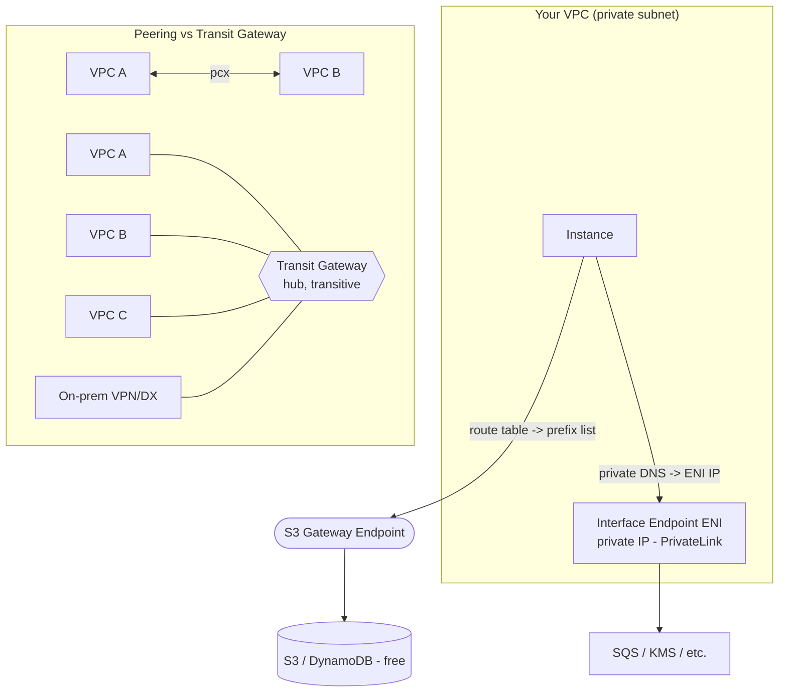

# 05.3 – VPC Endpoints & Peering (+ Transit Gateway)

Two ways to keep traffic off the public internet: **endpoints** reach *AWS services* privately; **peering / Transit Gateway** connect *VPCs* privately. Part of [[05-vpc]].

## What problem does this solve?

There are two separate privacy problems in this note, and it helps to keep them apart.

**Problem one — talking to an AWS service.** S3, DynamoDB, SQS, KMS are AWS services, but from your VPC's point of view they sit *outside* it, out on the public internet. So an instance that wants to read an S3 object takes the public path: out through an internet gateway, or through a NAT gateway if it's in a private subnet.

That's bad in two ways. A subnet you wanted to be fully private has to keep an internet path open just to talk to AWS. And a NAT gateway bills **hourly *and* per-GB** — for a batch worker pushing objects to S3 all day, the per-GB charge can dwarf the hourly one.

**VPC endpoints** delete that public leg. They give you a private on-ramp to the service over AWS's own backbone, so a subnet with no internet route at all can still reach S3 or SQS. There are two kinds and the difference is the whole topic: **gateway** endpoints (route-based, S3 and DynamoDB only, free) and **interface** endpoints (an ENI, PrivateLink, almost every other service, paid).

**Problem two — talking to another VPC.** VPCs are separate networks. **Peering** joins two of them with a private 1-to-1 link. It's simple and it works — right up until you have more than a couple, at which point its two limits bite: it is **non-transitive**, and a full mesh grows quadratically. **Transit Gateway** is the hub-and-spoke router that replaces the mesh, and it takes on-prem VPN/Direct Connect on the same hub.

> In one line: endpoints get you privately to AWS *services*; peering and Transit Gateway get you privately to other *VPCs*.

## How it actually works

### The gateway endpoint is a route, not a box

You attach a gateway endpoint to a **route table**, and AWS injects one entry into it: destination `pl-xxxx` (the S3 or DynamoDB side), target `vpce-xxxx` (the endpoint). Traffic bound for the service now matches that route and leaves over the backbone instead of via the NAT or internet gateway.

Three properties come with that shape, and they are the ones the exam tests:

- **It's free.** No hourly charge and no per-GB charge — where the same S3 traffic sent through a NAT gateway bills you both.
- **It only exists for S3 and DynamoDB.** Ask for a gateway endpoint to SQS or KMS and there isn't one. Every other service goes the interface route.
- **A peered VPC, a VPN, or Direct Connect cannot use it** — a gateway endpoint is usable only from within the VPC that owns the route table. This is the odd rule people trip on, and peering states a matching limit from its own side: **no edge-to-edge routing**, i.e. a peer cannot use your IGW, NAT, VPN or endpoints through the peering. If you need private S3 access from a peered VPC or from on-prem, you need an interface endpoint instead.

Both endpoint types also accept an **endpoint policy** — a resource-style policy narrowing which resources and actions the endpoint permits. Default is full access.

> In one line: a gateway endpoint is a free route-table entry for S3/DynamoDB, usable only from inside the VPC that owns the route table.

### The interface endpoint is an IP, not a route

An interface endpoint puts an **ENI with a private IP** into each subnet you choose. That's a real network object living inside your VPC, which flips every gateway property around:

|   | Gateway | Interface |
|---|---|---|
| What it is | a route | an ENI with a private IP |
| Reach | this VPC only | also over peering / VPN / Direct Connect |
| Cost | free | ~$0.01/hr per endpoint per AZ + ~$0.01/GB (⚠️ check current pricing) |
| Firewalled by | endpoint policy | endpoint policy **+ a security group** |

Two consequences worth holding on to.

**Your code doesn't change.** The endpoint uses **private DNS**, so the service's normal hostname resolves to the ENI's private IP. The application keeps calling SQS the way it always did; the name just points somewhere else now.

**It's reachable from outside the VPC.** Traffic arriving over **peering, VPN or Direct Connect** can reach an interface endpoint — exactly the three paths a gateway endpoint cannot serve, which is why *private S3 access from a peered VPC or from on-prem* is an interface-endpoint answer. And unlike a route, it sits behind a **security group**, so you control who is allowed to reach it at all.

> In one line: an interface endpoint is a PrivateLink ENI with a private IP — most services, billed per AZ per hour, and reachable across peering/VPN/DX.

### Why peering never becomes a hub

A peering connection is a private point-to-point link between two VPCs over the AWS backbone. Cross-account and cross-region both work. The mechanics are small: create the connection, then add a route **on both sides**, each one pointing at the *other* VPC's CIDR via the peering connection id. Getting those two backwards is the classic mistake — a route table says where to *send* traffic, so it names the far side, never itself.

Two limits define everything else about peering.

**No overlapping CIDRs.** Routing picks a destination by CIDR. If both VPCs are `10.0.0.0/16`, a route table has no way to express which side you meant — and peering treats that as a hard limit. (This is why the lab's second VPC is `10.1.0.0/16`.)

**It's non-transitive**, and this is the one that quietly costs people days. Peer a shared-services VPC to VPC-A and to VPC-B, and you have *not* connected A to B. A↔shared plus B↔shared gives you exactly nothing between A and B; traffic from A to B blackholes while every console page reads "everything is peered." The fixes are another direct peering — and now the mesh grows — or replacing the whole thing with a Transit Gateway.

Same family of rule as the gateway-endpoint one above: **no edge-to-edge routing**. A peer cannot borrow your IGW, NAT, VPN or endpoints. Peering connects the two VPCs and nothing beyond them.

> In one line: peering is a private 1-to-1 link with routes on both sides, no overlapping CIDRs, and no path through it to anywhere else.

### The mesh math, and what Transit Gateway replaces

Because peering is 1-to-1 and non-transitive, connecting everything to everything means connecting every *pair*. That is **N(N-1)/2**:

| VPCs | Peering connections for a full mesh |
|---|---|
| 4 | 6 |
| 5 | 10 |
| 6 | 15 |
| 10 | 45 |
| 12 | 66 |

Four VPCs at 6 connections is fine. Twelve VPCs at 66 connections — each needing routes maintained on *both* sides — is not something a team keeps correct. The wiring grows O(N²) while the number of VPCs grows linearly.

**Transit Gateway** is a regional hub. Each VPC, each VPN, each Direct Connect gets **one attachment**, and connectivity through the hub is **transitive** — so twelve VPCs means twelve attachments, not sixty-six peerings. You segment it with **TGW route tables** when you don't want true any-to-any, and you join regions with **inter-region TGW peering**. It scales to thousands of attachments.

The tradeoff is cost and weight: TGW bills **per attachment per hour plus per-GB**, where peering itself is free (you pay for data). For two or three VPCs it's overkill and peering is the right answer. The exam signal is the phrasing — *growing number of VPCs, simplify connectivity, connect on-prem* is always Transit Gateway.

> In one line: peering is O(N²) and non-transitive, so at **many VPCs / hybrid at scale** the answer becomes one Transit Gateway hub.

## Exam recap

*Now that the mechanisms are clear, this is the compressed version to revise from.*

> [!info] Exam TL;DR
> - **Gateway endpoint** = a **route-table** entry for **S3 & DynamoDB only**, **free**. Lets a fully-private subnet reach S3/DynamoDB with no NAT/IGW.
> - **Interface endpoint** = an **ENI with a private IP** in your subnet, powered by **PrivateLink**, for **almost every other service**, **~$0.01/hr/AZ + data**. Reachable over peering/VPN/DX (gateway endpoints are **not**).
> - **VPC peering** = private 1-to-1 link between two VPCs. **Non-transitive** (A–B + B–C ≠ A–C) and **no overlapping CIDRs**. Cross-account & cross-region OK. Update route tables **on both sides**.
> - **Full mesh of N VPCs = N(N-1)/2 peerings** → explodes. **Transit Gateway** = hub-and-spoke: each VPC gets **one attachment**, connectivity is **transitive**, and on-prem (VPN/DX) attaches to the same hub. Scales to thousands.
> - Decision: **S3/DynamoDB privately → gateway endpoint (free)**; other service → interface endpoint; **2 VPCs → peering**; **many VPCs / hybrid at scale → Transit Gateway**.

## AWS console ↔ Terraform map

| Concept | Terraform | Notes |
|---|---|---|
| Gateway endpoint (S3/DynamoDB) | `aws_vpc_endpoint` (`vpc_endpoint_type = "Gateway"`, `route_table_ids`) | Injects an S3/DynamoDB prefix-list route. Free. |
| Interface endpoint (PrivateLink) | `aws_vpc_endpoint` (`type = "Interface"`, `subnet_ids`, `security_group_ids`, `private_dns_enabled`) | ENI per AZ; the SG controls who can reach it. Costs hourly. |
| Expose your own service privately | `aws_vpc_endpoint_service` (+ NLB) | The "endpoint service" side of PrivateLink. |
| VPC peering | `aws_vpc_peering_connection` (+ `_accepter` if cross-account) | `auto_accept = true` only same-account+region. |
| Peering routes | `aws_route` on **both** route tables | Each side routes to the **other** VPC's CIDR via the `vpc_peering_connection_id`. |
| Transit Gateway | `aws_ec2_transit_gateway` + `_vpc_attachment` + `_route_table` | *Conceptual here.* Hub; attachments per VPC/VPN/DX. |

## Architecture diagram

## Key facts, limits & pricing

- **Gateway endpoints: S3 and DynamoDB only. Free.** Route-table based (a prefix-list route `pl-xxxx → vpce-xxxx`). **Cannot** be accessed from a peered VPC, VPN, or Direct Connect — only from within the same VPC.
- **Interface endpoints (PrivateLink):** an **ENI with a private IP** in each chosen subnet, for most AWS services + partner/your-own services. **Reachable across peering / VPN / Direct Connect** (unlike gateway). Uses **private DNS** so the normal service hostname resolves to the ENI. ~**$0.01/hr per endpoint per AZ + ~$0.01/GB** — ⚠️ check current pricing. Secured by a **security group**.
- **Endpoint policies:** both types support a resource-style policy to restrict which resources/actions the endpoint allows (default = full access).
- **VPC peering:** private, uses AWS backbone, **cross-account and cross-region** supported. Limits: **non-transitive**, **no overlapping CIDRs**, **no edge-to-edge routing** (you can't use a peer's IGW, NAT, VPN, or endpoints through the peering). Both route tables must be updated.
- **Mesh math:** a full mesh of N VPCs needs **N(N-1)/2** peering connections (5→10, 6→15, 10→45). O(N²).
- **Transit Gateway:** regional hub; each VPC/VPN/DX = **one attachment**; connectivity is **transitive**; supports **TGW route tables** for segmentation and **inter-region TGW peering**. Scales to thousands of attachments. Costs: **per-attachment/hour + per-GB data**. Overkill for 2–3 VPCs; the answer for many/at-scale/hybrid.

## Comparisons

### Gateway vs Interface endpoint

|   | Gateway endpoint | Interface endpoint |
|---|---|---|
| Mechanism | Route-table prefix-list route | ENI with private IP (PrivateLink) |
| Services | **S3, DynamoDB only** | Most AWS services + partner/custom |
| Cost | **Free** | ~$0.01/hr/AZ + data |
| Cross VPC/VPN/DX access | **No** | **Yes** |
| DNS | (route-based, no DNS change) | Private DNS → ENI IP |
| Secured by | Endpoint policy | Endpoint policy **+ security group** |

### VPC Peering vs Transit Gateway

|   | VPC Peering | Transit Gateway |
|---|---|---|
| Topology | 1-to-1 point-to-point | Hub-and-spoke |
| Transitive? | **No** | **Yes** |
| Connections for N VPCs | **N(N-1)/2** (mesh) | **N** attachments |
| On-prem (VPN/DX) | Not through peering | Attaches to the hub |
| Cost | Free (pay data) | Per-attachment/hr + data |
| Use when | 2 (few) VPCs, simple | Many VPCs / hybrid / at scale |

## Worked examples

> [!example] Worked example — a fully-private subnet that still reaches S3 (no NAT bill)
> A batch worker in a private subnet reads/writes objects to S3 all day. The naive setup routes it through a **NAT gateway** — which bills hourly *and* per-GB, and the per-GB S3 traffic can dwarf the hourly cost. Swap in an **S3 gateway endpoint**: add it to the private route table, and S3-bound traffic now goes straight over the AWS backbone via the injected prefix-list route — **free**, and you can delete the NAT gateway entirely if S3 was its only reason to exist. This is a top real-world **cost-optimization** win and a common exam answer ("reduce data-transfer cost for S3 access from private instances → gateway endpoint").

> [!failure] Failure mode — assuming peering is transitive (the hub that isn't)
> You peer a central "shared services" VPC to VPC-A and to VPC-B, expecting A and B to talk *through* the shared VPC. They can't — **peering is non-transitive**, so A↔shared and B↔shared give you **nothing** between A and B. Teams discover this when A's traffic to B silently blackholes despite "everything being peered." Fixes: peer A↔B directly (another connection — and the mesh grows), or replace the whole thing with a **Transit Gateway** where transitivity is built in. This non-transitivity is *the* reason TGW exists and a guaranteed exam distractor.

> [!example] Worked example — 4 VPCs today, 12 next quarter → Transit Gateway
> A company has 4 VPCs (prod/staging/dev/shared) fully peered: N(N-1)/2 = **6** connections, each with routes on both sides. Manageable. Then acquisitions push it toward 12 VPCs → **66** peering connections and a route-table nightmare. Migrating to a **Transit Gateway** collapses it to **12 attachments** (one per VPC), gives transitive any-to-any (or segmented via TGW route tables), and lets the on-prem Direct Connect attach to the same hub. The trigger phrase — "growing number of VPCs, simplify connectivity, connect on-prem" — is always TGW.

## The Terraform I wrote

Code: [`05-vpc/endpoints.tf`](../05-vpc/endpoints.tf) + [`05-vpc/peering.tf`](../05-vpc/peering.tf)

- **S3 gateway endpoint**: `aws_vpc_endpoint` (Gateway, `service_name = com.amazonaws.us-east-1.s3`, `route_table_ids = [private-rt]`). Verified the injected `pl-xxxx (S3) → vpce-xxxx` route in the private route table.
- **Peering**: a second VPC (`10.1.0.0/16`, non-overlapping), `aws_vpc_peering_connection` (`auto_accept = true`), and **two `aws_route`s** — main-side → peer CIDR, peer-side → main CIDR, each via the connection. Verified status **Active** and both route tables carrying the cross-VPC route.
- Got the **route directions right** (each side routes to the *other's* CIDR — the common swap mistake) and used `aws_vpc.peer.main_route_table_id` to route on the peer's auto-created main RT.

> [!warning] Trap — "use a gateway endpoint for SQS/KMS/etc."
> Gateway endpoints only exist for **S3 and DynamoDB**. Every other service uses an **interface endpoint (PrivateLink)**. "Private access to SQS/KMS/Secrets Manager" → interface endpoint, not gateway.

> [!warning] Trap — "reach the S3 gateway endpoint from a peered VPC / on-prem"
> No. Gateway endpoints work **only within the same VPC**. If you need S3 access from a peered VPC or over VPN/DX, you use an **interface endpoint** (which *is* reachable across those).

> [!warning] Trap — "peering scales fine, just add connections"
> Full mesh is **N(N-1)/2** and non-transitive — it explodes past a few VPCs. The intended answer for "many VPCs" is **Transit Gateway**, not more peerings.

> [!example]- Recreate-from-memory drill
> On an existing VPC: (a) add an S3 gateway endpoint to the private route table and confirm the prefix-list route appears; (b) create a second VPC with a non-overlapping CIDR, peer them, and add the correct route on each side. Predict, before applying, which CIDR each route's destination should be.
> > [!success]- Reference solution
> > See `05-vpc/endpoints.tf` + `peering.tf`. Key: gateway endpoint `route_table_ids`; peering routes each target the **other** VPC's CIDR; CIDRs must not overlap; `auto_accept` only for same account+region.

## 🔴 My weak spots (this topic)   #weak-spot

- [ ] **Gateway vs interface endpoint** — which is which, S3/DynamoDB-only for gateway, PrivateLink/ENI for interface, and gateway-not-reachable-cross-VPC. (Fuzzy at orient.)
- [ ] **Peering is non-transitive + no CIDR overlap** — forgot the peering limits entirely at orient; these are the two most-tested facts.
- [ ] **Transit Gateway = hub-and-spoke fix for the N(N-1)/2 mesh** — knew the mesh math but not the TGW mechanism.
- [ ] **"Which endpoint for which service"** decision (S3/DynamoDB → gateway/free; everything else → interface/paid).

## 🔗 Docs

- [Gateway endpoints (S3/DynamoDB)](https://docs.aws.amazon.com/vpc/latest/privatelink/gateway-endpoints.html)
- [Interface endpoints / AWS PrivateLink](https://docs.aws.amazon.com/vpc/latest/privatelink/create-interface-endpoint.html)
- [VPC peering — what it is + limitations](https://docs.aws.amazon.com/vpc/latest/peering/what-is-vpc-peering.html)
- [Transit Gateway](https://docs.aws.amazon.com/vpc/latest/tgw/what-is-transit-gateway.html)
- [Terraform `aws_vpc_endpoint`](https://registry.terraform.io/providers/hashicorp/aws/latest/docs/resources/vpc_endpoint) / [`aws_vpc_peering_connection`](https://registry.terraform.io/providers/hashicorp/aws/latest/docs/resources/vpc_peering_connection)

---
**Cards for this topic:** [[cards/05-vpc-endpoints-peering-cards]]
