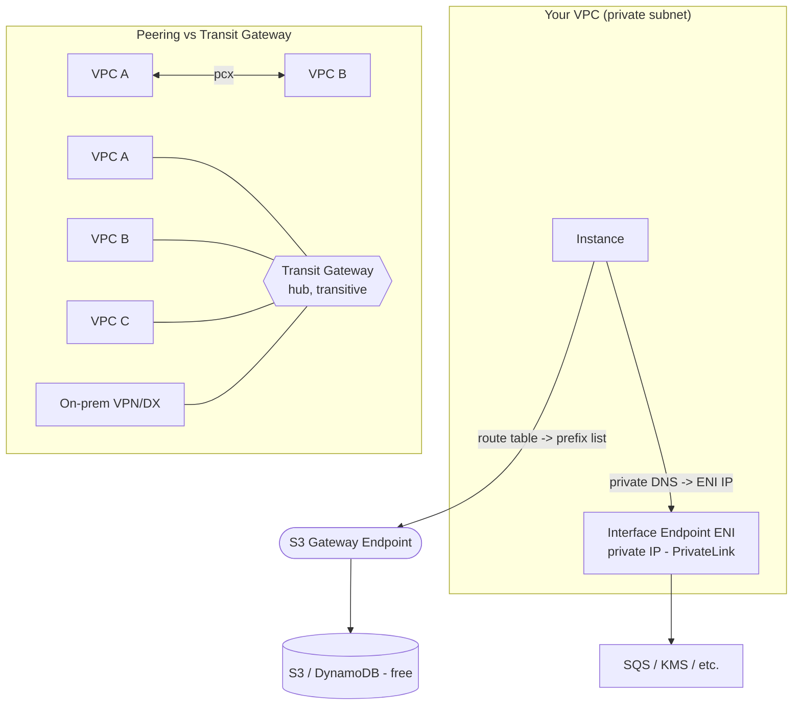

# 05.3 – VPC Endpoints & Peering (+ Transit Gateway)

Two ways to keep traffic off the public internet: **endpoints** reach *AWS services* privately; **peering / Transit Gateway** connect *VPCs* privately. Part of [[05-vpc]].

> [!info] Exam TL;DR
> - **Gateway endpoint** = a **route-table** entry for **S3 & DynamoDB only**, **free**. Lets a fully-private subnet reach S3/DynamoDB with no NAT/IGW.
> - **Interface endpoint** = an **ENI with a private IP** in your subnet, powered by **PrivateLink**, for **almost every other service**, **~$0.01/hr/AZ + data**. Reachable over peering/VPN/DX (gateway endpoints are **not**).
> - **VPC peering** = private 1-to-1 link between two VPCs. **Non-transitive** (A–B + B–C ≠ A–C) and **no overlapping CIDRs**. Cross-account & cross-region OK. Update route tables **on both sides**.
> - **Full mesh of N VPCs = N(N-1)/2 peerings** → explodes. **Transit Gateway** = hub-and-spoke: each VPC gets **one attachment** (one connection from a VPC, VPN or Direct Connect into the hub), connectivity is **transitive**, and on-prem (VPN/DX) attaches to the same hub. Scales to thousands.
> - **VPC sharing (via RAM)** is the third option people forget: one account owns the VPC and shares **subnets** with other accounts in the same Organization, so they launch into *one* network with no peering and no attachments.
> - Decision: **S3/DynamoDB privately → gateway endpoint (free)**; other service → interface endpoint; **2 VPCs → peering**; **many VPCs / hybrid at scale → Transit Gateway**; **many accounts, one network, same Organization → VPC sharing**.

## What problem does this solve?

There are two separate privacy problems in this note, and it helps to keep them apart.

**Problem one — talking to an AWS service.** S3, DynamoDB, SQS, KMS are AWS services, but from your VPC's point of view they sit *outside* it, behind **public service endpoints**. So an instance that wants to read an S3 object takes the public path: out through an internet gateway, or through a NAT gateway if it's in a private subnet — public addressing, though the traffic never actually leaves the AWS network.

That's bad in two ways, and neither is really about attackers — the traffic never leaves the AWS network. The first is architectural: a subnet you wanted to be fully private has to keep an internet path open purely to talk to AWS. And a NAT gateway bills **hourly *and* per-GB** ([[05-vpc-core]] has the figures) — for a batch worker pushing objects to S3 all day, the per-GB charge can dwarf the hourly one.

**VPC endpoints** delete that public leg. They give you a private on-ramp to the service over AWS's own backbone, so a subnet with no internet route at all can still reach S3 or SQS. Two kinds carry this topic: **gateway** endpoints (route-based, S3 and DynamoDB only, free) and **interface** endpoints (an ENI, PrivateLink, almost every other service, paid). Don't read that as a closed set — AWS documents six endpoint types (`Interface`, `GatewayLoadBalancer`, `Resource`, `Tunnel`, `Service network`, plus `Gateway`). The one worth recognising is the **Gateway Load Balancer endpoint**, because it is also a route-table target and so *looks* like a gateway endpoint while being something else entirely: it steers traffic to a fleet of inspection appliances. The rest you can park. *(Verified 2026-10-05.)*

**Problem two — talking to another VPC.** VPCs are separate networks. **Peering** joins two of them with a private 1-to-1 link. It's simple and it works — right up until you have more than a couple, at which point its two limits bite: it is **non-transitive**, and a full mesh grows quadratically. **Transit Gateway** is the hub-and-spoke router that replaces the mesh, and it takes on-prem VPN/Direct Connect ([[05-vpc-hybrid]]) on the same hub.

> In one line: endpoints get you privately to AWS *services*; peering and Transit Gateway get you privately to other *VPCs*.

## How it actually works

### The gateway endpoint is a route, not a box

You attach a gateway endpoint to a **route table**, and AWS injects an entry into it: destination `pl-xxxx`, target `vpce-xxxx` (the endpoint). A **prefix list** is an AWS-managed name standing in for the service's address ranges, so you route to "S3" without ever writing its CIDRs. One route for an IPv4 endpoint; a **dualstack** endpoint adds a second, because you add the IPv4 *and* IPv6 prefix lists. You can see these injected routes but *"you cannot modify or delete them"*. Traffic bound for the service now matches that route and leaves over the backbone instead of via the NAT or internet gateway.

Three properties come with that shape, and they are the ones the exam tests:

- **It's free.** No hourly charge and no per-GB charge — where the same S3 traffic sent through a NAT gateway bills you both.
- **It only exists for S3 and DynamoDB.** Ask for a gateway endpoint to SQS or KMS and there isn't one; every other service goes the interface route. Read the implication carefully though — it runs one way only. *"Amazon S3 and DynamoDB support **both** gateway endpoints and interface endpoints"*, so for those two you have a choice, and the next bullet is what usually decides it.
- **A peered VPC, a VPN, or Direct Connect cannot use it** — a gateway endpoint is usable only from within the VPC that owns the route table. This is the odd rule people trip on, and peering states a matching limit from its own side: **no edge-to-edge routing**, i.e. a peer cannot use your IGW, NAT, VPN or endpoints through the peering. If you need private S3 access from a peered VPC or from on-prem, you need an interface endpoint instead.

Both endpoint types also accept an **endpoint policy** — a resource-style policy narrowing which resources and actions the endpoint permits. *"The default VPC endpoint policy allows all actions by all principals on all resources over the VPC endpoint"*, and some interface-endpoint services don't support policies at all (those stay full access). The mirror image is worth knowing too: an **S3 bucket policy** can require a particular endpoint, using the **`aws:sourceVpce`** condition key to deny everything that did not arrive through `vpce-…`. Endpoint policy limits what the endpoint may reach; the bucket policy limits what may reach the bucket. *(Verified 2026-10-05.)*

Two routing details sit behind "it just matches the route", and both can be asked about.
**Longest prefix match decides.** If the table also has `0.0.0.0/0 → IGW`, the endpoint's
prefix-list route is more specific, so same-Region S3 traffic takes the endpoint — but *"Traffic
that's destined for the service (Amazon S3 or DynamoDB) in a **different Region** goes to the
internet gateway because prefix lists are specific to a Region."* So a gateway endpoint does
nothing for cross-Region S3 calls. The endpoint route does not always win, either: *"If there is a
route that specifies the exact IP address range for the service … in the same Region, that route
takes precedence over the endpoint route."* And a route table may hold one S3 route and one DynamoDB
route, but *"You can't have multiple endpoint routes to the same service … in a single route
table."*

**It is still the service's public endpoint.** *"When your instances access Amazon S3 or DynamoDB
through a gateway endpoint, they access the service using its public endpoint"* — so the instance's
**security group must allow outbound to the service's prefix list**, and the subnet's **NACL must
allow it too**. One asymmetry to remember: you can reference a prefix list in a security group
rule, but *"You can't reference prefix lists in network ACL rules"* — there you need the actual
CIDR ranges. *(Verified 2026-10-05.)*

> In one line: a gateway endpoint is a free route-table entry for S3/DynamoDB, usable only from inside the VPC that owns the route table.

### The interface endpoint is an IP, not a route

An interface endpoint puts an **ENI with a private IP** into each subnet you choose. That's a real network object living inside your VPC, which flips every gateway property around:

|   | Gateway | Interface |
|---|---|---|
| What it is | a route | an ENI with a private IP |
| Reach | this VPC only | also over peering / VPN / Direct Connect |
| Cost | free | ~$0.01/hr per endpoint per AZ + **$0.01/GB** processed (tiering down to $0.006 past 1 PB/month and $0.004 past 5 PB) |
| Firewalled by | endpoint policy | endpoint policy **+ a security group** |

Two consequences worth holding on to.

**Usually your code doesn't change.** With **private DNS** enabled, the service's normal hostname resolves to the ENI's private IP, so the application keeps calling SQS the way it always did and the name just points somewhere else.

**S3 is the exception, and it is this note's own flagship example.** AWS's own gateway-vs-interface table for S3 says gateway endpoints *"Use the same Amazon S3 DNS names"* while interface endpoints *"**Require endpoint-specific Amazon S3 DNS names**"* — names like `bucket.vpce-1a2b3c4d-5e6f.s3.us-east-1.vpce.amazonaws.com`. Worse, when you switch private DNS on for an S3 interface endpoint, *"the **Enable private DNS only for inbound endpoints** option is selected by default. If this option is selected, your applications use only interface endpoints for your **on-premises** traffic"* — in-VPC traffic deliberately keeps using the free gateway endpoint. You have to clear that option to send all S3 requests over the interface endpoint.

That default is actually the pattern you want, and it is a neat cost answer: **keep the gateway endpoint for in-VPC traffic (free) and add an interface endpoint for on-premises traffic (billed)**, which AWS documents as using both in the same VPC. *(Verified 2026-10-05.)*

**It's reachable from outside the VPC.** Traffic arriving over **peering, VPN or Direct Connect** can reach an interface endpoint — exactly the three paths a gateway endpoint cannot serve, which is why *private S3 access from a peered VPC or from on-prem* is an interface-endpoint answer. And unlike a route, it sits behind a **security group** ([[05-vpc-security]]), so you control who is allowed to reach it at all.

**The other half of PrivateLink: publishing your own service.** Everything above is you *consuming*
an endpoint. The reverse direction is an **endpoint service**: you put your application behind a
load balancer, publish it, and consumers in other VPCs or accounts create interface endpoints to
reach it — no peering, and without exposing the rest of your VPC. The rule the exam leans on is
which load balancer may front it: **an NLB or a Gateway Load Balancer, never an ALB directly.** If
you need the ALB's Layer 7 routing behind PrivateLink, register the **ALB as a target of the NLB**
(target group type `alb`, protocol TCP, one ALB per target group) — see [[04-alb-asg]]. A provider
must also grant access first: *"By default, your endpoint service is not available to service
consumers."* *(Verified 2026-10-05.)*

> In one line: an interface endpoint is a PrivateLink ENI with a private IP — most services, billed per AZ per hour, and reachable across peering/VPN/DX.

### Why peering never becomes a hub

A peering connection is a private point-to-point link between two VPCs over the AWS backbone. Cross-account and cross-region both work. The mechanics are small: create the connection, then add a route **on both sides**, each one pointing at the *other* VPC's CIDR via the peering connection id. Getting those two backwards is the classic mistake — a route table says where to *send* traffic, so it names the far side, never itself. Concretely, with VPC-A on `10.0.0.0/16` and VPC-B on `10.1.0.0/16`: A's route table gets `10.1.0.0/16 → pcx-…`, and B's gets `10.0.0.0/16 → pcx-…`.

Two limits define everything else about peering.

**No overlapping CIDRs.** Routing picks a destination by CIDR. If both VPCs are `10.0.0.0/16`, a route table has no way to express which side you meant — and peering treats that as a hard limit: *"You cannot create a VPC peering connection between VPCs that have matching or overlapping IPv4 or IPv6 CIDR blocks."* Stricter than it first sounds, too — with multiple CIDR blocks per VPC, *"you can't create a VPC peering connection if any of the CIDR blocks overlap, even if you intend to use only the non-overlapping CIDR blocks"*. So a second VPC gets a different range, e.g. `10.1.0.0/16`.

**DNS does not come for free.** By default, an instance addressing a peer by its *public* DNS hostname gets the **public IP** back, which sends the traffic the long way round instead of over the peering. You have to **enable DNS resolution on the peering connection** for that hostname to resolve to the **private** IP — and for an inter-Region peering you *must* enable it. Related limit: *"You cannot connect to or query the Amazon DNS server in a peer VPC."* *(Verified 2026-10-05.)*

**It's non-transitive**, and this is the one that quietly costs people days. Peer a shared-services VPC to VPC-A and to VPC-B, and you have *not* connected A to B. A↔shared plus B↔shared gives you exactly nothing between A and B; traffic from A to B blackholes while every console page reads "everything is peered." The fixes are another direct peering — and now the mesh grows — or replacing the whole thing with a Transit Gateway.

Same family of rule as the gateway-endpoint one above: **no edge-to-edge routing**, and AWS spells out all five cases — a peer cannot use your **internet gateway**, your **NAT device**, your **VPN connection**, your **Direct Connect connection**, or your **gateway endpoint**. Peering connects the two VPCs and nothing beyond them.

Three smaller facts that come up: there can be only **one peering connection between any two VPCs** at a time; an unaccepted request **expires after 7 days**; and the **MTU differs by scope** — **9001 bytes** within a Region, **8500 bytes** inter-Region. That last one has a sting when you migrate to a Transit Gateway, which is 8500: AWS warns that *"an MTU size mismatch between VPC peering and the transit gateway might result in some asymmetric traffic packets dropping"*, and to update both VPCs at once. *(Verified 2026-10-05.)*

> In one line: peering is a private 1-to-1 link with routes on both sides, no overlapping CIDRs, and no path through it to anywhere else.

### The mesh math, and what Transit Gateway replaces

Because peering is 1-to-1 and non-transitive, connecting everything to everything means connecting every *pair*. That is **N(N-1)/2**:

| VPCs | Peering connections for a full mesh |
|---|---|
| 4 | 6 |
| 5 | 10 |
| 6 | 15 |
| 10 | 45 |
| 12 | 66 |

Four VPCs at 6 connections is fine. Twelve VPCs at 66 connections — each needing routes maintained on *both* sides — is not something a team keeps correct. The wiring grows O(N²) while the number of VPCs grows linearly.

**Transit Gateway** is a regional hub. Each VPC, each VPN, each Direct Connect gets **one attachment**, and connectivity through the hub is **transitive** — so twelve VPCs means twelve attachments, not sixty-six peerings. You segment it with **TGW route tables** when you don't want true any-to-any, and you join regions with **inter-region TGW peering**. "Thousands" is literal: the default quota is **5,000 attachments per transit gateway** (adjustable), with **20** route tables per TGW, **10,000** total routes, and up to **100 Gbps per VPC attachment per AZ**. One constraint worth knowing: *"A transit gateway cannot have more than one VPC attachment to the same VPC."* *(Verified 2026-10-05.)*

The tradeoff is cost and weight: TGW bills **per attachment per hour plus per-GB**, where peering itself is free (you pay for data). For two or three VPCs it's overkill and peering is the right answer. The exam signal is the phrasing — *growing number of VPCs, simplify connectivity, connect on-prem* points at Transit Gateway. (In real designs AWS now also offers **Cloud WAN** for multi-Region global networks, so "always" is too strong outside the exam's framing.)

> In one line: peering is O(N²) and non-transitive, so at **many VPCs / hybrid at scale** the answer becomes one Transit Gateway hub.

## Architecture diagram

```mermaid
flowchart TB
    subgraph V["Your VPC (private subnet)"]
      EC2[Instance]
      IE[Interface Endpoint ENI<br/>private IP - PrivateLink]
    end
    EC2 -->|route table -> prefix list| GE([S3 Gateway Endpoint])
    GE --> S3[(S3 / DynamoDB - free)]
    EC2 -->|private DNS -> ENI IP| IE --> SVC[SQS / KMS / etc.]

    subgraph MESH["Peering vs Transit Gateway"]
      direction LR
      A[VPC A]<-->|pcx| B[VPC B]
      A2[VPC A] --- TGW{{Transit Gateway<br/>hub, transitive}}
      B2[VPC B] --- TGW
      C2[VPC C] --- TGW
      ONP[On-prem VPN/DX] --- TGW
    end
```

## Key facts, limits & pricing

- **A security group cannot reference a peer VPC's security group across Regions.** AWS: *"You **can't reference the security group of a peer VPC that's in a different Region**. Instead, use the **CIDR block** of the peer VPC."* Same-Region peering *can* reference it, including **cross-account**, by writing the owner's account in front of the id — `123456789012/sg-1a2b3c4d`. So in an **inter-Region** peering question the database rule must be written against the app tier's **IP ranges**, and any option offering a cross-Region SG reference is impossible, not merely untidy. *(Verified 2026-10-04.)*

- **VPC sharing (via AWS RAM)** lets the VPC **owner** share **one or more subnets** — *not the VPC itself* — with **participant** accounts in the **same AWS Organization**. Participants create their own EC2, RDS, Redshift and Lambda resources in those subnets, and **cannot view, modify or delete** resources belonging to other participants or to the owner. Peering stays the owner's job: *"Only VPC owners can work with (describe, create, accept, reject, modify, or delete) peering connections. Participants cannot work with peering connections."* It is the lowest-complexity way to get many accounts onto one network: no peering mesh, no Transit Gateway attachments to pay for, and traffic uses the VPC's **implicit routing** rather than crossing an attachment.
- **AWS RAM** is the sharing mechanism ([[01-iam-advanced]] owns it). The two networking facts to carry here: RAM shares **VPC subnets** (`ec2:Subnet`), and it shares **transit gateways** (`ec2:TransitGateway`) — *the hub itself*, after which the participant account creates its **own attachment** to it. "Share the TGW attachment" inverts the model; there is no attachment resource type in the shareable list. *(Verified 2026-10-05.)*

- **Gateway endpoints: S3 and DynamoDB only. Free.** Route-table based (a prefix-list route `pl-xxxx → vpce-xxxx`). **Cannot** be accessed from a peered VPC, VPN, or Direct Connect — only from within the same VPC.
- **Interface endpoints (PrivateLink):** an **ENI with a private IP** in each chosen subnet, for most AWS services + partner/your-own services. **Reachable across peering / VPN / Direct Connect** (unlike gateway). Uses **private DNS** so the normal service hostname resolves to the ENI. ~**$0.01/hr per endpoint per AZ**, plus data processing at **$0.01/GB** for the first 1 PB a month, then $0.006/GB, then $0.004/GB above 5 PB (us-east-1, verified 2026-10-05 — re-check rather than trusting the figures later). Secured by a **security group**.
- **Endpoint policies:** both types support a resource-style policy restricting which resources and actions the endpoint allows — *"The default VPC endpoint policy allows all actions by all principals on all resources"*, and some interface-endpoint services do not support policies at all. The complement is the resource side: an S3 bucket policy can pin access to one endpoint with **`aws:sourceVpce`**.
- **VPC peering:** private, uses AWS backbone, **cross-account and cross-region** supported. Limits: **non-transitive**, **no overlapping CIDRs**, **no edge-to-edge routing** (you can't use a peer's IGW, NAT, VPN, or endpoints through the peering). Both route tables must be updated.
- **Mesh math:** a full mesh of N VPCs needs **N(N-1)/2** peering connections (5→10, 6→15, 10→45). O(N²).
- **Transit Gateway:** regional hub; each VPC/VPN/DX = **one attachment**; connectivity is **transitive**; supports **TGW route tables** for segmentation and **inter-region TGW peering**. Quotas: **5,000 attachments per TGW** (default, adjustable), 5 TGWs per account **per Region** (the quotas are Region-specific), 20 route tables, 10,000 routes, 100 Gbps per VPC attachment per AZ, **MTU 8500** (VPN 1500), and only one attachment per VPC. Costs: **per-attachment/hour + per-GB data**. Overkill for 2–3 VPCs; the answer for many/at-scale/hybrid. *(Verified 2026-10-05.)*

> [!warning] Trap — VPC sharing confused with peering, or "share the VPC"
> Two errors in one family. **VPC sharing shares *subnets*, never the whole VPC** — an
> option saying "share the VPC" is wrong even when sharing is the right idea. And sharing
> is **not peering**: peering connects two *separate* VPCs, while sharing puts several
> accounts *inside one* VPC, using its implicit routing. "Many accounts, same network,
> lowest complexity, same Organization" → **VPC sharing via RAM**, not peering and not
> Transit Gateway.

## Comparisons

### Gateway vs Interface endpoint

|   | Gateway endpoint | Interface endpoint |
|---|---|---|
| Mechanism | Route-table prefix-list route | ENI with private IP (PrivateLink) |
| Services | **S3, DynamoDB only** | Most AWS services + partner/custom |
| Cost | **Free** | ~$0.01/hr/AZ + data |
| Cross VPC/VPN/DX access | **No** | **Yes** |
| DNS | (route-based, no DNS change) | Private DNS → ENI IP |
| Secured by | Endpoint policy | Endpoint policy **+ security group** |

### VPC Peering vs Transit Gateway

|   | VPC Peering | Transit Gateway |
|---|---|---|
| Topology | 1-to-1 point-to-point | Hub-and-spoke |
| Transitive? | **No** | **Yes** |
| Connections for N VPCs | **N(N-1)/2** (mesh) | **N** attachments |
| On-prem (VPN/DX) | Not through peering | Attaches to the hub |
| Cost | Free (pay data) | Per-attachment/hr + data |
| Use when | 2 (few) VPCs, simple | Many VPCs / hybrid / at scale |

## Worked examples

> [!example] Worked example — a fully-private subnet that still reaches S3 (no NAT bill)
> A batch worker in a private subnet reads/writes objects to S3 all day. The naive setup routes it through a **NAT gateway** — which bills hourly *and* per-GB, and the per-GB S3 traffic can dwarf the hourly cost. Swap in an **S3 gateway endpoint**: add it to the private route table, and S3-bound traffic now goes straight over the AWS backbone via the injected prefix-list route — **free**, and you can delete the NAT gateway entirely if S3 was its only reason to exist. This is a top real-world **cost-optimization** win and a common exam answer ("reduce data-transfer cost for S3 access from private instances → gateway endpoint").

> [!failure] Failure mode — assuming peering is transitive (the hub that isn't)
> You peer a central "shared services" VPC to VPC-A and to VPC-B, expecting A and B to talk *through* the shared VPC. They can't — **peering is non-transitive**, so A↔shared and B↔shared give you **nothing** between A and B. Teams discover this when A's traffic to B silently blackholes despite "everything being peered." Fixes: peer A↔B directly (another connection — and the mesh grows), or replace the whole thing with a **Transit Gateway** where transitivity is built in. This non-transitivity is *the* reason TGW exists and a guaranteed exam distractor.

> [!example] Worked example — 4 VPCs today, 12 next quarter → Transit Gateway
> A company has 4 VPCs (prod/staging/dev/shared) fully peered: N(N-1)/2 = **6** connections, each with routes on both sides. Manageable. Then acquisitions push it toward 12 VPCs → **66** peering connections and a route-table nightmare. Migrating to a **Transit Gateway** collapses it to **12 attachments** (one per VPC), gives transitive any-to-any (or segmented via TGW route tables), and lets the on-prem Direct Connect attach to the same hub. The trigger phrase — "growing number of VPCs, simplify connectivity, connect on-prem" — points at TGW on the exam.

> [!warning] Trap — "use a gateway endpoint for SQS/KMS/etc."
> Gateway endpoints only exist for **S3 and DynamoDB**. Every other service uses an **interface endpoint (PrivateLink)**. "Private access to SQS/KMS/Secrets Manager" → interface endpoint, not gateway.

> [!warning] Trap — "reach the S3 gateway endpoint from a peered VPC / on-prem"
> No. Gateway endpoints work **only within the same VPC**. If you need S3 access from a peered VPC or over VPN/DX, you use an **interface endpoint** (which *is* reachable across those).

> [!warning] Trap — "peering scales fine, just add connections"
> Full mesh is **N(N-1)/2** and non-transitive — it explodes past a few VPCs. The intended answer for "many VPCs" is **Transit Gateway**, not more peerings.

## 🔴 My weak spots (this topic)   #weak-spot

- [ ] **Gateway vs interface endpoint** — which is which, S3/DynamoDB-only for gateway, PrivateLink/ENI for interface, and gateway-not-reachable-cross-VPC. (Fuzzy at orient.)
- [ ] **Peering is non-transitive + no CIDR overlap** — forgot the peering limits entirely at orient; these are the two most-tested facts.
- [ ] **Transit Gateway = hub-and-spoke fix for the N(N-1)/2 mesh** — knew the mesh math but not the TGW mechanism.
- [ ] **"Which endpoint for which service"** decision (S3/DynamoDB → gateway/free; everything else → interface/paid).

## 🔗 Docs
- [Security groups and VPC peering](https://docs.aws.amazon.com/vpc/latest/peering/vpc-peering-security-groups.html)

- [Gateway endpoints (S3/DynamoDB)](https://docs.aws.amazon.com/vpc/latest/privatelink/gateway-endpoints.html)
- [Interface endpoints / AWS PrivateLink](https://docs.aws.amazon.com/vpc/latest/privatelink/create-interface-endpoint.html)
- [VPC peering — what it is + limitations](https://docs.aws.amazon.com/vpc/latest/peering/what-is-vpc-peering.html)
- [How VPC peering works + all limitations](https://docs.aws.amazon.com/vpc/latest/peering/vpc-peering-basics.html) — non-transitive, overlapping-CIDR rule incl. the multi-CIDR case, all five edge-to-edge cases, the 7-day request expiry, one connection per VPC pair, the Amazon-DNS-in-a-peer limit, MTU 9001 intra-Region vs 8500 inter-Region, and that shared-VPC participants cannot manage peering; verified 2026-10-05
- [Transit Gateway](https://docs.aws.amazon.com/vpc/latest/tgw/what-is-transit-gateway.html)
- [Gateway endpoints](https://docs.aws.amazon.com/vpc/latest/privatelink/gateway-endpoints.html) — S3/DynamoDB only, no charge, both endpoint types supported for those two, longest-prefix-match and the different-Region/exact-range exceptions, the public-endpoint SG/NACL requirement; verified 2026-10-05
- [AWS PrivateLink concepts](https://docs.aws.amazon.com/vpc/latest/privatelink/concepts.html) — all six endpoint types, endpoint services needing explicit permissions, default endpoint policy; verified 2026-10-05
- [AWS PrivateLink for Amazon S3](https://docs.aws.amazon.com/AmazonS3/latest/userguide/privatelink-interface-endpoints.html) — gateway vs interface table, endpoint-specific DNS names, the "private DNS only for inbound endpoints" default, and the gateway+interface cost pattern; verified 2026-10-05
- [AWS RAM shareable resources](https://docs.aws.amazon.com/ram/latest/userguide/shareable.html) — `ec2:TransitGateway` (the gateway, not an attachment), `ec2:Subnet`, Resolver rules, License Manager configs; verified 2026-10-05
- [Transit Gateway quotas](https://docs.aws.amazon.com/vpc/latest/tgw/transit-gateway-quotas.html) — 5,000 attachments per TGW, 20 route tables, 10,000 routes, 100 Gbps per VPC attachment per AZ, MTU 8500, and the peering-to-TGW MTU mismatch warning; verified 2026-10-05
- [AWS PrivateLink pricing](https://aws.amazon.com/privatelink/pricing/) — interface endpoint billed per AZ per hour; data processing $0.01/GB tiering to $0.006 and $0.004; verified 2026-10-05
