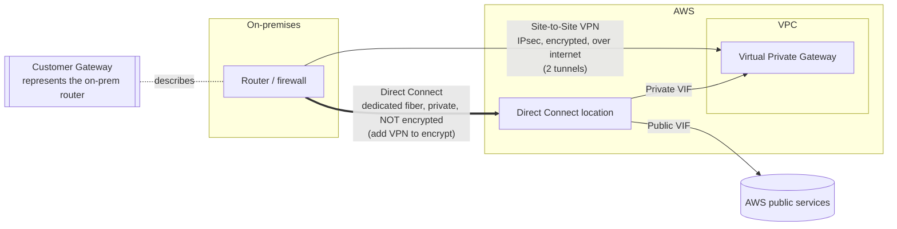

# 05.4 – VPC Hybrid Connectivity (VPN & Direct Connect)

Connecting **on-premises ↔ AWS**. Two roads: an encrypted VPN over the internet, or a dedicated private line (Direct Connect). Conceptual-only (no build). Closes out [[05-vpc]].

## What problem does this solve?

A company already has a data center. Servers, databases, storage, decades of things that are not moving. Now part of the workload runs in a VPC.

Those two networks don't know each other exists. The VPC is private; the office network is somewhere else entirely. The job of this topic is joining them so they behave like one network.

AWS gives you two roads, and they differ in the most basic way possible: **whether your traffic touches the public internet at all.**

A **Site-to-Site VPN** builds an encrypted IPsec tunnel *across* the ordinary internet. It's cheap, AWS manages its end, and it's up in minutes to hours. The catch is that the internet is still the road — speed and latency are whatever the internet gives you that day.

**Direct Connect** doesn't use that road. It's a *physical* dedicated fiber running from your premises into an AWS facility, bypassing the internet entirely. You get consistent low latency, guaranteed bandwidth, and lower data-transfer cost at volume. You pay for it, and you wait weeks to months while someone physically installs it.

For more than a couple of VPCs, a **Transit Gateway** becomes the on-ramp for either road, and a **Direct Connect Gateway** lets a single physical circuit serve VPCs in many regions.

> In one line: a VPN rents an encrypted tunnel across the internet; Direct Connect buys a private wire that avoids it.

## How it actually works

### The two endpoints, and why one of them isn't a device

A VPN needs something at each end. AWS names them from its own point of view, which is where the confusion starts.

- **Virtual Private Gateway (VGW)** — the **AWS side**, attached to the VPC. (Swap in a **Transit Gateway** when you have many VPCs to terminate.)
- **Customer Gateway (CGW)** — the **on-prem side**. "Customer" means you.

The CGW is the odd one, and it's worth being precise about why. It is a **configuration object inside AWS that describes the router you already own** — its public IP address and its BGP ASN. The device itself stays physical and stays yours, in your building; the CGW is only AWS's record of it, which is why those two details are the whole of what you hand over.

The tunnel itself is a third object joining the two: VGW/TGW on one end, CGW on the other. Routing across it is either **static** or **BGP** (dynamic).

One thing you don't get to choose: every Site-to-Site VPN connection comes with **two tunnels**, always. That's the built-in redundancy — the VPN has HA baked in before you've designed any.

> In one line: VGW is AWS's end, CGW is a description of *your* end, and every connection ships with two tunnels whether you asked for them or not.

### Private is not the same as encrypted

This is the single most-tested nuance in the topic, and it catches people because the intuition is so reasonable.

Direct Connect runs over dedicated Ethernet fiber into a DX location, bypassing the internet entirely. It *feels* like the secure option. So the assumption forms: "it's a private line, so it's protected."

It isn't. **Direct Connect is not encrypted by default.** A dedicated circuit still carries plaintext — it's a private road, not a sealed envelope.

Now notice the inversion, because that's what makes it stick: **the cheap option is the encrypted one and the expensive option is not.** That's not an oversight. The two products solve different problems. A VPN's entire job is making a hostile path safe, so encryption is the product. Direct Connect's job is *removing* the hostile path, which is a completely different property — and removing it doesn't scramble anything.

The fix when you need both properties is to stack them: run a **Site-to-Site VPN over the Direct Connect** (IPsec over a public VIF), or use **MACsec** on ports that support it. Exam phrasing to listen for: *"needs the performance of Direct Connect **and** in-transit encryption"* → VPN over DX, never DX alone.

> In one line: DX gives you a private path, not a secret one — layer a VPN on top when the auditor asks.

### What a Direct Connect port actually carries

A Direct Connect is a **physical port** at a DX location. The port on its own reaches nothing. You carve logical connections — **Virtual Interfaces (VIFs)** — on top of it, and the VIF type is what decides where the fiber lands.

| VIF type | Lands on | Through |
|---|---|---|
| **Private VIF** | one VPC | a VGW |
| **Public VIF** | AWS public services (S3 etc.), globally | — |
| **Transit VIF** | a Transit Gateway | a DX Gateway |

Why the split exists: one fiber, but three genuinely different destinations — a single VPC, AWS's public services, or a Transit Gateway. The port can't guess which one you meant, so the VIF is where you declare it.

It also pins down a detail from the previous section: the VPN-over-DX fix runs as IPsec over a **public** VIF. Nothing in the table above lets you derive that — memorise the pairing.

The port itself comes in two flavours. **Dedicated** connections run at **1, 10 or 100 Gbps** (400 on some). **Hosted** connections, bought through a DX partner, go **below 1 Gbps** — that's the route to a sub-gigabit link.

> In one line: the fiber is the port; the VIF declares whether it lands in a VPC, on AWS's public services, or on a Transit Gateway.

### One circuit, many VPCs — and the limit of that

A private VIF reaches **one** VPC. Real companies have twenty. Two pieces solve that, and they do different jobs.

**Direct Connect Gateway** is a global object that fans one circuit out. A private VIF → DXGW → **multiple VGWs, across any region and any account**. A transit VIF → DXGW → multiple Transit Gateways. One physical circuit, VPCs everywhere.

Then the limit that gets tested: a DXGW is **non-transitive**. VPCs hanging off the same DXGW **cannot reach each other through it**. It's a fan-out from your data center inward — a way *in*, not a way *across*.

So if the VPCs also need to talk to each other, that's the other piece: **Transit Gateway**, a hub each VPC attaches to once. The scale example makes the case — 20 VPCs across 2 regions with 3 data centers. Doing that with peering is a **190-connection** mess. Doing it with a TGW hub per region, Direct Connect + Transit VIF via a DXGW to bring the data centers on, and a Site-to-Site VPN as the failover, is the canonical answer.

> In one line: a DXGW fans one circuit out to VPCs in many regions; a TGW is what lets those VPCs talk to each other.

### The calendar usually decides, not the bandwidth

Both options have a throughput story, but the deciding factor in most scenario questions is time.

| | Time to a working link |
|---|---|
| Site-to-Site VPN | **minutes to hours** |
| Direct Connect | **weeks to months** |

The DX number isn't AWS being slow. There's a physical cross-connect to install, a telecom provider involved, and LOA-CFA paperwork. None of that compresses.

So any requirement worded *quickly*, *temporary*, *this week*, or *immediately* is a **VPN answer** — however much throughput the question also waves around. The failure mode is a team planning a 3-week migration around Direct Connect, the circuit not landing in time, and the project stalling. The correct move is to stand up the VPN now to hit the date and cut over to DX when the circuit arrives, usually keeping the VPN as the backup path.

That last habit is the standard HA pattern too: **DX with a VPN failover** is cheap resilience; **dual DX** (two connections, two locations) is the expensive maximum. And **VPN CloudHub** uses a VGW as a hub-and-spoke point to connect **multiple branch offices** over BGP — the same VPN machinery pointed at a different shape of problem.

One service that sounds related and isn't: **Client VPN** connects **individual remote users' laptops** over OpenVPN. Site-to-Site connects **whole networks**. One person's device versus one building's network — different problem, different answer.

> In one line: throughput argues for Direct Connect, but the calendar picks the VPN.

## Exam recap

*Now that the mechanisms are clear, this is the compressed version to revise from.*

> [!info] Exam TL;DR
> - **Site-to-Site VPN** = IPsec VPN **over the internet**, **encrypted**, AWS-managed, **2 tunnels** for HA. **Fast to set up (hours)**, cheap, but performance rides the public internet (variable).
> - **VPN endpoints:** **Virtual Private Gateway (VGW)** = AWS side (or a **Transit Gateway** for many VPCs); **Customer Gateway (CGW)** = config object representing your on-prem router.
> - **Direct Connect (DX)** = **dedicated private physical fiber**, bypasses the internet. **Consistent low latency + guaranteed bandwidth + lower data cost**, but **expensive** and **weeks-to-months to provision**. **NOT encrypted by default** — run a VPN over it to encrypt.
> - **DX speeds:** dedicated **1/10/100 Gbps** (400 on some); **hosted** (via a partner) **50 Mbps–25 Gbps** — the only route to a sub-1 Gbps link. **VIFs:** Private (→VPC), Public (→S3 etc.), Transit (→TGW).
> - **Direct Connect Gateway** = one DX reaching **VPCs across multiple regions/accounts** (non-transitive).
> - **Decisions:** need it *fast/temporary* → VPN. *Consistent high-throughput/low-latency* → DX. *Cheap DX backup* → VPN failover. *Encrypt DX* → VPN over DX.

## AWS console ↔ Terraform map

*(Conceptual — sketch you read, don't apply; a real setup needs a physical on-prem side.)*

| Concept | Terraform | Notes |
|---|---|---|
| AWS-side VPN endpoint | `aws_vpn_gateway` (VGW) attached to the VPC | Or a Transit Gateway for many VPCs. |
| On-prem router representation | `aws_customer_gateway` (CGW) | Its public IP + BGP ASN. |
| The VPN tunnel | `aws_vpn_connection` | Links VGW/TGW ↔ CGW; 2 tunnels; static or BGP. |
| Route propagation | `aws_vpn_gateway_route_propagation` | Propagates learned routes into the route table. |
| Direct Connect | `aws_dx_connection` + `aws_dx_private_virtual_interface` (etc.) | Physical port + VIFs; provisioned with a DX partner. |
| DX Gateway | `aws_dx_gateway` + associations | One DX → multiple VGWs/TGWs across regions. |

## Architecture diagram

## Key facts, limits & pricing

- **Site-to-Site VPN:** IPsec, over the **public internet**, **encrypted**. Two tunnels per connection for redundancy. Static routing or **BGP** (dynamic). AWS side = **VGW** or **TGW**; on-prem = **CGW** (needs a public IP; BGP ASN). Up to ~**1.25 Gbps per standard tunnel**. Cheap, minutes-to-hours to establish. Latency/availability depend on the internet.
- **Direct Connect:** dedicated **Ethernet fiber** to a DX location, **bypasses the internet**. **NOT encrypted by default** (private ≠ encrypted) — layer a **VPN over DX** for encryption (or MACsec on supported ports). Dedicated speeds **1 / 10 / 100 Gbps** (400 on some); **hosted** connections (via partners) go sub-1 Gbps. **Weeks-to-months** to provision (physical cross-connect + telecom). Benefits: consistent low latency, guaranteed bandwidth, **lower data-transfer cost** at volume.
- **DX Virtual Interfaces (VIFs):** **Private VIF** → one VPC (via VGW); **Public VIF** → AWS public services (S3 etc.) globally; **Transit VIF** → Transit Gateway (via DX Gateway).
- **Direct Connect Gateway:** global; a private VIF → DXGW → **multiple VGWs across any region/account**; a transit VIF → DXGW → multiple TGWs. **Non-transitive** (VPCs via a DXGW can't reach each other through it).
- **VPN CloudHub:** hub-and-spoke over a VGW to connect **multiple on-prem branch offices** (and/or as backup links) using BGP.
- **HA patterns:** DX + **VPN backup** (cheap failover if the line drops); dual DX (two connections/locations) for max resilience; VPN itself already has 2 tunnels.
- **Client VPN** (aside): `aws_ec2_client_vpn_endpoint` — OpenVPN-based access for **individual remote users** (laptops), *not* site-to-site. Don't confuse the two.

## Comparisons

### Site-to-Site VPN vs Direct Connect

|   | Site-to-Site VPN | Direct Connect |
|---|---|---|
| Path | Public internet | Dedicated private fiber |
| Encrypted? | **Yes** (IPsec) | **No** by default (add VPN to encrypt) |
| Bandwidth | Up to ~1.25 Gbps/tunnel, variable | 1/10/100 Gbps, consistent |
| Latency | Variable (internet) | Low, consistent |
| Setup time | **Minutes–hours** | **Weeks–months** |
| Cost | Low | High (port + cross-connect) |
| Best for | Quick/temporary, backup, low-cost, encrypted | Steady high throughput, low latency, large data egress |

### Which one? (exam triggers)

| Requirement phrase | Answer |
|---|---|
| "Connect **quickly** / temporary / this week" | Site-to-Site VPN |
| "**Consistent** throughput, **low latency**, large/steady data (e.g. DB replication)" | Direct Connect |
| "**Encrypted** connection over the internet" | Site-to-Site VPN |
| "Private line but data must be **encrypted**" | **VPN over Direct Connect** |
| "**Backup** for Direct Connect, cost-effective" | Site-to-Site VPN failover |
| "One private connection to VPCs in **multiple regions**" | Direct Connect **Gateway** |
| "Many VPCs / on-prem all connected, at scale" | **Transit Gateway** (+ VPN or DX) |
| "Connect **individual remote employees'** laptops" | **Client VPN** (not Site-to-Site) |

## Worked examples

> [!example] Worked example — the "private but not encrypted" gotcha (VPN over DX)
> A bank moves to Direct Connect for a low-latency link to AWS and assumes the traffic is secure because "it's a private line, not the internet." Audit fails: **DX is not encrypted** — a private circuit still carries plaintext. The fix that satisfies both requirements (private path *and* encryption) is a **Site-to-Site VPN running over the Direct Connect** (IPsec over a public VIF). Exam framing: *"needs the performance of Direct Connect **and** in-transit encryption"* → **VPN over DX**, not DX alone.

> [!failure] Failure mode — betting a launch on Direct Connect lead time
> A team plans a migration in 3 weeks and designs it around Direct Connect for throughput. DX provisioning (physical cross-connect, telecom, LOA-CFA paperwork) routinely takes **weeks to months** — the circuit isn't ready by launch, and the project stalls. The right move: **stand up a Site-to-Site VPN now** (hours) to hit the date, and cut over to Direct Connect when the circuit lands (often keeping the VPN as the backup). "Need connectivity fast" is never the DX answer.

> [!example] Worked example — resilient hybrid at scale
> An enterprise with 20 VPCs across 2 regions and 3 data centers wants one coherent network. Peering would be a 190-connection mess. Design: a **Transit Gateway** per region as the hub (all VPCs attach with one attachment each), **Direct Connect + Transit VIF via a Direct Connect Gateway** to bring the data centers onto the hubs across regions, and a **Site-to-Site VPN as failover** for the DX. This is the canonical "large hybrid network" answer — TGW for the VPC mesh, DX for the private pipe, VPN for cheap backup.

## The Terraform I wrote

None — **conceptual-only** (build tier: no apply). A real setup requires a physical on-prem device and a DX partner circuit, neither of which exists in a learning account. The map above is the sketch of what the HCL *would* be (`aws_vpn_gateway`, `aws_customer_gateway`, `aws_vpn_connection`, `aws_dx_*`). The exam tests the **decision criteria and topology**, not the Terraform, for these.

> [!warning] Trap — "Direct Connect is encrypted because it's private"
> Private ≠ encrypted. DX carries plaintext over a dedicated circuit. For encryption, run a **VPN over DX**. Very common distractor.

> [!warning] Trap — "use Direct Connect for a quick or temporary connection"
> DX takes **weeks-to-months** to provision. Anything "fast," "temporary," or "immediately" is a **Site-to-Site VPN**.

> [!warning] Trap — "VGW vs CGW"
> **VGW = AWS side** (attached to the VPC). **CGW = on-prem side** (a config object describing your router). Swapping these is a classic mix-up.

> [!warning] Trap — "Client VPN = Site-to-Site VPN"
> **Client VPN** = individual users' devices (OpenVPN). **Site-to-Site VPN** = whole network ↔ VPC (IPsec). Different services for different needs.

> [!example]- Recall drill (no build)
> Without looking: (1) name the AWS-side and on-prem-side VPN endpoints; (2) is Direct Connect encrypted, and how do you encrypt it; (3) DX vs VPN for "temporary connection in 5 days"; (4) what a Direct Connect Gateway buys you; (5) DX provisioning time.
> > [!success]- Answers
> > (1) VGW (AWS) + CGW (on-prem). (2) No — run a Site-to-Site VPN over it. (3) VPN (DX takes weeks-months). (4) One DX reaching VPCs across multiple regions/accounts (non-transitive). (5) Weeks to months.

## 🔴 My weak spots (this topic)   #weak-spot

- [ ] **Whole topic was cold** (hadn't reviewed since the video) — learned it fresh here; needs card review to stick.
- [ ] **DX is NOT encrypted by default** — the single most-tested nuance; encrypt via VPN-over-DX.
- [ ] **VGW (AWS side) vs CGW (on-prem side)** — which is which.
- [ ] **VPN = fast to set up / DX = weeks-to-months** — drives most "which connection" scenario answers.
- [ ] **Direct Connect Gateway** = one DX to multiple regions (non-transitive).

## 🔗 Docs

- [Network-to-VPC connectivity options (whitepaper)](https://docs.aws.amazon.com/whitepapers/latest/aws-vpc-connectivity-options/network-to-amazon-vpc-connectivity-options.html) — the comparison table; verified 2026-07
- [What is Direct Connect](https://docs.aws.amazon.com/directconnect/latest/UserGuide/Welcome.html) — VIF types, speeds, not-encrypted; verified 2026-07
- [What is Site-to-Site VPN](https://docs.aws.amazon.com/vpn/latest/s2svpn/VPC_VPN.html)
- [Direct Connect Gateway](https://docs.aws.amazon.com/directconnect/latest/UserGuide/direct-connect-gateways.html)

---
**Cards for this topic:** [[cards/05-vpc-hybrid-cards]]
