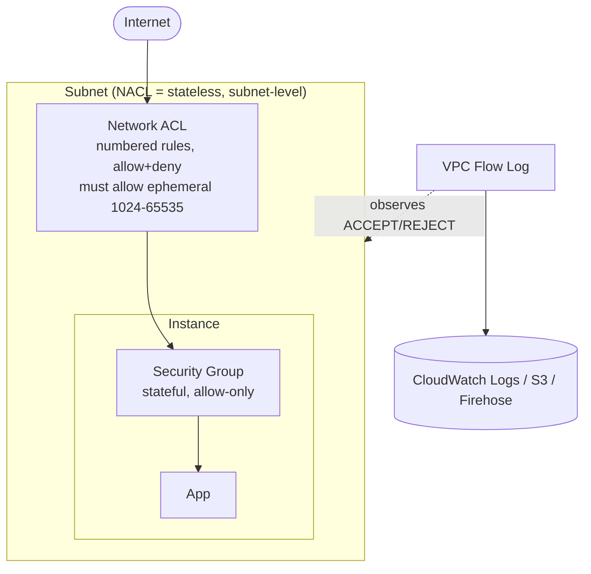

# 05.2 – VPC Security (SG, NACL, Flow Logs, Network Firewall)

The traffic-control and visibility layers of a VPC: two firewalls (stateful SG, stateless NACL), the log that tells you *why* traffic was allowed or blocked (Flow Logs), and the managed deep-inspection layer (Network Firewall). Part of [[05-vpc]].

> [!info] Exam TL;DR
> - **Security Group** = stateful, instance/ENI-level, **allow-only** (implicit deny for the rest), all rules evaluated together. Return traffic is auto-allowed (stateful).
> - **NACL** = stateless, subnet-level, **allow AND deny**, rules **numbered & evaluated low→high, first match wins**. You must open **both directions** *and* the **ephemeral return ports `1024–65535`** yourself.
> - **Default flip:** default NACL = allow-all; a **new custom NACL = deny-all**. (SGs: new SG denies inbound; default SG self-references.)
> - **Use a NACL when** you need an explicit **DENY** (block an IP/CIDR) or a **subnet-wide guardrail** — the two things an SG fundamentally can't do.
> - **Flow Logs** capture connection **metadata** + **ACCEPT/REJECT** — never payload. Attach at **VPC / subnet / ENI**; publish to **CloudWatch Logs / S3 / Kinesis Firehose**.
> - **Network Firewall** = managed, stateful **IPS (Suricata)** with deep packet inspection + **domain filtering**; lives in a **dedicated firewall subnet** with route tables sending traffic through it. Far beyond SG/NACL (which are just IP/port allow-deny).

## Concept (plain English)

Two firewalls guard your VPC at different layers. The **security group** wraps each instance's network interface: it's stateful (if it lets a request in, the reply is automatically allowed out) and only expresses *allows*. The **NACL** wraps the whole subnet: it's stateless (it evaluates every packet in isolation, so you must explicitly allow the return traffic too) and can express *denies*. In practice SGs do 95% of the work; NACLs exist for the two things SGs can't — explicitly blocking a bad actor and enforcing a subnet-wide rule independent of instance owners. **Flow Logs** are the audit trail: for every connection they record who-talked-to-whom-on-what-port and whether it was allowed or rejected — the first thing you check when "traffic is mysteriously blocked." **Network Firewall** is the heavy artillery: a managed intrusion-prevention system that actually inspects packet contents and can filter by domain name.

## AWS console ↔ Terraform map

| Concept | Terraform | Notes |
|---|---|---|
| Security group | `aws_security_group` + `aws_vpc_security_group_ingress_rule`/`egress_rule` | Modern per-rule resources; source can be a CIDR or another SG (`referenced_security_group_id`). |
| Network ACL | `aws_network_acl` (+ inline `ingress`/`egress` or separate `aws_network_acl_rule`) | `rule_no` = precedence (low first). `action = allow/deny`. `protocol = -1` for all. |
| Associate NACL ↔ subnets | `subnet_ids` on the NACL, or `aws_network_acl_association` | Each subnet has exactly one NACL (default if unset). |
| Flow log | `aws_flow_log` | `vpc_id`/`subnet_id`/`eni_id` (the level), `traffic_type` (ALL/ACCEPT/REJECT), `log_destination_type`, `max_aggregation_interval` (60 or 600). |
| Log group (CloudWatch dest) | `aws_cloudwatch_log_group` | Needs an IAM **service role** (see below). S3 dest needs a bucket policy instead. |
| Flow-log IAM service role | `aws_iam_role` trusting `vpc-flow-logs.amazonaws.com` + `logs:*` permissions | The trust-vs-permissions split from [[01-iam]], for real. |
| Network Firewall | `aws_networkfirewall_firewall` + `_firewall_policy` + `_rule_group` | *Conceptual-only here* — needs a dedicated firewall subnet + route-table redirection; ~$0.395/hr. |

## Architecture diagram



## Key facts, limits & pricing

- **Ephemeral port range = `1024–65535`** (the safe superset to allow on a NACL for return traffic). OS-specific: Linux `32768–60999`, Windows 2008+ `49152–65535`, ELB/Lambda/NAT `1024–65535`. Direction: a server *receiving* requests allows ephemeral **outbound** (its reply → client's ephemeral port); an instance *initiating* outbound allows ephemeral **inbound** (the reply → its ephemeral port).
- **NACL rule numbers**: 1–32766 for custom rules, evaluated ascending, **first match wins**, plus an unremovable `*` rule that denies anything unmatched. Lower number = higher priority.
- **SG evaluation**: no order/precedence — all rules are a union of allows; if any allows the traffic, it's permitted; there are no denies.
- **One NACL per subnet, one SG-set per ENI.** A subnet uses the default NACL unless you associate a custom one. An instance can have up to (quota) SGs.
- **Flow log fields (default v2):** `version account-id eni-id srcaddr dstaddr srcport dstport protocol packets bytes start end action log-status`. Protocol numbers: **6 = TCP, 17 = UDP, 1 = ICMP**. Action = `ACCEPT`/`REJECT`.
- **Flow logs = metadata only, never payload.** (Payload/deep inspection = Network Firewall's job — a classic distractor.)
- **Flow log levels:** VPC, subnet, or ENI. **Destinations:** CloudWatch Logs, S3, Kinesis Data Firehose.
- **Not logged by flow logs:** traffic to the Amazon DNS server (custom DNS *is* logged), DHCP, the instance metadata endpoint `169.254.169.254`, the **Amazon Time Sync Service `169.254.169.123`**, Windows license activation, and the reserved VPC-router IP.
- **`max_aggregation_interval`**: 600s default, or 60s for faster records (set to 60 to see logs in ~2 min instead of ~10).
- **Network Firewall** ~$0.395/hr per firewall endpoint + data processing (⚠️ check current). SG/NACL are **free**. Flow logs cost only the destination storage/ingestion.

## Comparisons

### Security Group vs Network ACL (the exam's favorite table)

|   | Security Group | Network ACL |
|---|---|---|
| Level | Instance / ENI | Subnet |
| State | **Stateful** (return traffic auto-allowed) | **Stateless** (must allow return traffic explicitly) |
| Rules | **Allow only** | **Allow and deny** |
| Evaluation | All rules, union of allows | Numbered, low→high, **first match wins** |
| Default (the auto-created one) | Self-referencing inbound + allow-all outbound | Allow all in & out |
| Default (a NEW custom one) | Deny all inbound, allow all outbound | **Deny all** in & out |
| Source can be | CIDR **or another SG** | CIDR only |
| Ephemeral ports | Handled automatically (stateful) | **You must open `1024–65535`** |
| Blocks a specific IP? | **No** (can't deny) | **Yes** (explicit deny) |

### Where each layer sits

| Layer | Scope | Inspects | Can deny? | Cost |
|---|---|---|---|---|
| Security Group | ENI | IP + port (L3/L4) | No (allow-only) | Free |
| Network ACL | Subnet | IP + port (L3/L4) | Yes | Free |
| Network Firewall | VPC perimeter (firewall subnet) | **Payload / domain / protocol (L3–L7, IPS)** | Yes | ~$0.395/hr |

## Worked examples

> [!example] Worked example — reading real flow logs from this build (ACCEPT vs REJECT)
> A throwaway instance (`10.0.0.43`) in the public subnet generated these actual records:
> ```
> 185.125.188.59 → 10.0.0.43  443 → 50908  TCP  ACCEPT   (Canonical HTTPS reply; ephemeral inbound allowed)
> 167.94.145.20  → 10.0.0.43  46084 → 993  TCP  REJECT   (internet scanner hitting IMAPS; SG allows only 22)
> 10.0.0.43 → 23.186.168.125  41532 → 123  UDP  REJECT   (instance's NTP blocked by the TCP-only NACL)
> ```
> Reading them: **REJECT + inbound + a port you never opened** = your firewall doing its job (that `167.94.145.20` is a real internet research scanner — this noise hits every public IP constantly). **REJECT + outbound + a port your app needs** = *your own* rule is too strict → the bug. Troubleshooting flow: grep `REJECT`, read the `dstport`, decide "intended block or my mistake."

> [!failure] Failure mode — the stateless NACL that "half works"
> You add a NACL allowing inbound HTTP 80 so users reach a web server, but pages hang. The SG is fine. Cause: the NACL is **stateless**, so the server's *reply* (going back out to the client's ephemeral port) needs its own **outbound** rule for `1024–65535` — which you didn't add, so the response is dropped by the implicit `* deny`. Inbound worked, outbound reply died, connection half-opened. Fix: add the ephemeral outbound allow. **This is the single most common NACL mistake and a guaranteed exam question.** (Its sibling bit us live: a *TCP-only* NACL blocked the instance's **UDP 53 DNS and UDP 123 NTP**, showing up as outbound `REJECT` in the flow logs above.)

> [!example] Worked example — when SG can't do the job (block one bad IP)
> A single IP is scraping your app abusively and you must block it at the **subnet** level regardless of instance SGs. A security group **can't** — it's allow-only. You add a NACL rule: `rule_no 100, action deny, cidr 203.0.113.50/32`, numbered **below** your allow rules so first-match-wins blocks it before any allow is considered. This is *the* reason NACLs exist alongside SGs — explicit deny + subnet-wide reach. (Real-world caveat: for app-layer / scaled blocking you'd reach for AWS WAF or Network Firewall; a NACL is the blunt L3/L4 instrument.)

## The Terraform I wrote

Code: [`05-vpc/security.tf`](../05-vpc/security.tf) (NACL) + [`05-vpc/flow-logs.tf`](../05-vpc/flow-logs.tf)

- NACL on the public subnets: `#100 deny 203.0.113.50/32` (proves precedence), `#110/120` allow 80/443, `#130` allow SSH 22 from my `/32`, `#140` + egress `#120` allow ephemeral `1024–65535`. Inline `ingress`/`egress` blocks.
- Flow log → CloudWatch: `aws_cloudwatch_log_group` + an IAM **service role** (`vpc-flow-logs.amazonaws.com` trust policy + `logs:*` permissions) + `aws_flow_log` (`traffic_type = "ALL"`, `max_aggregation_interval = 60`). Verified by reading real ACCEPT/REJECT records.

Two things learned the hard way:
- **Trust-vs-permissions swap:** first wired `assume_role_policy` to the *permissions* document instead of the trust document → would fail apply with `MalformedPolicyDocument`. `validate` passed (valid reference, wrong meaning); **TFLint's `terraform_unused_declarations`** would flag the now-unused trust doc — logic errors need lint + plan-reading, not `validate`.
- **TCP-only NACL** silently blocks UDP DNS/NTP — saw it as outbound `REJECT` in the flow logs.

> [!warning] Trap — "make the NACL match the SG rules and you're done"
> No — the NACL is stateless, so it needs the **ephemeral return rule** the SG never required. Mirroring SG rules onto a NACL without ephemeral ports is the guaranteed-to-break configuration.

> [!warning] Trap — "use flow logs to see what data was exfiltrated"
> Flow logs are **metadata only** — IPs, ports, bytes, ACCEPT/REJECT. They never show payload. Payload/domain/deep inspection = **Network Firewall** (or VPC Traffic Mirroring for packet capture). Common distractor.

> [!warning] Trap — "a higher NACL rule number can override a lower deny"
> No — **first match wins, low number first**. A `deny` at #100 is final; #200 allow never gets evaluated for that packet.

> [!example]- Recreate-from-memory drill
> On a public subnet: write a NACL that (a) denies one specific IP, (b) allows inbound HTTP/HTTPS from anywhere, (c) allows SSH only from your IP, (d) allows the ephemeral return range in the correct direction(s). Then add a VPC flow log to CloudWatch with a 60s aggregation interval and the required IAM service role. Confirm you can predict which of your rules blocks a packet from the denied IP and why.
> > [!success]- Reference solution
> > See `05-vpc/security.tf` + `flow-logs.tf`. Gotchas: deny rule gets the **lowest** number; ephemeral `1024–65535` on **both** egress (server replies) and ingress (returns for instance-initiated); flow-log role trusts `vpc-flow-logs.amazonaws.com`.

## 🔴 My weak spots (this topic)   #weak-spot

- [ ] **Trust policy vs permissions policy (again)** — wired the permissions doc into `assume_role_policy`. The [[01-iam]] distinction keeps biting; trust = who assumes, permissions = what they can do.
- [ ] **Stateless NACL ephemeral return ports** — knew the *logic* but not the range (`1024–65535`); and a TCP-only NACL silently kills UDP DNS/NTP.
- [ ] **`validate` ≠ correct** — it passes on logic errors (wrong-but-valid references). Need TFLint (`unused_declarations`) + plan-reading to catch them.
- [ ] **Flow logs = metadata, not payload** — don't confuse with Network Firewall / Traffic Mirroring.
- [ ] **VPC Flow Logs details** (had forgotten the topic): fields, levels VPC/subnet/ENI, destinations CloudWatch/S3/Firehose, excluded traffic.

## 🔗 Docs

- [Security groups](https://docs.aws.amazon.com/vpc/latest/userguide/vpc-security-groups.html) / [Network ACLs](https://docs.aws.amazon.com/vpc/latest/userguide/vpc-network-acls.html) — incl. ephemeral ports + default behaviors
- [VPC Flow Logs](https://docs.aws.amazon.com/vpc/latest/userguide/flow-logs.html) — fields, levels, destinations, excluded traffic; verified 2026-07
- [Flow log record fields](https://docs.aws.amazon.com/vpc/latest/userguide/flow-log-records.html)
- [AWS Network Firewall — what is it](https://docs.aws.amazon.com/network-firewall/latest/developerguide/what-is-aws-network-firewall.html) — Suricata IPS, firewall subnet, domain filtering, deep packet inspection; verified 2026-07
- [Terraform `aws_network_acl`](https://registry.terraform.io/providers/hashicorp/aws/latest/docs/resources/network_acl) / [`aws_flow_log`](https://registry.terraform.io/providers/hashicorp/aws/latest/docs/resources/flow_log)

---
**Cards for this topic:** [[cards/05-vpc-security-cards]]
