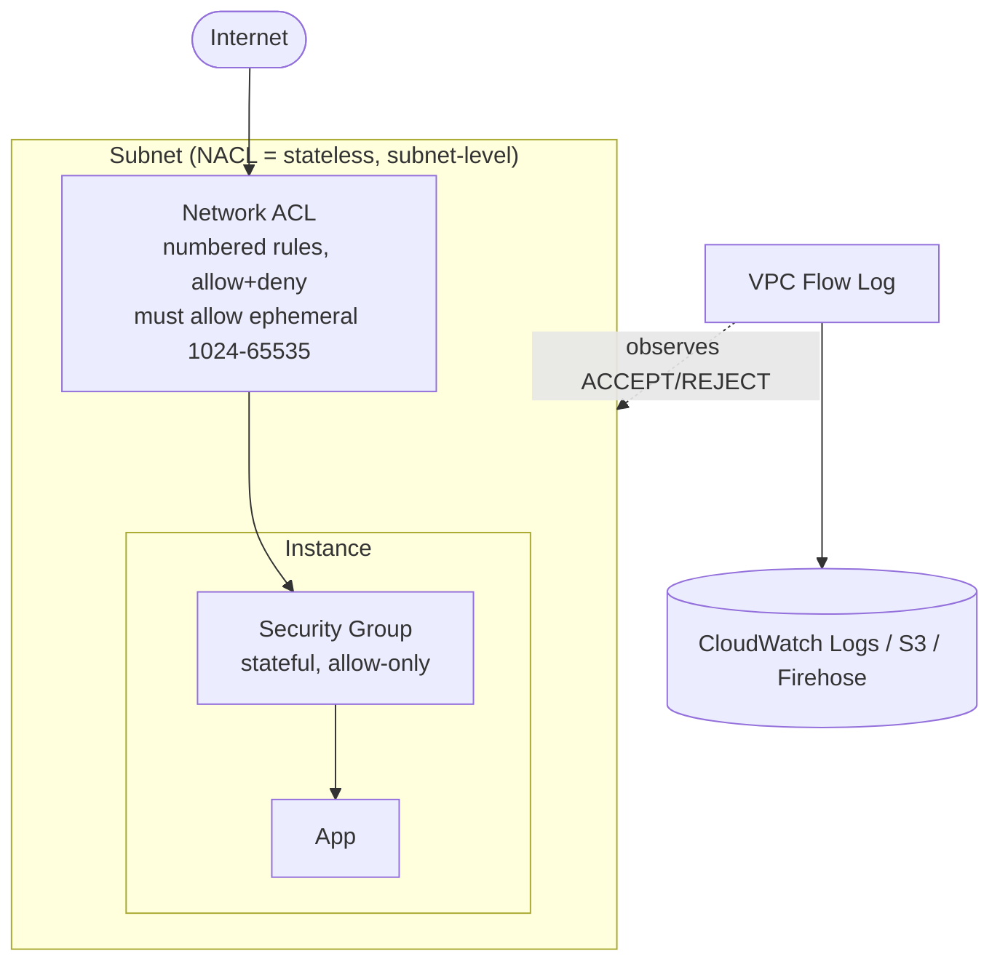

# 05.2 – VPC Security (SG, NACL, Flow Logs, Network Firewall)

The traffic-control and visibility layers of a VPC: two firewalls (stateful SG, stateless NACL), the log that tells you *why* traffic was allowed or blocked (Flow Logs), and the managed deep-inspection layer (Network Firewall). Part of [[05-vpc]].

> [!info] Exam TL;DR
> - **Security Group** = stateful, instance/ENI-level, **allow-only** (implicit deny for the rest), all rules evaluated together. Return traffic is auto-allowed (stateful).
> - **NACL** = stateless, subnet-level, **allow AND deny**, rules **numbered & evaluated low→high, first match wins**. You must open **both directions** *and* the **ephemeral return ports `1024–65535`** yourself.
> - **Default flip:** default NACL = allow-all; a **new custom NACL = deny-all**. (SGs: new SG denies inbound; default SG self-references.)
> - **Use a NACL when** you need an explicit **DENY** (block an IP/CIDR) or a **subnet-wide guardrail** — the two things an SG fundamentally can't do.
> - **Flow Logs** capture connection **metadata** + **ACCEPT/REJECT** — never payload. Attach at **VPC / subnet / ENI**; publish to **CloudWatch Logs / S3 / Amazon Data Firehose** (older material says *Kinesis* Data Firehose).
> - **Network Firewall** = *"a stateful, managed, network firewall and intrusion detection and prevention service"* using **Suricata** for stateful inspection, with deep packet inspection + **domain filtering**. It has **both** rule-group types — *stateless* (single-packet, 5-tuple) and *stateful* (flow-aware, Suricata) — so "stateless vs stateful" is not the SG/NACL dichotomy here; lives in a **dedicated firewall subnet** with route tables sending traffic through it. Far beyond SG/NACL (which are just IP/port allow-deny).

## What problem does this solve?

Your instances live in a VPC. Something has to decide which packets are allowed to reach them, and something has to tell you afterwards what that decision was.

AWS gives you two firewalls for the deciding, and they sit in different places.

One wraps each instance's network interface. That's the **security group**. It only knows how to say *yes*: you list what may reach this instance, and anything you didn't list is refused — not by a rule, but by never having been mentioned.

The other wraps the whole subnet — the same subnet whose routing [[05-vpc-core]] covers. That's the **network ACL**. It can say *no* out loud, and it applies to every instance in that subnet whether or not the person who launched them agreed.

You need both because each can do exactly one thing the other can't. A security group can't block a specific bad IP — it has no deny at all. A network ACL can't follow a conversation — it judges each packet alone, so you have to describe the reply as well as the request. In day-to-day work security groups carry almost all of the load — AWS's own guidance is *"In most cases, security groups can meet your needs"*, with NACLs as *"an additional layer of security"* — and the NACL is there for those two gaps.

Deciding without seeing is how you lose an afternoon to "the traffic is mysteriously blocked". So **Flow Logs** record every connection — who talked to whom on what port, and whether it was accepted or rejected.

And when address-and-port isn't enough — you need to know what's *inside* the packet, or block by domain name — that's **Network Firewall**.

> In one line: the SG guards the instance and can only allow, the NACL guards the subnet and can deny, and Flow Logs record whether the traffic was allowed or rejected.

## How it actually works

### Stateful versus stateless

Almost everything else in this topic falls out of this one difference.

A security group is **stateful**. When it allows a request in, it remembers that connection. The reply is allowed back out automatically — you never wrote a rule for it, and you don't need one.

A network ACL is **stateless**. It has no memory. Every packet is judged on its own, with no knowledge that it happens to be the answer to something already allowed.

Walk a real one. Someone on the internet loads your web page:

1. Their packet reaches the subnet — **inbound**, destination port 80. The NACL checks its inbound rules, finds your allow for 80, passes it.
2. It reaches the instance's ENI — **inbound** port 80 again. The SG allows 80. Passes.
3. The web server replies. Leaving through the SG — **outbound**. The SG remembers step 2, so no rule is needed.
4. That same reply hits the NACL — **outbound**. The NACL remembers nothing. It looks for an outbound rule matching this packet, and if you never wrote one, the unmatched-traffic deny drops it.

The page hangs. Inbound worked, the reply died, and nothing in the rules you wrote looks wrong — which is why the missing return rule is the classic NACL mistake, and why AWS states the requirement outright: *"For every rule that you add, there must be an inbound or outbound rule that allows response traffic."*

> In one line: the SG remembers the conversation, the NACL sees one packet at a time — so on a NACL you must write both halves.

### Ephemeral ports, and which direction to open them

Step 4 above raises the obvious question: what port is that reply even going to?

Not 80. Port 80 is where the *request* went. The reply goes back to whatever port the client's operating system picked when it opened the connection — a temporary, high-numbered port that's thrown away when the connection closes. That's an **ephemeral port**.

You can't know which one it picked. So you allow the whole range: **1024–65535**.

That range is deliberately a superset. The real range depends on who's at the other end — *"many"* Linux kernels (including Amazon Linux) use 32768–61000, Windows through Server 2003 use 1025–5000, Windows Server 2008 and later 49152–65535, and ELB, Lambda and NAT gateway use 1024–65535. Since the other end could be any of them, you open the widest.

Now the part people write backwards. The direction depends on who started the conversation.

| The instance is… | The ephemeral rule goes… | Because |
|---|---|---|
| Receiving requests (a web server) | **outbound** | its reply travels out to the *client's* ephemeral port |
| Initiating requests (calling an API, resolving DNS) | **inbound** | the answer comes back to *its own* ephemeral port |

An instance that does both — most do — needs both.

One more thing hides in here. A NACL rule names a protocol, so a rule set written only for TCP blocks UDP outright — that quietly kills UDP to **external** DNS and NTP servers — external ones only, for the reason in the next sentence — and it surfaces as outbound `REJECT` lines in the flow logs rather than as an obvious error. It does not touch the VPC defaults either — and this is **not** a NACL quirk, which is the part worth carrying into an SG-vs-NACL question: AWS publishes the *same seven exclusions for security groups too*, word for word. Neither layer *"filter[s] traffic destined to and from"*: **Amazon DNS**, **DHCP**, **EC2 instance metadata**, **ECS task metadata endpoints**, **Windows license activation**, the **Amazon Time Sync Service**, and the **reserved VPC router addresses**. Two of those come with a named alternative, which is the exam-useful part: *"Network ACLs can't block DNS requests to or from the Route 53 Resolver (also known as the VPC+2 IP address or AmazonProvidedDNS). To filter DNS requests through the Route 53 Resolver, you can enable **Route 53 Resolver DNS Firewall**."* And a NACL *"can't block traffic to the Instance Metadata Service (IMDS)"* — you restrict that with the instance's own **metadata options** ([[02-ec2]]). *(Verified 2026-10-05.)*

> In one line: replies land on 1024–65535 — outbound if you're answering, inbound if you're asking — and a TCP-only rule set silently drops UDP.

### Numbered rules, and first match wins

A security group has no ordering. Every rule is an allow, all of them are evaluated together, and if any one of them permits the traffic it's in. Two rules can never contradict each other.

A NACL *can* contradict itself — it holds allows and denies side by side — so it needs a tiebreaker. The tiebreaker is the rule number.

Custom rules are numbered 1–32766 and read in ascending order. **The first rule that matches decides, and nothing after it is read.** At the end sits a `*` rule you can't remove, denying anything that matched nothing.

So a low number isn't "less important" — it's more. Put `deny 203.0.113.50/32` at #100 and `allow 80/443 from anywhere` at #110, and that IP is blocked: #100 matched first and evaluation stopped there. Write the same deny at #200 and it never runs, because #110 already allowed the packet and the search ended.

Two defaults flip in a way worth pinning down:

|   | The auto-created one | A NEW one you create |
|---|---|---|
| Security group | self-referencing inbound, allow all outbound | denies all inbound, allows all outbound |
| Network ACL | allows everything in and out | **denies everything in and out** |

"Self-referencing" is the one that needs unpacking: the default security group's inbound rule names *itself* as the source, so it admits traffic from any resource that is also in that group and nothing else. It is not "allow all inbound".

The default NACL is wide open, which is why a subnet you never configured is effectively filtered by security groups alone. Create a custom NACL and associate it, and you start from deny-all and have to build every flow back up by hand — both directions, ephemeral range included. A subnet has exactly one NACL at a time (associating a new one removes the previous association), though one NACL can cover many subnets; leave a subnet unassociated and it uses the default.

One cross-service trap worth carrying to [[04-alb-asg]]: if the subnet holding your load-balancer targets has a NACL with *"a deny rule for all traffic with a source of either `0.0.0.0/0` or the subnet's CIDR, your load balancer can't carry out health checks on the instances"* — so the targets fail health checks for a reason that is nowhere near the target group.

> In one line: lowest matching number wins and stops the search — and a custom NACL starts closed while the default one starts open.

### What flow logs can and cannot tell you

A flow log records connection metadata: source and destination address, source and destination port, protocol, packet and byte counts, a start and end time, and `ACCEPT` or `REJECT`. You can attach one at the VPC, subnet or ENI level, and publish to CloudWatch Logs, S3, or Amazon Data Firehose (older material calls it Kinesis Data Firehose).

What a flow log never contains is the payload. No request body, no filename, no URL. If the question is "what data left the network", flow logs cannot answer it — that's Network Firewall's job, or VPC Traffic Mirroring for real packet capture.

Reading them is a small skill worth having. The useful split is:

- `REJECT` + **inbound** + a port you never opened → your firewall working correctly. The internet scans every public IP constantly; this noise is normal.
- `REJECT` + **outbound** + a port your app actually needs → *your own* rule is too strict. That one is the bug.

Two practicalities. The protocol shows up as a number — 6 is TCP, 17 is UDP, 1 is ICMP. And records are batched, with a wrinkle that matters when you are
debugging. The aggregation interval defaults to **600 seconds** (10 minutes) and can be
set to **60** — but *"when your network interface is attached to a Nitro-based instance, the
aggregation interval is always 1 minute or less, regardless of the specified maximum aggregation
interval"*. Most current families are Nitro, so that override usually applies. Do not turn it into
an absolute, though: **T2 is still a current-generation family and still runs on Xen**, so on a
`t2.micro` — this repo's own free-tier default — the 10-minute interval genuinely applies. What you *are* waiting on is publishing, and AWS does put numbers
on it: *"After data is captured within an aggregation interval, it takes additional time to process
and publish the data to CloudWatch Logs or Amazon S3. The flow log service typically delivers logs
to **CloudWatch Logs in about 5 minutes** and to **Amazon S3 in about 10 minutes**. However, log
delivery is on a best effort basis, and your logs might be delayed beyond the typical delivery
time."* It also warns that *"Flow logs do not capture real-time log streams"*. So: expect minutes,
not seconds, and do not read an empty log as "no traffic". *(Verified 2026-10-05.)*

Some traffic never appears at all. AWS's list: the **Amazon DNS server** (a custom DNS resolver *is* logged), **DHCP**, the instance metadata endpoint **`169.254.169.254`**, the Amazon Time Sync Service **`169.254.169.123`**, **Windows license activation**, the **reserved VPC router address**, **ARP** traffic, **traffic-mirrored *source* traffic** (you see the target's), traffic **between a VPC endpoint ENI and a Network Load Balancer ENI**, and traffic on a **short-lived regional NAT gateway** deleted minutes after creation. Silence there is not evidence that something was blocked. *(Verified 2026-10-05.)*

One more tool belongs beside flow logs, because it answers the same question from the other
direction. Flow logs tell you what *did* happen; **Reachability Analyzer** tells you what *would*
happen without sending a packet. It is *"a static configuration analysis tool"* that analyses the
path between two resources, *"produces hop-by-hop details of the virtual path between these
resources when they are reachable, and identifies the blocking component otherwise"* — AWS
explicitly notes *"it can identify missing or misconfigured network ACL rules"*. So: **"why was
this blocked?" → flow logs** (evidence, after the fact); **"will this reach that, and if not
which hop stops it?" → Reachability Analyzer** (configuration, before the fact). *(Verified
2026-10-05.)*

> In one line: flow logs give you who-to-whom-on-what-port plus ACCEPT or REJECT — never the contents.

### Network Firewall, and why it needs a subnet of its own

Security groups and NACLs both stop at IP and port. They can't tell that a packet carries a known exploit, and they can't block `evil.example.com`, because a domain name isn't an address.

Network Firewall is the managed layer for that. An **intrusion-prevention system (IPS)** looks inside traffic for known attack patterns and blocks what matches, rather than judging it by address and port; **Suricata** is the open-source rule engine AWS runs for the stateful half, so Suricata-compatible rules work as-is. It also does deep packet inspection and domain filtering.

The awkward part is where it lives. It isn't a setting you enable on a subnet. It's an endpoint that sits in its **own dedicated firewall subnet**, and traffic only reaches it because you changed route tables to send it there. AWS gives the reason the subnet must be dedicated, and it is worth memorising: *"A firewall endpoint cannot filter traffic coming into or going out of the subnet in which it resides, so do not use your firewall subnets for anything other than Network Firewall."* Skip the routing and the firewall is running, billing, and inspecting nothing.

Which is the other thing to hold on to: security groups and NACLs are free. Network Firewall runs **$0.395 per hour per firewall endpoint plus $0.065 per GB processed** in us-east-1 — and more if you enable the extras (additional endpoints, Advanced Inspection for TLS at a higher hourly rate, Advanced Threat Protection per GB), plus cross-zone charges if one zone's endpoint filters another zone's traffic, plus logging costs (verified 2026-10-05; re-check rather than trusting the figures later). It's not the default answer — it's the answer when the requirement mentions payload, protocol or domain.

> In one line: SG and NACL filter addresses, Network Firewall inspects contents — and it only sees what your route tables send it.

## Architecture diagram


```mermaid
flowchart TB
    NET([Internet]) --> NACL
    subgraph SUBNET["Subnet (NACL = stateless, subnet-level)"]
      NACL[Network ACL<br/>numbered rules, allow+deny<br/>must allow ephemeral 1024-65535]
      subgraph INST["Instance"]
        SG[Security Group<br/>stateful, allow-only]
        APP[App]
      end
      NACL --> SG --> APP
    end
    FL[VPC Flow Log] -. observes ACCEPT/REJECT .-> SUBNET
    FL --> CW[(CloudWatch Logs / S3 / Firehose)]
```

## Key facts, limits & pricing

- **Ephemeral port range = `1024–65535`** (the safe superset to allow on a NACL for return traffic). OS-specific, in AWS's own wording: **many Linux kernels (incl. Amazon Linux) `32768–61000`**, **Windows through Server 2003 `1025–5000`**, **Windows Server 2008 and later `49152–65535`**, and **Elastic Load Balancing / Lambda / NAT gateway `1024–65535`**. AWS's own example NACL uses `32768–65535`, and its recommendation is the superset: *"to cover the different types of clients that might initiate traffic to public-facing instances in your VPC, you can open ephemeral ports 1024-65535"* — adding that you can still **deny** specific malicious ports inside that range, *"place[d] earlier in the table than the allow rules"*. *(Verified 2026-10-05.)* Direction: a server *receiving* requests allows ephemeral **outbound** (its reply → client's ephemeral port); an instance *initiating* outbound allows ephemeral **inbound** (the reply → its ephemeral port).
- **NACL rule numbers**: 1–32766 for custom rules, evaluated ascending, **first match wins**, plus an unremovable `*` rule that denies anything unmatched. Lower number = higher priority.
- **SG evaluation**: no order/precedence — all rules are a union of allows; if any allows the traffic, it's permitted; there are no denies.
- **A subnet has exactly one NACL; an ENI can have several security groups.** A subnet uses the default NACL unless you associate a custom one (and one NACL can serve many subnets). An ENI gets up to **5** security groups by default, raisable to **16** — and their rules **combine as a union of allows**, so adding a group can only ever widen access, never narrow it.
- **Flow log fields (default v2):** `version account-id interface-id srcaddr dstaddr srcport dstport protocol packets bytes start end action log-status`. Protocol numbers: **6 = TCP, 17 = UDP, 1 = ICMP**. Action = `ACCEPT`/`REJECT`.
- **Flow logs = metadata only, never payload.** (Payload/deep inspection = Network Firewall's job — a classic distractor.)
- **Flow log levels:** VPC, subnet, or ENI. **Destinations:** CloudWatch Logs, S3, Amazon Data Firehose (renamed from *Kinesis* Data Firehose — older material still uses the old name).
- **Not logged by flow logs:** the Amazon DNS server (custom DNS *is* logged), DHCP, `169.254.169.254` (instance metadata), **`169.254.169.123`** (Amazon Time Sync), Windows license activation, the reserved VPC-router IP, **ARP**, **traffic-mirrored source traffic**, traffic **between a VPC endpoint ENI and an NLB ENI**, and a **short-lived regional NAT gateway**. Note this is a *different list* from the one a NACL cannot filter — the two overlap but are not the same.
- **Maximum aggregation interval**: **600s (10 min) default, or 60s**. But there is a caveat worth knowing: *"When your network interface is attached to a Nitro-based instance, the aggregation interval is always 1 minute or less, regardless of the specified maximum aggregation interval."* Most families you would pick today are Nitro (M5+, C5+, R5+, T3/T3a/T4g), so the 600s setting often does not bite — **but not all current-generation families are Nitro**: AWS's General Purpose specs page still lists **T2 on the Xen hypervisor**, so on a `t2.micro` the 10-minute interval is real. On top of the interval, AWS publishes the delivery times: it *"typically delivers logs to CloudWatch Logs in about 5 minutes and to Amazon S3 in about 10 minutes"*, on a *"best effort basis"*. *(Verified 2026-10-05.)*
- **A flow log is immutable.** *"After you create a flow log, you can't change its configuration or the flow log record format"* — not the IAM role, not the fields. To change anything you **delete it and create a new one**. You also choose the traffic type at creation: **accepted, rejected, or all**. Limit: **250 subscriptions per resource per account**.
- **Flow logs work on other services' network interfaces too** — AWS names Elastic Load Balancing, RDS, ElastiCache, Redshift, WorkSpaces, NAT gateways and transit gateways. For an ENI you must use the EC2 console or API to create the flow log.
- **Network Firewall**: **$0.395/hr per firewall endpoint + $0.065/GB processed** (us-east-1, verified 2026-10-05 — re-check rather than trusting the figure later). SG/NACL are **free**. Flow logs cost only the destination storage/ingestion.

## Comparisons

### Security Group vs Network ACL (the exam's favorite table)

|   | Security Group | Network ACL |
|---|---|---|
| Level | Instance / ENI | Subnet |
| State | **Stateful** (return traffic auto-allowed) | **Stateless** (must allow return traffic explicitly) |
| Rules | **Allow only** | **Allow and deny** |
| Evaluation | All rules, union of allows | Numbered, low→high, **first match wins** |
| Default (the auto-created one) | Self-referencing inbound + allow-all outbound | Allow all in & out |
| Default (a NEW custom one) | Deny all inbound, allow all outbound | **Deny all** in & out |
| Source can be | CIDR, **another SG**, or a **managed prefix list** (`pl-…`) | CIDR only — *"You can't reference prefix lists in network ACL rules"* |
| Ephemeral ports | Handled automatically (stateful) | **You must open the return range yourself** — `1024–65535` is the safe superset when clients are unknown (AWS's own example uses `32768–65535`) |
| Blocks a specific IP? | **No** (can't deny) | **Yes** (explicit deny) |

### Where each layer sits

| Layer | Scope | Inspects | Can deny? | Cost |
|---|---|---|---|---|
| Security Group | ENI | IP + port (L3/L4) | No (allow-only) | Free |
| Network ACL | Subnet | IP + port (L3/L4) | Yes | Free |
| Network Firewall | VPC perimeter (firewall subnet) | **Payload / domain / protocol (L3–L7, IPS)** | Yes | $0.395/hr + $0.065/GB |

## Worked examples

> [!example] Worked example — reading flow-log records (ACCEPT vs REJECT)
> An instance (`10.0.0.43`) in a public subnet whose security group allows only port 22 inbound, behind a TCP-only NACL. Columns below are: source → destination, source port → destination port, protocol, action.
> ```
> 185.125.188.59 → 10.0.0.43  443 → 50908  TCP  ACCEPT   (Canonical HTTPS reply; ephemeral inbound allowed)
> 167.94.145.20  → 10.0.0.43  46084 → 993  TCP  REJECT   (internet scanner hitting IMAPS; SG allows only 22)
> 10.0.0.43 → 23.186.168.125  41532 → 123  UDP  REJECT   (instance's NTP blocked by the TCP-only NACL)
> ```
> Reading them: **REJECT + inbound + a port you never opened** = your firewall doing its job (that `167.94.145.20` is a real internet research scanner — this noise hits every public IP constantly). **REJECT + outbound + a port your app needs** = *your own* rule is too strict → the bug. Troubleshooting flow: grep `REJECT`, read the `dstport`, decide "intended block or my mistake."

> [!failure] Failure mode — the stateless NACL that "half works"
> You add a NACL allowing inbound HTTP 80 so users reach a web server, but pages hang. The SG is fine. Cause: the NACL is **stateless**, so the server's *reply* (going back out to the client's ephemeral port) needs its own **outbound** rule for `1024–65535` — which you didn't add, so the response is dropped by the implicit `* deny`. Inbound worked, outbound reply died, connection half-opened. Fix: add the ephemeral outbound allow. **This is the classic NACL mistake** — AWS states the rule explicitly: *"For every rule that you add, there must be an inbound or outbound rule that allows response traffic."* (Its sibling bit us live: a *TCP-only* NACL blocked the instance's **UDP 123 NTP** to an external time server, showing up as the outbound `REJECT` in the flow logs above. Note it could *not* have blocked DNS to the Amazon-provided resolver — a NACL cannot filter that at all, per the limits above — so only external UDP is in play here.)

> [!example] Worked example — when SG can't do the job (block one bad IP)
> A single IP is scraping your app abusively and you must block it at the **subnet** level regardless of instance SGs. A security group **can't** — it's allow-only. You add an inbound NACL rule with a **lower rule number than your allow rules** — say **#100 Deny, source `203.0.113.50/32`, all traffic**, sitting below an **#110 Allow 80/443** — because lower numbers are read first and the first match ends the search. AWS gives the same advice for this shape: *"Ensure that you place the deny rules earlier in the table than the allow rules."* This is *the* reason NACLs exist alongside SGs — explicit deny + subnet-wide reach. (Real-world caveat: for app-layer / scaled blocking you'd reach for AWS WAF or Network Firewall; a NACL is the blunt L3/L4 instrument.)

> [!warning] Trap — "make the NACL match the SG rules and you're done"
> No — the NACL is stateless, so it needs the **ephemeral return rule** the SG never required. Mirroring SG rules onto a NACL without ephemeral ports is the guaranteed-to-break configuration.

> [!warning] Trap — "use flow logs to see what data was exfiltrated"
> Flow logs are **metadata only** — IPs, ports, bytes, ACCEPT/REJECT. They never show payload. Payload/domain/deep inspection = **Network Firewall** (or VPC Traffic Mirroring for packet capture). Common distractor.

> [!warning] Trap — "a higher NACL rule number can override a lower deny"
> No — **first match wins, low number first**. A `deny` at #100 is final; #200 allow never gets evaluated for that packet.

## 🔴 My weak spots (this topic)   #weak-spot

- [ ] **Trust policy vs permissions policy (again)** — the [[01-iam]] distinction keeps biting: the **trust policy** says *who may assume* the role, the **permissions policy** says *what they may do* once they have.
- [ ] **Stateless NACL ephemeral return ports** — knew the *logic* but not the range (`1024–65535`); and a TCP-only NACL silently kills UDP DNS/NTP.
- [ ] **Flow logs = metadata, not payload** — don't confuse with Network Firewall / Traffic Mirroring.
- [ ] **VPC Flow Logs details** (had forgotten the topic): fields, levels VPC/subnet/ENI, destinations CloudWatch/S3/Firehose, excluded traffic.

## 🔗 Docs
- [Custom network ACLs — ephemeral port ranges and AWS's example rules](https://docs.aws.amazon.com/vpc/latest/userguide/custom-network-acl.html) — the per-OS ranges, the 1024–65535 recommendation, deny-rules-first advice, and the ELB health-check warning; verified 2026-10-05
- [Flow log records](https://docs.aws.amazon.com/vpc/latest/userguide/flow-log-records.html) — version-2 field order, the 10-min/1-min aggregation interval, the Nitro override, and the **5-min CloudWatch / 10-min S3** delivery figures; verified 2026-10-05
- [Flow log limitations](https://docs.aws.amazon.com/vpc/latest/userguide/flow-logs-limitations.html) — the full not-logged list, immutability, 250 subscriptions per resource; verified 2026-10-05
- [Network ACLs](https://docs.aws.amazon.com/vpc/latest/userguide/vpc-network-acls.html) — rule numbers 1–32766, one NACL per subnet, the seven non-filtered categories, Route 53 Resolver DNS Firewall, IMDS; verified 2026-10-05
- [Security groups](https://docs.aws.amazon.com/vpc/latest/userguide/vpc-security-groups.html) — the identical seven exclusions, statefulness, no charge; verified 2026-10-05
- [AWS Network Firewall pricing](https://aws.amazon.com/network-firewall/pricing/) — $0.395/hr/endpoint + $0.065/GB, plus the Advanced Inspection and Advanced Threat Protection dimensions; verified 2026-10-05
- [Security groups](https://docs.aws.amazon.com/vpc/latest/userguide/vpc-security-groups.html) / [Network ACLs](https://docs.aws.amazon.com/vpc/latest/userguide/vpc-network-acls.html) — incl. ephemeral ports + default behaviors
- [VPC Flow Logs](https://docs.aws.amazon.com/vpc/latest/userguide/flow-logs.html) — fields, levels, destinations, excluded traffic; verified 2026-07
- [Flow log record fields](https://docs.aws.amazon.com/vpc/latest/userguide/flow-log-records.html)
- [AWS Network Firewall — what is it](https://docs.aws.amazon.com/network-firewall/latest/developerguide/what-is-aws-network-firewall.html) — Suricata IPS, firewall subnet, domain filtering, deep packet inspection; verified 2026-07
