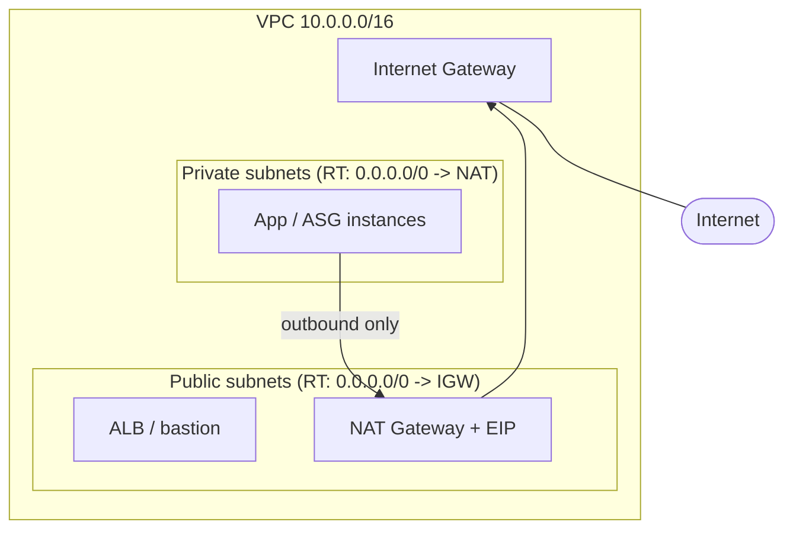

# 05 – VPC (index / map of content)

VPC is big enough that it's split across several concept notes rather than one file. This is the map; each sub-note is self-contained with its own cards.

> [!info] Exam TL;DR — the one-paragraph orientation
> A **VPC** is your isolated virtual network in one region, defined by a CIDR block. You carve it into **subnets** (each in one AZ). A subnet is **public** if its route table sends `0.0.0.0/0` to an **Internet Gateway** *and* instances get public IPs; **private** otherwise. Private subnets reach the internet *outbound-only* through a **NAT gateway** (which itself sits in a public subnet). Two firewall layers guard traffic: **security groups** (stateful, instance-level, allow-only) and **NACLs** (stateless, subnet-level, allow+deny, ordered). Beyond one VPC: **peering** and **Transit Gateway** connect VPCs; **VPC endpoints / PrivateLink** reach AWS services privately; **Site-to-Site VPN / Direct Connect** connect on-prem.

## Sub-notes

| # | Note | Covers | Build tier |
|---|---|---|---|
| 5.1 | [[05-vpc-core]] | VPC, CIDR, subnets, route tables (+ main RT), IGW, NAT gateway/instance, egress-only IGW, bastion, the 3 VPC defaults | Build free (NAT = paid peek) |
| 5.2 | [[05-vpc-security]] | SG vs NACL (deep), Network Firewall, Flow Logs | Build free |
| 5.3 | [[05-vpc-endpoints-peering]] | Gateway vs Interface endpoints (PrivateLink), VPC peering, Transit Gateway | Build free/paid; TGW conceptual |
| 5.4 | [[05-vpc-hybrid]] | Site-to-Site VPN, VGW, CGW, Direct Connect, DX Gateway | Conceptual only (sketch, no apply) |

## Master diagram

## The Terraform I wrote

`05-vpc/` — split by concern: `network.tf` (core), `nat.tf` (paid peek), plus per-increment files as topics are added. This VPC is the network you'd later drop the [[04-alb-asg]] stack into (ALB in the public pair, ASG in the private pair).

---
**Self-test:** each sub-note's revision doc ends with one (e.g. [[revision/05-vpc-core-revision#Self-test]]).
