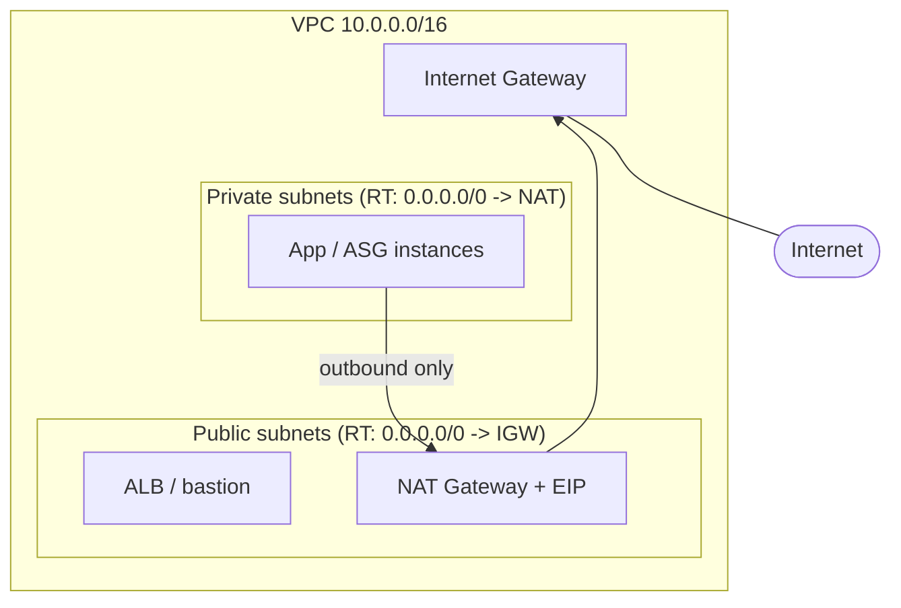

# 05 – VPC (index / map of content)

VPC is big enough that it's split across several concept notes rather than one file. This is the map; each sub-note is self-contained.

> [!info] Exam TL;DR — the one-paragraph orientation
> A **VPC** is your isolated virtual network in one region, defined by a CIDR block. You carve it into **subnets** (each in one AZ). AWS types a subnet by its **routing alone** — **public** means its route table has a direct route to an **Internet Gateway**, **private** means it doesn't — while actually *reaching* the internet also needs the instance to have a public IP. Private subnets reach the internet *outbound-only* through a **NAT gateway** (a zonal one sits in a public subnet; a regional one needs no subnet). Two firewall layers guard traffic: **security groups** (stateful, instance-level, allow-only) and **NACLs** (stateless, subnet-level, allow+deny, ordered). Beyond one VPC: **peering** and **Transit Gateway** connect VPCs; **VPC endpoints / PrivateLink** reach AWS services privately; **Site-to-Site VPN / Direct Connect** connect on-prem.

## Sub-notes

| # | Note | Covers | Build tier |
|---|---|---|---|
| 5.1 | [[05-vpc-core]] | VPC, CIDR, subnets, route tables (+ main RT), IGW, NAT gateway/instance, egress-only IGW, the 3 VPC defaults | Build free (NAT = paid peek) |
| 5.2 | [[05-vpc-security]] | SG vs NACL (deep), Network Firewall, Flow Logs | Build free |
| 5.3 | [[05-vpc-endpoints-peering]] | Gateway vs Interface endpoints (PrivateLink), VPC peering, Transit Gateway | Build free/paid; TGW conceptual |
| 5.4 | [[05-vpc-hybrid]] | Site-to-Site VPN, VGW, CGW, Direct Connect, DX Gateway | Conceptual only (sketch, no apply) |

## Master diagram

```mermaid
flowchart TB
    IGW[Internet Gateway] --- VPC
    subgraph VPC["VPC 10.0.0.0/16"]
      direction TB
      subgraph PUB["Public subnets (RT: 0.0.0.0/0 -> IGW)"]
        ALB[ALB / bastion]
        NAT[NAT Gateway + EIP]
      end
      subgraph PRIV["Private subnets (RT: 0.0.0.0/0 -> NAT)"]
        APP[App / ASG instances]
      end
      APP -->|outbound only| NAT --> IGW
    end
    IGW --- Internet([Internet])
```

The two notes this index does *not* cover: the compute that sits in these subnets is
[[02-ec2]], and the load balancer in the public tier is [[04-alb-asg]].
