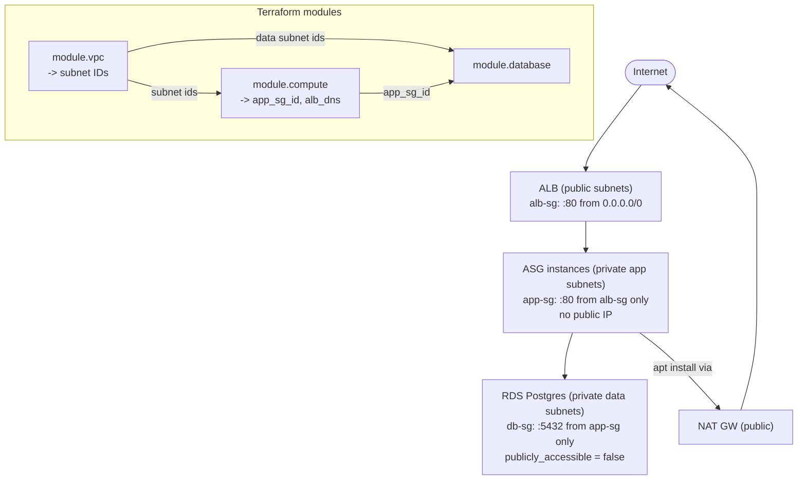

# 06 – Capstone: 3-Tier VPC with Terraform Modules

The consolidation build: a real secure 3-tier app (ALB → ASG → RDS) in a purpose-built VPC, composed as **three reusable Terraform modules**. Two big lessons: **modules** (the Terraform skill) and **RDS** (the exam service). Ties together [[05-vpc-core]], [[04-alb-asg]], [[02-ec2]], [[01-iam]], [[03-ami-bake]].

> [!info] Exam TL;DR
> - **3-tier shape:** ALB in **public** subnets → ASG instances in **private app** subnets → RDS in **private data** subnets. Security-group **chain**: internet → alb-sg → app-sg → db-sg (each tier only reachable from the one in front). This is *the* canonical SAA-C03 architecture.
> - **RDS Multi-AZ = synchronous standby in another AZ for FAILOVER (HA)** — NOT readable. **Read Replicas = async copies for READ SCALING** — readable, can be cross-region. Different problems.
> - **RDS encryption at rest is set at creation only** — can't encrypt an existing unencrypted instance in place (snapshot → copy with encryption → restore).
> - **DB subnet group** tells RDS which (2+ AZ) subnets it may live in. Keep RDS `publicly_accessible = false`.
> - **Terraform modules:** a module is just a directory (variables = inputs, outputs = returns). Outputs bubble up **one level** — re-export at each caller. Provider is configured once in the **root**; child modules inherit it.

## Concept (plain English)

A production app isn't one flat config — it's tiers with different exposure, and it's built from reusable pieces. This capstone puts the internet-facing load balancer in public subnets, the app servers in private subnets (no public IP, reachable only via the ALB's security group), and the database in its own private data subnets (reachable only from the app tier). Each tier is a security-group hop, so a breach of one doesn't hand over the next. And instead of one giant file, it's three **modules** — `vpc`, `compute`, `database` — each a self-contained directory with typed inputs and explicit outputs, wired together by a thin root config. That's how real Terraform is organized: composable, reusable, testable.

## AWS console ↔ Terraform map (new pieces)

| Concept | Terraform | Notes |
|---|---|---|
| A reusable child module | a directory + `module "x" { source = "./modules/x" }` | Inputs = its variables; outputs = its returns. No provider block inside. |
| Read a module's output | `module.x.output_name` | Only visible to the caller; re-export at root for the CLI. |
| DB subnet group | `aws_db_subnet_group` | The 2+ AZ subnets RDS may use. |
| The database | `aws_db_instance` | engine, instance_class, subnet group, SG, credentials, multi_az, storage_encrypted. |
| Secret input | `variable { sensitive = true }` + `terraform.tfvars` (gitignored) | Never hardcode a password in a `.tf` file. |

## Architecture diagram



## Key facts, limits & pricing

### Terraform modules
- A **module = a directory of `.tf` files**. The **root module** is where you run Terraform; **child modules** are called with `module "name" { source = "..." }`. `source` can be a local path, a git URL, or the Terraform Registry.
- **Inputs = `variable` blocks** (the module's API); **outputs = `output` blocks** (its return values). The caller passes inputs as arguments and reads outputs as `module.<name>.<output>`.
- **Outputs bubble up exactly one level.** A child's output is visible to its direct caller only; to expose it further (e.g. to the `terraform output` CLI), the caller **re-declares** it as its own output. *(Learned live: root `terraform output` showed nothing until the root re-exported the modules' outputs.)*
- **Provider is configured once, in the root.** Child modules **inherit** it — no `provider`/`terraform` block inside a module.
- After adding/changing a `module` block or its `source`, **re-run `terraform init`** to register it.
- Resources inside a module are addressed as `module.<name>.<resource>` in plans/state.
- **Don't over-modularize:** don't wrap a single resource; modularize a *pattern* you've repeated. Standard files: `main.tf` / `variables.tf` / `outputs.tf`.

### RDS
- **Managed relational DB**: MySQL, PostgreSQL, MariaDB, Oracle, SQL Server (+ **Aurora**, AWS's cloud-native MySQL/Postgres-compatible engine).
- **Multi-AZ**: a **synchronous** standby replica in another AZ; automatic failover on primary failure. It is **for HA, not reads** — you cannot read from the standby. Doubles cost; NOT Free-Tier.
- **Read Replicas**: **asynchronous** copies you *can* read from — for **read scaling**; up to 15 for Aurora, can be **cross-region**, can be promoted to standalone. Eventual consistency (replica lag).
- **DB subnet group**: the set of (2+ AZ) subnets RDS may place instances in — required for a VPC RDS.
- **Encryption at rest** (`storage_encrypted = true`, KMS): must be enabled **at creation**. To encrypt an existing unencrypted DB: snapshot → copy snapshot **with encryption** → restore.
- **Backups**: automated backups (point-in-time restore, retention 0–35 days) + manual snapshots (kept until deleted). `skip_final_snapshot = true` only for throwaway/learning.
- **`publicly_accessible = false`** keeps the DB off the public internet — correct for a data-tier subnet.
- Master **username reserved words**: RDS rejects some (`root`, `rdsadmin`, `admin` on some engines) — use a custom name like `dbadmin`. *(Hit live: `root` on postgres.)*
- Master **password constraints**: 8–128 chars, and cannot contain `/`, `"`, `@`, or spaces. *(Hit live: `@` in the first password would have been rejected.)*
- **Free Tier**: `db.t2/t3/t4g.micro`, single-AZ, 750 hrs/month, 20 GB storage, first 12 months.

## Comparisons

### RDS Multi-AZ vs Read Replica (the #1 RDS exam trap)

|   | Multi-AZ | Read Replica |
|---|---|---|
| Purpose | **High availability / failover** | **Read scaling** |
| Replication | Synchronous | Asynchronous |
| Readable? | **No** (standby is passive) | **Yes** |
| Same/other AZ | Other AZ (same region) | Same AZ, cross-AZ, or **cross-region** |
| Failover | Automatic | Manual promote (not automatic) |
| Trigger phrase | "survive an AZ failure", "HA" | "offload reads", "scale read traffic", "reporting" |

### Flat config vs Modules

|   | Flat (one dir of resources) | Modules |
|---|---|---|
| Reuse | Copy-paste | `module` block, parameterized |
| Encapsulation | None | Inputs/outputs are the contract |
| When | Learning, one-off, <~10 resources | Repeated patterns, multi-env, teams |

## Worked examples

> [!example] Worked example — the security-group chain is the security model
> Trace a request: a user hits the ALB (`alb-sg` allows :80 from `0.0.0.0/0`). The ALB forwards to an app instance — allowed because `app-sg` permits :80 **from `alb-sg`** (not from the internet; the instance has no public IP and lives in a private subnet). The app queries the database — allowed because `db-sg` permits :5432 **from `app-sg`**. Nothing can skip a tier: the internet can't reach the app SG, the app tier can't be reached except via the ALB, and the DB can't be reached except from the app tier. Each SG references the one in front by **SG ID, not CIDR** — so it keeps working as instances scale and IPs change. That reference chain *is* the 3-tier security model.

> [!failure] Failure mode — the all-protocols-with-ports egress error
> An egress rule with `ip_protocol = "-1"` (all protocols) **and** `from_port = 0` / `to_port = 0` (specific ports) fails: `You may not specify all protocols and specific ports`. It sneaks through **create** (AWS normalizes `0/0` → "all") but then every plan shows drift (`0` vs the stored `-1`) and the **update** is rejected by the stricter `ModifySecurityGroupRules`. Fix: for `-1`, **omit `from_port`/`to_port` entirely**. Rule of thumb: all-protocols ⇒ no port range; specific ports ⇒ a specific protocol.

> [!failure] Failure mode — secret in a committed .tf file
> Hardcoding `db_password = "..."` directly in `main.tf` puts a credential into git history the moment you commit. Fix (the real-world pattern): declare a **`sensitive = true`** variable, pass `db_password = var.db_password` in the module block, and put the value in **`terraform.tfvars`** (gitignored) or `TF_VAR_db_password`. Next level up in production: **AWS Secrets Manager / SSM Parameter Store** so the value never sits in a file at all — RDS can even manage the password in Secrets Manager directly.

## The Terraform I wrote

Code: `06-capstone/` — root (`main.tf` wiring, `variables.tf`, `outputs.tf`, `terraform.tfvars` gitignored) + `modules/{vpc,compute,database}/`.

- **module.vpc** — 3-tier network (2 public / 2 app / 2 data subnets, IGW, NAT, route tables), all driven by `var.*`, exposing `vpc_id` + three subnet-ID lists.
- **module.compute** — adapted [[04-alb-asg]]: golden AMI ([[03-ami-bake]]), alb-sg + app-sg chain, launch template (`user_data` via `${path.module}`), ALB/target group/listener, ASG in **private** app subnets, target-tracking policy. Exposes `alb_dns_name` + `app_sg_id`.
- **module.database** — DB subnet group, db-sg (from `var.app_sg_id`), `aws_db_instance` (postgres, single-AZ, encrypted, private, secret password).
- **root** wires it all: `module.vpc` outputs → `module.compute` + `module.database` inputs; `module.compute.app_sg_id` → `module.database`.

Non-obvious things hit:
- **Module outputs don't reach the CLI** until re-exported at the root (`terraform output` was empty).
- **`-1` egress rules must omit ports** (apply error above).
- **Empty SG `description = ""`** fails at apply (AWS requires a non-empty description); `validate`/`plan` don't catch it.
- **RDS reserved username** (`root`) + **forbidden password chars** (`@`).

> [!warning] Trap — Multi-AZ to scale reads
> Multi-AZ is **HA/failover**, the standby is **not readable**. To offload/scale reads you use **read replicas**. Swapping these is the most common RDS exam mistake.

> [!warning] Trap — "the module output shows in `terraform output`"
> Only **root** outputs show on the CLI. A module output must be re-declared at the root. Outputs bubble up one level per caller.

> [!tip] Production gap
> Real version adds: HTTPS listener (ACM cert) + HTTP→HTTPS redirect, RDS **Multi-AZ** + automated backups + `deletion_protection`, the password in **Secrets Manager** (not tfvars), one **NAT gateway per AZ**, remote **S3 state backend** with locking, and the modules pulled from a registry/git with pinned versions.

> [!example]- Recreate-from-memory drill
> Build a 3-module capstone: `vpc` (public/app/data subnets + NAT, outputs subnet IDs), `compute` (ALB public + ASG private + SG chain, outputs app_sg_id), `database` (RDS private, ingress from app_sg_id, sensitive password from tfvars). Wire outputs→inputs in the root, re-export `alb_dns_name` at root. Goal: browse the ALB; instances have no public IP; DB reachable only from app tier.
> > [!success]- Reference solution
> > See `06-capstone/`. Gotchas: `-1` egress omits ports; non-empty SG descriptions; RDS username not `root`, password no `@`; re-export module outputs at root; `terraform init` after adding each module.

## Accessing the private database (bastion vs SSM)

The DB is private (no public IP; `db-sg` allows only the app tier), so reaching it from a laptop needs a jump path. Both were built and tested on this stack.

> [!example] Option A — Bastion host + SSH tunnel
> A small EC2 in a **public** subnet (public IP, `bastion-sg` allowing `:22` from your `/32`), allowed into the DB via a `db-sg` ingress rule **from `bastion-sg`**. A GUI client (TablePlus **"Over SSH"**) SSHes to the bastion and tunnels to the RDS endpoint. The cross-module wiring lived in the root: `security_group_id = module.database.db_sg_id`, `referenced_security_group_id = aws_security_group.bastion.id`. Classic and works everywhere — but it's a public box to run/patch, an open SSH port, and keys to manage.

> [!example] Option B — SSM Session Manager port forwarding (preferred)
> **No bastion, no public IP, no inbound port.** Give the private app instances an instance profile with the AWS-managed **`AmazonSSMManagedInstanceCore`** policy; the SSM agent (pre-installed on Ubuntu AMIs) registers them with SSM over NAT. Then:
> ```
> aws ssm start-session --target <instance-id> \
>   --document-name AWS-StartPortForwardingSessionToRemoteHost \
>   --parameters '{"host":["<rds-endpoint>"],"portNumber":["5432"],"localPortNumber":["5432"]}'
> ```
> Local `127.0.0.1:5432` emerges *inside the VPC* at RDS; TablePlus connects to `localhost` (a plain connection, no SSH). Auth is **IAM**, and every session is logged in **CloudTrail**. Gotcha: on a *launch template*, `iam_instance_profile` is a **block** (`iam_instance_profile { name = ... }`), not the bare-string attribute used on `aws_instance`. Existing instances need an **instance refresh** to pick up the new profile.

| | Bastion | SSM Session Manager |
|---|---|---|
| Public instance | **Yes** | **No** |
| Inbound port open | SSH :22 | **None** |
| Auth | SSH key | **IAM** |
| Audit | box logs | **CloudTrail** |
| Extra infra | bastion to run/patch | just an instance profile |
| Exam framing | classic | **"access private instances without a bastion / without opening ports / auditable"** → Session Manager |

## 🔴 My weak spots (this topic)   #weak-spot

- [ ] **Module outputs bubble up one level** — must re-export at the root for `terraform output` / other modules to see them.
- [ ] **`-1` (all protocols) egress can't have a port range** — omit `from_port`/`to_port`.
- [ ] **Empty SG `description = ""` fails at apply** (not caught by validate/plan).
- [ ] **RDS Multi-AZ (HA, not readable) vs Read Replica (read scaling)** — the classic trap.
- [ ] **RDS username/password constraints** — reserved names (`root`), forbidden chars (`@`).
- [ ] **Secrets belong in tfvars (gitignored)/Secrets Manager**, never in a committed `.tf`.
- [ ] **Reaching a private DB: bastion (public, SSH, open port) vs SSM Session Manager (no bastion, IAM auth, CloudTrail)** — SSM is the "no open ports / auditable" exam answer.
- [ ] **`iam_instance_profile` is a BLOCK on a launch template**, a string on `aws_instance`; launch-template changes need an ASG instance refresh to take effect.

## 🔗 Docs

- [Terraform modules — creating & calling](https://developer.hashicorp.com/terraform/language/modules)
- [Terraform module outputs](https://developer.hashicorp.com/terraform/language/values/outputs)
- [RDS Multi-AZ](https://docs.aws.amazon.com/AmazonRDS/latest/UserGuide/Concepts.MultiAZ.html) / [Read Replicas](https://docs.aws.amazon.com/AmazonRDS/latest/UserGuide/USER_ReadRepl.html)
- [RDS encryption at rest](https://docs.aws.amazon.com/AmazonRDS/latest/UserGuide/Overview.Encryption.html)
- [Terraform `aws_db_instance`](https://registry.terraform.io/providers/hashicorp/aws/latest/docs/resources/db_instance) / [`aws_db_subnet_group`](https://registry.terraform.io/providers/hashicorp/aws/latest/docs/resources/db_subnet_group)

---
**Cards for this topic:** [[cards/06-capstone-cards]]
