# 07 – RDS & Aurora

The managed relational database tier. **RDS** = AWS runs standard engines for you; **Aurora** = AWS's cloud-native re-architecture of MySQL/Postgres with separated compute/storage. Built hands-on in [[06-capstone]]; this is the exam depth.

> [!info] Exam TL;DR
> - **RDS engines:** MySQL, PostgreSQL, MariaDB, Oracle, SQL Server, + **Aurora**.
> - **Multi-AZ = HA/failover** (synchronous standby, NOT readable). **Read Replica = read scaling** (async, readable, cross-region-capable, manual promote). The #1 RDS trap.
> - **Backups:** automated (daily snapshot + ~5-min transaction logs → **PITR to any second**, 1–35 day retention, deleted with the instance) vs manual snapshots (survive deletion). Restore always creates a **new instance**.
> - **Aurora storage:** **6 copies across 3 AZs**, self-healing, shared **cluster volume** auto-scaling **10 GB → 128 TB**; compute/storage **separated**.
> - **Aurora replicas share the storage** (no copy) → **<10 ms** lag, auto-failover, up to **15** (vs 5 RDS). Endpoints: **writer/cluster**, **reader** (LB'd reads), **custom**, **instance**.
> - **Aurora Serverless v2** = auto-scaling capacity for variable workloads. **Aurora Global Database** = 1 primary + up to 5 read-only regions, <1s replication (DR + global reads).
> - **Encryption at rest** = set at **creation only**. Keep DBs `publicly_accessible = false` in private subnets.

## Concept (plain English)

RDS takes the operational pain out of relational databases: AWS handles patching, backups, failover, and provisioning of standard engines (MySQL, Postgres, etc.). You still pick an instance size and manage schema/queries. **Aurora** goes further — AWS rebuilt the storage layer so it's a distributed, self-healing volume spread across AZs, decoupled from the compute instances. That decoupling is why Aurora scales storage automatically, spins up read replicas that share the same data (tiny lag), fails over fast, and offers serverless and global-database modes that plain RDS can't.

## AWS console ↔ Terraform map

| Concept | Terraform | Notes |
|---|---|---|
| RDS instance | `aws_db_instance` | engine, instance_class, storage, subnet group, SG, credentials, `multi_az`, `storage_encrypted`. |
| DB subnet group | `aws_db_subnet_group` | The 2+ AZ (private) subnets RDS may use. |
| RDS read replica | `aws_db_instance` with `replicate_source_db` | Async read copy. |
| Aurora cluster | `aws_rds_cluster` | The cluster (storage + endpoints + engine `aurora-mysql`/`aurora-postgresql`). |
| Aurora instance(s) | `aws_rds_cluster_instance` | Writer + reader instances attached to the cluster. |
| Aurora Serverless v2 | `aws_rds_cluster` + `serverlessv2_scaling_configuration` (min/max ACU) | Instances with class `db.serverless`. |

## Architecture diagram

```mermaid
flowchart TB
    App[App] -->|writes| WEP[Writer / Cluster endpoint]
    App -->|reads| REP[Reader endpoint - load-balances replicas]
    WEP --> PRI[Primary / writer instance]
    REP --> R1[Aurora Replica 1]
    REP --> R2[Aurora Replica 2 ... up to 15]
    subgraph VOL["Shared cluster volume (auto-scales 10GB-128TB)"]
      direction LR
      C1[(copy)]:::az1
      C2[(copy)]:::az1
      C3[(copy)]:::az2
      C4[(copy)]:::az2
      C5[(copy)]:::az3
      C6[(copy)]:::az3
    end
    PRI --- VOL
    R1 --- VOL
    R2 --- VOL
    classDef az1 fill:#123
    classDef az2 fill:#132
    classDef az3 fill:#231
```

*6 copies across 3 AZs; all instances read the same volume (why replica lag is tiny).*

## Key facts, limits & pricing

- **RDS Multi-AZ:** a **synchronous** standby in another AZ; **not readable**; automatic failover (~60–120s) via DNS CNAME swap. For HA only. Doubles cost; not Free-Tier.
- **RDS Read Replicas:** **asynchronous**; up to **5** per source (MySQL/Postgres); **readable**; can be **cross-region**; can be **promoted** to a standalone DB (manual, breaks replication). For read scaling / reporting. (You can combine: a Multi-AZ primary *with* read replicas.)
- **Backups:** automated backups enabled by setting retention 1–35 days → **point-in-time recovery** (daily snapshot + transaction logs every ~5 min). Deleted when the instance is deleted (unless you take a final snapshot). **Manual snapshots** are kept until you delete them and survive instance deletion. **Restore = new instance / new endpoint.**
- **Encryption at rest** (`storage_encrypted`, KMS): **only at creation**. To encrypt an existing unencrypted DB: snapshot → copy the snapshot **with encryption** → restore. Encryption in transit = SSL/TLS.
- **Aurora storage:** **6-way replication across 3 AZs** (2 copies/AZ); tolerates losing a whole AZ + one more copy for reads; self-healing; **cluster volume auto-scales 10 GB → 128 TB**. Compute and storage bill/scale independently.
- **Aurora Replicas:** up to **15**, share the cluster volume (**<10 ms** typical lag), **automatic failover** with priority tiers (much faster than RDS Multi-AZ). Aurora also keeps 6 storage copies regardless of instance count.
- **Aurora extras:** **Backtrack** (rewind the DB in place without restore, Aurora MySQL); **Aurora Serverless v2** (fine-grained auto-scaling ACUs for variable load); **Aurora Global Database** (1 primary + up to **5 secondary read-only regions**, **<1s** replication, cross-region DR); **Aurora Machine Learning**, **RDS Proxy** (connection pooling for Lambda/serverless).
- **Why Aurora over RDS MySQL/Postgres:** ~**5× MySQL / 3× Postgres** throughput, 15 vs 5 replicas, faster failover, 6-copy durability, auto-scaling storage, serverless + global options. Trade-off: pricier per-hour, MySQL/Postgres-compatible only.
- **RDS Free Tier:** `db.t2/t3/t4g.micro`, single-AZ, 750 hrs/mo, 20 GB, 12 months.

## Comparisons

### Multi-AZ vs Read Replica (memorize)

|   | Multi-AZ | Read Replica |
|---|---|---|
| Purpose | HA / failover | Read scaling |
| Sync | Synchronous | Asynchronous |
| Readable | **No** | **Yes** |
| Region | Same region (other AZ) | Same or **cross-region** |
| Failover | Automatic | Manual promote |
| Trigger words | "survive AZ failure", "HA" | "offload reads", "reporting", "scale reads" |

### RDS vs Aurora

|   | RDS (MySQL/Postgres) | Aurora |
|---|---|---|
| Storage | Single EBS volume (+ standby copy) | Distributed 6-copy/3-AZ cluster volume |
| Storage scaling | Manual/auto up to limit | Auto 10 GB–128 TB |
| Read replicas | Up to 5, copy data (lag) | Up to 15, share storage (<10 ms) |
| Failover | ~1–2 min (Multi-AZ) | Faster (shared storage) |
| Serverless | RDS has no true serverless | Aurora Serverless v2 |
| Global | Cross-region read replica | Aurora Global Database (<1s) |
| Cost | Lower | Higher, more performance |

## Worked examples

> [!example] Worked example — read-heavy app with a reporting team
> An app's primary DB is fine for writes, but a BI/reporting team runs heavy analytical queries that slow production. Solution: add **read replicas** and point the reporting tools at them (or Aurora's **reader endpoint**), isolating analytics from the write path. If they *also* need to survive an AZ outage, that's a **separate** feature — **Multi-AZ** — layered on the primary. The exam tests whether you know these are two different tools: replicas = scale reads, Multi-AZ = availability.

> [!failure] Failure mode — "we'll encrypt the database later"
> A team launches RDS unencrypted to move fast, planning to enable `storage_encrypted` later. There is no "encrypt in place" — encryption is **creation-time only**. Fixing it means: snapshot the DB → **copy the snapshot with encryption enabled** → restore from the encrypted copy → repoint the app (downtime/cutover). Design encryption in from day one. Same gotcha bit the [[06-capstone]] build's mental model.

> [!example] Worked example — spiky dev/test database → Aurora Serverless v2
> A team runs dozens of dev/test databases that are idle most of the day and busy in bursts. Provisioned instances waste money sitting idle; right-sizing each by hand is toil. **Aurora Serverless v2** auto-scales each cluster's capacity (ACUs) up during bursts and down to a floor when idle, in-place, per-second billing — you pay for actual usage. Trigger phrase: "unpredictable / intermittent / variable workload, minimize cost" → Aurora Serverless.

## The Terraform I wrote

Built a standard `aws_db_instance` (postgres, single-AZ, encrypted, private) in [[06-capstone]] — DB subnet group + SG-from-app-tier + sensitive password from tfvars. Aurora/Serverless/Global were studied conceptually (they bill, and the exam tests the *decisions*, not the HCL). Aurora in Terraform would be `aws_rds_cluster` + `aws_rds_cluster_instance` (writer + readers) rather than a single `aws_db_instance`.

> [!warning] Trap — Multi-AZ to scale reads
> Multi-AZ standby is **not readable** — it's for failover. Use **read replicas** to scale reads. Reversed constantly on the exam.

> [!warning] Trap — Aurora replica lag is like RDS replica lag
> No — Aurora replicas **share one storage volume** (no data copy), so lag is ~milliseconds; RDS read replicas copy data asynchronously and can lag seconds. Different mechanism.

> [!warning] Trap — "RDS is serverless / auto-scales like Aurora"
> Plain RDS is provisioned instances. True serverless + auto-scaling storage + global <1s replication are **Aurora** features. "Serverless relational" → Aurora Serverless v2.

> [!example]- Recall drill
> (1) Multi-AZ vs read replica — purpose + readable? (2) How many storage copies/AZs does Aurora keep? (3) Aurora's four endpoint types? (4) When Aurora Serverless v2? (5) How do you encrypt an existing unencrypted RDS?
> > [!success]- Answers
> > (1) Multi-AZ = HA/failover, NOT readable; read replica = read scaling, readable. (2) 6 copies / 3 AZs. (3) writer/cluster, reader, custom, instance. (4) variable/unpredictable/spiky workloads, pay-per-use. (5) snapshot → copy with encryption → restore.

## 🔴 My weak spots (this topic)   #weak-spot

- [ ] **Aurora storage architecture** (6 copies/3 AZs, shared volume, compute/storage separation) — knew replicas differ but not the why.
- [ ] **Aurora endpoints** (writer/cluster vs reader vs custom vs instance).
- [ ] **Aurora Serverless v2** (variable-workload auto-scaling) and **Global Database** (<1s cross-region).
- [ ] **PITR mechanics** — daily snapshot + ~5-min transaction logs = restore to any second; restore = new instance.
- [ ] **Encryption at creation only** — no in-place encryption.

## 🔗 Docs

- [Aurora DB clusters](https://docs.aws.amazon.com/AmazonRDS/latest/AuroraUserGuide/Aurora.Overview.html) — verified 2026-07
- [RDS Multi-AZ](https://docs.aws.amazon.com/AmazonRDS/latest/UserGuide/Concepts.MultiAZ.html) / [Read Replicas](https://docs.aws.amazon.com/AmazonRDS/latest/UserGuide/USER_ReadRepl.html)
- [RDS backups & PITR](https://docs.aws.amazon.com/AmazonRDS/latest/UserGuide/USER_WorkingWithAutomatedBackups.html)
- [Aurora Serverless v2](https://docs.aws.amazon.com/AmazonRDS/latest/AuroraUserGuide/aurora-serverless-v2.html) / [Global Database](https://docs.aws.amazon.com/AmazonRDS/latest/AuroraUserGuide/aurora-global-database.html)
- [Terraform `aws_rds_cluster`](https://registry.terraform.io/providers/hashicorp/aws/latest/docs/resources/rds_cluster)

---
**Cards for this topic:** [[cards/07-rds-aurora-cards]]
