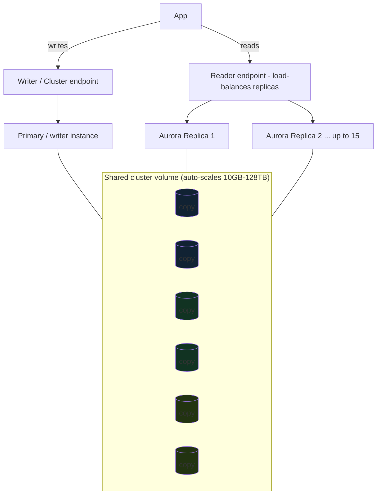

# 07 – RDS & Aurora

The managed relational database tier. **RDS** = AWS runs standard engines for you; **Aurora** = AWS's cloud-native re-architecture of MySQL/Postgres with separated compute/storage. Built hands-on in [[06-capstone]]; this is the exam depth.

> [!info] Exam TL;DR
> - **RDS engines:** MySQL, PostgreSQL, MariaDB, Oracle, SQL Server, + **Aurora**.
> - **Multi-AZ = HA/failover** (synchronous standby, NOT readable). **Read Replica = read scaling** (async, readable, cross-region-capable, manual promote). The #1 RDS trap.
> - **Backups:** automated (daily snapshot + ~5-min transaction logs → **PITR to any second**, 1–35 day retention, deleted with the instance) vs manual snapshots (survive deletion). Restore always creates a **new instance**.
> - **Aurora storage:** **6 copies across 3 AZs**, self-healing, shared **cluster volume** auto-scaling **10 GB → 128 TB**; compute/storage **separated**.
> - **Aurora replicas share the storage** (no copy) → **<10 ms** lag, auto-failover, up to **15** — **same cap as RDS**, so replica *count* is not the discriminator; **shared storage** is. Endpoints: **writer/cluster**, **reader** (LB'd reads), **custom**, **instance**.
> - **Aurora Serverless v2** = auto-scaling capacity for variable workloads. **Aurora Global Database** = 1 primary + up to 10 read-only regions, <1s replication (DR + global reads).
> - **Encryption at rest** = set at **creation only**. Keep DBs `publicly_accessible = false` in private subnets.
> - **Three ways to authenticate:** native DB password · **IAM database authentication** (`rds-db:connect`, 15-minute token, nothing stored) · **Secrets Manager** (stored password + automatic rotation). "No password in the app / use the EC2 role" → **IAM DB auth**.
> - **SQL Server → Aurora PostgreSQL with "minimal code changes" = TWO things:** **Babelfish** (T-SQL + SQL Server wire protocol on **port 1433**, Aurora PostgreSQL only) for the *application*, plus **SCT + DMS** for the *schema and data*. Neither alone is the answer.
> - **Enhanced Monitoring** reads from an **agent inside the DB instance** (CloudWatch reads the **hypervisor**), goes to **CloudWatch Logs** (`RDSOSMetrics`), and is the only one showing **per-process** data. `CPUUtilization`/`FreeableMemory`/`DatabaseConnections` are plain CloudWatch, not Enhanced Monitoring.

## What problem does this solve?

A relational database is not hard to install. It is hard to *keep alive*.

Somebody has to patch it. Somebody has to take backups, and — the part everyone forgets — prove the backups restore. Somebody has to be awake at 3am when the machine holding your only copy of the data dies. None of that work makes your product better. All of it has to happen anyway.

**RDS** is AWS taking that job. You still choose the engine — MySQL, PostgreSQL, MariaDB, Oracle, SQL Server — you still pick an instance size, and you still own your schema and your queries. AWS owns the patching, the backups, the failover and the provisioning underneath.

That solves the operations problem while leaving the *architecture* untouched. RDS is still, fundamentally, a database process writing to one volume. Everything you might want on top of that — a second copy for safety, a third copy to serve reads — means physically copying the data onto another volume: a full second instance to stay available, and a read copy that is kept in sync asynchronously and therefore runs slightly behind.

**Aurora** is AWS's answer to that. They kept MySQL and PostgreSQL compatibility, threw away the storage layer, and rebuilt it as a distributed, self-healing volume spread across Availability Zones and decoupled from the compute instances. That single change is where every Aurora feature comes from: storage that grows on its own, replicas that share the same data instead of copying it, fast failover, serverless capacity, and cross-region global databases. Plain RDS can't do those things — not because AWS withheld them, but because a single volume can't.

> In one line: RDS hands AWS the operational chores; Aurora hands them over too, and re-architects the storage underneath so the limits of a single volume stop applying.

## How it actually works

### Multi-AZ and read replicas are two different jobs

These are the two most confused features in RDS, and they are confused because both make a second copy of your database. They exist for opposite reasons.

**Multi-AZ** keeps a **synchronous** standby in another AZ. Synchronous means a write isn't finished until both copies have it. If the primary's AZ fails, AWS swaps the **DNS CNAME** to the standby — roughly **60–120 seconds** — and your app reconnects using the same endpoint name.

Now the part that catches people: **that standby is not readable.** You are paying for a full second instance that answers no queries. (True of a Multi-AZ **DB instance** deployment — the separate Multi-AZ **DB cluster** option runs two standbys that *do* serve reads.)

That feels wasteful, but it is the deal: the standby is kept synchronously identical so that failover loses nothing. Multi-AZ **doubles the cost and is not Free-Tier** — you are buying availability, and only availability.

**Read replicas** are the other tool. They replicate **asynchronously**, so a replica may be slightly behind — and in exchange it is **readable**. Point reporting queries at it and heavy analytics stop competing with production writes. Replicas can live in **another region**, and one can be **promoted** to a standalone database, which is a manual action that breaks replication for good.

| | Multi-AZ | Read replica |
|---|---|---|
| Why it exists | survive an AZ failure | take read load off the primary |
| Replication | synchronous | asynchronous |
| Can you query it | **no** | **yes** |
| Failover | automatic | manual promote |

They are not alternatives. A Multi-AZ primary *with* read replicas attached is a normal, correct design — one feature for staying up, the other for going fast.

> In one line: the standby is unreadable on purpose, because its job is to be identical rather than useful.

### Why Aurora's storage layer changes everything above it

Aurora stores your data as **6 copies across 3 AZs** — 2 per AZ — in one **cluster volume** that is self-healing and auto-scales to **128 TiB** without being asked (256 TiB on the newest engine versions). That volume is separate from the compute instances, and compute and storage bill and scale independently.

Six copies sounds like paranoia. It buys a specific property: the cluster can lose an entire AZ *plus one more copy* and still serve reads. Losing two of six copies would be an emergency on a normal system; here it is survivable by design.

But durability isn't the interesting consequence. This is: **the instances don't own the data.** The writer and every replica are attached to the same cluster volume and all read from it, instead of each keeping a copy of its own.

Follow what that removes:

- An RDS read replica needs data shipped to it, so it lags — seconds, sometimes. An **Aurora replica copies nothing**, because the data is already there. Typical lag is **well under 100 ms** — AWS's own figure.
- Adding a replica doesn't add a copy of your database, so you can run up to **15** of them. Note carefully: **RDS also allows 15**, so the *count* is not what separates them. What separates them is what a replica **is** — an RDS replica is a second copy being shipped data over the wire, an Aurora replica is another reader pointed at the volume that already exists.
- Failover isn't "wait for a spare to catch up." A replica is already current, so promotion is fast and **automatic**, ordered by **priority tiers**.

That last point deserves its own sentence, because it is what makes an Aurora replica different *in kind* from an RDS one: **an Aurora replica is read scaling and failover target at the same time.** On RDS you buy those separately — Multi-AZ for one, read replicas for the other. On Aurora one thing does both.

Because a cluster now has several instances doing different jobs, Aurora gives you four **endpoints** instead of one hostname: the **writer / cluster** endpoint, the **reader** endpoint (load-balances reads across replicas), **custom** endpoints, and **instance** endpoints for one specific instance.

Two more features fall out of the same separation. **Aurora Serverless v2** auto-scales capacity in ACUs, which is what you want when load is variable or unpredictable rather than steadily busy. **Aurora Global Database** runs one primary region plus up to **10 read-only secondary regions** with **sub-second** replication, for cross-region DR and local reads. Aurora MySQL also offers **Backtrack** — rewinding the database in place instead of restoring it.

The trade: Aurora is **MySQL/PostgreSQL-compatible only** and costs more per hour, in exchange for roughly **5× MySQL / 3× PostgreSQL** throughput and everything above.

> In one line: the instances share one 6-copy volume instead of each owning a copy, and every Aurora advantage is a consequence of that.

### Backups, restores, and the encryption rule with no undo

RDS gives you two kinds of backup. They differ twice over: in what they are made of, and in how long they live.

**Automated backups** switch on when you set a retention period of **1–35 days**. Underneath it is a daily snapshot *plus* transaction logs shipped roughly every **5 minutes**. Combine the two and you get **point-in-time recovery** — replay from the last snapshot forward to **any second** inside the window.

The catch is that automated backups belong to the instance. **Delete the instance and they go with it** — unless you tick **Retain automated backups** (they then live out the retention period) or take a final snapshot on the way out.

**Manual snapshots** are the other kind: a single snapshot you take yourself, and their lifetime is the opposite — they live until *you* delete them, and they survive the instance. So "keep this beyond the retention window" or "keep this after we tear the database down" always points at a manual snapshot.

Now the rule that surprises people: **restoring never restores in place.** A restore — from a snapshot or from a point in time — always produces a **new instance with a new endpoint**. There is no "put it back." Recovery is always a cutover, so plan for repointing the application.

Hold onto that shape, because the encryption rule is the same shape in a different hat.

**Encryption at rest is set at creation only.** You cannot switch it on for a running database. The fix is a three-step dance worth being able to recite:

1. Snapshot the unencrypted database.
2. **Copy** that snapshot, enabling encryption on the copy.
3. Restore from the encrypted copy — which, per the rule above, gives you a **new instance and a new endpoint**, so there is downtime and a cutover.

"We'll encrypt it later" is therefore not a small deferral; it is a scheduled migration. Decide encryption on day one. (Encryption *in transit* is a separate thing — that's SSL/TLS.)

> In one line: automated backups die with the instance, manual snapshots don't, every restore is a new endpoint, and encryption at rest is creation-time only.

### Logging in with an IAM role instead of a password

There are three ways to authenticate to the database, and they differ in *where the credential lives*.

| | Native DB password | IAM database authentication | Secrets Manager |
|---|---|---|---|
| Where the credential lives | in the DB **and** your app config | **nowhere** — minted on demand | encrypted in Secrets Manager |
| Lifetime | until someone rotates it by hand | **15 minutes** | until rotated (**automatic** rotation available) |
| Who may connect | database `GRANT`s only | IAM policy: `rds-db:connect` | IAM policy on `secretsmanager:GetSecretValue` |

The middle column is the one worth understanding, because it works in a way that looks like a hack and isn't.

You call `aws rds generate-db-auth-token`. It returns a long signed string. You hand that string to your database driver **as the password**. That's the whole trick — the credential travels in the field the driver already has. The feature is available on **MariaDB, MySQL and PostgreSQL** (and Aurora MySQL/PostgreSQL). Traffic is **always SSL/TLS**. The token is typically **~1 KB minimum**, so any tool that quietly truncates long passwords breaks in a confusing way.

Three details, each its own exam question:

**The 15 minutes is a connection-time limit, not a session limit.** The token authenticates the *establishment* of a session; once you are in, you stay in. That produces a memorably strange failure: fifteen minutes after deploy an app can't open **new** connections while every **existing** connection keeps working — because the connection pool minted one token at startup and cached it as "the password." Fix: generate the token inside the pool's connection factory, not once at boot.

**The prefix is `rds-db:`, not `rds:`.** `rds-db:connect` is the only action with that prefix and it exists solely for this feature. Everything named `rds:` — `rds:CreateDBInstance`, `rds:DescribeDBInstances` — is the *management* API and has nothing to do with logging in. Granting `rds:*` so an app can "connect to the database" is a wrong answer.

**The ARN uses the instance's resource id, not the name you gave it.** The shape is `arn:aws:rds-db:{region}:{account-id}:dbuser:{DbiResourceId}/{db-user-name}`, and `DbiResourceId` is the `db-ABC…` identifier AWS assigns — Region-unique, and it never changes. Aurora uses the cluster resource id; through RDS Proxy it starts `prx-`. The final segment is a **database** user that must already exist and be mapped to IAM — `AWSAuthenticationPlugin` on MySQL, `GRANT rds_iam TO <user>` on PostgreSQL.

Two boundaries on what the feature gives you. It is **authentication, not authorization**: IAM decides whether you may connect *as* a given database user, and what you can then do is still that user's `GRANT`s — so pairing it with an over-privileged DB user gains nothing. And **CloudTrail does not log it**; `generate-db-auth-token` is signed locally, so "use IAM DB auth to get an audit trail of database logins" is false. Budget for it too: AWS states the instance needs **300–1000 MiB of extra memory**, which matters on burstable `t`-class sizes.

> In one line: a 15-minute signed token used as the password, gated by `rds-db:connect` on the instance's resource id — nothing stored, nothing rotated, nothing in CloudTrail.

### RDS Proxy — the connection pool in front of the database

A managed, fully-serverless **connection pool** that sits between the application and RDS or
Aurora. It exists because databases are bad at absorbing large numbers of short-lived
connections, and **Lambda** produces exactly that — every concurrent execution opening its own
connection, exhausting `max_connections` under a spike.

Three things it buys, and each is a separate exam angle:

- **Pooling and reuse** — many application connections multiplexed onto few database ones.
  The Lambda-at-scale answer.
- **Faster failover** — the proxy holds the client connection open and repoints it, cutting
  failover time versus every client rediscovering the endpoint through DNS.
- **No credentials in the application** — it integrates with **Secrets Manager** and **IAM
  authentication**, so the function authenticates to the proxy rather than holding a password.

It runs **inside your VPC** and is not publicly reachable.

> In one line: RDS Proxy pools connections so Lambda cannot exhaust the database, and shortens
> failover while keeping credentials in Secrets Manager.

### Babelfish — keeping T-SQL applications after moving to Aurora PostgreSQL

The expensive part of leaving SQL Server is rarely the data. It is the thousands of lines of
**T-SQL** the application is built on — stored-procedure calls, `TOP` instead of `LIMIT`,
`GETDATE()`, square-bracket identifiers — plus the SQL Server driver it uses to talk to the
database. Rewriting that is what turns a migration into a year-long project.

**Babelfish for Aurora PostgreSQL** removes that cost. It gives an Aurora PostgreSQL cluster an
**additional endpoint** that speaks the SQL Server **wire protocol** — Tabular Data Stream
(TDS), versions **7.1 through 7.4** — and understands commonly used T-SQL. The application keeps
its existing SQL Server driver and its existing queries, and connects on **port 1433** as though
Aurora were SQL Server. The PostgreSQL dialect stays available on **5432** at the same time, so
new code can be written natively against the same data.

What Babelfish does **not** do is move anything. It is a compatibility layer at the connection
level only: the schema still has to be converted and the data still has to be copied. That is
the **AWS SCT + DMS** job in [[24-other-services#AWS DMS — the migration answer, and the biggest gap here|AWS DMS]].
The two are complementary halves of one migration, not alternatives to each other — which is
exactly the shape the exam tests.

Babelfish is **Aurora PostgreSQL only**. There is no Babelfish for RDS for PostgreSQL, and none
for Aurora MySQL.

> In one line: Babelfish lets the *application* keep speaking T-SQL to Aurora PostgreSQL on port
> 1433; it moves no data, so SCT converts the schema and DMS copies the rows.

### Enhanced Monitoring — OS metrics from an agent, not the hypervisor

Ordinary CloudWatch metrics for a DB instance are gathered **from the hypervisor**, outside the
guest. That is enough to tell you CPU is at 90%, and useless for telling you *which process* is
burning it — because from outside the VM there are no processes to see.

**Enhanced Monitoring** fixes that by collecting from an **agent running on the DB instance
itself**, in real time. Because it measures from inside while CloudWatch measures from outside,
the two can legitimately disagree on the same instance; AWS notes the gap is wider on **smaller
instance classes**, where more VMs share one physical host.

Two consequences that get tested:

- Enhanced Monitoring metrics are delivered to **CloudWatch Logs**, not CloudWatch Metrics — log
  group **`RDSOSMetrics`**, default retention **30 days**. To alarm on one you build a **metric
  filter** over the log group first. Billing follows CloudWatch Logs rates, not metrics rates.
- The console's **OS process list** breaks into exactly **three** groups: **RDS child
  processes** (the engine itself — `mysqld`, `aurora`), **RDS processes** (the RDS management
  agent and diagnostics), and **OS processes** (kernel and system).

Available on **Db2, MariaDB, Microsoft SQL Server, MySQL, Oracle and PostgreSQL**.

> In one line: Enhanced Monitoring is the per-process, OS-level view collected by an agent inside
> the DB instance and written to CloudWatch Logs, not the hypervisor metrics you already had.

### Storage, cloning and the cost of standing still

Three facts here decide questions that look like they are about something else.

**RDS grows its own storage.** Plain RDS — not just Aurora — has **storage autoscaling**: you set
a **maximum storage threshold** and RDS raises allocated storage on its own. It fires when free
space is **≤ 10% of allocated**, the condition has lasted **at least 5 minutes**, and fewer than
**4 storage modifications** have happened in the past 24 hours; each step adds the greater of
**10 GiB or 10% of current allocated storage**. So "the database is about to run out of space and
we want no downtime and no babysitting" is **one setting**, not a migration to Aurora. (Not
supported for additional storage volumes.)

**Aurora cloning is nearly free and nearly instant.** A clone is a *new cluster* that shares the
source's storage volume under a **copy-on-write** protocol: *"This mechanism uses minimal
additional space to create an initial clone… Additional storage is allocated only when changes
are made."* A full-size staging copy of production appears in minutes at almost no storage cost,
fully isolated from the source. You get **up to 15 copy-on-write clones**; the 16th is a **full
copy**. Contrast the neighbours: a **snapshot restore** physically copies every byte, and
**Backtrack** rewinds the *source* in place rather than giving you a second cluster.

**A stopped RDS instance is not a free one.** Stopping saves **DB instance hours** and nothing
else: you keep paying for **provisioned storage** (including Provisioned IOPS), **backup
storage** — manual snapshots and automated backups inside the retention window — and a **public
IPv4 address** if the instance is publicly accessible. And RDS **starts it again automatically
after 7 consecutive days**, so stopping is not a way to park a database. For a workload that runs
a few days a month, the cheaper shape is **snapshot → delete the instance → restore** when next
needed.

> In one line: RDS can grow its own storage, Aurora can clone a cluster in minutes for almost
> nothing, and a stopped instance still bills storage and restarts itself after 7 days.

### Replication traffic: what you actually pay for

The general data-transfer rule — outbound costs money, **cross-AZ is charged** — has an exception
the exam uses. AWS: *"You aren't charged for the data transfer incurred in replicating data
between the source DB instance and a read replica **within the same AWS Region**."* Same Region
**includes across Availability Zones**. You are billed for inter-Region transfer only when the
replica sits in a **different Region**.

So for "offload reporting queries at the lowest cost", a **same-Region** read replica replicates
free; a cross-Region one is the expensive answer, right only when the requirement is disaster
recovery or readers in another geography.

> [!warning] Trap — applying the cross-AZ charge to replication
> "Cross-AZ traffic is charged" is true in general and **false for read-replica replication in
> the same Region**. A stem offering a **same-AZ** replica "to avoid data-transfer charges" sells
> you worse availability for a saving that does not exist — a same-Region replica in *another* AZ
> replicates free *and* survives an AZ failure. See [[13-cost-optimization]] for the general rule
> this is the exception to.

### Four different things called "securing the database"

Three sure-wrong answers in one mock came from picking the wrong *layer*. A database question
that says "secure" or "protect" is asking about exactly one of these four, and they are not
interchangeable:

| Layer | The question it answers | The control |
|---|---|---|
| **Network reachability** | *can this host even open a socket?* | **security group** on the DB (source = the app's SG) |
| **AWS API permissions** | *may this principal call the RDS **API** — describe, snapshot, modify?* | **IAM role/policy** (`rds:*`) |
| **Database login** | *may this principal log in as a database user?* | **IAM database authentication** (`rds-db:connect`) — or a password in **Secrets Manager** |
| **Data on the wire** | *is the connection encrypted in flight?* | **SSL/TLS**, forced with the **`rds.force_ssl`** parameter |

The traps are all substitutions between adjacent rows:

- **A security group is not authentication.** Restricting the DB's SG to the application's SG
  is good practice and answers *reachability* — it does nothing about *who logs in*. A stem
  asking to avoid storing database credentials wants **IAM database authentication**.
- **An IAM role on the instance is not database access.** Attaching a role lets the code call
  AWS APIs. Logging in to the engine still needs a database credential, unless IAM DB auth is
  enabled — and then you need **both**: the role *and* the feature.
- **TDE is at rest, `rds.force_ssl` is in flight.** "All in-flight data must be encrypted"
  is the SSL parameter plus the **RDS root CA** on the client; TDE encrypts stored data and
  answers a different question.

> In one line: reachability is the security group, API permission is the IAM policy, logging
> in is IAM DB authentication, and encrypting the wire is `rds.force_ssl` — four layers, and
> questions swap them deliberately.

## Architecture diagram


```mermaid
flowchart TB
    App[App] -->|writes| WEP[Writer / Cluster endpoint]
    App -->|reads| REP[Reader endpoint - load-balances replicas]
    WEP --> PRI[Primary / writer instance]
    REP --> R1[Aurora Replica 1]
    REP --> R2[Aurora Replica 2 ... up to 15]
    subgraph VOL["Shared cluster volume (auto-scales 10GB-128TB)"]
      direction LR
      C1[(copy)]:::az1
      C2[(copy)]:::az1
      C3[(copy)]:::az2
      C4[(copy)]:::az2
      C5[(copy)]:::az3
      C6[(copy)]:::az3
    end
    PRI --- VOL
    R1 --- VOL
    R2 --- VOL
    classDef az1 fill:#123
    classDef az2 fill:#132
    classDef az3 fill:#231
```
*6 copies across 3 AZs; all instances read the same volume (why replica lag is tiny).*

## Key facts, limits & pricing

- **An engine-version upgrade requires downtime, and Multi-AZ does not save you from it.** AWS: *"Database engine upgrades require downtime… You can minimize the downtime required for DB instance upgrade by using a **blue/green deployment**."* Multi-AZ protects against *failure*, not against a planned engine upgrade — both primary and standby move. "Upgrade the engine with minimal downtime" → **blue/green deployment**, not Multi-AZ.
- **Aurora MySQL can call Lambda from inside the database** with the native functions **`lambda_sync`** and **`lambda_async`** (the older **stored-procedure** route is **deprecated** and absent from Aurora MySQL v3). The cluster needs IAM access to Lambda first. So "have the database itself push an event when a row changes" is possible without an application tier — a genuine answer, not a distractor.
- **An encrypted read replica cannot come from an unencrypted source.** Encryption is a creation-time property and the replica inherits the source's state, so the path is **snapshot → copy the snapshot with encryption → restore → then create replicas**. ⚠️ verify: the exact inheritance wording (AWS removed the dedicated page).
- **Why RDS over DynamoDB/ElastiCache/S3:** the deciding words are **ACID transactions** and **strongly consistent reads after an overwrite or delete**. A relational engine guarantees both; a stem stressing joins, transactions or read-after-write consistency on mutable rows is a relational answer.
- **Keep large binary objects out of the row.** Blobs inside a relational table inflate storage, backups and restore time and hurt query performance; the pattern is **the object in S3, a pointer plus metadata in the database**. *(Verified 2026-10-01.)*

- **Aurora failover priority tiers run 0–15, and 0 is the *highest* priority** — *"Priorities range from 0 for the highest priority to 15 for the lowest priority"*, and RDS promotes the replica with the highest priority. Ties: *"If two or more Aurora Replicas share the same priority, then Amazon RDS promotes the replica that is **largest in size**"*, and if size ties too, an arbitrary one in that tier. Changing a priority does **not** trigger a failover. And **after five unsuccessful failover attempts, promotion tiers are no longer considered**.
- **RDS can replicate automated backups cross-Region:** *"you can configure your Amazon RDS database instance to replicate snapshots and transaction logs to a destination AWS Region of your choice"*, copied as soon as they are ready — which gives **cross-Region point-in-time restore**. Plain automated backups are single-Region, so Multi-AZ alone is **not** a DR story. *(Verified 2026-10-01.)*
- ⚠️ verify: that a read replica **inherits** the source's encryption state (an encrypted source cannot have an unencrypted replica, and vice versa). The dedicated AWS page for this has been removed; the rule is widely stated but I could not confirm it first-party.

- **RDS storage autoscaling** (plain RDS, not just Aurora): set a **maximum storage threshold** and RDS grows allocated storage automatically. Triggers at **≤10% free**, sustained **5 minutes**, **<4 modifications in 24h**; each step is the greater of **10 GiB or 10%**. Not supported for additional storage volumes.
- **Aurora cloning:** a new cluster sharing the source volume **copy-on-write** — ready in minutes, minimal extra storage, isolated from the source. **Up to 15** clones; the 16th is a **full copy**. Not a snapshot restore (copies bytes) and not Backtrack (rewinds the source).
- **Stopped RDS still bills** provisioned storage (incl. PIOPS), backup storage, and a public IPv4 if publicly accessible — only **instance hours** stop. RDS **auto-starts it after 7 consecutive days**. Long parking = snapshot + delete + restore.
- **Read-replica replication is free within the same Region**, across AZs included; **cross-Region** replication is billed as inter-Region data transfer.
- **Multi-AZ operational benefits**, in AWS's wording: the synchronous standby exists to *"provide data redundancy and minimize latency spikes during system backups"*, and Multi-AZ *"can enhance availability during planned system maintenance"*. ⚠️ verify: the stronger claim that backups are taken *from* the standby — AWS does not state that on the automated-backups page.
- **Amazon DocumentDB** is MongoDB-compatible: *"you can run the same application code and use the same drivers and tools that you use with MongoDB"* — so a MongoDB app moves with **no code change**, unlike DynamoDB, whose API forces a rewrite.
*Verified against AWS docs 2026-10-01.*

- **RDS Multi-AZ:** a **synchronous** standby in another AZ; **not readable**; automatic failover (~60–120s) via DNS CNAME swap. For HA only. Doubles cost; not Free-Tier.
- **RDS Read Replicas:** **asynchronous**; **up to 15 per source** — the same cap as Aurora. **readable**; can be **cross-region**; can be **promoted** to a standalone DB (manual, breaks replication). For read scaling / reporting. (You can combine: a Multi-AZ primary *with* read replicas.)
- **Backups:** automated backups enabled by setting retention 1–35 days → **point-in-time recovery** (daily snapshot + transaction logs every ~5 min). Deleted when the instance is deleted (unless you take a final snapshot). **Manual snapshots** are kept until you delete them and survive instance deletion. **Restore = new instance / new endpoint.**
- **Encryption at rest** (`storage_encrypted`, KMS): **only at creation**. To encrypt an existing unencrypted DB: snapshot → copy the snapshot **with encryption** → restore. Encryption in transit = SSL/TLS.
- **Aurora storage:** **6-way replication across 3 AZs** (2 copies/AZ); tolerates losing a whole AZ + one more copy for reads; self-healing; **cluster volume auto-scales 10 GB → 128 TB**. Compute and storage bill/scale independently.
- **Aurora Replicas:** up to **15**, share the cluster volume (**<10 ms** typical lag), **automatic failover** with priority tiers (much faster than RDS Multi-AZ). Aurora also keeps 6 storage copies regardless of instance count.
- **Aurora extras:** **Backtrack** (rewind the DB in place without restore, Aurora MySQL); **Aurora Serverless v2** (fine-grained auto-scaling ACUs for variable load); **Aurora Global Database** (1 primary + up to **10 secondary read-only regions**, **<1s** replication, cross-region DR); **Aurora Machine Learning**, **RDS Proxy** (connection pooling for Lambda/serverless).
- **Why Aurora over RDS MySQL/Postgres:** ~**5× MySQL / 3× Postgres** throughput, replicas that **share one volume instead of copying data**, faster failover, 6-copy durability, auto-scaling storage, serverless + global options. Trade-off: pricier per-hour, MySQL/Postgres-compatible only.
- **RDS Free Tier (legacy, accounts activated before 2025-07-15):** `db.t2/t3/t4g.micro`, single-AZ, 750 hrs/mo, 20 GB, 12 months. Newer accounts get the **Free Plan** instead — `db.t3/t4g.micro` plus sign-up credits, with guardrails (see the backup-retention gotcha below).
- **IAM database authentication** works on **MariaDB, MySQL, PostgreSQL** (and Aurora MySQL/PostgreSQL). You call `aws rds generate-db-auth-token` and pass the returned string **as the password**. Each token lives **15 minutes**; traffic is **always SSL/TLS**. The token is typically **~1 KB minimum** — drivers/tools that truncate long passwords will break it.
- **IAM DB auth costs memory on the instance:** AWS states you need **300–1000 MiB of extra memory** for reliable connectivity — a real consideration on burstable `t`-class instances.
- **CloudTrail does not log IAM DB authentication.** `generate-db-auth-token` is signed locally and is not tracked. Do not answer "use IAM DB auth to get an audit trail of database logins."
- **Some global condition keys don't work** with IAM DB auth: `aws:SourceIp`, `aws:SourceVpc`, `aws:SourceVpce`, `aws:UserAgent`, `aws:Referer`, `aws:VpcSourceIp`.
- **PostgreSQL specifics:** granting the `rds_iam` role to a user makes IAM auth **take precedence over password auth** for that user; IAM auth can't be combined with Kerberos, and can't be used for a replication connection.

- **Babelfish for Aurora PostgreSQL:** an **additional endpoint** understanding the SQL Server **TDS** wire protocol (**versions 7.1–7.4**) and T-SQL. **T-SQL on port 1433, PostgreSQL on 5432**, both live at once. **Aurora PostgreSQL only** — not RDS for PostgreSQL, not Aurora MySQL. It migrates **nothing**: schema conversion is **AWS SCT / DMS Schema Conversion**, data movement is **DMS**.
- **Enhanced Monitoring:** real-time **OS** metrics from an **agent on the DB instance** (CloudWatch reads the **hypervisor** instead, so the two can disagree — more so on small instance classes). Delivered to **CloudWatch Logs**, log group **`RDSOSMetrics`**, default retention **30 days**; charged at **Logs** rates, and only above the CloudWatch Logs free allowance. Process list has **three** groups: **RDS child processes**, **RDS processes**, **OS processes**. Engines: **Db2, MariaDB, SQL Server, MySQL, Oracle, PostgreSQL**.
*Verified against AWS docs 2026-09-29.*

## Comparisons

### Multi-AZ vs Read Replica (memorize)

|   | Multi-AZ | Read Replica |
|---|---|---|
| Purpose | HA / failover | Read scaling |
| Sync | Synchronous | Asynchronous |
| Readable | **No** | **Yes** |
| Region | Same region (other AZ) | Same or **cross-region** |
| Failover | Automatic | Manual promote |
| Trigger words | "survive AZ failure", "HA" | "offload reads", "reporting", "scale reads" |

### RDS vs Aurora

|   | RDS (MySQL/Postgres) | Aurora |
|---|---|---|
| Storage | Single EBS volume (+ standby copy) | Distributed 6-copy/3-AZ cluster volume |
| Storage scaling | Manual/auto up to limit | Auto 10 GB–128 TB |
| Read replicas | Up to 15, each a **separate copy** fed by replication (lag) | Up to 15, **share one cluster volume** (<10 ms) |
| Failover | ~1–2 min (Multi-AZ) | Faster (shared storage) |
| Serverless | RDS has no true serverless | Aurora Serverless v2 |
| Global | Cross-region read replica | Aurora Global Database (<1s) |
| Cost | Lower | Higher, more performance |

### The three RDS monitoring layers (the one the exam confuses)

| | CloudWatch metrics | Enhanced Monitoring | Performance Insights |
|---|---|---|---|
| Measured from | the **hypervisor**, outside the guest | an **agent on the DB instance** | the engine's own wait events |
| Answers | "is the instance busy?" | "**which process** is busy?" | "**which query** is slow, and waiting on what?" |
| Granularity | 1 min (60s) standard | sub-minute, configurable | continuous |
| Stored in | CloudWatch **Metrics** | CloudWatch **Logs** (`RDSOSMetrics`, 30 days) | its own dashboard + API |
| Alarm on it directly? | **Yes** | **No** — metric filter over the log group first | No |
| Example signal | `CPUUtilization`, `FreeableMemory`, `DatabaseConnections` | RDS child processes / RDS processes / OS processes | **DB load** by waits, SQL, hosts, users |
| Stem trigger | "alert when CPU is high" | "see how **processes or threads** use the CPU" | "find the **query** causing the load" |

⚠️ Naming currency: the **Performance Insights** dashboard is now presented as **Amazon
CloudWatch Database Insights**; the API and the RDS setting are still called Performance
Insights, and the exam still uses the old name. Verified 2026-09-29.

### Database authentication — password vs IAM vs Secrets Manager

|   | Native DB password | **IAM database authentication** | Secrets Manager |
|---|---|---|---|
| Where the credential lives | in the DB **and** your app config | **nowhere** — minted on demand | encrypted in Secrets Manager |
| How the app authenticates | username + password | `generate-db-auth-token` → use the token **as the password** | fetch the secret, then use the password |
| Credential lifetime | until someone rotates it by hand | **15 minutes** | until rotated (**automatic** rotation available) |
| Who is allowed to connect | database `GRANT`s only | IAM policy: `rds-db:connect` on a `dbuser` ARN | IAM policy on `secretsmanager:GetSecretValue` |
| Transport | TLS optional | **always SSL/TLS** | TLS optional |
| Best for | legacy / simple setups | **EC2, Lambda, ECS with a role — no secret to leak or rotate** | apps or third-party tools that need a *real* password |

The IAM policy — note the `rds-db:` prefix, which is **not** the `rds:` prefix used by the RDS management API:

```json
{
  "Effect": "Allow",
  "Action": ["rds-db:connect"],
  "Resource": ["arn:aws:rds-db:us-east-1:111122223333:dbuser:db-ABCDEFGHIJKL01234/db_user"]
}
```

ARN shape: `arn:aws:rds-db:{region}:{account-id}:dbuser:{DbiResourceId}/{db-user-name}`

- `DbiResourceId` is the instance's **resource id** (`db-ABC…`), **not** the DB identifier you named it. It's Region-unique and never changes. Aurora uses the `DbClusterResourceId`; through RDS Proxy it's `prx-…`.
- The last segment is the **database** user, which must already exist and be mapped to IAM — `AWSAuthenticationPlugin` on MySQL, `GRANT rds_iam TO <user>` on PostgreSQL.
- Wildcards work: `dbuser:*/jane_doe` means that DB user on any instance in the account + Region.

## Worked examples

> [!example] Worked example — an EC2 app that connects to RDS with no password anywhere
> The app runs on EC2 behind an ASG and must reach a private PostgreSQL instance. Instead of a password in a config file, enable `iam_database_authentication_enabled` on the instance, create the DB user and `GRANT rds_iam TO appuser`, and attach a policy allowing `rds-db:connect` on `arn:aws:rds-db:us-east-1:…:dbuser:db-ABC…/appuser` to the **instance profile role** the ASG's launch template already assigns (see [[02-ec2]], [[01-iam]]). At connect time the SDK calls `generate-db-auth-token`, signs it with the role's temporary credentials from IMDSv2, and hands the token to the driver as the password over TLS. Nothing is stored, nothing is rotated, and revoking access is a one-line IAM change — no database restart, no redeploy. This is the canonical exam answer to "remove hard-coded database credentials without managing a secret."

> [!example] Worked example — read-heavy app with a reporting team
> An app's primary DB is fine for writes, but a BI/reporting team runs heavy analytical queries that slow production. Solution: add **read replicas** and point the reporting tools at them (or Aurora's **reader endpoint**), isolating analytics from the write path. If they *also* need to survive an AZ outage, that's a **separate** feature — **Multi-AZ** — layered on the primary. The exam tests whether you know these are two different tools: replicas = scale reads, Multi-AZ = availability.

> [!failure] Failure mode — "we'll encrypt the database later"
> A team launches RDS unencrypted to move fast, planning to enable `storage_encrypted` later. There is no "encrypt in place" — encryption is **creation-time only**. Fixing it means: snapshot the DB → **copy the snapshot with encryption enabled** → restore from the encrypted copy → repoint the app (downtime/cutover). Design encryption in from day one. Same gotcha bit the [[06-capstone]] build's mental model.

> [!example] Worked example — spiky dev/test database → Aurora Serverless v2
> A team runs dozens of dev/test databases that are idle most of the day and busy in bursts. Provisioned instances waste money sitting idle; right-sizing each by hand is toil. **Aurora Serverless v2** auto-scales each cluster's capacity (ACUs) up during bursts and down to a floor when idle, in-place, per-second billing — you pay for actual usage. Trigger phrase: "unpredictable / intermittent / variable workload, minimize cost" → Aurora Serverless.

> [!tip] Real gotcha — AWS Free Plan caps backup retention
> On the new AWS **Free Tier "Free Plan"**, `backup_retention_period = 7` failed with `FreeTierRestrictionError`; had to drop to `1`. The current free tier has service guardrails (backup retention, sometimes instance types) the old 12-month one didn't — dial settings down rather than upgrading the plan.

> [!failure] Failure mode — the connection pool that dies 15 minutes after deploy
> A team enables IAM DB auth and their app works perfectly in testing. Fifteen minutes after each deploy, new database connections start failing with an authentication error while **existing connections keep working fine** — which makes it look like a random, partial outage. The cause: the connection pool minted **one** token at startup and cached it as "the password." AWS is explicit that the token is used only to *establish* the session and has a **15-minute lifetime** — an open session is unaffected, but every new connection needs a **fresh** token. Fix: generate the token inside the pool's connection factory, not once at boot. (Related: if you mint the token with temporary role credentials, those credentials must still be valid at connect time.)

> [!warning] Trap — Babelfish offered *instead of* SCT + DMS
> A stem says "migrate SQL Server to **Aurora PostgreSQL** with **minimal application code
> changes**" and lists Babelfish and "SCT + DMS" as separate options. **Both are correct** — and
> this is almost always a **Select TWO**, which is why picking one feels right and scores zero.
> Babelfish handles the *application's* T-SQL and driver; **SCT converts the schema and DMS moves
> the data**. Babelfish alone leaves you an empty database; SCT + DMS alone leaves you rewriting
> every query. Eliminate: **Glue** "converting T-SQL" (Glue is ETL — it does not translate
> application SQL), a **custom endpoint** "emulating SQL Server" (custom endpoints route
> connections to a subset of instances; they do not change protocol), **Aurora Global Database**
> (cross-Region replication, nothing to do with engine compatibility), and **Kinesis** for
> "real-time replication" (DMS does CDC, not Kinesis).

> [!warning] Trap — Enhanced Monitoring metrics confused with standard CloudWatch metrics
> Asked which metrics **Enhanced Monitoring** provides, the plausible-looking wrong answers are
> **CPU Utilization**, **Database Connections** and **Freeable Memory** — because they are real
> RDS metrics you have seen a hundred times. They are **standard CloudWatch** metrics, gathered
> from the hypervisor, and available with Enhanced Monitoring switched off. Enhanced Monitoring
> is the **OS-level, per-process** view: the process-list groups above, plus fine-grained CPU,
> memory, disk and network counters. Rule of thumb: if the metric names a **process or thread**,
> it is Enhanced Monitoring; if it names the **instance as a whole**, it is CloudWatch.

> [!warning] Trap — an IAM role on the app is not, by itself, database authentication
> The distractors are **"attach an IAM role to the EC2 instance / Lambda function"** and **"restrict
> the security group to the app tier"**, offered *on their own*. A role is an **identity** control and
> a security group is a **network** control; neither authenticates anyone to a database. The role is
> genuinely needed — it is what carries the `rds-db:connect` policy — but it does nothing until the
> feature itself is switched on, and **the feature is off by default**. So the answer that earns the
> mark **names the feature**: *enable IAM database authentication*. The three parts it then requires
> are in the authentication comparison table above.

> [!warning] Trap — "IAM database authentication controls what the user can do in the database"
> It does not. IAM decides **whether you may connect as a given database user**; everything after that is still the database's own `GRANT`s. AWS says it plainly: a role that connects as `jane_doe` gets exactly the tables and schemas `jane_doe` has. So IAM DB auth is **authentication**, not in-database **authorization** — pairing it with an over-privileged DB user gains you nothing.

> [!warning] Trap — `rds-db:` vs `rds:`
> `rds-db:connect` is the **only** action with the `rds-db:` prefix and it exists solely for IAM DB auth. Everything else (`rds:CreateDBInstance`, `rds:DescribeDBInstances`…) is the `rds:` management API and has nothing to do with logging into the database. An answer that grants `rds:*` to let an app "connect to the database" is wrong.

> [!warning] Trap — "use IAM DB auth so database logins show up in CloudTrail"
> They don't. AWS documents that CloudTrail and CloudWatch **do not log** `generate-db-auth-token`. For database-level audit you need the engine's own audit plugin / `pgaudit` and Database Activity Streams — not CloudTrail.

> [!warning] Trap — Multi-AZ to scale reads
> Multi-AZ standby is **not readable** — it's for failover. Use **read replicas** to scale reads. Reversed constantly on the exam.

> [!warning] Trap — assuming an Aurora failover always promotes a replica
> Aurora fails over *"in one of two ways: by promoting an existing reader DB instance to the new
> primary instance"* **or** *"by creating a new primary instance"*. The fast CNAME flip everyone
> quotes is the **first** case, and it needs a reader to exist. A single-instance Aurora cluster
> with **no reader** has nothing to promote, so Aurora must **create a new primary** — far
> slower. AWS's recommendation follows directly: *"create at least one or more reader instances
> in two or more different Availability Zones."* A stem describing a one-instance Aurora cluster
> and asking why failover was slow is asking for a **reader**, not for Multi-AZ — which is not
> how Aurora is configured.

> [!warning] Trap — Aurora replica lag is like RDS replica lag
> No — Aurora replicas **share one storage volume** (no data copy), so lag is ~milliseconds; RDS read replicas copy data asynchronously and can lag seconds. Different mechanism.

> [!warning] Trap — "RDS is serverless / auto-scales like Aurora"
> Plain RDS is provisioned instances, and **true serverless** plus **global <1s replication** are Aurora features — "serverless relational" → Aurora Serverless v2. But do **not** extend that to storage: **plain RDS has storage autoscaling too** (see Key facts). The Aurora difference is that its *cluster volume* grows with no setting at all, whereas RDS grows an allocated volume up to a threshold you set.

## 🔴 My weak spots (this topic)   #weak-spot

- [ ] **Aurora storage architecture** (6 copies/3 AZs, shared volume, compute/storage separation) — knew replicas differ but not the why.
- [ ] **Aurora endpoints** (writer/cluster vs reader vs custom vs instance).
- [ ] **Aurora Serverless v2** (variable-workload auto-scaling) and **Global Database** (<1s cross-region).
- [ ] **PITR mechanics** — daily snapshot + ~5-min transaction logs = restore to any second; restore = new instance.
- [ ] **Encryption at creation only** — no in-place encryption.
- [ ] **IAM database authentication — missed twice, both marked _sure_** (mock 2026-08-28, trainer-sourced). Discriminators that beat me: "short-lived IAM database credentials instead of passwords" and "token-based DB auth tied to an instance profile." The concept was **absent from this note entirely** until 2026-08-29 — see the new authentication comparison above.
- [ ] **Aurora Replicas double as failover targets** — missed while marked _sure_ (mock 2026-08-28, trainer-sourced). An Aurora Replica is not read-scaling *or* HA; it is **both at once**, which is exactly what makes it different from an RDS read replica.

## 🔗 Docs
- [Upgrading a DB engine version (requires downtime; blue/green minimises it)](https://docs.aws.amazon.com/AmazonRDS/latest/UserGuide/USER_UpgradeDBInstance.Upgrading.html) · [Invoking Lambda from Aurora MySQL](https://docs.aws.amazon.com/AmazonRDS/latest/AuroraUserGuide/AuroraMySQL.Integrating.Lambda.html)
- [Aurora high availability and failover priority tiers](https://docs.aws.amazon.com/AmazonRDS/latest/AuroraUserGuide/Concepts.AuroraHighAvailability.html) · [Replicating automated backups to another Region](https://docs.aws.amazon.com/AmazonRDS/latest/UserGuide/USER_ReplicateBackups.html)
- [RDS storage autoscaling](https://docs.aws.amazon.com/AmazonRDS/latest/UserGuide/USER_PIOPS.Autoscaling.html) · [Aurora cloning (copy-on-write)](https://docs.aws.amazon.com/AmazonRDS/latest/AuroraUserGuide/Aurora.Managing.Clone.html) · [Stopping a DB instance (7-day restart, what still bills)](https://docs.aws.amazon.com/AmazonRDS/latest/UserGuide/USER_StopInstance.html) · [Read replicas (same-Region replication is free)](https://docs.aws.amazon.com/AmazonRDS/latest/UserGuide/USER_ReadRepl.html) · [Failing over an Aurora cluster](https://docs.aws.amazon.com/AmazonRDS/latest/AuroraUserGuide/aurora-failover.html) · [Amazon DocumentDB](https://docs.aws.amazon.com/documentdb/latest/developerguide/what-is.html)
- [Using Babelfish for Aurora PostgreSQL](https://docs.aws.amazon.com/AmazonRDS/latest/AuroraUserGuide/babelfish.html)
- [Monitoring OS metrics with Enhanced Monitoring](https://docs.aws.amazon.com/AmazonRDS/latest/UserGuide/USER_Monitoring.OS.html)
- [Viewing OS metrics in the RDS console (process list groups)](https://docs.aws.amazon.com/AmazonRDS/latest/UserGuide/USER_Monitoring.OS.Viewing.html)

- [Aurora DB clusters](https://docs.aws.amazon.com/AmazonRDS/latest/AuroraUserGuide/Aurora.Overview.html) — verified 2026-07
- [RDS Multi-AZ](https://docs.aws.amazon.com/AmazonRDS/latest/UserGuide/Concepts.MultiAZ.html) / [Read Replicas](https://docs.aws.amazon.com/AmazonRDS/latest/UserGuide/USER_ReadRepl.html)
- [RDS backups & PITR](https://docs.aws.amazon.com/AmazonRDS/latest/UserGuide/USER_WorkingWithAutomatedBackups.html)
- [Aurora Serverless v2](https://docs.aws.amazon.com/AmazonRDS/latest/AuroraUserGuide/aurora-serverless-v2.html) / [Global Database](https://docs.aws.amazon.com/AmazonRDS/latest/AuroraUserGuide/aurora-global-database.html)
- [IAM database authentication](https://docs.aws.amazon.com/AmazonRDS/latest/UserGuide/UsingWithRDS.IAMDBAuth.html) — engines, 15-min token lifetime, SSL/TLS, 300–1000 MiB memory, CloudTrail non-logging, unsupported condition keys; verified 2026-08-29
- [IAM policy for IAM database access](https://docs.aws.amazon.com/AmazonRDS/latest/UserGuide/UsingWithRDS.IAMDBAuth.IAMPolicy.html) — `rds-db:connect`, the `dbuser` ARN format, DbiResourceId; verified 2026-08-29
