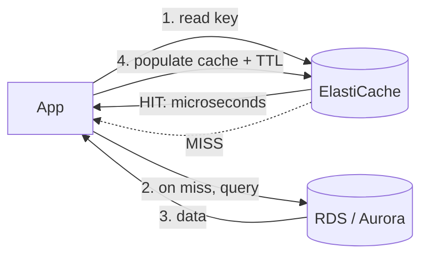

# 08 – ElastiCache (Redis / Memcached)

Managed in-memory caching in front of a database — or used as a datastore in its own right. This note is about why a cache exists at all, how the hit/miss loop actually behaves, and how to tell the two engines apart under exam pressure. Part of the data tier with [[07-rds-aurora]].

## What problem does this solve?

A database read costs something. It hits disk, it runs a query, it comes back in milliseconds.

Now run that exact same query millions of times. "Get product by id 4471." The answer barely changes from second to second, but the database re-computes it every single time. The DB's CPU gets pegged and latency climbs — not because the work is hard, but because it is the *same* work, repeated.

The fix is to remember the answer. Keep it in RAM, keyed by the thing you asked for. The app checks that memory first and only bothers the database when the answer isn't there.

Answering out of RAM instead of going back to disk and re-running the query is what turns those **milliseconds into microseconds**. And every read served from memory is a read the database never sees — so the load on it drops, not just the latency.

ElastiCache is AWS running that in-memory store for you. You choose an engine — **Redis** (feature-rich, highly available) or **Memcached** (simple, multi-threaded) — and AWS handles the nodes, the replication and the failover. It lives in your VPC, in private subnets behind a security group, exactly like RDS does.

> In one line: a cache stores answers in RAM so the database stops re-answering the same question.

## How it actually works

### The hit, the miss, and why the cache starts empty

The loop has only two outcomes.

The app asks the cache for a key. **Hit** — the value is there, it comes back in microseconds, the database is never touched. **Miss** — nothing is there, so the app queries RDS or Aurora itself, gets the answer, and *then* writes it into the cache with a TTL before returning it.

That is **lazy loading**, also called **cache-aside**, and the name tells you the important part: the cache does not fill itself in advance. It only ever fills as a side effect of somebody missing.

Which has three consequences worth holding onto:

| Consequence | Why |
|---|---|
| Only requested data is cached | Nothing gets stored until someone actually asks for it |
| The first read of anything is slow | It is, by definition, a miss — DB round trip plus a cache write |
| Cached data can go stale | Once written, it sits there until it is evicted |

That last one is why **TTL** matters. Set a key to expire after, say, 300 seconds and you have bounded how wrong the cache is allowed to get. Staleness stops being unbounded and becomes a number you chose.

The alternative shape is **write-through**: every write goes to the cache *and* the database at the same time. The cache is then always fresh — no staleness at all. You pay for it twice, though: writes get slower because they now do two things, and you end up caching data that nobody may ever read.

And the reason both strategies are read-shaped: a cache accelerates **reads**. If the bottleneck is heavy writes, or the data must be strongly consistent on every single request, adding a cache does not help — lazy loading will happily serve a stale answer. The workload has to be read-heavy with repeated queries for any of this to pay off.

> In one line: the cache fills on misses, TTL bounds how stale it may get, and none of it helps writes.

### Redis is single-threaded — and that is not a bug

This one gets remembered backwards more than anything else in the topic, because it feels wrong.

Redis is the sophisticated engine. It has replication, failover, persistence, sorted sets, pub/sub. So the instinct is that it must also be the one using all your cores.

It isn't. **Redis executes commands single-threaded** — one core per node. **Memcached is the multi-threaded one.**

The consequence follows directly. Giving a Redis node more cores buys you almost nothing, because command execution won't use them. So Redis scales *horizontally* instead: **cluster mode** shards the data across multiple primaries, each with its own replicas, and every shard runs its own single thread. More throughput comes from more shards, not from a bigger box.

Memcached gets to do it the other way round. Being multi-threaded, it genuinely scales **up** on a large multi-core node — *and* out, by adding nodes and partitioning keys across them on the client side.

> In one line: Memcached is the multi-threaded one; Redis buys throughput with shards, not cores.

### What Memcached simply does not have

Memcached's feature list is short, and the short list is the whole point of it. No replication. No failover. No persistence. No backup.

Which means: **if a Memcached node dies, the data on it is gone.** Not degraded, not slow to recover — gone. Same if it reboots, or gets replaced while scaling.

For a pure object cache that is fine. A cache is allowed to lose things; the worst outcome is a miss, and a miss just means one slow read against the database.

It stops being fine the moment the cache is holding something you cannot re-derive. Put user login sessions in Memcached and one node reboot logs out every user whose session lived on it, all at once. There is nowhere to recover them from.

Redis is the answer there because it has all four of the things Memcached lacks: a **replication group** of one primary plus up to five read replicas, **Multi-AZ with automatic failover** that promotes a replica when the primary dies, **persistence**, and **snapshot backup/restore**.

The rule that falls out of this: anything you cannot afford to lose on a node failure belongs in Redis.

Redis also carries the richer data model — strings, lists, sets, hashes, bitmaps, hyperloglog, geospatial, and **sorted sets**. Sorted sets are the reason "leaderboard" is a Redis answer: a ranked set maintained in memory returns the top-N in microseconds, where a relational `ORDER BY score` over millions of rows cannot. Memcached holds simple strings and objects, and nothing else.

> In one line: Memcached forgets on node loss; Redis replicates, fails over, persists and backs up.

### Auto Discovery, the odd Memcached-only feature

Almost every capability that belongs to exactly one engine belongs to Redis. Auto Discovery is the exception pointing the other way, which is precisely why it gets tested.

The problem it solves: a Memcached cluster is several nodes with keys partitioned across them, and the client is the thing doing the partitioning. So the client needs to know every node's endpoint. Hard-code that list and it goes wrong the moment a node is added or removed.

Auto Discovery removes the list. The app connects to a **single** node, retrieves the **full node list** from it, and then connects to any of them. It stays correct as the cluster changes, because **every node holds metadata about all the others**.

Two conditions on it, both testable. It needs an **ElastiCache client library with Auto Discovery support** — an ordinary Memcached client won't do it. And AWS states explicitly that Auto Discovery is **not available for Valkey or Redis OSS**.

That second sentence is the whole exam value: "node discovery" in a question is a Memcached-exclusive signal, with no Redis equivalent to muddy it.

> In one line: one endpoint gets you every endpoint — Memcached only, and AWS says so in writing.

### Reading the engine question the right way round

The engine choice is the heart of ElastiCache on the exam, and the hard version of the question is built to defeat the obvious method.

The obvious method is: read the use case, map it to an engine. Session store → Redis. Leaderboard → Redis. That works right up until a question describes a **session store** *and also* specifies **multi-threaded** and **automatic node discovery**. The use case pulls you to Redis. Both capabilities are Memcached-only. The use case was the distractor.

So invert it. Ignore what the cache is *for*, and scan the question for a capability that only one engine has:

| Signal in the question | Engine |
|---|---|
| Multi-threaded | **Memcached** |
| Auto Discovery / node discovery | **Memcached** |
| Persistence, replication, Multi-AZ failover, backup | **Redis** |
| Sorted sets, pub/sub, transactions, geospatial | **Redis** |

One exclusive signal decides it. And when a question additionally says data loss on node failure is unacceptable, that is a Redis-only signal that outranks the others — Memcached has no way to survive it.

One more piece of vocabulary, since it appears alongside the other two: **Valkey** is the open-source Redis fork AWS backs after Redis's licence change, and ElastiCache now offers Valkey, Redis OSS and Memcached. For the exam, treat Valkey as Redis — same feature profile, often cheaper — with the single carve-out that Auto Discovery does not apply to it either.

> In one line: find the capability only one engine has; the use case is the distractor.

## Exam recap

*Now that the mechanisms are clear, this is the compressed version to revise from.*

> [!info] Exam TL;DR
> - **Cache = in-memory key-value store** in front of the DB. On a read: check cache → **hit** returns instantly; **miss** → read DB, then populate cache. Slashes DB load + latency for read-heavy, repeated queries.
> - **Redis** = single-threaded, but **HA (replication + Multi-AZ auto-failover)**, **persistence**, **backup/restore**, **rich data types** (sorted sets, lists, hashes, geospatial), **pub/sub**, transactions.
> - **Memcached** = **multi-threaded** (big multi-core nodes), **simple** key-value only, **no** persistence/replication/failover/backup — pure ephemeral cache that scales out.
> - **Pick Redis** for HA / durability / complex data (leaderboards, sessions, pub/sub). **Pick Memcached** for the simplest, multi-threaded, scale-horizontally object cache.
> - **Caching strategies:** *lazy loading / cache-aside* (populate on miss) vs *write-through* (populate on write); use **TTL** to bound staleness.
> - **Auto Discovery is Memcached-only** — the client connects to one node and learns all the others. AWS states it is **not** available for Valkey or Redis OSS.
> - **Valkey** = the newer open-source Redis fork AWS backs; same feature profile as Redis for the exam.
> - **Read the question for engine-exclusive signals, not the use case.** "Multi-threaded" and "node discovery" are Memcached-only; persistence / replication / failover / sorted sets are Redis-only. One exclusive signal decides it.

## AWS console ↔ Terraform map

| Concept | Terraform | Notes |
|---|---|---|
| Redis replication group (with replicas/Multi-AZ) | `aws_elasticache_replication_group` | Primary + replicas, `automatic_failover_enabled`, `multi_az_enabled`. |
| Memcached cluster | `aws_elasticache_cluster` (engine `memcached`) | N nodes, client-side sharding. |
| Single Redis node | `aws_elasticache_cluster` (engine `redis`) | Simple single-node cache. |
| Subnet group | `aws_elasticache_subnet_group` | Private subnets (like a DB subnet group). |
| Parameter group | `aws_elasticache_parameter_group` | Engine tuning. |

## Architecture diagram

*Lazy loading / cache-aside: the cache only fills on a miss.*

## Key facts, limits & pricing

- **In-memory** → sub-millisecond latency; data lives in RAM (Memcached loses it on restart; Redis can persist/replicate).
- **Redis threading:** single-threaded for command execution (one core per node) — scale by **cluster mode** (sharding across nodes), not by adding cores. **Memcached:** multi-threaded — scales up on **large multi-core** nodes *and* out by adding nodes.
- **Redis HA:** a **replication group** = 1 primary + up to 5 read replicas; **Multi-AZ with automatic failover** promotes a replica if the primary dies. Supports **backup/snapshot & restore**. **Cluster mode enabled** shards data across multiple primaries (each with replicas) for horizontal scale.
- **Memcached:** no replication, no failover, no persistence, no backup — if a node dies, its data is gone. Scales by partitioning keys across nodes (client-side).
- **Data types:** Redis has strings, lists, sets, **sorted sets** (leaderboards!), hashes, bitmaps, hyperloglog, **geospatial**, plus **pub/sub** and transactions. Memcached: simple strings/objects only.
- **Encryption:** in-transit + at-rest supported on Redis (newer versions); Memcached in-transit on newer versions.
- **Common use cases:** DB query cache, **session store** (Redis, so sessions survive failover), **leaderboards/counters** (Redis sorted sets), **rate limiting**, **pub/sub messaging**, **geospatial** lookups.
- **Valkey:** AWS-backed open-source fork of Redis (after Redis's license change); ElastiCache now offers Valkey, Redis OSS, and Memcached. For SAA-C03 think "Redis vs Memcached"; Valkey ≈ Redis feature-wise and is often cheaper.
- **Auto Discovery (Memcached only):** the app connects to a single node and retrieves the full node list, then connects to any of them — no hard-coded node endpoints, and the list stays correct as nodes are added or removed (every node holds metadata about all the others). It requires an **ElastiCache client library with Auto Discovery support**. AWS explicitly states Auto Discovery is **not available for Valkey or Redis OSS**, which is what makes "node discovery" a Memcached-exclusive signal on the exam.
- Runs in your **VPC** (subnet group in private subnets, SG allowing the app tier) — same private-tier pattern as RDS.

## Comparisons

### Redis vs Memcached (the exam table)

|   | Redis (/ Valkey) | Memcached |
|---|---|---|
| Threading | **Single-threaded** | **Multi-threaded** |
| Persistence | Yes — **snapshots** (AOF is not supported on ElastiCache) | **No** (RAM only) |
| Replication / HA | **Yes** | No |
| Multi-AZ auto-failover | **Yes** | No |
| Backup & restore | **Yes** | No |
| Data types | Rich (sorted sets, hashes, geo…) | Simple key-value |
| Pub/Sub, transactions | **Yes** | No |
| Horizontal scale | Cluster mode (sharding) | Add nodes (sharding) |
| **Auto Discovery** | ❌ not available | ✅ **Memcached-only** |
| **Choose when** | Need HA, persistence, complex data, pub/sub | Simplest, multi-core, pure ephemeral cache at scale |

### Caching strategies

| Strategy | How | Trade-off |
|---|---|---|
| **Lazy loading (cache-aside)** | Populate cache only on a miss | Only caches requested data; first read + any miss is slow; stale until evicted → use **TTL** |
| **Write-through** | Write to cache **and** DB on every write | Cache always fresh, but writes are slower and you cache data that may never be read |
| **TTL** | Expire keys after N seconds | Bounds staleness; pairs with lazy loading |

## Worked examples

> [!example] Worked example — read-heavy product page
> A product page runs the same "get product by id" query millions of times; the DB CPU is pegged and latency climbs. Put **ElastiCache** in front with **lazy loading**: the app checks the cache by product-id; on a **miss** it queries RDS/Aurora and stores the result with a **TTL** (say 300s); subsequent reads are **microsecond cache hits** that never touch the DB. DB load drops dramatically. Add read replicas ([[07-rds-aurora]]) only if writes/misses still stress it. This is the canonical "reduce database load / improve read latency" exam answer → ElastiCache.

> [!failure] Failure mode — Memcached for a session store
> A team uses **Memcached** to hold user login sessions. A cache node reboots (or is replaced during scaling) → **all sessions on it are gone** (no persistence, no replication), and users are logged out en masse. Sessions need durability + failover → use **Redis** (replication group, Multi-AZ, persistence). Rule: anything you can't afford to lose on a node failure belongs in **Redis**, not Memcached.

> [!example] Worked example — real-time leaderboard
> A game needs a live top-100 leaderboard updated on every score. A relational `ORDER BY score` over millions of rows per request is too slow. **Redis sorted sets** (`ZADD`/`ZREVRANGE`) maintain a ranked set in memory and return the top-N in microseconds. Memcached can't do this (simple key-value only). Trigger words "leaderboard / ranking / real-time counter" → **Redis**.

## The Terraform I wrote

Built a **best-practices Redis HA cache** in `07-rds-elasticache/`: an `aws_elasticache_replication_group` with `num_cache_clusters = 2` → `automatic_failover_enabled` + `multi_az_enabled` (both require ≥2 nodes), `at_rest_encryption_enabled` + `transit_encryption_enabled` (+ `auth_token`), snapshots on, in an `aws_elasticache_subnet_group` in private subnets, SG allowing 6379 **only from the app/client SG**. Verified the **primary** (`master.…`) and **reader** (`replica.…`) endpoints — same writer/reader split as Aurora. Redis took ~6 min to create. Used `aws_elasticache_replication_group` (not `aws_elasticache_cluster`) precisely to get the primary+replica HA topology.

> [!warning] Trap — Memcached for anything needing HA/persistence/complex data
> Memcached is simple, multi-threaded, ephemeral. Need failover, backup, sorted sets, pub/sub, or a session store that survives a node loss → **Redis**. This engine-choice question is the heart of ElastiCache on the exam.

> [!warning] Trap — a question that mixes Redis-sounding *use cases* with Memcached-only *features*
> The hard version of the engine question doesn't say "pick a cache" — it describes a **session store** (which your instinct maps to Redis) while also specifying **multi-threaded** and **automatic node discovery** (both Memcached-only). The use case is a distractor; the engine-exclusive capabilities are the answer. Method: ignore *what it's for* and scan for a capability only one engine has. Multi-threaded / Auto Discovery → **Memcached**. Persistence, replication, Multi-AZ failover, backup, sorted sets, pub/sub → **Redis**. If the question also says data loss on node failure is unacceptable, that's a Redis-only signal and it outranks the others.

> [!warning] Trap — "add a cache" when the problem is writes
> Caches accelerate **reads**. If the bottleneck is heavy **writes** or the data must be strongly consistent per request, a cache doesn't help (and lazy-loading serves stale data). Match the tool to read-heavy, repeat-query workloads.

> [!warning] Trap — Redis is multi-threaded because it's fast
> Redis command execution is **single-threaded** (one core per node); it scales via **cluster-mode sharding**, not more cores. **Memcached** is the multi-threaded one. Reversed often.

> [!example]- Recall drill
> (1) Redis vs Memcached: which is multi-threaded, which has HA/persistence? (2) What is lazy loading (cache-aside)? (3) Which engine for a session store, and why? (4) Which engine for a leaderboard, and what feature?
> > [!success]- Answers
> > (1) Memcached multi-threaded; Redis has HA/persistence (single-threaded). (2) Populate the cache only on a miss (read DB then store, with TTL). (3) Redis — replication/Multi-AZ/persistence so sessions survive node failure. (4) Redis — sorted sets.

## 🔴 My weak spots (this topic)   #weak-spot

- [ ] **Threading:** Memcached = multi-threaded, Redis = single-threaded (had it fuzzy).
- [ ] **Full Redis vs Memcached feature split** (HA, persistence, backup, data types, pub/sub) and the engine-choice decision.
- [ ] **Caching strategies** — lazy loading (cache-aside) vs write-through, and TTL.
- [ ] **Redis use cases** beyond caching: session store, leaderboards (sorted sets), pub/sub.
- [ ] **Auto Discovery is Memcached-only** — missed while marked _sure_ (mock 2026-08-28, trainer-sourced). The discriminator was "multithreaded sub-ms session store with node discovery": I anchored on *session store → Redis* and ignored two Memcached-exclusive signals. Fix the **method**, not just the fact — scan for engine-exclusive capabilities before reading the use case.

## 🔗 Docs

- [Comparing Redis OSS / Valkey / Memcached](https://docs.aws.amazon.com/AmazonElastiCache/latest/dg/SelectEngine.html) — threading + feature table; verified 2026-07
- [Caching strategies (lazy loading, write-through, TTL)](https://docs.aws.amazon.com/AmazonElastiCache/latest/dg/Strategies.html)
- [Redis replication & Multi-AZ](https://docs.aws.amazon.com/AmazonElastiCache/latest/dg/Replication.html)
- [Auto Discovery (Memcached)](https://docs.aws.amazon.com/AmazonElastiCache/latest/dg/AutoDiscovery.html) — Memcached-only, not available for Valkey/Redis OSS; verified 2026-08-29
- [Terraform `aws_elasticache_replication_group`](https://registry.terraform.io/providers/hashicorp/aws/latest/docs/resources/elasticache_replication_group)

---
**Cards for this topic:** [[cards/08-elasticache-cards]]
