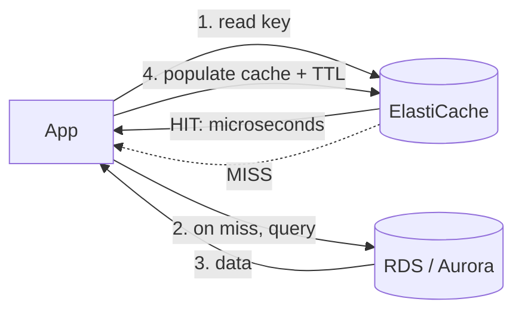

# 08 – ElastiCache (Redis / Memcached)

Managed in-memory caching in front of a database (or as a datastore). Turns repeated, expensive DB reads into microsecond memory hits. Two engines: **Redis** (feature-rich, HA) and **Memcached** (simple, multi-threaded). Part of the data tier with [[07-rds-aurora]].

> [!info] Exam TL;DR
> - **Cache = in-memory key-value store** in front of the DB. On a read: check cache → **hit** returns instantly; **miss** → read DB, then populate cache. Slashes DB load + latency for read-heavy, repeated queries.
> - **Redis** = single-threaded, but **HA (replication + Multi-AZ auto-failover)**, **persistence**, **backup/restore**, **rich data types** (sorted sets, lists, hashes, geospatial), **pub/sub**, transactions.
> - **Memcached** = **multi-threaded** (big multi-core nodes), **simple** key-value only, **no** persistence/replication/failover/backup — pure ephemeral cache that scales out.
> - **Pick Redis** for HA / durability / complex data (leaderboards, sessions, pub/sub). **Pick Memcached** for the simplest, multi-threaded, scale-horizontally object cache.
> - **Caching strategies:** *lazy loading / cache-aside* (populate on miss) vs *write-through* (populate on write); use **TTL** to bound staleness.
> - **Valkey** = the newer open-source Redis fork AWS backs; same feature profile as Redis for the exam.

## Concept (plain English)

A database read that hits disk and re-runs the same query thousands of times per second is wasteful — the answer rarely changes second to second. An in-memory cache stores those answers in RAM keyed by the query, so the app checks the cache first and only touches the database on a miss. That cuts latency from milliseconds to microseconds and takes huge load off the DB. ElastiCache is the managed version — you pick Redis (when you need HA, persistence, or rich data structures) or Memcached (when you want the simplest possible multi-threaded object cache) and AWS runs the nodes, replication, and failover.

## AWS console ↔ Terraform map

| Concept | Terraform | Notes |
|---|---|---|
| Redis replication group (with replicas/Multi-AZ) | `aws_elasticache_replication_group` | Primary + replicas, `automatic_failover_enabled`, `multi_az_enabled`. |
| Memcached cluster | `aws_elasticache_cluster` (engine `memcached`) | N nodes, client-side sharding. |
| Single Redis node | `aws_elasticache_cluster` (engine `redis`) | Simple single-node cache. |
| Subnet group | `aws_elasticache_subnet_group` | Private subnets (like a DB subnet group). |
| Parameter group | `aws_elasticache_parameter_group` | Engine tuning. |

## Architecture diagram

*Lazy loading / cache-aside: the cache only fills on a miss.*

## Key facts, limits & pricing

- **In-memory** → sub-millisecond latency; data lives in RAM (Memcached loses it on restart; Redis can persist/replicate).
- **Redis threading:** single-threaded for command execution (one core per node) — scale by **cluster mode** (sharding across nodes), not by adding cores. **Memcached:** multi-threaded — scales up on **large multi-core** nodes *and* out by adding nodes.
- **Redis HA:** a **replication group** = 1 primary + up to 5 read replicas; **Multi-AZ with automatic failover** promotes a replica if the primary dies. Supports **backup/snapshot & restore**. **Cluster mode enabled** shards data across multiple primaries (each with replicas) for horizontal scale.
- **Memcached:** no replication, no failover, no persistence, no backup — if a node dies, its data is gone. Scales by partitioning keys across nodes (client-side).
- **Data types:** Redis has strings, lists, sets, **sorted sets** (leaderboards!), hashes, bitmaps, hyperloglog, **geospatial**, plus **pub/sub** and transactions. Memcached: simple strings/objects only.
- **Encryption:** in-transit + at-rest supported on Redis (newer versions); Memcached in-transit on newer versions.
- **Common use cases:** DB query cache, **session store** (Redis, so sessions survive failover), **leaderboards/counters** (Redis sorted sets), **rate limiting**, **pub/sub messaging**, **geospatial** lookups.
- **Valkey:** AWS-backed open-source fork of Redis (after Redis's license change); ElastiCache now offers Valkey, Redis OSS, and Memcached. For SAA-C03 think "Redis vs Memcached"; Valkey ≈ Redis feature-wise and is often cheaper.
- Runs in your **VPC** (subnet group in private subnets, SG allowing the app tier) — same private-tier pattern as RDS.

## Comparisons

### Redis vs Memcached (the exam table)

|   | Redis (/ Valkey) | Memcached |
|---|---|---|
| Threading | **Single-threaded** | **Multi-threaded** |
| Persistence | Yes (snapshots/AOF) | **No** (RAM only) |
| Replication / HA | **Yes** | No |
| Multi-AZ auto-failover | **Yes** | No |
| Backup & restore | **Yes** | No |
| Data types | Rich (sorted sets, hashes, geo…) | Simple key-value |
| Pub/Sub, transactions | **Yes** | No |
| Horizontal scale | Cluster mode (sharding) | Add nodes (sharding) |
| **Choose when** | Need HA, persistence, complex data, pub/sub | Simplest, multi-core, pure ephemeral cache at scale |

### Caching strategies

| Strategy | How | Trade-off |
|---|---|---|
| **Lazy loading (cache-aside)** | Populate cache only on a miss | Only caches requested data; first read + any miss is slow; stale until evicted → use **TTL** |
| **Write-through** | Write to cache **and** DB on every write | Cache always fresh, but writes are slower and you cache data that may never be read |
| **TTL** | Expire keys after N seconds | Bounds staleness; pairs with lazy loading |

## Worked examples

> [!example] Worked example — read-heavy product page
> A product page runs the same "get product by id" query millions of times; the DB CPU is pegged and latency climbs. Put **ElastiCache** in front with **lazy loading**: the app checks the cache by product-id; on a **miss** it queries RDS/Aurora and stores the result with a **TTL** (say 300s); subsequent reads are **microsecond cache hits** that never touch the DB. DB load drops dramatically. Add read replicas ([[07-rds-aurora]]) only if writes/misses still stress it. This is the canonical "reduce database load / improve read latency" exam answer → ElastiCache.

> [!failure] Failure mode — Memcached for a session store
> A team uses **Memcached** to hold user login sessions. A cache node reboots (or is replaced during scaling) → **all sessions on it are gone** (no persistence, no replication), and users are logged out en masse. Sessions need durability + failover → use **Redis** (replication group, Multi-AZ, persistence). Rule: anything you can't afford to lose on a node failure belongs in **Redis**, not Memcached.

> [!example] Worked example — real-time leaderboard
> A game needs a live top-100 leaderboard updated on every score. A relational `ORDER BY score` over millions of rows per request is too slow. **Redis sorted sets** (`ZADD`/`ZREVRANGE`) maintain a ranked set in memory and return the top-N in microseconds. Memcached can't do this (simple key-value only). Trigger words "leaderboard / ranking / real-time counter" → **Redis**.

## The Terraform I wrote

Built a **best-practices Redis HA cache** in `07-rds-elasticache/`: an `aws_elasticache_replication_group` with `num_cache_clusters = 2` → `automatic_failover_enabled` + `multi_az_enabled` (both require ≥2 nodes), `at_rest_encryption_enabled` + `transit_encryption_enabled` (+ `auth_token`), snapshots on, in an `aws_elasticache_subnet_group` in private subnets, SG allowing 6379 **only from the app/client SG**. Verified the **primary** (`master.…`) and **reader** (`replica.…`) endpoints — same writer/reader split as Aurora. Redis took ~6 min to create. Used `aws_elasticache_replication_group` (not `aws_elasticache_cluster`) precisely to get the primary+replica HA topology.

> [!warning] Trap — Memcached for anything needing HA/persistence/complex data
> Memcached is simple, multi-threaded, ephemeral. Need failover, backup, sorted sets, pub/sub, or a session store that survives a node loss → **Redis**. This engine-choice question is the heart of ElastiCache on the exam.

> [!warning] Trap — "add a cache" when the problem is writes
> Caches accelerate **reads**. If the bottleneck is heavy **writes** or the data must be strongly consistent per request, a cache doesn't help (and lazy-loading serves stale data). Match the tool to read-heavy, repeat-query workloads.

> [!warning] Trap — Redis is multi-threaded because it's fast
> Redis command execution is **single-threaded** (one core per node); it scales via **cluster-mode sharding**, not more cores. **Memcached** is the multi-threaded one. Reversed often.

> [!example]- Recall drill
> (1) Redis vs Memcached: which is multi-threaded, which has HA/persistence? (2) What is lazy loading (cache-aside)? (3) Which engine for a session store, and why? (4) Which engine for a leaderboard, and what feature?
> > [!success]- Answers
> > (1) Memcached multi-threaded; Redis has HA/persistence (single-threaded). (2) Populate the cache only on a miss (read DB then store, with TTL). (3) Redis — replication/Multi-AZ/persistence so sessions survive node failure. (4) Redis — sorted sets.

## 🔴 My weak spots (this topic)   #weak-spot

- [ ] **Threading:** Memcached = multi-threaded, Redis = single-threaded (had it fuzzy).
- [ ] **Full Redis vs Memcached feature split** (HA, persistence, backup, data types, pub/sub) and the engine-choice decision.
- [ ] **Caching strategies** — lazy loading (cache-aside) vs write-through, and TTL.
- [ ] **Redis use cases** beyond caching: session store, leaderboards (sorted sets), pub/sub.

## 🔗 Docs

- [Comparing Redis OSS / Valkey / Memcached](https://docs.aws.amazon.com/AmazonElastiCache/latest/dg/SelectEngine.html) — threading + feature table; verified 2026-07
- [Caching strategies (lazy loading, write-through, TTL)](https://docs.aws.amazon.com/AmazonElastiCache/latest/dg/Strategies.html)
- [Redis replication & Multi-AZ](https://docs.aws.amazon.com/AmazonElastiCache/latest/dg/Replication.html)
- [Terraform `aws_elasticache_replication_group`](https://registry.terraform.io/providers/hashicorp/aws/latest/docs/resources/elasticache_replication_group)

---
**Cards for this topic:** [[cards/08-elasticache-cards]]
