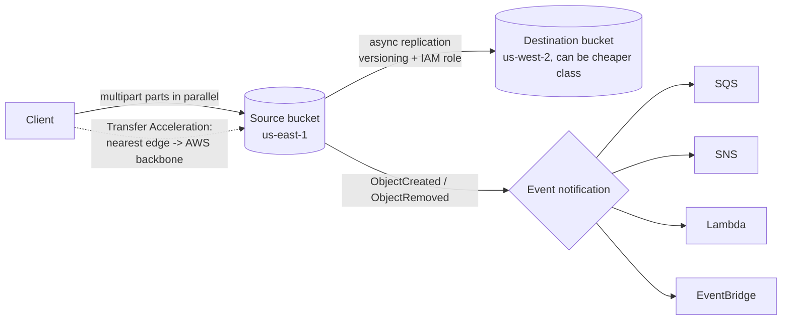

# 09.2 – S3 Advanced (replication, big files, events)

Moving data around and reacting to it: replication for DR/latency, multipart & byte-range for big objects, Transfer Acceleration for distance, and event notifications for automation. Part of [[09-s3]].

> [!info] Exam TL;DR
> - **Replication:** **CRR** = different region (DR, latency, compliance), **SRR** = same region (log aggregation, prod↔test). Requires **versioning on BOTH buckets** + an **IAM role**. It is **asynchronous**.
> - A **live** replication rule — the ordinary always-on rule you switch on, which copies each write as it happens — only copies **new/updated** objects. Pre-existing objects (or previously failed ones) need **S3 Batch Replication**, a one-off job you run on demand.
> - **Replication is not chained**: A→B and B→C does *not* get A's objects to C.
> - **S3 RTC** = SLA-backed **99.9% replicated within 15 minutes** (the "predictable replication time / compliance" answer).
> - **Multipart upload:** recommended ≥ **100 MB**, **required > 5 GB** (single-PUT max). Parallel parts, retry only the failed part. **Incomplete parts keep billing** → add the lifecycle action that **deletes incomplete multipart uploads**.
> - **Byte-range fetch** = ask S3 for only a range of an object's bytes — the first few KB of a file, say, or several ranges pulled in parallel. The download mirror of multipart upload.
> - **Transfer Acceleration:** enter AWS at the nearest **CloudFront edge**, then travel an **optimized network path** (AWS's wording) to the bucket's region. Same bucket, faster route, **no cache documented**. AWS's definition says "transfers … between your client and an S3 general purpose bucket", but its stated use cases are all uploads — so expect upload stems without eliminating it on a download. 15 Regions only; bucket name must have no dots.
> - **Event notifications:** on object created/removed/restored → **SNS, SQS, Lambda, EventBridge**. Destination needs a **resource policy** allowing S3.
> - **Glacier retrieval tiers** (Flexible): Expedited **1–5 min**, Standard **3–5 h**, Bulk **5–12 h**. Deep Archive: **no Expedited**, Standard **~12 h**, Bulk **~48 h**.
> - ⚠️ **S3 Select is no longer available to new customers** — learn the concept; use **Athena** in practice.

## What problem does this solve?

A bucket that just holds objects is easy to reason about. The trouble starts once the data matters, or gets big, or has to make something else happen.

Three separate pains, three separate features.

**"I need a second copy somewhere else."** One region, one bucket, one bad day. Or: your users are in Sydney and your bucket is in Virginia. Or: an auditor wants a copy inside a specific country. You could write a script that re-uploads everything on a schedule and hope it keeps up. **Replication** does it for you — automatically, in the background, to another region (**CRR**) or the same one (**SRR**).

**"This file is too big to upload as one thing."** A single `PUT` tops out at **5 GB**. And even under that, one long upload is one long chance to fail — lose the connection at 90% and you start again from zero. **Multipart upload** cuts the object into parts you send in parallel and retry individually. **Byte-range fetch** is the same trick pointed at downloads. **Transfer Acceleration** attacks a different part of the problem: not the file, the distance.

**"Something changed — now do something about it."** Polling a bucket to see if a new file arrived is wasteful and slow. **Event notifications** invert it: S3 tells you. An object lands, a message goes to SQS, SNS, Lambda or EventBridge, and a pipeline runs. That is how S3 stops being storage and becomes a trigger.

> In one line: copy it elsewhere, move it efficiently, and react when it changes.

## How it actually works

### Replication starts from now, not from the beginning

Turn on a replication rule and nothing happens. The destination stays empty until somebody writes a new object.

That is the single most misread behaviour in this topic. Live replication copies **only objects created or updated after the rule existed**. Years of data already in the bucket are simply not in scope. The team in the failure mode below found this out during an actual regional failover.

The fix has a name, and the name is the exam answer: **S3 Batch Replication** — an on-demand job that handles the four cases live replication won't.

| Situation | Live rule | Batch Replication |
|---|---|---|
| New object written now | ✅ | — |
| Object that existed before the rule | ❌ | ✅ |
| Object whose replication **FAILED** | ❌ | ✅ |
| Object already replicated, new destination added | ❌ | ✅ |
| A replica you want re-replicated — B's copy of A's object, passed on to C | ❌ | ✅ |

The last row is the other counter-intuitive one: **replication is not chained.** If A replicates to B and B replicates to C, objects from A do **not** reach C. B's copies are *replicas*, and a live rule won't re-replicate a replica. Only Batch Replication will.

Two prerequisites, and they are non-negotiable: **versioning on both buckets**, and an **IAM role** S3 assumes to read the source versions and write the destination.

Deletes then behave in two different ways, and both are worth memorising as stated. First, the mechanic they depend on: in a versioned bucket a delete does not erase anything — S3 lays a **delete marker** on top of the key, which hides it while every older version stays stored ([[09-s3-intro]] owns this). Now: on a modern rule — one written with a `Filter` element — delete an object and that **delete marker is not replicated** unless you switch on the rule's **Delete marker replication** option, and that opt-in exists only on **non-tag-based** rules. (A legacy **V1** config, written without `Filter`, behaves the opposite way: it *does* replicate delete markers from user actions, though never ones a lifecycle rule created. Replicating **across accounts**, delete markers are not replicated by default either.) Delete a *specific version* and that is **never** replicated, opt-in or not — that one protects the copy. Replication is a copy, not a backup; the things that actually stop a deletion are versioning and **Object Lock** ([[09-s3-security]]).

It is also **asynchronous** — the write succeeds immediately and the copy catches up afterwards. If a scenario demands a *predictable* catch-up, that is **S3 RTC**: AWS "replicates most objects that you upload to Amazon S3 in seconds, and **99.9 percent** of those objects within **15 minutes**", backed by an SLA and CloudWatch replication metrics. Note the SLA has holes: it does not apply while you are exceeding the per-prefix request-rate guidelines, nor while your replication data transfer exceeds the default **1 Gbps** quota.

> In one line: replication only copies what happens next; everything else — pre-existing, failed, or a replica — needs Batch Replication.

### Why a big upload is many small ones

Above **5 GB** you have no choice: that is the maximum for a single `PUT`. AWS recommends switching at **100 MB**, well before you're forced to.

The reason to switch early isn't the size limit. It's the failure math. One 4 GB upload is a single indivisible bet — a network blip anywhere in it costs you the whole thing. Split it and each part is its own small bet: parts go up **in parallel** (throughput), and a failed part is retried **alone**. Up to **10,000 parts**, up to a **50 TB** object.

Now the part that costs real money. A multipart upload is a conversation with three stages: start it, send the parts, complete it. If the client dies before that last step, the parts that made it are **stored and billed** at the storage class they were uploaded in — but the object doesn't exist yet, so it doesn't show up in an ordinary `ListObjects` / `s3 ls`. You have to ask for in-progress uploads specifically. You are paying for data you don't see in a normal listing.

A nightly job that crashes occasionally accumulates these quietly for months. You find them with `aws s3api list-multipart-uploads`. You prevent them with a lifecycle rule whose action is **delete incomplete multipart uploads** (`AbortIncompleteMultipartUpload` in the lifecycle XML and API) after N days from when the upload started — hygiene that costs nothing to add, and the reason that action belongs in every lifecycle rule you write.

**Byte-range fetch** is the mirror image on the way down: ask for only a range of bytes. Read just a header or metadata block without pulling the whole object, resume a broken download from where it stopped, or split one big download into ranges fetched in parallel.

> In one line: parts upload in parallel and retry individually — and the ones you never finish keep billing invisibly.

### Transfer Acceleration moves the path, not the bucket

The name suggests the data gets closer to the user. It doesn't. The bucket does not move, and no copy is made.

What changes is the **route**. With Transfer Acceleration the client transfers to the **nearest CloudFront edge location**, and "as the data arrives at an edge location, the data is routed to Amazon S3 over an **optimized network path**" — AWS's own wording. (Plenty of courses call it "the AWS private backbone"; AWS itself does not say that on this page, so prefer the sourced phrase.)

A short hop to get into AWS, then the long haul over AWS's optimized path. Same bucket, same region, different route. Three constraints that make it a real configuration choice rather than a switch: it is supported **only in 15 Regions** (us-east-1/2, us-west-1/2, the main EU and APAC Regions, ca-central-1, sa-east-1), the bucket name must be DNS-compliant with **no dots**, and clients must use the `bucket.s3-accelerate.amazonaws.com` endpoint. It costs extra per GB, so it earns its keep on long-distance transfers of large objects.

The distinction that gets tested is **acceleration vs caching**. CloudFront puts a **cache** at the edge, so it wins when many people read the *same* objects repeatedly. Transfer Acceleration changes the **path** and AWS documents no cache for it, so it wins when one large object has to cross a long distance — where a cache would not help anyway.

On direction, be precise, because the sources differ in strength. AWS's headline definition is bidirectional — *"transfers of files over long distances **between your client and an S3 general purpose bucket**"* — and the S3 FAQ refers to using the accelerate endpoint for `PUT` **and** `GET` requests. But the very next sentence on the same page is directional (*"designed to optimize transfer speeds from across the world **into** S3 general purpose buckets"*) and all three of AWS's "why use it" bullets are upload scenarios. So: expect upload wording in stems, don't eliminate it merely because a stem says download, and don't assert that downloads are accelerated as a flat fact — AWS never states it in those words. *(Verified 2026-10-06.)*

> In one line: nearest edge, then an optimized network path to the bucket's region — the bucket stays exactly where it was.

### Events, and the two ways they fail

An event notification is a rule on the bucket: when *this* kind of thing happens to an object matching *this* prefix or suffix, tell *that* destination.

The triggers are `s3:ObjectCreated:*` (Put, Post, Copy, CompleteMultipartUpload), `s3:ObjectRemoved:*`, `s3:ObjectRestore:*`, and more. The destinations are **SNS**, **SQS**, **Lambda** and **EventBridge** — EventBridge being the one that buys richer content-based filtering, archive and replay, and onward routing to many further targets.

**First failure: nobody told the destination.** S3 publishing into your queue is S3 calling *your* resource, so the permission has to live on that resource — on the **SQS queue or SNS topic**, not the bucket — and says in effect "allow the S3 service to publish here, but only on behalf of this one bucket". That scoping is the `aws:SourceArn` and `aws:SourceAccount` pair, and it matters because without it any bucket in any account could aim its notifications at your queue ([[01-iam]] covers the confused-deputy problem this prevents). If the queue or topic is encrypted with a **customer managed KMS key**, that key's policy also has to let the S3 service principal use it.

Two carve-outs stop this from being a universal rule, and AWS names only "an SNS topic, an SQS queue, or a Lambda function" as needing the grant at all:

- **Lambda** — if you wire the notification up in the **S3 console**, the console "sets up the necessary permissions on the Lambda function" for you. Doing it by API, you grant it yourself.
- **EventBridge** — needs **no destination policy whatsoever**. You simply enable or disable EventBridge delivery for the bucket, and when enabled *all* events are sent.

For SNS and SQS the ordering does matter: S3 publishes a test notification the moment you enable the rule, "to ensure that the topic exists and that the bucket owner has permission to publish", so a missing policy fails there and then rather than silently at runtime. Create the policy first.

**Second failure: the rule feeds itself.** A Lambda triggered by uploads to `uploads/` writes a thumbnail. If it writes that thumbnail back into `uploads/`, the write is a new `ObjectCreated` event, which fires the same Lambda, which writes another object. Infinite recursion, billed every turn. The output must go to a **different prefix or bucket**.

One more shape worth holding, and it is stronger than "might be slow". S3 Event Notifications are designed to deliver **at least once**, "but they aren't guaranteed to arrive in the same order that the events occurred", and "on rare occasions, Amazon S3's retry mechanism might cause duplicate S3 Event Notifications for the same object event". So two design rules, not one: consumers must be **idempotent** — handling the same event twice gives the same result as handling it once — and they must **not assume ordering**.

> In one line: the destination must grant S3 permission, and the output must never land where the trigger is watching.

## Architecture diagram

## Key facts, limits & pricing

- **S3 request rates are per prefix, not per bucket.** AWS: *"your application can achieve at least **3,500 PUT/COPY/POST/DELETE** or **5,500 GET/HEAD** requests per second **per partitioned Amazon S3 prefix**. There are **no limits to the number of prefixes** in a bucket."* So you scale by **spreading keys across prefixes inside one bucket** — their own example: 10 prefixes gives **55,000 reads/sec**. More buckets is not the answer, EFS is not the answer, and the old advice to **randomise key prefixes is obsolete** — S3 partitions automatically, so a sensible scheme like `logs/2026/10/04/` is fine. If the stem's rate is already under the limit, the answer may simply be **do nothing**. *(Verified 2026-10-04.)*

### Replication
- **Two live types:** **CRR** (cross-region) and **SRR** (same-region). Both are **asynchronous**. Buckets may be in **different AWS accounts**.
- **Requirements:** versioning **enabled on source *and* destination**, plus an **IAM role** S3 assumes (read source versions, write destination).
- **Only new/updated objects** are replicated after you enable a rule. For existing objects, objects whose replication **FAILED**, objects already replicated (e.g. to a newly added destination), replicas-of-replicas, and objects **tagged after upload** under a tag-based rule, use **S3 Batch Replication** (on-demand). Two documented limits stop it being the answer to everything: it does **not** support objects sitting in **Glacier Flexible Retrieval, Glacier Deep Archive, or the Intelligent-Tiering Archive Access / Deep Archive Access tiers** (restore them and copy to another class first), and it **cannot re-replicate an object that was deleted by version ID from the destination** — for that you run a **Batch Copy** in place, which creates a new source version and triggers replication normally.
- **Not transitive/chained** — replicas created by a rule can only be re-replicated via Batch Replication.
- **Delete markers** are **not** replicated on a modern (`Filter`-based) rule unless you switch on **Delete marker replication**, which is available only on **non-tag-based** rules. A legacy **V1** config (no `Filter`) replicates user-created delete markers by default but never lifecycle-created ones; **cross-account**, they are not replicated by default. Deleting a *specific version* is never replicated (protects the copy).
- Replicas can land in a **different (cheaper) storage class**, and ownership can be overridden to the destination account.
- **S3 RTC (Replication Time Control):** replicates **99.9% of objects within 15 minutes** (most "in seconds"), backed by an SLA + CloudWatch replication metrics, plus `OperationMissedThreshold` / `OperationReplicatedAfterThreshold` events. The SLA is void while you exceed the per-prefix request guidelines or the default **1 Gbps** replication transfer quota. Doesn't apply to Batch Replication. *(Corrected 2026-10-06 — this note said 99.99% in three places.)*
- **What replication copies**, per AWS's own list: objects created after the rule; **unencrypted objects**; objects encrypted with **SSE-S3, SSE-KMS, DSSE-KMS *and* SSE-C**; object metadata; object **tags**; ACL updates; and **Object Lock retention information** — which *overrides* any default retention period on the destination bucket.
- **What it does not copy:** replicas created by another rule (the non-transitive case); objects already replicated elsewhere; objects in **Glacier Flexible Retrieval, Glacier Deep Archive, or the Intelligent-Tiering Archive Access / Deep Archive Access** tiers (restore and copy to another class first); objects the bucket owner lacks permission to read; **bucket-level subresources** (change the lifecycle or notification config on the source and the destination keeps its own); and **anything a lifecycle action did** — lifecycle-created delete markers are never replicated.
- **Tag-based rules have a trap of their own:** with live replication, a new object must carry the matching tag **in the `PutObject` call itself**. Tag it afterwards and it will **never** be replicated by the live rule — that needs Batch Replication.
- **CRR use cases:** compliance/geographic distance, lower latency for users in another region, cross-region DR. **SRR use cases:** aggregate logs into one bucket, replicate prod→test accounts, data-sovereignty copies within a region.

### Big objects
- **Multipart upload:** AWS **recommends ≥ 100 MB**; **required above 5 GB** (max single-PUT). Up to **10,000 parts** (numbers 1–10,000); max object **50 TB** per the S3 FAQ (AWS's own multipart limits table gives the arithmetic ceiling as **48.8 TiB** = 10,000 × 5 GiB, which the FAQ rounds); it was **5 TB** until recently, so older practice banks still answer 5 TB — [[09-s3-intro]] owns object size. Parts upload in **parallel** and a failed part is retried alone.
- **Incomplete multipart uploads keep billing you** for the stored parts, at the storage class the parts were uploaded in, until you complete or abort them — and they don't appear in an ordinary listing, only via the *list multipart uploads* operation. Always add the **delete incomplete multipart uploads** action (`AbortIncompleteMultipartUpload`) to a lifecycle rule.
- **Byte-range fetch:** request only a byte range of an object — used to read just a header/metadata, resume a broken download, or parallelize a big download into ranges.

### Speed & query
- **Transfer Acceleration:** the client enters AWS at the **nearest CloudFront edge location**, from where data "is routed to Amazon S3 over an optimized network path". The bucket does **not** move, and AWS documents **no caching layer** (it is a path, not a CDN — that's CloudFront). Its definition is bidirectional ("between your client and an S3 general purpose bucket", and the accelerate endpoint takes `PUT` and `GET`), but every use case AWS lists is an upload. Best for long-distance transfers of large objects; costs extra per GB. Requires: one of **15 supported Regions**, a bucket name that is DNS-compliant with **no periods**, virtual-hosted-style requests, the `bucket.s3-accelerate.amazonaws.com` endpoint, and up to **20 minutes** after enabling before speeds improve.
- **S3 Select:** SQL over a **single object** (CSV/JSON/Parquet), returning only matching rows/columns so less data crosses the wire. ⚠️ **AWS: "Amazon S3 Select is no longer available to new customers."** Existing users keep it; new work should use **Athena** (multi-object SQL over S3). Know the concept for the exam.

### Events & automation
- **Triggers:** `s3:ObjectCreated:*` (Put/Post/Copy/CompleteMultipartUpload), `s3:ObjectRemoved:*`, `s3:ObjectRestore:*`, replication events, and more. Can filter by **prefix** and **suffix**.
- **Destinations:** **SNS**, **SQS**, **Lambda**, **EventBridge**. EventBridge adds rich content-based filtering, archiving/replay, and routing on to many further AWS and HTTP targets (AWS publishes no fixed count on the S3 page — don't memorise one).
- **SNS** and **SQS** destinations each need a **resource policy** allowing `s3.amazonaws.com`, scoped with `aws:SourceArn` **and** `aws:SourceAccount` — otherwise S3 can't publish, and the test notification S3 sends on enable fails immediately. A customer-managed KMS key on the queue/topic needs a matching key-policy grant. **Lambda**: the S3 console sets the invoke permission up for you; by API you grant it. **EventBridge: no destination policy at all** — you enable or disable it per bucket, and all events go.
- Delivery is **at-least-once**, **duplicates are possible** on retry, and events are **not guaranteed to arrive in the order they occurred**. Consumers must be **idempotent** and must not depend on ordering.

### Glacier retrieval tiers

An object in Glacier Flexible Retrieval or Deep Archive cannot be read where it sits: you issue a **restore**, which makes a temporary readable copy, and you choose how fast — faster costs more. Glacier **Instant** Retrieval and the other classes need no restore at all. Storage classes themselves are [[09-s3-intro]].

| Storage class | Expedited | Standard | Bulk |
|---|---|---|---|
| **Glacier Flexible Retrieval** | **1–5 min** for objects **under 250 MB**; 250 MB and larger stream at up to 300 MB/s | **3–5 hours** | **5–12 hours** (free) |
| **Glacier Deep Archive** | **not available** | **~12 hours** | **~48 hours** |

*(Glacier **Instant** Retrieval needs no restore at all — millisecond GET.)*

### Other advanced bits
- **S3 Batch Operations:** run one action (copy, tag, restore, invoke Lambda, ACL change) across **millions of objects** listed in a **manifest** (a file naming the objects to act on — an S3 Inventory report or a CSV you supply), with retries and a completion report. Powers Batch Replication.
- **Storage Lens:** org-wide storage analytics dashboard (usage, activity, cost-optimization recommendations); free metrics tier + paid advanced.
- **Storage Class Analysis:** watches access patterns and recommends when to transition to IA.
- **Requester Pays:** the *requester*, not the bucket owner, pays for requests + data transfer out — for sharing large datasets. ⚠️ verify: whether the bucket owner still pays storage, and the anonymous-request / replication-destination restrictions. Also ⚠️ verify: the Storage Lens free-vs-advanced metrics split, and whether Storage Class Analysis recommends Standard-IA specifically or transitions generally.

## Comparisons

### CRR vs SRR

|   | CRR | SRR |
|---|---|---|
| Destination | **Different** region | **Same** region |
| Typical use | DR, compliance distance, low latency for far users, cross-region analytics | Log aggregation, prod↔test sync, in-region data-sovereignty copies |
| Cross-account | Yes | Yes |

### CloudFront vs Transfer Acceleration

*Both use CloudFront edge locations, which is why they get confused. The axis is **caching vs path**.*

|   | CloudFront | S3 Transfer Acceleration |
|---|---|---|
| What the edge does | **Caches** the object at the edge | Entry point only — **no cache documented** by AWS |
| What it optimises | Repeat reads of the *same* objects by many users | A *single* long-distance transfer over an optimized network path |
| Direction | Reads (downloads) out to viewers | Definition says "between your client and" the bucket; all AWS use cases are uploads |
| Pick it when | Same content, many viewers, repeatedly | One large object, one long distance, caching would not help |

### Multipart vs byte-range

|   | Multipart upload | Byte-range fetch |
|---|---|---|
| Direction | **Upload** | **Download** |
| Splits | Object into parts sent in parallel | Request into ranges |
| Wins | Throughput + retry one part | Fetch only what you need / parallel download / resume |

## Worked examples

> [!example] Worked example — the event-driven thumbnail pipeline
> Users upload photos to `uploads/`. An **`s3:ObjectCreated:*` notification** (prefix-filtered) fires a **Lambda**, which reads the object, generates a thumbnail and writes it to `thumbs/`. No polling, no server, and it scales with upload volume. Two production details: the destination needs a **resource policy** letting S3 invoke it, and the thumbnail must be written to a **different prefix or bucket** — writing back into `uploads/` would re-trigger the same rule and **recurse infinitely** (a real and expensive mistake). A useful way to see the shape: point the notification at **SQS** instead of Lambda and read the raw event JSON off the queue — that JSON is exactly what a Lambda would have received.

> [!failure] Failure mode — "replication is on, so we're backed up"
> A team enables CRR for DR and assumes the destination now mirrors the bucket. It doesn't: live replication copies only objects written **after** the rule existed, so years of existing data are missing — discovered during an actual regional failover. Worse, if they'd enabled **delete-marker replication**, an accidental delete would propagate to the "backup" too. Fixes: run **S3 Batch Replication** to backfill existing objects, keep delete-marker replication **off** for DR copies, and monitor with **replication metrics / S3 RTC**. Replication is a *copy*, not a *backup* — versioning + Object Lock are what protect against deletion.

> [!failure] Failure mode — the invisible multipart bill
> A nightly job uploads multi-GB files and sometimes crashes mid-upload. Each crash leaves an **incomplete multipart upload**: the uploaded parts are stored and **billed**, but they don't appear in `s3 ls` or the bucket's object count. Months later, storage cost far exceeds the visible data. Diagnose with `aws s3api list-multipart-uploads`; fix permanently with a lifecycle rule whose action **deletes incomplete multipart uploads 7 days after they were initiated**. That action costs nothing and there is no good reason to omit it.

> [!warning] Trap — replication copies existing objects
> It does **not**. Live CRR/SRR only handles objects created/updated **after** the rule. Existing data needs **S3 Batch Replication**.

> [!warning] Trap — replication is transitive
> No. A→B and B→C does **not** deliver A's objects to C. Replicas can only be re-replicated with Batch Replication.

> [!warning] Trap — Transfer Acceleration moves your data closer to users
> It doesn't move the bucket — it changes the **path**: enter AWS at the nearest **edge location**, then an **optimized network path** to the bucket's region. The axis being tested is **caching vs path**: for the same objects read repeatedly by many people you want **CloudFront**, which caches at the edge; for one large object crossing a long distance you want Transfer Acceleration, for which AWS documents no cache.

> [!warning] Trap — SSE-C objects can't be replicated
> They can. AWS lists objects encrypted with **customer-provided keys (SSE-C)** alongside SSE-S3, SSE-KMS and DSSE-KMS under what replication *does* copy. Older courses and question banks say the opposite, because SSE-C support was added later — so this is a case where the dated material and the current docs disagree, and the docs win.

> [!warning] Trap — Batch Replication can backfill anything
> It can't. Objects sitting in **Glacier Flexible Retrieval, Glacier Deep Archive, or the Intelligent-Tiering archive tiers** must be restored and copied to another storage class first. And an object that was deleted from the destination **by version ID** can't be re-replicated at all — you run a **Batch Copy** in place, which creates a new source version and triggers replication normally.

> [!warning] Trap — "use S3 Select" on a new account
> S3 Select is **no longer available to new customers**. The modern answer for SQL over S3 is **Athena** (and it queries many objects, not one).

## 🔴 My weak spots (this topic)   #weak-spot

- [ ] **S3 Batch Replication** — the name for replicating pre-existing/failed objects (blanked on it in orient).
- [ ] **Transfer Acceleration mechanism** — thought it fetched from a nearer bucket; it's edge entry + AWS backbone to the *same* bucket.
- [ ] **S3 Select is deprecated for new customers** — use Athena; know the concept only.
- [ ] **Replication is not transitive**, and **delete markers aren't replicated by default**.
- [ ] **S3 RTC = 15-minute SLA** — the "predictable replication time" answer.
- [ ] **Glacier retrieval tiers/times** (Expedited 1–5 min, Standard 3–5 h, Bulk 5–12 h; Deep Archive has no Expedited).
- [ ] **Incomplete multipart uploads bill invisibly** — lifecycle abort rule is mandatory hygiene.

## 🔗 Docs
- [S3 performance — request rates per prefix](https://docs.aws.amazon.com/AmazonS3/latest/userguide/optimizing-performance.html) — 3,500/5,500 per partitioned prefix, gradual scaling, 503 Slow Down; **verified 2026-10-05**
- [S3 Transfer Acceleration](https://docs.aws.amazon.com/AmazonS3/latest/userguide/transfer-acceleration.html) — "between your client and an S3 general purpose bucket", edge + backbone, no periods in the bucket name, 20-min activation; **verified 2026-10-06**
- [S3 Replication Time Control](https://docs.aws.amazon.com/AmazonS3/latest/userguide/replication-time-control.html) — **99.9%** within 15 minutes, and the SLA's request-rate / 1 Gbps carve-outs; **verified 2026-10-06**
- [Replicating objects](https://docs.aws.amazon.com/AmazonS3/latest/userguide/replication.html) — CRR/SRR, Batch Replication, RTC 15-min SLA; **verified 2026-08**
- [Multipart upload overview](https://docs.aws.amazon.com/AmazonS3/latest/userguide/mpuoverview.html) — 100 MB recommendation, 10,000 parts, incomplete-upload billing; **verified 2026-08**
- [Archive retrieval options](https://docs.aws.amazon.com/AmazonS3/latest/userguide/restoring-objects-retrieval-options.html) — Expedited/Standard/Bulk times; **verified 2026-08**
- [S3 Select](https://docs.aws.amazon.com/AmazonS3/latest/userguide/selecting-content-from-objects.html) — *"no longer available to new customers"*; **verified 2026-08**
- [Event notifications](https://docs.aws.amazon.com/AmazonS3/latest/userguide/NotificationHowTo.html)
