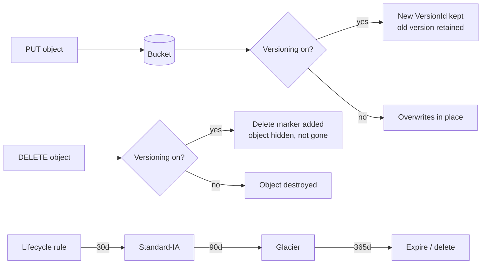

# 09.1 – S3 Introduction (buckets, classes, versioning, lifecycle)

The foundation: what S3 stores and how, the storage-class spectrum, and the two data-management features that save you money and mistakes — versioning and lifecycle. Part of [[09-s3]].

## What problem does this solve?

You have files. Not a database, not a disk you attach to one server — just files. Logs, images, backups, CSV exports, a website's HTML.

S3 takes a different shape from anything you'd mount on a machine. You put whole files — **objects** — into containers called **buckets**, and you address each one by a **key**: the object's full name. No server, no disk to size, no filesystem. AWS stores every object redundantly across at least three Availability Zones, which is where the famous eleven-nines durability comes from.

That solves losing data. It creates the second problem: storage you never delete costs money forever. A log file read constantly this week will be read once next year and never again — but you're still paying the same rate for it.

So S3 adds two more things. **Storage classes** are price tiers: cheaper per GB the slower or rarer the access. **Lifecycle rules** walk objects down that ladder automatically, and eventually delete them. And **versioning** turns the bucket into an append-only history, so an overwrite or a delete never actually loses the data.

> In one line: durable file storage addressed by name, with tiers and automatic ageing so old data gets cheap instead of getting expensive.

## How it actually works

### The key is the whole name, and there are no folders

There is no directory tree in S3. There is one flat map: key → object.

`photos/cat.jpg` is not a file called `cat.jpg` inside a folder called `photos`. It is a single key, 14 characters long, that happens to contain a slash. Nothing created `photos/`. Nothing would notice if it disappeared.

The console shows you folders because it splits keys on `/` and groups them. That is a rendering trick and nothing more. The leading part of a key is called a **prefix**, and listing by prefix is how you emulate "show me that directory".

Note the word **key** here means *name*, not *encryption key*. Bucket + key is what identifies an object.

The naming rules are stricter than you'd expect. Bucket names are **globally unique across all AWS accounts** — if a bucket called `photos` already exists in someone else's account, you can't create one by that name. Names must also be DNS-compatible: 3–63 characters, lowercase, no underscores.

But the bucket itself is **regional**. The *name* is global; the *data* sits in one region you chose. Those two facts sound contradictory and are constantly confused.

Objects run from 0 bytes to **5 TB**, but a single `PUT` maxes out at **5 GB**. Anything larger has to be a multipart upload. And since December 2020 S3 gives **strong read-after-write consistency** on all PUTs and DELETEs — write it, read it back immediately, you get the new version. The old eventual-consistency caveats are gone.

> In one line: a bucket is a globally-unique name for a regional flat key→object map, and folders are a console illusion.

### Durability and availability are two different numbers

Every storage class is **99.999999999% durable** — eleven nines. Standard, IA, Glacier, all of them. That number never changes.

Durability means: *will S3 lose your data?* No.

Availability means: *can you reach it right now?* That one **does** vary — Standard 99.99%, Standard-IA 99.9%, One Zone-IA 99.5%.

Now the part that looks like a contradiction. One Zone-IA is stored in **one** Availability Zone instead of three or more. It is still advertised at eleven nines durability.

Both are true at once, because they answer different questions. Eleven nines is what the class is *designed for*; it is not a promise that the data survives losing the Availability Zone it sits in. One Zone-IA data is **lost if that AZ is destroyed** — that is exactly the case the durability number doesn't cover.

So the eleven nines are true and useless as reassurance here. One Zone-IA is only for data you could **re-create** — thumbnails, derived files, a secondary copy. Put your only backup there and if that AZ is physically destroyed, it goes with it.

That's why a question about "surviving the loss of an Availability Zone" is a question about **AZ count**, not about durability.

> In one line: every class is eleven-nines durable, availability and AZ count are what actually differ, and One Zone-IA sits in a single AZ.

### Why moving data to a cheaper class can cost you more

The ladder runs: Standard → Intelligent-Tiering → Standard-IA → One Zone-IA → Glacier Instant Retrieval → Glacier Flexible Retrieval → Glacier Deep Archive. Cheaper storage as you go down, and slower or more expensive to read back.

The obvious move is "put everything cold in IA and save money". Two rules make that backfire.

**Minimum storage duration.** Once an object is in a class, you are billed for a minimum residence whether or not it's still there.

| Class | Minimum storage duration |
|---|---|
| Standard, Intelligent-Tiering | none |
| Standard-IA, One Zone-IA | 30 days |
| Glacier Instant, Glacier Flexible | 90 days |
| Glacier Deep Archive | 180 days |

Move an object to Glacier and delete it a week later, and you still pay for 90 days of Glacier. The tier is cheap *because* you promised to leave it alone.

**Minimum billable object size.** Standard-IA, One Zone-IA and Glacier Instant bill every object as if it were at least **128 KB**. Store a million 4 KB files in Standard-IA and you are billed for a million 128 KB files — 32× the bytes you actually have, which is how storing many tiny files in IA *can* cost more than Standard.

So the rule is: transition only data that is genuinely large and genuinely going to sit there.

The other thing people get wrong on this ladder is retrieval speed. "Glacier" does not mean slow. **Glacier Instant Retrieval** returns objects in **milliseconds** — it's an archive price with normal access. Only **Flexible Retrieval** (minutes to hours) and **Deep Archive** (hours) require a restore job before you can read anything.

And if you genuinely don't know the access pattern, that's what **Intelligent-Tiering** is for. It moves objects itself — Frequent → Infrequent after 30 days without access → Archive Instant Access after 90 — and charges a small per-object monitoring fee with **no retrieval fees**. Objects under 128 KB aren't monitored and just stay in Frequent Access.

**Lifecycle rules** are how you drive the ladder deliberately. One rule can carry an object its whole life: Standard on write → Standard-IA at 30 days → Glacier Flexible at 90 days → expire at 7 years. The same rule type also expires **noncurrent versions** and aborts **incomplete multipart uploads** — both invisible costs.

> In one line: cheaper classes charge a minimum stay and a minimum object size, so short-lived or tiny objects can cost more down the ladder, not less.

### Versioning, delete markers, and the bill that grows in the dark

Turn versioning on and a delete stops deleting.

Walk it. You `DELETE photos/cat.jpg`. S3 adds a **delete marker** on top of the object. The key now returns "not found", and `s3 ls` no longer shows it. But every version is still there, still stored, still billed. Delete the *delete marker* and the object reappears.

To actually remove data you must delete a **specific version id**. That one is permanent.

| Action | Versioning OFF | Versioning ON |
|---|---|---|
| Delete an object | destroyed | delete marker added, versions kept |
| Delete a version id | n/a | that version permanently gone |
| Overwrite | replaced in place | new version, old one kept |

Two more asymmetries worth holding. Versioning is set at the **bucket** level, and once enabled it can be **suspended but never disabled**. And objects that existed before you enabled it have a version id of literally `null`.

Now the failure this causes. A job rewrites the same objects every hour. Every rewrite keeps the previous version forever. The bucket *looks* the same size in the console, because `s3 ls` only lists current versions. Months later the bill is 20× what anyone expected. You only see the truth with `list-object-versions`.

The fix is always the same: enable versioning and a lifecycle rule with **noncurrent version expiration** in the same breath. Never one without the other.

This is also why a versioned bucket refuses to `terraform destroy` — it fails with `BucketNotEmpty` until every version *and* every delete marker is purged, even though the bucket appears empty.

> In one line: with versioning on, delete only hides; old versions bill forever until a noncurrent-version expiration rule removes them.

## Exam recap

*Now that the mechanisms are clear, this is the compressed version to revise from.*

> [!info] Exam TL;DR
> - **Bucket names are GLOBALLY unique** (across all AWS accounts); buckets themselves live in **one region**.
> - The **key** is the object's full name (`photos/cat.jpg`). S3 is a **flat key→object map** — "folders" are a console illusion over the `/` in keys; the leading part is a **prefix**.
> - **Durability = 99.999999999% (11 nines)** for *every* storage class, stored across **≥3 AZs** — *except* One Zone classes (**1 AZ**). **Availability differs by class** (Standard 99.99%, IA 99.9%, One Zone-IA 99.5%).
> - **Storage classes:** Standard → Intelligent-Tiering → Standard-IA → One Zone-IA → Glacier Instant → Glacier Flexible → Glacier Deep Archive. **Minimum storage durations:** IA classes **30 d**, Glacier Instant/Flexible **90 d**, Deep Archive **180 d** (delete early = still billed).
> - **Versioning** keeps every version; a delete creates a **delete marker** (nothing is really removed). Deleting the marker restores the object.
> - **Lifecycle rules** transition objects between classes and **expire** them (incl. noncurrent versions + incomplete multipart uploads) — pure cost control.
> - **Static website hosting** serves objects over **HTTP only** — HTTPS needs CloudFront in front.

## AWS console ↔ Terraform map

| Console / concept | Terraform | Notes |
|---|---|---|
| Create a bucket | `aws_s3_bucket` | Just the container now — settings are **separate resources** in the modern provider (inline blocks are deprecated). |
| Enable versioning | `aws_s3_bucket_versioning` | `versioning_configuration { status = "Enabled" }`. |
| Lifecycle rules | `aws_s3_bucket_lifecycle_configuration` | `transition`, `expiration`, `noncurrent_version_expiration`, `abort_incomplete_multipart_upload`. |
| Upload an object | `aws_s3_object` | `content = "..."` (inline) **or** `source = path` + **`etag = filemd5(path)`**; set `content_type`. |
| Static website | `aws_s3_bucket_website_configuration` | `index_document` + `error_document`. |
| Public-access safety net | `aws_s3_bucket_public_access_block` | 4 flags; **all true** normally, all false only for a real public site. |
| Bucket policy | `aws_s3_bucket_policy` (+ `data.aws_iam_policy_document`) | Resource-based policy; see [[09-s3-security]]. |
| Default encryption | `aws_s3_bucket_server_side_encryption_configuration` | See [[09-s3-security]]. |

## Architecture diagram

## Key facts, limits & pricing

- **Namespace:** bucket names are **globally unique across all AWS accounts**; buckets are **regional** resources. Names are DNS-compatible (3–63 chars, lowercase, no underscores).
- **Object size:** 0 bytes to **5 TB**. A single `PUT` maxes at **5 GB** — beyond that you must use **multipart upload** (see [[09-s3-advanced]]).
- **Durability: 99.999999999% (11 nines)** — *designed for* — on **every** storage class. Achieved by redundantly storing across **≥3 AZs** (One Zone classes: **1 AZ**, same 11-nines durability but **lost if that AZ is destroyed**).
- **Availability (designed for), verified:** Standard **99.99%** · Standard-IA **99.9%** · Intelligent-Tiering **99.9%** · One Zone-IA **99.5%** · Glacier Instant **99.9%** · Glacier Flexible / Deep Archive **99.99% (after restore)**.
- **Minimum storage durations (billed even if you delete early):** Standard & Intelligent-Tiering **none** · Standard-IA & One Zone-IA **30 days** · Glacier Instant & Glacier Flexible **90 days** · Glacier Deep Archive **180 days**.
- **Minimum billable object size:** Standard/Intelligent-Tiering **none**; Standard-IA, One Zone-IA, Glacier Instant **128 KB**. (Storing many tiny files in IA can cost *more* than Standard.)
- **Intelligent-Tiering:** auto-moves objects between Frequent → Infrequent (**30 d** no access) → Archive Instant Access (**90 d**), plus optional Archive Access (90 d) and Deep Archive Access (180 d) tiers. **Monitoring fee per object, no retrieval fees.** Objects **< 128 KB are not monitored** and stay in Frequent Access.
- **Consistency:** S3 provides **strong read-after-write consistency** for all PUTs and DELETEs (since Dec 2020) — no more eventual-consistency caveats.
- **Versioning:** enabled at the **bucket** level; can be **suspended but never disabled** once enabled. Pre-versioning objects have `VersionId = null`. Every version costs storage → pair with `noncurrent_version_expiration`.
- **Static website hosting:** the S3 website endpoint is **HTTP only**; for HTTPS/custom domain/caching put **CloudFront** in front. Requires public read access (Block Public Access off + public bucket policy).

## Comparisons

### Storage classes (verified against AWS docs 2026-08)

| Class | For | Availability | AZs | Min duration | Min billable size | Retrieval |
|---|---|---|---|---|---|---|
| **S3 Standard** | Frequent access | 99.99% | ≥3 | none | none | ms |
| **Intelligent-Tiering** | Unknown/changing patterns | 99.9% | ≥3 | none | none | ms (monitoring fee, no retrieval fee) |
| **Standard-IA** | Infrequent, must not lose | 99.9% | ≥3 | 30 d | 128 KB | ms (+ retrieval fee) |
| **One Zone-IA** | Infrequent, **re-creatable** | 99.5% | **1** | 30 d | 128 KB | ms (+ retrieval fee) |
| **Glacier Instant Retrieval** | Archive, quarterly, instant | 99.9% | ≥3 | 90 d | 128 KB | **milliseconds** |
| **Glacier Flexible Retrieval** | Archive, yearly | 99.99% (post-restore) | ≥3 | 90 d | — | **minutes–hours** (restore first) |
| **Glacier Deep Archive** | Archive, <1×/year | 99.99% (post-restore) | ≥3 | **180 d** | — | **hours** (restore first) |

*(Also exists: **S3 Express One Zone** — single-digit-ms, 1 AZ, 99.95% — for latency-critical workloads.)*

### Versioning: delete vs permanent delete

| Action | Versioning OFF | Versioning ON |
|---|---|---|
| `DELETE object` | Object destroyed | **Delete marker** added; object hidden, versions retained |
| `DELETE object --version-id` | n/a | **Permanently** removes that version |
| Delete the delete marker | n/a | Object **reappears** |
| Overwrite | Replaces in place | New version; old version kept |

## Worked examples

> [!example] Worked example — a lifecycle policy that pays for itself
> Log files land in S3 daily. They're queried constantly for the first month, occasionally for a quarter, then kept years for compliance and almost never read. One lifecycle rule handles the whole journey: **Standard** on write → **Standard-IA at 30 days** → **Glacier Flexible at 90 days** → **expire at 7 years**, plus `noncurrent_version_expiration` to purge old versions and `abort_incomplete_multipart_upload` after 7 days. Storage cost drops by an order of magnitude with no application change. Exam trigger: *"data accessed frequently at first then rarely, minimize cost"* → **lifecycle transitions**, not manual copies.

> [!failure] Failure mode — versioning without noncurrent-version expiration
> A team enables versioning "for safety" on a bucket where a job rewrites the same objects hourly. Every rewrite keeps the old version forever, so storage (and the bill) grows without bound while the bucket "looks" the same size in the console — `s3 ls` shows only current versions. Months later the bill is 20× expected. Fix: always pair versioning with a lifecycle rule containing **`noncurrent_version_expiration`** (e.g. 30 days), and use `list-object-versions` (not `s3 ls`) to see true usage. *(Also why a versioned bucket refuses to `terraform destroy` with `BucketNotEmpty` until every version and delete marker is purged — hit live in this build.)*

> [!failure] Failure mode — One Zone-IA for the only copy
> One Zone-IA is ~20% cheaper than Standard-IA and equally durable *on paper* (11 nines) — so a team moves its only backup copy there. Both classes are 11-nines durable, but One Zone-IA stores in a **single AZ**: if that AZ is physically destroyed, **the data is gone**, and its availability is only 99.5%. Rule: One Zone-IA is only for **re-creatable** data (thumbnails, derived files, secondary replicas). The primary/only copy belongs in a ≥3-AZ class.

## The Terraform I wrote

Code: `09-s3/` — `main.tf` (bucket + versioning + lifecycle + objects), `website.tf` (static site), plus `data.txt` / `index.html` / `error.html`.

- Bucket named with `data.aws_caller_identity.current.account_id` as a suffix (bucket names are **globally unique** — a plain name fails).
- `aws_s3_bucket_versioning` enabled, then **verified live**: edited the object, re-applied, and `list-object-versions` showed **two versions** with different `VersionId`s and `IsLatest` on the newer. Deleted it → a **delete marker** appeared and the object vanished from `s3 ls` while both versions remained; removing the marker restored it.
- `aws_s3_bucket_lifecycle_configuration` with transitions (30 d → STANDARD_IA, 90 d → GLACIER), `expiration`, `noncurrent_version_expiration` and `abort_incomplete_multipart_upload`.
- Static site: second bucket + `website_configuration` (index + error), `public_access_block` all-false, a public-read `bucket_policy` (with `depends_on` on the access block so ordering is right), and objects uploaded with **`content_type = "text/html"`**. Verified in a browser, including the 404 page.

Non-obvious things:
- **Modern provider splits bucket config into separate resources** — `aws_s3_bucket` no longer takes inline `versioning`/`lifecycle_rule`/`website` blocks.
- **`etag = filemd5(path)`** is required with `source`, or Terraform won't notice the file's *contents* changed and silently skips the upload.
- **`content_type`** must be set or browsers download instead of rendering.
- A public bucket policy is **rejected while Block Public Access is on** → `depends_on` the access block.

> [!warning] Trap — "S3 has folders"
> No. S3 is a flat key→object store; `photos/cat.jpg` is one key. The console renders "folders" by splitting on `/`. Listing by **prefix** is how you emulate a directory.

> [!warning] Trap — "Glacier means slow retrieval"
> **Glacier Instant Retrieval** returns objects in **milliseconds**. Only **Flexible Retrieval** (minutes–hours) and **Deep Archive** (hours) need a restore job. "Archive but must be instantly available" → Glacier Instant Retrieval.

> [!warning] Trap — durability vs availability
> Every class is **11 nines durable** (won't lose data). What differs is **availability** (can you reach it *right now*): Standard 99.99%, IA 99.9%, One Zone-IA 99.5%. Questions about "surviving AZ loss" are about **AZ count**, not durability.

> [!warning] Trap — moving to IA/Glacier always saves money
> Minimum storage durations (IA 30 d, Glacier 90 d, Deep Archive 180 d) and a **128 KB minimum billable size** mean short-lived or tiny objects can cost **more** in IA than Standard. Transition only data that will genuinely sit there.

> [!example]- Recreate-from-memory drill
> Build a bucket with versioning + a lifecycle rule (30 d → IA, 90 d → Glacier, expire 365 d, noncurrent 30 d), upload an object from a file (with `etag`), then edit + re-apply and prove two versions exist. Delete the object and find the delete marker; restore it. Then a second bucket serving a static site (index + error, public policy, `content_type`).
> > [!success]- Reference solution
> > See `09-s3/main.tf` + `website.tf`. Gotchas: globally-unique bucket name, `etag = filemd5(...)`, `content_type`, `depends_on` the public-access block, and `force_destroy`/manual purge to delete a versioned bucket.

## 🔴 My weak spots (this topic)   #weak-spot

- [ ] **"Key" = the object's full name/path**, not an encryption key. Bucket + key identifies an object; the leading part is a **prefix**.
- [ ] **Durability 11 nines / ≥3 AZs, and availability differs per class** (Standard 99.99, IA 99.9, One Zone-IA 99.5) — needed the numbers.
- [ ] **Minimum storage durations** (IA 30 d, Glacier 90 d, Deep Archive 180 d) + **128 KB minimum billable size** — the cost traps.
- [ ] **Glacier Instant Retrieval is millisecond access** — not all Glacier tiers are slow.
- [ ] **Versioned buckets need noncurrent-version expiration** (cost) and can't be destroyed while versions/markers remain.
- [ ] **`etag = filemd5()`** required with `source`, and **`content_type`** required for browser rendering.

## 🔗 Docs

- [S3 storage classes comparison](https://docs.aws.amazon.com/AmazonS3/latest/userguide/storage-class-intro.html) — durability/availability/AZs/min-duration/min-size table; **verified 2026-08**
- [Using versioning](https://docs.aws.amazon.com/AmazonS3/latest/userguide/Versioning.html) — delete markers
- [Managing object lifecycle](https://docs.aws.amazon.com/AmazonS3/latest/userguide/object-lifecycle-mgmt.html)
- [Hosting a static website](https://docs.aws.amazon.com/AmazonS3/latest/userguide/WebsiteHosting.html)
- [Terraform `aws_s3_bucket`](https://registry.terraform.io/providers/hashicorp/aws/latest/docs/resources/s3_bucket) / [`aws_s3_object`](https://registry.terraform.io/providers/hashicorp/aws/latest/docs/resources/s3_object)

---
**Cards for this topic:** [[cards/09-s3-intro-cards]]
