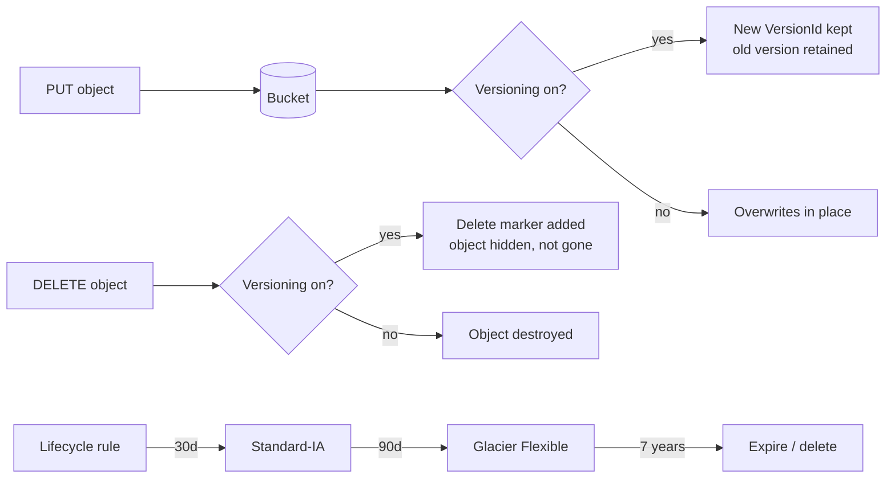

# 09.1 – S3 Introduction (buckets, classes, versioning, lifecycle)

The foundation: what S3 stores and how, the storage-class spectrum, and the two data-management features that save you money and mistakes — versioning and lifecycle. Part of [[09-s3]].

> [!info] Exam TL;DR
> - **Bucket names are GLOBALLY unique** (across all AWS accounts); buckets themselves live in **one region**.
> - The **key** is the object's full name (`photos/cat.jpg`). S3 is a **flat key→object map** — "folders" are a console illusion over the `/` in keys; the leading part is a **prefix**.
> - **Durability = 99.999999999% (11 nines)** for *every current* storage class. Objects are stored across **≥3 AZs** — *except* the One Zone classes, which sit in **1 AZ** (same 11 nines, but the data is gone if that AZ is destroyed). **Availability differs by class** (Standard 99.99%, IA 99.9%, One Zone-IA 99.5%).
> - **Storage classes, cheapest-to-store last:** Standard → Standard-IA → One Zone-IA → Glacier Instant → Glacier Flexible → Glacier Deep Archive. (**IA** = *Infrequent Access*: cheaper per GB than Standard, but you pay a per-GB **retrieval fee** to read it back.) **Intelligent-Tiering sits off this ladder** — you pick it when the access pattern is *unknown*, not when you want the next-cheapest tier.
> - **Minimum storage durations:** IA classes **30 d**, Glacier Instant/Flexible **90 d**, Deep Archive **180 d** (delete early = still billed).
> - **Versioning** keeps every version; a delete creates a **delete marker** (nothing is really removed). Deleting the marker restores the object.
> - **Lifecycle rules** transition objects between classes and **expire** them (incl. noncurrent versions + incomplete multipart uploads) — pure cost control.
> - **Static website hosting** serves objects over **HTTP only** — HTTPS needs CloudFront in front.

## What problem does this solve?

You have files. Not a database, not a disk you attach to one server — just files. Logs, images, backups, CSV exports, a website's HTML.

S3 takes a different shape from anything you'd mount on a machine. You put whole files — **objects** — into containers called **buckets**, and you address each one by a **key**: the object's full name. No server, no disk to size, no filesystem. In every storage class except the One Zone ones, AWS stores each object redundantly across at least three Availability Zones, which is where the famous eleven-nines durability comes from.

That solves losing data. It creates the second problem: storage you never delete costs money forever. A log file read constantly this week will be read once next year and never again — but you're still paying the same rate for it.

So S3 adds two more things. **Storage classes** are price tiers: cheaper per GB the slower or rarer the access. **Lifecycle rules** walk objects down that ladder automatically, and eventually delete them. And **versioning** turns the bucket into an append-only history, so an overwrite or a delete never actually loses the data.

> In one line: durable file storage addressed by name, with tiers and automatic ageing so old data gets cheap instead of getting expensive.

## How it actually works

### The key is the whole name, and there are no folders

There is no directory tree in a **general purpose bucket** — the normal S3 bucket, and the only kind this note describes. There is one flat map: key → object.

(The exception, so the absolute does not mislead you: S3 also has a newer **directory bucket** type — the one behind S3 Express One Zone — which genuinely *does* "organize objects into hierarchical directories (prefixes) instead of the flat storage structure of general purpose buckets". Everything below is about general purpose buckets.)

`photos/cat.jpg` is not a file called `cat.jpg` inside a folder called `photos`. It is a single key, 14 characters long, that happens to contain a slash. Nothing created `photos/`. Nothing would notice if it disappeared.

The console shows you folders because it splits keys on `/` and groups them. That is a rendering trick and nothing more. The leading part of a key is called a **prefix**, and listing by prefix is how you emulate "show me that directory".

Note the word **key** here means *name*, not *encryption key*. Bucket + key is what identifies an object.

The naming rules are stricter than you'd expect. Bucket names are **globally unique across all AWS accounts** — if a bucket called `photos` already exists in someone else's account, you can't create one by that name. Names must also be DNS-compatible: 3–63 characters, lowercase, no underscores.

Two refinements AWS has since added, which the exam will not ask but which stop the word "globally" being a lie. Uniqueness is scoped to a **partition**, a grouping of regions — AWS has four (`aws` for the standard regions, `aws-cn`, `aws-us-gov`, `aws-eusc`) — so the same name can exist once in each. And you can now opt a bucket into your **account regional namespace** instead of the shared global one: a reserved subdivision only your account can create in, named `<your-prefix>-<accountId>-<region>-an`. AWS now *recommends* that, because a name in the shared namespace becomes available to anyone else once you delete the bucket.

But the bucket itself is **regional**. The *name* is global; the *data* sits in one region you chose. Those two facts sound contradictory and are constantly confused.

Objects run from 0 bytes to **50 TB**, but a single `PUT` maxes out at **5 GB**. Anything larger has to be a multipart upload. And since December 2020 S3 gives **strong read-after-write consistency** on all PUTs and DELETEs — write it, read it back immediately, you get the new version. The old *object-level* eventual-consistency caveats are gone.

One caveat survives, and it is the one that bites: **bucket *configurations* are still eventually consistent.** AWS says so plainly — a bucket you just deleted can still appear in a list-buckets call, and after enabling versioning for the first time it "recommend[s] that you wait for 15 minutes … before issuing write operations (PUT or DELETE requests) on objects in the bucket". So the strong-consistency guarantee is about object data, not about a setting you just flipped.

> In one line: a bucket is a globally-unique name for a regional flat key→object map, and folders are a console illusion.

### Durability and availability are two different numbers

Every *current* storage class is **99.999999999% durable** — eleven nines. Standard, IA, Glacier, all of them. That number never changes. (The one exception is the legacy **Reduced Redundancy Storage** class at **99.99%** — "an average annual expected loss of 0.01 percent of objects" — which AWS explicitly recommends against using. If a question says "every class", it means every class you would actually choose.)

Durability means: *will S3 lose your data?* No.

Availability means: *can you reach it right now?* That one **does** vary — Standard 99.99%, Standard-IA 99.9%, One Zone-IA 99.5%.

Now the part that looks like a contradiction. One Zone-IA is stored in **one** Availability Zone instead of three or more. It is still advertised at eleven nines durability.

The exam rule first, then the why: **to survive losing an AZ you need a class stored in ≥3 AZs, and the eleven-nines figure does not cover that scenario for the One Zone classes.** AWS states the carve-out directly — "all of the storage classes except for S3 One Zone-IA … and S3 Express One Zone … are designed to be resilient to the physical loss of an Availability Zone".

Both numbers are true at once, because they answer different questions. Eleven nines is what the class is *designed for*; it is not a promise that the data survives losing the Availability Zone it sits in. One Zone-IA data is **lost if that AZ is destroyed** — that is exactly the case the durability number doesn't cover.

So the eleven nines are true and useless as reassurance here. One Zone-IA is only for data you could **re-create** — thumbnails, derived files, a secondary copy. Put your only backup there and if that AZ is physically destroyed, it goes with it.

That's why a question about "surviving the loss of an Availability Zone" is a question about **AZ count**, not about durability.

> In one line: every class is eleven-nines durable, availability and AZ count are what actually differ, and One Zone-IA sits in a single AZ.

### Why moving data to a cheaper class can cost you more

The ladder runs: Standard → Standard-IA → One Zone-IA → Glacier Instant Retrieval → Glacier Flexible Retrieval → Glacier Deep Archive. Cheaper storage as you go down, and slower or more expensive to read back.

**Intelligent-Tiering is not a rung on that ladder**, even though it is often drawn as one. AWS positions it by *access pattern*, not by price: an object that keeps being read simply sits in Intelligent-Tiering's Frequent Access tier at roughly Standard's storage price *plus* a per-object monitoring and automation fee Standard does not charge. Choosing it for a known-hot dataset makes the bill worse, not better.

The obvious move is "put everything cold in IA and save money". Two rules make that backfire.

**Minimum storage duration.** Once an object is in a class, you are billed for a minimum residence whether or not it's still there.

| Class | Minimum storage duration |
|---|---|
| Standard, Intelligent-Tiering | none |
| Standard-IA, One Zone-IA | 30 days |
| Glacier Instant, Glacier Flexible | 90 days |
| Glacier Deep Archive | 180 days |

Move an object to Glacier and delete it a week later, and you still pay for 90 days of Glacier. The tier is cheap *because* you promised to leave it alone.

**Minimum billable object size.** Standard-IA, One Zone-IA and Glacier Instant bill every object as if it were at least **128 KB**. Store a million 4 KB files in Standard-IA and you are billed for a million 128 KB files — 32× the bytes you actually have, which is how storing many tiny files in IA *can* cost more than Standard.

Glacier Flexible Retrieval and Deep Archive have no 128 KB floor, but they are not free of per-object overhead either: each archived object carries **40 KB of additional metadata** — 32 KB billed at the archive rate plus 8 KB billed at the Standard rate. So "millions of tiny objects" is the wrong shape for every class below Standard, not just the 128 KB ones.

So the rule is: transition only data that is genuinely large and genuinely going to sit there.

The other thing people get wrong on this ladder is retrieval speed. "Glacier" does not mean slow. **Glacier Instant Retrieval** returns objects in **milliseconds** — it's an archive price with normal access. Only **Flexible Retrieval** (minutes to hours) and **Deep Archive** (hours) require a restore job before you can read anything.

And if you genuinely don't know the access pattern, that's what **Intelligent-Tiering** is for. Inside the class each object sits in an internal **access tier** that S3 moves it between based on when you last touched it; these tiers are not storage classes you pick, and moving between them is not a lifecycle transition. The three automatic tiers are Frequent Access → Infrequent Access after **30** consecutive days without access → Archive Instant Access after **90**. (Confusingly, *Archive Instant Access* is a tier inside Intelligent-Tiering, not the separate Glacier Instant Retrieval class.) You pay a small per-object monitoring and automation fee and **no retrieval fees**. Objects under 128 KB aren't monitored and just stay in Frequent Access.

**Lifecycle rules** are how you drive the ladder deliberately. One rule can carry an object its whole life: Standard on write → Standard-IA at 30 days → Glacier Flexible at 90 days → expire at 7 years. The same rule type also cleans up the two costs you never see on a bill line:

- a **noncurrent version** is any older version of a key that a newer upload has superseded, or that a delete marker has buried — only the newest is "current", and the rest keep billing;
- an **incomplete multipart upload** is a large file uploaded in pieces where the final "done" call never arrived: the uploaded parts stay stored and billed, but no object exists for you to see or delete normally.

> In one line: cheaper classes charge a minimum stay and a minimum object size, so short-lived or tiny objects can cost more down the ladder, not less.

### Versioning, delete markers, and the bill that grows in the dark

Turn versioning on and a delete stops deleting.

Walk it. You `DELETE photos/cat.jpg`. S3 adds a **delete marker** on top of the object. The key now returns "not found", and `s3 ls` no longer shows it. But every version is still there, still stored, still billed. Delete the *delete marker* and the object reappears.

To actually remove data you must delete a **specific version id**. That one is permanent.

| Action | Versioning OFF | Versioning ON |
|---|---|---|
| Delete an object | destroyed | delete marker added, versions kept |
| Delete a version id | n/a | that version permanently gone |
| Overwrite | replaced in place | new version, old one kept |

Two more asymmetries worth holding. Versioning is set at the **bucket** level, and once enabled it can be **suspended but never disabled**. And objects that existed before you enabled it have a version id of literally `null`.

Now the failure this causes. A job rewrites the same objects every hour. Every rewrite keeps the previous version forever. The bucket *looks* the same size in the console, because `s3 ls` only lists current versions. Months later the bill is 20× what anyone expected. You only see the truth with `list-object-versions`.

The fix is always the same: enable versioning and a lifecycle rule with **noncurrent version expiration** in the same breath. Never one without the other.

This is also why a versioned bucket **cannot be deleted** while anything remains in it: the delete fails with `BucketNotEmpty` until every version *and* every delete marker is purged, even though the bucket looks empty.

> In one line: with versioning on, delete only hides; old versions bill forever until a noncurrent-version expiration rule removes them.

## Architecture diagram

```mermaid
flowchart LR
    UP[PUT object] --> B[(Bucket)]
    B --> V{Versioning on?}
    V -->|yes| NEW[New VersionId kept<br/>old version retained]
    V -->|no| OVER[Overwrites in place]
    DEL[DELETE object] --> V2{Versioning on?}
    V2 -->|yes| DM[Delete marker added<br/>object hidden, not gone]
    V2 -->|no| GONE[Object destroyed]
    LC[Lifecycle rule] -->|30d| IA[Standard-IA]
    IA -->|90d| GLF[Glacier Flexible]
    GLF -->|7 years| EXP[Expire / delete]
```

*Transition timings are the example schedule from the worked example below, not defaults — a lifecycle rule has no default ages.*

## Key facts, limits & pricing

- **Request rates scale per prefix, and you no longer randomise key names.** Older advice was to prepend random characters to key names to spread load across partitions; that is obsolete. S3 now achieves at least **3,500** PUT/COPY/POST/DELETE and **5,500** GET/HEAD requests per second **per *partitioned* prefix**, with no limit on prefixes per bucket — see [[09-s3-advanced#Key facts, limits & pricing]]. Two qualifiers AWS states on the same page and the exam likes: the scaling to a higher rate "happens gradually and is not instantaneous", and while it is happening "you may see some **503 (Slow Down)** errors" — so the answer to a 503 stem is **retry with exponential backoff**, not "add more prefixes". If a question's stated rate is already inside 3,500/5,500, the correct answer can be **no re-design needed**.

- **S3 *website endpoint* behind a custom domain: the bucket name must equal the domain name.** AWS is explicit — *"These bucket names must match your domain name exactly."* So `example.com` is served from a bucket called `example.com`, and the usual pattern adds a second bucket named `www.example.com` configured purely as a **redirect** to it. A Route 53 alias resolves to the **website endpoint**, which is derived from the bucket name — which is why the names cannot differ. (The website endpoint is **HTTP-only**; HTTPS needs CloudFront in front.)
  **The rule does not survive putting CloudFront in front.** Once CloudFront is the origin-facing layer the bucket name is arbitrary and the bucket stays fully private behind **origin access control (OAC)** — AWS's own reference solution for a secure static site serves `www.example.com` from a bucket named `amazon-cloudfront-secure-static-site-s3bucketroot-…`. Since the HTTPS answer on the exam is always CloudFront, treat "bucket name = domain name" as a fact about the *website-endpoint* pattern only. See [[11-cloudfront]]. *(Verified 2026-10-05.)*

- **Namespace:** in the **shared global namespace**, a bucket name must be unique across all AWS accounts in all regions **within a partition** — AWS has four (`aws`, `aws-cn`, `aws-us-gov`, `aws-eusc`) — so "globally unique across all AWS accounts" is the right exam answer and partition-scoped is the precise one. Buckets themselves are **regional** resources. Names are DNS-compatible (3–63 chars, lowercase, no underscores). Newer: a bucket can instead be created in your **account regional namespace** (`<prefix>-<accountId>-<region>-an`), a reserved subdivision only your account can create in, so the name "can never be re-created by another account" — now AWS's recommended practice, because a deleted shared-namespace name can be claimed by a stranger who then receives requests meant for you.
- **Object size:** 0 bytes to **50 TB** (raised from 5 TB on 2025-12-02; AWS's multipart limits table states the exact ceiling as **48.8 TiB**). Older practice questions still answer 5 TB. A single `PUT` maxes at **5 GB** — beyond that you must use **multipart upload** (see [[09-s3-advanced]]).
- **Durability: 99.999999999% (11 nines)** — *designed for* — on **every current** storage class; the one exception is the legacy **Reduced Redundancy Storage** at **99.99%**, which AWS recommends against. Achieved by redundantly storing across **≥3 AZs** (One Zone classes: **1 AZ**, same 11-nines durability but **lost if that AZ is destroyed** — AWS names One Zone-IA and Express One Zone as the two classes not designed to survive losing an AZ).
- **Availability (designed for), verified:** Standard **99.99%** · Standard-IA **99.9%** · Intelligent-Tiering **99.9%** · One Zone-IA **99.5%** · Glacier Instant **99.9%** · Glacier Flexible / Deep Archive **99.99% (after restore)**.
- **Minimum storage durations (billed even if you delete early):** Standard & Intelligent-Tiering **none** · Standard-IA & One Zone-IA **30 days** · Glacier Instant & Glacier Flexible **90 days** · Glacier Deep Archive **180 days**.
- **Minimum billable object size:** Standard/Intelligent-Tiering **none**; Standard-IA, One Zone-IA, Glacier Instant **128 KB**. Glacier Flexible & Deep Archive have no 128 KB floor but charge **40 KB of metadata per archived object** (32 KB at the archive rate + 8 KB at the Standard rate). (Either way, many tiny objects can cost *more* below Standard than in it.)
- **Intelligent-Tiering:** auto-moves objects between Frequent → Infrequent (**30 d** no access) → Archive Instant Access (**90 d**), plus optional Archive Access (90 d) and Deep Archive Access (180 d) tiers. **Monitoring fee per object, no retrieval fees.** Objects **< 128 KB are not monitored** and stay in Frequent Access.
- **Consistency:** S3 provides **strong read-after-write consistency** for all PUTs and DELETEs of *objects* (since Dec 2020), and for reads of ACLs, object tags and object metadata. **Bucket configurations are still eventually consistent** — AWS recommends waiting **15 minutes** after first enabling versioning before issuing object PUTs/DELETEs, and a just-deleted bucket can still show up in a list-buckets call.
- **Versioning:** enabled at the **bucket** level; can be **suspended but never disabled** once enabled. Pre-versioning objects have `VersionId = null`. Every version costs storage → pair it with a lifecycle rule that **permanently deletes noncurrent versions**.
- **Static website hosting** serves the bucket's objects straight to browsers, with no compute involved. It needs the objects to be **publicly readable** — Block Public Access turned off *and* a public bucket policy — and its website endpoint is **HTTP only**. For HTTPS, a custom domain certificate or caching, put **CloudFront** in front, which also lets the bucket go back to fully private behind **OAC**. [[11-cloudfront]] owns that comparison; bucket-level public-access controls are [[09-s3-security]].
- **Reaching S3 without the internet:** S3 is a regional *service endpoint*, not something inside your VPC, so a private subnet talking to it goes out through NAT by default. A **gateway VPC endpoint** for S3 routes that traffic over the AWS network instead, at no hourly charge — see [[05-vpc-endpoints-peering]].

## Comparisons

### Storage classes (verified against AWS docs 2026-08)

| Class | For | Availability | AZs | Min duration | Min billable size | Retrieval |
|---|---|---|---|---|---|---|
| **S3 Standard** | Frequent access | 99.99% | ≥3 | none | none | ms |
| **Intelligent-Tiering** | Unknown/changing patterns | 99.9% | ≥3 | none | none | ms (monitoring fee, no retrieval fee) |
| **Standard-IA** | Infrequent, must not lose | 99.9% | ≥3 | 30 d | 128 KB | ms (+ retrieval fee) |
| **One Zone-IA** | Infrequent, **re-creatable** | 99.5% | **1** | 30 d | 128 KB | ms (+ retrieval fee) |
| **Glacier Instant Retrieval** | Archive, quarterly, instant | 99.9% | ≥3 | 90 d | 128 KB | **milliseconds** |
| **Glacier Flexible Retrieval** | Archive, yearly | 99.99% (post-restore) | ≥3 | 90 d | n/a — but **40 KB metadata/object** | **minutes–hours** (restore first) |
| **Glacier Deep Archive** | Archive, <1×/year | 99.99% (post-restore) | ≥3 | **180 d** | n/a — but **40 KB metadata/object** | **hours** (restore first) |

*(Also exists: **S3 Express One Zone** — single-digit-ms, 1 AZ, 99.95% — for latency-critical workloads.)*

### Versioning: delete vs permanent delete

| Action | Versioning OFF | Versioning ON |
|---|---|---|
| `DELETE object` | Object destroyed | **Delete marker** added; object hidden, versions retained |
| `DELETE object --version-id` | n/a | **Permanently** removes that version |
| Delete the delete marker | n/a | Object **reappears** |
| Overwrite | Replaces in place | New version; old version kept |

## Worked examples

> [!example] Worked example — a lifecycle policy that pays for itself
> Log files land in S3 daily. They're queried constantly for the first month, occasionally for a quarter, then kept years for compliance and almost never read. One lifecycle rule handles the whole journey: **Standard** on write → **Standard-IA at 30 days** → **Glacier Flexible at 90 days** → **expire at 7 years**, plus actions in the same rule to **permanently delete noncurrent versions** and to **delete incomplete multipart uploads** after 7 days. Storage cost drops by an order of magnitude with no application change. Exam trigger: *"data accessed frequently at first then rarely, minimize cost"* → **lifecycle transitions**, not manual copies.

> [!failure] Failure mode — versioning without noncurrent-version expiration
> A team enables versioning "for safety" on a bucket where a job rewrites the same objects hourly. Every rewrite keeps the old version forever, so storage (and the bill) grows without bound while the bucket "looks" the same size in the console — `s3 ls` shows only current versions. Months later the bill is 20× expected. Fix: always pair versioning with a lifecycle rule that **permanently deletes noncurrent versions** (e.g. after 30 days), and use `list-object-versions` (not `s3 ls`) to see true usage. *(Also why deleting a versioned bucket fails with `BucketNotEmpty` until every version and delete marker is purged.)*

> [!failure] Failure mode — One Zone-IA for the only copy
> One Zone-IA is ~20% cheaper than Standard-IA and equally durable *on paper* (11 nines) — so a team moves its only backup copy there. Both classes are 11-nines durable, but One Zone-IA stores in a **single AZ**: if that AZ is physically destroyed, **the data is gone**, and its availability is only 99.5%. Rule: One Zone-IA is only for **re-creatable** data (thumbnails, derived files, secondary replicas). The primary/only copy belongs in a ≥3-AZ class.

> [!warning] Trap — "S3 has folders"
> No. S3 is a flat key→object store; `photos/cat.jpg` is one key. The console renders "folders" by splitting on `/`. Listing by **prefix** is how you emulate a directory.

> [!warning] Trap — "Glacier means slow retrieval"
> **Glacier Instant Retrieval** returns objects in **milliseconds**. Only **Flexible Retrieval** (minutes–hours) and **Deep Archive** (hours) need a restore job. "Archive but must be instantly available" → Glacier Instant Retrieval.

> [!warning] Trap — durability vs availability
> Every current class is **11 nines durable** (won't lose data) — the only exception is the legacy Reduced Redundancy Storage at 99.99%, which AWS tells you not to use. What differs is **availability** (can you reach it *right now*): Standard 99.99%, IA 99.9%, One Zone-IA 99.5%. Questions about "surviving AZ loss" are about **AZ count**, not durability.

> [!warning] Trap — moving to IA/Glacier always saves money
> Minimum storage durations (IA 30 d, Glacier 90 d, Deep Archive 180 d) and a **128 KB minimum billable size** mean short-lived or tiny objects can cost **more** in IA than Standard. Transition only data that will genuinely sit there.

## 🔴 My weak spots (this topic)   #weak-spot

- [ ] **"Key" = the object's full name/path**, not an encryption key. Bucket + key identifies an object; the leading part is a **prefix**.
- [ ] **Durability 11 nines / ≥3 AZs, and availability differs per class** (Standard 99.99, IA 99.9, One Zone-IA 99.5) — needed the numbers.
- [ ] **Minimum storage durations** (IA 30 d, Glacier 90 d, Deep Archive 180 d) + **128 KB minimum billable size** — the cost traps.
- [ ] **Glacier Instant Retrieval is millisecond access** — not all Glacier tiers are slow.
- [ ] **Versioned buckets need noncurrent-version expiration** (cost) and can't be destroyed while versions/markers remain.
- [ ] **An object's ETag is only an MD5 of its contents in the simple-upload case.** A multipart-uploaded object's ETag is a digest-of-digests with a `-N` part-count suffix, and an object in a directory bucket "isn't the MD5 digest of the object" at all — so ETag is not a general content checksum. For integrity use an explicit checksum algorithm (CRC32/CRC32C/CRC64NVME/SHA-1/SHA-256).

## 🔗 Docs
- [Static website with a custom domain (bucket names must match exactly)](https://docs.aws.amazon.com/AmazonS3/latest/userguide/website-hosting-custom-domain-walkthrough.html)

- [S3 storage classes comparison](https://docs.aws.amazon.com/AmazonS3/latest/userguide/storage-class-intro.html) — durability/availability/AZs/min-duration/min-size table; **verified 2026-08**
- [Using versioning](https://docs.aws.amazon.com/AmazonS3/latest/userguide/Versioning.html) — delete markers
- [Managing object lifecycle](https://docs.aws.amazon.com/AmazonS3/latest/userguide/object-lifecycle-mgmt.html)
- [Hosting a static website](https://docs.aws.amazon.com/AmazonS3/latest/userguide/WebsiteHosting.html)
- [What is Amazon S3?](https://docs.aws.amazon.com/AmazonS3/latest/userguide/Welcome.html) — bucket types (general purpose / directory / table / vector), the consistency model and the bucket-configuration eventual-consistency caveat; **verified 2026-10-05**
- [General purpose bucket naming rules](https://docs.aws.amazon.com/AmazonS3/latest/userguide/bucketnamingrules.html) — partitions, and the account regional namespace `-an` convention; **verified 2026-10-05**
- [Optimizing S3 performance](https://docs.aws.amazon.com/AmazonS3/latest/userguide/optimizing-performance.html) — 3,500/5,500 per partitioned prefix, gradual scaling, 503 Slow Down; **verified 2026-10-05**
- [PutObject — ETag](https://docs.aws.amazon.com/AmazonS3/latest/API/API_PutObject.html) — when the ETag is and is not an MD5; **verified 2026-10-05**
- [Secure static website with CloudFront + OAC](https://docs.aws.amazon.com/AmazonCloudFront/latest/DeveloperGuide/getting-started-secure-static-website-cloudformation-template.html) — the bucket name need not match the domain behind CloudFront; **verified 2026-10-05**
