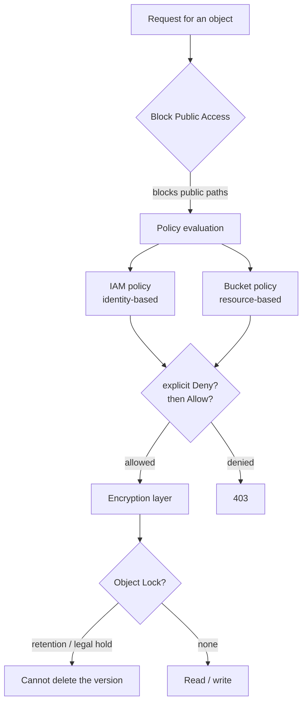

# 09.3 – S3 Security (access, encryption, immutability)

Who can reach an object, how it's encrypted, and how to make it undeletable. The largest exam domain (Secure, 30%) leans on this heavily. Part of [[09-s3]].

## What problem does this solve?

An S3 object is private by default. Nobody but the account that owns it can read it until somebody deliberately widens that. So the whole topic is really about *deliberate widening and narrowing* — and about what stops an accidental widening from becoming a headline.

Three completely different questions get asked about one object, and each one has its own machinery:

1. **Who may reach it?** Answered by policies — one attached to the person, one attached to the bucket.
2. **Who holds the key?** Everything is encrypted at rest anyway. The only real choice is *whose* key, and how auditable its use is.
3. **Can it be deleted at all?** A separate question entirely. Not "who may read this" but "is destruction even possible" — which is what regulators and ransomware defence care about.

The reason these are separate is that they fail separately. An answer to question 1 says nothing about question 3. A perfectly locked-down policy does not stop an admin deleting the object; a WORM lock does not stop the world reading it.

Sitting across the top of question 1 is **Block Public Access** — a guardrail that ignores any policy that would make the bucket public. It exists because a wrong policy is a normal human mistake and the blast radius of *this particular* mistake is "the internet has your data."

> In one line: three unrelated questions — who may read it, who holds the key, can it be deleted at all — with three unrelated mechanisms, plus one guardrail over the first.

## How it actually works

### Two policies pointing at each other

There are two places a permission can live, and they are asking different questions.

| | Attached to | The question it answers |
|---|---|---|
| **IAM policy** | a user, group or role | "What may *this principal* do?" |
| **Bucket policy** | the bucket | "Who may act on *this bucket*?" |

IAM policies are the tool for your own account's identities — that is the job they exist for. The split starts to matter at the edges.

**Cross-account needs both.** Your bucket policy must allow their principal, *and* their IAM policy must allow the call. Either side missing is a denial. This is the single most common "but I granted it!" moment: you can only ever write half the permission, because the other half lives in an account you don't control.

**Anonymous access never comes from an IAM policy.** An IAM policy has to hang off an identity, and an anonymous caller has no identity in your account. So "make this public" is a bucket-policy conversation — or, on the legacy path, an ACL, which is exactly why Block Public Access needs ACL switches as well as policy ones. Bucket policies have a **20 KB** ceiling, and when one bucket is shared by many teams the answer is **Access Points** — named endpoints on the same bucket, each with its own policy and an optional VPC restriction — rather than one enormous policy document.

Evaluation is the same rule as everywhere else in [[01-iam]]: **explicit Deny beats explicit Allow beats implicit deny.** That ordering is what makes the lab bucket work. Its policy contains nothing but `Deny` statements — no TLS, no upload that isn't SSE-KMS — so it holds regardless of how generous anybody's IAM policy is. Denies are the only statements you can write once and stop worrying about.

**ACLs** are the third, pre-IAM mechanism: per-object, legacy, and now discouraged outright. Setting `BucketOwnerEnforced` makes S3 ignore ACLs entirely and makes the bucket owner own every object — the default for buckets created since April 2023.

> In one line: IAM policy asks what a principal may do, bucket policy asks who may touch the bucket, cross-account needs both, and an explicit Deny beats everything.

### Block Public Access, and why there are exactly four switches

Four settings looks fussy until you see the grid. There are **two ways a bucket becomes public** (an ACL, or a policy) and **two timings** (something new arriving, or something that is already there). Two by two:

| | Public via an **ACL** | Public via a **policy** |
|---|---|---|
| **New** ones | `block_public_acls` | `block_public_policy` |
| **Existing** ones | `ignore_public_acls` | `restrict_public_buckets` |

That is the whole design. Blocking only the new ones leaves whatever was already public still public, which is why the "existing" column exists at all.

Now the part that trips people up. BPA does **not** lose to a bucket policy — it **overrides** it. Write a technically perfect public bucket policy with BPA on, and it simply never takes effect. That is deliberate: BPA is a guardrail, not a permission. Permissions are things you grant; a guardrail is a thing you cannot accidentally argue your way past.

It can be set per-bucket **and** account-wide (and org-wide), and S3 enforces the **most restrictive combination** — either level blocking is enough.

The counter-intuitive edge: BPA only concerns itself with **public** paths, so a policy granting only to *named* principals isn't public and BPA leaves it alone. But publicness is judged on the **whole policy** — one stray `"Principal": "*"` statement makes the entire policy public, and `restrict_public_buckets` then cuts the named partner off too. So when a cross-account grant fails, read the whole bucket policy for a public statement before you go looking at the other account's IAM.

> In one line: two ways to become public × two timings = four switches, and BPA overrides policy rather than the other way round.

### Encryption is a question about custody, not about whether

Since **5 January 2023** every object is encrypted at rest automatically with **SSE-S3**. So "is it encrypted?" is no longer the interesting question. The interesting question is *who holds the key* and *what trail its use leaves*.

- **SSE-S3** (`AES256`) — AWS holds the key. Free, and there is no audit trail of key use.
- **SSE-KMS** (`aws:kms`) — your key in KMS. You get a key policy, rotation, and **every use logged in CloudTrail**. That logging is the reason to pay for it. The cost to watch is KMS *request* charges, which **S3 Bucket Keys** cut dramatically with a short-lived bucket-level data key.
- **DSSE-KMS** — two independent AES-256 layers, for compliance mandates that demand multi-layer encryption.
- **SSE-C** — you supply the key on every single request. S3 encrypts and decrypts with it but never stores it. Since **April 2026 it is disabled by default** on new general-purpose buckets and must be deliberately re-enabled.
- **Client-side** — you encrypt before upload, so S3 never sees plaintext or the key. Maximum control, and all the key management is yours.

The four server-side options are **mutually exclusive per object** — an object is encrypted one way, not two. And **default encryption can only be SSE-S3, SSE-KMS or DSSE-KMS, never SSE-C**, which follows from what SSE-C is: the key arrives with the request, so a bucket-level default has nothing to hold.

The rule people get wrong: **changing default encryption does not re-encrypt what's already in the bucket.** Default encryption is a rule applied at *write* time. Objects already sitting there were written under the old rule and keep it until something rewrites them — which is what **S3 Batch Operations → Copy** is for.

Encryption *in transit* is a separate axis with no setting of its own. You enforce it with a bucket policy that denies `s3:*` when `aws:SecureTransport = false`.

> In one line: everything is encrypted anyway, so the choice is whose key and whether CloudTrail sees it — and changing the default only affects new objects.

### A presigned URL is a bearer token wearing your permissions

You need to give one person one file out of a private bucket. Making the bucket public exposes everything. Creating an IAM user for them builds a permanent identity for a one-off. Emailing the file gives you no audit and no way to revoke.

A **presigned URL** is the answer, and its mechanics are worth holding precisely.

The URL carries **the permissions of whoever generated it** — not the recipient's, because the recipient may well have no AWS account at all. That is the whole trick and also the whole danger: generate one from an over-privileged role and you have just handed that privilege to a link.

And it is a **bearer token**. Anyone holding it can use it, until it expires. Forwarded, screenshotted, pasted into a chat — it still works. So the expiry window is your only real control: **7 days maximum via CLI/SDK, 12 hours via the console.**

One trap on top of that: if you signed it with **temporary or role credentials**, the URL dies when those credentials expire, no matter what `--expires-in` said. The signature can never outlive the thing that signed it.

They work for **uploads** too — a presigned `PUT` is the standard way to let a browser upload straight into S3.

> In one line: time-limited, carries the generator's permissions, and works for anyone holding the link — so keep the window short.

### Object Lock, and the delete that succeeds anyway

Object Lock is WORM: write once, read many. It needs **versioning**, and it locks a specific object **version**, not "the object". You can enable Object Lock **either at bucket creation or on an existing versioned bucket** (console, `put-object-lock-configuration`, or the API). What you can *never* do is turn it back **off**, or suspend versioning afterwards — that is the one-way door.

Two independent protections:

- **Retention** — a fixed "retain until" date. It can be **extended, never shortened**.
- **Legal hold** — the same protection with **no expiry**, independent of retention, removed only by an explicit call.

And two modes, which differ only in whether there is a way out:

- **GOVERNANCE** — overridable by a principal holding `s3:BypassGovernanceRetention` (plus the bypass header). A strong internal policy.
- **COMPLIANCE** — *nobody* can overwrite or delete the version, **including the root user**. AWS's documented escape before expiry is closing the AWS account. Which is exactly why the lab used GOVERNANCE with a 1-day retention: identical mechanics, and you can still get your account back.

Now the behaviour that surprises everybody, and it makes sense once you remember that the lock is on a *version*:

| The call | What happens |
|---|---|
| Permanent delete (`DELETE` **with** a version id) | **403 AccessDenied** — you named the protected version |
| Simple delete (`DELETE`, **no** version id) | **200 OK** and a **delete marker** |

The simple delete didn't destroy anything. It laid a delete marker *on top*, so the object stops appearing. The locked version is still underneath, intact. Nothing was violated — but "the file vanished from a WORM bucket" panic is very real.

Finally **MFA Delete**, which protects permanent version deletion and turning versioning off. It can only be configured by the **root account** holding an MFA device, via the CLI. Not an IAM user, not the console, not Terraform — and that root-only constraint is the entire reason it shows up on the exam.

> In one line: the lock protects a version, so a permanent delete gets 403 while a simple delete happily adds a delete marker over the top.

## Exam recap

*Now that the mechanisms are clear, this is the compressed version to revise from.*

> [!info] Exam TL;DR
> - **Three access mechanisms:** **IAM policies** (identity-based — "what may *this principal* do?"), **bucket policies** (resource-based — "who may touch *this bucket*?"), **ACLs** (legacy, now discouraged — disable with `BucketOwnerEnforced`).
> - **Block Public Access = 4 settings** (new/existing × ACL/policy). It **overrides policy** — a valid public policy simply won't take effect. Settable per-bucket **and account-wide**.
> - **Encryption at rest:** **SSE-S3** (AWS keys, AES-256, the automatic default since Jan 2023) · **SSE-KMS** (your KMS key, CloudTrail-audited) · **DSSE-KMS** (two independent AES-256 layers) · **SSE-C** (you supply the key per request) · **client-side** (encrypt before upload). ⚠️ **SSE-C is disabled by default on new buckets since April 2026.**
> - **Changing default encryption does NOT re-encrypt existing objects** — use **S3 Batch Operations Copy**.
> - **Presigned URL** carries the **permissions of whoever generated it**, is time-limited, and works for **anyone holding the link**. Max **7 days** via CLI/SDK, **12 hours** via console.
> - **Object Lock = WORM.** **GOVERNANCE** = overridable with `s3:BypassGovernanceRetention`; **COMPLIANCE** = nobody can delete, *including root*. **Legal hold** = no expiry, removed explicitly. Requires **versioning**.
> - **MFA Delete** can only be configured by the **root account** with an MFA device — not via IAM users, not via Terraform.

## AWS console ↔ Terraform map

| Concept | Terraform | Notes |
|---|---|---|
| Bucket policy | `aws_s3_bucket_policy` + `data.aws_iam_policy_document` | Resource-based. Explicit `Deny` beats any Allow ([[01-iam]]). |
| Block Public Access | `aws_s3_bucket_public_access_block` | All four `true` for normal buckets. |
| Account-wide BPA | `aws_s3_account_public_access_block` | The recommended account default. |
| Disable ACLs | `aws_s3_bucket_ownership_controls` | `object_ownership = "BucketOwnerEnforced"`. |
| Default encryption | `aws_s3_bucket_server_side_encryption_configuration` | `AES256` (SSE-S3) or `aws:kms` (+ `bucket_key_enabled`). |
| KMS key | `aws_kms_key` + `aws_kms_alias` | Destroy only *schedules* deletion (7–30 days). |
| Object Lock (create-time) | `object_lock_enabled` on `aws_s3_bucket` | Forces a new bucket if changed. Needs versioning. |
| Object Lock retention | `aws_s3_bucket_object_lock_configuration` | `mode` GOVERNANCE/COMPLIANCE + `days`/`years`. |
| Presigned URL | **none** — runtime, not infrastructure | `aws s3 presign …` / SDK. |
| MFA Delete | **none** — root + MFA via CLI only | Cannot be Terraformed. |
| Access Point | `aws_s3_access_point` | Named entry point with its own policy, for shared buckets. |

## Architecture diagram

## Key facts, limits & pricing

### Access control
- **IAM policy** = attached to a *principal*, answers "what can this user/role do?" Use for your own account's identities.
- **Bucket policy** = attached to the *bucket*, answers "who may act on this bucket?" Required for **cross-account** access and for **anonymous/public** access. Max size **20 KB**.
- **ACLs** = legacy, per-object, pre-IAM. AWS now recommends disabling them; **`BucketOwnerEnforced`** ignores ACLs entirely and makes the bucket owner own every object — the default for buckets created since April 2023.
- **Evaluation** follows the [[01-iam]] rule: explicit **Deny** > explicit **Allow** > implicit deny. For **cross-account**, the request must be allowed by **both** the caller's IAM policy *and* the bucket policy.
- **Access Points** — named endpoints on a shared bucket, each with its own policy and optional VPC restriction. Simplifies "one bucket, many teams" without one giant bucket policy.

### Block Public Access — the four settings
| Setting | Blocks |
|---|---|
| `block_public_acls` | **New** public ACLs |
| `ignore_public_acls` | **Existing** public ACLs |
| `block_public_policy` | **New** public bucket policies |
| `restrict_public_buckets` | **Existing** public policies — and, once a policy counts as public, *every* cross-account grant inside it |

Two ways to become public (ACL, policy) × two timings (new, existing). All four on = the bucket cannot be made public even by a valid policy. Available at **bucket** and **account** level; account level wins.

### Encryption at rest (verified 2026-08)
| Option | Who holds/manages the key | Notes |
|---|---|---|
| **SSE-S3** (`AES256`) | AWS | **The automatic base level for every bucket since 5 Jan 2023.** Free, no audit trail of key use. |
| **SSE-KMS** (`aws:kms`) | You, in KMS | Key policy, rotation, and **every use logged in CloudTrail**. KMS request costs → use **S3 Bucket Keys**. |
| **DSSE-KMS** | You, in KMS | **Two independent AES-256 layers** (KMS data key + separate S3-managed key) for multi-layer compliance mandates. |
| **SSE-C** | **You** — supplied on every request | S3 encrypts/decrypts but never stores your key. ⚠️ **Disabled by default on all new general-purpose buckets since April 2026** — must be deliberately re-enabled via `PutBucketEncryption`. |
| **Client-side** | You, before upload | S3 never sees plaintext or the key. Maximum control, all key management is yours. |

- The four server-side options are **mutually exclusive** per object.
- **Default encryption may be SSE-S3, SSE-KMS or DSSE-KMS — not SSE-C.**
- **Changing the default does not re-encrypt existing objects.** Re-encrypt with **S3 Batch Operations → Copy**.
- **S3 Bucket Keys** — a short-lived bucket-level data key that cuts SSE-KMS request calls (and cost) dramatically.
- **In transit:** enforce TLS with a bucket policy denying `aws:SecureTransport = false`.

### Presigned URLs
- Grants **time-limited** access to a private object using **the credentials of whoever generated it** — the URL inherits *their* permissions, not the recipient's.
- **Anyone holding the link can use it** until it expires. It is a bearer token; treat it like one.
- Max expiry: **7 days (604800s)** via CLI/SDK, **12 hours** via the console.
- If signed with **temporary/role credentials**, it dies when those credentials expire, regardless of `--expires-in`.
- Works for **uploads** too (presigned `PUT`), which is the standard "let a browser upload directly to S3" pattern.

### Object Lock (WORM) — verified 2026-08
- **Requires versioning**; locks a specific object **version**. `object_lock_enabled` is a **create-time** bucket property.
- **Retention period** — fixed "retain until" date. Can be **extended**, never shortened.
- **Legal hold** — same protection, **no expiry**, independent of retention, removed explicitly (`s3:PutObjectLegalHold`).
- **GOVERNANCE mode** — overridable by a principal with **`s3:BypassGovernanceRetention`** plus the `x-amz-bypass-governance-retention:true` header.
- **COMPLIANCE mode** — *"a protected object version can't be overwritten or deleted by any user, including the root user"*; AWS states the only way out before expiry is **closing the AWS account**.
- **Deletes behave differently** (exam-critical): a **permanent** `DELETE` (with a version id) → **403 AccessDenied**; a **simple** `DELETE` (no version id) → **200 OK and a delete marker**. The locked version survives underneath — the object is hidden, not destroyed.

### MFA Delete
- Requires the **root** account with an MFA device, configured via CLI. **Not** possible from an IAM user, the console, or Terraform.
- Protects permanent version deletion and disabling versioning. Rare in practice; exam-relevant precisely because of the root-only constraint.

## Comparisons

### IAM policy vs bucket policy vs ACL

|   | IAM policy | Bucket policy | ACL (legacy) |
|---|---|---|---|
| Attached to | A user/group/role | The bucket | Bucket or object |
| Answers | "What can this principal do?" | "Who can touch this resource?" | "Who can read/write this object?" |
| Cross-account | Needs the resource side too | **Yes — the usual mechanism** | Yes, but discouraged |
| Anonymous/public | No | **Yes** | Yes |
| Recommended | ✅ | ✅ | ❌ disable via `BucketOwnerEnforced` |

### GOVERNANCE vs COMPLIANCE

|   | GOVERNANCE | COMPLIANCE |
|---|---|---|
| Who can delete early | Anyone with `s3:BypassGovernanceRetention` | **Nobody — including root** |
| Retention can be shortened | Yes (with bypass) | **No** |
| Use for | Internal policy, testing settings first | Regulatory WORM (SEC 17a-4, FINRA) |
| Escape hatch | The bypass permission | Close the AWS account |

## Worked examples

> [!example] Worked example — the bucket that cannot leak
> A data bucket must never be public, must never accept plaintext traffic, and must never hold an unencrypted object. Three independent layers do it, and none relies on the others: **(1) Block Public Access**, all four on, so any public policy is inert regardless of what a developer writes. **(2)** A bucket policy that **denies** `s3:*` when `aws:SecureTransport = false`, so HTTP requests fail before anything else is considered. **(3)** A bucket policy that **denies** `s3:PutObject` when `s3:x-amz-server-side-encryption != aws:kms`, so an unencrypted upload is rejected even from an admin. Plus `BucketOwnerEnforced` so no ACL can quietly grant access. Built in `09-s3/security.tf` — and note the leverage: these are **Deny** statements, so they hold no matter how generous someone's IAM policy is.

> [!failure] Failure mode — "the bucket policy grants access, so cross-account works"
> A partner account is given `s3:GetObject` in your bucket policy and still gets `AccessDenied`. Cross-account access needs **both sides**: your bucket policy must allow their principal **and** their IAM policy must allow the call. Either one missing = denied. A second, sneakier version: the bucket policy is right, but **Block Public Access → `restrict_public_buckets`** is neutralising a policy that names a wildcard principal. Debug order: is it a *public* grant (BPA will kill it) or a *named-principal* grant (BPA doesn't apply, so check the other account's IAM).

> [!failure] Failure mode — Object Lock in COMPLIANCE mode on a test bucket
> Someone enables Object Lock with **COMPLIANCE** mode and a 1-year retention "to see how it works", then uploads files. Those objects **cannot be deleted by anyone, including the account root**, for a year — and the bucket cannot be deleted while they exist. AWS's documented escape is *closing the AWS account*. In this lab we deliberately used **GOVERNANCE, 1 day**, which teaches the same mechanics and stays reversible. Never demo COMPLIANCE mode on an account you intend to keep.

> [!example] Worked example — sharing one private object without giving away credentials
> A user needs to download one report from a private bucket. Options that are *wrong*: making the bucket public (exposes everything), creating an IAM user for them (a permanent identity for a one-off), or emailing the file (no audit, no revocation). The right answer is a **presigned URL**: `aws s3 presign s3://bucket/report.pdf --expires-in 3600` produces a link that works for one hour, for that one object, carrying *your* permissions. The trade-off to state out loud: it's a **bearer token** — anyone who gets the link has it until expiry, so keep the window short.

## The Terraform I wrote

Code: [`09-s3/security.tf`](../09-s3/security.tf) (secure-by-default bucket) + [`09-s3/objectlock.tf`](../09-s3/objectlock.tf) (WORM bucket).

*(Written collaboratively — reviewed, applied and verified by me; the exam value here is conceptual rather than in the HCL.)*

- **Secure bucket:** Block Public Access ×4, `BucketOwnerEnforced`, customer-managed KMS key + default SSE-KMS with `bucket_key_enabled`, versioning, and a bucket policy of pure **Deny**s (non-TLS, non-SSE-KMS uploads). Verified live: `aws s3 cp` succeeded and `head-object` showed `aws:kms`; the same upload with `--sse AES256` was **denied** by the policy.
- **Object Lock bucket:** `object_lock_enabled` at create time, versioning, GOVERNANCE default retention of 1 day. Verified the delete asymmetry — permanent delete (`--version-id`) → **403**, simple `rm` → **200 + delete marker** with the version intact underneath.

Non-obvious things:
- `object_lock_enabled` is **create-time**; it can't be toggled on a live bucket in Terraform without replacement.
- A KMS customer-managed key costs ~$1/month and `terraform destroy` only **schedules** deletion (7-day minimum) — by design, so you can't destroy the key that decrypts your data.
- Presigned URLs and MFA Delete have **no Terraform surface at all** — the first is runtime, the second is root-only.

> [!warning] Trap — Block Public Access can be overridden by a bucket policy
> Backwards. **BPA overrides the policy.** A perfectly valid public bucket policy is simply ignored while BPA is on. That's the point — it's a guardrail, not a permission.

> [!warning] Trap — enabling default encryption encrypts what's already there
> It doesn't. Default encryption applies to **new** objects only. Existing objects keep their previous encryption until you rewrite them — **S3 Batch Operations → Copy**.

> [!warning] Trap — a presigned URL uses the recipient's permissions
> It uses **the generator's**. That's why it works for someone with no AWS account at all — and why generating one from an over-privileged role is dangerous.

> [!warning] Trap — Object Lock stops the object being deleted
> It stops that **version** being deleted. A simple `DELETE` still returns **200 OK** and adds a **delete marker**, hiding the object. Nothing was destroyed, but "it disappeared" panic is real.

> [!warning] Trap — MFA Delete can be set up like any other bucket setting
> Only the **root account** with an MFA device can enable it, via CLI. Not IAM users, not the console, not Terraform.

> [!example]- Recreate-from-memory drill
> Build a bucket that: blocks all public access, disables ACLs, encrypts by default with a KMS key, refuses non-HTTPS requests, and refuses any upload that isn't SSE-KMS. Then prove the last one by uploading with `--sse AES256` and getting denied. Separately, build an Object Lock bucket in GOVERNANCE mode and demonstrate that a permanent delete fails while a simple delete adds a marker.
> > [!success]- Reference solution
> > `09-s3/security.tf` + `09-s3/objectlock.tf`. Key points: all four BPA flags, `BucketOwnerEnforced`, two Deny statements (`aws:SecureTransport`, `s3:x-amz-server-side-encryption`), `depends_on` the BPA before the policy, `object_lock_enabled` at create time with versioning.

## 🔴 My weak spots (this topic)   #weak-spot

- [ ] **The four Block Public Access settings** — why four (new/existing × ACL/policy), and that BPA **overrides** policy rather than the other way round.
- [ ] **Which encryption option means what** — especially **DSSE-KMS** (two layers) and that **SSE-C is now off by default (April 2026)**.
- [ ] **Default encryption doesn't touch existing objects** — needs S3 Batch Operations Copy.
- [ ] **Presigned URLs carry the generator's permissions**, are bearer tokens, max 7 days CLI / 12 hours console.
- [ ] **Object Lock delete asymmetry** — permanent delete 403, simple delete 200 + delete marker.
- [ ] **COMPLIANCE mode is irreversible even for root** — never demo it on a real account.
- [ ] **MFA Delete is root-only**, no Terraform path.

## 🔗 Docs

- [Server-side encryption overview](https://docs.aws.amazon.com/AmazonS3/latest/userguide/serv-side-encryption.html) — the four SSE options, SSE-S3 default since Jan 2023, **SSE-C disabled by default April 2026**; verified 2026-08
- [Object Lock](https://docs.aws.amazon.com/AmazonS3/latest/userguide/object-lock.html) — WORM, GOVERNANCE vs COMPLIANCE, legal holds, delete behaviour; verified 2026-08
- [Sharing objects with presigned URLs](https://docs.aws.amazon.com/AmazonS3/latest/userguide/ShareObjectPreSignedURL.html) — generator's credentials, 7-day CLI / 12-hour console limits; verified 2026-08
- [Blocking public access](https://docs.aws.amazon.com/AmazonS3/latest/userguide/access-control-block-public-access.html)
- [Bucket policies](https://docs.aws.amazon.com/AmazonS3/latest/userguide/bucket-policies.html) / [Object Ownership](https://docs.aws.amazon.com/AmazonS3/latest/userguide/about-object-ownership.html)
- [Terraform `aws_s3_bucket_public_access_block`](https://registry.terraform.io/providers/hashicorp/aws/latest/docs/resources/s3_bucket_public_access_block) / [`aws_s3_bucket_object_lock_configuration`](https://registry.terraform.io/providers/hashicorp/aws/latest/docs/resources/s3_bucket_object_lock_configuration)

---
**Self-test for this topic:** [[revision/09-s3-security-revision#Self-test]]
