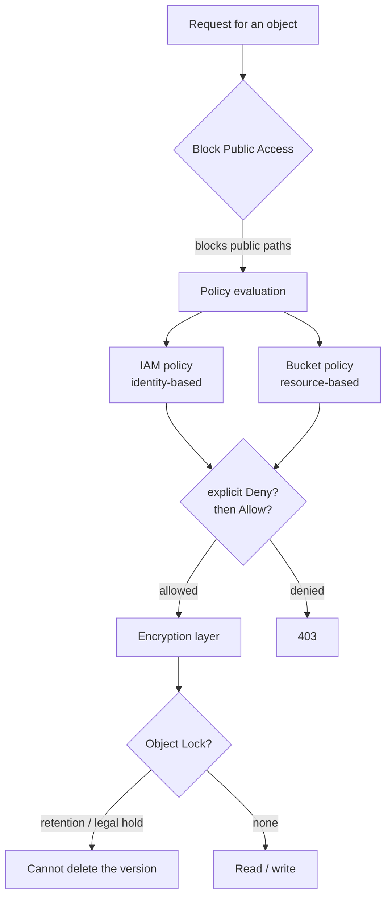

# 09.3 – S3 Security (access, encryption, immutability)

Who can reach an object, how it's encrypted, and how to make it undeletable. The largest exam domain (Secure, 30%) leans on this heavily. Part of [[09-s3]].

> [!info] Exam TL;DR
> - **Three access mechanisms:** **IAM policies** (identity-based — "what may *this principal* do?"), **bucket policies** (resource-based — "who may touch *this bucket*?"), **ACLs** (legacy, now discouraged — `BucketOwnerEnforced` makes S3 ignore ACLs entirely and the bucket owner own every object, and it is the **default on new buckets**).
> - **Block Public Access = 4 settings** (ACL/policy × reject-the-write / ignore-at-request-time — *not* new vs existing). It **overrides policy** — a valid public policy simply won't take effect. Settable on an **access point, bucket, account and org-wide**; the **most restrictive** combination applies.
> - **Encryption at rest:** **SSE-S3** (AWS keys, AES-256, the automatic default since Jan 2023) · **SSE-KMS** (your KMS key, CloudTrail-audited) · **DSSE-KMS** (two independent AES-256 layers) · **SSE-C** (you supply the key per request) · **client-side** (encrypt before upload). The four server-side options are **mutually exclusive per object**. ⚠️ **SSE-C has been disabled by default since April 2026 — on new buckets *and* on existing buckets in accounts that had no SSE-C objects.**
> - **Changing default encryption does NOT re-encrypt existing objects** — use **S3 Batch Operations Copy**.
> - **Presigned URL** carries the **permissions of whoever generated it**, is time-limited, and works for **anyone holding the link**. Max **7 days** via CLI/SDK, **12 hours** via console.
> - **Object Lock = WORM** (write once, read many). **GOVERNANCE** = overridable with `s3:BypassGovernanceRetention`; **COMPLIANCE** = nobody can delete, *including root*. **Legal hold** = no expiry, removed explicitly. Requires **versioning**.
> - **MFA Delete** can only be configured by the **root account** (the bucket-owning account) with an MFA device, and **never from the console** — you must use the **CLI or the API/SDKs**. Not by an IAM user. It also **cannot be used together with lifecycle configurations**.

## What problem does this solve?

An S3 object is private by default. Nobody but the account that owns it can read it until somebody deliberately widens that. So the whole topic is really about *deliberate widening and narrowing* — and about what stops an accidental widening from becoming a headline.

Three completely different questions get asked about one object, and each one has its own machinery:

1. **Who may reach it?** Answered by policies — one attached to the person, one attached to the bucket.
2. **Who holds the key?** Everything is encrypted at rest anyway. The only real choice is *whose* key, and how auditable its use is.
3. **Can it be deleted at all?** A separate question entirely. Not "who may read this" but "is destruction even possible" — which is what regulators and ransomware defence care about.

The reason these are separate is that they fail separately. An answer to question 1 says nothing about question 3. A perfectly locked-down policy does not stop an admin deleting the object; a WORM lock does not stop the world reading it.

Sitting across the top of question 1 is **Block Public Access** — a guardrail that ignores any policy that would make the bucket public. It exists because a wrong policy is a normal human mistake and the blast radius of *this particular* mistake is "the internet has your data."

> In one line: three unrelated questions — who may read it, who holds the key, can it be deleted at all — with three unrelated mechanisms, plus one guardrail over the first.

## How it actually works

### Two policies pointing at each other

There are two places a permission can live, and they are asking different questions.

| | Attached to | The question it answers |
|---|---|---|
| **IAM policy** | a user, group or role | "What may *this principal* do?" |
| **Bucket policy** | the bucket | "Who may act on *this bucket*?" |

IAM policies are the tool for your own account's identities — that is the job they exist for. The split starts to matter at the edges.

**Cross-account needs both.** Your bucket policy must allow their principal, *and* their IAM policy must allow the call. Either side missing is a denial. This is the single most common "but I granted it!" moment: you can only ever write half the permission, because the other half lives in an account you don't control.

**Anonymous access never comes from an IAM policy.** An IAM policy has to hang off an identity, and an anonymous caller has no identity in your account. So "make this public" is a bucket-policy conversation — or, on the legacy path, an ACL, which is exactly why Block Public Access needs ACL switches as well as policy ones. Bucket policies have a **20 KB** ceiling, and when one bucket is shared by many teams the answer is **Access Points** — named endpoints on the same bucket, each with its own policy and an optional VPC restriction — rather than one enormous policy document.

Evaluation is the same rule as everywhere else in [[01-iam]]: **explicit Deny beats explicit Allow beats implicit deny.** That ordering is what makes a hardened bucket work: give it a policy containing nothing but `Deny` statements — one denying any request not over TLS, one denying any upload that is not SSE-KMS — and it holds regardless of how generous anybody's IAM policy is. (The worked example "the bucket that cannot leak" below builds exactly that.) Denies are the only statements you can write once and stop worrying about.

**ACLs** are the third, pre-IAM mechanism: per-object, legacy, and now discouraged outright. Setting `BucketOwnerEnforced` makes S3 ignore ACLs entirely and makes the bucket owner own every object. It is now **the default for every newly created bucket**, with ACLs disabled — so on any bucket you create today, ACLs are already out of the picture unless you deliberately turn them back on.

> In one line: IAM policy asks what a principal may do, bucket policy asks who may touch the bucket, cross-account needs both, and an explicit Deny beats everything.

### Block Public Access, and why there are exactly four switches

Four settings looks fussy until you see the grid. There are **two ways a bucket becomes public** (an ACL, or a policy) and **two enforcement styles**: *reject the write that would make it public*, or *ignore the publicness at request time*. Two by two:

| | Public via an **ACL** | Public via a **policy** |
|---|---|---|
| **Reject the write** | `BlockPublicAcls` — `PutBucketAcl`/`PutObjectAcl` fail if the ACL is public | `BlockPublicPolicy` — `PutBucketPolicy` is rejected if the policy allows public access |
| **Ignore at request time** | `IgnorePublicAcls` — S3 ignores *all* public ACLs on the bucket and its objects | `RestrictPublicBuckets` — a bucket whose policy is public is limited to AWS service principals and the owner account |

AWS spells the four settings `BlockPublicAcls`, `IgnorePublicAcls`, `BlockPublicPolicy` and `RestrictPublicBuckets` in the API; the console shows them as longhand sentences ("Block public access to buckets and objects granted through *new* access control lists (ACLs)", and so on).

**The axis is not "new versus existing", which is the natural guess and is wrong.** AWS says of `IgnorePublicAcls` that enabling it "doesn't affect the persistence of any existing ACLs and **doesn't prevent new public ACLs from being set**" — it simply ignores every public ACL, whenever it arrived. So a public ACL applied *after* BPA is on is still ignored, and the object is still not public. Reading the grid as a timing grid gets that stem backwards. *(Corrected 2026-10-06.)*

Now the part that trips people up. BPA does **not** lose to a bucket policy — it **overrides** it. Write a technically perfect public bucket policy with BPA on, and it simply never takes effect. That is deliberate: BPA is a guardrail, not a permission. Permissions are things you grant; a guardrail is a thing you cannot accidentally argue your way past.

It can be set at **four** levels — on an **access point**, a **bucket**, an **account**, and **org-wide** through AWS Organizations — and S3 enforces the **most restrictive combination** across them, so whichever level blocks more wins. Two wrinkles: at the org level the four settings go on or off **together**, all-or-none, and they override account-level settings; and an access point's BPA settings are **fixed at creation** and cannot be changed afterwards.

The counter-intuitive edge: BPA only concerns itself with **public** paths, so a policy granting only to *named* principals isn't public and BPA leaves it alone. But publicness is judged on the **whole policy** — one stray `"Principal": "*"` statement makes the entire policy public, and `RestrictPublicBuckets` then cuts the named partner off too — AWS's own worked example has a policy granting CloudTrail, granting Account-2, and granting `"Principal": "*"`; with `RestrictPublicBuckets` on, only CloudTrail gets through and Account-2 is cut off until the public statement is removed. So when a cross-account grant fails, read the whole bucket policy for a public statement before you go looking at the other account's IAM.

> In one line: two ways to become public × two timings = four switches, and BPA overrides policy rather than the other way round.

### Encryption is a question about custody, not about whether

Since **5 January 2023** every object is encrypted at rest automatically with **SSE-S3**. So "is it encrypted?" is no longer the interesting question. The interesting question is *who holds the key* and *what trail its use leaves*.

- **SSE-S3** (`AES256`) — AWS holds the key. Free, and you get **no key policy and no record of who used the key** — which is the real contrast with SSE-KMS. (Be precise about the negative: an object's *encryption status* does surface in CloudTrail, S3 Inventory, Storage Lens and the console; what you don't get is a per-use trail of the key itself.)
- **SSE-KMS** (`aws:kms`) — your key in KMS. You get a key policy, rotation, and **every use logged in CloudTrail**. That logging is the reason to pay for it. The cost to watch is KMS *request* charges: without Bucket Keys, object operations drive KMS calls. An **S3 Bucket Key** is a short-lived, bucket-level data key that S3 uses to derive per-object keys, which replaces most of those KMS calls while the objects stay SSE-KMS.
- **DSSE-KMS** — two independent AES-256 layers, for compliance mandates that demand multi-layer encryption.
- **SSE-C** — you supply the key on every single request. S3 encrypts and decrypts with it but never stores it. Since **April 2026 it is disabled by default**, and the scope is wider than "new buckets": AWS disabled it for all new write requests on **every new general-purpose bucket** *and* on **existing buckets in any account that held no SSE-C-encrypted objects**. Applications that need it "must deliberately enable SSE-C by using the `PutBucketEncryption` API operation". Existing SSE-C objects still read fine with the key.
- **Client-side** — you encrypt before upload, so S3 never sees plaintext or the key. Maximum control, and all the key management is yours.

The four server-side options are **mutually exclusive per object** — an object is encrypted one way, not two. And the default encryption **algorithm** can only be SSE-S3, SSE-KMS or DSSE-KMS, **never SSE-C** — which follows from what SSE-C is: the key arrives with the request, so a bucket-level default has nothing to hold. Since April 2026 there is a twist worth separating: whether a bucket *accepts* SSE-C writes at all is **also** configured through `PutBucketEncryption`. Same API call, different field — the default algorithm and the SSE-C block are two distinct settings, so "you configure SSE-C with PutBucketEncryption" and "SSE-C can't be a default" are both true.

The rule people get wrong: **changing default encryption does not re-encrypt what's already in the bucket.** Default encryption is a rule applied at *write* time. Objects already sitting there were written under the old rule and keep it until something rewrites them — which is what **S3 Batch Operations → Copy** is for ([[09-s3-advanced]] owns Batch Operations).

Encryption *in transit* is a separate axis with no setting of its own. You enforce it with a bucket policy that denies `s3:*` when `aws:SecureTransport = false`.

> In one line: everything is encrypted anyway, so the choice is whose key and whether CloudTrail sees it — and changing the default only affects new objects.

### A presigned URL is a bearer token wearing your permissions

You need to give one person one file out of a private bucket. Making the bucket public exposes everything. Creating an IAM user for them builds a permanent identity for a one-off. Emailing the file gives you no audit and no way to revoke.

A **presigned URL** is the answer, and its mechanics are worth holding precisely.

The URL carries **the permissions of whoever generated it** — not the recipient's, because the recipient may well have no AWS account at all. That is the whole trick and also the whole danger: generate one from an over-privileged role and you have just handed that privilege to a link.

And it is a **bearer token**. Anyone holding it can use it, until it expires. Forwarded, screenshotted, pasted into a chat — it still works. So the expiry window is your only real control: **7 days maximum via CLI/SDK, 12 hours via the console.**

One trap on top of that: if you signed it with **temporary or role credentials**, the URL dies when those credentials expire, no matter what `--expires-in` said. The signature can never outlive the thing that signed it.

They work for **uploads** too — a presigned `PUT` is the standard way to let a browser upload straight into S3.

> In one line: time-limited, carries the generator's permissions, and works for anyone holding the link — so keep the window short.

### Object Lock, and the delete that succeeds anyway

Object Lock is WORM: write once, read many. It needs **versioning** ([[09-s3-intro]] covers how versioning behaves), and it locks a specific object **version**, not "the object". You can enable Object Lock **either at bucket creation or on an existing versioned bucket** (console, `put-object-lock-configuration`, or the API). What you can *never* do is turn it back **off**, or suspend versioning afterwards — that is the one-way door.

Two independent protections:

- **Retention** — a "retain until" date, and it now comes in **two types**. With **fixed** retention you give the date up front. With **variable** retention you instead turn on an **event hold** with a duration: while the hold is on the retain-until date floats forward, and S3 **fixes it at release time + duration** when you release the hold. Lowering the duration never pulls the date earlier, and if you also gave a retain-until date it acts as a floor. Variable retention is for when you don't know the date at write time — a ransomware recovery window, or a retention clock that should start at contract completion. A retention period can always be **extended** (any principal with `s3:PutObjectRetention`); whether it can be **shortened** depends on the mode, below.
- **Legal hold** — the same protection with **no expiry**, independent of retention, removed only by an explicit call. Anyone with `s3:PutObjectLegalHold` can place or remove one freely. If a retention period expires while a legal hold is on, the object stays protected.

Neither protection stops a **new version** being written or a **delete marker** being added on top — they protect the specific version they were applied to. And an object version's **own** retention settings override any default retention configured on the bucket.

And two modes, which differ only in whether there is a way out:

- **GOVERNANCE** — overridable by a principal holding `s3:BypassGovernanceRetention` **plus** the `x-amz-bypass-governance-retention:true` request header. Worth knowing: the **S3 console sends that header by default**, so in the console a user who holds the permission simply succeeds. A strong internal policy, not a wall.
- **COMPLIANCE** — *nobody* can overwrite or delete the version, **including the root user**; the retention mode can't be changed and the period can't be shortened. AWS's documented escape before expiry is stark: *"The only way to delete an object under the compliance mode before its retention date expires is to delete the associated AWS account."* Which is exactly why a learning lab should use GOVERNANCE with a 1-day retention: identical mechanics, and you can still get your account back.

So "extended, never shortened" is precise only for COMPLIANCE. Under GOVERNANCE, shortening is possible for someone with the bypass permission and header.

Now the behaviour that surprises everybody, and it makes sense once you remember that the lock is on a *version*:

| The call | What happens |
|---|---|
| Permanent delete (`DELETE` **with** a version id) | **403 AccessDenied** — you named the protected version |
| Simple delete (`DELETE`, **no** version id) | **200 OK** and a **delete marker** |

The simple delete didn't destroy anything. It laid a delete marker *on top*, so the object stops appearing. The locked version is still underneath, intact. Nothing was violated — but "the file vanished from a WORM bucket" panic is very real.

Finally **MFA Delete**, which protects permanent version deletion and turning versioning off. Only the **root account** that owns the bucket, holding an MFA device, can enable it — *"only the bucket owner (root account) can enable MFA delete"* — and it **cannot be done in the console**: *"You must use the AWS Command Line Interface (AWS CLI) or the API."* Note the "or the API": the common shorthand "CLI-only" is wrong, and the same page documents the REST route via `PutBucketVersioning`. Two more constraints worth holding: the MFA state lives in the **same versioning subresource** as the versioning status (which is why one API call sets both), and MFA Delete **cannot be used with lifecycle configurations** at all. That root-only constraint is the reason it shows up on the exam.

> In one line: the lock protects a version, so a permanent delete gets 403 while a simple delete happily adds a delete marker over the top.

## Architecture diagram

```mermaid
flowchart TB
    REQ[Request for an object] --> BPA{Block Public Access}
    BPA -->|blocks public paths| EVAL[Policy evaluation]
    EVAL --> IAM[IAM policy<br/>identity-based]
    EVAL --> BP[Bucket policy<br/>resource-based]
    IAM --> DEC{explicit Deny?<br/>then Allow?}
    BP --> DEC
    DEC -->|allowed| ENC[Encryption layer]
    DEC -->|denied| NO[403]
    ENC --> OL{Object Lock?}
    OL -->|retention / legal hold| WORM[Cannot delete the version]
    OL -->|none| OK[Read / write]
```

## Key facts, limits & pricing

- **Conditions in one `Condition` block are ANDed** — a `Condition` element can hold multiple condition operators, and each operator multiple key/value pairs, and all of them must hold. (⚠️ verify: AWS carries this rule in a diagram rather than a sentence; confirm against *Set operators for multivalued context keys* before leaning on it, and note multivalued keys need `ForAllValues`/`ForAnyValue`.) So `IpAddress` (allow this CIDR) together with `NotIpAddress` (except this address) in the **same statement** authorises *the range **minus** the carved-out address* — one grant with two tests, not two separate grants. The same shape appears as `aws:SourceIp` allow-plus-exclude in bucket policies and SCPs. One interaction worth knowing: Block Public Access judges an `aws:SourceIp` condition **public** if the range is very broad — AWS counts anything wider than `/8` for IPv4 or `/32` for IPv6 (private RFC1918 ranges excluded) — so a policy you meant to scope by IP can still be rejected as public. Getting this backwards and reading them as alternatives is why a policy looks more permissive than it is.
- **S3 Access Point use can itself be bounded at the Organization level** — the access point carries its own policy, and an organization-level guardrail bounds it from above, which is how per-team least privilege is enforced at scale on a shared bucket. ⚠️ verify whether AWS documents this as an **SCP** (bounding what member-account principals may do) or an **RCP** (bounding what may be done to resources in member accounts) for access-point operations specifically — see [[01-iam-advanced]] for the distinction.

### Access control
- **IAM policy** = attached to a *principal*, answers "what can this user/role do?" Use for your own account's identities.
- **Bucket policy** = attached to the *bucket*, answers "who may act on this bucket?" The usual mechanism for **cross-account** access, and the only non-legacy mechanism for **anonymous/public** access (ACLs being the legacy one). Max size **20 KB**. Careful with "required": cross-account can also be done with **no bucket policy at all**, by having the other account's principal **assume a role** in your account — then the caller *is* one of your own principals and the ordinary identity-based path applies. Both patterns are examinable; the role route is what AWS recommends when the partner needs broader access than one bucket.
- **ACLs** = legacy, per-object, pre-IAM. AWS now recommends disabling them; **`BucketOwnerEnforced`** ignores ACLs entirely and makes the bucket owner own every object — AWS states it is "the default setting for all newly created buckets". ⚠️ verify: the "since April 2023" rollout date is not stated on the Object Ownership page, so treat the date as unsourced while the default itself is confirmed.
- **Evaluation** follows the [[01-iam]] rule: explicit **Deny** > explicit **Allow** > implicit deny. For **cross-account**, the request must be allowed by **both** the caller's IAM policy *and* the bucket policy.
- **Access Points** — named endpoints on a shared bucket, each with its own policy and optional VPC restriction. Simplifies "one bucket, many teams" without one giant bucket policy.

### Block Public Access — the four settings
| Setting (API name) | What it does |
|---|---|
| `BlockPublicAcls` | **Rejects** `PutBucketAcl`/`PutObjectAcl`/`PutObject` calls that carry a public ACL |
| `IgnorePublicAcls` | **Ignores** all public ACLs on the bucket and its objects — existing *and* newly set ones |
| `BlockPublicPolicy` | **Rejects** a `PutBucketPolicy` that allows public access |
| `RestrictPublicBuckets` | Limits a bucket whose policy is **public** to AWS service principals and the owner account — which cuts off *every* cross-account grant inside that policy |

Two ways to become public (ACL, policy) × two enforcement styles (reject the write, ignore at request time) — **not** new vs existing. All four on = the bucket cannot be made public even by a valid policy. Settable at **access point**, **bucket**, **account** and **organization** level; S3 applies the **most restrictive combination**, so either level blocking is enough.

### Encryption at rest (verified 2026-08)
| Option | Who holds/manages the key | Notes |
|---|---|---|
| **SSE-S3** (`AES256`) | AWS | **The automatic base level for every bucket since 5 Jan 2023.** Free, no audit trail of key use. |
| **SSE-KMS** (`aws:kms`) | You, in KMS | Key policy, rotation, and **every use logged in CloudTrail**. KMS request costs → use **S3 Bucket Keys**. |
| **DSSE-KMS** | You, in KMS | **Two independent AES-256 layers** (KMS data key + separate S3-managed key) for multi-layer compliance mandates. |
| **SSE-C** | **You** — supplied on every request | S3 encrypts/decrypts but never stores your key. ⚠️ **Disabled by default on all new general-purpose buckets since April 2026** — must be deliberately re-enabled via `PutBucketEncryption`. |
| **Client-side** | You, before upload | S3 never sees plaintext or the key. Maximum control, all key management is yours. |

- The four server-side options are **mutually exclusive** per object.
- **Default encryption may be SSE-S3, SSE-KMS or DSSE-KMS — not SSE-C.**
- **Changing the default does not re-encrypt existing objects.** Re-encrypt with **S3 Batch Operations → Copy**.
- **S3 Bucket Keys** — a short-lived bucket-level data key that cuts SSE-KMS request calls (and cost) dramatically.
- **In transit:** enforce TLS with a bucket policy denying `aws:SecureTransport = false`.

### Presigned URLs
- Grants **time-limited** access to a private object using **the credentials of whoever generated it** — the URL inherits *their* permissions, not the recipient's.
- **Anyone holding the link can use it** until it expires. It is a bearer token; treat it like one.
- Max expiry: **7 days (604800s)** via CLI/SDK, **12 hours** via the console.
- If signed with **temporary/role credentials**, it dies when those credentials expire, regardless of `--expires-in`.
- Works for **uploads** too (presigned `PUT`), which is the standard "let a browser upload directly to S3" pattern.

### Object Lock (WORM) — verified 2026-08
- **Requires versioning** and locks a specific object **version**, not "the object". It can be enabled **either when creating the bucket or on an existing versioned bucket** (console, CLI, SDK or REST) — AWS documents both. What is irreversible is the other direction: once enabled you **cannot disable Object Lock or suspend versioning** on that bucket. A bucket with Object Lock also **cannot be a destination for server access logs**. *(Verified 2026-09-30.)*
- **Retention period** — a "retain until" date, **fixed** (date given up front) or **variable** (event hold + duration; the date is fixed at release time + duration). Always **extendable** by anyone with `s3:PutObjectRetention`. **Shortening** is impossible under COMPLIANCE; under GOVERNANCE it needs `s3:BypassGovernanceRetention` plus the bypass header.
- **Legal hold** — same protection, **no expiry**, independent of retention, removed explicitly (`s3:PutObjectLegalHold`).
- **GOVERNANCE mode** — overridable by a principal with **`s3:BypassGovernanceRetention`** plus the `x-amz-bypass-governance-retention:true` header.
- **COMPLIANCE mode** — *"a protected object version can't be overwritten or deleted by any user, including the root user"*; AWS states the only way out before expiry is **closing the AWS account**.
- **Deletes behave differently** (exam-critical): a **permanent** `DELETE` (with a version id) → **403 AccessDenied**; a **simple** `DELETE` (no version id) → **200 OK and a delete marker**. The locked version survives underneath — the object is hidden, not destroyed.

### MFA Delete
- Requires the **root** account that owns the bucket, with an MFA device. Configurable via the **CLI or the API/SDKs** — **never the console**, and never by an IAM user. ("CLI-only" is the common misstatement; the API works.)
- Configured through the **same versioning subresource** as the versioning status, so one `PutBucketVersioning` call carries both.
- **Cannot be used with lifecycle configurations.**
- Protects permanent version deletion and disabling versioning. Rare in practice; exam-relevant precisely because of the root-only constraint.

## Comparisons

### IAM policy vs bucket policy vs ACL

|   | IAM policy | Bucket policy | ACL (legacy) |
|---|---|---|---|
| Attached to | A user/group/role | The bucket | Bucket or object |
| Answers | "What can this principal do?" | "Who can touch this resource?" | "Who can read/write this object?" |
| Cross-account | Needs the resource side too | **Yes — the usual mechanism** | Yes, but discouraged |
| Anonymous/public | No | **Yes** | Yes |
| Recommended | ✅ | ✅ | ❌ disable via `BucketOwnerEnforced` |

### GOVERNANCE vs COMPLIANCE

|   | GOVERNANCE | COMPLIANCE |
|---|---|---|
| Who can delete early | Anyone with `s3:BypassGovernanceRetention` | **Nobody — including root** |
| Retention can be shortened | Yes (with bypass) | **No** |
| Use for | Internal policy, testing settings first | Regulatory requirements demanding immutable records (e.g. SEC 17a-4, CFTC, FINRA) |
| Escape hatch | The bypass permission | Close the AWS account |

### Which encryption options actually exist — per service

Exam distractors work by taking an encryption option that is real for one service and offering it for another — and it works: six misses in a single mock came from choosing an option that **does not exist for that service**. So this section is the menu, per service.
The wrong answers are built by taking a real option from one service and offering it for
another. Learn the menus, and most of the distractors disappear.

**S3 — server-side (S3 holds the key material):**

| Option | Key held by | Reach for it when |
|---|---|---|
| **SSE-S3** (`AES256`) | AWS, invisible | default since Jan 2023; "just encrypt it" |
| **SSE-KMS** (`aws:kms`) | your KMS key | you need an **audit trail of key use** and a **key policy** — the compliance answer |
| **DSSE-KMS** | your KMS key, twice | two independent layers, for the strictest mandates |
| **SSE-C** | **you send the key on every request** | you must hold the key material yourself and accept managing it |

**S3 — client-side (S3 never sees plaintext, and never sees the key):** you encrypt before upload with the **Amazon S3 Encryption Client**, which wraps each object's unique data key under a **wrapping key** you choose.

| Option (AWS's current wording) | Key held by | Older name you'll still see |
|---|---|---|
| Wrapping key = a **KMS key** you own | a KMS key you own | *CSE-KMS* |
| Wrapping key = an **AES or RSA key you hold** | entirely you | *CSE with a client-side master key* |

Note the exam-adjacent gotcha: the Encryption Client "does not use or interact with bucket keys, even if you specify a KMS key as your wrapping key" — so S3 Bucket Keys, the SSE-KMS cost saver, buy you nothing here.

**There is no "client-side encryption with S3-managed keys."** It is a contradiction: AWS
states *"Amazon S3 does not play a role in encrypting or decrypting your objects"* — S3 cannot
manage a key it never receives. Any option pairing *client-side* with *S3-managed* is
manufactured.

**EBS — KMS only.** *"Amazon EBS encryption uses AWS KMS keys."* That is the whole menu: an
**AWS managed** KMS key or a **customer managed** one. EBS offers **no SSE-C and no
customer-provided-key option**, and no client-side encryption *feature* — so an answer offering
"SSE-C for EBS" or "EBS client-side encryption" is picking something that is not on the EBS
menu. (Being precise about the negative: nothing stops you encrypting inside the guest OS with
LUKS or BitLocker, but that is your doing, not an EBS option, and no exam answer means that.)

Two EBS facts that get tested as a pair, both verbatim from AWS: encryption covers
*"both data-at-rest and **data-in-transit between an instance and its attached EBS
storage**"* — so "only the volume is encrypted, not the traffic to the instance" is false —
and **snapshots of an encrypted volume are automatically encrypted**, with no way to remove
encryption afterwards. You also **cannot encrypt an existing unencrypted volume in place**:
snapshot it, then create an encrypted volume from the snapshot.

> [!warning] Trap — an encryption option borrowed from another service
> The distractors are real options in the wrong place. **"Client-side with S3-managed keys"**
> does not exist. **SSE-C and client-side encryption do not exist for EBS** — EBS is KMS-only.
> **DynamoDB** defaults to an **AWS owned** key and is always encrypted ([[21-security]]).
> And when a stem demands an **audit trail of who used the key**, or **cross-account access to
> encrypted data**, SSE-S3 and SSE-C both fail: only **SSE-KMS with a customer managed key**
> gives you a key policy and CloudTrail records.

> [!warning] Trap — SSE-KMS request cost answered by changing the encryption type
> High-throughput workloads on SSE-KMS generate a KMS request per object operation, and the
> bill shows it. The fix is **S3 Bucket Keys** — a short-lived bucket-level key that cuts KMS
> requests dramatically while staying SSE-KMS. Dropping to **SSE-S3** or **SSE-C** also cuts
> the cost but abandons the key policy and the audit trail that made SSE-KMS the requirement.

## Worked examples

> [!example] Worked example — the bucket that cannot leak
> A data bucket must never be public, must never accept plaintext traffic, and must never hold an unencrypted object. Three independent layers do it, and none relies on the others: **(1) Block Public Access**, all four on, so any public policy is inert regardless of what a developer writes. **(2)** A bucket policy that **denies** `s3:*` when `aws:SecureTransport = false`, so HTTP requests fail before anything else is considered. **(3)** A bucket policy that **denies** `s3:PutObject` when `s3:x-amz-server-side-encryption != aws:kms`, so an unencrypted upload is rejected even from an admin. Plus `BucketOwnerEnforced` so no ACL can quietly grant access. Built in `09-s3/security.tf` — and note the leverage: these are **Deny** statements, so they hold no matter how generous someone's IAM policy is.

> [!failure] Failure mode — "the bucket policy grants access, so cross-account works"
> A partner account is given `s3:GetObject` in your bucket policy and still gets `AccessDenied`. Cross-account access needs **both sides**: your bucket policy must allow their principal **and** their IAM policy must allow the call. Either one missing = denied. A second, sneakier version: the bucket policy is right, but **Block Public Access → `RestrictPublicBuckets`** is neutralising a policy that names a wildcard principal. Debug order: is it a *public* grant (BPA will kill it) or a *named-principal* grant (BPA doesn't apply, so check the other account's IAM).

> [!failure] Failure mode — Object Lock in COMPLIANCE mode on a test bucket
> Someone enables Object Lock with **COMPLIANCE** mode and a 1-year retention "to see how it works", then uploads files. Those objects **cannot be deleted by anyone, including the account root**, for a year — and the bucket cannot be deleted while they exist. AWS's documented escape is *closing the AWS account*. In this lab we deliberately used **GOVERNANCE, 1 day**, which teaches the same mechanics and stays reversible. Never demo COMPLIANCE mode on an account you intend to keep.

> [!example] Worked example — sharing one private object without giving away credentials
> A user needs to download one report from a private bucket. Options that are *wrong*: making the bucket public (exposes everything), creating an IAM user for them (a permanent identity for a one-off), or emailing the file (no audit, no revocation). The right answer is a **presigned URL**: `aws s3 presign s3://bucket/report.pdf --expires-in 3600` produces a link that works for one hour, for that one object, carrying *your* permissions. The trade-off to state out loud: it's a **bearer token** — anyone who gets the link has it until expiry, so keep the window short.

> [!warning] Trap — Block Public Access can be overridden by a bucket policy
> Backwards. **BPA overrides the policy.** A perfectly valid public bucket policy is simply ignored while BPA is on. That's the point — it's a guardrail, not a permission.

> [!warning] Trap — enabling default encryption encrypts what's already there
> It doesn't. Default encryption applies to **new** objects only. Existing objects keep their previous encryption until you rewrite them — **S3 Batch Operations → Copy**.

> [!warning] Trap — a presigned URL uses the recipient's permissions
> It uses **the generator's**. That's why it works for someone with no AWS account at all — and why generating one from an over-privileged role is dangerous.

> [!warning] Trap — Object Lock stops the object being deleted
> It stops that **version** being deleted. A simple `DELETE` still returns **200 OK** and adds a **delete marker**, hiding the object. Nothing was destroyed, but "it disappeared" panic is real.

> [!warning] Trap — one public statement only breaks the public part of a policy
> It breaks the whole policy. Publicness is judged on the **entire bucket policy**, so a single `"Principal": "*"` statement makes the policy public and `RestrictPublicBuckets` then strips out the **named** cross-account grants too. AWS's worked example: a policy granting CloudTrail, granting Account-2, and granting everyone leaves only CloudTrail working. Debug a failing cross-account grant by reading the whole policy for a public statement *before* investigating the other account's IAM.

> [!warning] Trap — MFA Delete can be set up like any other bucket setting
> Only the **root account** that owns the bucket, holding an MFA device, can enable MFA Delete, and never from the **console** — the CLI **or the API** is required, so don't reject an option just because it says SDK or `PutBucketVersioning`. Not an IAM user. It also cannot be combined with lifecycle configurations.

## 🔴 My weak spots (this topic)   #weak-spot

- [ ] **The four Block Public Access settings** — why four (new/existing × ACL/policy), and that BPA **overrides** policy rather than the other way round.
- [ ] **Which encryption option means what** — especially **DSSE-KMS** (two layers) and that **SSE-C is now off by default (April 2026)**.
- [ ] **Default encryption doesn't touch existing objects** — needs S3 Batch Operations Copy.
- [ ] **Presigned URLs carry the generator's permissions**, are bearer tokens, max 7 days CLI / 12 hours console.
- [ ] **Object Lock delete asymmetry** — permanent delete 403, simple delete 200 + delete marker.
- [ ] **COMPLIANCE mode is irreversible even for root** — never demo it on a real account.
- [ ] **MFA Delete is root-only** and **never console** — but CLI **or API**, not "CLI-only" as I had memorised it.

## 🔗 Docs
- [Configuring S3 Object Lock (incl. enabling on an existing bucket)](https://docs.aws.amazon.com/AmazonS3/latest/userguide/object-lock-configure.html)

- [Server-side encryption overview](https://docs.aws.amazon.com/AmazonS3/latest/userguide/serv-side-encryption.html) — the four SSE options, SSE-S3 default since Jan 2023, **SSE-C disabled by default April 2026**; verified 2026-08
- [Object Lock](https://docs.aws.amazon.com/AmazonS3/latest/userguide/object-lock.html) — WORM, GOVERNANCE vs COMPLIANCE, legal holds, delete behaviour; verified 2026-08
- [Sharing objects with presigned URLs](https://docs.aws.amazon.com/AmazonS3/latest/userguide/ShareObjectPreSignedURL.html) — generator's credentials, 7-day CLI / 12-hour console limits; verified 2026-08
- [Blocking public access](https://docs.aws.amazon.com/AmazonS3/latest/userguide/access-control-block-public-access.html)
- [Bucket policies](https://docs.aws.amazon.com/AmazonS3/latest/userguide/bucket-policies.html) / [Object Ownership](https://docs.aws.amazon.com/AmazonS3/latest/userguide/about-object-ownership.html)
