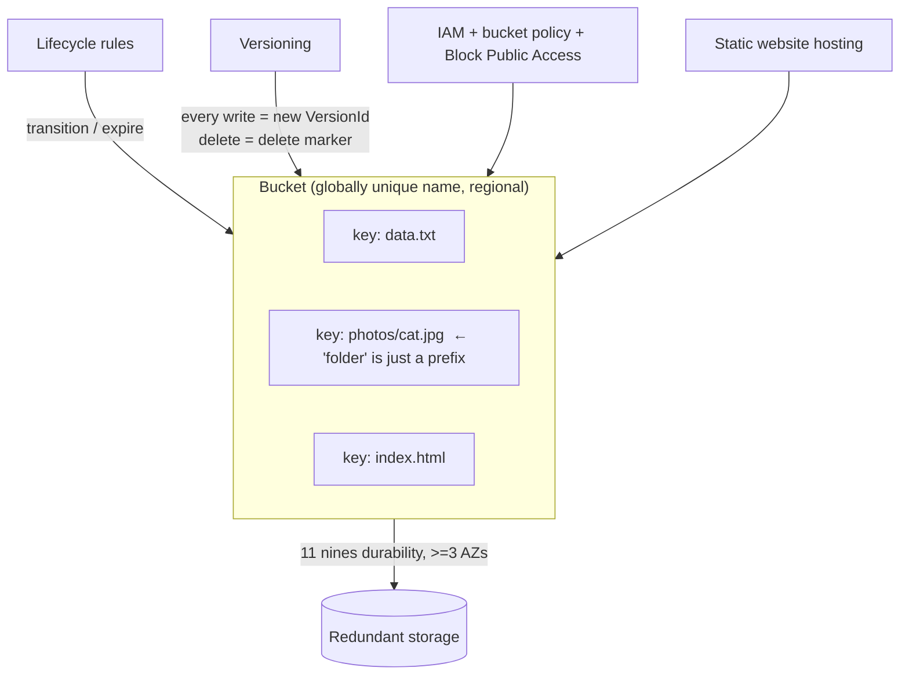

# 09 – S3 (index / map of content)

Object storage — the most-tested storage service on SAA-C03 and the backbone of a dozen other AWS services. Split by course section; each sub-note is self-contained with its own cards.

> [!info] Exam TL;DR — one-paragraph orientation
> **S3 stores objects in buckets.** Bucket names are **globally unique**; the **key** is the object's full path-like name, and S3 is a **flat key→object map** (console "folders" are a display trick over `/`). Every class is **99.999999999% (11 nines) durable**, stored across **≥3 AZs** (except the One Zone classes). **Storage classes** trade retrieval speed/cost from Standard → Intelligent-Tiering → IA → Glacier tiers, and **lifecycle rules** move/expire objects automatically. **Versioning** keeps every write and turns deletes into **delete markers**. Access is controlled by **IAM + bucket policies + Block Public Access**, and objects can be encrypted **SSE-S3 / SSE-KMS / SSE-C / client-side**.

## Sub-notes

| # | Note | Covers | Build tier |
|---|---|---|---|
| 9.1 | [[09-s3-intro]] | buckets/objects/keys, durability & availability, storage classes, versioning, lifecycle, static website hosting | **Built (free)** |
| 9.2 | [[09-s3-advanced]] | replication (CRR/SRR + Batch), multipart upload, Transfer Acceleration, byte-range fetch, S3 Select, event notifications, Glacier retrieval tiers, Storage Lens | **Built (free)** |
| 9.3 | [[09-s3-security]] | bucket policies vs IAM vs ACLs, Block Public Access, encryption (SSE-S3/KMS/DSSE-KMS/SSE-C, client-side), presigned URLs, Object Lock, MFA delete, access points | **Built (free + KMS)** |

## Master diagram

## Related

Accessed privately from a VPC via an **S3 Gateway Endpoint** (free) — see [[05-vpc-endpoints-peering]]. EC2 instances reach S3 with an **IAM role/instance profile** — see [[01-iam]] and [[02-ec2]].
