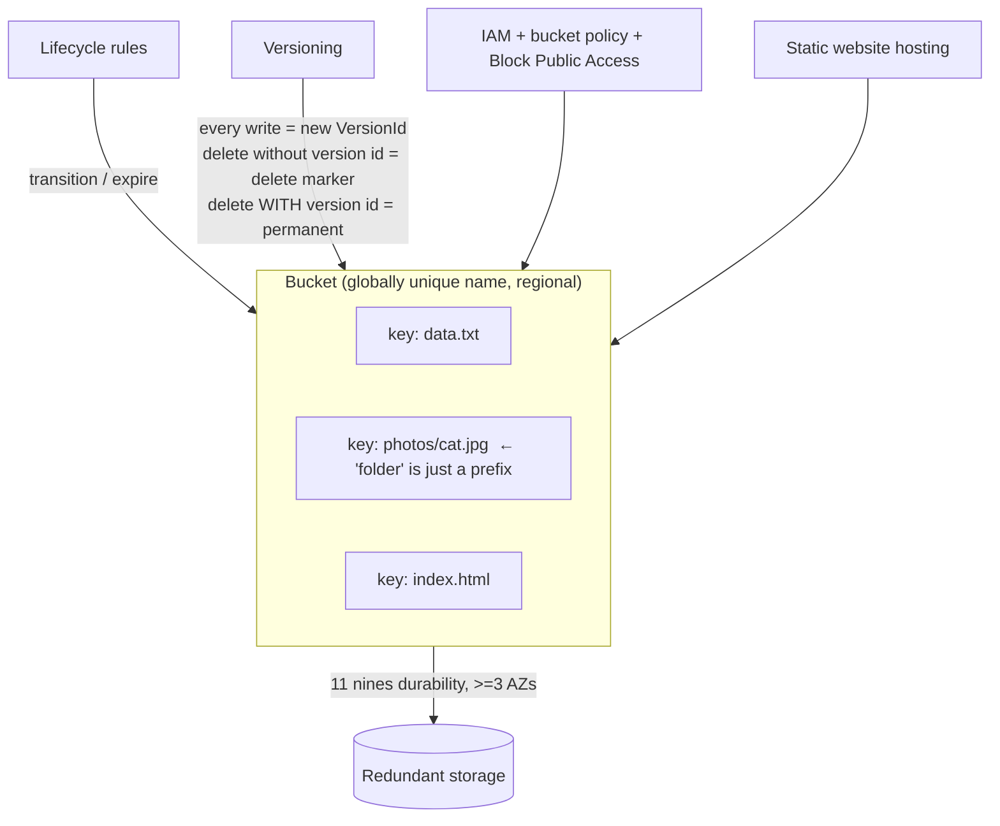

# 09 – S3 (index / map of content)

Object storage — heavily tested across all four SAA-C03 domains, and the backbone of a dozen other AWS services. Split by course section; each sub-note is self-contained, with its own TL;DR, worked examples and weak spots. Drilling happens in the `aws-saa-trainer` app; these notes are the learning tier.

> [!info] Exam TL;DR — one-paragraph orientation
> **S3 stores objects in buckets.** Bucket names are **globally unique** (precisely: unique across every account and Region within a *partition* — `aws`, `aws-cn`, `aws-us-gov`, `aws-eusc`; "globally unique" is the expected exam answer). The **key** is the object's full path-like name, and a **general purpose bucket** — the normal kind — is a **flat key→object map**, where console "folders" are a display trick over `/`. (The newer **directory buckets** behind S3 Express One Zone are the exception: they have a real hierarchical namespace.)
>
> Two different numbers: **durability** is the chance an object is never lost, **availability** the chance you can read it right now. Every *current* class is **99.999999999% (11 nines) durable** — the exception is the legacy **Reduced Redundancy Storage** at 99.99%, which AWS recommends against — and objects are stored across **≥3 AZs**, except the **One Zone** classes and **S3 on Outposts** (a single on-premises Outpost).
>
> **Storage classes** trade storage price against how often and how fast you need the data: Standard → **Standard-IA** → **One Zone-IA** → Glacier Instant → Glacier Flexible → Deep Archive, cheaper to store as you go right. (**IA** = *Infrequent Access*: cheaper per GB, but you pay a retrieval fee.) **Intelligent-Tiering sits off that ladder** — it is for *unknown* access patterns, charges a per-object monitoring fee and no retrieval fee, and an object that stays hot just stays in its Frequent Access tier. **Lifecycle rules** move and expire objects automatically.
>
> **Versioning** keeps every write as a new version, and a delete *without* a version ID only adds a **delete marker** — a placeholder that hides the object while every older version stays stored and billed. To remove data for real you delete a **specific version id**, which is permanent.
>
> Access is controlled by **IAM policies + bucket policies + Block Public Access**. Objects are **encrypted at rest by default with SSE-S3** (every new upload since 5 Jan 2023); you can instead choose **SSE-KMS**, **DSSE-KMS** or **SSE-C** server-side (SSE = *server-side encryption*, S3 encrypts after the object arrives and the suffix says whose key), or encrypt **client-side** before upload so S3 never sees plaintext or the key. Note **SSE-C has been disabled by default since April 2026** and must be enabled deliberately.

## Sub-notes

| # | Note | Covers | Build tier |
|---|---|---|---|
| 9.1 | [[09-s3-intro]] | buckets/objects/keys, durability & availability, storage classes, versioning, lifecycle, static website hosting | **Built (free)** |
| 9.2 | [[09-s3-advanced]] | replication (**CRR** cross-Region / **SRR** same-Region, plus **Batch Replication** for objects the live rule skips), multipart upload, Transfer Acceleration, byte-range fetch, S3 Select *(closed to new customers — still exam-testable)*, event notifications, Glacier retrieval tiers, Storage Lens | **Built (free)** |
| 9.3 | [[09-s3-security]] | bucket policies vs IAM vs ACLs, Block Public Access, encryption (SSE-S3/KMS/DSSE-KMS/SSE-C, client-side), presigned URLs, Object Lock, MFA delete, access points | **Built (free + KMS)** |

*Build tier legend:* **Built** = done hands-on in a lab, not just read. **free** = stayed inside the free tier. **+ KMS** = the lab created a customer managed KMS key, which bills a small monthly charge while it exists.

## Master diagram

```mermaid
flowchart TB
    subgraph B["Bucket (globally unique name, regional)"]
      K1["key: data.txt"]
      K2["key: photos/cat.jpg  ← 'folder' is just a prefix"]
      K3["key: index.html"]
    end
    B -->|11 nines durability, >=3 AZs| DUR[(Redundant storage)]
    LC[Lifecycle rules] -->|transition / expire| B
    VER[Versioning] -->|every write = new VersionId<br/>delete without version id = delete marker<br/>delete WITH version id = permanent| B
    SEC[IAM + bucket policy + Block Public Access] --> B
    WEB[Static website hosting] --> B
```

## Related

Accessed privately from a VPC via an **S3 Gateway Endpoint** (free) — see [[05-vpc-endpoints-peering]]. EC2 instances reach S3 with an **IAM role**, attached to the instance through an **instance profile** — the role holds the permissions, the instance profile is the wrapper that binds it to the instance. See [[01-iam]] and [[02-ec2]].
