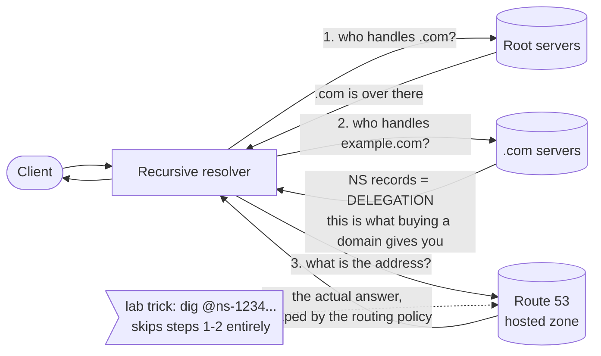
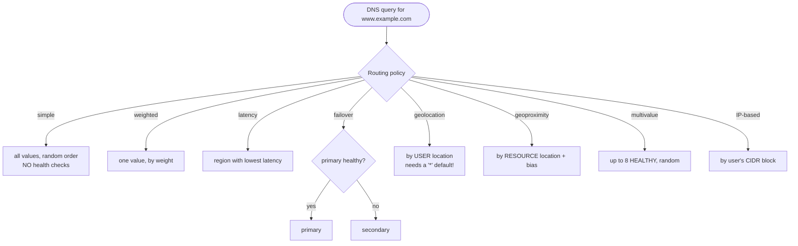

# 10 – Route 53 (DNS)

AWS's managed DNS. It answers "what IP is behind this name?" — but the exam cares about the *policy* in that answer: which of several IPs, chosen how, and what happens when one dies. Named after port 53.

## What problem does this solve?

Machines route on IP addresses. People type names. Something has to turn one into the other.

That translation isn't a single question, it's a **search followed by an answer**. A resolver asks a root server "who handles `.com`?", then asks a `.com` server "who handles example.com?" — that reply is an **NS record**, the *delegation* — and only then asks the named server for the actual address.

The first steps exist purely to **discover which server to ask**. The last step is the real answer, and it comes from a **hosted zone**: a container of records for one domain.

Route 53 is AWS's version of that final server. It will also sell you the domain, but that is a separate job — registration is what puts your NS records into the parent zone so strangers can find you.

The harder problem is the one the exam actually tests. Once you own the answer, that answer no longer has to be a single fixed address. It can depend on who asked, where they are, and which of your endpoints is still alive. Route 53 calls that choice a **routing policy**, and it is why DNS ends up doing traffic shifting, blue/green releases and cross-region failover — jobs that look like they should belong to a load balancer.

> In one line: DNS is a search for who to ask; Route 53 is the server being asked, and the routing policy decides *which* answer comes back.

## How it actually works

### Owning a name and answering for it are two different things

These feel like one thing. They are not.

A hosted zone makes Route 53 **authoritative** for a domain — it will answer for that name, properly, for as long as the zone exists. It **never checks whether you own the name**. Nothing stops you creating a zone for a domain that isn't yours.

Registering a domain buys you something else entirely: the **NS delegation in the parent zone**. That is the signpost inside `.com` that points the rest of the world at your four nameservers. Without it, nobody is ever routed to your zone, so your perfectly good answers are simply never requested.

Discovery and answering are separate — which is why you can build the entire Route 53 lab **without buying a domain**. Create a zone for a name nobody delegates to you (`saa-c03-lab.example`, a reserved TLD) and query the four assigned nameservers **directly** with `dig @ns-…`. You have skipped steps 1 and 2 of the search and gone straight to the source. Route 53 answers properly — routing policies, health checks, failover and all — because it genuinely holds the zone. The only thing you lose is that no stranger can find it.

> In one line: a hosted zone makes you *able* to answer; delegation is the only thing that makes anyone *ask* you.

### Why a CNAME cannot sit at the apex

This sounds like an AWS limitation. It isn't — it is plain DNS, and knowing why makes it stick.

A CNAME means "this name **is** another name, go look there instead." DNS forbids a CNAME from coexisting with **any other record at that same name** — a name with a CNAME can have no other records at all.

Now look at the zone apex — `example.com` itself. It **must carry SOA and NS** records. A CNAME there would have to coexist with records the apex is obliged to have. So a CNAME at the apex is **invalid DNS**, not a Route 53 restriction.

That leaves a real problem, because the thing you most want `example.com` to point at is an ALB or CloudFront — moving targets you only ever have a *name* for, never a stable IP.

**Alias** is Route 53's way out. An alias resolves as an **A/AAAA** record in `dig` — the world sees a plain address record, so the apex rule is never violated — while Route 53 performs the redirection internally and follows the target's IP changes for you. Three properties come with it:

| Property | What that means |
|---|---|
| Points at **AWS resources only** | The target list is fixed — ALB/NLB, CloudFront, S3 static website, API Gateway and friends, or another record in the same zone. **An EC2 instance is not a valid alias target**; use a plain A record to an Elastic IP. |
| **You cannot set a TTL** | The record uses the **target's** TTL; there is no TTL of your own to set. |
| **Queries are free** | Alias queries to AWS resources aren't billed. A CNAME pointing at another Route 53 record bills as **two** queries. |

> In one line: a CNAME at the apex is illegal DNS, and an alias is Route 53 dressing a redirect up as an A record so the apex can point at an ALB anyway.

### The two policy pairs everyone swaps

There are eight routing policies. Two pairs cause nearly all the wrong answers.

**Simple vs multivalue answer.** The trap is that simple *looks* like load balancing. Give it three IPs and it returns **all three, in random order** — and then it is finished. The **client** picks one. Route 53 is **not health checking** any of them, so a dead server keeps being handed out until you remove it by hand.

**Multivalue answer** is the same shape with the missing half added: up to **8 healthy** records, randomly ordered, unhealthy ones simply not returned. That is the entire difference between the two, and it is the whole reason multivalue exists.

If the scenario wants controlled proportions, that's **weighted**. If it wants real load balancing rather than answer-shuffling, that's an **ALB**, not DNS at all.

**Geolocation vs geoproximity.** Both sound like "route by location." They read *different* locations:

| | Reads | The dial you turn |
|---|---|---|
| **Geolocation** | where the **user** is — continent, country, US state | none; you map locations to records |
| **Geoproximity** | where your **resources** are | a **bias** that grows or shrinks each resource's catchment |

"German users must get the German site" is geolocation — a localization/compliance sentence. "Shift more traffic toward the bigger data centre" is geoproximity bias — a capacity sentence.

Geolocation also carries a nasty failure mode of its own. Define records for `US`, `GB` and `DE`, test from those three countries, and everything looks perfect — while users in **every other country get no answer at all**. Not a slow answer or a wrong region: silence, because nothing matched and there is nothing to fall back on. The fix is a record with country `*` as the **default**. Test an unmatched location deliberately, every time.

One mechanical detail sits under all of these: the moment several records share a name and type, each needs a **`set_identifier`** to tell them apart. Plain DNS never needs that, so it is easy to forget. And a weight of **0** means "never return this" — which is how you drain a stack cleanly.

> In one line: simple hands out everything blind, multivalue hands out only what's alive; geolocation reads the user, geoproximity reads your resources.

### What a health check can see, and how fast failover really is

Failover routing is the obvious answer to "automatic cross-region failover with minimal RTO." What the exam actually probes is the two things people get wrong about it: how long the switch takes, and what Route 53 can observe in the first place.

**How long.** The budget is:

**(health check interval × failure threshold) + TTL**

The interval is **30s**, or **10s** if you pay for fast. The threshold is how many *consecutive* checks must fail before the status flips. So Route 53's own half is typically 30 × 3 ≈ 90 seconds — and then the TTL term usually dwarfs it. A record with a 3600s TTL means resolvers and browsers keep serving the old address for up to an hour *after* Route 53 has already switched. That is the whole of the "we set up failover but users were down for an hour" scenario: the failover worked, the caches didn't care. Lower the TTL to around 60 on failover-critical records. If the record is an **alias** to an ALB you cannot set a TTL at all — you inherit the ALB's, which is already low, so that case is fine.

**What it can see.** Route 53's health checkers live on the public internet, and that placement dictates the rest:

- They **cannot reach private, nonroutable or multicast addresses**. You cannot health check an instance in a private subnet directly — check the public-facing load balancer instead, or use a **CloudWatch alarm** health check driven by a metric the private resource publishes (that type watches the alarm's *data stream*, not its state).
- For EC2, attach an **Elastic IP** and check that, so the target never moves under you.
- Many checkers vote independently, so the aggregate rule is **more than 18% reporting healthy ⇒ healthy**. A brand-new check counts as **healthy** until it has enough data.
- **HTTPS health checks do not validate certificates.** An expired cert passes happily. Certificate expiry belongs to ACM + CloudWatch/EventBridge, not here.

And when a single endpoint isn't the unit you care about, a **calculated** check lets one parent watch up to **255** children with AND / OR / "at least N".

> In one line: Route 53 notices the failure in (interval × threshold) seconds; the TTL decides when anybody else does.

### Private zones, and which way the Resolver points

The same hosted-zone machinery has a second mode. A **private hosted zone** is associated with one or more VPCs and resolves **only** from inside them; the VPC needs DNS support and DNS hostnames enabled.

Two details are worth holding on to. Its four nameservers are **reserved names that are never actually contacted** — they exist only because DNS requires an NS record set. And querying the name from outside an associated VPC does **not** error: it quietly **falls through to public recursive resolution** instead, which is exactly what makes this awkward to debug.

That fall-through is also the feature. Run the *same* name as both a public and a private zone and you get **split-view DNS** — the internal answer inside the VPC, the public answer outside. This is the usual shape of `internal.example.com` setups.

Then hybrid. The VPC's built-in resolver sits at the **VPC base + 2** address (`10.0.0.2` in a `10.0.0.0/16`) and answers for VPC names, private hosted zones and public names. To bridge on-premises you add a **Resolver endpoint**, and its direction is the thing candidates reverse constantly:

| | **Inbound endpoint** | **Outbound endpoint** |
|---|---|---|
| Who is asking | **on-premises** | resources **in your VPC** |
| What they want resolved | names **in AWS** | names **on-premises** |

Anchor on the direction the **query** travels, not the answer. Inbound = queries coming *into* AWS. Outbound = queries heading *out*.

> In one line: a private zone answers only inside its associated VPCs; inbound lets on-prem ask AWS, outbound lets AWS ask on-prem.

## Exam recap

*Now that the mechanisms are clear, this is the compressed version to revise from.*

> [!info] Exam TL;DR
> - **A hosted zone is a container of records for one domain.** Route 53 answers authoritatively for any zone it holds — **it never checks whether you own the name**. Registering a domain only buys you the **NS delegation** in the parent zone so strangers can *find* your nameservers.
> - **Alias vs CNAME** is the #1 Route 53 question. **CNAME cannot exist at the zone apex** (DNS protocol rule). **Alias can**, is Route 53-only, points **only at AWS resources**, and **query costs are free**. You **cannot set a TTL on an alias** to an AWS resource — it uses the target's.
> - **Eight routing policies:** simple · weighted · latency · failover · geolocation · geoproximity · multivalue answer · IP-based.
> - **Simple ≠ load balancing.** Multiple values are returned **all at once, in random order**, and the **client** picks — with **no health checking**. The health-checked version is **multivalue answer** (up to **8 healthy** records).
> - **Geolocation** routes on where the **user** is (country/continent/state). **Geoproximity** routes on where your **resources** are, with a **bias** dial. Easy to swap.
> - **Failover speed = (health check interval × failure threshold) + TTL.** Default-ish: (30s × 3) + TTL. Lower the TTL on failover-critical records — a 3600s TTL means an hour of stale answers no matter how fast Route 53 reacts.
> - **Private hosted zone** = resolvable only from **associated VPCs**. Same name can exist public *and* private → **split-view DNS**.
> - **Route 53 Resolver:** **inbound** endpoint = on-prem resolves **into** AWS. **outbound** endpoint = AWS resolves **out to** on-prem. Remember the direction.

## AWS console ↔ Terraform map

| Console / what you want | Terraform | Notes |
|---|---|---|
| Hosted zone (public) | `aws_route53_zone` | Returns `name_servers` — the four to delegate to. |
| Hosted zone (private) | `aws_route53_zone` **with a `vpc {}` block** | The block is the only difference. |
| Any record | `aws_route53_record` | Policy is a **nested block**: `weighted_routing_policy`, `failover_routing_policy`, `geolocation_routing_policy`, `latency_routing_policy`, or `multivalue_answer_routing_policy = true`. |
| Alias to an AWS resource | `alias {}` block **inside** `aws_route53_record` | Not a separate resource. Needs `zone_id` + `name` of the target, and `evaluate_target_health`. |
| Health check | `aws_route53_health_check` | `type` HTTP/HTTPS/TCP/CALCULATED/CLOUDWATCH_METRIC. |
| Telling records apart | `set_identifier` | **Required** whenever several records share a name+type. Plain DNS never needs this. |
| Register/transfer a domain | `aws_route53domains_registered_domain` | Real money, non-refundable. |
| Hybrid DNS | `aws_route53_resolver_endpoint`, `aws_route53_resolver_rule` | Direction is set by `direction = "INBOUND" \| "OUTBOUND"`. |

## Architecture diagram

## Key facts, limits & pricing

- **Route 53 is global**, not regional — hosted zones don't live in a Region, and the console has no Region selector for them.
- **Hosted zones:** **$0.50/month** each for the first 25, **$0.10/month** after. **A zone deleted within 12 hours of creation is not charged** — but *queries against a public zone are still billed* even then.
- **Queries:** **$0.40 per million** (first 1B/month), $0.20/million above. **Alias queries to AWS resources are free.** A **CNAME pointing at another Route 53 record bills as two queries**.
- **Health checks:** **50 free** for **AWS endpoints** (a resource running in AWS in the *same account*). Then **$0.50/month** (AWS) / **$0.75/month** (non-AWS). **Optional features cost $1.00 each (AWS) / $2.00 (non-AWS) per month** — HTTPS, string matching, the fast 10-second interval, and latency measurement all count. Keep lab checks basic.
- **Health check mechanics:** interval is **30s or 10s** (10s = "fast", costs extra); the **failure threshold** is the number of *consecutive* checks that must fail (or pass) to flip the status. Route 53 aggregates many global checkers: **more than 18% reporting healthy ⇒ healthy**. A **new** health check counts as **healthy** until it has enough data (inverted if you enable "invert").
- **Health check timing detail:** HTTP/HTTPS must establish TCP within **4 seconds** and return **2xx/3xx within 2 more seconds**. TCP checks must connect within **10 seconds**. **HTTPS health checks do not validate certificates** — an expired cert will not fail the check. String matching must find the string within the first **5,120 bytes**.
- **Three health check types:** **endpoint** (IP or domain name), **calculated** (a parent watching up to **255** children, with AND / OR / "at least N"), and **CloudWatch alarm** (watches the alarm's *data stream*, not its state — so `SetAlarmState` can't fake it; same account only, no metric math, no M-of-N).
- **Health checks cannot target private, nonroutable, or multicast IPs.** For EC2, attach an **Elastic IP** and check that, so the target never moves.
- **Alias:** no TTL of your own (uses the target's); resolves as an **A/AAAA** record in `dig` (the alias-ness is only visible in the console/API); auto-follows the target's IP changes; targets include **ALB/NLB/CLB, CloudFront, S3 static website, API Gateway, VPC interface endpoints, Global Accelerator, Elastic Beanstalk, App Runner, OpenSearch, AppSync, and another record in the same hosted zone**. **An EC2 instance is not a valid alias target** — use a plain A record to its Elastic IP.
- **CNAME restriction beyond the apex:** if a name has a CNAME, it can have **no other records at all** at that name. That's why the apex — which must carry SOA and NS — can never be a CNAME.
- **Private hosted zones** need a **VPC association**, and the VPC needs DNS support + DNS hostnames. Queried from outside an associated VPC, the name simply **resolves recursively on the public internet** instead of erroring. They're assigned four *reserved* nameservers (`ns-0.awsdns-00.com` and friends) that are **never actually contacted** — they exist only because DNS requires an NS record set.
- **Record types supported:** A, AAAA, CAA, CNAME, DS, HTTPS, MX, NAPTR, NS, PTR, SOA, SPF, SRV, SSHFP, SVCB, TLSA, TXT. **SPF as a record type is deprecated** — put SPF data in a **TXT** record. **MX priority: lower number wins.** TXT strings are ≤255 chars each, ≤4,000 total.
- **Route 53 carries a 100% availability SLA** for hosted zones — service credits begin the moment monthly uptime drops below 100%. It covers **authoritative DNS only**, not Resolver or the other Route 53 features.

## Comparisons

### The eight routing policies

| Policy | Chooses on | Returns | Health-checked? |
|---|---|---|---|
| **Simple** | nothing | **all** values, random order — client picks | ❌ **no** |
| **Weighted** | your weights | **one** | ✅ |
| **Latency** | lowest measured latency to an **AWS Region** | one | ✅ |
| **Failover** | primary's health | primary, else secondary | ✅ (that's the point) |
| **Geolocation** | where the **user** is (continent / country / US state) | one | ✅ |
| **Geoproximity** | where your **resources** are + a **bias** you set | one | ✅ (needs Traffic Flow) |
| **Multivalue answer** | nothing | up to **8 healthy**, random | ✅ **yes** |
| **IP-based** | CIDR blocks **you** supply | one | ✅ |

*The pairs that get confused: **simple vs multivalue** (health checking is the whole difference) and **geolocation vs geoproximity** (users vs resources).*

### Alias vs CNAME

|   | **Alias** | **CNAME** |
|---|---|---|
| At the zone apex | ✅ **yes** | ❌ **never** |
| Points at | **AWS resources only** (+ records in the same zone) | **any** DNS name |
| Query cost | **free** | charged (×2 if it targets another R53 record) |
| TTL | **can't set one** — uses the target's | you set it |
| Appears in `dig` as | A / AAAA | CNAME |
| Standard DNS? | ❌ Route 53 extension | ✅ |

### Public vs private hosted zone

|   | Public | Private |
|---|---|---|
| Who can resolve it | anyone on the internet (if delegated) | only **associated VPCs**, or on-prem via a Resolver **inbound** endpoint |
| Needs a VPC association | ❌ | ✅ **required** |
| Nameservers | four real, internet-reachable ones | four **reserved** names that are never contacted |
| Queried from outside | answers | falls through to **public** recursive resolution |

*Same domain in both = **split-view DNS**: private answer inside the VPC, public answer outside. Common for `internal.example.com` style setups.*

### Route 53 Resolver — get the direction right

|   | **Inbound endpoint** | **Outbound endpoint** |
|---|---|---|
| Who is asking | **on-premises** (or another VPC) | resources **in your VPC** |
| What they're resolving | names **in AWS** (private hosted zones, VPC names) | names **on-premises** |
| Direction | on-prem → **into** AWS | AWS → **out to** on-prem |

The VPC's built-in resolver lives at the **VPC base + 2** address (e.g. `10.0.0.2` in a `10.0.0.0/16` VPC) and answers for VPC names, private hosted zones, and public names. **Resolver rules** are per-domain conditional forwarders, and can be **shared across accounts with RAM**. Pairs with [[05-vpc-hybrid]] — the traffic itself rides Direct Connect or Site-to-Site VPN.

> [!note] Naming churn
> AWS has renamed **Route 53 Resolver** to **Route 53 VPC Resolver** (following the introduction of Route 53 Global Resolver). Course material and the exam will almost certainly still say "Route 53 Resolver" — treat them as the same thing.

## Worked examples

> [!example] Worked example — blue/green release with weighted routing
> You want 10% of live traffic on a new stack before committing. Create **two records with the same name** `app.example.com`, each with a `set_identifier` (`blue`, `green`) and a `weighted_routing_policy` of 90 and 10. Route 53 returns **one** address per query, chosen in proportion. Shift by editing weights — no load balancer change, no deploy. Two cautions that make this a real-world skill rather than a trick: **TTL bounds how fast a shift takes effect** (clients keep the old answer until it expires, so use ~60s), and **weight 0 means "never return this"**, which is how you drain a stack cleanly. Attach health checks to both so a broken green is removed rather than served to 10% of users.

> [!example] Worked example — multi-region active/passive DR
> Primary in `us-east-1`, warm standby in `eu-west-1`. Create a **failover** pair on `www.example.com`: the PRIMARY record carries a **health check** on the primary endpoint, the SECONDARY doesn't need one. Route 53 serves primary while healthy and switches automatically when the check fails. Budget the switch honestly: **(30s interval × 3 failures) + TTL** ≈ 90s plus however long clients cache. Set the TTL to **60**, not 3600. If the record is an **alias** to an ALB you can't set a TTL at all — Route 53 uses the ALB's, which is already low, so this is fine. This is the canonical exam answer for "automatic cross-region failover with minimal RTO" — pair it with [[07-rds-aurora]] Global Database for the data tier.

> [!failure] Failure mode — the geolocation record with no default
> A team adds geolocation records for `US`, `GB` and `DE`, tests from those three countries, and ships. Users in **every other country get no answer at all** — not a slow answer, not a wrong region, **NXDOMAIN-shaped silence** — because no record matches their location and Route 53 has nothing to fall back on. The fix is a record with country `*` as the **default**, which catches every unmatched location. The same trap is why `dig +subnet=` testing from a *single* location gives false confidence: you only ever exercise one branch. Always test an unmatched location deliberately.

## The Terraform I wrote

Code: `../10-route53/` — `main.tf` (zone), `websites.tf` (two S3 static sites, us-east-1 + us-west-2), `health.tf`, `records.tf` (all six policies), `outputs.tf`.

**Provenance, honestly:** Claude wrote this one at my request, on the argument that Route 53's HCL is thin (one resource type, six nested blocks) while the learning is in the DNS behaviour. I owned every verification instead — predicting each `dig` result before running it.

The lab technique worth remembering: a hosted zone for **`saa-c03-lab.example`** (RFC 2606 reserved TLD, never delegated to anyone), with all addresses from the **RFC 5737 documentation ranges** (`192.0.2.0/24`, `198.51.100.0/24`, `203.0.113.0/24`). Nothing collides with anything real. Verification is `dig @<assigned nameserver>`, and `dig +subnet=<cidr>` fakes a client location because **Route 53 honours EDNS0 client subnet** — which is what makes geolocation and latency routing testable from one laptop.

Non-obvious bits:
- **Failover had to use CNAMEs, not aliases.** An alias to an S3 website endpoint requires the **bucket name to equal the record name** (S3 routes static-website requests by `Host` header), and both failover records share the name `www.…` — so both would need to be the same bucket. Impossible.
- The health check monitors the S3 **website endpoint by domain name**, which is a real public name, so it works even though our zone is undelegated.
- Breaking it is `aws s3 rm .../index.html` → 404 → three failed checks → the answer flips.

## Traps

> [!warning] Trap — "use simple routing to distribute traffic across three servers"
> Simple routing returns **all** the values in random order and the **client** chooses; Route 53 is not balancing anything and is **not health checking**. A dead server keeps being handed out. If the question wants distribution *with* health awareness, it's **multivalue answer**; if it wants controlled proportions, it's **weighted**; if it wants real load balancing, it's an **ALB**, not DNS.

> [!warning] Trap — CNAME at the apex
> `example.com` must carry SOA and NS records, and DNS forbids a CNAME coexisting with any other record at the same name. So a CNAME at the apex is **invalid DNS**, not an AWS limitation. Pointing `example.com` at an ALB or CloudFront is exactly what **alias** records exist for.

> [!warning] Trap — geolocation vs geoproximity
> **Geolocation = where the USER is** (continent, country, US state) — content localization, licensing, compliance. **Geoproximity = where your RESOURCES are**, with a **bias** to grow or shrink each one's catchment. If the scenario says "users in Germany must get the German site," that's geolocation. If it says "shift more traffic toward the bigger data centre," that's geoproximity bias.

> [!warning] Trap — "we set up failover but users were down for an hour"
> Route 53 did fail over. The **TTL** kept resolvers and browsers serving the stale answer. Failover is only as fast as `(interval × threshold) + TTL`, and the TTL term usually dominates. Any question where failover "didn't work" but the console shows a healthy failover is a TTL question.

> [!warning] Trap — health check on a private IP
> Route 53 health checkers live on the public internet and **cannot reach private, nonroutable or multicast addresses**. You cannot health-check an instance in a private subnet directly — check the public-facing load balancer instead, or use a **CloudWatch alarm** health check driven by a metric the private resource publishes.

> [!warning] Trap — inbound vs outbound Resolver endpoints
> **Inbound = traffic coming INTO AWS to be resolved** (on-prem asking about AWS names). **Outbound = queries leaving AWS** (your VPC asking about on-prem names). Candidates reverse these constantly. Anchor on the direction of the *query*, not the direction of the answer.

> [!warning] Trap — "HTTPS health checks prove the certificate is valid"
> They don't. AWS states plainly that HTTPS health checks **do not validate SSL/TLS certificates** — an expired or invalid cert still passes. Certificate expiry monitoring is ACM + CloudWatch/EventBridge, not a Route 53 health check.

> [!example]- Recreate-from-memory drill
> Without looking: build a hosted zone for a reserved-TLD domain you don't own; add (1) a weighted pair 80/20, (2) a failover pair driven by a health check on a real endpoint, (3) a geolocation set with a proper default. Then verify **only** with `dig @<nameserver>`, including `+subnet=` from an unmatched country. Predict every answer before running it.
> > [!success]- Reference solution
> > See `10-route53/records.tf`. The lines people forget: `set_identifier` on every record that shares a name, `country = "*"` for the geolocation default, and a TTL low enough (60) that failover is observable.

## 🔴 My weak spots (this topic)   #weak-spot

- [ ] **Simple routing is not load balancing and has no health checks** — I described it as "divides requests evenly." It returns everything, randomly ordered, client picks. **Multivalue answer** is the health-checked one.
- [ ] **Geolocation vs geoproximity** — I described geolocation and called it geoproximity. Users vs resources.
- [ ] **Only recalled 4 of 8 routing policies** on the orient. Missing: failover, geolocation, multivalue answer, IP-based.
- [ ] **Hosted zone ≠ domain ownership** — needed the delegation-vs-discovery explanation twice before it landed. The NS record in the *parent* zone is the only thing registration buys.
- [ ] **Fixing a slow failover** — diagnosed the TTL cause correctly but didn't name the fix (lower the TTL; and you can't set one at all on an alias).

## 🔗 Docs

- [Choosing a routing policy](https://docs.aws.amazon.com/Route53/latest/DeveloperGuide/routing-policy.html) — all eight policies; verified 2026-09-03
- [Simple routing](https://docs.aws.amazon.com/Route53/latest/DeveloperGuide/routing-policy-simple.html) — random order, client picks, **not health checked**; verified 2026-09-03
- [Alias vs non-alias records](https://docs.aws.amazon.com/Route53/latest/DeveloperGuide/resource-record-sets-choosing-alias-non-alias.html) — target list, no settable TTL, free queries, apex rule; verified 2026-09-03
- [Supported DNS record types](https://docs.aws.amazon.com/Route53/latest/DeveloperGuide/ResourceRecordTypes.html) — full list, CNAME exclusivity rule, MX priority, SPF deprecation; verified 2026-09-04
- [Working with private hosted zones](https://docs.aws.amazon.com/Route53/latest/DeveloperGuide/hosted-zones-private.html) — VPC association, reserved nameservers, outside-VPC behaviour; verified 2026-09-03
- [How Route 53 determines health](https://docs.aws.amazon.com/Route53/latest/DeveloperGuide/dns-failover-determining-health-of-endpoints.html) — 18% rule, 4s/2s and 10s timings, no cert validation, calculated + CloudWatch types; verified 2026-09-03
- [Health check values](https://docs.aws.amazon.com/Route53/latest/DeveloperGuide/health-checks-creating-values.html) — interval options, failure threshold, private-IP restriction, optional-feature charges; verified 2026-09-03
- [Route 53 VPC Resolver](https://docs.aws.amazon.com/Route53/latest/DeveloperGuide/resolver.html) — VPC+2, inbound/outbound direction, resolver rules, rename note; verified 2026-09-04
- [Route 53 pricing](https://aws.amazon.com/route53/pricing/) — $0.50/zone, 12-hour deletion waiver, 50 free AWS health checks, $1/$2 optional features, $0.40/million queries; verified 2026-09-03
- [Terraform `aws_route53_record`](https://registry.terraform.io/providers/hashicorp/aws/latest/docs/resources/route53_record) / [`aws_route53_health_check`](https://registry.terraform.io/providers/hashicorp/aws/latest/docs/resources/route53_health_check)

---
**Cards for this topic:** [[cards/10-route53-cards]]
