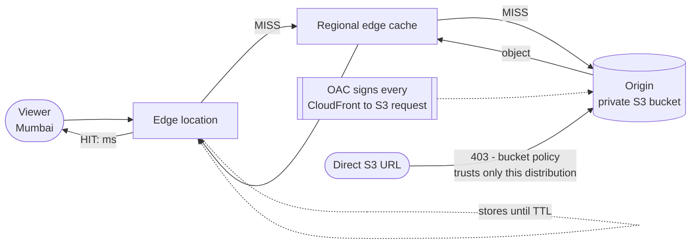

# 11 – CloudFront (CDN)

AWS's content delivery network. Caches your content at edge locations worldwide so users fetch it from nearby instead of from your origin — and, less obviously, accelerates even *uncacheable* traffic by pulling it onto the AWS backbone at the edge.

## What problem does this solve?

Distance is the problem. A request from Mumbai to a server in Virginia crosses the public internet twice — once out, once back — and every hop adds latency. Nothing about your code is slow. The map is slow.

One fix is to run copies of your server in twenty countries. That is expensive, and now there are twenty things to deploy to.

CloudFront does the cheap version. AWS already operates **edge locations** worldwide. CloudFront keeps your real server — the **origin** — in one place, and puts *copies of the content* at the edges near your users. The first person in Mumbai to ask pays for the long trip. Everyone after them gets a local answer.

Then there is the second, quieter benefit, and it is the one people miss. Content that *cannot* be cached at all — a logged-in dashboard, an API response that differs for every user — still gets faster. The request enters the **AWS global backbone** at the nearest edge instead of traversing the public internet end to end. That is why putting CloudFront in front of a dynamic API is a real optimisation and not just a static-asset trick.

> In one line: a copy of your content near the user, and AWS's own network for everything that can't be copied.

## How it actually works

### Two caches sit between the viewer and your origin

Walk a real request.

A viewer in Mumbai asks for an object. The nearest edge location doesn't have it — that's a **miss**. Before going all the way back to your origin, CloudFront checks a **regional edge cache**, a second cache that sits between the edges and the origin. Only if that misses too does the origin get touched. The object then travels back out, is stored at the edge, and is served.

Every later request at that edge is a **hit**, answered locally in milliseconds, until the **TTL** expires and CloudFront revalidates.

The practical consequence of the middle layer: *a miss at the edge is not automatically a trip to your origin.* If you are reasoning about origin load, the edge miss rate is not the number you want.

You can watch the whole thing in the response headers, which is the fastest way to check your mental model against reality:

| Header | Tells you |
|---|---|
| `X-Cache: Hit from cloudfront` / `Miss from cloudfront` | whether this request was served from cache |
| `Age` | how many seconds the cached copy has been sitting there |
| `X-Amz-Cf-Pop` | which edge location served you |
| `X-Amz-Cf-Id` | the id to correlate with logs |

> In one line: edge first, regional edge cache second, origin last — a miss at the edge doesn't mean a trip home.

### Why the S3 bucket policy needs a condition to actually be safe

The goal: the bucket is completely private — Block Public Access fully on — and CloudFront is the only way in.

The mechanism is **Origin Access Control**. OAC signs every CloudFront→S3 request, and the bucket policy grants `s3:GetObject` to the service principal `cloudfront.amazonaws.com`. (OAC is the current tool; **OAI is legacy**.) So far this reads like ordinary IAM.

Here is the part that bites. `cloudfront.amazonaws.com` is **the same principal for every AWS customer on earth**. It identifies the *service*, never the *customer*. A bucket policy that trusts it and stops there has said "any CloudFront distribution may read this bucket."

And it works. The site serves. Direct S3 URLs still return 403 to anonymous users. The tests pass. But anyone who learns your bucket name can point **their own** distribution at it and serve your content on their own domain — read from you, billed to them.

That is what the `AWS:SourceArn` condition pinning your distribution's ARN is for. Note carefully what it does *not* do: it is not what makes your distribution work. It is what stops everybody else's. This is the confused-deputy defence, and its whole difficulty is that omitting it breaks nothing visible.

One hard constraint sits on top of all this: OAC needs the **S3 REST endpoint** (`bucket.s3.region.amazonaws.com`). An S3 bucket configured as a **website endpoint** is treated as a *custom* origin, and custom origins support **neither OAC nor OAI**. If the requirement is "private bucket," you take the REST endpoint and give up S3's website features — index documents on subfolders, S3 redirect rules — replacing them with CloudFront's `default_root_object` and custom error pages.

> In one line: the service principal names the service, never the customer — the `SourceArn` condition is the part that names you.

### Why AWS tells you not to invalidate

You deployed new CSS. Until the TTL on that object expires, the edges keep serving the old file. The obvious move is **invalidation**: tell CloudFront to drop that path. It's cheap — the first **1,000 paths per month per account** are free, and a path containing `*` counts as **one path** no matter how many files it clears.

AWS still recommends you don't design around it, and the reason is worth holding on to: **invalidation only clears caches AWS owns.** It cannot reach the viewer's browser cache, and it cannot reach a corporate proxy. So some users keep seeing the stale file regardless, and now your access logs are ambiguous too — the same URL meant two different files at two different times.

The alternative flips the problem around. Put a hash **in the filename**. A new build produces a new name, and a new name is a **new cache key** — so there is nothing stale to clear, because nothing was ever overwritten. You also get clean rollbacks, readable logs, and users mid-session keep working off the old asset instead of receiving a half-updated page.

That leads to the two-tier pattern: `index.html` gets a **short TTL** (60 s) because it is tiny and it is the one file that must change quickly; `/static/app.a1b2c3.css` gets a **one-year TTL** because its name already guarantees uniqueness.

Invalidation isn't wrong — it's the emergency tool, for when you shipped a genuine mistake.

> In one line: change the name, not the cache — invalidation can't reach caches you don't own.

### Why the certificate has to be in one specific Region

An ACM certificate used for **viewer↔CloudFront** HTTPS must be requested or imported in **`us-east-1`**. Not the origin's Region. Not your Region. Always that one.

The reason it catches people is the failure mode. A perfectly valid certificate sitting in `eu-west-1` doesn't throw an error explaining the rule — it simply **never appears** in the distribution's certificate list. You go looking for a bug in your ACM setup, and there isn't one.

There is exactly one exception, and it is on the other leg of the journey: for **CloudFront↔origin** HTTPS with an **ELB** origin, the certificate may live in any Region. Different leg, different rule. That leg has its own failure to recognise too — if no domain in the origin's certificate matches the origin domain name, viewers get **502 Bad Gateway**.

> In one line: the certificate viewers see lives in `us-east-1` whatever the origin does; the origin-facing one is the exception.

### Why Global Accelerator fails over faster than DNS can

These two look interchangeable in a question. Both "make it faster globally," both ride the AWS edge network. They are not the same tool.

**CloudFront caches HTTP content.** **Global Accelerator caches nothing** — it routes **any TCP/UDP** traffic over the AWS backbone to the nearest healthy Region, with **NLB, ALB, EC2 or an Elastic IP** as endpoints.

The discriminator that actually decides exam questions is failover speed, and it comes from one detail: Global Accelerator gives you **two static anycast IPs** (four dual-stack) and **those IPs never change**. Failover normally means publishing a different DNS answer, and you are then stuck waiting for every resolver's cached copy to expire — [[10-route53]] failover is bounded by `(interval × threshold) + TTL`. With Global Accelerator there is nothing for a resolver to cache in the first place, because the address is identical before and after. The switch happens inside AWS's network. No DNS, no TTL.

CloudFront has its own failover, and it is worth not confusing with either of the above: an **origin group** holds a primary and a secondary origin and switches when the primary returns configured HTTP failure codes. Per request, inside CloudFront, no DNS involved.

> In one line: CloudFront caches, Global Accelerator doesn't — its trick is IPs that never change, so DNS never has to catch up.

## Exam recap

*Now that the mechanisms are clear, this is the compressed version to revise from.*

> [!info] Exam TL;DR
> - **Cache miss → fetch from origin → store at the edge → serve hits until the TTL expires.** A **regional edge cache** sits between the edge and your origin, checked on a miss before the origin is.
> - **Not just static content.** Dynamic, uncacheable requests still benefit, because they enter the AWS backbone at the edge instead of crossing the public internet.
> - **OAC (Origin Access Control)** locks an S3 origin so CloudFront is the only way in — Block Public Access stays **fully on**. OAC is current; **OAI is legacy**. The bucket policy trusts `cloudfront.amazonaws.com` **with an `AWS:SourceArn` condition pinning your distribution** — the confused-deputy defence again.
> - **An S3 *website* endpoint is a custom origin and cannot use OAC or OAI at all.** OAC needs the **S3 REST endpoint** (`bucket.s3.region.amazonaws.com`).
> - **Versioned filenames beat invalidation.** Invalidation is the emergency tool: **1,000 paths/month free** per account, `/*` counts as **one path**.
> - **An ACM certificate for CloudFront must live in `us-east-1`**, no matter where the origin is.
> - **CloudFront Functions** (JS, sub-ms, viewer events only, no network) vs **Lambda@Edge** (Node/Python, up to 30 s, all four events, network + request body).
> - **CloudFront vs Global Accelerator:** CloudFront caches HTTP at the edge. Global Accelerator gives **two static anycast IPs**, works at **TCP/UDP**, **caches nothing**, and fails over **without DNS or TTL** because the IPs never change.

## AWS console ↔ Terraform map

| Concept | Terraform | Notes |
|---|---|---|
| The distribution | `aws_cloudfront_distribution` | Verbose: `origin`, `default_cache_behavior`, `restrictions`, `viewer_certificate` are all required. |
| Lock the S3 origin | `aws_cloudfront_origin_access_control` | `origin_access_control_origin_type = "s3"`, `signing_behavior = "always"`, `signing_protocol = "sigv4"`. |
| Trust it back | `aws_s3_bucket_policy` | Service principal + `AWS:SourceArn` condition. **This is the security-critical half.** |
| What forms the cache key | `aws_cloudfront_cache_policy` | `min_ttl` / `default_ttl` / `max_ttl` + which cookies/headers/query strings are included. |
| Use an AWS-managed policy | `data "aws_cloudfront_cache_policy"` | e.g. `name = "Managed-CachingOptimized"`. |
| Route a path differently | `ordered_cache_behavior { path_pattern = "/static/*" }` | Evaluated in order; `default_cache_behavior` is the fallback. |
| Origin failover | `origin_group` block | Primary + secondary, switching on named HTTP status codes. |
| Edge code | `aws_cloudfront_function` / `aws_lambda_function` + `lambda_function_association` | Functions vs Lambda@Edge. |
| Custom domain | `aliases` + `viewer_certificate { acm_certificate_arn = ... }` | **Certificate must be in `us-east-1`.** |

## Architecture diagram

## Key facts, limits & pricing

- **Origins:** an S3 bucket (REST endpoint), an S3 bucket configured as a **website endpoint** (treated as a *custom* origin), S3 Access Points, S3 Object Lambda, S3 Multi-Region Access Points, MediaStore/MediaPackage, **ALB**, **NLB**, **EC2**, **Lambda function URLs**, **API Gateway**, and **any public HTTP(S) server, including on-premises**.
- **VPC origins** let an **ALB, NLB or EC2 instance in a private subnet** be an origin without any public internet exposure — the modern way to keep the load balancer private while still fronting it with CloudFront.
- **Origin groups** provide CloudFront's own failover: a primary and a secondary origin, switching when the primary returns configured HTTP failure codes. (Distinct from Route 53 failover — no DNS involved.)
- **OAC vs OAI:** AWS recommends **OAC**. OAI does **not** support all Regions (including opt-in Regions launched after Dec 2022/Jan 2023), **SSE-KMS**, or dynamic `PUT`/`POST`/`DELETE`. Migration path: allow both principals in the bucket policy, switch the distribution, then remove the OAI statement.
- **OAC requirements:** S3 **Object Ownership** must be *Bucket owner enforced* (the default for new buckets). With `signing_behavior = always`, CloudFront→S3 is **always HTTPS**. For **SSE-KMS** objects you must also add CloudFront to the **KMS key policy**, with the same `AWS:SourceArn` condition.
- **Invalidation:** the first **1,000 invalidation paths per month per AWS account** (across all distributions) are free; a path containing `*` counts as **one path** however many files it clears. AWS explicitly recommends **versioned file names instead**, because invalidation can't reach a user's browser cache or a corporate proxy — and because versioning gives you clean rollbacks and readable access logs.
- **HTTPS / certificates:** an ACM certificate used for **viewer↔CloudFront** HTTPS must be requested or imported in **`us-east-1`**. (Exception: for **CloudFront↔origin** HTTPS with an **ELB** origin, the certificate may be in any Region.) RSA 1024–4096-bit (ACM issues up to 2048) or ECDSA 256/384-bit. If no domain in the origin's certificate matches the origin domain name, viewers get **502 Bad Gateway**.
- **Price classes:** `PriceClass_100` (US, Canada, Europe, Israel), `PriceClass_200` (adds most of Asia, Middle East, Africa), `PriceClass_All` (everywhere). Fewer edge locations = cheaper but further from some users. Observable in the `X-Amz-Cf-Pop` response header.
- **Data transfer from your AWS origin to CloudFront is waived.** You pay for CloudFront's data transfer out to viewers and for requests.
- **Response headers worth knowing:** `X-Cache: Hit from cloudfront` / `Miss from cloudfront`, `Age` (seconds cached), `X-Amz-Cf-Pop` (which edge served you), `X-Amz-Cf-Id` (log correlation).
- **Geo restriction** allows or blocks whole countries at the edge (`whitelist` / `blacklist`). It's CloudFront-native and free — distinct from Route 53 **geolocation routing**, which chooses *where to send* rather than *whether to allow*.
- Integrates with **AWS WAF** and **Shield** (Standard is automatic and free; Advanced is paid) for DDoS and application-layer protection at the edge.

## Comparisons

### CloudFront vs S3 Transfer Acceleration vs Global Accelerator

|   | **CloudFront** | **S3 Transfer Acceleration** | **Global Accelerator** |
|---|---|---|---|
| What it does | caches HTTP content at edges | speeds S3 **uploads** via an edge + the AWS backbone | routes **any TCP/UDP** over the AWS backbone to the nearest healthy Region |
| Caches? | ✅ | ❌ | ❌ |
| Protocols | HTTP/HTTPS | S3 API | **TCP / UDP** |
| Static IPs | ❌ (DNS name) | ❌ | ✅ **two static anycast IPs** (four dual-stack) |
| Failover speed | origin groups, per request | n/a | **instant — no DNS, no TTL** |
| Endpoints | origins | one bucket | **NLB, ALB, EC2, Elastic IP** |
| Reach for it when | cacheable web content, global static/dynamic sites | large uploads to S3 from far away | gaming, VoIP, IoT/MQTT, non-HTTP, static IPs required, sub-minute regional failover |

*The Global Accelerator discriminator that matters: the IPs **never change**, so there is nothing for a resolver to cache. Compare with [[10-route53]] failover, which is bounded by `(interval × threshold) + TTL`.*

### CloudFront Functions vs Lambda@Edge

|   | **CloudFront Functions** | **Lambda@Edge** |
|---|---|---|
| Language | JavaScript (ECMAScript 5.1) | Node.js and Python |
| Events | **viewer request / viewer response only** | viewer request/response **+ origin request/response** |
| Duration | **sub-millisecond** | up to **30 seconds** |
| Memory | 2 MB | 128 MB (viewer) / 10 GB (origin) |
| Code + libraries | 10 KB | 50 MB |
| Network access | ❌ | ✅ |
| File system / request **body** | ❌ | ✅ |
| Scale | millions of req/sec | 10,000 req/sec per Region |
| Use for | cache-key normalisation, header manipulation, URL rewrites/redirects, JWT validation | anything needing the SDK, third-party libraries, network calls, or the request body |

### Signed URLs vs signed cookies (private content)

|   | Signed URL | Signed cookies |
|---|---|---|
| Grants access to | **one individual file** | **multiple files** (a whole section, all HLS segments) |
| Use when | the client can't handle cookies; you're distributing a single object | you don't want to change your existing URLs |
| Works with | S3 **and** custom origins | S3 **and** custom origins |

Signers are configured as **trusted key groups** (recommended) or the legacy **trusted signers**. Note the contrast with **S3 presigned URLs** ([[09-s3-security]]): those carry the permissions of whoever generated them and are S3-only; CloudFront signed URLs are a CloudFront-level control that also works for custom origins.

## Worked examples

> [!example] Worked example — a private S3 origin that is still globally fast
> A company wants a static site served worldwide with the bucket completely private. Create the bucket with **Block Public Access fully on** and no bucket policy. Create an **OAC** (`signing_behavior = always`), attach it to an S3 **REST-endpoint** origin on the distribution, then add a bucket policy allowing `s3:GetObject` to the service principal `cloudfront.amazonaws.com` **conditioned on `AWS:SourceArn` equal to that distribution's ARN**. Result: `https://d111.cloudfront.net/index.html` returns 200, and `https://bucket.s3.us-east-1.amazonaws.com/index.html` returns **403**. The only way in is through CloudFront, where WAF, geo restriction and signed URLs can be applied. Contrast with [[10-route53]], where S3 *website* endpoints forced the buckets public — website endpoints are custom origins and cannot use OAC at all.

> [!example] Worked example — the two-tier caching pattern
> A deploy updates both `index.html` and the app's CSS. Cache them the same way and you must choose between slow updates or constant invalidation. The production pattern splits them: **`index.html` gets a short TTL** (60 s) because it is tiny and is the only thing that must change quickly; **`/static/app.a1b2c3.css` gets a one-year TTL** because the hash is *in the filename*, so a new build produces a new name and therefore a **new cache key**. Nothing needs invalidating, ever, and users mid-session keep working off the old asset instead of getting a half-updated page. In Terraform that's a custom `aws_cloudfront_cache_policy` on the default behaviour plus `Managed-CachingOptimized` on an `ordered_cache_behavior` for `/static/*`.

> [!failure] Failure mode — the bucket policy that trusts every CloudFront distribution on earth
> A team writes the OAC bucket policy but omits the `Condition` block, leaving `Principal: {"Service": "cloudfront.amazonaws.com"}` and nothing else. **Everything works perfectly** — their site serves, direct S3 URLs still 403 for anonymous users, tests pass. But `cloudfront.amazonaws.com` is the *same principal for every AWS customer*, so anyone who learns the bucket name can point **their own** distribution at it and serve the content as their own, on their own domain, billed to them but read from you. The bug is invisible because the condition isn't what makes *your* distribution work — it's what stops *everyone else's*. Same shape as the S3 event-notification and replication-role conditions in [[09-s3-security]]: the service principal identifies the *service*, never the *customer*.

## The Terraform I wrote

Code: `../11-cloudfront/` — `main.tf` (private bucket + two objects), `cloudfront.tf` (OAC, two cache policies, distribution, bucket policy), `outputs.tf`, `VERIFY.md`.

> [!warning] Not yet applied
> Written and `terraform validate`-clean, but **not applied or verified live** as of 2026-09-04 — the human deferred the practical. Everything in this note comes from AWS documentation (dated in `## 🔗 Docs`), **not** from observed behaviour. `VERIFY.md` holds the six checks to run when the lab is applied, including deliberately deleting the `SourceArn` condition to see that nothing visibly breaks.

Provenance: Claude wrote this lab at the human's request, to keep pace toward exam practice.

## Traps

> [!warning] Trap — "put CloudFront in front of the S3 website endpoint and use OAC"
> You can't. An S3 bucket configured as a **website endpoint** is a **custom origin**, and custom origins support **neither OAC nor OAI**. If a question requires a private bucket, the origin must be the **REST endpoint** — which also means you lose S3's website features (index documents on subfolders, S3 redirect rules), and use CloudFront's `default_root_object` and custom error pages instead.

> [!warning] Trap — the ACM certificate in the wrong Region
> A certificate for **viewer↔CloudFront** HTTPS must be in **`us-east-1`**, regardless of where the origin, the bucket, or you are. A perfectly valid certificate in `eu-west-1` simply won't appear in the distribution's certificate list. (The one exception: a certificate used for **CloudFront↔origin** HTTPS with an **ELB** origin may live in any Region.)

> [!warning] Trap — CloudFront vs Global Accelerator
> Both "make it faster globally" and both use the AWS edge network. **CloudFront caches HTTP content**; **Global Accelerator caches nothing** and works at **TCP/UDP**. Trigger words for Global Accelerator: *static IP addresses*, *non-HTTP protocol*, *gaming / VoIP / IoT*, or *failover in seconds without waiting for DNS*. Trigger words for CloudFront: *cache*, *static assets*, *media delivery*, *WAF at the edge*.

> [!warning] Trap — "invalidate on every deploy"
> It works, and for small sites the free 1,000 paths/month absorbs it. But it doesn't reach browser or corporate-proxy caches, so some users still see stale content, and it makes access logs ambiguous. AWS's documented recommendation is **versioned file names**. Reserve invalidation for genuine mistakes.

> [!warning] Trap — CloudFront Functions asked to do too much
> CloudFront Functions cannot make **network calls**, read the **request body**, or run on **origin** events, and cap at **10 KB** of code. Anything calling another AWS service, using the SDK, or inspecting a POST body is **Lambda@Edge**. Conversely, a simple header rewrite or URL redirect at millions of requests per second is Functions — Lambda@Edge would be slower and pricier.

> [!warning] Trap — geo restriction vs geolocation routing
> **CloudFront geo restriction** decides *whether a country may access the content at all* (allow/block list, enforced at the edge). **Route 53 geolocation routing** ([[10-route53]]) decides *which endpoint a country is sent to*. "Block viewers in country X for licensing reasons" → CloudFront. "Send German users to the German site" → Route 53.

> [!example]- Recreate-from-memory drill
> From scratch: a completely private S3 bucket (BPA fully on), an OAC, a distribution with a short-TTL default behaviour and a long-TTL `/static/*` behaviour, and the bucket policy that trusts only that distribution. Verify: the CloudFront URL returns 200, the direct S3 URL returns 403, and `X-Cache` flips from `Miss` to `Hit` on the second request.
> > [!success]- Reference solution
> > See `11-cloudfront/cloudfront.tf`. The line people forget is the `condition` block on `AWS:SourceArn` — and forgetting it breaks nothing visible.

## 🔴 My weak spots (this topic)   #weak-spot

- [ ] **Reached for invalidation first** when asked how to fix a stale object. Correct, but it's the emergency tool — **versioned filenames** are the design AWS recommends.
- [ ] **Hadn't met regional edge caches** or the fact that CloudFront accelerates **dynamic**, uncacheable content too.
- [ ] **OAC's hard constraint** — S3 *website* endpoint = custom origin = no OAC. This is exactly why the [[10-route53]] buckets had to be public.
- [ ] **The `us-east-1` certificate rule** — untested so far; a favourite exam detail.
- [ ] ⚠️ Lab written but **not yet applied** — no live verification of any of this. Run `11-cloudfront/VERIFY.md`.

## 🔗 Docs

- [Restrict access to an S3 origin (OAC/OAI)](https://docs.aws.amazon.com/AmazonCloudFront/latest/DeveloperGuide/private-content-restricting-access-to-s3.html) — OAC recommended, the `AWS:SourceArn` bucket policy, website-endpoint exclusion, SSE-KMS key policy; verified 2026-09-04
- [Use various origins with CloudFront](https://docs.aws.amazon.com/AmazonCloudFront/latest/DeveloperGuide/DownloadDistS3AndCustomOrigins.html) — full origin list, ALB **and** NLB, VPC origins, origin groups; verified 2026-09-04
- [Invalidate files](https://docs.aws.amazon.com/AmazonCloudFront/latest/DeveloperGuide/Invalidation.html) + [Pay for invalidation](https://docs.aws.amazon.com/AmazonCloudFront/latest/DeveloperGuide/PayingForInvalidation.html) — 1,000 free paths/month/account, wildcard = one path, versioning recommended; verified 2026-09-04
- [SSL/TLS certificate requirements](https://docs.aws.amazon.com/AmazonCloudFront/latest/DeveloperGuide/cnames-and-https-requirements.html) — the `us-east-1` rule and its ELB exception, key types, 502 on domain mismatch; verified 2026-09-04
- [CloudFront Functions vs Lambda@Edge](https://docs.aws.amazon.com/AmazonCloudFront/latest/DeveloperGuide/edge-functions-choosing.html) — the full comparison table; verified 2026-09-04
- [Serve private content](https://docs.aws.amazon.com/AmazonCloudFront/latest/DeveloperGuide/PrivateContent.html) — signed URLs/cookies, trusted key groups; verified 2026-09-04
- [What is AWS Global Accelerator](https://docs.aws.amazon.com/global-accelerator/latest/dg/what-is-global-accelerator.html) — two static anycast IPs, endpoint types, instant health reaction; verified 2026-09-04
- [Terraform `aws_cloudfront_distribution`](https://registry.terraform.io/providers/hashicorp/aws/latest/docs/resources/cloudfront_distribution) / [`aws_cloudfront_origin_access_control`](https://registry.terraform.io/providers/hashicorp/aws/latest/docs/resources/cloudfront_origin_access_control)

---
**Cards for this topic:** [[cards/11-cloudfront-cards]]
