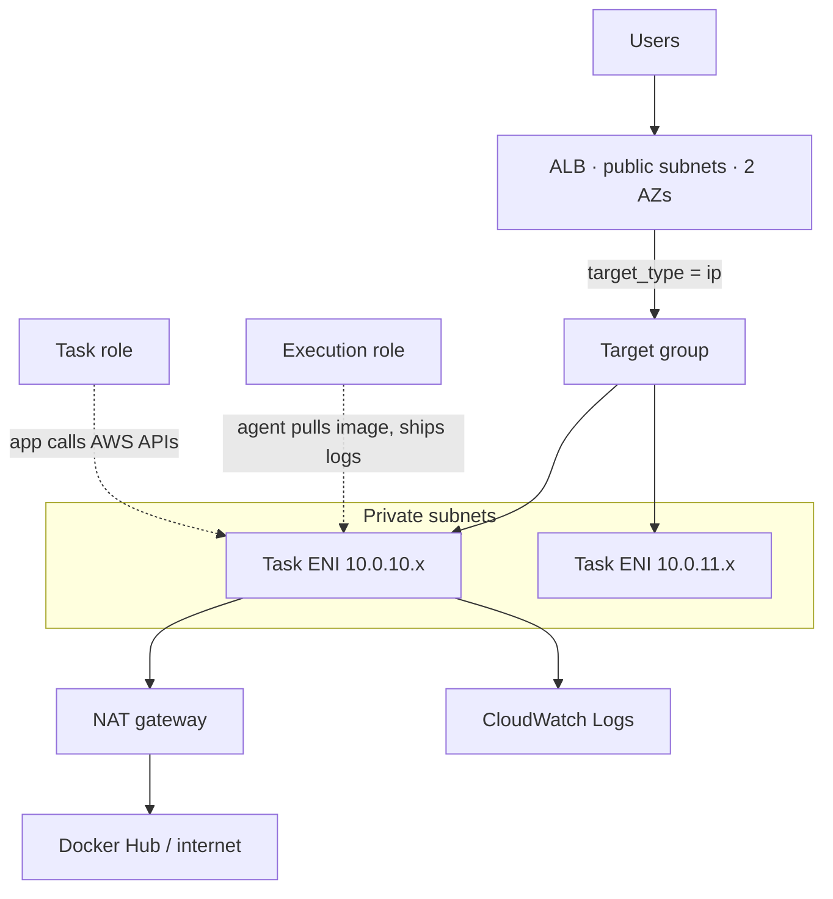

# 17 – Containers on AWS (ECS, Fargate, ECR, EKS)
Running containers without hand-managing the servers under them, and the four AWS services that make that possible.

> [!info] Exam TL;DR
> - **ECS is the orchestrator. Fargate is a launch type.** "ECS or Fargate" is a malformed question — you always use an orchestrator, and the launch type decides *who owns the servers*. EKS can use Fargate too.
> - **EC2 launch type** = you own, patch and bin-pack the instances, and pay for them whether tasks fill them or not. **Fargate** = no instances exist for you, you pay per vCPU-second and GB-second of what the task *requested*.
> - **Task definition : task :: AMI : EC2 instance.** An immutable, versioned blueprint. You never edit one — you register a new **revision**, and pointing the service at it *is* your deployment.
> - **Hierarchy:** Cluster → Service (keeps N tasks alive, wires them to the ALB) → Task (one running unit) → Container(s). Containers share a task only if they must live, die and scale as one unit.
> - **Fargate forces `network_mode = "awsvpc"`** — every task gets its own ENI and private IP. Therefore the ALB target group must be **`target_type = "ip"`**, never `"instance"`.
> - **Two IAM roles, different consumers.** *Execution role* = the Fargate agent (pull image, ship logs, read secrets). *Task role* = your application code (call S3, DynamoDB).
> - **ECS control plane is free. EKS costs $0.10/cluster/hour** whether or not anything runs on it.
> - **ECR needs an S3 gateway endpoint**, because ECR stores image layers in S3. This is the single most-missed piece of a no-NAT private setup.

## What problem does this solve?

You already know how to run a container: launch an EC2 instance, install Docker, `docker run`. That works for one container on one box.

Now imagine fifty containers in production. One dies at 3am — something has to notice and restart it. The instance it was on fills up — something has to place the replacement somewhere else. Traffic doubles — something has to start more and register them with the load balancer. You ship a new version — something has to roll it out gradually without dropping requests, and put the old one back if it's broken.

Doing that by hand is the nightmare. **ECS is the thing that does it for you**, and the way it does it is *desired state*: you never tell ECS "start a container." You tell it "three of these should be running, behind that load balancer," and a reconciliation loop continuously compares reality to that statement and closes the gap.

That single idea — declare the end state, let a loop converge on it — is the whole of container orchestration, and it's why the same idea shows up in Kubernetes, in Auto Scaling groups, and in Terraform itself.

> In one line: you never tell ECS to start a container — you declare how many should be running, and a loop closes the gap forever.

Fargate answers a second question: *who owns the servers underneath?* With the EC2 launch type, you do — you patch them, size them, and pay for the empty space. With Fargate, there are no servers in your account at all. You describe a task's CPU and memory, and AWS runs it somewhere you never see.

> In one line: ECS decides what runs; the launch type decides who owns the servers it runs on — two different questions, not two alternatives.

## How it actually works

**The four nouns, in order of containment:**

- **Cluster** — a logical grouping, plus (for EC2 launch type) the capacity attached to it. With pure Fargate a cluster is almost empty, because there's no capacity to attach. That's why `aws_ecs_cluster` looks suspiciously bare.
- **Task definition** — the immutable blueprint: which image, how much CPU and memory, which ports, where logs go, which IAM roles. Registered as `family:revision`.
- **Task** — one running instantiation of a task definition. One or more containers that share a network namespace and a lifecycle.
- **Service** — the reconciliation loop. Keeps N tasks running, replaces dead ones, registers and deregisters them with the ALB target group, and performs rolling deployments.

> In one line: a task definition is an AMI for containers — immutable and versioned, and pointing the service at a new revision *is* the deployment.

**A deployment, concretely.** You change the image and apply. A new task definition revision is registered. The service starts a new deployment: it launches tasks from the new revision, waits for them to pass health checks, registers them with the target group, then drains and stops the old ones. Two deployments coexist during the rollout — a `PRIMARY` (the new one) and an `ACTIVE` (the old one still serving).

Two defaults govern that dance:

- **`minimumHealthyPercent` = 100** — ECS may not drop below the desired count, so it will not kill a healthy old task to make room for an unproven new one. This is why a broken deploy leaves your site up.
- **`maximumPercent` = 200** — it may temporarily run up to double the desired count while rolling.

**Networking.** Fargate requires `awsvpc` mode: each task gets a real ENI with a private IP in your subnet, and its own security group. This is why load balancing works by IP, and why "which security group is on the task" is a meaningful question at all.

> In one line: awsvpc gives every task its own ENI, so the load balancer registers IP addresses — there is no instance to register.

## AWS console ↔ Terraform map

| Console action | Terraform resource | Key arguments |
|---|---|---|
| Create cluster | `aws_ecs_cluster` | `name` |
| Create task definition | `aws_ecs_task_definition` | `family`, `requires_compatibilities`, `network_mode`, `cpu`, `memory`, `execution_role_arn`, `container_definitions` (JSON, **camelCase keys**) |
| Create service | `aws_ecs_service` | `cluster`, `task_definition`, `desired_count`, `launch_type`, `network_configuration`, `load_balancer` |
| Attach to load balancer | `load_balancer` block on the service | `target_group_arn`, `container_name` (must match the container definition exactly), `container_port` |
| Target group | `aws_lb_target_group` | **`target_type = "ip"`** for Fargate |
| Task execution role | `aws_iam_role` + `aws_iam_role_policy_attachment` | trust `ecs-tasks.amazonaws.com`; attach `AmazonECSTaskExecutionRolePolicy` |
| Container logs | `aws_cloudwatch_log_group` + `logConfiguration` in the container definition | `awslogs-group`, `awslogs-region`, `awslogs-stream-prefix` |
| Registry | `aws_ecr_repository` | `name`, `image_scanning_configuration` |

## Architecture diagram

## Key facts, limits & pricing
*Verified against AWS docs 2026-09-06.*

- **EKS control plane: $0.10 per cluster per hour**, standard support. ECS has no control-plane charge.
- **Fargate (Linux/x86, us-east-1): ~$0.0404 per vCPU-hour and ~$0.0044 per GB-hour**, billed per second. **Fargate Spot: up to 70% off** for interruption-tolerant tasks.
- **Fargate CPU/memory pairs are fixed.** With `cpu = "256"` (0.25 vCPU) the only valid memory values are **512, 1024, 2048** MiB. An invalid pair fails at apply with a `ClientException`, not at plan.
- **Task execution role** is *"required depending on the requirements of your task"* — needed for ECR private pulls, the `awslogs` driver, and Secrets Manager/SSM references. **Not** needed to authenticate to a public Docker Hub image; that needs *network egress*, not IAM.
- **Deployment circuit breaker threshold** (`BOUNDED_PERCENT`, default value 50): `clamp(0.5 × desiredCount, min 3, max 200)`. A small service therefore gets **3**. `resetOnHealthyTask` defaults to **true**, so only *consecutive* failures count — one healthy task resets the counter to zero.
- **Circuit breaker rollback needs somewhere to roll back to.** AWS: *"When the deployment circuit breaker does not find a deployment that is in a COMPLETED state, the circuit breaker does not launch new tasks and the deployment is stalled."*
- **ALB target group algorithms:** *"round_robin, least_outstanding_requests, or weighted_random"* — default `round_robin`.
- **Docker Hub rate-limits anonymous pulls.** AWS's own guidance: *"By using Amazon ECR and Amazon ECR Public, you can avoid the limits imposed by Docker."*

### Pulling from ECR with no internet
For Fargate platform 1.4.0+, AWS states you *"require both Amazon ECR VPC endpoints and the Amazon S3 gateway endpoints"*:

| Endpoint | Type | Why it is needed |
|---|---|---|
| `com.amazonaws.<region>.ecr.api` | Interface | ECR API calls — auth token, DescribeImages |
| `com.amazonaws.<region>.ecr.dkr` | Interface | Docker Registry protocol — the pull itself |
| `com.amazonaws.<region>.s3` | **Gateway (free)** | ECR stores image **layers** in S3 (`prod-<region>-starport-layer-bucket`) |
| `com.amazonaws.<region>.logs` | Interface | required if the task uses the `awslogs` driver in a VPC with no internet gateway |

The endpoint's security group must allow **443 inbound from the private subnets**. And note the cost inversion: three interface endpoints billed per ENI per AZ can exceed one NAT gateway at $0.045/hr. Endpoints win on security posture, not automatically on price — count before assuming.

## Comparisons

### ECS vs EKS
| | ECS | EKS |
|---|---|---|
| Orchestrator | AWS-proprietary | upstream-conformant Kubernetes |
| Control plane cost | **free** | **$0.10/cluster/hr** |
| Portability | none — it's an AWS API | your *workloads* port (manifests, Helm); EKS itself is still AWS |
| Team cost | small; learn one AWS service | high; Kubernetes is a career |
| Exam trigger words | "simplest", "least operational overhead", "deep AWS integration" | "existing Kubernetes", "hybrid", "portable", "multi-cloud", "the team knows kubectl" |

### EC2 launch type vs Fargate
| | EC2 launch type | Fargate |
|---|---|---|
| Who owns the servers | you — patch, scale, secure, bin-pack | AWS; no instance exists in your account |
| Billing unit | the **instance**, full or empty | per vCPU-second + GB-second **requested** |
| Best when | steady heavy load you can pack tightly; GPU/special instance types | spiky, small, or bursty; you don't want to run servers |
| Network mode | bridge/host/awsvpc | **awsvpc only** |
| SSH to the host | possible | there is no host to SSH to |

### Task execution role vs task role
| | Task execution role | Task role |
|---|---|---|
| Used by | the **ECS/Fargate agent** | your **application code** in the container |
| Typical permissions | pull from ECR, write to CloudWatch Logs, read a Secrets Manager secret | `s3:PutObject`, `dynamodb:Query`, whatever your app calls |
| Credentials visible to the container? | **No** — AWS: *"not directly accessible by the containers in the task"* | Yes, via the task metadata endpoint |
| Needed for a public image with no logs? | No | No |

### ALB target types
| | `instance` | `ip` |
|---|---|---|
| Docs definition | *"targets are specified by instance ID"* | *"targets are IP addresses"* |
| Use with | EC2 instances / ASG | **Fargate (awsvpc)**, peered VPCs, on-prem over DX/VPN |
| Fargate outcome if wrong | apply succeeds, nothing ever registers, ALB returns 503 | works |

### ECR vs Docker Hub
| | ECR | Docker Hub |
|---|---|---|
| Authentication | **IAM** — the task execution role; no stored secret | username/password you must store and rotate |
| Private networking | reachable with no internet at all, via VPC endpoints | needs NAT or a public IP |
| Rate limits | none of Docker's | anonymous pulls are throttled |
| Extras | image scanning, lifecycle policies to expire old images, pull-through cache | — |

## Worked examples

> [!example] Worked example — a bad image ships and nobody notices
> A team changes an image tag, runs `terraform apply` in CI, and the pipeline goes green. Three days later someone asks why the fix isn't live.
>
> What happened: Terraform's job is to register a new task definition revision and tell ECS to use it. The API accepted that, so Terraform correctly reported success — **its contract ends at the API call.** ECS then tried to start tasks from the new revision, the pull failed, and because `minimumHealthyPercent` is 100 it refused to kill the healthy old tasks. The site stayed up on the *old* version. The deployment sat at `rolloutState: IN_PROGRESS`, retrying, with nothing anywhere marked red.
>
> This was reproduced deliberately in `17-ecs-alb` (see below). The fix is not a Terraform change — it's monitoring the *other* system: an EventBridge rule on `SERVICE_DEPLOYMENT_FAILED`, and a deployment circuit breaker so the rollout gives up instead of grinding.

> [!failure] Failure mode — the private subnet that can't pull
> You move tasks to private subnets for defence in depth, delete the NAT gateway to save $0.045/hr, and add ECR interface endpoints for `ecr.api` and `ecr.dkr`. Tasks now fail with `CannotPullContainerError` and the message mentions S3.
>
> Cause: ECR is a manifest API in front of **layers stored in S3**. Without the (free) `com.amazonaws.<region>.s3` **gateway** endpoint the manifest resolves and the layers never download. Add it, and check the endpoint security group allows 443 from the private subnets. Then add the `logs` interface endpoint too, or your tasks will run and log nothing.

## The Terraform I wrote
- Path: `../17-ecs-alb/` — ALB in two public subnets, Fargate tasks in two private subnets behind one NAT gateway, `nginxdemos/hello`.
- What was tricky: `target_type = "ip"`; `depends_on = [aws_lb_listener.http]` on the service, without which ECS rejects it with *"The target group does not have an associated load balancer"*; `container_name` in the service's `load_balancer` block having to match the container definition string exactly.
- Observed: 30 requests distributed 7/6/6/6/5 across five tasks — round robin, visible because the image prints its own server address.

## ⚠️ Traps — why the wrong answer looks right

> [!warning] Trap — "ECS or Fargate?"
> The question is malformed and the exam knows it. ECS is the orchestrator; Fargate is a launch type / capacity option, and EKS can use Fargate too. If a question offers "ECS" and "Fargate" as alternatives, it is really asking **who manages the servers**, not which orchestrator.

> [!warning] Trap — target_type on a Fargate service
> With `awsvpc` each task has its own ENI, so there is no instance ID to register. Leaving `target_type` at the default `"instance"` does not error: `terraform apply` succeeds, the service creates, no target ever registers, and the ALB serves 503 against a plan that looked clean.

> [!warning] Trap — a green apply is not a green deployment
> Terraform reports success once the ECS API accepts the new task definition. Whether containers start is a separate control loop on its own clock. Two systems, two definitions of "done", and only one of them is in your pipeline output.

> [!warning] Trap — the execution role is not for the pull
> Nothing in AWS authenticates you to Docker Hub; a public image needs *network egress*, not IAM. The execution role is required for **private ECR pulls, the `awslogs` driver, and secrets**. Answer "internet" for the public-image pull and "execution role" for the logs.

> [!warning] Trap — rollback needs somewhere to roll back to
> The circuit breaker rolls back to the most recent `COMPLETED` deployment. If the **first ever** deployment of a new service is broken, there is no such deployment: the breaker trips and the service stalls with zero tasks. Rollback protects against bad changes, not against a bad start.

> [!warning] Trap — endpoints are not automatically cheaper than NAT
> Three interface endpoints billed per ENI per AZ can cost more than one NAT gateway at $0.045/hr. Choose endpoints for the security posture and for per-GB data cost at volume — then do the arithmetic rather than assuming.

## 🔴 My weak spots (this topic)   #weak-spot
- Believed the S3 **gateway** endpoint was unusable for ECR because it "only supports S3 and DynamoDB" — it is in fact **mandatory**, precisely because ECR keeps image layers in S3. The inversion is the thing to remember.
- Gave "you don't need an IAM role for a public image" as a complete answer. Right about the pull, wrong about the conclusion: `awslogs` still requires the execution role.
- Knew `least_outstanding_requests` exists but not *when* to choose it: variable or expensive request cost, or targets of differing capacity.
- Scaled `desired_count` in the console, creating Terraform drift that the next apply silently reverted.

> [!tip] Production gap
> This lab is HTTP-only with no certificate, one NAT gateway, no autoscaling, no deployment alarm, and it pulls a public image anonymously. Production adds: **ACM + HTTPS** (or CloudFront in front), **one NAT gateway per AZ**, **Application Auto Scaling** target-tracking on the service, **EventBridge on `SERVICE_DEPLOYMENT_FAILED`**, **ECR** with lifecycle policies and scanning instead of Docker Hub, and **Secrets Manager** for anything sensitive via the task definition's `secrets` block. All of that is the `18-containers-capstone` build.

## ⚠️ Open question — verify before relying on this
- ⚠️ verify: with the circuit breaker enabled (`enable = true, rollback = true`) and a threshold of 3, a deployment failing with **`CannotPullContainerError`** was observed on 2026-09-06 to reach **12 failed tasks while still `IN_PROGRESS`**, never transitioning to `FAILED`. The documented behaviour is that tasks failing to reach `RUNNING` increment the counter and trip at the threshold. Hypothesis, **not confirmed**: an image that cannot be resolved produces *"unable to place a task"*, which may be accounted differently from a task that starts and then fails a health check. Re-test by breaking the **container health check** rather than the image before trusting the circuit breaker to catch pull failures.

## 🔗 Docs
- [ECS task execution IAM role](https://docs.aws.amazon.com/AmazonECS/latest/developerguide/task_execution_IAM_role.html) — verified 2026-09-06
- [ECS deployment circuit breaker](https://docs.aws.amazon.com/AmazonECS/latest/developerguide/deployment-circuit-breaker.html) — threshold formula, verified 2026-09-06
- [ECR interface VPC endpoints](https://docs.aws.amazon.com/AmazonECR/latest/userguide/vpc-endpoints.html) — the S3 gateway requirement, verified 2026-09-06
- [ALB target groups](https://docs.aws.amazon.com/elasticloadbalancing/latest/application/load-balancer-target-groups.html) — target types and algorithms, verified 2026-09-06
- [EKS pricing](https://aws.amazon.com/eks/pricing/) · [Fargate pricing](https://aws.amazon.com/fargate/pricing/) — verified 2026-09-06
- [Terraform `aws_ecs_service`](https://registry.terraform.io/providers/hashicorp/aws/latest/docs/resources/ecs_service)

---
**Self-test for this topic:** [[revision/17-containers-revision#Self-test]]
