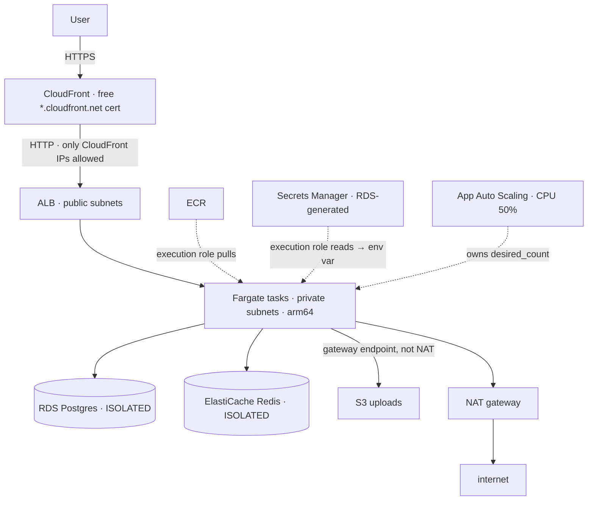

# 18 – Containers capstone (the services meeting each other)
Seven services already covered separately, wired into one production-shaped system — and the lessons that only appear where they join.

> [!info] Exam TL;DR
> - **Three tiers, and the third one has no default route.** Public (ALB, NAT) → private (tasks, egress via NAT) → **isolated** (RDS, ElastiCache, *no route to the internet at all*). The database can't phone home as a matter of **routing**, independently of any security group.
> - **`manage_master_user_password = true` is the whole answer** to "keep the DB password out of Terraform". RDS generates it into Secrets Manager; Terraform, state and tfvars never hold it.
> - **The password reaches the container through the task definition's `secrets` block, fetched by the *execution* role.** `environment` = visible to anyone with `DescribeTaskDefinition`; `secrets` = injected by the agent at start. One word, and it's the most common ECS security mistake.
> - **Execution role vs task role, concretely:** execution pulled the image, shipped logs and read the secret; task wrote to S3. The app never had permission to read its own password.
> - **Lock the ALB to CloudFront with the `com.amazonaws.global.cloudfront.origin-facing` managed prefix list.** Then a direct request to the ALB *times out* — that timeout is the success condition.
> - **When an autoscaler owns `desired_count`, Terraform must stop owning it:** `lifecycle { ignore_changes = [desired_count] }`. Same drift you fought in `17-`, now on purpose.
> - **A plan that changes the same thing every apply is never real drift.** It's a value AWS accepts but reads back differently — `gateway_id` holding a NAT ID, or a task definition `.id` (family) where `.arn` (family:revision) was needed.

## What problem does this solve?

Every service here was already understood on its own. What a single-service lab can't teach is what happens at the seams: how a container gets a database password it's never allowed to read, why a database in a subnet with no internet route can still take backups, who owns the task count once an autoscaler exists, and why an origin has to be told who its CDN is.

Those seams are where production systems actually break, and they're where SAA-C03's scenario questions live — a stem that mentions ECS, RDS and Secrets Manager together is testing the wiring, not the services.

> In one line: the capstone's lessons are all about the joints, because the bones were already known.

## How it actually works

**The three tiers are three route tables.** Public has `0.0.0.0/0 → IGW`. Private has `0.0.0.0/0 → NAT`. **Isolated has no default route** — its only entries are the VPC-local route and the S3 gateway endpoint's prefix list. The database security groups *also* have no egress rule. Two independent controls: delete one and the other still holds.

**The password never exists in your files.** RDS creates it, stores it as `{username, password}` in Secrets Manager, and exposes `master_user_secret[0].secret_arn`. The task definition references `"${secret_arn}:password::"` — AWS's JSON-key ARN syntax meaning "just the `password` field, current version". The **execution role** is granted `secretsmanager:GetSecretValue` on that one ARN; the Fargate agent fetches it and injects `DB_PASSWORD` before the container starts. The **task role** has `s3:PutObject` on one bucket and nothing else — the app can write uploads but cannot read its own credentials.

> In one line: the execution role is the plumbing, the task role is the app, and the password only ever flows through the plumbing.

**Autoscaling changes who owns a number.** Terraform creates the service with `desired_count = 2`. Application Auto Scaling then tracks CPU at 50% between 1 and 4 tasks. With no load it scaled *in* to 1. Without `ignore_changes`, every `terraform apply` would drag it back to 2 and the two would fight forever.

## Key facts, limits & pricing
*Verified during the build, 2026-09-19.*

- **All up at once: ~13¢/hour.** NAT gateway $0.045/hr, ALB $0.0225/hr, RDS db.t3.micro ~$0.017/hr, ElastiCache cache.t3.micro ~$0.017/hr, one Fargate task ~$0.012/hr, public IPv4 ~$0.015/hr. Session-based, destroyed each time.
- **RDS-managed secrets are deleted with the instance.** After `terraform destroy`, `list-secrets --include-planned-deletion` returned 0. Nothing lingers.
- **`aws_elasticache_cluster` takes `engine = "redis"` or `"memcached"` only** on provider v6. Valkey needs `aws_elasticache_replication_group`.
- **Target group `deregistration_delay` defaults to 300 s.** Set it to 30 in a lab or every deploy and destroy waits five minutes for a drain that finished long ago (learned the hard way in `17-`).
- **The CloudFront origin-facing prefix list** exists in every account as `com.amazonaws.global.cloudfront.origin-facing`; look it up with `data.aws_ec2_managed_prefix_list`, never hardcode the `pl-` ID.
- **ECR login is a 12-hour token from your IAM identity** (`aws ecr get-login-password`). No username, no stored password, nothing to rotate — that is the ECR-vs-Docker-Hub lesson in one command.
- **The DB password RDS generated was 28 characters**, visible only via `aws secretsmanager get-secret-value` on the ARN Terraform output.

## Comparisons

### Where a task's configuration lives
| | `environment` | `secrets` |
|---|---|---|
| Visible via `DescribeTaskDefinition` | **yes, in plaintext** | no — only the ARN |
| Who resolves it | nothing; it's a literal | the Fargate agent, at task start |
| Permission needed | none | **execution role**: `secretsmanager:GetSecretValue` (or `ssm:GetParameters`) |
| Put here | `DB_HOST`, `DB_NAME`, `DB_USER`, `REDIS_HOST`, `UPLOAD_BUCKET`, `IMAGE_TAG` | **`DB_PASSWORD`** |

### The two ECS roles, as used in this build
| | Execution role | Task role |
|---|---|---|
| Whose identity | the **Fargate agent** | **your container's code** |
| Did in this build | pulled the image from ECR, wrote CloudWatch Logs, **read the DB secret** | **wrote objects to S3** |
| Managed policy | `AmazonECSTaskExecutionRolePolicy` + one inline secret grant | none; one inline `s3:PutObject` |
| Could it read the password? | yes | **no — never had the permission** |
| Wrong role for the secret grant → | — | task fails to start: "unable to retrieve secrets" |

### Two independent controls on the isolated tier
| | Routing (route table) | Access (security group) |
|---|---|---|
| What it controls | whether a **path** to the internet exists | whether a **packet** is allowed |
| Isolated tier setting | no `0.0.0.0/0` route at all | no egress rule at all |
| If someone deletes the other | still blocked | still blocked |
| Exam framing | "network segmentation" | "least privilege" |

### Three ways to keep a DB password out of Terraform
| | `sensitive` variable + tfvars | write-only `password_wo` | `manage_master_user_password` |
|---|---|---|---|
| In state? | **yes** (marked sensitive, still stored) | no | no |
| In a file on disk? | yes, git-ignored | no (ephemeral) | **no, nowhere** |
| Who rotates | you | you | **RDS, automatically** |
| Terraform version | any | 1.11+ | any |
| The exam's answer to "use Secrets Manager with RDS" | no | no | **this** |

### The perpetual-drift pattern — two instances from this build
| Symptom | Config said | AWS read back | Fix |
|---|---|---|---|
| private route table changes every apply | `gateway_id = <nat-…>` | `nat_gateway_id = <nat-…>` | use **`nat_gateway_id`** for a NAT (`gateway_id` is for an IGW/VGW) |
| ECS service changes every apply | `task_definition = ….id` (`capstone`) | `capstone:1` | use **`.arn`**, which carries the revision |
| The rule | AWS **accepted** the value | and returned something **more specific** | reference the attribute whose value matches what AWS returns |

## Worked examples

> [!example] Worked example — the password's whole journey
> `aws_db_instance` is created with `manage_master_user_password = true` and no `password`. RDS generates a 28-character password and writes `{"username":"capstone_admin","password":"…"}` to a Secrets Manager secret named `rds!db-…`. Terraform learns only the ARN, via `master_user_secret[0].secret_arn`.
>
> The task definition's `secrets` block says `DB_PASSWORD` ← `"<that ARN>:password::"`. The **execution role** gets an inline policy allowing `secretsmanager:GetSecretValue` on that ARN and nothing else. At task start the Fargate agent fetches the secret, extracts the `password` field, and sets it as an environment variable inside the container. The app reads `os.environ["DB_PASSWORD"]`.
>
> Verified: `grep password *.tf` finds only `manage_master_user_password = true`; `terraform state show aws_db_instance.this` has no password; `describe-task-definition` shows `DB_PASSWORD` under `secrets`, everything else under `environment`. The app's task role has no `secretsmanager:*` at all — it could write S3 but could never fetch its own credential.

> [!failure] Failure mode — the plan that never goes clean
> After phase 1 applied, every subsequent `terraform apply` showed the private route table being "updated in place": remove a route with `nat_gateway_id = nat-…`, add one with `gateway_id = nat-…`. Same ID, different attribute. Nothing was broken — private tasks pulled images fine — which is exactly why this is dangerous: **there is no error, only a plan that lies about drift forever.**
>
> Cause: `gateway_id` holds an IGW or VGW; a NAT gateway needs `nat_gateway_id`. AWS accepted the NAT ID in the wrong field and created the route correctly, then reported it back under the right field. Config and state disagreed on every read. The same thing happened again with `task_definition = ….id`: AWS accepted the bare family, resolved it to `capstone:1`, and Terraform saw a change every time. Both fixed with one word; both would have gone unnoticed in a config nobody re-planned.

## ⚠️ Traps — why the wrong answer looks right

> [!warning] Trap — the ALB timed out, so something's broken
> After locking the ALB's ingress to the CloudFront prefix list, a direct `curl` to the ALB DNS name **hangs and times out**. That is the success condition, not a failure: only CloudFront's published IP ranges may reach the origin, so anyone who finds the ALB's name gets nothing. Same lesson as OAC on an S3 origin — the origin verifies *who* is calling.

> [!warning] Trap — the autoscaler scaled to 1, so the ALB isn't load balancing
> With no traffic, target-tracking on 50% CPU scaled the service **in** to its minimum of 1, so every request hit the same task. Nothing is wrong: `desired_count = 2` was only the *initial* value, and `ignore_changes` told Terraform the autoscaler owns it now. `terraform plan` stayed clean the whole time. Generate load and it scales back out.

> [!warning] Trap — `.id` on a task definition
> `aws_ecs_task_definition.x.id` is the **family** (`capstone`). ECS accepts a bare family and resolves it to the latest revision — then reads back `capstone:1`, and the plan drifts forever. Use `.arn`, which carries the revision. That's also what makes deployments *visible*: change the image tag and the plan shows `:1 → :2`.

> [!warning] Trap — putting the secret grant on the task role
> The **execution role** fetches secrets, because the agent injects them before the container exists. Grant `secretsmanager:GetSecretValue` to the task role instead and the task never starts: "unable to retrieve secrets". Execution = plumbing; task = app.

> [!warning] Trap — health check on `/`
> The ALB health check targets `/health`, which has **no dependencies**. Point it at `/` or `/db` and a slow RDS marks every task unhealthy, the ALB drains them all, and an outage in one dependency takes down the whole service. The health check answers "can this task serve at all", not "is everything downstream up".

> [!warning] Trap — "the S3 upload went through the NAT gateway"
> It didn't. The S3 **gateway endpoint** is attached to the private route table, so S3 traffic takes the prefix-list route and never touches the NAT — and never pays $0.045/GB for it. The NAT's `BytesOutToDestination` metric doesn't move on an upload. Free, and the reason the endpoint went in during phase 1.

## 🔴 My weak spots (this topic)   #weak-spot

- [ ] **`gateway_id` versus `nat_gateway_id` on a route** — put a NAT gateway ID in `gateway_id`. AWS accepted it and read it back as `nat_gateway_id`, so the plan changed the same route on every apply. `gateway_id` is for an IGW or VGW.
- [ ] **`.id` versus `.arn` on an ECS task definition** — `.id` is the bare family, `.arn` carries the revision. ECS resolved the family to `capstone:1` and the service drifted every apply.
- [ ] **Recognising perpetual drift for what it is** — twice I read "1 to change" as something I'd broken. A change that recurs on every apply with nothing edited is always a config attribute that AWS reads back differently, never real drift.

> [!tip] Production gap
> Single NAT gateway (prod: one per AZ), single-AZ RDS (prod: `multi_az = true`), single Redis node (prod: a replication group with Multi-AZ), no WAF on CloudFront, no ALB access logs, no EventBridge alarm on `SERVICE_DEPLOYMENT_FAILED`, no PITR on the uploads bucket, `MUTABLE` image tags (prod: `IMMUTABLE` + a new tag per build), and CloudFront's `CachingDisabled` on everything (prod: cache the static paths). Every one of these is a single argument or resource away; none of them changes the shape.

## 🔗 Docs
- [RDS managed master password](https://docs.aws.amazon.com/AmazonRDS/latest/UserGuide/rds-secrets-manager.html) — verified 2026-09-06
- [ECS secrets from Secrets Manager — JSON-key ARN syntax](https://docs.aws.amazon.com/AmazonECS/latest/developerguide/secrets-envvar-secrets-manager.html) — re-verified 2026-09-30 (page renamed)
- [ECS task execution role](https://docs.aws.amazon.com/AmazonECS/latest/developerguide/task_execution_IAM_role.html) — verified 2026-09-06
- [ALB target groups — deregistration delay](https://docs.aws.amazon.com/elasticloadbalancing/latest/application/load-balancer-target-groups.html) — verified 2026-09-06
- [Terraform `lifecycle` meta-argument](https://developer.hashicorp.com/terraform/language/meta-arguments/lifecycle) — verified 2026-09-06
