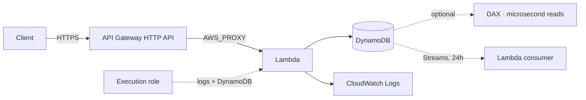

# 19 – Serverless (Lambda, DynamoDB, API Gateway)
Compute, storage and a front door that all cost nothing when nobody is using them.

> [!info] Exam TL;DR
> - **Lambda's hard ceiling is 15 minutes.** When a stem says the job takes longer, Lambda is wrong and the answer is Fargate, Batch or Step Functions. This is the most common single elimination in the topic.
> - **You set memory; CPU follows.** There is no CPU dial. **At 1,769 MB a function has one vCPU.** More memory can be *cheaper*, because a faster finish means fewer GB-seconds.
> - **Three invocation models, not two.** Synchronous (no Lambda retries), asynchronous (**retries twice**, then DLQ/destination), and **event source mapping** for SQS / Kinesis / DynamoDB Streams — where the *source's* rules govern retries.
> - **A VPC-attached Lambda loses internet access**, and putting it in a public subnet does **not** give it back. Private subnet + NAT, or VPC endpoints.
> - **DynamoDB makes you choose your access patterns before the table exists.** SQL lets you ask new questions later. That trade, not "which one scales", is the discriminator.
> - **LSIs can only be created with the table and can never be added or removed.** GSIs can be added any time. GSI queries are eventually consistent only.
> - **API Gateway bills per request and costs nothing idle; an ALB bills ~$0.0225/hr forever.** That is what makes API Gateway + Lambda "serverless".
> - **HTTP API is the cheap fast one.** Caching, API keys, usage plans, WAF or a private VPC-only API all force **REST**.

## What problem does this solve?

You can already run code on EC2 and you can already store data in RDS. Serverless is not about capability — it is about what exists when nobody is using your application.

An EC2 instance exists. An ALB exists. An RDS instance exists. They are running, and billing, at 3am on a Sunday with zero users. Lambda, DynamoDB on-demand and API Gateway have nothing running: you pay per request and per millisecond of actual work, and at zero traffic you pay **zero**. That is the whole proposition, and it is why a cost question with "unpredictable" or "infrequent" in it usually points here.

What you give up is control. You cannot SSH to the machine, you cannot keep a long-lived connection, you cannot run for more than fifteen minutes, and with DynamoDB you cannot invent a new query next Tuesday without having planned for it.

> In one line: serverless trades control for the ability to cost nothing when idle.

## How it actually works

**Lambda** runs your code in an *execution environment* it creates on demand and reuses when it can. The first invocation into a new environment pays a **cold start** — downloading your code and initialising the runtime. Reused environments are warm. This is why `/tmp` sometimes still has your last invocation's files, and why you must never rely on that.

You configure **memory**, and AWS allocates CPU in proportion. AWS: *"Lambda allocates CPU power in proportion to the amount of memory configured... At 1,769 MB, a function has the equivalent of one vCPU."* Range is 128 MB to 10,240 MB.

> In one line: memory is the only performance dial, and it moves CPU with it.

**DynamoDB** stores items in *partitions*, and which partition an item lands in is decided by hashing its **partition key**. That single fact explains almost everything else: a `Query` on one partition key is cheap because the items are already together; finding an item without its partition key means scanning everything.

> In one line: the partition key is not a column name, it is the physical layout of your data.

**API Gateway** is a managed front door. It does not load balance across a fleet — each route invokes exactly one integration. AWS scales the gateway itself.

## Architecture diagram

## Key facts, limits & pricing

- **A Lambda function URL is a built-in, dedicated HTTPS endpoint** on the function itself — *"A function URL is a dedicated HTTP(S) endpoint for your Lambda function"*. A third-party **webhook** can POST straight to it with **no API Gateway in the path**. Use API Gateway instead when you need what it adds: throttling, usage plans and API keys, request validation, canary stages, WAF, or a private integration.
- **DynamoDB on-demand absorbs a spike instantly; provisioned + auto scaling does not.** On-demand *"instantly accommodates your workloads as they ramp up or down to any previously reached traffic level"* and **instantly handles up to double the previous peak**; a brand-new on-demand table already sustains **4,000 writes/sec and 12,000 reads/sec**, you pay **nothing at zero traffic**, and it is now AWS's **default and recommended** mode. Provisioned auto scaling reacts only **after a CloudWatch alarm fires** — minutes — so a sudden unpredictable spike throttles in the meantime. "Unpredictable" or "sudden spike" → **on-demand**; steady, forecastable traffic → provisioned (cheaper per request).
- **To alert on new items without touching the application:** enable **DynamoDB Streams**, trigger a **Lambda** from the stream, and have it publish to **SNS**. That is the native change-notification path — no polling, no application change, and the stream is the only thing that sees every insert/update/delete.
*Verified against AWS docs 2026-10-04.*

- **API Gateway has three API types, and WebSocket is the stateful one.** **REST** and **HTTP** APIs are stateless request/response. A **WebSocket API** keeps a **persistent, two-way connection** open, so the backend can **push** to the client — the answer for chat, live dashboards, multiplayer and streaming notifications, where polling a REST API is the distractor. ⚠️ verify: the per-connection limits and idle timeout.

- **Lambda environment variables are already encrypted at rest** — *"Lambda stores environment variables securely by encrypting them at rest"* with a default service key. That protects the storage, not the *display*: anyone who can read the function configuration sees the values. To hide a value from other developers you **configure Lambda to use your own KMS key** and encrypt the value, encrypt it **client-side**, or keep it out of the function entirely in **Secrets Manager** / Parameter Store — which is the better answer whenever the value is a credential. *(Verified 2026-10-01.)*

- **API Gateway throttling:** token bucket — a **steady-state rate** plus a **burst**; over the limit is **`429 Too Many Requests`** and the request never reaches the backend. Settable **per stage**, **per method**, or **per client** via a **usage plan** + API key (per-client can't exceed per-account).
- **API Gateway canary release:** attaches to a **stage**, splits traffic at random by a configured **percentage**, keeps separate metrics/logs, then you **promote** the canary. Same endpoint and domain — no second API, no DNS change.
- **ACM certificate Region for a custom domain depends on the endpoint type:** **Regional** → same Region as the API; **edge-optimized** → **`us-east-1`** (it is CloudFront-fronted).
- **API Gateway is outside your VPC** — no security group, no subnet. Restrict callers with a **resource policy** + `aws:SourceIp`; reach a private backend with a **private integration over a VPC link**.
- **An `AWS` integration exposes AWS service actions directly** — e.g. a REST API straight to **DynamoDB**, no Lambda. Non-proxy only (`AWS`, not `AWS_PROXY`), so you map request and response yourself.
*Verified against AWS docs 2026-10-01.*

- **Lambda logs** go to CloudWatch Logs by default in a log group named **`/aws/lambda/<function-name>`** — but only if the **execution role** grants the permission. You can point a function at a different log group via console/CLI/API. *(Verified 2026-09-30.)*
*Verified against AWS docs 2026-09-12.*

- **Lambda memory**: 128 MB – 10,240 MB; **1,769 MB = one vCPU**. Timeout ceiling **900 seconds (15 min)**.
- **Asynchronous retries**: *"Lambda retries function errors twice"* — three attempts total — then the event goes to a DLQ or destination. **Direct/synchronous invocation gets no Lambda retries at all**: *"Lambda does not automatically retry these types of errors on your behalf."*
- **VPC networking uses Hyperplane ENIs**, shared per *subnet + security group combination*, not one per concurrent execution: *"Other functions in your account that use the same subnet and security group combination can also use this ENI."* Each supports up to **65,000 connections**. A new VPC function sits in `Pending` for several minutes while the ENI is built, and 14 days idle reclaims it.
- **VPC and the internet**: *"When you attach your function to a VPC, it can only access resources available within that VPC"*, and *"Connecting a function to a public subnet doesn't give it internet access or a public IP address."*
- **DynamoDB Streams** retain records for **24 hours**, organised into shards. Four `StreamViewType` values: `KEYS_ONLY`, `NEW_IMAGE`, `OLD_IMAGE`, `NEW_AND_OLD_IMAGES` — and *"It is not possible to edit a StreamViewType once a stream has been setup."*
- **Secondary index quotas**: **20 GSIs** (default) and **5 LSIs** per table. LSI: *"For each partition key value, the total size of all indexed items must be 10 GB or less."*
- **API Gateway default throttle**: 10,000 requests/second per account per Region, burst bucket 5,000.
- **Lambda runtimes** are versioned per language release; `python3.13` is current and supported. *"All supported Lambda runtimes support both x86_64 and arm64 architectures"* — arm64/Graviton is cheaper per GB-second.

## What API Gateway does besides invoke Lambda

Six facts here, and the vault taught none of them. They matter because API Gateway is the most
over-simplified service in the notes: "a managed front door that invokes one integration" is true
and hides most of what the exam asks.

**It does not need Lambda at all.** An `AWS` integration *"lets an API expose AWS service
actions"* — so a REST API can call **DynamoDB directly**, no function in the path. It is the
**non-proxy** type only (`type = AWS`, versus `AWS_PROXY` for Lambda), which is the cost: you
must configure the integration request and response and map the data yourself. "Remove the Lambda
that only forwards to DynamoDB" is a real answer, not a trick.

**Throttling is a control, not just a quota.** API Gateway uses a **token bucket**: a
**steady-state rate** plus a **burst**. Over the limit, clients get **`429 Too Many Requests`**
and the request never reaches your backend. You set target limits **per API stage or per method**,
or use **usage plans** with **API keys** for **per-client** limits (which can't exceed the
per-account limits). That is the mechanism for "protect the downstream tier from a traffic spike".

**Canary releases live on a stage.** *"Total API traffic is separated at random into a production
release and a canary release with a pre-configured ratio"*, with its own metrics and logs; when
you are satisfied you **promote the canary to the production release** and disable it. Same
endpoint, same custom domain — **no second API and no DNS change**. That is why it beats a
hand-built blue/green with two APIs and a domain cutover.

**It sits outside your VPC.** There is no security group on API Gateway and you cannot put it in
a subnet behind a NACL. Two consequences:
- To restrict **who may call it** by IP, use an **API Gateway resource policy** with an
  `aws:SourceIp` condition — AWS documents exactly this ("Deny API traffic based on source IP
  address or range").
- To **reach into** a private subnet, you need a **private integration** over a **VPC link**.
  ⚠️ verify: the exact target per API type (HTTP APIs document Application Load Balancers and
  ECS services; REST APIs are commonly stated as NLB-only).

> [!warning] Trap — "add a security group rule to let API Gateway in"
> API Gateway is a managed service **outside your VPC**, so it has no security group and no
> subnet. Any option that secures it with a security group or a NACL is wrong by construction.
> Restricting callers is a **resource policy** with `aws:SourceIp`; reaching a private backend is
> a **private integration over a VPC link**. Note the two are opposite directions and the exam
> pairs them as distractors — a **private endpoint** (who can reach the API) is not a **private
> integration** (what the API can reach).

> [!warning] Trap — the certificate Region for a custom domain
> It depends on the **endpoint type**, not on the service. AWS: to use an ACM certificate with a
> **Regional** custom domain name you must have it *"in the same Region as your API"*; with an
> **edge-optimized** custom domain name you must have it *"in the US East (N. Virginia) –
> `us-east-1` Region"* — because edge-optimized is fronted by CloudFront, and that is the same
> `us-east-1` rule from [[21-security#ACM — where the certificate has to live]]. A stem that says
> "regional API" and offers a `us-east-1` certificate is offering the CloudFront answer to a
> non-CloudFront question.

## Comparisons

### DynamoDB vs relational (RDS / Aurora, including Serverless)
| | DynamoDB | RDS / Aurora |
|---|---|---|
| What exists | **nothing** — an API endpoint | instances, measured in ACUs even when "serverless" |
| Connections | none; every op is an HTTPS call | a **connection limit** you can exhaust |
| When you decide your queries | **before the table exists** — the key schema *is* the query plan | later; write a new `SELECT` any time |
| Joins, aggregates, ad-hoc reporting | no | yes |
| Scale story | horizontal, effectively unbounded | vertical, plus read replicas |
| Exam trigger | "single-digit millisecond latency **at any scale**", "millions of requests/sec", key-value, session store, shopping cart | "complex queries", "joins", "existing MySQL/PostgreSQL app", "our analysts query it" |

### Global secondary index vs local secondary index
| | GSI | LSI |
|---|---|---|
| Partition key | **any attribute** | **must be the table's partition key** |
| Sort key | optional | required, any attribute |
| **When it can be created** | **any time — add or delete freely** | **table creation ONLY; never added, never removed** |
| Read consistency | **eventual only** | eventual **or strong** |
| Throughput | its own, separate from the table | drawn from the table's |
| Size limit | none | **10 GB per partition key value** |
| Max per table | 20 | 5 |

### The three Lambda invocation models
| | Synchronous | Asynchronous | Event source mapping |
|---|---|---|---|
| Who | API Gateway, ALB, function URL, direct `Invoke` | S3, SNS, EventBridge | **SQS**, Kinesis, DynamoDB Streams |
| Caller waits? | yes | no — queued, returns immediately | n/a — Lambda **polls** the source |
| Retries by Lambda | **none** | **twice** (3 attempts) | the **source's** rules |
| Failure lands where | back at the caller | DLQ or destination | source-defined — for SQS, `maxReceiveCount` → its DLQ |

### Reserved vs provisioned concurrency
| | Reserved | Provisioned |
|---|---|---|
| Solves | one function eating the whole account concurrency pool | **cold starts** |
| What it does | caps this function, and guarantees it that much | keeps N environments **pre-initialised** |
| Costs extra? | no | **yes, billed whether invoked or not** |
| Set it to 0 | **disables the function** | n/a |

### REST API vs HTTP API
| | REST | HTTP |
|---|---|---|
| Caching | **yes** | no |
| API keys, usage plans, per-client throttling | **yes** | no |
| AWS WAF | **yes** | no |
| Private (VPC-only) endpoint | **yes** | no |
| Edge-optimized endpoint | **yes** | no |
| Request validation, canary deploys, X-Ray | **yes** | no |
| Native JWT authorizer | no (use a Lambda authorizer) | **yes** |
| Price / latency | higher | **lower** |

### API Gateway vs ALB as a front door
| | API Gateway | ALB |
|---|---|---|
| Cost at zero traffic | **nothing** | **~$0.0225/hr** (~$16/month) |
| Cost at very high volume | per request, forever | hourly cost amortises — **becomes cheaper** |
| Load balances across targets | no — one integration per route | yes |
| API keys, usage plans, request validation | yes (REST) | no |

## Worked examples

> [!example] Worked example — designing the table from the access patterns
> The lab's API serves three operations: create a note, list all notes for a user, fetch one specific note. Those three *are* the access patterns, and in DynamoDB they decide the key schema before anything gets built.
>
> "List all notes for one user" must be **one** cheap read, so `userId` has to be the **partition key** — that puts every one of a user's notes in the same partition. "Fetch one specific note" needs `GetItem`, which requires the **complete** primary key, so a second attribute is needed to tell one note from another: `noteId` as the **sort key**. `hash_key = "userId"`, `range_key = "noteId"`.
>
> Then the design question the schema cannot answer: **"fetch note X, I don't know whose it is."** Nothing in that table supports it — you would have to scan every item. That is what a **GSI** is for: the same data, partitioned a different way.
>
> Note also what you do *not* declare. `title`, `body` and `createdAt` are written by the application and are never part of the table definition — DynamoDB is schemaless for everything outside a key, so **only key attributes are declared**, and declaring a non-key one is an error.

## ⚠️ Traps — why the wrong answer looks right

> [!warning] Trap — Lambda in a public subnet
> "Give the VPC-attached function internet access" is **not** answered by moving it to a public subnet. AWS: *"Connecting a function to a public subnet doesn't give it internet access or a public IP address."* A Lambda ENI never gets a public IP. The answers are a **private subnet routed to a NAT gateway**, or **VPC endpoints** for the specific services.

> [!warning] Trap — ENI per concurrent execution
> Older material teaches that a VPC Lambda creates one ENI per concurrent execution, making IP exhaustion a scaling risk. That was the pre-2019 model. Hyperplane ENIs are **shared across functions using the same subnet + security group combination** and scale on *connections*, not concurrency. What still bites is the multi-minute `Pending` state while a new one is built.

> [!warning] Trap — SQS is not an asynchronous invocation
> S3 and SNS invoke Lambda asynchronously, so Lambda retries twice and then uses a DLQ. **SQS is an event source mapping** — Lambda *polls* it — so retry behaviour comes from the **queue's** visibility timeout and `maxReceiveCount`, exactly as in [[15-decoupling]]. Answering "Lambda will retry twice" for an SQS-triggered function is wrong.

> [!warning] Trap — API keys are not authentication
> Usage plans and API keys *"track and limit usage"*. They identify a caller for metering and throttling; they prove nothing about identity. If an option offers API keys as the security control, it is the distractor. Authentication is **IAM** (an AWS principal), **Cognito** (an end user who logged in), or a **Lambda authorizer** (your own scheme).

> [!warning] Trap — "ECS-style" two roles on Lambda
> ECS splits an **execution role** (the agent: pull the image, ship logs) from a **task role** (your code's AWS permissions). **Lambda has one role doing both jobs.** Same word, different split — do not go looking for a Lambda "task role".

> [!warning] Trap — more memory is always more expensive
> Not necessarily. Lambda bills GB-seconds, and CPU scales with memory, so doubling memory on a CPU-bound function can more than halve its duration. The cost-optimisation answer to "this function is slow and expensive" is often **raise the memory**.

## 🔴 My weak spots (this topic)   #weak-spot

- [ ] **DynamoDB versus Aurora Serverless when both "scale"** — the discriminator is not which scales, it is **when you must decide your queries**: DynamoDB before the table exists, SQL any time afterwards.
- [ ] **GSI versus LSI** — did not know these at all. The hard one: an **LSI can only be created with the table and can never be added or removed**; a GSI can be added any time.
- [ ] **SQS filed under asynchronous invocation** — it is an **event source mapping**, the third model, where the queue's `maxReceiveCount` governs retries, not Lambda's two.
- [ ] **The VPC Lambda ENI model** — answered with the pre-2019 "one ENI per concurrent execution, IP exhaustion at scale" story. Hyperplane ENIs are shared per subnet + security group.
- [ ] **REST versus HTTP API** — did not know the split. Memory hook: **caching, API keys, usage plans, WAF or private endpoint ⇒ must be REST**.
- [ ] **API Gateway authorizer types** — knew Cognito issued JWTs but not that it plugs in as an authorizer, nor that IAM and Lambda authorizers are the other two.
- [ ] **"IAM role for a public Docker Hub image"** — answered that no role is needed. Right about the *pull* (that needs internet, not IAM), wrong overall: the execution role is required for **`awslogs`**.

> [!tip] Production gap
> This lab has no authorizer, no throttling, no WAF, no tracing, and a `$default` stage with no canary. Production adds an authorizer (**Cognito** for end users, **IAM** for service-to-service), **usage plans** if you meter customers, **X-Ray** for tracing across the API-to-Lambda-to-DynamoDB hop, **provisioned concurrency** if cold starts hurt a user-facing path, and **PITR** on the table.

## 🔗 Docs
- [Lambda function URLs](https://docs.aws.amazon.com/lambda/latest/dg/urls-configuration.html) · [DynamoDB on-demand capacity mode](https://docs.aws.amazon.com/amazondynamodb/latest/developerguide/on-demand-capacity-mode.html)
- [Lambda environment variables (encryption at rest)](https://docs.aws.amazon.com/lambda/latest/dg/configuration-envvars.html)
- [API Gateway request throttling (token bucket, 429, stage/method/usage plan)](https://docs.aws.amazon.com/apigateway/latest/developerguide/api-gateway-request-throttling.html)
- [Canary release deployments](https://docs.aws.amazon.com/apigateway/latest/developerguide/canary-release.html)
- [Certificate Region by endpoint type](https://docs.aws.amazon.com/apigateway/latest/developerguide/how-to-specify-certificate-for-custom-domain-name.html)
- [Integration types (`AWS` = expose AWS service actions)](https://docs.aws.amazon.com/apigateway/latest/developerguide/api-gateway-api-integration-types.html)
- [Resource policy examples (deny by source IP)](https://docs.aws.amazon.com/apigateway/latest/developerguide/apigateway-resource-policies-examples.html)
- [Lambda and CloudWatch Logs (`/aws/lambda/<function-name>`)](https://docs.aws.amazon.com/lambda/latest/dg/monitoring-cloudwatchlogs.html)
- [Lambda memory and CPU](https://docs.aws.amazon.com/lambda/latest/dg/configuration-memory.html) — 1,769 MB = 1 vCPU; verified 2026-09-12
- [Lambda retry behavior](https://docs.aws.amazon.com/lambda/latest/dg/invocation-retries.html) — "retries function errors twice"; verified 2026-09-12
- [Lambda VPC networking](https://docs.aws.amazon.com/lambda/latest/dg/foundation-networking.html) — Hyperplane ENIs; verified 2026-09-12
- [Lambda runtimes](https://docs.aws.amazon.com/lambda/latest/dg/lambda-runtimes.html) — supported versions, arm64; verified 2026-09-12
- [DynamoDB secondary indexes](https://docs.aws.amazon.com/amazondynamodb/latest/developerguide/SecondaryIndexes.html) — GSI vs LSI table; verified 2026-09-12
- [DynamoDB Streams](https://docs.aws.amazon.com/amazondynamodb/latest/developerguide/Streams.html) — 24h, view types; verified 2026-09-12
- [REST vs HTTP APIs](https://docs.aws.amazon.com/apigateway/latest/developerguide/http-api-vs-rest.html) — feature comparison; verified 2026-09-12
- [Control access to REST APIs](https://docs.aws.amazon.com/apigateway/latest/developerguide/apigateway-control-access-to-api.html) — authorizers; verified 2026-09-12
