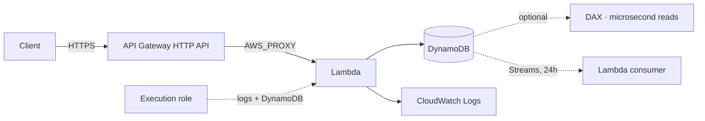

# 19 – Serverless (Lambda, DynamoDB, API Gateway)
Compute, storage and a front door that all cost nothing when nobody is using them.

> [!info] Exam TL;DR
> - **Lambda's hard ceiling is 15 minutes.** When a stem says the job takes longer, Lambda is wrong and the answer is Fargate, Batch or Step Functions. This is the most common single elimination in the topic.
> - **You set memory; CPU follows.** There is no CPU dial. **At 1,769 MB a function has one vCPU.** More memory can be *cheaper*, because a faster finish means fewer GB-seconds.
> - **Three invocation models, not two.** Synchronous (no Lambda retries), asynchronous (**retries twice**, then DLQ/destination), and **event source mapping** for SQS / Kinesis / DynamoDB Streams — where the *source's* rules govern retries.
> - **A VPC-attached Lambda loses internet access**, and putting it in a public subnet does **not** give it back. Private subnet + NAT, or VPC endpoints.
> - **DynamoDB makes you choose your access patterns before the table exists.** SQL lets you ask new questions later. That trade, not "which one scales", is the discriminator.
> - **LSIs can only be created with the table and can never be added or removed.** GSIs can be added any time. GSI queries are eventually consistent only.
> - **API Gateway bills per request and costs nothing idle; an ALB bills ~$0.0225/hr forever.** That is what makes API Gateway + Lambda "serverless".
> - **HTTP API is the cheap fast one.** Caching, API keys, usage plans, WAF or a private VPC-only API all force **REST**.

## What problem does this solve?

You can already run code on EC2 and you can already store data in RDS. Serverless is not about capability — it is about what exists when nobody is using your application.

An EC2 instance exists. An ALB exists. An RDS instance exists. They are running, and billing, at 3am on a Sunday with zero users. Lambda, DynamoDB on-demand and API Gateway have nothing running: you pay per request and per millisecond of actual work, and at zero traffic you pay **zero**. That is the whole proposition, and it is why a cost question with "unpredictable" or "infrequent" in it usually points here.

What you give up is control. You cannot SSH to the machine, you cannot keep a long-lived connection, you cannot run for more than fifteen minutes, and with DynamoDB you cannot invent a new query next Tuesday without having planned for it.

> In one line: serverless trades control for the ability to cost nothing when idle.

## How it actually works

**Lambda** runs your code in an *execution environment* it creates on demand and reuses when it can. The first invocation into a new environment pays a **cold start** — downloading your code and initialising the runtime. Reused environments are warm. This is why `/tmp` sometimes still has your last invocation's files, and why you must never rely on that.

You configure **memory**, and AWS allocates CPU in proportion. AWS: *"Lambda allocates CPU power in proportion to the amount of memory configured... At 1,769 MB, a function has the equivalent of one vCPU."* Range is 128 MB to 10,240 MB.

> In one line: memory is the only performance dial, and it moves CPU with it.

**DynamoDB** stores items in *partitions*, and which partition an item lands in is decided by hashing its **partition key**. That single fact explains almost everything else: a `Query` on one partition key is cheap because the items are already together; finding an item without its partition key means scanning everything.

> In one line: the partition key is not a column name, it is the physical layout of your data.

**API Gateway** is a managed front door. It does not load balance across a fleet — each route invokes exactly one integration. AWS scales the gateway itself.

## AWS console ↔ Terraform map

| Console action | Terraform resource | Key arguments |
|---|---|---|
| Create function | `aws_lambda_function` | `runtime`, `handler` (`file.function`), `memory_size`, `timeout`, **`source_code_hash`** |
| Package the code | `data.archive_file` | `source_file`, `output_path` |
| Function's IAM role | `aws_iam_role` + `AWSLambdaBasicExecutionRole` | trusts `lambda.amazonaws.com` |
| Function logs | `aws_cloudwatch_log_group` | name must be **`/aws/lambda/<function-name>`** |
| Create table | `aws_dynamodb_table` | `hash_key`, `range_key`, `billing_mode`, `attribute` blocks **only for key attributes** |
| HTTP API | `aws_apigatewayv2_*` (**v2 = HTTP**) | `protocol_type = "HTTP"`; v1 `aws_api_gateway_*` is REST |
| Route → function | `aws_apigatewayv2_integration` | `AWS_PROXY`, **`invoke_arn`**, `payload_format_version = "2.0"` |
| Let API GW call Lambda | `aws_lambda_permission` | `principal`, **`source_arn`** |

## Architecture diagram

## Key facts, limits & pricing
*Verified against AWS docs 2026-09-12.*

- **Lambda memory**: 128 MB – 10,240 MB; **1,769 MB = one vCPU**. Timeout ceiling **900 seconds (15 min)**.
- **Asynchronous retries**: *"Lambda retries function errors twice"* — three attempts total — then the event goes to a DLQ or destination. **Direct/synchronous invocation gets no Lambda retries at all**: *"Lambda does not automatically retry these types of errors on your behalf."*
- **VPC networking uses Hyperplane ENIs**, shared per *subnet + security group combination*, not one per concurrent execution: *"Other functions in your account that use the same subnet and security group combination can also use this ENI."* Each supports up to **65,000 connections**. A new VPC function sits in `Pending` for several minutes while the ENI is built, and 14 days idle reclaims it.
- **VPC and the internet**: *"When you attach your function to a VPC, it can only access resources available within that VPC"*, and *"Connecting a function to a public subnet doesn't give it internet access or a public IP address."*
- **DynamoDB Streams** retain records for **24 hours**, organised into shards. Four `StreamViewType` values: `KEYS_ONLY`, `NEW_IMAGE`, `OLD_IMAGE`, `NEW_AND_OLD_IMAGES` — and *"It is not possible to edit a StreamViewType once a stream has been setup."*
- **Secondary index quotas**: **20 GSIs** (default) and **5 LSIs** per table. LSI: *"For each partition key value, the total size of all indexed items must be 10 GB or less."*
- **API Gateway default throttle**: 10,000 requests/second per account per Region, burst bucket 5,000.
- **Lambda runtimes** are versioned per language release; `python3.13` is current and supported. *"All supported Lambda runtimes support both x86_64 and arm64 architectures"* — arm64/Graviton is cheaper per GB-second.

## Comparisons

### DynamoDB vs relational (RDS / Aurora, including Serverless)
| | DynamoDB | RDS / Aurora |
|---|---|---|
| What exists | **nothing** — an API endpoint | instances, measured in ACUs even when "serverless" |
| Connections | none; every op is an HTTPS call | a **connection limit** you can exhaust |
| When you decide your queries | **before the table exists** — the key schema *is* the query plan | later; write a new `SELECT` any time |
| Joins, aggregates, ad-hoc reporting | no | yes |
| Scale story | horizontal, effectively unbounded | vertical, plus read replicas |
| Exam trigger | "single-digit millisecond latency **at any scale**", "millions of requests/sec", key-value, session store, shopping cart | "complex queries", "joins", "existing MySQL/PostgreSQL app", "our analysts query it" |

### Global secondary index vs local secondary index
| | GSI | LSI |
|---|---|---|
| Partition key | **any attribute** | **must be the table's partition key** |
| Sort key | optional | required, any attribute |
| **When it can be created** | **any time — add or delete freely** | **table creation ONLY; never added, never removed** |
| Read consistency | **eventual only** | eventual **or strong** |
| Throughput | its own, separate from the table | drawn from the table's |
| Size limit | none | **10 GB per partition key value** |
| Max per table | 20 | 5 |

### The three Lambda invocation models
| | Synchronous | Asynchronous | Event source mapping |
|---|---|---|---|
| Who | API Gateway, ALB, function URL, direct `Invoke` | S3, SNS, EventBridge | **SQS**, Kinesis, DynamoDB Streams |
| Caller waits? | yes | no — queued, returns immediately | n/a — Lambda **polls** the source |
| Retries by Lambda | **none** | **twice** (3 attempts) | the **source's** rules |
| Failure lands where | back at the caller | DLQ or destination | source-defined — for SQS, `maxReceiveCount` → its DLQ |

### Reserved vs provisioned concurrency
| | Reserved | Provisioned |
|---|---|---|
| Solves | one function eating the whole account concurrency pool | **cold starts** |
| What it does | caps this function, and guarantees it that much | keeps N environments **pre-initialised** |
| Costs extra? | no | **yes, billed whether invoked or not** |
| Set it to 0 | **disables the function** | n/a |

### REST API vs HTTP API
| | REST | HTTP |
|---|---|---|
| Caching | **yes** | no |
| API keys, usage plans, per-client throttling | **yes** | no |
| AWS WAF | **yes** | no |
| Private (VPC-only) endpoint | **yes** | no |
| Edge-optimized endpoint | **yes** | no |
| Request validation, canary deploys, X-Ray | **yes** | no |
| Native JWT authorizer | no (use a Lambda authorizer) | **yes** |
| Price / latency | higher | **lower** |

### API Gateway vs ALB as a front door
| | API Gateway | ALB |
|---|---|---|
| Cost at zero traffic | **nothing** | **~$0.0225/hr** (~$16/month) |
| Cost at very high volume | per request, forever | hourly cost amortises — **becomes cheaper** |
| Load balances across targets | no — one integration per route | yes |
| API keys, usage plans, request validation | yes (REST) | no |

## Worked examples

> [!example] Worked example — designing the table from the access patterns
> The lab's API serves three operations: create a note, list all notes for a user, fetch one specific note. Those three *are* the access patterns, and in DynamoDB they decide the key schema before a line of Terraform is written.
>
> "List all notes for one user" must be **one** cheap read, so `userId` has to be the **partition key** — that puts every one of a user's notes in the same partition. "Fetch one specific note" needs `GetItem`, which requires the **complete** primary key, so a second attribute is needed to tell one note from another: `noteId` as the **sort key**. `hash_key = "userId"`, `range_key = "noteId"`.
>
> Then the design question the schema cannot answer: **"fetch note X, I don't know whose it is."** Nothing in that table supports it — you would have to scan every item. That is what a **GSI** is for: the same data, partitioned a different way.
>
> Note also what does *not* go in the Terraform. `title`, `body` and `createdAt` are written by the application and must **not** appear as `attribute` blocks — DynamoDB is schemaless for everything outside a key, and declaring a non-key attribute fails at apply.

> [!failure] Failure mode — the deployment that silently ships nothing
> You edit `handler.py`, run `terraform apply`, and Terraform says **No changes**. The function keeps running yesterday's code and you spend twenty minutes debugging logic that was never deployed.
>
> Cause: without **`source_code_hash`**, Terraform compares only the zip's *filename*, which did not change. `source_code_hash = data.archive_file.handler.output_base64sha256` is what makes it notice. The same class of silent failure as `payload_format_version` being `1.0` while the handler reads the 2.0 event shape — the stack looks healthy and every request 404s.

## The Terraform I wrote
- Path: `../19-serverless/` — HTTP API → Lambda (Python, arm64) → DynamoDB on-demand.
- Key schema decided from the access patterns: `userId` partition, `noteId` sort. Routes built with `for_each` over the three route strings.
- Verified live: three POSTs, then `GET /notes/rahil` returned only rahil's notes with no filter in the code — the partition key doing the work — while the same `noteId` under a different `userId` returned 404, because `GetItem` needs the whole key.

## ⚠️ Traps — why the wrong answer looks right

> [!warning] Trap — Lambda in a public subnet
> "Give the VPC-attached function internet access" is **not** answered by moving it to a public subnet. AWS: *"Connecting a function to a public subnet doesn't give it internet access or a public IP address."* A Lambda ENI never gets a public IP. The answers are a **private subnet routed to a NAT gateway**, or **VPC endpoints** for the specific services.

> [!warning] Trap — ENI per concurrent execution
> Older material teaches that a VPC Lambda creates one ENI per concurrent execution, making IP exhaustion a scaling risk. That was the pre-2019 model. Hyperplane ENIs are **shared across functions using the same subnet + security group combination** and scale on *connections*, not concurrency. What still bites is the multi-minute `Pending` state while a new one is built.

> [!warning] Trap — SQS is not an asynchronous invocation
> S3 and SNS invoke Lambda asynchronously, so Lambda retries twice and then uses a DLQ. **SQS is an event source mapping** — Lambda *polls* it — so retry behaviour comes from the **queue's** visibility timeout and `maxReceiveCount`, exactly as in [[15-decoupling]]. Answering "Lambda will retry twice" for an SQS-triggered function is wrong.

> [!warning] Trap — API keys are not authentication
> Usage plans and API keys *"track and limit usage"*. They identify a caller for metering and throttling; they prove nothing about identity. If an option offers API keys as the security control, it is the distractor. Authentication is **IAM** (an AWS principal), **Cognito** (an end user who logged in), or a **Lambda authorizer** (your own scheme).

> [!warning] Trap — "ECS-style" two roles on Lambda
> ECS splits an **execution role** (the agent: pull the image, ship logs) from a **task role** (your code's AWS permissions). **Lambda has one role doing both jobs.** Same word, different split — do not go looking for a Lambda "task role".

> [!warning] Trap — more memory is always more expensive
> Not necessarily. Lambda bills GB-seconds, and CPU scales with memory, so doubling memory on a CPU-bound function can more than halve its duration. The cost-optimisation answer to "this function is slow and expensive" is often **raise the memory**.

## 🔴 My weak spots (this topic)   #weak-spot

- [ ] **DynamoDB versus Aurora Serverless when both "scale"** — the discriminator is not which scales, it is **when you must decide your queries**: DynamoDB before the table exists, SQL any time afterwards.
- [ ] **GSI versus LSI** — did not know these at all. The hard one: an **LSI can only be created with the table and can never be added or removed**; a GSI can be added any time.
- [ ] **SQS filed under asynchronous invocation** — it is an **event source mapping**, the third model, where the queue's `maxReceiveCount` governs retries, not Lambda's two.
- [ ] **The VPC Lambda ENI model** — answered with the pre-2019 "one ENI per concurrent execution, IP exhaustion at scale" story. Hyperplane ENIs are shared per subnet + security group.
- [ ] **REST versus HTTP API** — did not know the split. Memory hook: **caching, API keys, usage plans, WAF or private endpoint ⇒ must be REST**.
- [ ] **API Gateway authorizer types** — knew Cognito issued JWTs but not that it plugs in as an authorizer, nor that IAM and Lambda authorizers are the other two.
- [ ] **"IAM role for a public Docker Hub image"** — answered that no role is needed. Right about the *pull* (that needs internet, not IAM), wrong overall: the execution role is required for **`awslogs`**.

> [!tip] Production gap
> This lab has no authorizer, no throttling, no WAF, no tracing, and a `$default` stage with no canary. Production adds an authorizer (**Cognito** for end users, **IAM** for service-to-service), **usage plans** if you meter customers, **X-Ray** for tracing across the API-to-Lambda-to-DynamoDB hop, **provisioned concurrency** if cold starts hurt a user-facing path, and **PITR** on the table.

## 🔗 Docs
- [Lambda memory and CPU](https://docs.aws.amazon.com/lambda/latest/dg/configuration-memory.html) — 1,769 MB = 1 vCPU; verified 2026-09-12
- [Lambda retry behavior](https://docs.aws.amazon.com/lambda/latest/dg/invocation-retries.html) — "retries function errors twice"; verified 2026-09-12
- [Lambda VPC networking](https://docs.aws.amazon.com/lambda/latest/dg/foundation-networking.html) — Hyperplane ENIs; verified 2026-09-12
- [Lambda runtimes](https://docs.aws.amazon.com/lambda/latest/dg/lambda-runtimes.html) — supported versions, arm64; verified 2026-09-12
- [DynamoDB secondary indexes](https://docs.aws.amazon.com/amazondynamodb/latest/developerguide/SecondaryIndexes.html) — GSI vs LSI table; verified 2026-09-12
- [DynamoDB Streams](https://docs.aws.amazon.com/amazondynamodb/latest/developerguide/Streams.html) — 24h, view types; verified 2026-09-12
- [REST vs HTTP APIs](https://docs.aws.amazon.com/apigateway/latest/developerguide/http-api-vs-rest.html) — feature comparison; verified 2026-09-12
- [Control access to REST APIs](https://docs.aws.amazon.com/apigateway/latest/developerguide/apigateway-control-access-to-api.html) — authorizers; verified 2026-09-12
