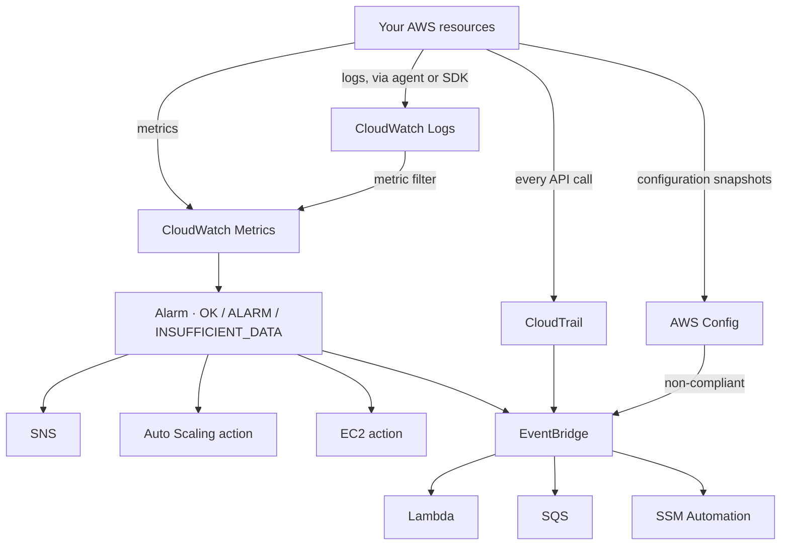

# 20 – Monitoring (CloudWatch, CloudTrail, Config, EventBridge)
Four services that answer four different questions, and an exam that mostly tests whether you know which question was asked.

> [!info] Exam TL;DR
> - **The whole topic collapses to one discrimination.** *"Is it healthy?"* → **CloudWatch**. *"Who did it?"* → **CloudTrail**. *"What is the configuration, and has it drifted?"* → **Config**. *"React automatically when X happens"* → **EventBridge**.
> - **EC2 basic monitoring is every 5 minutes. Detailed monitoring is every 1 minute** (and costs extra). Alarm periods must be ≥ the metric's resolution.
> - **Memory and disk-space are NOT default EC2 metrics.** They are *in-guest*, so they need the **CloudWatch agent**, and they arrive as **custom metrics** (billed as such).
> - **CloudTrail Event history is 90 days of management events only, free, per Region.** Anything longer, or data events, needs a **trail** delivering to S3.
> - **Data events are OFF by default** — *"trails and event data stores log management events, but not data or Insights events."* S3 object-level and Lambda invoke activity are data events.
> - **An alarm invokes actions only when it CHANGES state.** Three states: `OK`, `ALARM`, `INSUFFICIENT_DATA`.
> - **Composite alarms exist to reduce alarm noise** — and they cannot perform EC2 or Auto Scaling actions.
> - **EventBridge = CloudWatch Events, renamed.** Same service; a question naming either means the same thing.
> - **Systems Manager is not just Session Manager.** **Run Command** = push an arbitrary command/installer once; **Patch Manager** = patch existing software against a baseline; **State Manager** = hold a desired state over time; **Maintenance Windows** = the *schedule* only, never the doer. "Install a tool" and "apply a patch" are different answers.
> - **Alarm actions on EC2: `reboot` fixes an *Instance* status check, `recover` fixes a *System* one** (bad host → move to new hardware). `recover` works **only** with `StatusCheckFailed_System`. Recovery keeps the **instance ID and every IP including public IPv4**; it **loses RAM**. **Terminated instances can never be recovered.**
> - **"Notify 30 days before a certificate expires"** → ACM's **`DaysToExpiry`** CloudWatch metric (published **twice daily**) and/or an **EventBridge** rule on **AWS Health** ACM events → **SNS**. Auto-renewal does not remove the need to watch it.

## What problem does this solve?

Four services here look similar because they all "watch AWS", and the exam exploits exactly that. They don't overlap nearly as much as they seem to.

**CloudWatch** is about *numbers and text your systems emit* — CPU at 80%, a log line containing `ERROR`. It answers "is it healthy, and how hard is it working".

**CloudTrail** is about *API calls* — someone called `DeleteBucket` at 14:02 from this IP with this role. It answers "who did what", and it's the audit trail you hand an investigator.

**Config** is about *the shape of a resource over time* — this security group had port 22 open to the world from Tuesday to Thursday. It answers "what was the configuration, when did it change, and does it comply".

**EventBridge** is the *reaction layer* — when any of the above notices something, EventBridge is what turns it into an action.

The trap is that several of these can *sort of* answer someone else's question. CloudTrail tells you a security group was modified, but not what it looked like afterwards. Config shows the before and after, but not who made the call. The exam asks for one of them specifically, and the wrong answers are the ones that get you close.

> In one line: CloudWatch watches behaviour, CloudTrail watches callers, Config watches configuration, EventBridge reacts.

## How it actually works

**CloudWatch Metrics** are time-series data points in a namespace (`AWS/EC2`), identified by name plus up to 30 **dimensions**. AWS-published metrics are **standard resolution — one-minute granularity**. Your own custom metrics can be **high resolution — one-second granularity**.

Retention is automatic and tiered — data is aggregated up as it ages:

| Period of the data | Kept for |
|---|---|
| < 60 s (high-resolution) | 3 hours |
| 60 s (1 min) | 15 days |
| 300 s (5 min) | 63 days |
| 3600 s (1 hour) | **455 days (15 months)** |

Metrics can't be deleted; they expire after 15 months with no new data.

**The most-tested gap:** the hypervisor can see CPU, network and disk *I/O*, so those are free EC2 metrics. It cannot see inside the guest OS — so **memory utilisation and disk space used are not there**. The CloudWatch agent collects *"internal system-level metrics... in-guest metrics, in addition to the metrics for Amazon EC2 instances"*, and they are *"billed as custom metrics"*.

> In one line: if the metric requires looking inside the operating system, it needs the agent.

**CloudWatch Logs** groups log streams by source. The bridge back to metrics is a **metric filter** — a pattern that turns matching log lines into a metric you can alarm on. That is the answer to "alert me when the application logs an error", because you cannot alarm on a log line directly, only on a metric derived from it.

**Alarms** watch one metric (or a math expression) over evaluation periods. *"An alarm invokes actions only when the alarm changes state"* — it does not re-fire every period while in `ALARM`. The exception is Auto Scaling actions, which repeat once a minute while the state holds.

**CloudTrail** records four event types: **management** (control plane — `CreateTrail`, `AttachRolePolicy`), **data** (data plane — S3 `GetObject`, Lambda invokes; high volume, **off by default**), **network activity**, and **Insights** (unusual API call-rate or error-rate, detected against your own baseline).

> In one line: CloudTrail's free 90-day Event history is management events only — everything else is a trail you configure.

### Systems Manager — the one that reaches *into* the instance

The four services above watch from outside. **AWS Systems Manager (SSM)** is the one that
acts *on* the node. Everything it does requires the **SSM Agent** installed and able to
reach the service; a node that meets both is a **managed node**.

**Session Manager** is the most *recognisable* thing it does, and always asked the same way:
*"connect to an instance in a private subnet"*. AWS's own wording is the answer:

> *"Session Manager provides secure node management **without the need to open inbound
> ports, maintain bastion hosts, or manage SSH keys**."*

That sentence kills three distractors at once — a bastion host, an inbound SSH rule, and a
key pair. Access is granted by **IAM policy**, not by a key, which is also why "revoke this
engineer's access" is a policy change rather than a key rotation.

But Session Manager is **not** most of the SSM questions. The rest of the toolset is asked at
least as often, and the questions are built out of the *overlap* between these tools — several of
them could plausibly install something on a fleet, and only one is right in each stem.

The full tool-by-tool split is in [[#Which Systems Manager tool — the discrimination that actually gets tested|Comparisons]] below.
The two that get mixed up most are **Run Command** and **Patch Manager**, because both act on a
whole fleet at once. The split is *what* you are pushing: an **arbitrary command or installer** is
Run Command; an **update to existing software, assessed against a baseline** is Patch Manager.
**Maintenance Windows** is the reliable wrong answer in both, because it schedules work rather
than performing it.

Two details worth carrying. A node **with no public IP and no NAT** can still be managed by
adding **interface VPC endpoints** for Systems Manager ([[05-vpc-endpoints-peering]]) — that
is the fully-private answer. And sessions can be **logged to S3 or CloudWatch Logs**, with
EventBridge + SNS notifying on session start and stop, which is what makes it acceptable to
auditors who liked having bastion logs.

> In one line: SSM acts on the instance rather than watching it — Session Manager for a shell,
> Run Command to push an arbitrary command or installer, Patch Manager to patch against a
> baseline, and Maintenance Windows only ever to say *when*.

### CloudWatch alarm actions on EC2 — reboot is not recover

A CloudWatch alarm on a **per-instance** EC2 metric can carry an *action* that operates the
instance itself: **stop**, **terminate**, **reboot** or **recover**. Stop and terminate exist to
save money on instances that have finished their work. Reboot and recover exist to restore an
instance automatically, and the exam tests the difference between those two because it maps onto
the two **status checks**.

- **Instance** status check fails → something inside the guest is broken (bad kernel, exhausted
  memory, corrupt filesystem). A **reboot** is the fix: same physical host, OS restart.
- **System** status check fails → the *host underneath* is broken (loss of network, loss of power,
  a hardware or software fault on the physical host). A reboot cannot help; the instance must
  move. That is **recover**.

`recover` is therefore wired to **`StatusCheckFailed_System`** and is explicitly **not permitted**
on `StatusCheckFailed_Instance`. (`0` means the check passed, `1` means it failed.)

**What survives a recovery** is the point most questions turn on. A recovered instance is
identical to the original, keeping its **instance ID**, its **private, public and Elastic IP
addresses**, its **instance metadata**, its **placement group**, its **attached EBS volumes** and
its **Availability Zone**. What is lost: everything in **volatile memory (RAM)**, **instance store
data** (for CloudWatch action based recovery), and **OS uptime resets to zero** — because the
migration presents to the instance as an unplanned reboot. And **a terminated instance can never
be recovered.**

Two mechanisms do this. **Simplified automatic recovery** is **on by default** on supported
instances, no alarm required. **CloudWatch action based recovery** is the one you configure
yourself, and the one that can notify an **SNS** topic on each attempt. Both work only on
supported instance types, and both must be in place *before* the check fails.

> In one line: reboot for a failed Instance check, recover for a failed System check — recover
> moves the instance to new hardware, keeps its ID and all its IPs, and loses whatever was in RAM.

### Alerting before a certificate expires

ACM auto-renews the certificates it issued, as long as validation still resolves — see
[[21-security#ACM — where the certificate has to live]]. Auto-renewal is not the same as knowing
it happened, so "notify the security team 30 days before expiry" is a monitoring question with
**two** valid answers, which is why it shows up as Select TWO:

- **The metric.** ACM publishes **`DaysToExpiry`** in the **`AWS/CertificateManager`** namespace,
  dimensioned by **`CertificateArn`**, **twice per day** for every certificate, stopping once the
  certificate expires. Alarm on it at `<= 30`.
- **The event.** ACM emits **AWS Health** events for renewal-eligible certificates — on
  successful renewal, and when a human must act for renewal to happen. The event codes are
  **`AWS_ACM_RENEWAL_STATE_CHANGE`** (renewed, expired, or due to expire),
  **`CAA_CHECK_FAILURE`** and **`AWS_ACM_RENEWAL_FAILURE`** (private-CA-signed). They arrive as
  source **`aws.health`**, detail-type **`AWS Health Event`**, so an **EventBridge** rule can
  filter on the code and target **SNS**.

> In one line: ACM's DaysToExpiry metric (twice daily) or an EventBridge rule on AWS Health ACM
> events is how you get told before a certificate lapses; auto-renewal can still fail silently.

## AWS console ↔ Terraform map

| Console action | Terraform resource | Key arguments |
|---|---|---|
| Create an alarm | `aws_cloudwatch_metric_alarm` | `metric_name`, `namespace`, `period`, `evaluation_periods`, `threshold`, `comparison_operator`, `alarm_actions` |
| Composite alarm | `aws_cloudwatch_composite_alarm` | `alarm_rule` (an expression over other alarms) |
| Log group | `aws_cloudwatch_log_group` | `name`, `retention_in_days` |
| Turn log lines into a metric | `aws_cloudwatch_log_metric_filter` | `pattern`, `metric_transformation` |
| Scheduled or event-driven rule | `aws_cloudwatch_event_rule` (**this is EventBridge**) | `schedule_expression` **or** `event_pattern` |
| Rule target | `aws_cloudwatch_event_target` | `rule`, `arn`, `input_transformer` |
| Trail | `aws_cloudtrail` | `s3_bucket_name`, `is_multi_region_trail`, `enable_log_file_validation`, `event_selector` for data events |
| Config recorder + rule | `aws_config_configuration_recorder`, `aws_config_config_rule` | `recording_group`, `source` (AWS managed or custom Lambda) |

Note the naming legacy: EventBridge resources are still `aws_cloudwatch_event_*` in the provider, because the service was renamed after the resources were named.

## Architecture diagram

## Key facts, limits & pricing

- **Systems Manager requires the SSM Agent** on the node plus network reachability to the service; both together make it a **managed node**. Preinstalled on Amazon Linux 2/2023, Ubuntu and Windows Server AMIs, and it needs an **instance profile** granting `AmazonSSMManagedInstanceCore`.
- **Session Manager** gives *"secure node management without the need to open inbound ports, maintain bastion hosts, or manage SSH keys"*. Access is controlled entirely by **IAM policy**; traffic is **TLS 1.2** and requests are SigV4-signed. Supports **Windows, Linux and macOS**, plus **port forwarding/tunnelling**.
- **Session logging** goes to **Amazon S3** or **CloudWatch Logs** (optionally KMS-encrypted), API calls to **CloudTrail**, and **EventBridge → SNS** can notify on session start/stop. ⚠️ **Logging is not available for sessions that use port forwarding or SSH** — Session Manager is only a tunnel there.
- **Nodes with no public IP and no NAT** can still be managed via **interface VPC endpoints (PrivateLink)** for Systems Manager — the fully-private pattern.
- **"SSM" is a naming fossil**: the service was formerly *Amazon EC2 Systems Manager*, which is why the agent, endpoints, CLI (`aws ssm …`) and ARNs all still say `ssm`.
*Verified against AWS docs 2026-09-25.*

- **Resolution:** *"Standard resolution, with data having a one-minute granularity"*; *"High resolution, with data at a granularity of one second."* AWS-service metrics are standard resolution by default.
- **Valid alarm/metric periods:** 1, 5, 10, 30, or **any multiple of 60** seconds. High-resolution alarms may use **10 or 30 seconds** and cost more.
- **EC2 monitoring:** *"basic monitoring for Amazon EC2 provides metrics for your instances every 5 minutes... Detailed monitoring... a resolution of 1 minute."* Alarm period must be ≥ the metric resolution.
- **Metric retention:** 3 hours / 15 days / 63 days / 455 days by period, as the table above. Metrics expire after **15 months** without new data.
- **Alarm history is kept 30 days.** There is **no limit** on the number of alarms.
- **CloudTrail Event history:** *"a viewable, searchable, downloadable, and immutable record of the past 90 days of CloudTrail management events in an AWS Region."*
- **Default trail contents:** *"By default, trails and event data stores log management events, but not data or Insights events."*
- **CloudTrail Insights** detects *"unusual API call rate or error rate activity... by analyzing CloudTrail management activity"* — measured against your own account's normal.
- **The CloudWatch agent** collects in-guest metrics and logs, publishes to the `CWAgent` namespace by default, and its metrics are **billed as custom metrics**.
- ⚠️ verify: the exact list of valid `retention_in_days` values for a log group (1 day → 10 years, plus "never expire" as the default) — confirm against the Logs docs before relying on a specific number.

- **EC2 alarm actions:** **stop, terminate, reboot, recover**. `recover` works **only** with `StatusCheckFailed_System`, never `StatusCheckFailed_Instance`. Recovery **preserves** instance ID, private/public/Elastic IPs, metadata, placement group, attached EBS volumes and AZ; it **loses** RAM contents and instance-store data, and **uptime resets to zero**. **Terminated instances cannot be recovered.** **Simplified automatic recovery is enabled by default** on supported instances; CloudWatch action based recovery is configured manually. Reboot/stop/terminate actions use the service-linked role **`AWSServiceRoleForCloudWatchEvents`**. Configure these alarms to treat missing data as **`missing`**, since EC2 metrics can briefly go `INSUFFICIENT_DATA` on a healthy instance.
- **ACM expiry:** metric **`DaysToExpiry`**, namespace **`AWS/CertificateManager`**, dimension **`CertificateArn`**, published **twice per day** until the certificate expires. Separately, **AWS Health** events (`aws.health` / *AWS Health Event*) carry **`AWS_ACM_RENEWAL_STATE_CHANGE`**, **`CAA_CHECK_FAILURE`**, **`AWS_ACM_RENEWAL_FAILURE`** for **EventBridge → SNS**.
*Verified against AWS docs 2026-09-29.*

## Comparisons

### Which Systems Manager tool — the discrimination that actually gets tested

| Tool | Its actual job | The stem that means it |
|---|---|---|
| **Run Command** | run a command or script across a fleet **once, now**, without logging in | "**install** a third-party tool", "make a **one-time** configuration change", "without SSH/RDP" |
| **Patch Manager** | automate **patching** — security and other updates — against a **patch baseline** | "**patch** a security exposure", "keep the OS up to date", "compliance reporting on patch level" |
| **Maintenance Windows** | **only a schedule** — a window in which disruptive work may run | "during a defined window", "outside business hours" — never the thing that *does* the work |
| **State Manager** | hold nodes at a **desired state**, continuously, re-applying drift | "**ensure** agents stay installed", "keep configuration consistent over time" |
| **Automation** | **runbooks** for multi-step operational tasks, incl. AWS-provided documents | "automate the whole sequence", a named `AWS-*`/`AWSEC2-*` runbook |
| **Session Manager** | interactive **shell** to one node | "connect to", "get a shell", "no bastion / no open port / no key" |
| **Parameter Store** | store **config values and secrets** — see [[21-security#Secrets Manager vs SSM Parameter Store]] | "store a config value", "no credentials in code" (**rotation → Secrets Manager**) |
| **Inventory** · **Fleet Manager** | collect installed-software inventory · manage nodes from a console | "what is installed across the fleet" |

### The four services — the discrimination the exam actually tests
| Question in the stem | Service | What it records |
|---|---|---|
| "CPU is high", "alert when errors appear in the log", "how many invocations" | **CloudWatch** | metrics and logs — **behaviour** |
| "**Who** deleted it", "which user/role made this API call", "audit for compliance" | **CloudTrail** | API calls — **the caller** |
| "Was this bucket ever public", "are all volumes encrypted", "**configuration drift**", "compliance over time" | **Config** | resource **configuration** history + rules |
| "**Automatically** do X when Y happens", "run something on a schedule" | **EventBridge** | routes events to targets — **the reaction** |

### CloudTrail vs Config, on the same security group change
| | CloudTrail | Config |
|---|---|---|
| Tells you | **who** called `AuthorizeSecurityGroupIngress`, when, from where | **what the SG looked like** before and after, and whether that is compliant |
| Unit of record | an API call | a configuration item, versioned over time |
| Answers "was it ever open to 0.0.0.0/0 last month?" | no — only that a call happened | **yes** |
| Answers "which IAM principal did it?" | **yes** | no |
| Can enforce/remediate | no | **yes** — Config rules + SSM Automation remediation |

### EC2 alarm actions — reboot vs recover
| | reboot | recover |
|---|---|---|
| Fixes a failing | **Instance** status check | **System** status check |
| Cause | something broken **inside the guest** | the **underlying host** — power, network, hardware |
| Physical host | **stays the same** | instance **moves to new hardware** |
| Allowed on `StatusCheckFailed_Instance` | Yes | **No** |
| Allowed on `StatusCheckFailed_System` | Yes | **Yes — the only metric it works with** |
| Keeps instance ID / IPs / EBS / AZ | Yes | **Yes** (incl. public IPv4 and Elastic IP) |
| Keeps RAM contents | No | **No** |
| Recommended evaluation periods | 3 × 1 min | 2 × 1 min |
| Works on a terminated instance | — | **Never** |

### CloudWatch event types
| | Metric alarm | Composite alarm | EventBridge rule |
|---|---|---|---|
| Watches | one metric or math expression | the **states of other alarms** | an event pattern or a schedule |
| Purpose | detect a threshold breach | **reduce alarm noise** | react to anything, route to many targets |
| Can trigger EC2 / Auto Scaling actions | **yes** | **no** | not directly |
| Can trigger SNS | yes | yes | yes |

### Management vs data events (CloudTrail)
| | Management events | Data events |
|---|---|---|
| Also called | control plane | **data plane** |
| Examples | `CreateTrail`, `AttachRolePolicy`, `RunInstances` | S3 `GetObject`/`PutObject`, Lambda `Invoke`, DynamoDB item ops |
| Logged by default | **yes** | **no** |
| Volume / cost | low | **high** — this is why they are opt-in |
| In the free 90-day Event history | yes | **no** |

### Getting an alert out of a log line
| Want | Use |
|---|---|
| Alarm when the app logs `ERROR` | **metric filter** on the log group → metric → alarm |
| Ad-hoc query across log groups | **CloudWatch Logs Insights** |
| Keep logs cheaply for years | **export to S3** (and lifecycle to Glacier) |
| Stream logs to a search/analytics tool | subscription filter → **Kinesis / Firehose / Lambda** |

## Worked examples

> [!example] Worked example — "alert us when the application starts erroring"
> The application writes to CloudWatch Logs via the agent. You cannot create an alarm on a log group directly — alarms watch **metrics**.
>
> So: a **metric filter** on the log group with a pattern like `ERROR`, whose `metric_transformation` publishes `1` to a custom metric each time a line matches. Then a **metric alarm** on that metric — say, ≥ 5 in 5 minutes — with an `alarm_action` pointing at an SNS topic.
>
> The chain is log line → metric filter → metric → alarm → SNS. When a stem says "notify the team when a specific string appears in the logs", the missing middle step is what it is testing.

> [!failure] Failure mode — the alarm that never fires, and the one that fires constantly
> Two opposite mistakes, both from period misuse.
>
> **Never fires:** you set a 1-minute alarm period on an EC2 instance with only basic monitoring, which publishes every **5** minutes. Four periods out of five have no data, so the alarm sits in `INSUFFICIENT_DATA` and the threshold is rarely evaluated. AWS's own guidance: *"select an alarm monitoring period that is greater than or equal to the metrics resolution."* Either enable detailed monitoring or use a 300-second period.
>
> **Fires constantly:** you alarm on a metric that a resource stops publishing when idle — an unattached EBS volume, a service with no traffic. The state flips to `INSUFFICIENT_DATA` and back. The fix is the alarm's **missing-data treatment**, not a different threshold.

## ⚠️ Traps — why the wrong answer looks right

> [!warning] Trap — reboot offered for a failed system status check
> The stem describes an instance made unreachable by a fault on the **underlying host** and offers
> a reboot alarm. A reboot keeps the instance on the **same broken host**, so it fixes nothing —
> **recover** is the action that moves it to new hardware. The mirror-image trap also appears:
> `recover` attached to `StatusCheckFailed_Instance`, which AWS does not permit at all. Two more
> distractors in this family: "**terminated** instances can be recovered if configured at launch"
> (never — terminated is terminated) and "in-memory data **is retained** during recovery" (it is
> **lost**; the migration looks like an unplanned reboot to the instance). What *is* kept is the
> instance ID and every IP address, including the **public IPv4** — which is what distinguishes
> automatic recovery from a manual stop/start, where a non-Elastic public IPv4 changes.

> [!warning] Trap — "ACM auto-renews, so no monitoring is needed"
> True and irrelevant. Auto-renewal can still **fail** — DNS validation records removed, a CAA
> record blocking issuance, an email-validated certificate nobody clicked. A stem asking to be
> **notified 30 days before expiry** wants the **`DaysToExpiry`** CloudWatch alarm and/or an
> **EventBridge** rule on **AWS Health** ACM events → **SNS**. Eliminate: **AWS Config** "manually
> created rule checking certificate expiry" (Config evaluates configuration, and the stem's own
> wording gives it away), **Trusted Advisor** as an alarm source (it has an ACM check, but you do
> not build a CloudWatch alarm on a Trusted Advisor *metric*), and **ACM Private CA** — switching
> your public certificates to a paid private CA to get an alert is the most expensive wrong answer
> on the page.

> [!warning] Trap — Patch Manager offered for "install this tool", Run Command for "apply this patch"
> Two stems that look identical and have **opposite** answers. *"Install a third-party tool on 500
> instances, quickly, and repeatedly from now on"* → **Run Command**: it runs an arbitrary command
> or installer across a fleet, and it keeps working as instances are added. *"Patch thousands of
> instances to remediate a security exposure"* → **Patch Manager**: patching existing software
> against a baseline is the one thing it is for. Swapping them is the intended error. In both
> stems, **Maintenance Windows** appears and is wrong for the same reason each time — it defines
> **when** disruptive work may run, it does not run anything. And **State Manager** is wrong
> whenever the task is one-off, because its job is holding a state over time.

> [!warning] Trap — a bastion host offered for private-instance access
> Any stem asking to reach an instance in a **private subnet** lists a bastion/jump host, an
> inbound SSH rule from the corporate CIDR, or a key-pair distribution scheme. All three are
> the old answer. **Session Manager needs none of them** — no inbound port, no bastion, no
> key — and satisfies the audit requirement too, because sessions log to S3 or CloudWatch
> Logs. If the stem adds *"no internet access at all"*, the answer gains **interface VPC
> endpoints** for Systems Manager; it does not revert to a bastion.

> [!warning] Trap — CloudTrail for "what did this resource look like"
> CloudTrail records **the API call**, not the resulting state. "Was this bucket public at any point last quarter?" or "produce evidence that all volumes have been encrypted since January" is **AWS Config** — it stores configuration items over time and evaluates rules against them. CloudTrail can tell you `PutBucketAcl` was called; only Config tells you what the ACL then *was*.

> [!warning] Trap — memory utilisation in the EC2 console
> There is no default memory or disk-space metric for EC2, because the hypervisor cannot see inside the guest. Any stem that wants memory, swap, or free disk space needs the **CloudWatch agent**, and those arrive as **custom metrics**. Options offering "enable detailed monitoring" are the distractor — detailed monitoring changes the *frequency* (5 min → 1 min), never the *set* of metrics.

> [!warning] Trap — "enable CloudTrail to see who read the S3 object"
> CloudTrail is on by default only for **management events**. Object-level reads and writes are **data events**, which *"trails and event data stores"* do **not** log by default. The answer must include configuring data events (an event selector) on a trail — and note they are billed by volume, which is the reason they are opt-in.

> [!warning] Trap — CloudWatch Events versus EventBridge
> They are the same service; CloudWatch Events was renamed to EventBridge. If a question offers both as separate options, they are not testing a distinction — look at what else the options differ on. (Terraform still names the resources `aws_cloudwatch_event_rule` for the same historical reason.)

> [!warning] Trap — the 90 days
> "CloudTrail keeps 90 days" is true of the **free Event history view**, per Region, management events only. A **trail** delivering to S3 keeps events as long as you want, at S3 prices. A stem wanting "retain audit logs for seven years for compliance" is asking for a trail plus S3 lifecycle, not the console view.

> [!warning] Trap — composite alarms doing Auto Scaling
> Composite alarms exist to **reduce noise** by combining other alarms' states. They *"can send Amazon SNS notifications when they change state... but can't perform EC2 actions or Auto Scaling actions."* If the stem needs a scaling action, the alarm doing it must be a metric alarm.

## 🔴 My weak spots (this topic)   #weak-spot

*Not yet measured — I wrote this note from the video section, not from a drill. These are the places courses commonly teach a stale or half-fact, so check yourself against them first; real misses get added after the next mock.*

- [ ] **CloudWatch vs CloudTrail vs Config** — the one discrimination this whole topic reduces to. Behaviour / caller / configuration-over-time. Getting this reflexive is worth more than any individual limit.
- [ ] **Data events are off by default** — "enable CloudTrail" is never sufficient for S3 object-level or Lambda invoke activity.
- [ ] **Detailed monitoring changes frequency, not coverage** — 5 min → 1 min. It does not add memory or disk-space metrics; only the agent does.
- [ ] **Alarms fire on state CHANGE**, not continuously while breaching (Auto Scaling actions excepted).
- [ ] **You cannot alarm on a log line** — metric filter first, then alarm on the derived metric.

> [!tip] Production gap
> This note covers what the exam tests; production adds **X-Ray** (distributed tracing across the API-to-Lambda-to-DB hops), **Container Insights** and **Lambda Insights**, **CloudWatch Synthetics** canaries for outside-in checks, **Contributor Insights** for top-N analysis, log **subscription filters** to a SIEM, and an **organization trail** so member accounts cannot disable their own auditing. Config gains **conformance packs** and auto-remediation via SSM Automation.

## 🔗 Docs
- [Systems Manager Run Command](https://docs.aws.amazon.com/systems-manager/latest/userguide/run-command.html)
- [Systems Manager Patch Manager](https://docs.aws.amazon.com/systems-manager/latest/userguide/patch-manager.html)
- [Systems Manager Maintenance Windows](https://docs.aws.amazon.com/systems-manager/latest/userguide/systems-manager-maintenance.html)
- [Systems Manager State Manager](https://docs.aws.amazon.com/systems-manager/latest/userguide/systems-manager-state.html)
- [Stop, terminate, reboot, or recover an EC2 instance (CloudWatch alarm actions)](https://docs.aws.amazon.com/AmazonCloudWatch/latest/monitoring/UsingAlarmActions.html)
- [Recover your instance (preserved vs lost elements)](https://docs.aws.amazon.com/AWSEC2/latest/UserGuide/ec2-instance-recover.html)
- [ACM supported CloudWatch metrics (`DaysToExpiry`)](https://docs.aws.amazon.com/acm/latest/userguide/cloudwatch-metrics.html)
- [ACM supported events / AWS Health event codes](https://docs.aws.amazon.com/acm/latest/userguide/supported-events.html)
- [CloudWatch metrics concepts](https://docs.aws.amazon.com/AmazonCloudWatch/latest/monitoring/cloudwatch_concepts.html) — resolution, retention, periods; verified 2026-09-25
- [Using CloudWatch alarms](https://docs.aws.amazon.com/AmazonCloudWatch/latest/monitoring/AlarmThatSendsEmail.html) — states, actions, composite alarms; verified 2026-09-25
- [CloudWatch agent](https://docs.aws.amazon.com/AmazonCloudWatch/latest/monitoring/Install-CloudWatch-Agent.html) — in-guest metrics, custom-metric billing; verified 2026-09-25
- [CloudTrail concepts](https://docs.aws.amazon.com/awscloudtrail/latest/userguide/cloudtrail-concepts.html) — 90-day event history, event types, Insights; verified 2026-09-25
- [Terraform `aws_cloudwatch_metric_alarm`](https://registry.terraform.io/providers/hashicorp/aws/latest/docs/resources/cloudwatch_metric_alarm)
- [Terraform `aws_cloudtrail`](https://registry.terraform.io/providers/hashicorp/aws/latest/docs/resources/cloudtrail)
