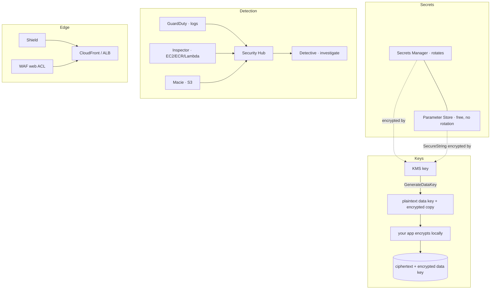

# 21 – Security & Encryption
Keys, secrets, and a shelf of detection services whose only exam question is "which one".

> [!info] Exam TL;DR
> - **KMS encrypts up to 4,096 bytes directly.** Anything bigger uses **envelope encryption**: `GenerateDataKey` returns a plaintext data key *and* an encrypted copy; you encrypt the data locally and store the encrypted key beside it.
> - **Automatic rotation is yearly by default and now configurable** (`RotationPeriodInDays`, default **365**). **AWS managed keys rotate every year** — that changed from three years in May 2022, so older courses say 1,095 days.
> - **Rotation does not re-encrypt your data**, does not rotate data keys, and does not change the key ID. Old key material is retained so old ciphertext still decrypts.
> - **Only symmetric KMS-generated keys auto-rotate.** Asymmetric, HMAC and custom-key-store keys must be rotated **manually**.
> - **Secrets Manager rotates; Parameter Store does not.** Parameter Store Standard is **free, 4 KB, 10,000 params**; Advanced is **paid, 8 KB, 100,000, supports policies** — and you can upgrade but **never downgrade**.
> - **Detection services, one line each:** GuardDuty = threats from **logs**; Inspector = **vulnerabilities** in EC2/ECR/Lambda; Macie = **sensitive data in S3**; Security Hub = **aggregates** everyone's findings; Detective = **investigate** a finding's root cause.
> - **Shield Standard is free and automatic (L3/L4). Shield Advanced is $3,000/month with a 1-year commitment.**
> - **WAF attaches to ALB, API Gateway REST, AppSync, Cognito user pool, App Runner, Amplify, Verified Access — and CloudFront. Never to an NLB or an EC2 instance.**

## What problem does this solve?

Two separate jobs share this section, and it's worth keeping them apart.

**Encryption and secrets** is about controlling access to *data and credentials* — who can decrypt this, where does the database password live, how does it get rotated. KMS is the root of nearly all of it: almost every "encrypt at rest" checkbox in AWS is a KMS key under the hood.

**The detection shelf** — GuardDuty, Inspector, Macie, Security Hub, Detective — is about *noticing* that something is wrong. They sound interchangeable and the exam tests exactly one thing about them: which one to reach for. Each has a different input.

The genuinely important idea in the first half is **envelope encryption**, because it explains a limit that otherwise looks arbitrary. KMS will only encrypt 4 KB directly. That isn't a quota to memorise for its own sake — it's the reason every AWS service that encrypts large objects works the way it does: get a data key from KMS, encrypt the data yourself with it, throw away the plaintext key, keep the encrypted one. KMS never sees your data.

> In one line: KMS protects keys, not data — you encrypt data with a data key, and KMS protects that.

## How it actually works

**KMS key types.** *Customer managed* — you create it, you own the key policy, you choose rotation, it costs ~$1/month. *AWS managed* (`aws/s3`, `aws/rds`) — created for you, free, rotated yearly, and **you cannot change its policy**. *AWS owned* — entirely inside the service, invisible to you.

**AWS managed keys are legacy.** This is the sentence that settles a whole family of
questions: *"AWS managed keys are a legacy key type that is **no longer being created for new
AWS services as of 2021**. Instead, new (and legacy) AWS services are using what's known as an
**AWS owned key** to encrypt customer data by default."* So when a stem asks what a service
encrypts with **by default**, the modern answer is **AWS owned**, not AWS managed — and
because AWS owned key usage is *"not viewable by the customer"*, **nothing appears in
CloudTrail**. Those two facts travel together and are asked together.

Default encryption by service, where it gets tested:

| Service | Default key | Notes |
|---|---|---|
| **DynamoDB** | **AWS owned** | *"Default encryption type."* All data is **always** encrypted — there is no off switch. You may switch to AWS managed or customer managed at any time. |
| **DAX cluster** (encryption at rest) | **AWS managed** | the exception sitting right next to DynamoDB |
| **S3** | **SSE-S3** (AES256) since Jan 2023 | see [[09-s3-security]] |
| **EBS, RDS, EFS** | AWS managed (`aws/ebs`, `aws/rds`…) when you tick "encrypt" | these predate the 2021 change |

That "cannot change its policy" line is the practical discriminator: the moment a stem mentions cross-account access to encrypted data, or an audit trail of key usage, or controlling exactly who may decrypt, the answer is a **customer managed key**.

**Envelope encryption, concretely.** `GenerateDataKey` returns two things — a plaintext data key and the same key encrypted under your KMS key. You encrypt your object locally with the plaintext key, discard it from memory, and store the encrypted copy alongside the ciphertext. To read it back, you send the encrypted key to KMS's `Decrypt`, get the plaintext key back, and decrypt locally. Your data never crosses the KMS API.

> In one line: KMS's 4 KB limit is not a restriction, it is the design — KMS encrypts keys, and keys are small.

**Rotation, as it now works.** Enable automatic rotation and AWS generates new key material on a schedule — **365 days by default, and you may set a different period**. There is also **on-demand rotation** (max 25 per key, not adjustable). Crucially, *"Key rotation has no effect on the data that the KMS key protects. It does not rotate the data keys that the KMS key generated or re-encrypt any data."* Old material is kept; AWS picks the right version to decrypt automatically. The key ID never changes.

**Secrets Manager vs Parameter Store.** Both store configuration; only Secrets Manager rotates. Secrets Manager costs per secret per month; Parameter Store Standard is free. Use Parameter Store for a config value, Secrets Manager for a credential that must rotate — and remember that RDS can create and rotate its own master password in Secrets Manager with no Lambda at all.

**The detection shelf** differs by *input*, which is the cleanest way to hold them:

| Service | Reads | Finds |
|---|---|---|
| GuardDuty | CloudTrail management events, VPC Flow Logs, Route 53 DNS query logs | threat activity |
| Inspector | EC2 instances, ECR images, Lambda functions | software CVEs, network exposure |
| Macie | S3 objects | sensitive data / PII |
| Security Hub | the other services' findings | a single prioritised view |
| Detective | the same logs, as a graph | the root cause of one finding |

> In one line: GuardDuty watches logs, Inspector watches software, Macie watches data, Security Hub aggregates, Detective investigates.

## Architecture diagram

## Key facts, limits & pricing
*Verified against AWS docs 2026-09-25.*

- **KMS `Encrypt` maximum plaintext: 4,096 bytes** for `SYMMETRIC_DEFAULT`. (Asymmetric is smaller still — RSA_2048 with OAEP-SHA-256 is 190 bytes.)
- **Deleting a KMS key is scheduled, never immediate.** A mandatory waiting period of **7–30 days** (**default 30**) applies; AWS may extend it by up to 24 hours. Throughout it the key state is **`Pending deletion`**, the key **cannot be used in any cryptographic operation**, and the deletion **can still be cancelled**. When the period ends the key, its aliases and all KMS metadata are destroyed — and anything encrypted under it becomes permanently unrecoverable. *(Verified 2026-09-30.)*
- **KMS allow is two-sided:** *"Without permission from the key policy, IAM policies that allow permissions have no effect."* A **deny** from IAM needs no key-policy permission. The **default key policy enables IAM policies**, so only a hand-tightened key policy exposes the rule. **Key policies are Regional; IAM policies are global.** For a Lambda principal, name the **execution role ARN**. *(Verified 2026-09-30.)*
- **Rotation period:** *"If you do not specify a value for `RotationPeriodInDays`... the default value is 365 days."* **On-demand rotation: maximum 25 per key, and this quota is not adjustable.**
- **AWS managed keys:** *"AWS KMS automatically rotates AWS managed keys every year"* — and *"In May 2022, AWS KMS changed the rotation schedule for AWS managed keys from every three years (approximately 1,095 days) to every year."*
- **Cannot auto-rotate:** asymmetric KMS keys, HMAC KMS keys, keys in custom key stores — these are rotated **manually**.
- **KMS quotas:** 100,000 customer managed keys per Region, **50 aliases per key**, **50,000 grants per key**, 10 custom key stores.
- **Parameter Store tiers:** Standard — **10,000** parameters, **4 KB**, no policies, no cross-account sharing, **no charge**. Advanced — **100,000**, **8 KB**, policies **supported**, shareable, **charges apply**. *"You can change a standard parameter to an advanced parameter, but you can't change an advanced parameter to a standard parameter."*
- **GuardDuty foundational data sources:** **CloudTrail management events, VPC Flow Logs, Route 53 Resolver DNS query logs** — consumed as independent duplicate streams, so *"You don't need to enable anything else"* and your own flow-log config is unaffected. 30-day free trial.
- **Inspector** scans **EC2 instances, container images in ECR, and Lambda functions**, *"continually"* and automatically — *"you don't need to manually schedule or configure assessment scans"* — rescanning when a package changes or a new CVE is published.
- **Macie** analyses **Amazon S3** — bucket inventory, public-access posture, and sensitive-data discovery using **managed** and **custom data identifiers**. 30-day free trial.
- **Shield Standard:** protection *"for all AWS customers... at no additional charge"* (network/transport layer). **Shield Advanced: $3,000/month, 1-year commitment**, and it covers standard WAF costs on protected resources.
- **WAF web ACL targets:** regional — **API Gateway REST API, Application Load Balancer, AppSync GraphQL API, Cognito user pool, App Runner, Verified Access, Amplify**; global — **CloudFront**, whose web ACL *"will have a hard-coded Region of US East (N. Virginia)"*. One web ACL per resource; a CloudFront web ACL cannot also be attached to a regional resource.

## Comparisons

### KMS is the exception to the resource-policy rule

Everywhere else in IAM, an identity policy and a resource policy **widen** each other: either
one allowing is enough, which is what makes cross-account access possible at all
([[01-iam-advanced]]). **A KMS key policy does not work that way**, and it is the one carve-out
worth memorising. AWS's wording:

> *"Unless the key policy explicitly allows it, you cannot use IAM policies to **allow** access
> to a KMS key. Without permission from the key policy, IAM policies that allow permissions have
> **no effect**."*

Three consequences, and the exam tests the first two:

- **Allow is two-sided.** A principal needs `kms:Decrypt` in its IAM policy **and** the key
  policy must permit it. Granting `kms:Decrypt` in IAM alone does nothing.
- **Deny is one-sided.** You *can* deny a KMS permission from an IAM policy with no help from the
  key policy — denies never need the key policy's cooperation.
- **The default key policy already enables IAM policies**, via a statement granting the account
  root access. So a key created with defaults behaves "normally" and the exception only bites on
  a key whose policy was hand-written and omitted that statement. This is why the rule surprises
  people: it is invisible until someone tightens a key policy.

One more difference: **IAM policies are global, key policies are Regional.** A key policy governs
only the key in its own Region.

When the principal is a **Lambda function**, the name that goes in the key policy is the
function's **execution role ARN** — a function is not an IAM principal, so its own ARN is never
the answer, and a Lambda *resource* policy only controls who may **invoke** it inbound.
*(Verified 2026-09-30.)*

> [!warning] Trap — "grant kms:Decrypt in the IAM policy" offered as the whole fix
> A stem where a Lambda (or EC2 role, or another account) cannot decrypt an SSE-KMS object, and
> the options include adding `kms:Decrypt` to the IAM policy. On its own that **does nothing** if
> the key policy doesn't permit the principal. The complete answer names **both sides**, and the
> key-policy principal is the **execution role**, not the function ARN. The mirror-image trap is
> "modify the key policy of an AWS managed key" — you **cannot**; that is the reason to use a
> **customer managed key** when a stem says "control exactly who may decrypt".

### KMS key types
| | Customer managed | AWS managed (`aws/service`) | AWS owned |
|---|---|---|---|
| Who creates it | **you** | AWS, on first use of a service | AWS, internally |
| Key policy you control | **yes** | **no** | no — invisible to you |
| Rotation | optional; default **365 days**, configurable, plus on-demand | **every year**, not controllable | the service decides |
| Cost | ~$1/month + requests | **free** | free |
| Visible in your account | yes | yes | **no** |
| **Usage auditable in CloudTrail** | **yes** | **yes** | **no** — *"not viewable by the customer"* |
| Counts against your KMS key quota | **yes** | no | no |
| Cross-account sharing of encrypted data | **yes** | **no** | yes (service handles it) |
| Choose this when | cross-account, custom policy, audit, compliance, BYOK | you just want encryption on | never — you don't choose it |

### Secrets Manager vs SSM Parameter Store
| | Secrets Manager | Parameter Store |
|---|---|---|
| Automatic rotation | **yes** (Lambda, or **managed** rotation for RDS/Aurora master users) | **no** |
| Cost | **per secret per month** + API calls | Standard **free**; Advanced paid |
| Max value size | 64 KB | **4 KB** standard / **8 KB** advanced |
| Cross-account access | via resource policy | Advanced tier only |
| KMS encryption | always | only for `SecureString` |
| Exam trigger | "**rotate** the database password automatically" | "store configuration/licence keys cheaply", "hierarchy of parameters" |

### Which detection service
| The stem says | Service | Because its input is |
|---|---|---|
| "unusual API calls", "crypto-mining", "compromised instance calling a known bad IP" | **GuardDuty** | CloudTrail + VPC Flow Logs + DNS logs |
| "unpatched software", "CVE", "vulnerability scan of our EC2/containers" | **Inspector** | the software on EC2, ECR images, Lambda |
| "PII", "credit card numbers", "is there sensitive data in our buckets" | **Macie** | **S3 objects only** |
| "single pane of glass", "aggregate findings", "CIS benchmark compliance" | **Security Hub** | other services' findings |
| "investigate the root cause of this finding", "visualise the relationships" | **Detective** | the same logs, as a behaviour graph |
| "central firewall rules across all accounts in the org" | **Firewall Manager** | WAF/Shield/SG policies, org-wide |

### Shield Standard vs Advanced vs WAF
| | Shield Standard | Shield Advanced | WAF |
|---|---|---|---|
| Protects against | L3/L4 DDoS | L3/L4/L7 DDoS | **L7 application** attacks (SQLi, XSS, bots) |
| Cost | **free, automatic** | **$3,000/mo, 1-year commitment** | per web ACL + per rule + per request |
| Extras | — | 24×7 SRT access, **DDoS cost protection**, covers WAF cost on protected resources | rate-based rules, managed rule groups, CAPTCHA |
| You configure rules | no | no | **yes** |

### CloudHSM vs KMS
| | KMS | CloudHSM |
|---|---|---|
| Tenancy | multi-tenant, AWS-managed | **dedicated single-tenant HSM** |
| Who holds the keys | AWS (FIPS 140-3 validated) | **you** — AWS cannot access them |
| Key control | key policies, IAM | you manage users and keys in the HSM |
| Supports | symmetric, asymmetric, HMAC | full suite incl. **SSL offload, custom crypto** |
| Exam trigger | almost everything | "**we must control the keys**", "FIPS 140-3 **Level 3**", regulatory requirement for dedicated hardware |

### ACM — where the certificate has to live

AWS Certificate Manager issues and **auto-renews** free public TLS certificates. Two facts
carry almost every ACM question:

**Region.** A certificate is **regional**, and it can only be attached to something in its own
Region — except for **CloudFront**, which is global and requires its certificate in
**us-east-1 (N. Virginia)**. An ALB in `eu-west-1` needs its certificate in `eu-west-1`; a
CloudFront distribution serving the same site needs one in `us-east-1`. The same site can
therefore need two.

**Validation.** You prove you own the domain by **DNS validation** (add a CNAME — and if the
zone is in Route 53, ACM can write it for you) or **email validation**. DNS validation is the
one to pick, because it is what lets ACM **renew automatically** and forever; email validation
needs a human every time.

Public certificates from ACM are **free**; **ACM Private CA** is a separate, paid service for
issuing internal certificates, and it is the answer only when the scenario says *internal* or
*private PKI*.

> [!warning] Trap — a regional certificate offered for CloudFront
> CloudFront is global and takes its certificate **only from us-east-1**, no matter where the
> origin or the bucket sits. An option that requests the certificate "in the same Region as
> the ALB" and attaches it to a distribution is wrong by construction. The inverse is also
> offered: a certificate in us-east-1 attached to a regional ALB somewhere else — equally
> wrong. And if a question mentions certificates **expiring**, the answer is usually to move
> from **email to DNS validation** so renewal stops needing a human.

> In one line: certificates are regional and auto-renew with DNS validation, but CloudFront
> takes its certificate from us-east-1 only.

> [!warning] Trap — "AWS managed" chosen as a service's default encryption key
> The three key types are near-identical strings and the question is usually *"why is there
> no encryption detail in CloudTrail?"*. The answer is that the default is an **AWS owned**
> key, and AWS owned key usage is **not visible to you at all** — not in the console, not in
> CloudTrail. **AWS managed** keys *are* auditable in CloudTrail, so picking them makes the
> scenario's symptom impossible. The rule behind it: **AWS managed is a legacy type, not
> created for new services since 2021**, so "the default" for anything modern is AWS owned.
> **DynamoDB is the canonical example** — always encrypted, no off switch, AWS owned by
> default. And "Customer managed" is never a default anywhere, because you have to create it.

### Rate limiting is a WAF feature, and disabling GuardDuty destroys findings

Two edge/detection details that were each missed on confidence.

**Rate-based rules belong to WAF, not Shield.** AWS: *"A rate-based rule counts incoming
requests and rate limits requests when they are coming at too fast a rate."* So a stem
describing *"attackers make 100 requests per second while normal users make about 10"* is a
**WAF rate-based rule** — a threshold you set on request rate from a source. **Shield
Advanced** adds DDoS cost protection, richer L3/L4 detection and the **Shield Response Team**;
it does not give you a request-rate threshold to configure. Shield Advanced *includes* WAF at
no extra cost, which is why both appear as options — but the thing doing the rate limiting is
still WAF.

**AWS Firewall Manager is the multi-account layer above WAF.** It centrally configures and
enforces WAF rules (and Shield Advanced, security groups) across accounts in an Organization.
One account, one Region → **WAF directly**. Many accounts, or "centrally configure and keep
them consistent" → **Firewall Manager**.

**GuardDuty: suspend keeps findings, disable destroys them.** Verbatim: suspending means
*"it no longer monitors… Your existing findings remain intact"*, and you can re-enable.
Disabling means *"your existing findings and the GuardDuty configuration are lost and can't be
recovered"* — export them first if you want them. Disabling is also **per Region**: to turn
GuardDuty off everywhere you must disable it in **each Region** where it is on.

> [!warning] Trap — Shield Advanced offered for a request-rate threshold
> "Block a source making N requests per second" is a **WAF rate-based rule**, every time.
> Shield Advanced is the answer to *"we want DDoS cost protection and 24/7 response support"*,
> not to a configurable rate threshold. Note also that GuardDuty notifications come from an
> **EventBridge rule → SNS** — GuardDuty emits **findings as events**, so there is no
> CloudWatch *metric* to alarm on.

> [!warning] Trap — "disable GuardDuty" chosen when the findings must survive
> They are opposites. **Suspend** stops monitoring and billing but **keeps** existing findings
> and lets you re-enable. **Disable** loses the findings and the configuration permanently.
> If the stem says the company wants to stop using GuardDuty but keep the findings, the answer
> is **suspend** — or **export to S3 first, then disable**.

## Worked examples

> [!example] Worked example — encrypting a 500 MB object with a 4 KB limit
> You cannot call `Encrypt` on a 500 MB file; the limit is 4,096 bytes. What actually happens — and what S3 SSE-KMS does on your behalf — is **envelope encryption**:
>
> 1. Call **`GenerateDataKey`** against your KMS key. It returns a **plaintext data key** and an **encrypted copy** of that same key.
> 2. Encrypt the 500 MB locally with the plaintext key (fast, local, no network).
> 3. **Discard the plaintext key** from memory. Store the **encrypted** data key next to the ciphertext.
> 4. To read: send the encrypted data key to **`Decrypt`**, get the plaintext key back, decrypt locally.
>
> KMS never sees the 500 MB, only the 32-byte key. This is also why key rotation doesn't re-encrypt anything — your objects are encrypted with *data keys*, and rotation changes the key material that wraps them, not the data keys themselves.

> [!failure] Failure mode — the cross-account restore that cannot decrypt
> A team encrypts RDS snapshots with the default `aws/rds` **AWS managed key**, then tries to share a snapshot with another account. It fails, and no amount of IAM policy fixes it: you cannot modify the key policy of an AWS managed key, and a snapshot encrypted under one cannot be shared cross-account at all.
>
> The fix is structural, not permissions: use a **customer managed key**, add the other account as a principal in the **key policy**, re-encrypt the snapshot by copying it with the CMK, then share. The same shape appears with encrypted AMIs and EBS snapshots. Any stem combining "encrypted" with "another account" is pointing at a customer managed key.

## ⚠️ Traps — why the wrong answer looks right

> [!warning] Trap — "delete the KMS key" offered as the way to revoke access now
> Key deletion is **not** an immediate control: the shortest waiting period is **7 days** and
> the default is **30**, so nothing about it is fast. It is also the most destructive option on
> the page — when the period expires, every object encrypted under that key is unrecoverable
> forever. To cut access *now*, change the **key policy** or the IAM policy, or **disable** the
> key — all immediate and all reversible. Deletion is for a key you are certain nothing will
> ever need again, and until the period ends the key sits in **`Pending deletion`**, unusable
> but still cancellable.

> [!warning] Trap — rotation re-encrypts your data
> It does not. *"Key rotation has no effect on the data that the KMS key protects. It does not rotate the data keys that the KMS key generated or re-encrypt any data protected by the KMS key."* Old key material is retained so old ciphertext still decrypts, and the **key ID is unchanged** — which is why rotation is transparent to applications and requires no code change.

> [!warning] Trap — "rotate this asymmetric key automatically"
> Automatic rotation is *"supported only on symmetric encryption KMS keys with key material that AWS KMS generates."* **Asymmetric keys, HMAC keys and custom-key-store keys cannot auto-rotate** — the answer is manual rotation (create a new key, repoint the alias).

> [!warning] Trap — Parameter Store for a rotating password
> Parameter Store has **no rotation**. `SecureString` encrypts a value with KMS; it does not change it on a schedule. "Automatically rotate the credential every 30 days" is **Secrets Manager**, every time. The reverse trap also appears: if the stem stresses *cost* for thousands of plain config values, Secrets Manager's per-secret fee makes Parameter Store the answer.

> [!warning] Trap — Macie on anything other than S3
> Macie is *"a data security service that discovers sensitive data"* in **Amazon S3**. It does not scan RDS, EBS, DynamoDB or EFS. If the data in the stem isn't in S3, Macie is the distractor.

> [!warning] Trap — WAF on a Network Load Balancer
> A web ACL attaches to an **ALB**, API Gateway REST API, AppSync, Cognito user pool, App Runner, Amplify, Verified Access — or **CloudFront**. **Not an NLB, not an EC2 instance directly.** WAF inspects HTTP(S), and an NLB operates at layer 4 where there is no HTTP to inspect. If the architecture in the stem has an NLB and the requirement is L7 filtering, something else in the answer must change.

> [!warning] Trap — Shield Advanced to block SQL injection
> Shield is **DDoS**. SQL injection, XSS and bad bots are **WAF**. Shield Advanced adds layer-7 DDoS mitigation and *covers* your standard WAF costs on protected resources, but it is not where you write "block requests containing `' OR 1=1`". Rules are a WAF concept.

> [!warning] Trap — GuardDuty needs you to turn on flow logs
> It does not. GuardDuty consumes *"an independent and duplicated stream"* of CloudTrail management events, VPC Flow Logs and Route 53 DNS query logs — *"You don't need to enable anything else"*, and enabling or disabling your own flow logs changes nothing about GuardDuty. Options telling you to configure the data sources first are the distractor.

## 🔴 My weak spots (this topic)   #weak-spot

*Not yet measured — written from the video section rather than a drill. These are where courses commonly teach a stale or half-fact, so check yourself against them first; real misses get added after the next mock.*

- [ ] **AWS managed key rotation is yearly, not three-yearly** — AWS changed it in May 2022 and a lot of material still says 1,095 days.
- [ ] **KMS rotation period is configurable now**, and **on-demand rotation exists** (max 25 per key). "Exactly once a year, fixed" is the old answer.
- [ ] **The 4 KB limit is the reason for envelope encryption**, not a quota to recite. Be able to say what `GenerateDataKey` returns and why there are two versions of the key.
- [ ] **Which detection service by INPUT** — GuardDuty reads logs, Inspector reads software, Macie reads S3 objects. Naming the input picks the service faster than recalling a description.
- [ ] **Secrets Manager rotates, Parameter Store does not.** SecureString is encryption, not rotation.
- [ ] **WAF cannot attach to an NLB** — no HTTP at layer 4 to inspect.

> [!tip] Production gap
> This note is exam-shaped. Production adds **Firewall Manager** to push WAF and security-group policies across an Organization, **Security Hub** standards (CIS, AWS Foundational) with automated remediation, KMS **multi-Region keys** for cross-Region DR of encrypted data, **grants** rather than broad key policies for short-lived service access, **key policy** conditions like `kms:ViaService` to restrict a key to one service, ACM **Private CA** for internal TLS, and CloudHSM where a regulator requires single-tenant hardware.

## 🔗 Docs
- [KMS key policies — IAM policies have no effect without key-policy permission](https://docs.aws.amazon.com/kms/latest/developerguide/key-policies.html)
- [Deleting AWS KMS keys](https://docs.aws.amazon.com/kms/latest/developerguide/deleting-keys.html)

- [AWS KMS keys — concepts](https://docs.aws.amazon.com/kms/latest/developerguide/concepts.html) — the three key types side by side; "AWS managed keys are a legacy key type that is no longer being created for new AWS services as of 2021"; AWS owned logging "Not viewable by the customer"; verified 2026-09-27
- [DynamoDB encryption at rest](https://docs.aws.amazon.com/amazondynamodb/latest/developerguide/EncryptionAtRest.html) — "AWS owned key – Default encryption type"; all data always encrypted; DAX uses an AWS managed key; verified 2026-09-27
- [KMS key rotation](https://docs.aws.amazon.com/kms/latest/developerguide/rotate-keys.html) — 365-day default, configurable, on-demand, what cannot rotate; verified 2026-09-25
- [KMS `Encrypt` API](https://docs.aws.amazon.com/kms/latest/APIReference/API_Encrypt.html) — the 4,096-byte limit; verified 2026-09-25
- [KMS resource quotas](https://docs.aws.amazon.com/kms/latest/developerguide/resource-limits.html) — keys, aliases, grants; verified 2026-09-25
- [Parameter Store tiers](https://docs.aws.amazon.com/systems-manager/latest/userguide/parameter-store-advanced-parameters.html) — standard vs advanced; verified 2026-09-25
- [GuardDuty data sources](https://docs.aws.amazon.com/guardduty/latest/ug/guardduty_data-sources.html) — verified 2026-09-25
- [What is Amazon Inspector](https://docs.aws.amazon.com/inspector/latest/user/what-is-inspector.html) — EC2/ECR/Lambda, continuous; verified 2026-09-25
- [What is Amazon Macie](https://docs.aws.amazon.com/macie/latest/user/what-is-macie.html) — S3 only; verified 2026-09-25
- [Associating a web ACL with a resource](https://docs.aws.amazon.com/waf/latest/developerguide/web-acl-associating-aws-resource.html) — supported targets; verified 2026-09-25
- [AWS Shield pricing](https://aws.amazon.com/shield/pricing/) — Standard free, Advanced $3,000/mo + 1-year commitment; verified 2026-09-25
