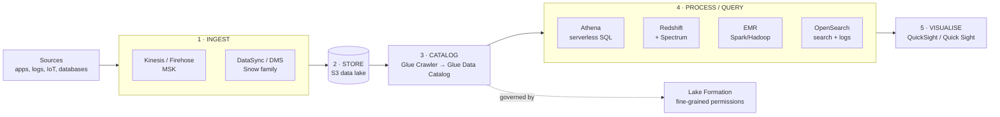

# 22 – Data & Analytics

Eleven services that look like a pile of products and are actually one pipeline. The exam almost never asks how any of them work — it asks **which box** you put in the diagram.

> [!warning] Build tier — **mostly conceptual-only**
> **Athena + Glue are genuinely cheap to try** (Athena is $5/TB scanned; a few MB of test data costs fractions of a cent). **Redshift is blocked at plan level on this account** — same `SubscriptionRequiredException` as Kinesis ([[16-kinesis]]). **EMR and OpenSearch bill hourly per node** and are not free tier. So: build Athena/Glue if you want the muscle memory, learn the rest from this note.

## What problem does this solve?

You already know how to store data ([[09-s3-advanced]]) and how to run a database ([[07-rds-aurora]]). Neither answers the question a business actually asks: *"we have four years of clickstream sitting in S3 — what happened last Tuesday?"*

A relational database is the wrong tool. Loading four years of JSON into RDS to run one aggregate query is slow, expensive, and throws the data away afterwards. What you want is to **leave the data where it is and query it in place**, or to **load it into something built for scanning billions of rows** rather than for updating one row at a time.

That is the whole analytics category. Every service in it is a different answer to "where does the compute go, and who manages it."

Here's the honest framing for the exam: **this is a recognition topic**. Task Statement 3.5 is **one of the exam guide's fourteen task statements**, and the exam's analytics questions are overwhelmingly "pick the service", not "tune the service". You do not need to know how to write a Spark job. You need to know that Spark means EMR, that SQL-on-S3 means Athena, and that "least operational overhead" almost always means the serverless one.

> In one line: analytics is one pipeline — ingest, store, catalog, query, visualise — and the exam tests which service occupies which slot.

## How it actually works

### The pipeline, once, so the rest makes sense

Almost every analytics question is a scenario that walks this path. Learn the shape and most questions become "which stage are they asking about?"

Two things to notice, because both are exam answers:

**S3 is the data lake.** Not a database — S3. Every serious AWS analytics architecture stores the raw data in S3 and points compute at it. That's why S3 lifecycle policies, storage classes and partitioning ([[09-s3-advanced]]) keep showing up inside analytics questions.

**The catalog is the glue — literally.** The **AWS Glue Data Catalog** is a central schema registry: table definitions, column types, partitions. The point is that **Athena, EMR and Redshift Spectrum all read the same catalog.** You define a table once and three engines can query it. A **Glue Crawler** populates it by scanning S3 and inferring the schema automatically.

> In one line: sources → S3 → Glue Data Catalog → whichever query engine fits → QuickSight, and the catalog is shared by all the engines.

### Athena — SQL on S3, and you pay per byte you touch

Athena is an interactive query service: point it at S3, write standard SQL, get results in seconds. It is **serverless** — nothing to provision, and you pay only for queries you run.

The pricing model is the whole personality of the service: **$5 per TB of data scanned**. Not per query, not per hour. Per byte read off S3.

That single fact generates the most common Athena exam question, which is always some version of *"how do you make this cheaper/faster?"* The answer is always some combination of three things, and AWS's own documentation works the example:

| Technique | Why it works | AWS's worked saving |
|---|---|---|
| **Compression** (GZIP, Snappy) | fewer bytes on disk to read | 3:1 → $15 becomes $5 |
| **Columnar format** (**Parquet**, ORC) | Athena reads only the columns your query names | a further ~4x |
| **Partitioning** (e.g. by date) | whole folders skipped when the `WHERE` clause excludes them | depends on selectivity |
| **All together** | | **$15 → $1.25, a 12x cut** |

If a question says "reduce Athena cost", the answer contains **Parquet** and usually **partitioning**. If it says "we query one column of a 200-column table", that is columnar format specifically.

Athena also does **federated queries** — querying sources other than S3 (RDS, DynamoDB, on-prem) through connectors. Those carry a **10 MB minimum data scan per query**.

> In one line: Athena is serverless SQL over S3 at $5/TB scanned, so every optimisation is about scanning fewer bytes — Parquet, compression, partitioning.

### Redshift — the warehouse, and when you actually need one

Redshift is a **data warehouse**: an enterprise-class relational system built for analytic queries that retrieve and aggregate large amounts of data in multi-stage operations. It gets its speed from three things working together — **massively parallel processing (MPP)**, **columnar storage**, and aggressive **compression encoding**.

The distinction that matters most is **Redshift vs RDS**, and it is the OLAP/OLTP split:

- **RDS / Aurora = OLTP.** Many small transactions, row-oriented, "update this one order".
- **Redshift = OLAP.** Few enormous queries, column-oriented, "sum revenue by region for three years".

Putting an analytics workload on RDS is a classic wrong answer, and so is putting a transactional app on Redshift.

**Redshift Spectrum** is the feature that confuses people. It lets a Redshift cluster query data **directly in S3** without loading it, using **external schemas and external tables** defined in a data catalog (Glue, Athena's catalog, or a Hive metastore on EMR). The two constraints worth remembering: **it requires a Redshift cluster** — Spectrum is not standalone — and **the cluster and the S3 data must be in the same Region**.

AWS's stated best practice is the thing to carry into the exam: **keep the large fact tables in S3 and the smaller dimension tables in the cluster**, then join across both in one query. That's the scenario Spectrum exists for — "we have 3 years of history we rarely touch and 3 months we query constantly."

> In one line: Redshift is OLAP (columnar + MPP), Spectrum extends it to query S3 in place, and it still needs a cluster in the same Region as the data.

### OpenSearch — search and logs, not reporting

Amazon **OpenSearch Service** runs managed OpenSearch clusters (a **domain** = a cluster). It supports OpenSearch and legacy **Elasticsearch OSS up to 7.10** — it was renamed from *Amazon Elasticsearch Service*, so exam questions may still say Elasticsearch.

Its use cases are **log analytics, real-time application monitoring, and clickstream analysis** — plus full-text search, which is the thing nothing else in this list does. If a scenario wants "search across free text with relevance ranking" or "a dashboard of application logs", it's OpenSearch, not Athena.

Cost-tiering is the feature worth knowing: **UltraWarm** and **cold storage** move older, read-only indices onto cheaper S3-backed storage instead of hot EBS.

> In one line: OpenSearch is for search and log analytics — reach for it when the question says "search", "logs" or "observability dashboard", not "SQL report".

### EMR — when you genuinely need the Hadoop/Spark ecosystem

**Amazon EMR** (previously Elastic MapReduce) is a managed cluster platform for big data frameworks — **Apache Hadoop, Apache Spark**, Hive, Presto and friends — on EC2 instances you can see and tune.

The node types are the exam-testable part:

| Node type | Role | Spot-safe? |
|---|---|---|
| **Primary** | manages the cluster, coordinates distribution of data and tasks, tracks status | ❌ lose it and the cluster dies |
| **Core** | runs tasks **and stores data in HDFS** | ⚠️ risky — losing it loses HDFS data |
| **Task** | runs tasks only, **stores no HDFS data** | ✅ the classic Spot use case |

Task nodes storing nothing is exactly why they're the standard answer for Spot Instances — an interruption costs you compute, not data. (You choose **instance groups** or **instance fleets** at creation, and fleets let you mix instance types with On-Demand and Spot target capacities. That choice is permanent.)

The other framing: **transient vs long-running clusters.** A transient cluster runs its steps and auto-terminates — cheapest for scheduled batch jobs. A long-running cluster waits for you to submit more work. "Nightly batch job" → transient.

> In one line: EMR is managed Hadoop/Spark on visible EC2 nodes; task nodes hold no HDFS so they're the Spot target, and transient clusters are the cheap batch pattern.

### QuickSight — the dashboard at the end, and SPICE

**Amazon QuickSight** is the BI/visualisation layer: connect a data source, build dashboards, embed them in apps. Serverless, pay-per-session available.

**SPICE** — *Super-fast, Parallel, In-memory Calculation Engine* — is the one term that gets tested. It's an in-memory engine you **import** data into, as opposed to **direct query** which hits the source every time. Importing into SPICE makes queries fast and, if your source charges per query (hello, Athena at $5/TB), stops you paying for the same scan repeatedly. SPICE capacity is allocated **per Region** and shared across everyone using QuickSight in that account and Region.

> [!warning] Naming change — QuickSight is now "Amazon Quick Sight"
> AWS has rebranded: *"Amazon Quick evolved from Amazon QuickSight. QuickSight continues as Amazon Quick Sight, a feature within Quick."* The SAA-C03 exam guide and every practice question still say **QuickSight** — answer to the old name, but don't be thrown if the console says Quick.

> In one line: QuickSight is the dashboard, and SPICE is its in-memory cache that also saves you re-paying per-query source costs.

### The remaining in-scope names, briefly

These are in the exam guide's Analytics list and deserve a line each, not a section:

- **AWS Lake Formation** — an **authorization layer over the Glue Data Catalog**, giving fine-grained (table-, column-, row-level) permissions on a data lake, instead of hand-writing S3 bucket policies. "Centrally govern who can see which columns of the data lake" → Lake Formation.
- **Amazon MSK** (Managed Streaming for Apache Kafka) — fully managed Apache Kafka. AWS runs the brokers and the ZooKeeper/KRaft metadata layer. **MSK Serverless** removes capacity planning. Pick MSK over Kinesis when the answer says *"we already have Kafka"* or needs Kafka APIs/tooling.
- **Amazon Managed Service for Apache Flink** — real-time stream processing with SQL or Flink. **Renamed from Amazon Kinesis Data Analytics on 30 August 2023**, so older material and the exam may use either name. (It isn't named separately in the exam guide; it sits under the listed *Amazon Kinesis*.)
- **AWS Data Exchange** — a marketplace for subscribing to third-party datasets and having them land in S3.
- **AWS Data Pipeline** — see the trap below. It's in the exam guide and it's effectively dead.

> In one line: Lake Formation governs the catalog, MSK is Kafka-when-you-need-Kafka, Flink is stream processing, and Data Pipeline is a legacy answer.

## Exam recap

> [!info] Exam TL;DR
> - **One pipeline:** ingest (Kinesis/MSK/DataSync) → store (**S3 data lake**) → catalog (**Glue Crawler → Glue Data Catalog**) → query (Athena/Redshift/EMR/OpenSearch) → visualise (QuickSight).
> - **The Glue Data Catalog is shared** by Athena, EMR and Redshift Spectrum. Define a table once.
> - **Athena** = serverless SQL on S3, **$5/TB scanned**. Cheaper = scan less: **Parquet/ORC + compression + partitioning** (AWS's own example: $15 → $1.25). Federated queries have a **10 MB per-query minimum**.
> - **Redshift** = OLAP warehouse: **MPP + columnar + compression**. **RDS is OLTP, Redshift is OLAP** — never swap them.
> - **Redshift Spectrum** queries S3 in place via **external tables**, but **requires a cluster** and **same Region** as the data. Best practice: **big fact tables in S3, small dimension tables in the cluster**.
> - **Athena vs Redshift:** ad-hoc/occasional/no-infrastructure → **Athena**. Sustained, complex joins, many concurrent BI users → **Redshift**.
> - **OpenSearch** = full-text **search** + **log analytics** (formerly Elasticsearch Service). **UltraWarm/cold** tier old indices cheaply.
> - **EMR** = managed Hadoop/**Spark**. **Primary** (coordinates) · **Core** (tasks + **HDFS**) · **Task** (tasks only, no HDFS → **the Spot node**). **Transient** cluster auto-terminates = cheap batch.
> - **QuickSight** = BI dashboards; **SPICE** = *Super-fast Parallel In-memory Calculation Engine*, imported data vs direct query, capacity **per Region**.
> - **Lake Formation** = fine-grained permissions layer **over the Glue Data Catalog**.
> - **MSK** = managed Kafka (pick when the scenario already says Kafka). **Managed Service for Apache Flink** = renamed Kinesis Data Analytics.
> - **"Least operational overhead" + analytics ⇒ the serverless option** (Athena, Glue, QuickSight) over the cluster option (Redshift, EMR, OpenSearch).

## AWS console ↔ Terraform map

| Concept | Terraform | Notes |
|---|---|---|
| Catalog database / table | `aws_glue_catalog_database`, `aws_glue_catalog_table` | The shared metastore. |
| Schema discovery | `aws_glue_crawler` | Points at an S3 path, writes into the catalog. |
| ETL job | `aws_glue_job` | Spark or Python shell. |
| Athena workspace | `aws_athena_workgroup`, `aws_athena_database` | Workgroup is where you set the **query result bucket** and per-query data scan limits. |
| Warehouse | `aws_redshift_cluster` / `aws_redshiftserverless_workgroup` | Blocked on this account's plan. |
| Search domain | `aws_opensearch_domain` | Hourly per node. |
| Big data cluster | `aws_emr_cluster` + `aws_emr_instance_group` | Instance groups vs fleets is set at creation. |
| Kafka | `aws_msk_cluster` / `aws_msk_serverless_cluster` | |
| Lake governance | `aws_lakeformation_permissions`, `aws_lakeformation_resource` | Layers on top of Glue catalog resources. |

## Key facts, limits & pricing

- **Athena** is serverless, uses standard SQL, queries S3 directly, and charges **$5 per TB scanned** (us-east-1, checked 2026-09-26 — verify current pricing). You pay only for queries you run. Athena also supports **Apache Spark** notebooks alongside SQL.
- **Athena cost reduction**, per AWS's own worked example: 3:1 **compression** takes $15 → $5; converting to **Apache Parquet** so only the queried column is read takes it to ~$1.25 — a **12x** reduction. **Partitioning** skips whole prefixes.
- **Athena federated queries** (non-S3 sources via connectors) carry a **10 MB minimum per query**.
- **AWS Glue** is a **serverless** data integration/ETL service. **Crawlers** automatically infer schema into the **Glue Data Catalog**; cataloged data is immediately queryable by **Athena, EMR and Redshift Spectrum**. Glue Studio is the visual job editor; **Glue DataBrew** is the no-code data-prep tool.
- **AWS Lake Formation** is *"an authorization layer that provides fine-grained access control to resources in the AWS Glue Data Catalog"* — it does not store data itself.
- **Redshift** combines **massively parallel processing, columnar storage and compression encoding**. It is a relational warehouse for analytic queries, not an OLTP database.
- **Redshift Spectrum** requires a Redshift cluster and a SQL client; **the cluster and the S3 data must be in the same AWS Region**. It reads **external schemas/external tables** from a Glue, Athena or Hive (EMR) catalog. Spectrum queries incur additional charges.
- **Amazon OpenSearch Service** manages **domains** (= clusters); supports OpenSearch and legacy **Elasticsearch OSS up to 7.10**; scales to **1,002 data nodes** and **25 PB** of attached storage; offers **UltraWarm** and **cold storage** for read-only data, Multi-AZ across two or three AZs, and **dedicated master nodes**. **OpenSearch Serverless** and **OpenSearch Ingestion** exist and bill in OCUs.
- **EMR node types:** **primary** (coordinates, tracks status, monitors health — a single-node cluster is primary-only), **core** (runs tasks **and stores HDFS data**; multi-node clusters need ≥1), **task** (runs tasks, **stores no HDFS data**, optional → the Spot candidate). **Instance groups vs instance fleets** is chosen at creation and **cannot be changed**.
- **EMR clusters** auto-terminate after their steps (transient) or stay in `WAITING` for more steps (long-running). A failure terminates the cluster and deletes its data unless **termination protection** is enabled.
- **SPICE** = **Super-fast, Parallel, In-memory Calculation Engine**. Imported (ingested) data vs **direct query**. SPICE capacity is allocated **per AWS Region** and shared by everyone using QuickSight in that account+Region; Enterprise edition encrypts SPICE at rest.
- **Amazon MSK** manages broker nodes and the **ZooKeeper / KRaft** metadata layer; **MSK Serverless** removes capacity planning; **MSK Connect** and **MSK Replicator** handle connectors and cross-Region replication.
- **Amazon Managed Service for Apache Flink** was **renamed from Amazon Kinesis Data Analytics on 30 August 2023** — no changes to endpoints, APIs, CLI, IAM policies or metrics.
- **⚠️ AWS Data Pipeline is no longer available to new customers** and is in **maintenance mode** with no new features or Region expansions. **Console access was removed on 30 April 2023** (CLI/API only). AWS recommends **Glue**, **Step Functions** or **MWAA** instead. It is still listed as in-scope in the SAA-C03 exam guide.
- **Exam scope:** analytics is covered by **Task Statement 3.5 — "Determine high-performing data ingestion and transformation solutions"**, which names *Athena, Lake Formation and QuickSight* as examples. The in-scope Analytics list is: **Athena, Data Exchange, Data Pipeline, EMR, Glue, Kinesis, Lake Formation, MSK, OpenSearch Service, QuickSight, Redshift**. Only **Amazon CloudSearch** is explicitly out of scope.

## Comparisons

### The four query engines

|   | **Athena** | **Redshift** | **Redshift Spectrum** | **EMR** |
|---|---|---|---|---|
| What it is | serverless SQL over S3 | provisioned OLAP warehouse | Redshift querying S3 in place | managed Hadoop/Spark cluster |
| Infrastructure | **none** | cluster (or Serverless) | **needs a cluster** | EC2 cluster you size |
| Data lives | **S3** | loaded into the cluster | **S3** (external tables) | S3 and/or HDFS |
| Priced by | **data scanned ($5/TB)** | node-hours | data scanned, plus the cluster | instance-hours |
| Best for | **ad-hoc / infrequent** queries | **sustained** BI, complex joins, concurrency | joining **cold S3 history** to hot cluster tables | custom **Spark/Hadoop** code, ML prep |
| Operational overhead | **lowest** | high | high | highest |

### Which engine does the exam mean?

| The scenario says… | Answer |
|---|---|
| "ad-hoc SQL, no infrastructure, pay per query" | **Athena** |
| "reduce Athena cost / scan less data" | **Parquet + compression + partitioning** |
| "petabyte warehouse, complex joins, many BI users" | **Redshift** |
| "query years of S3 history alongside warehouse tables" | **Redshift Spectrum** |
| "run our existing **Spark** jobs" | **EMR** |
| "**full-text search** / relevance ranking" | **OpenSearch** |
| "dashboard of **application logs**" | **OpenSearch** |
| "discover schema automatically / central metastore" | **Glue Crawler + Data Catalog** |
| "serverless **ETL**" | **Glue** |
| "column-level permissions on the data lake" | **Lake Formation** |
| "we already run **Kafka**" | **MSK** |
| "BI dashboards for business users" | **QuickSight** |

### Redshift vs RDS/Aurora

|   | **Redshift** | **RDS / Aurora** |
|---|---|---|
| Workload | **OLAP** — analytics | **OLTP** — transactions |
| Storage layout | **columnar** | row-oriented |
| Query shape | few, huge, aggregate-heavy | many, tiny, single-row |
| Scaling model | **MPP** across nodes | vertical + read replicas |
| Wrong-answer signal | using it for an app's live database | using it for 3 years of analytics |

### Kinesis vs MSK

|   | **Kinesis Data Streams** | **Amazon MSK** |
|---|---|---|
| API | AWS-proprietary | **open-source Apache Kafka** |
| Unit of scale | **shard** | **partition** / broker |
| Ops burden | lower — fully managed, no brokers | AWS manages brokers, you still size the cluster |
| Serverless option | on-demand mode | **MSK Serverless** |
| Pick it when | greenfield on AWS, least overhead | **existing Kafka** apps, tooling or expertise |

## Worked examples

> [!example] Worked example — the clickstream question, end to end
> *"A retailer streams 500 GB/day of clickstream events. Analysts need ad-hoc SQL over the last two years, a live dashboard of site errors, and the lowest possible operational overhead."*
> Walk the pipeline. **Ingest**: the events are streaming, so **Amazon Data Firehose** — it's the managed, zero-ops delivery pipe that batches to S3 ([[16-kinesis]]), where Data Streams would make you write a consumer. **Store**: S3, partitioned by `year/month/day`, written as **Parquet** (Firehose can convert on the way in). **Catalog**: a **Glue Crawler** populates the **Glue Data Catalog**. **Query**: "ad-hoc SQL" + "lowest operational overhead" ⇒ **Athena**, and the Parquet-plus-partitioning choice made two steps earlier is what keeps the $5/TB bill sane — a query filtered to one day touches one prefix and one column set. **The live error dashboard is a different engine**: that's log analytics, so **OpenSearch**, fed separately from Firehose. Two sinks from one stream is normal and is why Firehose supports multiple destinations. Adding Redshift here would be the trap — nothing in the scenario needs a provisioned warehouse.

> [!example] Worked example — the Athena bill that arrived too large
> A team points Athena at 40 TB of raw gzipped JSON logs and lets analysts query freely. The first month's bill is brutal: every query with no `WHERE` on a partition column scans all 40 TB at **$5/TB** — $200 a query. Three fixes, in order of impact. **(1) Convert to Parquet.** Queries name three columns out of sixty; columnar storage means Athena reads only those three. **(2) Partition by date** so `WHERE dt = '2026-09-01'` reads one prefix instead of every object. **(3) Set a per-query data scan limit on the Athena workgroup** so a careless `SELECT *` gets cancelled instead of billed. Guardrail, not optimisation — but it's the thing that stops the repeat. The same $15-to-$1.25 arithmetic AWS documents is exactly this, scaled up.

> [!failure] Failure mode — the warehouse nobody needed
> A team is told to "build a data lake" and provisions a Redshift cluster, then writes nightly Glue jobs to load every S3 object into it. Six months on, the cluster runs 24/7 at four figures a month, 90% of the loaded data has never been queried, and analysts still wait for the load to finish before they can see yesterday's numbers. The mistake is treating Redshift as the default rather than as the answer to a specific question — **sustained, concurrent, complex-join BI**. For "analysts occasionally query S3", Athena costs nothing when idle and needs no loading step at all. The production-grade middle ground is **Spectrum**: keep the hot months in the cluster, leave the cold years in S3, join across both. The tell that you chose wrong: **a cluster whose utilisation is near zero between 9am reports.**

## Traps

> [!warning] Trap — Athena vs Redshift
> Both run SQL over big data, so scenarios are written to make you pick on familiarity. The axis is **infrastructure and frequency**, not capability. **Ad-hoc, intermittent, "no infrastructure to manage", "pay only for what you query" → Athena.** **Sustained load, many concurrent BI users, complex multi-table joins, a dedicated warehouse → Redshift.** If the scenario mentions loading/ETL into the engine first, that's Redshift; if the data stays in S3, that's Athena. "Least operational overhead" is almost always Athena.

> [!warning] Trap — reducing Athena cost by resizing something
> Athena has nothing to resize — it's serverless and billed on **bytes scanned**. Any option offering a bigger instance, more nodes, or provisioned capacity is wrong by construction. The real answers are **columnar format (Parquet/ORC)**, **compression**, and **partitioning**, plus workgroup scan limits as a guardrail. Same reasoning inverted: if a question asks why Athena is slow *and* expensive, the cause is usually many small uncompressed row-format files.

> [!warning] Trap — Redshift Spectrum as a standalone service
> Spectrum is a **feature of Redshift**, not an alternative to it. It **requires a running cluster**, and the cluster must be in the **same Region** as the S3 data. If a scenario wants to query S3 with no cluster at all, that's **Athena** — picking Spectrum there means provisioning a warehouse you were explicitly told you didn't want.

> [!warning] Trap — OpenSearch vs Athena for "analyse our logs"
> Both can touch log data and the wording is deliberately close. **OpenSearch** is for **full-text search, relevance ranking, and live operational dashboards** over recent logs — near-real-time, always-on cluster. **Athena** is for **SQL aggregates over historical logs already in S3** — nothing running between queries. "Search", "index", "Kibana/OpenSearch Dashboards", "real-time monitoring" → OpenSearch. "Query last quarter's logs with SQL", "no infrastructure" → Athena.

> [!warning] Trap — EMR core nodes on Spot
> Task nodes are the Spot answer because they **store no HDFS data** — losing one costs compute only. **Core nodes store HDFS data**, so a Spot interruption can lose data or destabilise the cluster, and the **primary node** running on Spot can kill the cluster outright. An option offering "Spot for all nodes to save money" is wrong; "Spot for task nodes, On-Demand for primary and core" is the pattern.

> [!warning] Trap — AWS Data Pipeline as a live answer
> It still appears in the SAA-C03 exam guide's in-scope list and in older practice questions, but **AWS Data Pipeline is closed to new customers and in maintenance mode**, with console access removed in April 2023. On the exam, treat it as answerable if a question explicitly offers it for legacy orchestration — but in any "which service should we use" scenario the modern answers are **Glue** (ETL), **Step Functions** (orchestration) or **MWAA** (Airflow). Don't let the exam guide's list convince you it's current.

> [!warning] Trap — building a second catalog per engine
> Athena, EMR and Redshift Spectrum all read the **same AWS Glue Data Catalog**. Options that propose defining schemas separately for each engine, or syncing metadata between them, are describing work AWS already did. One crawler, one catalog, three engines.

> [!example]- Recall drill
> (1) Athena's pricing unit, and the three ways to cut it? (2) Redshift vs RDS in one word each? (3) What does Redshift Spectrum require that Athena doesn't? (4) Which EMR node type is safe on Spot, and why? (5) What does SPICE stand for and what is it for? (6) Which service gives column-level permissions on a data lake? (7) Kafka already in use — Kinesis or MSK? (8) What was Managed Service for Apache Flink called before?
> > [!success]- Answers
> > (1) **Data scanned, $5/TB** — cut it with **Parquet/ORC**, **compression**, **partitioning**. (2) Redshift **OLAP**, RDS **OLTP**. (3) **A Redshift cluster**, in the **same Region** as the S3 data. (4) **Task nodes** — they store no HDFS data, so an interruption loses compute only. (5) **Super-fast, Parallel, In-memory Calculation Engine** — QuickSight's in-memory store for imported data, as opposed to direct query. (6) **AWS Lake Formation**, layered over the Glue Data Catalog. (7) **MSK**. (8) **Amazon Kinesis Data Analytics** (renamed 30 Aug 2023).

## 🔴 My weak spots (this topic)   #weak-spot

- [ ] **Written from docs, not yet drilled** — authored 2026-09-26 from the AWS documentation and the SAA-C03 exam guide while I was working through the course section. No build, no mock yet.
- [ ] **Athena vs Redshift vs Spectrum** — three services that all "run SQL on big data". The axis is infrastructure and frequency, not capability.
- [ ] **OpenSearch vs Athena for logs** — the wording in log-analytics scenarios is deliberately close.
- [ ] **EMR node types** — which one holds HDFS is the whole Spot question, and it's the kind of detail I lose under time pressure.
- [ ] **Stale service names** — Kinesis Data Analytics → Managed Service for Apache Flink, Elasticsearch Service → OpenSearch, QuickSight → Quick Sight. The exam uses the old names; the console uses the new ones.

## 🔗 Docs

- [What is Amazon Athena?](https://docs.aws.amazon.com/athena/latest/ug/what-is.html) · [Athena pricing](https://aws.amazon.com/athena/pricing/) — $5/TB scanned, the compression/columnar worked example, 10 MB federated-query minimum; verified 2026-09-26
- [What is AWS Glue?](https://docs.aws.amazon.com/glue/latest/dg/what-is-glue.html) — serverless data integration, crawlers, Data Catalog shared by Athena/EMR/Redshift Spectrum, Lake Formation as the authorization layer; verified 2026-09-26
- [Amazon Redshift architecture](https://docs.aws.amazon.com/redshift/latest/dg/c_redshift_system_overview.html) · [Getting started with Redshift Spectrum](https://docs.aws.amazon.com/redshift/latest/dg/c-getting-started-using-spectrum.html) — MPP + columnar + compression; Spectrum needs a cluster, same Region, external tables, fact-in-S3/dimension-in-cluster best practice; verified 2026-09-26
- [What is Amazon OpenSearch Service?](https://docs.aws.amazon.com/opensearch-service/latest/developerguide/what-is.html) — domains, Elasticsearch OSS up to 7.10, UltraWarm/cold, 1,002 nodes / 25 PB; verified 2026-09-26
- [What is Amazon EMR?](https://docs.aws.amazon.com/emr/latest/ManagementGuide/emr-what-is-emr.html) · [Clusters and nodes](https://docs.aws.amazon.com/emr/latest/ManagementGuide/emr-overview.html) — primary/core/task, HDFS placement, instance groups vs fleets, cluster lifecycle; verified 2026-09-26
- [Importing data into SPICE](https://docs.aws.amazon.com/quicksight/latest/user/spice.html) — the acronym, in-memory vs direct query, per-Region capacity, the Quick Sight rename; verified 2026-09-26
- [What is Amazon MSK?](https://docs.aws.amazon.com/msk/latest/developerguide/what-is-msk.html) · [Managed Service for Apache Flink rename](https://aws.amazon.com/blogs/aws/announcing-amazon-managed-service-for-apache-flink-renamed-from-amazon-kinesis-data-analytics/) — renamed 30 Aug 2023; verified 2026-09-26
- [Migrating workloads from AWS Data Pipeline](https://docs.aws.amazon.com/datapipeline/latest/DeveloperGuide/migration.html) — closed to new customers, maintenance mode, console removed Apr 2023, use Glue/Step Functions/MWAA; verified 2026-09-26
- [SAA-C03 Exam Guide (PDF)](https://d1.awsstatic.com/training-and-certification/docs-sa-assoc/AWS-Certified-Solutions-Architect-Associate_Exam-Guide.pdf) — Task Statement 3.5 and the in-scope Analytics service list; verified 2026-09-26
- Terraform: [`aws_glue_crawler`](https://registry.terraform.io/providers/hashicorp/aws/latest/docs/resources/glue_crawler) · [`aws_athena_workgroup`](https://registry.terraform.io/providers/hashicorp/aws/latest/docs/resources/athena_workgroup) · [`aws_emr_cluster`](https://registry.terraform.io/providers/hashicorp/aws/latest/docs/resources/emr_cluster)

---
**Self-test for this topic:** [[revision/22-analytics-revision#Self-test]]
