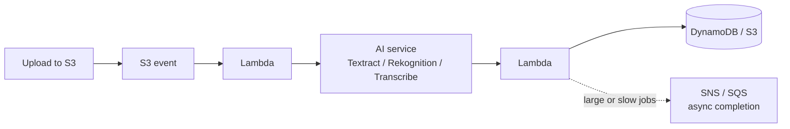

# 23 – Machine Learning

Eleven one-line services. The exam never asks you to train a model — it asks whether you can tell Rekognition from Textract fast enough to eliminate three wrong answers.

> [!warning] Build tier — **conceptual-only, deliberately**
> Nothing here is worth building. The exam's ML questions are recognition questions, and the return on an hour of hands-on SageMaker is close to zero for SAA-C03. Read this note, drill the table, move on.

## What problem does this solve?

Let me correct something I told you earlier in this repo, because it was imprecise.

I previously said ML was "appendix-only" and effectively skippable. Checking the actual **SAA-C03 exam guide**, that's not right. There is a **Machine Learning category in the in-scope services list with eleven named services** — Comprehend, Forecast, Fraud Detector, Kendra, Lex, Polly, Rekognition, SageMaker, Textract, Transcribe, Translate. In scope means answerable.

But the second half of the picture is what makes this a twenty-minute topic rather than a two-hour one: **no task statement in any of the four domains mentions machine learning.** Domain 3 has a task statement for data ingestion and analytics (3.5). There is no equivalent for ML. So ML services are in the answer pool without being the subject of any stated objective.

The exam-bank evidence lines up exactly with that. Across 1,168 questions there is **not one question tagged with an ML topic** — yet Rekognition, Comprehend, SageMaker, Transcribe and Translate all appear inside question text in the low hundreds. They are there as **distractors and as one-line correct answers**, not as subjects.

That tells you precisely what to learn. You need **one sentence per service, retrievable instantly** — enough to recognise "this is the document one, not the image one" and strike two options. You do not need to know how any of them work.

> In one line: ML is in scope as a service list but has no task statement, so it shows up as distractors — learn one sentence each, nothing deeper.

## How it actually works

### The whole topic, as a recognition table

This table is the note. Everything else is commentary on it.

| Service | Input → output, in one line | The word that gives it away |
|---|---|---|
| **Rekognition** | **images and video** → objects, scenes, faces, moderation labels | "image", "video", "face", "inappropriate content" |
| **Textract** | **documents** (scans, PDFs) → text, **forms, tables** | "form", "invoice", "scanned document", "table" |
| **Transcribe** | **speech audio** → text | "audio to text", "call recording", "subtitles" |
| **Polly** | **text** → **lifelike speech** | "text to speech", "read aloud", "voice" |
| **Translate** | text in one language → another language | "translate", "localise", "multilingual" |
| **Comprehend** | **text** → **sentiment, entities, key phrases, PII, language** | "sentiment", "NLP", "analyse reviews", "detect PII in text" |
| **Lex** | speech/text → **conversational bot** (intents, slots) | "chatbot", "voice assistant", "IVR" |
| **Kendra** | documents → **intelligent enterprise search** with natural-language answers | "search our internal documents", "ask a question" |
| **Forecast** | historical time series → **future values** | "forecast demand", "predict inventory" |
| **Fraud Detector** | event data → **fraud risk score** | "fraudulent transaction", "fake account" |
| **SageMaker** | your data + your code → **a custom model you build, train and deploy** | "custom model", "train our own", "data scientists" |

**Not on this list, deliberately:** **Amazon Personalize** (recommendations) is named in the exam guide's **out-of-scope** Machine Learning list, alongside SageMaker Ground Truth, SageMaker Data Wrangler, DeepRacer, Elastic Inference, HealthLake, the Lookout family and Monitron. Your course almost certainly covers Personalize — it's a real service and a reasonable thing to know — but it cannot be the answer to a scored question. Recognise it, don't revise it.

> In one line: every AI service is a fixed input type mapped to a fixed output type — match the noun in the question to the noun in the table.

### The two splits that actually get tested

Most ML exam questions resolve on one of two distinctions, and the rest of the options are noise.

**Split one: pre-trained AI service vs SageMaker.** Every service in the table except SageMaker is a **pre-trained API** — you call it, you get an answer, you need no ML expertise and you train nothing. **SageMaker** is the platform for when you need a **custom model**: your own data, your own algorithm, your own training job, your own endpoint.

So the discriminator is a phrase in the question:

- *"no machine learning expertise"*, *"fully managed API"*, *"quickly add X to our app"* → **the pre-trained service**
- *"train a custom model on our own data"*, *"our data science team"*, *"our own algorithm"* → **SageMaker**

Picking SageMaker when a one-line API would do is the single most common ML wrong answer, because it sounds more serious.

**Split two: which modality.** Images, documents, audio, text — these are four different services and the exam deliberately pairs the near-neighbours. That's the next section.

> In one line: pre-trained API unless the question says "custom model" or "our own data", in which case SageMaker.

### The near-neighbours, resolved

**Rekognition vs Textract** is the most-tested pair in the topic. Both read things that look like pictures.

- **Rekognition** analyses **images and video** as *scenes*: what objects are present, whose face is this, is this content inappropriate. It can detect text *in a scene* — a street sign, a number plate.
- **Textract** reads **documents**: scanned forms, invoices, tax returns, PDFs. Crucially it preserves **structure** — it extracts **forms (key-value pairs) and tables**, not just a flat blob of characters. It also handles **handwriting**.

The test: *is the subject a document, or a picture of the world?* "Extract the totals from 10,000 scanned invoices" is Textract, not Rekognition, and not plain OCR either — the structure is the point.

**Transcribe vs Polly** are opposite directions and get swapped under time pressure. **Transcribe: audio in, text out.** **Polly: text in, audio out.** A mnemonic that sticks: *transcribing* a meeting produces a written record; *Polly* the parrot talks.

**Comprehend vs Kendra** both consume text. **Comprehend** *analyses* text and tells you things about it — sentiment, entities, PII. **Kendra** *searches* text and answers questions from it. "How do customers feel about the new release?" → Comprehend. "Where in our 40,000 internal docs is the VPN policy?" → Kendra.

**Kendra vs OpenSearch** is the cross-topic one worth holding ([[22-analytics]]). **OpenSearch** is keyword/index search infrastructure you operate — also the log-analytics engine. **Kendra** is a managed natural-language question-answering layer over your documents, using semantic and contextual similarity rather than keyword matching. "Natural language question", "employees ask questions of internal documents" → Kendra. "Search index we run, log dashboards" → OpenSearch.

> In one line: document vs scene (Textract/Rekognition), audio direction (Transcribe/Polly), analyse vs search (Comprehend/Kendra).

### The pipeline pattern, because that's how scenarios are written

ML questions rarely name one service. They describe a workflow, and you're asked for the combination. The shape is almost always the same:

Two details make this the right answer rather than a plausible one, and both come from things you already know:

**Use the asynchronous API for anything large.** Textract processes single-page documents synchronously but multi-page documents **asynchronously**; Rekognition and Transcribe likewise have async job APIs that notify on completion. A design that calls a sync API from a Lambda with a 15-minute ceiling will fail on a 300-page PDF. Async job + **SNS** notification is the pattern ([[15-decoupling]]).

**Chaining is normal.** "Transcribe support calls, then find out whether customers were angry" is **Transcribe → Comprehend**. "Extract text from scanned forms, then redact personal data" is **Textract → Comprehend** (PII detection). If a question describes two steps, expect two services.

> In one line: S3 → Lambda → AI service → store, with async APIs plus SNS for anything multi-page or long-running, and services chained when the scenario has two verbs.

### Names and availability have moved — this matters

This is the part your course video will not have.

**SageMaker was renamed.** On **3 December 2024** the ML service became **Amazon SageMaker AI**, and the name "Amazon SageMaker" was reused for a new unified platform covering data, analytics and AI (SageMaker Unified Studio, lakehouse, governance). The exam guide and every practice question still say plain "Amazon SageMaker" and mean the ML service.

**Three of the eleven in-scope ML services are closed to new customers:**

| Service | Status | AWS points you to |
|---|---|---|
| **Amazon Forecast** | closed to new customers **29 July 2024** | **SageMaker Canvas** |
| **Amazon Fraud Detector** | closed to new customers **7 November 2025** | SageMaker, AutoGluon, **AWS WAF** |
| **Amazon Kendra** | closed to new customers | **Amazon Bedrock Knowledge Bases** |

They remain in the SAA-C03 exam guide's in-scope list, and existing customers keep using them. So: **still answer them on the exam**, but know they're legacy in the real world. If a question offers Forecast for time-series prediction, it's still the intended answer.

> In one line: SageMaker is now "SageMaker AI", and Forecast, Fraud Detector and Kendra are closed to new customers but still exam-answerable.

## Exam recap

> [!info] Exam TL;DR
> - **ML is in scope** (11 named services) but **no task statement covers it** — it appears as distractors and one-line answers. Learn one sentence per service; go no deeper.
> - **Pre-trained API vs SageMaker** is the main split. *"No ML expertise"* / *"managed API"* → pre-trained service. *"Train a custom model on our data"* → **SageMaker**.
> - **Rekognition = images/video** (objects, faces, moderation). **Textract = documents** (text + **forms + tables** + handwriting). Document vs scene.
> - **Transcribe = audio → text. Polly = text → audio.** Opposite directions.
> - **Translate** = language → language. **Comprehend** = NLP insights: **sentiment, entities, key phrases, PII, language, topic modeling**.
> - **Lex** = chatbots (intents/slots). **Kendra** = natural-language enterprise **search** over documents.
> - **Forecast** = time-series prediction. **Fraud Detector** = fraud risk scoring. **Amazon Personalize is explicitly OUT of scope** — the course covers it, the exam guide excludes it.
> - **Comprehend analyses text; Kendra searches it.** **Kendra is natural-language Q&A; OpenSearch is the keyword/log engine you run.**
> - **Chain services** when the scenario has two verbs: Transcribe → Comprehend (call sentiment), Textract → Comprehend (extract then redact PII).
> - **Use async APIs + SNS** for multi-page documents and long audio — sync APIs are single-page/short only.
> - **Renamed/retired:** SageMaker → **SageMaker AI** (Dec 2024). **Forecast, Fraud Detector and Kendra are closed to new customers** — still exam-answerable.

## AWS console ↔ Terraform map

Mostly not a Terraform topic — these are API calls from application code, not infrastructure. The few that are resources:

| Concept | Terraform | Notes |
|---|---|---|
| Chatbot | `aws_lexv2models_bot` | V2 models; V1 resources are legacy. |
| Custom model endpoint | `aws_sagemaker_model`, `aws_sagemaker_endpoint_configuration`, `aws_sagemaker_endpoint` | The one place you'd really write HCL. |
| Notebook | `aws_sagemaker_notebook_instance` | Bills hourly — destroy it. |
| Everything else | **none** | Rekognition/Textract/Comprehend/Polly are called with the SDK. What you'd write in Terraform is the **IAM role** granting your Lambda permission to call them ([[19-serverless]]). |

## Key facts, limits & pricing

- **Exam scope:** the SAA-C03 exam guide lists a **Machine Learning** in-scope category containing **Comprehend, Forecast, Fraud Detector, Kendra, Lex, Polly, Rekognition, SageMaker, Textract, Transcribe, Translate**. Explicitly **out of scope**: Apache MXNet, Augmented AI (A2I), DeepComposer, Deep Learning AMIs, Deep Learning Containers, DeepLens, DeepRacer, DevOps Guru, Elastic Inference, HealthLake, Inferentia, **Lookout for Equipment / Metrics / Vision**, Monitron, Panorama, **Personalize**, PyTorch on AWS, **SageMaker Data Wrangler**, **SageMaker Ground Truth**, TensorFlow on AWS. No task statement in any domain names machine learning.
- **Amazon Textract** detects **typed and handwritten** text and extracts **text, forms and tables** from structured documents, working on **image and PDF** files. Specialised APIs: **AnalyzeExpense** (invoices/receipts), **AnalyzeID** (driver's licences, passports), **Queries** (ask for a specific field), **Analyze Lending**. **Synchronous processing handles single-page documents; multi-page documents require the asynchronous operations.**
- **Amazon Comprehend** returns **entities, key phrases, PII, dominant language, sentiment, targeted sentiment and syntax**. It also does **topic modeling / document clustering**. **Comprehend Custom** trains custom classifiers and entity recognisers via AutoML; **flywheels** manage retraining over time. Real-time for small workloads, asynchronous jobs for large document sets.
- **Amazon Kendra** is *"a managed information retrieval and intelligent search service that uses natural language processing and advanced deep learning"* — it uses **semantic and contextual similarity**, unlike traditional keyword search. Handles **factoid, descriptive and natural-language** questions, and connects to third-party repositories such as SharePoint. **⚠️ Closed to new customers** — AWS points to **Amazon Bedrock Knowledge Bases**.
- **⚠️ Amazon Forecast** closed to new customers **29 July 2024**; existing customers continue as normal, no new features planned. AWS's migration path is **Amazon SageMaker Canvas**.
- **⚠️ Amazon Fraud Detector** stopped accepting new customers **7 November 2025**; AWS suggests **SageMaker, AutoGluon and AWS WAF**.
- **Amazon SageMaker was renamed Amazon SageMaker AI on 3 December 2024**, with "Amazon SageMaker" reassigned to the next-generation unified data/analytics/AI platform announced at re:Invent 2024. SageMaker AI remains available standalone.
- **Rekognition** covers object and scene detection, facial analysis and comparison, celebrity recognition, text-in-image, and **content moderation** — the last is the one the exam reaches for in "filter inappropriate user uploads" scenarios.
- **Bank evidence (coverage shaping only, per the trainer boundary):** across 1,168 questions, **zero** carry an ML `topics[]` tag, while ML service names appear in question text in the low hundreds — consistent with distractor use rather than subject use.

## Comparisons

### Pre-trained AI service vs SageMaker

|   | **Pre-trained AI services** | **Amazon SageMaker (AI)** |
|---|---|---|
| You provide | **an API call** | data, algorithm, training job |
| ML expertise needed | **none** | data science team |
| Model | AWS's, already trained | **yours** |
| Time to value | minutes | weeks |
| Question signal | "no ML expertise", "managed API", "quickly add" | **"custom model", "our own data", "our algorithm"** |
| Cost shape | per request / per unit processed | training + **endpoint hours** |

### The four modality neighbours

|   | **Rekognition** | **Textract** | **Transcribe** | **Polly** |
|---|---|---|---|---|
| Input | **images / video** | **documents** (scan, PDF) | **audio** | **text** |
| Output | objects, faces, moderation labels | text + **forms + tables** | **text** | **speech audio** |
| Handles handwriting | ✗ | **✓** | n/a | n/a |
| Preserves structure | ✗ (scene labels) | **✓ key-value pairs, tables** | n/a | n/a |
| Classic scenario | moderate user uploads | **process scanned invoices** | transcribe support calls | accessibility / voice output |

### Text services — analyse, search, converse, translate

|   | **Comprehend** | **Kendra** | **Lex** | **Translate** |
|---|---|---|---|---|
| Purpose | **analyse** text for insights | **search** documents, answer questions | **converse** — bot with intents/slots | **convert** language |
| Typical ask | "what's the sentiment?", "find PII" | "where is the policy on X?" | "build a customer-service bot" | "localise our content" |
| Search style | n/a | **semantic / natural language** | n/a | n/a |
| Availability | current | **closed to new customers** | current | current |

### Kendra vs OpenSearch

|   | **Amazon Kendra** | **Amazon OpenSearch Service** |
|---|---|---|
| Category | ML / intelligent search | analytics / search infrastructure |
| Query style | **natural-language questions**, semantic ranking | keyword/DSL queries, you build relevance |
| Ops model | fully managed index | **you size and run a cluster (domain)** |
| Also used for | enterprise document Q&A | **log analytics, observability dashboards** |
| Question signal | "employees ask questions of internal docs" | "search index", "log dashboards", "Kibana" |

## Worked examples

> [!example] Worked example — the invoice pipeline
> *"A firm receives 50,000 scanned supplier invoices a month as multi-page PDFs in S3. They need the supplier name, invoice number and total extracted into a database, with no ML expertise on the team."*
> **Textract**, not Rekognition — these are documents with structure, and the required fields are key-value pairs, which is exactly what Textract's forms extraction returns (**AnalyzeExpense** is purpose-built for invoices and receipts). "No ML expertise" rules out SageMaker. The architecture is the standard one: S3 upload fires an **event notification** → **Lambda** starts an **asynchronous** Textract job (mandatory here — the documents are multi-page, and sync only handles single pages) → Textract publishes completion to **SNS** → a second Lambda writes the extracted fields to **DynamoDB**. The trap answer builds this synchronously and dies on the first 40-page PDF.

> [!example] Worked example — two verbs means two services
> *"A contact centre records customer calls and wants to flag conversations where the customer became frustrated, then route those to a supervisor."*
> Two verbs: *transcribe* and *judge the mood*. **Transcribe** turns the audio into text; **Comprehend** runs **sentiment analysis** over that text; negative sentiment publishes to **SNS** or an **SQS** queue for supervisor review ([[15-decoupling]]). Neither service does both halves, and nothing here needs a custom model. If the question adds "and redact credit card numbers before storing", that's still Comprehend — **PII detection** — not a new service.

> [!failure] Failure mode — reaching for SageMaker because the problem sounds hard
> A team needs to detect inappropriate images in user uploads. They scope a SageMaker project: label a training set, choose an algorithm, train, tune, deploy an endpoint, then own the retraining forever. Months of data-science effort and a permanently running inference endpoint — to rebuild **Rekognition content moderation**, which is one API call and needs no model at all. The lesson generalises: **SageMaker is the answer only when no pre-trained service covers the task**, or the question explicitly says the model must be trained on the company's own data. On the exam, "we need a custom model" is a phrase you wait for rather than infer — and in production, the standing cost of an always-on SageMaker endpoint is the thing that catches teams out.

## Traps

> [!warning] Trap — Rekognition where Textract belongs
> Both take things that look like images, so scenarios use "scanned" and "uploaded image" interchangeably to bait you. **If the subject is a document — an invoice, a form, a tax return, a contract — it's Textract**, because the ask is almost always *structured* extraction (fields, tables, totals), which Rekognition doesn't do. Rekognition is for what's *in a picture of the world*: objects, faces, moderation. Rekognition's text-in-image detection is for signs and labels, not for reading a form.

> [!warning] Trap — SageMaker as the serious-sounding answer
> SageMaker is correct only when the question calls for a **custom model trained on the customer's own data**, or says the pre-trained options don't fit. When the question says *"without machine learning expertise"*, *"fully managed"*, *"minimal development effort"* or *"as quickly as possible"*, SageMaker is the distractor and a pre-trained API is the answer. The cost tell: a SageMaker endpoint bills continuously, which contradicts any scenario emphasising low cost or low operational overhead.

> [!warning] Trap — Transcribe and Polly reversed
> They're one word apart in a question and opposite in direction. **Transcribe consumes audio and produces text** (call recordings, subtitles, meeting notes). **Polly consumes text and produces speech** (accessibility, voice responses, IVR prompts). Read which side the audio is on before choosing, because both will appear as options whenever the scenario mentions voice at all.

> [!warning] Trap — Comprehend asked to search, Kendra asked to analyse
> Both take text and both sound like "understand our documents". **Comprehend extracts insights *about* text** — sentiment, entities, PII, topics — and returns no ranked results. **Kendra retrieves documents *from* a corpus in answer to a natural-language question.** "How do customers feel?" and "find all PII" are Comprehend; "where is the answer to this question in our knowledge base?" is Kendra.

> [!warning] Trap — synchronous ML APIs on large inputs
> Textract's synchronous operations handle **single-page** documents only; multi-page PDFs require the **asynchronous** API, and long audio in Transcribe works the same way. An architecture that calls the sync API inside a Lambda looks clean and fails on real input — either the page limit or Lambda's 15-minute ceiling. The correct shape is **async job + SNS completion notification**, which also decouples the pipeline.

> [!warning] Trap — assuming a retired service is a wrong answer
> **Forecast, Fraud Detector and Kendra are all closed to new customers**, but all three are still in the SAA-C03 exam guide's in-scope list. If a question describes time-series demand prediction and offers **Amazon Forecast**, that is still the intended answer — don't talk yourself out of it because you know the service is legacy. The retirement matters for real-world design, not for scoring the exam.

## 🔴 My weak spots (this topic)   #weak-spot

- [ ] **Written from docs 2026-09-26**, not yet drilled or mocked. Lowest-stakes topic in the vault — if revision time is short, this is the first thing to cut.
- [ ] **Rekognition vs Textract** — the only pair here I'd genuinely lose a mark on. Document versus scene.
- [ ] **Comprehend vs Kendra** — analyse versus search; both described as "understanding documents".
- [ ] **Not over-picking SageMaker** — it reads like the competent answer and is usually the trap.

## 🔗 Docs

- [SAA-C03 Exam Guide (PDF)](https://d1.awsstatic.com/training-and-certification/docs-sa-assoc/AWS-Certified-Solutions-Architect-Associate_Exam-Guide.pdf) — the in-scope and out-of-scope Machine Learning service lists, and the absence of any ML task statement; verified 2026-09-26
- [What is Amazon Textract?](https://docs.aws.amazon.com/textract/latest/dg/what-is.html) — typed and handwritten text, forms and tables, AnalyzeExpense/AnalyzeID, sync single-page vs async multi-page; verified 2026-09-26
- [What is Amazon Comprehend?](https://docs.aws.amazon.com/comprehend/latest/dg/what-is.html) — entities, key phrases, PII, language, sentiment, syntax, topic modeling, Comprehend Custom; verified 2026-09-26
- [What is Amazon Kendra?](https://docs.aws.amazon.com/kendra/latest/dg/what-is-kendra.html) — semantic/contextual search vs keyword, question types, and the closed-to-new-customers notice; verified 2026-09-26
- [Amazon Forecast availability change](https://aws.amazon.com/blogs/machine-learning/transition-your-amazon-forecast-usage-to-amazon-sagemaker-canvas/) · [Amazon Fraud Detector availability change](https://docs.aws.amazon.com/frauddetector/latest/ug/frauddetector-availability-change.html) — closure dates and migration paths; verified 2026-09-26
- [What is Amazon SageMaker AI?](https://docs.aws.amazon.com/sagemaker/latest/dg/whatis.html) · [Next generation of Amazon SageMaker](https://aws.amazon.com/blogs/aws/introducing-the-next-generation-of-amazon-sagemaker-the-center-for-all-your-data-analytics-and-ai/) — the 3 Dec 2024 rename; verified 2026-09-26
- [Amazon Rekognition](https://docs.aws.amazon.com/rekognition/latest/dg/what-is.html) · [Amazon Transcribe](https://docs.aws.amazon.com/transcribe/latest/dg/what-is.html) · [Amazon Polly](https://docs.aws.amazon.com/polly/latest/dg/what-is.html) · [Amazon Lex V2](https://docs.aws.amazon.com/lexv2/latest/dg/what-is.html)
