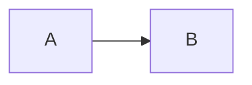

# NN – Topic
One sentence on what this is and why it exists.

> [!info] Exam TL;DR
> - point 1
> - point 2
> - point 3
> (the human rereads only this block in exam week)

## Concept (plain English)
3–6 lines, no jargon dumping.

## AWS console ↔ Terraform map
| Console action | Terraform resource / data source | Key arguments |
|---|---|---|
| Create X | `aws_x` | `name` |

## Architecture diagram

## Key facts, limits & pricing
- Limit / quota / free-tier note (verified — §13.9; mark unverifiable as `⚠️ verify:`)

## Comparisons
(Only if relevant — e.g. S3 storage classes, EBS volume types.)

## The Terraform I wrote
- Path: `../NN-name/main.tf`
- What was tricky: …

## Flashcards
*(Cards live here. Frontmatter `tags: [flashcards/<topic>]` makes the SR plugin scan them. Multi-line syntax: question, `?` on its own line, answer; blank line between cards. No blank line *inside* an answer or it ends the card early.)*

Question one?
?
Answer one.

Question two?
?
Answer two.

## Scenario MCQs
> [!question]- 1. Scenario in SAA-C03 BEST/MOST framing?
> **A.** option
> **B.** option
> **C.** option
> **D.** option
>
> **Answer: X.** One-line rationale; why the distractors are wrong.

## ⚠️ Traps & why the wrong answers are wrong   #trap
> [!warning] Trap — <name>
> Why a candidate picks the wrong option, and the reasoning that eliminates it.

## 🛠️ Recreate-from-memory drill
> [!example]- Recreate-from-memory drill
> Rebuild this topic's setup in Terraform from scratch, no peeking.
> > [!success]- Reference solution
> > Pointer to `../NN-name/main.tf`, or the HCL itself once verified.

## 🔴 My weak spots (this topic)   #weak-spot
- Specific things the human got wrong or was fuzzy on this session. The `#weak-spot` tag aggregates them vault-wide automatically.

## 🔗 Docs
- [AWS docs](https://docs.aws.amazon.com/)
- [Terraform registry](https://registry.terraform.io/providers/hashicorp/aws/latest/docs)
