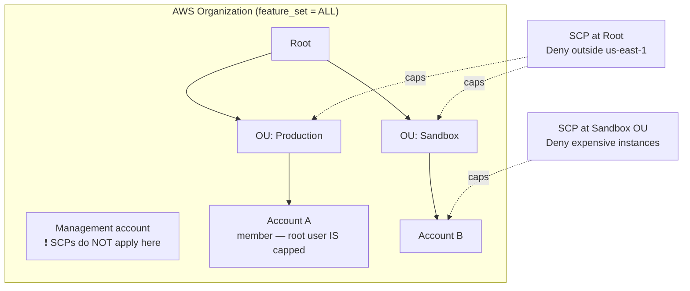
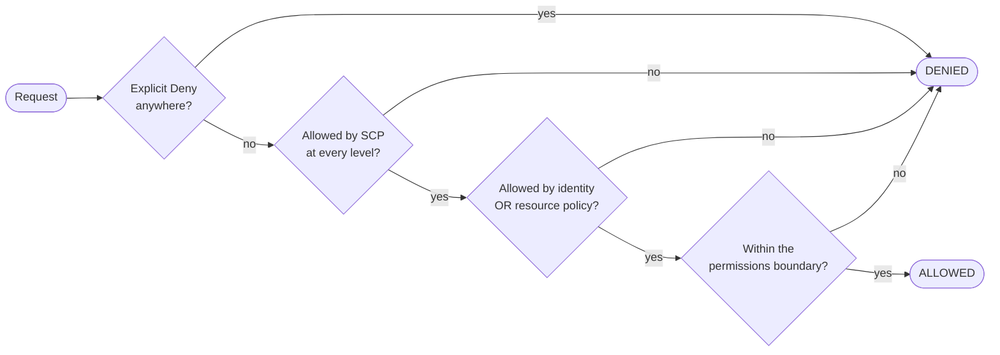

# Revision — 01b – IAM Advanced (Organizations, SCPs, boundaries, ABAC)

> [!abstract] Night-before read · ~11 min · self-contained
> Everything you need is here — no need to jump back mid-revision.
> Full teaching explanations, Terraform and diagrams: **[[01-iam-advanced]]**
> Ends with a **self-test** — close the doc and answer it before you sleep.
> *Generated by `_scripts/build_revision.py` — do not edit.*
## The shape of it

> [!info] Exam TL;DR
> - **An SCP never grants anything.** It sets a **ceiling**. Effective permissions = **intersection** of the SCP and the identity/resource policies. A user with no IAM policy still has no access, however permissive the SCP.
> - **SCPs do not affect the management account** — member accounts only. But they **do** cap the **root user of a member account**. That asymmetry is the single most tested SCP fact.
> - **An `Allow` must exist at *every* level** root → OU → account. A **`Deny` at *any* level** kills it for everything beneath. This is why **`FullAWSAccess`** is attached by default — remove it without replacing it and every action in that subtree fails.
> - SCPs require **all features enabled**; they don't exist in consolidated-billing-only mode.
> - **Permissions boundary** = a managed policy setting the max an **identity-based policy** can grant to **one user or role**. Also grants nothing. Effective = **intersection**.
> - **Combining rules:** identity + resource-based = **UNION**. identity + boundary = **INTERSECTION**. identity + SCP = **INTERSECTION**. **Explicit `Deny` anywhere wins, always.**
> - **ABAC** = access by **tags** — `aws:PrincipalTag/x` compared against `aws:ResourceTag/x`. Scales where RBAC needs a new policy per team.
> - **`aws:PrincipalOrgID`** lets one resource policy trust a whole organization without listing account IDs.
> - **MFA conditions must use `BoolIfExists`**, not `Bool` — the key is absent for long-term access keys, so plain `Bool` denies things you didn't mean to.

## Architecture diagram

## Key facts, limits & pricing

- **Organizations is free.** You pay only for what the member accounts use. Consolidated billing aggregates usage across accounts, which can earn **volume discounts** and lets **Reserved Instances / Savings Plans** be shared across the organization.
- **Two feature sets:** *All features* (default, and required for SCPs, RCPs and service integrations) and *Consolidated billing only* (billing aggregation, no policy control). Upgrading to all features requires every invited member account to accept.
- **One root per organization.** OU hierarchy can nest **five levels deep** below the root.
- The **management account cannot be changed** after the organization is created, and it is the payer. A member account belongs to **only one organization** at a time.
- **SCPs grant nothing.** AWS is explicit: *"No permissions are granted by an SCP."* A user with zero IAM policies has zero access no matter what the SCP allows.
- **`Allow` must be present at every level** from the root through each OU down to the account. Miss one and the permission is denied — SCP evaluation is deny-by-default.
- **`Deny` at any single level** applies to everything beneath it, overriding any `Allow` lower down.
- **`FullAWSAccess`** is auto-attached to every root, OU and account. Removing it without a replacement blocks **all** actions in that subtree.
- **SCPs don't restrict:** anything done by the **management account**, anything done via a **service-linked role**, registering for Enterprise Support as root, CloudFront trusted-signer functions, and configuring reverse DNS for Lightsail/EC2 as root.
- **SCPs don't reach outside the organization.** If your bucket policy grants access to an account that isn't in your org, your SCP does nothing about it — SCPs constrain *your* principals, not other people's.
- **Disabling the SCP policy type detaches every SCP** and those attachments are **not recoverable** — you must reattach manually.
- **Permissions boundaries apply to users and roles — not groups.** They use a managed policy and grant nothing on their own.
- **Implicit denies in a boundary don't limit resource-based policies.** If a Secrets Manager resource policy grants the user directly and the boundary merely fails to mention Secrets Manager, the access still works. An **explicit** `Deny` in the boundary *does* block it. (Same nuance applies to session policies.)
- **`aws:MultiFactorAuthPresent` is absent for long-term access keys.** Use **`BoolIfExists`**; a plain `Bool` test denies CLI access-key requests unintentionally.
- **`aws:SourceIp` is not present for requests through a VPC endpoint** — use `aws:VpcSourceIp` there, or the endpoint's own policy.
- **Control Tower is free itself**; you pay for what it provisions (CloudTrail, Config, S3 logging).

## Comparisons

### The four things that can cap a permission

|   | **SCP** | **RCP** | **Permissions boundary** | **Session policy** |
|---|---|---|---|---|
| Attached to | root / OU / account | root / OU / account | one IAM **user or role** | passed at `AssumeRole` |
| Limits | **principals** in member accounts | **resources** in member accounts | that one identity | that one session |
| Grants permissions? | **never** | **never** | **never** | **never** |
| Needs Organizations | ✅ (all features) | ✅ (all features) | ❌ | ❌ |
| Typical use | "no one may leave the org / use other regions" | "only our org's identities may touch our buckets" | "you may create users, but not admins" | temporary least-privilege on assume |

### How policy types combine

| Combination | Result |
|---|---|
| Identity-based **+ resource-based** | **UNION** — either one allowing is enough |
| Identity-based **+ permissions boundary** | **INTERSECTION** — both must allow |
| Identity-based **+ SCP / RCP** | **INTERSECTION** — both must allow |
| Identity **+ SCP + boundary** | all **three** must allow |
| **Explicit `Deny`** in any of them | **denied**, unconditionally |

*The union case is the odd one out — but it's a union **within one account**. A cross-account request is evaluated twice: the caller's identity policy **and** the bucket policy must both allow it.*

### RBAC vs ABAC

|   | RBAC (roles) | **ABAC (tags)** |
|---|---|---|
| How access is decided | which role you assumed | tags on **you** vs tags on the **resource** |
| Adding a new team | write a new policy + role | **nothing** — tag the people and the resources |
| Key condition keys | — | `aws:PrincipalTag/x`, `aws:ResourceTag/x`, `aws:RequestTag/x` |
| Exam trigger | "separate permissions per job function" | "**scales** as teams grow / avoid policy sprawl / permissions based on project or cost-centre **tags**" |

### Condition keys worth memorising

| Key | Matches | Use it for |
|---|---|---|
| `aws:PrincipalOrgID` | the caller's organization ID | trust a whole org in one resource policy, no account list |
| `aws:RequestedRegion` | region the request targets | data-residency / cost control ("only eu-west-1") |
| `aws:MultiFactorAuthPresent` | was MFA used | sensitive actions — **`BoolIfExists`** |
| `aws:PrincipalTag/x` / `aws:ResourceTag/x` | tags on caller / resource | ABAC |
| `aws:SourceIp` | caller's public IP | corporate-network-only (**not** via VPC endpoints) |
| `aws:PrincipalArn` | the caller's ARN | pin a specific role; prefer `ArnEquals`/`ArnLike` |
| `aws:SecureTransport` | HTTPS? | the TLS-only guardrail — see [[09-s3-security]] |

## Worked examples

> [!example] Worked example — "no resources outside eu-west-1, and nobody can turn off CloudTrail"
> A company must keep data in Ireland for GDPR. Doing this with IAM policies means trusting every account admin to write and keep them — one mistake and it's broken. Instead: enable **all features** in Organizations, and attach an SCP at the **root** with two `Deny` statements — one on `cloudtrail:StopLogging` and `cloudtrail:DeleteTrail`, one denying everything when `aws:RequestedRegion` is not `eu-west-1` (with a `NotAction` carve-out for global services like IAM, Route 53, CloudFront and Organizations, which are only reachable through `us-east-1`). Because a `Deny` at the root applies to every OU and account beneath it, an account admin holding `AdministratorAccess` still cannot launch in `us-east-2` or stop the trail. Keep `FullAWSAccess` attached alongside it — the Deny does the work; removing the Allow would block everything.

> [!example] Worked example — letting a junior admin create users, safely
> Maria wants Zhang to handle user onboarding without letting him mint an administrator. Three pieces: **(1)** a managed policy `XCompanyBoundaries` listing the maximum any new user may ever have; **(2)** Zhang's own permissions policy granting `iam:CreateUser` etc.; **(3)** the important one — Zhang's *own* permissions boundary allows `iam:CreateUser` only under the condition `StringEquals: {"iam:PermissionsBoundary": "<arn of XCompanyBoundaries>"}`, plus explicit `Deny` on editing or deleting boundary policies. Now if Zhang creates a user and forgets to attach the boundary, the call **fails with AccessDenied**. He physically cannot create a principal more powerful than the boundary he's forced to stamp on it. This "delegate administration without privilege escalation" scenario is the canonical exam use of permissions boundaries.

> [!failure] Failure mode — the deny-only SCP that locked out the whole organization
> A team wants to block S3 in the Sandbox OU, so they write an SCP containing **only** a `Deny` on `s3:*`, detach `FullAWSAccess`, and attach theirs. Every account under Sandbox immediately loses access to **everything** — not just S3. The cause is that SCP evaluation is **deny-by-default and requires an explicit `Allow` at every level**: with `FullAWSAccess` gone there is no `Allow` anywhere in the path, so nothing is permitted. The fix is to keep `FullAWSAccess` attached *and* add the Deny policy alongside it. The same trap in reverse: attaching an allow-list SCP at the **root** silently caps every OU beneath it, because the effective permission is the **intersection** down the path — a `FullAWSAccess` on the OU cannot widen what the root already narrowed.

## Traps

> [!warning] Trap — "attach an SCP to give that account access"
> SCPs **never grant**. If a question's correct-sounding answer is "create an SCP allowing the developers to use S3," it's wrong — you also need an IAM policy, and the SCP only ever removes. Any answer phrased as *"use an SCP to grant/enable/allow"* is a distractor.

> [!warning] Trap — root user and SCPs
> Both halves matter and they point opposite ways. The **management account** is immune to SCPs entirely — including its root user and every IAM principal in it. A **member account's root user is not immune** — it is capped like everyone else. That's exactly why AWS recommends keeping no workloads in the management account.

> [!warning] Trap — permissions boundary vs SCP
> Same idea, different blast radius. **SCP** = whole account(s), needs Organizations. **Boundary** = one user or role, works in a standalone account. If the scenario is a single account delegating admin duties → **boundary**. If it's "enforce across all accounts / prevent anyone in the org" → **SCP**.

> [!warning] Trap — `Bool` vs `BoolIfExists` for MFA
> `aws:MultiFactorAuthPresent` is **not present at all** for long-term access-key requests. A `Deny` on `Bool: {"aws:MultiFactorAuthPresent": "false"}` therefore does **not** fire for CLI access-key calls (the key is missing, not false), while an `Allow` gated on `Bool ... "true"` blocks them. Use `BoolIfExists` to get the behaviour you actually meant.

> [!warning] Trap — Control Tower vs Organizations
> **Organizations** is the primitive: accounts, OUs, SCPs. **Control Tower** *orchestrates* it — it builds a **landing zone** using Organizations + IAM Identity Center + Service Catalog, provides **Account Factory** for standardised account vending, and applies **controls/guardrails** (*preventive* — implemented as SCPs; *detective* — implemented as AWS Config rules; *proactive* — CloudFormation hooks), plus **drift detection**. "Set up a compliant multi-account environment quickly, following best practices" → **Control Tower**. "Apply a specific permission guardrail" → **SCP**.

> [!warning] Trap — `aws:SourceIp` behind a VPC endpoint
> The key is simply **absent** for requests that traverse a VPC endpoint, so an IP-allowlist policy silently fails closed for in-VPC traffic. Use `aws:VpcSourceIp`, or scope on `aws:SourceVpce` / `aws:SourceVpc` instead.

## 🔴 My weak spots (this topic)   #weak-spot

- [ ] **Never studied — the Udemy "IAM Advanced" section was skipped entirely** (realised 2026-08-30). This note was written to cover it; nothing here has been tested yet.
- [ ] **SCPs grant nothing** — the instinct to read a policy document as "granting" is strong and wrong.
- [ ] **The root-user asymmetry** — management account exempt, member-account root capped.
- [ ] **`Allow` needed at every level** vs `Deny` at any level.
- [ ] **Union vs intersection** — resource policies widen, boundaries and SCPs narrow.

## Also worth carrying

> [!warning] Build tier — **conceptual-only**
> Do **not** create an organization or attach SCPs in your learning account. An SCP mistake can lock you out of your own account, the management account can't be changed once set, and leaving an organization is deliberately awkward. This topic is learned from notes + the exam framing, not from `terraform apply`.

## Self-test

> [!question] Close the doc first.
> Reading a comparison and being able to *produce* it are different skills, and
> only the second one survives a question written to make two answers look alike.
> Say each answer out loud before you unfold it — if you can only recognise it,
> you do not know it yet.

### You have got these wrong before

*Your own recorded misses. Answer each one before unfolding it — these are, by definition, the ones that have already cost you marks.*

> [!question]- Never studied — the Udemy "IAM Advanced" section was skipped entirely
> (realised 2026-08-30). This note was written to cover it; nothing here has been tested yet.

> [!question]- SCPs grant nothing
> the instinct to read a policy document as "granting" is strong and wrong.

> [!question]- The root-user asymmetry
> management account exempt, member-account root capped.

> [!question]- `Allow` needed at every level
> vs `Deny` at any level.

> [!question]- Union vs intersection
> resource policies widen, boundaries and SCPs narrow.

**1. The four things that can cap a permission** — fill the blank cells from memory.

|   | **SCP** | **RCP** | **Permissions boundary** | **Session policy** |
|---|---|---|---|---|
| Attached to |   |   |   |   |
| Limits |   |   |   |   |
| Grants permissions? |   |   |   |   |
| Needs Organizations |   |   |   |   |
| Typical use |   |   |   |   |

> [!success]- Answer
> |   | **SCP** | **RCP** | **Permissions boundary** | **Session policy** |
> |---|---|---|---|---|
> | Attached to | root / OU / account | root / OU / account | one IAM **user or role** | passed at `AssumeRole` |
> | Limits | **principals** in member accounts | **resources** in member accounts | that one identity | that one session |
> | Grants permissions? | **never** | **never** | **never** | **never** |
> | Needs Organizations | ✅ (all features) | ✅ (all features) | ❌ | ❌ |
> | Typical use | "no one may leave the org / use other regions" | "only our org's identities may touch our buckets" | "you may create users, but not admins" | temporary least-privilege on assume |

**2. RBAC vs ABAC** — fill the blank cells from memory.

|   | RBAC (roles) | **ABAC (tags)** |
|---|---|---|
| How access is decided |   |   |
| Adding a new team |   |   |
| Key condition keys |   |   |
| Exam trigger |   |   |

> [!success]- Answer
> |   | RBAC (roles) | **ABAC (tags)** |
> |---|---|---|
> | How access is decided | which role you assumed | tags on **you** vs tags on the **resource** |
> | Adding a new team | write a new policy + role | **nothing** — tag the people and the resources |
> | Key condition keys | — | `aws:PrincipalTag/x`, `aws:ResourceTag/x`, `aws:RequestTag/x` |
> | Exam trigger | "separate permissions per job function" | "**scales** as teams grow / avoid policy sprawl / permissions based on project or cost-centre **tags**" |

**3. Condition keys worth memorising** — fill the blank cells from memory.

| Key | Matches | Use it for |
|---|---|---|
| `aws:PrincipalOrgID` |   |   |
| `aws:RequestedRegion` |   |   |
| `aws:MultiFactorAuthPresent` |   |   |
| `aws:PrincipalTag/x` / `aws:ResourceTag/x` |   |   |
| `aws:SourceIp` |   |   |
| `aws:PrincipalArn` |   |   |
| `aws:SecureTransport` |   |   |

> [!success]- Answer
> | Key | Matches | Use it for |
> |---|---|---|
> | `aws:PrincipalOrgID` | the caller's organization ID | trust a whole org in one resource policy, no account list |
> | `aws:RequestedRegion` | region the request targets | data-residency / cost control ("only eu-west-1") |
> | `aws:MultiFactorAuthPresent` | was MFA used | sensitive actions — **`BoolIfExists`** |
> | `aws:PrincipalTag/x` / `aws:ResourceTag/x` | tags on caller / resource | ABAC |
> | `aws:SourceIp` | caller's public IP | corporate-network-only (**not** via VPC endpoints) |
> | `aws:PrincipalArn` | the caller's ARN | pin a specific role; prefer `ArnEquals`/`ArnLike` |
> | `aws:SecureTransport` | HTTPS? | the TLS-only guardrail — see [[09-s3-security]] |

### The traps

*Each of these is a place a plausible-looking answer is wrong. Say why before unfolding.*

> [!question]- "attach an SCP to give that account access"
> SCPs **never grant**. If a question's correct-sounding answer is "create an SCP allowing the developers to use S3," it's wrong — you also need an IAM policy, and the SCP only ever removes. Any answer phrased as *"use an SCP to grant/enable/allow"* is a distractor.

> [!question]- root user and SCPs
> Both halves matter and they point opposite ways. The **management account** is immune to SCPs entirely — including its root user and every IAM principal in it. A **member account's root user is not immune** — it is capped like everyone else. That's exactly why AWS recommends keeping no workloads in the management account.

> [!question]- permissions boundary vs SCP
> Same idea, different blast radius. **SCP** = whole account(s), needs Organizations. **Boundary** = one user or role, works in a standalone account. If the scenario is a single account delegating admin duties → **boundary**. If it's "enforce across all accounts / prevent anyone in the org" → **SCP**.

> [!question]- `Bool` vs `BoolIfExists` for MFA
> `aws:MultiFactorAuthPresent` is **not present at all** for long-term access-key requests. A `Deny` on `Bool: {"aws:MultiFactorAuthPresent": "false"}` therefore does **not** fire for CLI access-key calls (the key is missing, not false), while an `Allow` gated on `Bool ... "true"` blocks them. Use `BoolIfExists` to get the behaviour you actually meant.

> [!question]- Control Tower vs Organizations
> **Organizations** is the primitive: accounts, OUs, SCPs. **Control Tower** *orchestrates* it — it builds a **landing zone** using Organizations + IAM Identity Center + Service Catalog, provides **Account Factory** for standardised account vending, and applies **controls/guardrails** (*preventive* — implemented as SCPs; *detective* — implemented as AWS Config rules; *proactive* — CloudFormation hooks), plus **drift detection**. "Set up a compliant multi-account environment quickly, following best practices" → **Control Tower**. "Apply a specific permission guardrail" → **SCP**.

> [!question]- `aws:SourceIp` behind a VPC endpoint
> The key is simply **absent** for requests that traverse a VPC endpoint, so an IP-allowlist policy silently fails closed for in-VPC traffic. Use `aws:VpcSourceIp`, or scope on `aws:SourceVpce` / `aws:SourceVpc` instead.

> [!question]- Build tier — **conceptual-only**
> Do **not** create an organization or attach SCPs in your learning account. An SCP mistake can lock you out of your own account, the management account can't be changed once set, and leaving an organization is deliberately awkward. This topic is learned from notes + the exam framing, not from `terraform apply`.

*Answers are lifted verbatim from [[01-iam-advanced]]. Generated by `_scripts/build_revision.py` — do not edit.*
