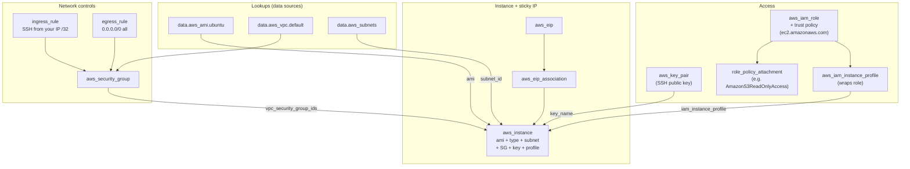

# Revision — 02 – EC2 (Elastic Compute Cloud)

> [!abstract] Night-before read · ~12 min · self-contained
> Everything you need is here — no need to jump back mid-revision.
> Full teaching explanations, Terraform and diagrams: **[[02-ec2]]**
> *Generated by `_scripts/build_revision.py` — do not edit.*
## The shape of it

> [!info] Exam TL;DR
> - **An EC2 instance is composed of**: AMI (template), instance type (CPU/memory/network sizing), **subnet** (determines VPC + AZ), security group(s), key pair (SSH), EBS volumes (storage), optional user data (boot script), optional IAM instance profile (AWS API access), tags. The console wizard mirrors exactly this.
> - **AMI is region-scoped.** `ami-…` IDs are unique to one region — `aws ec2 copy-image` to move. Don't hardcode in Terraform; use `data "aws_ami"` to look up the latest matching for the current region.
> - **Stop ≠ Terminate.** Stop preserves EBS, instance ID, private IP, AMI ID, EIP; releases auto-assigned public IP and instance store. Terminate destroys the instance and any `delete_on_termination=true` volumes. **Root volume default `true`; additional EBS volumes default `false`** — asymmetric, exam-frequent.
> - **EBS = network-attached, persistent, AZ-scoped.** Instance Store = local NVMe, ephemeral. Both lose instance store data on stop or terminate.
> - **EC2 → other AWS APIs**: NEVER long-lived IAM user keys. Use IAM **role** wrapped in **instance profile** attached to the instance (see [[01-iam]]). EC2 takes an *instance profile*, not a role directly (unlike Lambda/ECS which take roles).
> - **IMDSv2 is default** on modern AMIs. Plain `curl http://169.254.169.254/...` returns empty — you must PUT to `/latest/api/token` first and pass the token in an `X-aws-ec2-metadata-token` header on subsequent GETs. SSRF defence.
> - **Public IPv4 is billed** since Feb 2024 (~$0.005/hour for both auto-assigned and EIPs, regardless of attachment state). The legacy "EIP free while attached" rule no longer holds.

## Architecture diagram

## Key facts, limits & pricing

- **Regional service, but every instance lives in one AZ.** You pick a subnet → that determines VPC + AZ. Cannot stop/start to move AZ; only snapshot + relaunch in target AZ.
- **AMI region-scoped.** Unique `ami-…` per region. Copy with `aws ec2 copy-image` (snapshot storage + cross-region transfer charges).
- **AMI = metadata + reference to EBS snapshots** for modern EBS-backed AMIs. Snapshots hold the disk data; AMI bundles them with kernel/architecture/virtualization-type metadata to make them launchable.
- **Billing:**
  - **On-Demand Linux** — per-second after 60-second minimum. Windows + some Linux AMIs are per-hour.
  - **t2.micro / t3.micro** — Free Tier (750 hrs/month, 12 months from account creation); standard rate after.
  - **Public IPv4** — since **Feb 2024**, all IPv4 public addresses cost ~$0.005/hour. Old "EIP free while attached" rule no longer applies.
  - **EBS** — `gp3` ~$0.08/GB-month in `us-east-1`; ⚠️ verify current pricing.
- **`delete_on_termination` defaults differ by volume role:**
  - **Root volume** → `true` (deleted with instance).
  - **Additional EBS volume** → `false` (survives termination).
- **Instance type change** = **in-place** (`~`) in Terraform. Provider stops, modifies, restarts the instance. ~1–3 min downtime; instance ID, EBS, EIP preserved; auto-assigned public IP changes; instance store dies.
- **AMI change** = **destroy-and-recreate** (`-/+`). You can't swap the OS image on a running instance. ⚠️ verify against provider source for v6 — confirmed empirically in past plans.
- **Instance type naming:** `family.size` with a **literal period** (`t3.micro`, `t3.small`, `m5.large`). Families: `t` (burstable), `m` (general), `c` (compute), `r` (memory), `g`/`p` (GPU), `i` (storage). Generations: `t3`, `t3a` (AMD), `t4g` (Graviton/ARM). Hyphens (`t3-micro`) are rejected.
- **IMDS endpoint** is the link-local `169.254.169.254`, reachable only from inside the instance.

## Comparisons

### Stop vs Terminate

|   | Stop | Terminate |
|---|---|---|
| EBS root volume | Preserved | Deleted (default `delete_on_termination=true`) |
| Additional EBS volumes | Preserved | Preserved (default `delete_on_termination=false`) |
| Instance store data | **Lost** | **Lost** |
| Instance ID | Preserved | Released, can never be reused |
| Private IP | Preserved | Released |
| Auto-assigned public IP | **Released** | Released |
| Elastic IP (if associated) | Stays associated | Disassociated; EIP retained in your account |
| AMI ID metadata | Preserved | Preserved |
| Physical host | May change on start | N/A |
| Billing | Compute stops; EBS still bills | Stops entirely |

### EBS vs Instance Store

|   | EBS | Instance Store |
|---|---|---|
| Persistence | Yes — across stop/start (and terminate, if not `delete_on_termination`) | Ephemeral — lost on stop/terminate/host failure |
| Attachment | Network-attached, can detach/reattach | Physically on the host's local SSDs |
| Scope | AZ-scoped (cross-AZ move = snapshot + restore) | Host-scoped |
| Performance | Up to ~256K IOPS (`io2 Block Express`) | Very high local NVMe; usually faster than non-provisioned EBS |
| Cost | Per-GB-month + provisioned IOPS where applicable | Free with the instance |
| Multi-attach | `io1`/`io2` only, up to 16 instances, same AZ | Single-host by definition |
| Snapshots | Yes (point-in-time, to S3) | No — manually copy elsewhere |
| Use case | Anything you need to keep | Scratch, cache, big-data shuffle, swap |

### Auto-assigned Public IP vs Elastic IP

|   | Auto-assigned | Elastic IP |
|---|---|---|
| Source | AWS public IPv4 pool | Allocated to your account |
| Sticky across stop/start | **No** — released and reassigned | **Yes** |
| Default availability | Only if subnet has `map_public_ip_on_launch = true` (default VPC's public subnets do) | You allocate explicitly |
| Limit | None (one per public-subnet instance) | Soft 5 per region; raisable |
| Cost | ~$0.005/hour (since Feb 2024) | ~$0.005/hour, same |
| Move to another instance | No | Yes — disassociate + re-associate |
| Protocol | IPv4 only | IPv4 only (no IPv6 equivalent — addresses abundant) |

### IMDSv1 vs IMDSv2

|   | IMDSv1 | IMDSv2 |
|---|---|---|
| Request style | `GET http://169.254.169.254/…` directly | `PUT /latest/api/token` first → `GET` with `X-aws-ec2-metadata-token: <token>` header |
| Default on new AMIs | Was default until ~2023 | **Default required** on modern AMIs (Ubuntu 24.04 noble, recent AL2023, etc.) |
| Security model | Trusts anyone on the host | Session token; mitigates SSRF — an attacker who tricks your app into hitting `169.254.169.254` can't get the token because the PUT has to come from inside the SSRF-vulnerable process AND the response token has TTL+IP-tied semantics |
| If you forget the token | — | Endpoint returns empty / 401 silently |
| Get the token | — | `curl -s -X PUT "http://169.254.169.254/latest/api/token" -H "X-aws-ec2-metadata-token-ttl-seconds: 21600"` |

## Worked examples

> [!example] Worked example — a t3 instance under real load (CPU credit mechanics)
> A small API runs on `t3.micro` (2 vCPUs). Verified mechanics: it earns **12 CPU credits/hour**, its baseline is **10% per vCPU**, and it can bank at most **288 credits** (24h of earnings). Overnight the API idles and banks credits; the 9 a.m. traffic spike spends them bursting both vCPUs to 100%. That's the T family working as designed — burst capacity at a fraction of `m`-family price.
> Sizing rule: T family fits **bursty** workloads (web/API with idle periods, dev boxes, cron runners). If *sustained* CPU exceeds baseline, T is the wrong family — move to `m` (general) or `c` (compute) with fixed CPU. Decide by watching `CPUCreditBalance` in CloudWatch for a week.

> [!failure] Failure mode — credit exhaustion (it bites two different ways)
> **Standard mode:** sustained load drains the bank to zero → the instance is pinned at baseline (a `t3.micro` shows ~10% CPU in CloudWatch and won't go higher). Symptoms: latency explodes, health checks flap, and the box "mysteriously" refuses to use the CPU you're paying for. Signature: `CPUCreditBalance` flatlined at 0 while users report a slow app.
> **Unlimited mode — and this is the T3 default:** no throttle ever. Instead the instance spends *surplus* credits, and if its average CPU over a rolling 24h exceeds baseline, AWS bills the overage at a flat additional rate per vCPU-hour. Symptoms: nothing — the app stays fast and the bill quietly grows. Many teams discover their "cheap" t3 fleet was billing surplus charges for months only when someone audits Cost Explorer.
> Fix either way: right-size to `m`/`c` for sustained load, or consciously keep unlimited mode and alarm on the surplus-credit metrics. The CloudWatch metrics to watch (verified): `CPUCreditBalance` (accrued, flatlines at 0 when throttled in standard mode), `CPUSurplusCreditBalance` (surplus spent while balance is 0, unlimited only), and `CPUSurplusCreditsCharged` (surplus that exceeded the 24h earn cap and is being **billed** — alarm on this one).

> [!example] Worked example — moving a stateful workload to another AZ
> A reporting app with a 200 GB EBS data volume lives in `us-east-1a`; the team needs it in `us-east-1b` (AZ consolidation, or recovering from an AZ-level event). EBS is **AZ-scoped** — detach-in-1a/attach-in-1b is impossible. The move: **snapshot** the volume (snapshots are *region*-scoped) → create a new volume *from the snapshot* in `1b` → launch the instance in a `1b` subnet and attach. In production the snapshot half is pre-automated with **Amazon Data Lifecycle Manager (DLM)** schedules, so a recent snapshot already exists the day you need it. Note the exam echo: managed services (e.g. RDS Multi-AZ) exist precisely so you don't hand-roll this dance — "run the database on EC2 and snapshot it yourself" is usually the distractor, not the answer.

## Scenario MCQs

> [!question]- 1. An EC2 instance with an attached EBS data volume (default `delete_on_termination=false`) is terminated. What happens to the data volume?
> **A.** Deleted along with the instance.
> **B.** Deleted only if the root volume's `delete_on_termination` is also false.
> **C.** Survives — sits in the account with storage charges, detachable to another instance in the same AZ.
> **D.** Moves automatically to S3 as a snapshot.
>
> **Answer: C.** Additional EBS volumes default `delete_on_termination=false`. The root volume defaults to `true` and goes with the instance. Asymmetric defaults are exam-frequent.

> [!question]- 2. You need to give an EC2 instance read-only access to S3. Which is the MOST secure approach?
> **A.** SSH in, run `aws configure`, paste an IAM user's access keys.
> **B.** Create an IAM role with `s3:Get*`/`s3:List*` + trust policy allowing `ec2.amazonaws.com`; wrap in an instance profile; attach to the instance.
> **C.** Add an SG ingress rule allowing the S3 service endpoint as source.
> **D.** Allow `0.0.0.0/0` egress on port 443 from the instance.
>
> **Answer: B.** Long-lived keys (A) are the anti-pattern. SGs are network firewall, not IAM (C). D is unrelated. The role + instance profile pattern gets the SDK temporary credentials via IMDSv2 — auto-rotating, no secrets on disk.

> [!question]- 3. You want to give your EC2 web server a fixed public IP so DNS records and external firewalls don't break when the instance restarts. Which is the BEST approach?
> **A.** Use an auto-assigned public IP and document the IP.
> **B.** Allocate an Elastic IP and associate it with the instance.
> **C.** Move the instance to a private subnet and add a NAT gateway.
> **D.** Place an ALB in front and use the ALB's DNS name.
>
> **Answer: B** is the direct answer. **D** is a superior real-world pattern for web traffic (ALB DNS is sticky, the backends can scale), but the question asks about giving *the EC2 instance itself* a fixed IP. A fails on stop/start. C is wrong (private subnets have no public IP at all). For SAA-C03, "fixed IP for a single instance" → EIP.

> [!question]- 4. You change `instance_type` from `t3.micro` to `t3.small` in `main.tf` and apply. What happens?
> **A.** Terraform destroys and recreates the instance.
> **B.** Terraform calls `StopInstance` → `ModifyInstanceAttribute` → `StartInstance`. Instance ID, EBS, EIP preserved; ~1–3 min downtime.
> **C.** Terraform fails — instance type is immutable.
> **D.** Terraform succeeds with no disruption.
>
> **Answer: B.** In-place update (`~`). Instance type is NOT `ForceNew` in the v6 provider — uses the AWS modify-instance API. But there IS user-visible disruption (stop+start). Auto-assigned public IP would change too (yours doesn't because EIP). Instance store data dies.

> [!question]- 5. You SSH into your fresh Ubuntu 24.04 EC2 instance, run `curl http://169.254.169.254/latest/meta-data/iam/info`, and it returns nothing. The instance profile IS attached. What's wrong?
> **A.** The instance has no internet access.
> **B.** IMDSv2 is required and you didn't get a session token first.
> **C.** IAM permissions denied the request.
> **D.** The role hasn't propagated yet.
>
> **Answer: B.** Modern AMIs default to IMDSv2 required. You need a PUT to `/latest/api/token` first, then GET with the `X-aws-ec2-metadata-token` header. With `curl -s`, IMDSv1-style requests fail silently. D is plausible (IAM propagation IS real) but the symptom — empty silent return — is the IMDSv2 signature.

## ⚠️ Traps & why the wrong answers are wrong   #trap

> [!warning] Trap — All EC2 attributes can be changed in-place
> No — `ami` forces replacement, `subnet_id` forces replacement (subnet determines AZ), most network-affecting attributes force replacement. Type, key name, security groups (mostly), and IAM profile are in-place. Always read the plan.

> [!warning] Trap — `ip_protocol` accepts `"ssh"` / `"http"`
> No — IP-layer protocols only: `tcp`/`udp`/`icmp`/`icmpv6`/`-1`. Application-layer names are friendly console labels, not API inputs.

> [!warning] Trap — `t3-micro` works
> No — AWS instance types are `family.size` with a literal dot. Hyphens get rejected at apply.

> [!warning] Trap — `aws_subnets.X.id` returns one subnet ID
> No — that data source returns a list under `.ids`. There is no singular `.id` on the plural resource.

> [!warning] Trap — IAM changes are instant
> Often near-instant, but eventually consistent — newly created roles can briefly fail to be assumed (propagation race). Retry-with-backoff is the answer. See [[01-iam]].

> [!warning] Trap — EBS volumes can be moved across AZs by detach + attach
> No — EBS is AZ-scoped. Cross-AZ requires snapshot → restore in target AZ.

> [!warning] Trap — Instance store survives stop
> No — instance store dies on stop AND terminate. EBS is what survives.

> [!warning] Trap — Long-lived access keys on an instance are fine for service-to-service
> Don't. Use an IAM role + instance profile. Long-lived keys in env files / user data are an audit and leak risk.

> [!warning] Trap — EIP is free while attached
> Was true pre-Feb 2024. Now every public IPv4 (auto-assigned and EIP) bills hourly regardless of attachment state.
