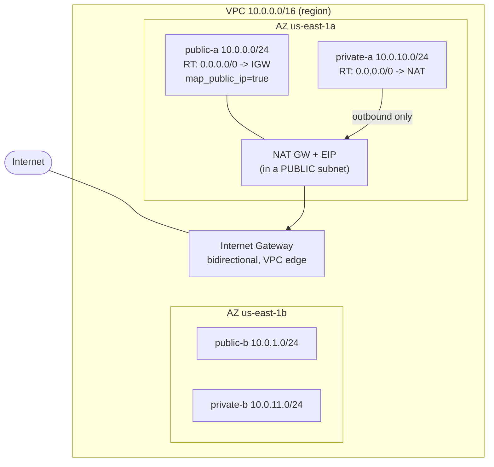

# Revision — 05.1 – VPC Core (subnets, routing, IGW, NAT)

> [!abstract] Night-before read · ~6 min · self-contained
> Everything you need is here — no need to jump back mid-revision.
> Full teaching explanations, Terraform and diagrams: **[[05-vpc-core]]**
> Ends with a **self-test** — close the doc and answer it before you sleep.
> *Generated by `_scripts/build_revision.py` — do not edit.*
## The shape of it

> [!info] Exam TL;DR
> - A **subnet is public** iff **(1)** its route table has `0.0.0.0/0 → Internet Gateway` **and (2)** instances get a public IP (`map_public_ip_on_launch` or an EIP). Miss either and it's effectively private. There is no "public" checkbox.
> - **Route tables decide public vs private**, not the subnet itself. Any subnet not explicitly associated uses the VPC's **main route table**.
> - **IGW = bidirectional**, sits at the VPC edge, one per VPC. **NAT = outbound-only** for private subnets, lives *in a public subnet*, needs an EIP.
> - Creating a VPC auto-creates **3 defaults**: main route table, default NACL (allow-all), default SG (self-referencing). A **new custom** NACL denies all; a **new custom** SG denies inbound — opposite of the defaults.
> - Subnets are **AZ-scoped**; a VPC spans a region. AWS reserves **5 IPs per subnet** (first 4 + last 1).
> - **NAT gateway** = managed, AZ-scoped, one-per-AZ for HA, no SG. **NAT instance** = legacy EC2, needs source/dest-check off, has an SG, can double as a bastion.

## Architecture diagram

## Key facts, limits & pricing

- **A subnet lives in exactly one AZ.** A VPC spans all AZs in its region. To be multi-AZ you create one subnet per AZ (that's why we build public-a/public-b, private-a/private-b).
- **The two conditions for "public"** (both required): route to IGW **and** a public IP on the instance. A subnet with an IGW route but no public IP, or a public IP but no IGW route, can't be reached from the internet.
- **AWS reserves 5 IP addresses in every subnet**: network address (`.0`), VPC router (`.1`), DNS (`.2`), future use (`.3`), and broadcast (`.255`, last). So a `/24` gives 251 usable, not 256. (Exam-frequent.)
- **VPC CIDR** must be `/16`–`/28`. CIDR blocks can't overlap if you plan to peer VPCs later.
- **Every new VPC gets 3 freebies**: a **main route table**, a **default NACL** (allow-all in/out), and a **default security group** (self-referencing inbound + allow-all outbound). Terraform ignores these unless you adopt them with the `aws_default_*` resources. **Best practice: never add an IGW route to the main route table** — so a subnet you forget to associate fails *closed* (private), not open.
- **IGW**: horizontally scaled, redundant, no bandwidth limit, one per VPC, free (you pay for the data transfer, not the IGW). Bidirectional.
- **NAT gateway**: managed, **5 Gbps scaling automatically to 100 Gbps**, redundant **within one AZ** but **AZ-scoped** — for real HA you deploy **one NAT gateway per AZ** and point each private subnet's RT at the NAT in its own AZ (else an AZ failure cuts egress, and cross-AZ NAT traffic is billed). Has **no security group**. Needs an EIP. Bills **~$0.045/hr + per-GB data processed** — ⚠️ check current pricing. Outbound-only; drops unsolicited inbound.
- **Egress-only Internet Gateway (`aws_egress_only_internet_gateway`)**: the **IPv6** equivalent of a NAT gateway — outbound-only internet for IPv6 (IPv6 is globally routable, so you can't use NAT; you use this instead). IPv4 has no analog need because private IPv4 isn't routable.

## Comparisons

### NAT Gateway vs NAT Instance

|   | NAT Gateway | NAT Instance (legacy) |
|---|---|---|
| Managed by | AWS | You (it's an EC2 instance) |
| HA | Redundant within an AZ; 1 per AZ for cross-AZ HA | Manual (script failover / ASG) |
| Bandwidth | Scales automatically | Bounded by instance type |
| Security group | **None** (can't attach) | Yes (it's an EC2 instance) |
| Source/dest check | N/A | **Must be disabled** |
| Bastion / port-forward | No | Yes (can double as bastion) |
| Maintenance/patching | AWS | You |
| Cost | Hourly + data processing | EC2 hourly (+ can be smaller/cheaper) |

Exam default: **NAT gateway** unless the question emphasizes cost-at-tiny-scale or needing the NAT box to also be a bastion → NAT instance.

### IGW vs NAT Gateway vs Egress-only IGW

|   | IGW | NAT Gateway | Egress-only IGW |
|---|---|---|---|
| Protocol | IPv4 + IPv6 | IPv4 (+ IPv6→IPv4 via NAT64/DNS64) | IPv6 |
| Direction | Bidirectional | Outbound only | Outbound only |
| Lives | VPC edge | In a public subnet | VPC edge |
| For | public subnets | private subnets (IPv4) | private IPv6 egress |

## Worked examples

> [!example] Worked example — the three-tier web app network
> A classic layout your [[04-alb-asg]] stack belongs in: **public subnets** (2 AZs) hold the internet-facing ALB and a bastion; **private "app" subnets** (2 AZs) hold the ASG instances (reachable only from the ALB's SG); **private "data" subnets** (2 AZs) hold RDS (reachable only from the app SG). Only the ALB has a public path in; instances pull updates *out* via a **per-AZ NAT gateway**; the database has no internet route at all. Every tier is one route-table decision. This is the canonical SAA-C03 diagram — memorize the shape.

> [!failure] Failure mode — NAT gateway in the wrong subnet (the routing loop)
> Placing the NAT gateway in a **private** subnet (or pointing the private RT's default route at a NAT that lives in that same private subnet) creates a loop: the NAT's own egress follows `0.0.0.0/0 → itself`, never reaching the IGW. AWS **creates it without error**, so there's no failure message — private instances just silently have no internet, and you burn an hour debugging "why can't my instance apt-install." Fix: the NAT gateway must sit in a **public** subnet (one whose RT routes to the IGW); the private RT points *at* the NAT, the NAT's own subnet points at the IGW. (Hit live while building this topic.)

> [!failure] Failure mode — single NAT gateway as an AZ SPOF
> Deploying one NAT gateway and routing *all* private subnets (across AZs) through it saves money but makes that AZ a single point of failure: if the NAT's AZ goes down, every private subnet in every AZ loses egress, and in normal operation cross-AZ traffic to the NAT is billed. Production fix: **one NAT gateway per AZ**, each AZ's private RT → its local NAT. Cost vs resilience tradeoff the exam probes.

## Also worth carrying

> [!warning] Trap — "the default NACL and a new NACL behave the same"
> Opposite. The **default** NACL allows all traffic both ways; a **custom** NACL you create **denies all** until you add numbered rules. Same flip exists for the default vs custom SG. Getting the direction of the default wrong is a classic distractor.

> [!warning] Trap — "add the IGW route to the main route table to make setup simpler"
> Never. That makes every unassociated subnet public by default — a subnet you forget to wire becomes internet-exposed. Keep custom route tables and explicit associations so forgotten subnets fail closed.

## Self-test

> [!question] Close the doc first.
> Reading a comparison and being able to *produce* it are different skills, and
> only the second one survives a question written to make two answers look alike.
> Say each answer out loud before you unfold it — if you can only recognise it,
> you do not know it yet.

**1. NAT Gateway vs NAT Instance** — fill the blank cells from memory.

|   | NAT Gateway | NAT Instance (legacy) |
|---|---|---|
| Managed by |   |   |
| HA |   |   |
| Bandwidth |   |   |
| Security group |   |   |
| Source/dest check |   |   |
| Bastion / port-forward |   |   |
| Maintenance/patching |   |   |
| Cost |   |   |

> [!success]- Answer
> |   | NAT Gateway | NAT Instance (legacy) |
> |---|---|---|
> | Managed by | AWS | You (it's an EC2 instance) |
> | HA | Redundant within an AZ; 1 per AZ for cross-AZ HA | Manual (script failover / ASG) |
> | Bandwidth | Scales automatically | Bounded by instance type |
> | Security group | **None** (can't attach) | Yes (it's an EC2 instance) |
> | Source/dest check | N/A | **Must be disabled** |
> | Bastion / port-forward | No | Yes (can double as bastion) |
> | Maintenance/patching | AWS | You |
> | Cost | Hourly + data processing | EC2 hourly (+ can be smaller/cheaper) |

**2. IGW vs NAT Gateway vs Egress-only IGW** — fill the blank cells from memory.

|   | IGW | NAT Gateway | Egress-only IGW |
|---|---|---|---|
| Protocol |   |   |   |
| Direction |   |   |   |
| Lives |   |   |   |
| For |   |   |   |

> [!success]- Answer
> |   | IGW | NAT Gateway | Egress-only IGW |
> |---|---|---|---|
> | Protocol | IPv4 + IPv6 | IPv4 (+ IPv6→IPv4 via NAT64/DNS64) | IPv6 |
> | Direction | Bidirectional | Outbound only | Outbound only |
> | Lives | VPC edge | In a public subnet | VPC edge |
> | For | public subnets | private subnets (IPv4) | private IPv6 egress |

### The traps

*Each of these is a place a plausible-looking answer is wrong. Say why before unfolding.*

> [!question]- "the default NACL and a new NACL behave the same"
> Opposite. The **default** NACL allows all traffic both ways; a **custom** NACL you create **denies all** until you add numbered rules. Same flip exists for the default vs custom SG. Getting the direction of the default wrong is a classic distractor.

> [!question]- "add the IGW route to the main route table to make setup simpler"
> Never. That makes every unassociated subnet public by default — a subnet you forget to wire becomes internet-exposed. Keep custom route tables and explicit associations so forgotten subnets fail closed.

*Answers are lifted verbatim from [[05-vpc-core]]. Generated by `_scripts/build_revision.py` — do not edit.*
