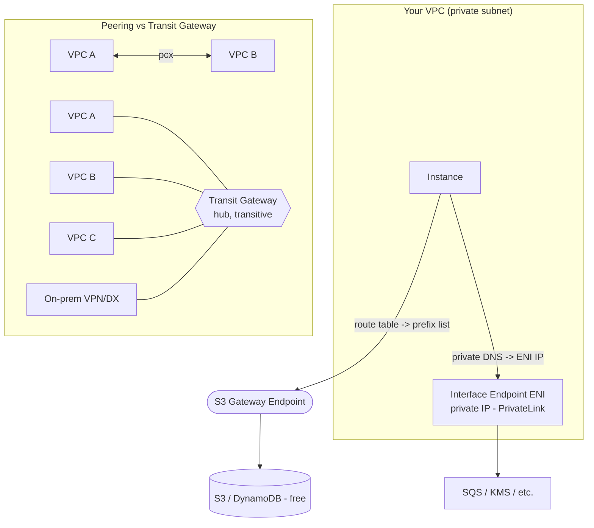

# Revision — 05.3 – VPC Endpoints & Peering (+ Transit Gateway)

> [!abstract] Night-before read · ~5 min · self-contained
> Everything you need is here — no need to jump back mid-revision.
> Full teaching explanations, Terraform and diagrams: **[[05-vpc-endpoints-peering]]**
> Ends with a **self-test** — close the doc and answer it before you sleep.
> *Generated by `_scripts/build_revision.py` — do not edit.*
## The shape of it

> [!info] Exam TL;DR
> - **Gateway endpoint** = a **route-table** entry for **S3 & DynamoDB only**, **free**. Lets a fully-private subnet reach S3/DynamoDB with no NAT/IGW.
> - **Interface endpoint** = an **ENI with a private IP** in your subnet, powered by **PrivateLink**, for **almost every other service**, **~$0.01/hr/AZ + data**. Reachable over peering/VPN/DX (gateway endpoints are **not**).
> - **VPC peering** = private 1-to-1 link between two VPCs. **Non-transitive** (A–B + B–C ≠ A–C) and **no overlapping CIDRs**. Cross-account & cross-region OK. Update route tables **on both sides**.
> - **Full mesh of N VPCs = N(N-1)/2 peerings** → explodes. **Transit Gateway** = hub-and-spoke: each VPC gets **one attachment**, connectivity is **transitive**, and on-prem (VPN/DX) attaches to the same hub. Scales to thousands.
> - Decision: **S3/DynamoDB privately → gateway endpoint (free)**; other service → interface endpoint; **2 VPCs → peering**; **many VPCs / hybrid at scale → Transit Gateway**.

## Architecture diagram

## Key facts, limits & pricing

- **Gateway endpoints: S3 and DynamoDB only. Free.** Route-table based (a prefix-list route `pl-xxxx → vpce-xxxx`). **Cannot** be accessed from a peered VPC, VPN, or Direct Connect — only from within the same VPC.
- **Interface endpoints (PrivateLink):** an **ENI with a private IP** in each chosen subnet, for most AWS services + partner/your-own services. **Reachable across peering / VPN / Direct Connect** (unlike gateway). Uses **private DNS** so the normal service hostname resolves to the ENI. ~**$0.01/hr per endpoint per AZ + ~$0.01/GB** — ⚠️ check current pricing. Secured by a **security group**.
- **Endpoint policies:** both types support a resource-style policy to restrict which resources/actions the endpoint allows (default = full access).
- **VPC peering:** private, uses AWS backbone, **cross-account and cross-region** supported. Limits: **non-transitive**, **no overlapping CIDRs**, **no edge-to-edge routing** (you can't use a peer's IGW, NAT, VPN, or endpoints through the peering). Both route tables must be updated.
- **Mesh math:** a full mesh of N VPCs needs **N(N-1)/2** peering connections (5→10, 6→15, 10→45). O(N²).
- **Transit Gateway:** regional hub; each VPC/VPN/DX = **one attachment**; connectivity is **transitive**; supports **TGW route tables** for segmentation and **inter-region TGW peering**. Scales to thousands of attachments. Costs: **per-attachment/hour + per-GB data**. Overkill for 2–3 VPCs; the answer for many/at-scale/hybrid.

## Comparisons

### Gateway vs Interface endpoint

|   | Gateway endpoint | Interface endpoint |
|---|---|---|
| Mechanism | Route-table prefix-list route | ENI with private IP (PrivateLink) |
| Services | **S3, DynamoDB only** | Most AWS services + partner/custom |
| Cost | **Free** | ~$0.01/hr/AZ + data |
| Cross VPC/VPN/DX access | **No** | **Yes** |
| DNS | (route-based, no DNS change) | Private DNS → ENI IP |
| Secured by | Endpoint policy | Endpoint policy **+ security group** |

### VPC Peering vs Transit Gateway

|   | VPC Peering | Transit Gateway |
|---|---|---|
| Topology | 1-to-1 point-to-point | Hub-and-spoke |
| Transitive? | **No** | **Yes** |
| Connections for N VPCs | **N(N-1)/2** (mesh) | **N** attachments |
| On-prem (VPN/DX) | Not through peering | Attaches to the hub |
| Cost | Free (pay data) | Per-attachment/hr + data |
| Use when | 2 (few) VPCs, simple | Many VPCs / hybrid / at scale |

## Worked examples

> [!example] Worked example — a fully-private subnet that still reaches S3 (no NAT bill)
> A batch worker in a private subnet reads/writes objects to S3 all day. The naive setup routes it through a **NAT gateway** — which bills hourly *and* per-GB, and the per-GB S3 traffic can dwarf the hourly cost. Swap in an **S3 gateway endpoint**: add it to the private route table, and S3-bound traffic now goes straight over the AWS backbone via the injected prefix-list route — **free**, and you can delete the NAT gateway entirely if S3 was its only reason to exist. This is a top real-world **cost-optimization** win and a common exam answer ("reduce data-transfer cost for S3 access from private instances → gateway endpoint").

> [!failure] Failure mode — assuming peering is transitive (the hub that isn't)
> You peer a central "shared services" VPC to VPC-A and to VPC-B, expecting A and B to talk *through* the shared VPC. They can't — **peering is non-transitive**, so A↔shared and B↔shared give you **nothing** between A and B. Teams discover this when A's traffic to B silently blackholes despite "everything being peered." Fixes: peer A↔B directly (another connection — and the mesh grows), or replace the whole thing with a **Transit Gateway** where transitivity is built in. This non-transitivity is *the* reason TGW exists and a guaranteed exam distractor.

> [!example] Worked example — 4 VPCs today, 12 next quarter → Transit Gateway
> A company has 4 VPCs (prod/staging/dev/shared) fully peered: N(N-1)/2 = **6** connections, each with routes on both sides. Manageable. Then acquisitions push it toward 12 VPCs → **66** peering connections and a route-table nightmare. Migrating to a **Transit Gateway** collapses it to **12 attachments** (one per VPC), gives transitive any-to-any (or segmented via TGW route tables), and lets the on-prem Direct Connect attach to the same hub. The trigger phrase — "growing number of VPCs, simplify connectivity, connect on-prem" — is always TGW.

## Also worth carrying

> [!warning] Trap — "use a gateway endpoint for SQS/KMS/etc."
> Gateway endpoints only exist for **S3 and DynamoDB**. Every other service uses an **interface endpoint (PrivateLink)**. "Private access to SQS/KMS/Secrets Manager" → interface endpoint, not gateway.

> [!warning] Trap — "reach the S3 gateway endpoint from a peered VPC / on-prem"
> No. Gateway endpoints work **only within the same VPC**. If you need S3 access from a peered VPC or over VPN/DX, you use an **interface endpoint** (which *is* reachable across those).

> [!warning] Trap — "peering scales fine, just add connections"
> Full mesh is **N(N-1)/2** and non-transitive — it explodes past a few VPCs. The intended answer for "many VPCs" is **Transit Gateway**, not more peerings.

## Self-test

> [!question] Close the doc first.
> Reading a comparison and being able to *produce* it are different skills, and
> only the second one survives a question written to make two answers look alike.
> Say each answer out loud before you unfold it — if you can only recognise it,
> you do not know it yet.

**1. Gateway vs Interface endpoint** — fill the blank cells from memory.

|   | Gateway endpoint | Interface endpoint |
|---|---|---|
| Mechanism |   |   |
| Services |   |   |
| Cost |   |   |
| Cross VPC/VPN/DX access |   |   |
| DNS |   |   |
| Secured by |   |   |

> [!success]- Answer
> |   | Gateway endpoint | Interface endpoint |
> |---|---|---|
> | Mechanism | Route-table prefix-list route | ENI with private IP (PrivateLink) |
> | Services | **S3, DynamoDB only** | Most AWS services + partner/custom |
> | Cost | **Free** | ~$0.01/hr/AZ + data |
> | Cross VPC/VPN/DX access | **No** | **Yes** |
> | DNS | (route-based, no DNS change) | Private DNS → ENI IP |
> | Secured by | Endpoint policy | Endpoint policy **+ security group** |

**2. VPC Peering vs Transit Gateway** — fill the blank cells from memory.

|   | VPC Peering | Transit Gateway |
|---|---|---|
| Topology |   |   |
| Transitive? |   |   |
| Connections for N VPCs |   |   |
| On-prem (VPN/DX) |   |   |
| Cost |   |   |
| Use when |   |   |

> [!success]- Answer
> |   | VPC Peering | Transit Gateway |
> |---|---|---|
> | Topology | 1-to-1 point-to-point | Hub-and-spoke |
> | Transitive? | **No** | **Yes** |
> | Connections for N VPCs | **N(N-1)/2** (mesh) | **N** attachments |
> | On-prem (VPN/DX) | Not through peering | Attaches to the hub |
> | Cost | Free (pay data) | Per-attachment/hr + data |
> | Use when | 2 (few) VPCs, simple | Many VPCs / hybrid / at scale |

### The traps

*Each of these is a place a plausible-looking answer is wrong. Say why before unfolding.*

> [!question]- "use a gateway endpoint for SQS/KMS/etc."
> Gateway endpoints only exist for **S3 and DynamoDB**. Every other service uses an **interface endpoint (PrivateLink)**. "Private access to SQS/KMS/Secrets Manager" → interface endpoint, not gateway.

> [!question]- "reach the S3 gateway endpoint from a peered VPC / on-prem"
> No. Gateway endpoints work **only within the same VPC**. If you need S3 access from a peered VPC or over VPN/DX, you use an **interface endpoint** (which *is* reachable across those).

> [!question]- "peering scales fine, just add connections"
> Full mesh is **N(N-1)/2** and non-transitive — it explodes past a few VPCs. The intended answer for "many VPCs" is **Transit Gateway**, not more peerings.

*Answers are lifted verbatim from [[05-vpc-endpoints-peering]]. Generated by `_scripts/build_revision.py` — do not edit.*
