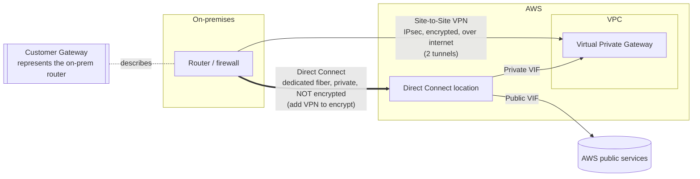

# Revision — 05.4 – VPC Hybrid Connectivity (VPN & Direct Connect)

> [!abstract] Night-before read · ~6 min · self-contained
> Everything you need is here — no need to jump back mid-revision.
> Full teaching explanations, Terraform and diagrams: **[[05-vpc-hybrid]]**
> Ends with a **self-test** — close the doc and answer it before you sleep.
> *Generated by `_scripts/build_revision.py` — do not edit.*
## The shape of it

> [!info] Exam TL;DR
> - **Site-to-Site VPN** = IPsec VPN **over the internet**, **encrypted**, AWS-managed, **2 tunnels** for HA. **Fast to set up (hours)**, cheap, but performance rides the public internet (variable).
> - **VPN endpoints:** **Virtual Private Gateway (VGW)** = AWS side (or a **Transit Gateway** for many VPCs); **Customer Gateway (CGW)** = config object representing your on-prem router.
> - **Direct Connect (DX)** = **dedicated private physical fiber**, bypasses the internet. **Consistent low latency + guaranteed bandwidth + lower data cost**, but **expensive** and **weeks-to-months to provision**. **NOT encrypted by default** — run a VPN over it to encrypt.
> - **DX speeds:** dedicated **1/10/100/400 Gbps**; **hosted** (via a partner) **50 Mbps–25 Gbps** — the only route to a sub-1 Gbps link. **VIFs:** Private (→VPC), Public (→S3 etc.), Transit (→TGW).
> - **Direct Connect Gateway** = one DX reaching **VPCs across multiple regions/accounts** (non-transitive).
> - **Decisions:** need it *fast/temporary* → VPN. *Consistent high-throughput/low-latency* → DX. *Cheap DX backup* → VPN failover. *Encrypt DX* → VPN over DX.

## Architecture diagram

## Key facts, limits & pricing

- **Site-to-Site VPN:** IPsec, over the **public internet**, **encrypted**. Two tunnels per connection for redundancy. Static routing or **BGP** (dynamic). AWS side = **VGW** or **TGW**; on-prem = **CGW** (needs a public IP; BGP ASN). Up to ~**1.25 Gbps per standard tunnel**. Cheap, minutes-to-hours to establish. Latency/availability depend on the internet.
- **Direct Connect:** dedicated **Ethernet fiber** to a DX location, **bypasses the internet**. **NOT encrypted by default** (private ≠ encrypted) — layer a **VPN over DX** for encryption (or MACsec on supported ports). Dedicated speeds **1 / 10 / 100 Gbps** (400 on some); **hosted** connections (via partners) go sub-1 Gbps. **Weeks-to-months** to provision (physical cross-connect + telecom). Benefits: consistent low latency, guaranteed bandwidth, **lower data-transfer cost** at volume.
- **DX Virtual Interfaces (VIFs):** **Private VIF** → one VPC (via VGW); **Public VIF** → AWS public services (S3 etc.) globally; **Transit VIF** → Transit Gateway (via DX Gateway).
- **Direct Connect Gateway:** global; a private VIF → DXGW → **multiple VGWs across any region/account**; a transit VIF → DXGW → multiple TGWs. **Non-transitive** (VPCs via a DXGW can't reach each other through it).
- **VPN CloudHub:** hub-and-spoke over a VGW to connect **multiple on-prem branch offices** (and/or as backup links) using BGP.
- **HA patterns:** DX + **VPN backup** (cheap failover if the line drops); dual DX (two connections/locations) for max resilience; VPN itself already has 2 tunnels.
- **Client VPN** (aside): `aws_ec2_client_vpn_endpoint` — OpenVPN-based access for **individual remote users** (laptops), *not* site-to-site. Don't confuse the two.

## Comparisons

### Site-to-Site VPN vs Direct Connect

|   | Site-to-Site VPN | Direct Connect |
|---|---|---|
| Path | Public internet | Dedicated private fiber |
| Encrypted? | **Yes** (IPsec) | **No** by default (add VPN to encrypt) |
| Bandwidth | Up to ~1.25 Gbps/tunnel, variable | 1/10/100 Gbps, consistent |
| Latency | Variable (internet) | Low, consistent |
| Setup time | **Minutes–hours** | **Weeks–months** |
| Cost | Low | High (port + cross-connect) |
| Best for | Quick/temporary, backup, low-cost, encrypted | Steady high throughput, low latency, large data egress |

### Which one? (exam triggers)

| Requirement phrase | Answer |
|---|---|
| "Connect **quickly** / temporary / this week" | Site-to-Site VPN |
| "**Consistent** throughput, **low latency**, large/steady data (e.g. DB replication)" | Direct Connect |
| "**Encrypted** connection over the internet" | Site-to-Site VPN |
| "Private line but data must be **encrypted**" | **VPN over Direct Connect** |
| "**Backup** for Direct Connect, cost-effective" | Site-to-Site VPN failover |
| "One private connection to VPCs in **multiple regions**" | Direct Connect **Gateway** |
| "Many VPCs / on-prem all connected, at scale" | **Transit Gateway** (+ VPN or DX) |
| "Connect **individual remote employees'** laptops" | **Client VPN** (not Site-to-Site) |

## Worked examples

> [!example] Worked example — the "private but not encrypted" gotcha (VPN over DX)
> A bank moves to Direct Connect for a low-latency link to AWS and assumes the traffic is secure because "it's a private line, not the internet." Audit fails: **DX is not encrypted** — a private circuit still carries plaintext. The fix that satisfies both requirements (private path *and* encryption) is a **Site-to-Site VPN running over the Direct Connect** (IPsec over a public VIF). Exam framing: *"needs the performance of Direct Connect **and** in-transit encryption"* → **VPN over DX**, not DX alone.

> [!failure] Failure mode — betting a launch on Direct Connect lead time
> A team plans a migration in 3 weeks and designs it around Direct Connect for throughput. DX provisioning (physical cross-connect, telecom, LOA-CFA paperwork) routinely takes **weeks to months** — the circuit isn't ready by launch, and the project stalls. The right move: **stand up a Site-to-Site VPN now** (hours) to hit the date, and cut over to Direct Connect when the circuit lands (often keeping the VPN as the backup). "Need connectivity fast" is never the DX answer.

> [!example] Worked example — resilient hybrid at scale
> An enterprise with 20 VPCs across 2 regions and 3 data centers wants one coherent network. Peering would be a 190-connection mess. Design: a **Transit Gateway** per region as the hub (all VPCs attach with one attachment each), **Direct Connect + Transit VIF via a Direct Connect Gateway** to bring the data centers onto the hubs across regions, and a **Site-to-Site VPN as failover** for the DX. This is the canonical "large hybrid network" answer — TGW for the VPC mesh, DX for the private pipe, VPN for cheap backup.

## 🔴 My weak spots (this topic)   #weak-spot

- [ ] **Whole topic was cold** (hadn't reviewed since the video) — learned it fresh here; needs card review to stick.
- [ ] **DX is NOT encrypted by default** — the single most-tested nuance; encrypt via VPN-over-DX.
- [ ] **VGW (AWS side) vs CGW (on-prem side)** — which is which.
- [ ] **VPN = fast to set up / DX = weeks-to-months** — drives most "which connection" scenario answers.
- [ ] **Direct Connect Gateway** = one DX to multiple regions (non-transitive).

## Also worth carrying

> [!warning] Trap — "Direct Connect is encrypted because it's private"
> Private ≠ encrypted. DX carries plaintext over a dedicated circuit. For encryption, run a **VPN over DX**. Very common distractor.

> [!warning] Trap — "use Direct Connect for a quick or temporary connection"
> DX takes **weeks-to-months** to provision. Anything "fast," "temporary," or "immediately" is a **Site-to-Site VPN**.

> [!warning] Trap — "VGW vs CGW"
> **VGW = AWS side** (attached to the VPC). **CGW = on-prem side** (a config object describing your router). Swapping these is a classic mix-up.

> [!warning] Trap — "Client VPN = Site-to-Site VPN"
> **Client VPN** = individual users' devices (OpenVPN). **Site-to-Site VPN** = whole network ↔ VPC (IPsec). Different services for different needs.

## Self-test

> [!question] Close the doc first.
> Reading a comparison and being able to *produce* it are different skills, and
> only the second one survives a question written to make two answers look alike.
> Say each answer out loud before you unfold it — if you can only recognise it,
> you do not know it yet.

### You have got these wrong before

*Your own recorded misses. Answer each one before unfolding it — these are, by definition, the ones that have already cost you marks.*

> [!question]- Whole topic was cold
> (hadn't reviewed since the video) — learned it fresh here; needs card review to stick.

> [!question]- DX is NOT encrypted by default
> the single most-tested nuance; encrypt via VPN-over-DX.

> [!question]- VGW (AWS side) vs CGW (on-prem side)
> which is which.

> [!question]- VPN = fast to set up / DX = weeks-to-months
> drives most "which connection" scenario answers.

> [!question]- Direct Connect Gateway
> = one DX to multiple regions (non-transitive).

**1. Site-to-Site VPN vs Direct Connect** — fill the blank cells from memory.

|   | Site-to-Site VPN | Direct Connect |
|---|---|---|
| Path |   |   |
| Encrypted? |   |   |
| Bandwidth |   |   |
| Latency |   |   |
| Setup time |   |   |
| Cost |   |   |
| Best for |   |   |

> [!success]- Answer
> |   | Site-to-Site VPN | Direct Connect |
> |---|---|---|
> | Path | Public internet | Dedicated private fiber |
> | Encrypted? | **Yes** (IPsec) | **No** by default (add VPN to encrypt) |
> | Bandwidth | Up to ~1.25 Gbps/tunnel, variable | 1/10/100 Gbps, consistent |
> | Latency | Variable (internet) | Low, consistent |
> | Setup time | **Minutes–hours** | **Weeks–months** |
> | Cost | Low | High (port + cross-connect) |
> | Best for | Quick/temporary, backup, low-cost, encrypted | Steady high throughput, low latency, large data egress |

### The traps

*Each of these is a place a plausible-looking answer is wrong. Say why before unfolding.*

> [!question]- "Direct Connect is encrypted because it's private"
> Private ≠ encrypted. DX carries plaintext over a dedicated circuit. For encryption, run a **VPN over DX**. Very common distractor.

> [!question]- "use Direct Connect for a quick or temporary connection"
> DX takes **weeks-to-months** to provision. Anything "fast," "temporary," or "immediately" is a **Site-to-Site VPN**.

> [!question]- "VGW vs CGW"
> **VGW = AWS side** (attached to the VPC). **CGW = on-prem side** (a config object describing your router). Swapping these is a classic mix-up.

> [!question]- "Client VPN = Site-to-Site VPN"
> **Client VPN** = individual users' devices (OpenVPN). **Site-to-Site VPN** = whole network ↔ VPC (IPsec). Different services for different needs.

*Answers are lifted verbatim from [[05-vpc-hybrid]]. Generated by `_scripts/build_revision.py` — do not edit.*
