# Revision — 07 – RDS & Aurora

> [!abstract] Night-before read · ~11 min · self-contained
> Everything you need is here — no need to jump back mid-revision.
> Full teaching explanations, Terraform and diagrams: **[[07-rds-aurora]]**
> Ends with a **self-test** — close the doc and answer it before you sleep.
> *Generated by `_scripts/build_revision.py` — do not edit.*
## The shape of it

> [!info] Exam TL;DR
> - **RDS engines:** MySQL, PostgreSQL, MariaDB, Oracle, SQL Server, + **Aurora**.
> - **Multi-AZ = HA/failover** (synchronous standby, NOT readable). **Read Replica = read scaling** (async, readable, cross-region-capable, manual promote). The #1 RDS trap.
> - **Backups:** automated (daily snapshot + ~5-min transaction logs → **PITR to any second**, 1–35 day retention, deleted with the instance) vs manual snapshots (survive deletion). Restore always creates a **new instance**.
> - **Aurora storage:** **6 copies across 3 AZs**, self-healing, shared **cluster volume** auto-scaling **10 GB → 128 TB**; compute/storage **separated**.
> - **Aurora replicas share the storage** (no copy) → **<10 ms** lag, auto-failover, up to **15** — **same cap as RDS**, so replica *count* is not the discriminator; **shared storage** is. Endpoints: **writer/cluster**, **reader** (LB'd reads), **custom**, **instance**.
> - **Aurora Serverless v2** = auto-scaling capacity for variable workloads. **Aurora Global Database** = 1 primary + up to 10 read-only regions, <1s replication (DR + global reads).
> - **Encryption at rest** = set at **creation only**. Keep DBs `publicly_accessible = false` in private subnets.
> - **Three ways to authenticate:** native DB password · **IAM database authentication** (`rds-db:connect`, 15-minute token, nothing stored) · **Secrets Manager** (stored password + automatic rotation). "No password in the app / use the EC2 role" → **IAM DB auth**.

## Architecture diagram

```mermaid
flowchart TB
    App[App] -->|writes| WEP[Writer / Cluster endpoint]
    App -->|reads| REP[Reader endpoint - load-balances replicas]
    WEP --> PRI[Primary / writer instance]
    REP --> R1[Aurora Replica 1]
    REP --> R2[Aurora Replica 2 ... up to 15]
    subgraph VOL["Shared cluster volume (auto-scales 10GB-128TB)"]
      direction LR
      C1[(copy)]:::az1
      C2[(copy)]:::az1
      C3[(copy)]:::az2
      C4[(copy)]:::az2
      C5[(copy)]:::az3
      C6[(copy)]:::az3
    end
    PRI --- VOL
    R1 --- VOL
    R2 --- VOL
    classDef az1 fill:#123
    classDef az2 fill:#132
    classDef az3 fill:#231
```


*6 copies across 3 AZs; all instances read the same volume (why replica lag is tiny).*

## Key facts, limits & pricing

- **RDS Multi-AZ:** a **synchronous** standby in another AZ; **not readable**; automatic failover (~60–120s) via DNS CNAME swap. For HA only. Doubles cost; not Free-Tier.
- **RDS Read Replicas:** **asynchronous**; **up to 15 per source** — the same cap as Aurora. **readable**; can be **cross-region**; can be **promoted** to a standalone DB (manual, breaks replication). For read scaling / reporting. (You can combine: a Multi-AZ primary *with* read replicas.)
- **Backups:** automated backups enabled by setting retention 1–35 days → **point-in-time recovery** (daily snapshot + transaction logs every ~5 min). Deleted when the instance is deleted (unless you take a final snapshot). **Manual snapshots** are kept until you delete them and survive instance deletion. **Restore = new instance / new endpoint.**
- **Encryption at rest** (`storage_encrypted`, KMS): **only at creation**. To encrypt an existing unencrypted DB: snapshot → copy the snapshot **with encryption** → restore. Encryption in transit = SSL/TLS.
- **Aurora storage:** **6-way replication across 3 AZs** (2 copies/AZ); tolerates losing a whole AZ + one more copy for reads; self-healing; **cluster volume auto-scales 10 GB → 128 TB**. Compute and storage bill/scale independently.
- **Aurora Replicas:** up to **15**, share the cluster volume (**<10 ms** typical lag), **automatic failover** with priority tiers (much faster than RDS Multi-AZ). Aurora also keeps 6 storage copies regardless of instance count.
- **Aurora extras:** **Backtrack** (rewind the DB in place without restore, Aurora MySQL); **Aurora Serverless v2** (fine-grained auto-scaling ACUs for variable load); **Aurora Global Database** (1 primary + up to **10 secondary read-only regions**, **<1s** replication, cross-region DR); **Aurora Machine Learning**, **RDS Proxy** (connection pooling for Lambda/serverless).
- **Why Aurora over RDS MySQL/Postgres:** ~**5× MySQL / 3× Postgres** throughput, replicas that **share one volume instead of copying data**, faster failover, 6-copy durability, auto-scaling storage, serverless + global options. Trade-off: pricier per-hour, MySQL/Postgres-compatible only.
- **RDS Free Tier (legacy, accounts activated before 2025-07-15):** `db.t2/t3/t4g.micro`, single-AZ, 750 hrs/mo, 20 GB, 12 months. Newer accounts get the **Free Plan** instead — `db.t3/t4g.micro` plus sign-up credits, with guardrails (see the backup-retention gotcha below).
- **IAM database authentication** works on **MariaDB, MySQL, PostgreSQL** (and Aurora MySQL/PostgreSQL). You call `aws rds generate-db-auth-token` and pass the returned string **as the password**. Each token lives **15 minutes**; traffic is **always SSL/TLS**. The token is typically **~1 KB minimum** — drivers/tools that truncate long passwords will break it.
- **IAM DB auth costs memory on the instance:** AWS states you need **300–1000 MiB of extra memory** for reliable connectivity — a real consideration on burstable `t`-class instances.
- **CloudTrail does not log IAM DB authentication.** `generate-db-auth-token` is signed locally and is not tracked. Do not answer "use IAM DB auth to get an audit trail of database logins."
- **Some global condition keys don't work** with IAM DB auth: `aws:SourceIp`, `aws:SourceVpc`, `aws:SourceVpce`, `aws:UserAgent`, `aws:Referer`, `aws:VpcSourceIp`.
- **PostgreSQL specifics:** granting the `rds_iam` role to a user makes IAM auth **take precedence over password auth** for that user; IAM auth can't be combined with Kerberos, and can't be used for a replication connection.

## Comparisons

### Multi-AZ vs Read Replica (memorize)

|   | Multi-AZ | Read Replica |
|---|---|---|
| Purpose | HA / failover | Read scaling |
| Sync | Synchronous | Asynchronous |
| Readable | **No** | **Yes** |
| Region | Same region (other AZ) | Same or **cross-region** |
| Failover | Automatic | Manual promote |
| Trigger words | "survive AZ failure", "HA" | "offload reads", "reporting", "scale reads" |

### RDS vs Aurora

|   | RDS (MySQL/Postgres) | Aurora |
|---|---|---|
| Storage | Single EBS volume (+ standby copy) | Distributed 6-copy/3-AZ cluster volume |
| Storage scaling | Manual/auto up to limit | Auto 10 GB–128 TB |
| Read replicas | Up to 15, each a **separate copy** fed by replication (lag) | Up to 15, **share one cluster volume** (<10 ms) |
| Failover | ~1–2 min (Multi-AZ) | Faster (shared storage) |
| Serverless | RDS has no true serverless | Aurora Serverless v2 |
| Global | Cross-region read replica | Aurora Global Database (<1s) |
| Cost | Lower | Higher, more performance |

### Database authentication — password vs IAM vs Secrets Manager

|   | Native DB password | **IAM database authentication** | Secrets Manager |
|---|---|---|---|
| Where the credential lives | in the DB **and** your app config | **nowhere** — minted on demand | encrypted in Secrets Manager |
| How the app authenticates | username + password | `generate-db-auth-token` → use the token **as the password** | fetch the secret, then use the password |
| Credential lifetime | until someone rotates it by hand | **15 minutes** | until rotated (**automatic** rotation available) |
| Who is allowed to connect | database `GRANT`s only | IAM policy: `rds-db:connect` on a `dbuser` ARN | IAM policy on `secretsmanager:GetSecretValue` |
| Transport | TLS optional | **always SSL/TLS** | TLS optional |
| Best for | legacy / simple setups | **EC2, Lambda, ECS with a role — no secret to leak or rotate** | apps or third-party tools that need a *real* password |

The IAM policy — note the `rds-db:` prefix, which is **not** the `rds:` prefix used by the RDS management API:

```json
{
  "Effect": "Allow",
  "Action": ["rds-db:connect"],
  "Resource": ["arn:aws:rds-db:us-east-1:111122223333:dbuser:db-ABCDEFGHIJKL01234/db_user"]
}
```

ARN shape: `arn:aws:rds-db:{region}:{account-id}:dbuser:{DbiResourceId}/{db-user-name}`

- `DbiResourceId` is the instance's **resource id** (`db-ABC…`), **not** the DB identifier you named it. It's Region-unique and never changes. Aurora uses the `DbClusterResourceId`; through RDS Proxy it's `prx-…`.
- The last segment is the **database** user, which must already exist and be mapped to IAM — `AWSAuthenticationPlugin` on MySQL, `GRANT rds_iam TO <user>` on PostgreSQL.
- Wildcards work: `dbuser:*/jane_doe` means that DB user on any instance in the account + Region.

## Worked examples

> [!example] Worked example — an EC2 app that connects to RDS with no password anywhere
> The app runs on EC2 behind an ASG and must reach a private PostgreSQL instance. Instead of a password in a config file (or in Terraform state), enable `iam_database_authentication_enabled` on the instance, create the DB user and `GRANT rds_iam TO appuser`, and attach a policy allowing `rds-db:connect` on `arn:aws:rds-db:us-east-1:…:dbuser:db-ABC…/appuser` to the **instance profile role** the ASG's launch template already assigns (see [[02-ec2]], [[01-iam]]). At connect time the SDK calls `generate-db-auth-token`, signs it with the role's temporary credentials from IMDSv2, and hands the token to the driver as the password over TLS. Nothing is stored, nothing is rotated, and revoking access is a one-line IAM change — no database restart, no redeploy. This is the canonical exam answer to "remove hard-coded database credentials without managing a secret."

> [!example] Worked example — read-heavy app with a reporting team
> An app's primary DB is fine for writes, but a BI/reporting team runs heavy analytical queries that slow production. Solution: add **read replicas** and point the reporting tools at them (or Aurora's **reader endpoint**), isolating analytics from the write path. If they *also* need to survive an AZ outage, that's a **separate** feature — **Multi-AZ** — layered on the primary. The exam tests whether you know these are two different tools: replicas = scale reads, Multi-AZ = availability.

> [!failure] Failure mode — "we'll encrypt the database later"
> A team launches RDS unencrypted to move fast, planning to enable `storage_encrypted` later. There is no "encrypt in place" — encryption is **creation-time only**. Fixing it means: snapshot the DB → **copy the snapshot with encryption enabled** → restore from the encrypted copy → repoint the app (downtime/cutover). Design encryption in from day one. Same gotcha bit the [[06-capstone]] build's mental model.

> [!example] Worked example — spiky dev/test database → Aurora Serverless v2
> A team runs dozens of dev/test databases that are idle most of the day and busy in bursts. Provisioned instances waste money sitting idle; right-sizing each by hand is toil. **Aurora Serverless v2** auto-scales each cluster's capacity (ACUs) up during bursts and down to a floor when idle, in-place, per-second billing — you pay for actual usage. Trigger phrase: "unpredictable / intermittent / variable workload, minimize cost" → Aurora Serverless.

## 🔴 My weak spots (this topic)   #weak-spot

- [ ] **Aurora storage architecture** (6 copies/3 AZs, shared volume, compute/storage separation) — knew replicas differ but not the why.
- [ ] **Aurora endpoints** (writer/cluster vs reader vs custom vs instance).
- [ ] **Aurora Serverless v2** (variable-workload auto-scaling) and **Global Database** (<1s cross-region).
- [ ] **PITR mechanics** — daily snapshot + ~5-min transaction logs = restore to any second; restore = new instance.
- [ ] **Encryption at creation only** — no in-place encryption.
- [ ] **IAM database authentication — missed twice, both marked _sure_** (mock 2026-08-28, trainer-sourced). Discriminators that beat me: "short-lived IAM database credentials instead of passwords" and "token-based DB auth tied to an instance profile." The concept was **absent from this note entirely** until 2026-08-29 — see the new authentication comparison above.
- [ ] **Aurora Replicas double as failover targets** — missed while marked _sure_ (mock 2026-08-28, trainer-sourced). An Aurora Replica is not read-scaling *or* HA; it is **both at once**, which is exactly what makes it different from an RDS read replica.

## Also worth carrying

> [!tip] Real gotcha — AWS Free Plan caps backup retention
> On the new AWS **Free Tier "Free Plan"**, `backup_retention_period = 7` failed with `FreeTierRestrictionError`; had to drop to `1`. The current free tier has service guardrails (backup retention, sometimes instance types) the old 12-month one didn't — dial settings down rather than upgrading the plan.

> [!warning] Trap — "IAM database authentication controls what the user can do in the database"
> It does not. IAM decides **whether you may connect as a given database user**; everything after that is still the database's own `GRANT`s. AWS says it plainly: a role that connects as `jane_doe` gets exactly the tables and schemas `jane_doe` has. So IAM DB auth is **authentication**, not in-database **authorization** — pairing it with an over-privileged DB user gains you nothing.

> [!warning] Trap — `rds-db:` vs `rds:`
> `rds-db:connect` is the **only** action with the `rds-db:` prefix and it exists solely for IAM DB auth. Everything else (`rds:CreateDBInstance`, `rds:DescribeDBInstances`…) is the `rds:` management API and has nothing to do with logging into the database. An answer that grants `rds:*` to let an app "connect to the database" is wrong.

> [!warning] Trap — "use IAM DB auth so database logins show up in CloudTrail"
> They don't. AWS documents that CloudTrail and CloudWatch **do not log** `generate-db-auth-token`. For database-level audit you need the engine's own audit plugin / `pgaudit` and Database Activity Streams — not CloudTrail.

> [!warning] Trap — Multi-AZ to scale reads
> Multi-AZ standby is **not readable** — it's for failover. Use **read replicas** to scale reads. Reversed constantly on the exam.

> [!warning] Trap — Aurora replica lag is like RDS replica lag
> No — Aurora replicas **share one storage volume** (no data copy), so lag is ~milliseconds; RDS read replicas copy data asynchronously and can lag seconds. Different mechanism.

> [!warning] Trap — "RDS is serverless / auto-scales like Aurora"
> Plain RDS is provisioned instances. True serverless + auto-scaling storage + global <1s replication are **Aurora** features. "Serverless relational" → Aurora Serverless v2.

## Self-test

> [!question] Close the doc first.
> Reading a comparison and being able to *produce* it are different skills, and
> only the second one survives a question written to make two answers look alike.
> Say each answer out loud before you unfold it — if you can only recognise it,
> you do not know it yet.

### You have got these wrong before

*Your own recorded misses. Answer each one before unfolding it — these are, by definition, the ones that have already cost you marks.*

> [!question]- Aurora storage architecture
> (6 copies/3 AZs, shared volume, compute/storage separation) — knew replicas differ but not the why.

> [!question]- Aurora endpoints
> (writer/cluster vs reader vs custom vs instance).

> [!question]- Aurora Serverless v2
> (variable-workload auto-scaling) and **Global Database** (<1s cross-region).

> [!question]- PITR mechanics
> daily snapshot + ~5-min transaction logs = restore to any second; restore = new instance.

> [!question]- Encryption at creation only
> no in-place encryption.

> [!question]- IAM database authentication — missed twice, both marked _sure_
> (mock 2026-08-28, trainer-sourced). Discriminators that beat me: "short-lived IAM database credentials instead of passwords" and "token-based DB auth tied to an instance profile." The concept was **absent from this note entirely** until 2026-08-29 — see the new authentication comparison above.

> [!question]- Aurora Replicas double as failover targets
> missed while marked _sure_ (mock 2026-08-28, trainer-sourced). An Aurora Replica is not read-scaling *or* HA; it is **both at once**, which is exactly what makes it different from an RDS read replica.

**1. Multi-AZ vs Read Replica (memorize)** — fill the blank cells from memory.

|   | Multi-AZ | Read Replica |
|---|---|---|
| Purpose |   |   |
| Sync |   |   |
| Readable |   |   |
| Region |   |   |
| Failover |   |   |
| Trigger words |   |   |

> [!success]- Answer
> |   | Multi-AZ | Read Replica |
> |---|---|---|
> | Purpose | HA / failover | Read scaling |
> | Sync | Synchronous | Asynchronous |
> | Readable | **No** | **Yes** |
> | Region | Same region (other AZ) | Same or **cross-region** |
> | Failover | Automatic | Manual promote |
> | Trigger words | "survive AZ failure", "HA" | "offload reads", "reporting", "scale reads" |

**2. RDS vs Aurora** — fill the blank cells from memory.

|   | RDS (MySQL/Postgres) | Aurora |
|---|---|---|
| Storage |   |   |
| Storage scaling |   |   |
| Read replicas |   |   |
| Failover |   |   |
| Serverless |   |   |
| Global |   |   |
| Cost |   |   |

> [!success]- Answer
> |   | RDS (MySQL/Postgres) | Aurora |
> |---|---|---|
> | Storage | Single EBS volume (+ standby copy) | Distributed 6-copy/3-AZ cluster volume |
> | Storage scaling | Manual/auto up to limit | Auto 10 GB–128 TB |
> | Read replicas | Up to 15, each a **separate copy** fed by replication (lag) | Up to 15, **share one cluster volume** (<10 ms) |
> | Failover | ~1–2 min (Multi-AZ) | Faster (shared storage) |
> | Serverless | RDS has no true serverless | Aurora Serverless v2 |
> | Global | Cross-region read replica | Aurora Global Database (<1s) |
> | Cost | Lower | Higher, more performance |

**3. Database authentication — password vs IAM vs Secrets Manager** — fill the blank cells from memory.

|   | Native DB password | **IAM database authentication** | Secrets Manager |
|---|---|---|---|
| Where the credential lives |   |   |   |
| How the app authenticates |   |   |   |
| Credential lifetime |   |   |   |
| Who is allowed to connect |   |   |   |
| Transport |   |   |   |
| Best for |   |   |   |

> [!success]- Answer
> |   | Native DB password | **IAM database authentication** | Secrets Manager |
> |---|---|---|---|
> | Where the credential lives | in the DB **and** your app config | **nowhere** — minted on demand | encrypted in Secrets Manager |
> | How the app authenticates | username + password | `generate-db-auth-token` → use the token **as the password** | fetch the secret, then use the password |
> | Credential lifetime | until someone rotates it by hand | **15 minutes** | until rotated (**automatic** rotation available) |
> | Who is allowed to connect | database `GRANT`s only | IAM policy: `rds-db:connect` on a `dbuser` ARN | IAM policy on `secretsmanager:GetSecretValue` |
> | Transport | TLS optional | **always SSL/TLS** | TLS optional |
> | Best for | legacy / simple setups | **EC2, Lambda, ECS with a role — no secret to leak or rotate** | apps or third-party tools that need a *real* password |

### The traps

*Each of these is a place a plausible-looking answer is wrong. Say why before unfolding.*

> [!question]- "IAM database authentication controls what the user can do in the database"
> It does not. IAM decides **whether you may connect as a given database user**; everything after that is still the database's own `GRANT`s. AWS says it plainly: a role that connects as `jane_doe` gets exactly the tables and schemas `jane_doe` has. So IAM DB auth is **authentication**, not in-database **authorization** — pairing it with an over-privileged DB user gains you nothing.

> [!question]- `rds-db:` vs `rds:`
> `rds-db:connect` is the **only** action with the `rds-db:` prefix and it exists solely for IAM DB auth. Everything else (`rds:CreateDBInstance`, `rds:DescribeDBInstances`…) is the `rds:` management API and has nothing to do with logging into the database. An answer that grants `rds:*` to let an app "connect to the database" is wrong.

> [!question]- "use IAM DB auth so database logins show up in CloudTrail"
> They don't. AWS documents that CloudTrail and CloudWatch **do not log** `generate-db-auth-token`. For database-level audit you need the engine's own audit plugin / `pgaudit` and Database Activity Streams — not CloudTrail.

> [!question]- Multi-AZ to scale reads
> Multi-AZ standby is **not readable** — it's for failover. Use **read replicas** to scale reads. Reversed constantly on the exam.

> [!question]- Aurora replica lag is like RDS replica lag
> No — Aurora replicas **share one storage volume** (no data copy), so lag is ~milliseconds; RDS read replicas copy data asynchronously and can lag seconds. Different mechanism.

> [!question]- "RDS is serverless / auto-scales like Aurora"
> Plain RDS is provisioned instances. True serverless + auto-scaling storage + global <1s replication are **Aurora** features. "Serverless relational" → Aurora Serverless v2.

*Answers are lifted verbatim from [[07-rds-aurora]]. Generated by `_scripts/build_revision.py` — do not edit.*
