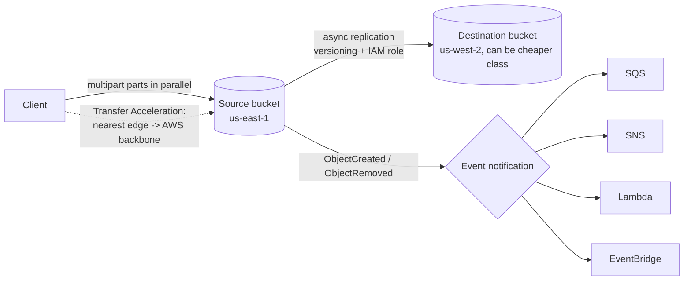

# Revision — 09.2 – S3 Advanced (replication, big files, events)

> [!abstract] Night-before read · ~7 min · self-contained
> Everything you need is here — no need to jump back mid-revision.
> Full teaching explanations, Terraform and diagrams: **[[09-s3-advanced]]**
> *Generated by `_scripts/build_revision.py` — do not edit.*
## The shape of it

> [!info] Exam TL;DR
> - **Replication:** **CRR** = different region (DR, latency, compliance), **SRR** = same region (log aggregation, prod↔test). Requires **versioning on BOTH buckets** + an **IAM role**. It is **asynchronous**.
> - Live replication only copies **new/updated** objects. Pre-existing objects (or previously failed ones) need **S3 Batch Replication** — an on-demand job.
> - **Replication is not chained**: A→B and B→C does *not* get A's objects to C.
> - **S3 RTC** = SLA-backed **99.99% replicated within 15 minutes** (the "predictable replication time / compliance" answer).
> - **Multipart upload:** recommended ≥ **100 MB**, **required > 5 GB** (single-PUT max). Parallel parts, retry only the failed part. **Incomplete parts keep billing** → lifecycle `AbortIncompleteMultipartUpload`.
> - **Byte-range fetch** = the download mirror: fetch only part of an object (headers, or parallel chunks).
> - **Transfer Acceleration:** upload to the nearest **CloudFront edge**, then over AWS's **private backbone** to the bucket's region. Same bucket, faster path — for long-distance/large uploads.
> - **Event notifications:** on object created/removed/restored → **SNS, SQS, Lambda, EventBridge**. Destination needs a **resource policy** allowing S3.
> - **Glacier retrieval tiers** (Flexible): Expedited **1–5 min**, Standard **3–5 h**, Bulk **5–12 h**. Deep Archive: **no Expedited**, Standard **~12 h**, Bulk **~48 h**.
> - ⚠️ **S3 Select is no longer available to new customers** — learn the concept; use **Athena** in practice.

## Architecture diagram

## Key facts, limits & pricing

### Replication
- **Two live types:** **CRR** (cross-region) and **SRR** (same-region). Both are **asynchronous**. Buckets may be in **different AWS accounts**.
- **Requirements:** versioning **enabled on source *and* destination**, plus an **IAM role** S3 assumes (read source versions, write destination).
- **Only new/updated objects** are replicated after you enable a rule. For anything else use **S3 Batch Replication** (on-demand): existing objects, objects whose replication **FAILED**, objects already replicated (e.g. to a newly added destination), and replicas-of-replicas.
- **Not transitive/chained** — replicas created by a rule can only be re-replicated via Batch Replication.
- **Delete markers** are **not** replicated unless you opt in (`delete_marker_replication`). Deleting a *specific version* is never replicated (protects the copy).
- Replicas can land in a **different (cheaper) storage class**, and ownership can be overridden to the destination account.
- **S3 RTC (Replication Time Control):** replicates **99.99% of new objects within 15 minutes**, backed by an SLA + CloudWatch replication metrics. Doesn't apply to Batch Replication.
- **CRR use cases:** compliance/geographic distance, lower latency for users in another region, cross-region DR. **SRR use cases:** aggregate logs into one bucket, replicate prod→test accounts, data-sovereignty copies within a region.

### Big objects
- **Multipart upload:** AWS **recommends ≥ 100 MB**; **required above 5 GB** (max single-PUT). Up to **10,000 parts** (numbers 1–10,000); max object **50 TB** (raised from 5 TB in Dec 2025 — older practice banks still say 5 TB). Parts upload in **parallel** and a failed part is retried alone.
- **Incomplete multipart uploads keep billing you** for the stored parts until you complete or abort them — and they're invisible in a normal listing. Always add **`AbortIncompleteMultipartUpload`** to a lifecycle rule.
- **Byte-range fetch:** request only a byte range of an object — used to read just a header/metadata, resume a broken download, or parallelize a big download into ranges.

### Speed & query
- **Transfer Acceleration:** client uploads to the **nearest CloudFront edge location**, which forwards over **AWS's private backbone** to the bucket's region. The bucket does **not** move. Best for long-distance transfers of large objects; costs extra per GB. (Not a CDN for reads — that's CloudFront itself.)
- **S3 Select:** SQL over a **single object** (CSV/JSON/Parquet), returning only matching rows/columns so less data crosses the wire. ⚠️ **AWS: "Amazon S3 Select is no longer available to new customers."** Existing users keep it; new work should use **Athena** (multi-object SQL over S3). Know the concept for the exam.

### Events & automation
- **Triggers:** `s3:ObjectCreated:*` (Put/Post/Copy/CompleteMultipartUpload), `s3:ObjectRemoved:*`, `s3:ObjectRestore:*`, replication events, and more. Can filter by **prefix** and **suffix**.
- **Destinations:** **SNS**, **SQS**, **Lambda**, **EventBridge**. EventBridge adds rich filtering, archive/replay and 20+ further targets.
- Each destination needs a **resource policy** allowing `s3.amazonaws.com` (with an `aws:SourceArn` condition) — otherwise S3 can't publish and setup fails validation.
- Delivery is typically seconds but **not guaranteed instant**; design consumers to be idempotent.

### Glacier retrieval tiers (verified)

| Storage class | Expedited | Standard | Bulk |
|---|---|---|---|
| **Glacier Flexible Retrieval** | **1–5 min** | **3–5 hours** | **5–12 hours** (free) |
| **Glacier Deep Archive** | **not available** | **~12 hours** | **~48 hours** |

*(Glacier **Instant** Retrieval needs no restore at all — millisecond GET.)*

### Other advanced bits
- **S3 Batch Operations:** run one action (copy, tag, restore, invoke Lambda, ACL change) across **millions of objects** from a manifest, with retries and a completion report. Powers Batch Replication.
- **Storage Lens:** org-wide storage analytics dashboard (usage, activity, cost-optimization recommendations); free metrics tier + paid advanced.
- **Storage Class Analysis:** watches access patterns and recommends when to transition to IA.
- **Requester Pays:** the *requester*, not the bucket owner, pays for requests + transfer — for sharing large datasets.

## Comparisons

### CRR vs SRR

|   | CRR | SRR |
|---|---|---|
| Destination | **Different** region | **Same** region |
| Typical use | DR, compliance distance, low latency for far users, cross-region analytics | Log aggregation, prod↔test sync, in-region data-sovereignty copies |
| Cross-account | Yes | Yes |

### Multipart vs byte-range

|   | Multipart upload | Byte-range fetch |
|---|---|---|
| Direction | **Upload** | **Download** |
| Splits | Object into parts sent in parallel | Request into ranges |
| Wins | Throughput + retry one part | Fetch only what you need / parallel download / resume |

## Worked examples

> [!example] Worked example — the event-driven thumbnail pipeline
> Users upload photos to `uploads/`. An **`s3:ObjectCreated:*` notification** (prefix-filtered) fires a **Lambda**, which reads the object, generates a thumbnail and writes it to `thumbs/`. No polling, no server, and it scales with upload volume. Two production details: the destination needs a **resource policy** letting S3 invoke it, and the thumbnail must be written to a **different prefix or bucket** — writing back into `uploads/` would re-trigger the same rule and **recurse infinitely** (a real and expensive mistake). In this build we pointed events at **SQS** instead of Lambda so the raw event JSON is readable with one CLI call — that JSON is exactly what a Lambda would receive.

> [!failure] Failure mode — "replication is on, so we're backed up"
> A team enables CRR for DR and assumes the destination now mirrors the bucket. It doesn't: live replication copies only objects written **after** the rule existed, so years of existing data are missing — discovered during an actual regional failover. Worse, if they'd enabled **delete-marker replication**, an accidental delete would propagate to the "backup" too. Fixes: run **S3 Batch Replication** to backfill existing objects, keep delete-marker replication **off** for DR copies, and monitor with **replication metrics / S3 RTC**. Replication is a *copy*, not a *backup* — versioning + Object Lock are what protect against deletion.

> [!failure] Failure mode — the invisible multipart bill
> A nightly job uploads multi-GB files and sometimes crashes mid-upload. Each crash leaves an **incomplete multipart upload**: the uploaded parts are stored and **billed**, but they don't appear in `s3 ls` or the bucket's object count. Months later, storage cost far exceeds the visible data. Diagnose with `aws s3api list-multipart-uploads`; fix permanently with a lifecycle rule containing **`abort_incomplete_multipart_upload { days_after_initiation = 7 }`**. This is why that clause is in our lifecycle rule.

## Also worth carrying

> [!warning] Trap — replication copies existing objects
> It does **not**. Live CRR/SRR only handles objects created/updated **after** the rule. Existing data needs **S3 Batch Replication**.

> [!warning] Trap — replication is transitive
> No. A→B and B→C does **not** deliver A's objects to C. Replicas can only be re-replicated with Batch Replication.

> [!warning] Trap — Transfer Acceleration moves your data closer to users
> It doesn't move the bucket. It changes the **path**: enter AWS at the nearest **edge location**, then travel the **private backbone** to the bucket's region. For serving *reads* globally you want **CloudFront**.

> [!warning] Trap — "use S3 Select" on a new account
> S3 Select is **no longer available to new customers**. The modern answer for SQL over S3 is **Athena** (and it queries many objects, not one).
