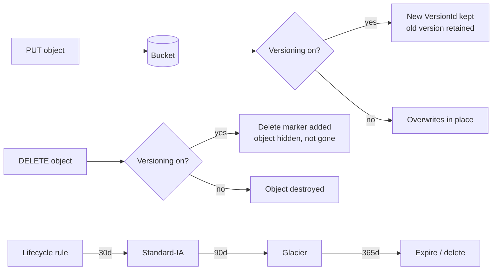

# Revision — 09.1 – S3 Introduction (buckets, classes, versioning, lifecycle)

> [!abstract] Night-before read · ~7 min · self-contained
> Everything you need is here — no need to jump back mid-revision.
> Full teaching explanations, Terraform and diagrams: **[[09-s3-intro]]**
> Ends with a **self-test** — close the doc and answer it before you sleep.
> *Generated by `_scripts/build_revision.py` — do not edit.*
## The shape of it

> [!info] Exam TL;DR
> - **Bucket names are GLOBALLY unique** (across all AWS accounts); buckets themselves live in **one region**.
> - The **key** is the object's full name (`photos/cat.jpg`). S3 is a **flat key→object map** — "folders" are a console illusion over the `/` in keys; the leading part is a **prefix**.
> - **Durability = 99.999999999% (11 nines)** for *every* storage class, stored across **≥3 AZs** — *except* One Zone classes (**1 AZ**). **Availability differs by class** (Standard 99.99%, IA 99.9%, One Zone-IA 99.5%).
> - **Storage classes:** Standard → Intelligent-Tiering → Standard-IA → One Zone-IA → Glacier Instant → Glacier Flexible → Glacier Deep Archive. **Minimum storage durations:** IA classes **30 d**, Glacier Instant/Flexible **90 d**, Deep Archive **180 d** (delete early = still billed).
> - **Versioning** keeps every version; a delete creates a **delete marker** (nothing is really removed). Deleting the marker restores the object.
> - **Lifecycle rules** transition objects between classes and **expire** them (incl. noncurrent versions + incomplete multipart uploads) — pure cost control.
> - **Static website hosting** serves objects over **HTTP only** — HTTPS needs CloudFront in front.

## Architecture diagram

## Key facts, limits & pricing

- **Namespace:** bucket names are **globally unique across all AWS accounts**; buckets are **regional** resources. Names are DNS-compatible (3–63 chars, lowercase, no underscores).
- **Object size:** 0 bytes to **50 TB** (raised from 5 TB on 2025-12-02; AWS's multipart limits table states the exact ceiling as **48.8 TiB**). Older practice questions still answer 5 TB. A single `PUT` maxes at **5 GB** — beyond that you must use **multipart upload** (see [[09-s3-advanced]]).
- **Durability: 99.999999999% (11 nines)** — *designed for* — on **every** storage class. Achieved by redundantly storing across **≥3 AZs** (One Zone classes: **1 AZ**, same 11-nines durability but **lost if that AZ is destroyed**).
- **Availability (designed for), verified:** Standard **99.99%** · Standard-IA **99.9%** · Intelligent-Tiering **99.9%** · One Zone-IA **99.5%** · Glacier Instant **99.9%** · Glacier Flexible / Deep Archive **99.99% (after restore)**.
- **Minimum storage durations (billed even if you delete early):** Standard & Intelligent-Tiering **none** · Standard-IA & One Zone-IA **30 days** · Glacier Instant & Glacier Flexible **90 days** · Glacier Deep Archive **180 days**.
- **Minimum billable object size:** Standard/Intelligent-Tiering **none**; Standard-IA, One Zone-IA, Glacier Instant **128 KB**. (Storing many tiny files in IA can cost *more* than Standard.)
- **Intelligent-Tiering:** auto-moves objects between Frequent → Infrequent (**30 d** no access) → Archive Instant Access (**90 d**), plus optional Archive Access (90 d) and Deep Archive Access (180 d) tiers. **Monitoring fee per object, no retrieval fees.** Objects **< 128 KB are not monitored** and stay in Frequent Access.
- **Consistency:** S3 provides **strong read-after-write consistency** for all PUTs and DELETEs (since Dec 2020) — no more eventual-consistency caveats.
- **Versioning:** enabled at the **bucket** level; can be **suspended but never disabled** once enabled. Pre-versioning objects have `VersionId = null`. Every version costs storage → pair with `noncurrent_version_expiration`.
- **Static website hosting:** the S3 website endpoint is **HTTP only**; for HTTPS/custom domain/caching put **CloudFront** in front. Requires public read access (Block Public Access off + public bucket policy).

## Comparisons

### Storage classes (verified against AWS docs 2026-08)

| Class | For | Availability | AZs | Min duration | Min billable size | Retrieval |
|---|---|---|---|---|---|---|
| **S3 Standard** | Frequent access | 99.99% | ≥3 | none | none | ms |
| **Intelligent-Tiering** | Unknown/changing patterns | 99.9% | ≥3 | none | none | ms (monitoring fee, no retrieval fee) |
| **Standard-IA** | Infrequent, must not lose | 99.9% | ≥3 | 30 d | 128 KB | ms (+ retrieval fee) |
| **One Zone-IA** | Infrequent, **re-creatable** | 99.5% | **1** | 30 d | 128 KB | ms (+ retrieval fee) |
| **Glacier Instant Retrieval** | Archive, quarterly, instant | 99.9% | ≥3 | 90 d | 128 KB | **milliseconds** |
| **Glacier Flexible Retrieval** | Archive, yearly | 99.99% (post-restore) | ≥3 | 90 d | — | **minutes–hours** (restore first) |
| **Glacier Deep Archive** | Archive, <1×/year | 99.99% (post-restore) | ≥3 | **180 d** | — | **hours** (restore first) |

*(Also exists: **S3 Express One Zone** — single-digit-ms, 1 AZ, 99.95% — for latency-critical workloads.)*

### Versioning: delete vs permanent delete

| Action | Versioning OFF | Versioning ON |
|---|---|---|
| `DELETE object` | Object destroyed | **Delete marker** added; object hidden, versions retained |
| `DELETE object --version-id` | n/a | **Permanently** removes that version |
| Delete the delete marker | n/a | Object **reappears** |
| Overwrite | Replaces in place | New version; old version kept |

## Worked examples

> [!example] Worked example — a lifecycle policy that pays for itself
> Log files land in S3 daily. They're queried constantly for the first month, occasionally for a quarter, then kept years for compliance and almost never read. One lifecycle rule handles the whole journey: **Standard** on write → **Standard-IA at 30 days** → **Glacier Flexible at 90 days** → **expire at 7 years**, plus `noncurrent_version_expiration` to purge old versions and `abort_incomplete_multipart_upload` after 7 days. Storage cost drops by an order of magnitude with no application change. Exam trigger: *"data accessed frequently at first then rarely, minimize cost"* → **lifecycle transitions**, not manual copies.

> [!failure] Failure mode — versioning without noncurrent-version expiration
> A team enables versioning "for safety" on a bucket where a job rewrites the same objects hourly. Every rewrite keeps the old version forever, so storage (and the bill) grows without bound while the bucket "looks" the same size in the console — `s3 ls` shows only current versions. Months later the bill is 20× expected. Fix: always pair versioning with a lifecycle rule containing **`noncurrent_version_expiration`** (e.g. 30 days), and use `list-object-versions` (not `s3 ls`) to see true usage. *(Also why a versioned bucket refuses to `terraform destroy` with `BucketNotEmpty` until every version and delete marker is purged — hit live in this build.)*

> [!failure] Failure mode — One Zone-IA for the only copy
> One Zone-IA is ~20% cheaper than Standard-IA and equally durable *on paper* (11 nines) — so a team moves its only backup copy there. Both classes are 11-nines durable, but One Zone-IA stores in a **single AZ**: if that AZ is physically destroyed, **the data is gone**, and its availability is only 99.5%. Rule: One Zone-IA is only for **re-creatable** data (thumbnails, derived files, secondary replicas). The primary/only copy belongs in a ≥3-AZ class.

## Also worth carrying

> [!warning] Trap — "S3 has folders"
> No. S3 is a flat key→object store; `photos/cat.jpg` is one key. The console renders "folders" by splitting on `/`. Listing by **prefix** is how you emulate a directory.

> [!warning] Trap — "Glacier means slow retrieval"
> **Glacier Instant Retrieval** returns objects in **milliseconds**. Only **Flexible Retrieval** (minutes–hours) and **Deep Archive** (hours) need a restore job. "Archive but must be instantly available" → Glacier Instant Retrieval.

> [!warning] Trap — durability vs availability
> Every class is **11 nines durable** (won't lose data). What differs is **availability** (can you reach it *right now*): Standard 99.99%, IA 99.9%, One Zone-IA 99.5%. Questions about "surviving AZ loss" are about **AZ count**, not durability.

> [!warning] Trap — moving to IA/Glacier always saves money
> Minimum storage durations (IA 30 d, Glacier 90 d, Deep Archive 180 d) and a **128 KB minimum billable size** mean short-lived or tiny objects can cost **more** in IA than Standard. Transition only data that will genuinely sit there.

## Self-test

> [!question] Close the doc first.
> Reading a comparison and being able to *produce* it are different skills, and
> only the second one survives a question written to make two answers look alike.
> Say each answer out loud before you unfold it — if you can only recognise it,
> you do not know it yet.

**1. Storage classes (verified against AWS docs 2026-08)** — fill the blank cells from memory.

| Class | For | Availability | AZs | Min duration | Min billable size | Retrieval |
|---|---|---|---|---|---|---|
| **S3 Standard** |   |   |   |   |   |   |
| **Intelligent-Tiering** |   |   |   |   |   |   |
| **Standard-IA** |   |   |   |   |   |   |
| **One Zone-IA** |   |   |   |   |   |   |
| **Glacier Instant Retrieval** |   |   |   |   |   |   |
| **Glacier Flexible Retrieval** |   |   |   |   |   |   |
| **Glacier Deep Archive** |   |   |   |   |   |   |

> [!success]- Answer
> | Class | For | Availability | AZs | Min duration | Min billable size | Retrieval |
> |---|---|---|---|---|---|---|
> | **S3 Standard** | Frequent access | 99.99% | ≥3 | none | none | ms |
> | **Intelligent-Tiering** | Unknown/changing patterns | 99.9% | ≥3 | none | none | ms (monitoring fee, no retrieval fee) |
> | **Standard-IA** | Infrequent, must not lose | 99.9% | ≥3 | 30 d | 128 KB | ms (+ retrieval fee) |
> | **One Zone-IA** | Infrequent, **re-creatable** | 99.5% | **1** | 30 d | 128 KB | ms (+ retrieval fee) |
> | **Glacier Instant Retrieval** | Archive, quarterly, instant | 99.9% | ≥3 | 90 d | 128 KB | **milliseconds** |
> | **Glacier Flexible Retrieval** | Archive, yearly | 99.99% (post-restore) | ≥3 | 90 d | — | **minutes–hours** (restore first) |
> | **Glacier Deep Archive** | Archive, <1×/year | 99.99% (post-restore) | ≥3 | **180 d** | — | **hours** (restore first) |

**2. Versioning: delete vs permanent delete** — fill the blank cells from memory.

| Action | Versioning OFF | Versioning ON |
|---|---|---|
| `DELETE object` |   |   |
| `DELETE object --version-id` |   |   |
| Delete the delete marker |   |   |
| Overwrite |   |   |

> [!success]- Answer
> | Action | Versioning OFF | Versioning ON |
> |---|---|---|
> | `DELETE object` | Object destroyed | **Delete marker** added; object hidden, versions retained |
> | `DELETE object --version-id` | n/a | **Permanently** removes that version |
> | Delete the delete marker | n/a | Object **reappears** |
> | Overwrite | Replaces in place | New version; old version kept |

### The traps

*Each of these is a place a plausible-looking answer is wrong. Say why before unfolding.*

> [!question]- "S3 has folders"
> No. S3 is a flat key→object store; `photos/cat.jpg` is one key. The console renders "folders" by splitting on `/`. Listing by **prefix** is how you emulate a directory.

> [!question]- "Glacier means slow retrieval"
> **Glacier Instant Retrieval** returns objects in **milliseconds**. Only **Flexible Retrieval** (minutes–hours) and **Deep Archive** (hours) need a restore job. "Archive but must be instantly available" → Glacier Instant Retrieval.

> [!question]- durability vs availability
> Every class is **11 nines durable** (won't lose data). What differs is **availability** (can you reach it *right now*): Standard 99.99%, IA 99.9%, One Zone-IA 99.5%. Questions about "surviving AZ loss" are about **AZ count**, not durability.

> [!question]- moving to IA/Glacier always saves money
> Minimum storage durations (IA 30 d, Glacier 90 d, Deep Archive 180 d) and a **128 KB minimum billable size** mean short-lived or tiny objects can cost **more** in IA than Standard. Transition only data that will genuinely sit there.

*Answers are lifted verbatim from [[09-s3-intro]]. Generated by `_scripts/build_revision.py` — do not edit.*
