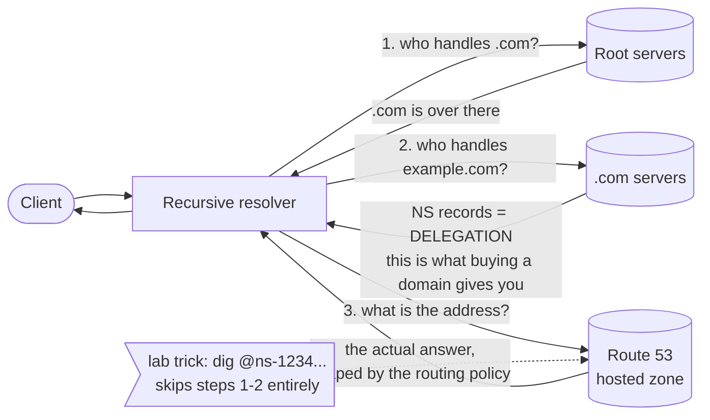
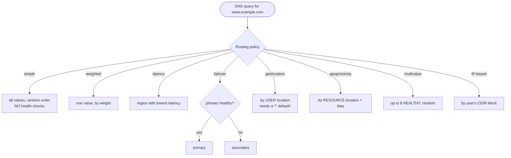

# Revision — 10 – Route 53 (DNS)

> [!abstract] Night-before read · ~12 min · self-contained
> Everything you need is here — no need to jump back mid-revision.
> Full teaching explanations, Terraform and diagrams: **[[10-route53]]**
> Ends with a **self-test** — close the doc and answer it before you sleep.
> *Generated by `_scripts/build_revision.py` — do not edit.*
## The shape of it

> [!info] Exam TL;DR
> - **A hosted zone is a container of records for one domain.** Route 53 answers authoritatively for any zone it holds — **it never checks whether you own the name**. Registering a domain only buys you the **NS delegation** in the parent zone so strangers can *find* your nameservers.
> - **Alias vs CNAME** is the #1 Route 53 question. **CNAME cannot exist at the zone apex** (DNS protocol rule). **Alias can**, is Route 53-only, points **only at AWS resources**, and **query costs are free**. You **cannot set a TTL on an alias** to an AWS resource — it uses the target's.
> - **Eight routing policies:** simple · weighted · latency · failover · geolocation · geoproximity · multivalue answer · IP-based.
> - **Simple ≠ load balancing.** Multiple values are returned **all at once, in random order**, and the **client** picks — with **no health checking**. The health-checked version is **multivalue answer** (up to **8 healthy** records).
> - **Geolocation** routes on where the **user** is (country/continent/state). **Geoproximity** routes on where your **resources** are, with a **bias** dial. Easy to swap.
> - **Failover speed = (health check interval × failure threshold) + TTL.** Default-ish: (30s × 3) + TTL. Lower the TTL on failover-critical records — a 3600s TTL means an hour of stale answers no matter how fast Route 53 reacts.
> - **Private hosted zone** = resolvable only from **associated VPCs**. Same name can exist public *and* private → **split-view DNS**.
> - **Route 53 Resolver:** **inbound** endpoint = on-prem resolves **into** AWS. **outbound** endpoint = AWS resolves **out to** on-prem. Remember the direction.

## Architecture diagram

## Key facts, limits & pricing

- **Route 53 is global**, not regional — hosted zones don't live in a Region, and the console has no Region selector for them.
- **Hosted zones:** **$0.50/month** each for the first 25, **$0.10/month** after. **A zone deleted within 12 hours of creation is not charged** — but *queries against a public zone are still billed* even then.
- **Queries:** **$0.40 per million** (first 1B/month), $0.20/million above. **Alias queries to AWS resources are free.** A **CNAME pointing at another Route 53 record bills as two queries**.
- **Health checks:** **50 free** for **AWS endpoints** (a resource running in AWS in the *same account*). Then **$0.50/month** (AWS) / **$0.75/month** (non-AWS). **Optional features cost $1.00 each (AWS) / $2.00 (non-AWS) per month** — HTTPS, string matching, the fast 10-second interval, and latency measurement all count. Keep lab checks basic.
- **Health check mechanics:** interval is **30s or 10s** (10s = "fast", costs extra); the **failure threshold** is the number of *consecutive* checks that must fail (or pass) to flip the status. Route 53 aggregates many global checkers: **more than 18% reporting healthy ⇒ healthy**. A **new** health check counts as **healthy** until it has enough data (inverted if you enable "invert").
- **Health check timing detail:** HTTP/HTTPS must establish TCP within **4 seconds** and return **2xx/3xx within 2 more seconds**. TCP checks must connect within **10 seconds**. **HTTPS health checks do not validate certificates** — an expired cert will not fail the check. String matching must find the string within the first **5,120 bytes**.
- **Three health check types:** **endpoint** (IP or domain name), **calculated** (a parent watching up to **255** children, with AND / OR / "at least N"), and **CloudWatch alarm** (watches the alarm's *data stream*, not its state — so `SetAlarmState` can't fake it; same account only, no metric math, no M-of-N).
- **Health checks cannot target private, nonroutable, or multicast IPs.** For EC2, attach an **Elastic IP** and check that, so the target never moves.
- **Alias:** no TTL of your own (uses the target's); resolves as an **A/AAAA** record in `dig` (the alias-ness is only visible in the console/API); auto-follows the target's IP changes; targets include **ALB/NLB/CLB, CloudFront, S3 static website, API Gateway, VPC interface endpoints, Global Accelerator, Elastic Beanstalk, App Runner, OpenSearch, AppSync, and another record in the same hosted zone**. **An EC2 instance is not a valid alias target** — use a plain A record to its Elastic IP.
- **CNAME restriction beyond the apex:** if a name has a CNAME, it can have **no other records at all** at that name. That's why the apex — which must carry SOA and NS — can never be a CNAME.
- **Private hosted zones** need a **VPC association**, and the VPC needs DNS support + DNS hostnames. Queried from outside an associated VPC, the name simply **resolves recursively on the public internet** instead of erroring. They're assigned four *reserved* nameservers (`ns-0.awsdns-00.com` and friends) that are **never actually contacted** — they exist only because DNS requires an NS record set.
- **Record types supported:** A, AAAA, CAA, CNAME, DS, HTTPS, MX, NAPTR, NS, PTR, SOA, SPF, SRV, SSHFP, SVCB, TLSA, TXT. **SPF as a record type is deprecated** — put SPF data in a **TXT** record. **MX priority: lower number wins.** TXT strings are ≤255 chars each, ≤4,000 total.
- **Route 53 carries a 100% availability SLA** for hosted zones — service credits begin the moment monthly uptime drops below 100%. It covers **authoritative DNS only**, not Resolver or the other Route 53 features.

## Comparisons

### The eight routing policies

| Policy | Chooses on | Returns | Health-checked? |
|---|---|---|---|
| **Simple** | nothing | **all** values, random order — client picks | ❌ **no** |
| **Weighted** | your weights | **one** | ✅ |
| **Latency** | lowest measured latency to an **AWS Region** | one | ✅ |
| **Failover** | primary's health | primary, else secondary | ✅ (that's the point) |
| **Geolocation** | where the **user** is (continent / country / US state) | one | ✅ |
| **Geoproximity** | where your **resources** are + a **bias** you set | one | ✅ (needs Traffic Flow) |
| **Multivalue answer** | nothing | up to **8 healthy**, random | ✅ **yes** |
| **IP-based** | CIDR blocks **you** supply | one | ✅ |

*The pairs that get confused: **simple vs multivalue** (health checking is the whole difference) and **geolocation vs geoproximity** (users vs resources).*

### Alias vs CNAME

|   | **Alias** | **CNAME** |
|---|---|---|
| At the zone apex | ✅ **yes** | ❌ **never** |
| Points at | **AWS resources only** (+ records in the same zone) | **any** DNS name |
| Query cost | **free** | charged (×2 if it targets another R53 record) |
| TTL | **can't set one** — uses the target's | you set it |
| Appears in `dig` as | A / AAAA | CNAME |
| Standard DNS? | ❌ Route 53 extension | ✅ |

### Public vs private hosted zone

|   | Public | Private |
|---|---|---|
| Who can resolve it | anyone on the internet (if delegated) | only **associated VPCs**, or on-prem via a Resolver **inbound** endpoint |
| Needs a VPC association | ❌ | ✅ **required** |
| Nameservers | four real, internet-reachable ones | four **reserved** names that are never contacted |
| Queried from outside | answers | falls through to **public** recursive resolution |

*Same domain in both = **split-view DNS**: private answer inside the VPC, public answer outside. Common for `internal.example.com` style setups.*

### Route 53 Resolver — get the direction right

|   | **Inbound endpoint** | **Outbound endpoint** |
|---|---|---|
| Who is asking | **on-premises** (or another VPC) | resources **in your VPC** |
| What they're resolving | names **in AWS** (private hosted zones, VPC names) | names **on-premises** |
| Direction | on-prem → **into** AWS | AWS → **out to** on-prem |

The VPC's built-in resolver lives at the **VPC base + 2** address (e.g. `10.0.0.2` in a `10.0.0.0/16` VPC) and answers for VPC names, private hosted zones, and public names. **Resolver rules** are per-domain conditional forwarders, and can be **shared across accounts with RAM**. Pairs with [[05-vpc-hybrid]] — the traffic itself rides Direct Connect or Site-to-Site VPN.

> [!note] Naming churn
> AWS has renamed **Route 53 Resolver** to **Route 53 VPC Resolver** (following the introduction of Route 53 Global Resolver). Course material and the exam will almost certainly still say "Route 53 Resolver" — treat them as the same thing.

## Worked examples

> [!example] Worked example — blue/green release with weighted routing
> You want 10% of live traffic on a new stack before committing. Create **two records with the same name** `app.example.com`, each with a `set_identifier` (`blue`, `green`) and a `weighted_routing_policy` of 90 and 10. Route 53 returns **one** address per query, chosen in proportion. Shift by editing weights — no load balancer change, no deploy. Two cautions that make this a real-world skill rather than a trick: **TTL bounds how fast a shift takes effect** (clients keep the old answer until it expires, so use ~60s), and **weight 0 means "never return this"**, which is how you drain a stack cleanly. Attach health checks to both so a broken green is removed rather than served to 10% of users.

> [!example] Worked example — multi-region active/passive DR
> Primary in `us-east-1`, warm standby in `eu-west-1`. Create a **failover** pair on `www.example.com`: the PRIMARY record carries a **health check** on the primary endpoint, the SECONDARY doesn't need one. Route 53 serves primary while healthy and switches automatically when the check fails. Budget the switch honestly: **(30s interval × 3 failures) + TTL** ≈ 90s plus however long clients cache. Set the TTL to **60**, not 3600. If the record is an **alias** to an ALB you can't set a TTL at all — Route 53 uses the ALB's, which is already low, so this is fine. This is the canonical exam answer for "automatic cross-region failover with minimal RTO" — pair it with [[07-rds-aurora]] Global Database for the data tier.

> [!failure] Failure mode — the geolocation record with no default
> A team adds geolocation records for `US`, `GB` and `DE`, tests from those three countries, and ships. Users in **every other country get no answer at all** — not a slow answer, not a wrong region, **NXDOMAIN-shaped silence** — because no record matches their location and Route 53 has nothing to fall back on. The fix is a record with country `*` as the **default**, which catches every unmatched location. The same trap is why `dig +subnet=` testing from a *single* location gives false confidence: you only ever exercise one branch. Always test an unmatched location deliberately.

## Traps

> [!warning] Trap — "use simple routing to distribute traffic across three servers"
> Simple routing returns **all** the values in random order and the **client** chooses; Route 53 is not balancing anything and is **not health checking**. A dead server keeps being handed out. If the question wants distribution *with* health awareness, it's **multivalue answer**; if it wants controlled proportions, it's **weighted**; if it wants real load balancing, it's an **ALB**, not DNS.

> [!warning] Trap — CNAME at the apex
> `example.com` must carry SOA and NS records, and DNS forbids a CNAME coexisting with any other record at the same name. So a CNAME at the apex is **invalid DNS**, not an AWS limitation. Pointing `example.com` at an ALB or CloudFront is exactly what **alias** records exist for.

> [!warning] Trap — geolocation vs geoproximity
> **Geolocation = where the USER is** (continent, country, US state) — content localization, licensing, compliance. **Geoproximity = where your RESOURCES are**, with a **bias** to grow or shrink each one's catchment. If the scenario says "users in Germany must get the German site," that's geolocation. If it says "shift more traffic toward the bigger data centre," that's geoproximity bias.

> [!warning] Trap — "we set up failover but users were down for an hour"
> Route 53 did fail over. The **TTL** kept resolvers and browsers serving the stale answer. Failover is only as fast as `(interval × threshold) + TTL`, and the TTL term usually dominates. Any question where failover "didn't work" but the console shows a healthy failover is a TTL question.

> [!warning] Trap — health check on a private IP
> Route 53 health checkers live on the public internet and **cannot reach private, nonroutable or multicast addresses**. You cannot health-check an instance in a private subnet directly — check the public-facing load balancer instead, or use a **CloudWatch alarm** health check driven by a metric the private resource publishes.

> [!warning] Trap — inbound vs outbound Resolver endpoints
> **Inbound = traffic coming INTO AWS to be resolved** (on-prem asking about AWS names). **Outbound = queries leaving AWS** (your VPC asking about on-prem names). Candidates reverse these constantly. Anchor on the direction of the *query*, not the direction of the answer.

> [!warning] Trap — "HTTPS health checks prove the certificate is valid"
> They don't. AWS states plainly that HTTPS health checks **do not validate SSL/TLS certificates** — an expired or invalid cert still passes. Certificate expiry monitoring is ACM + CloudWatch/EventBridge, not a Route 53 health check.

## Self-test

> [!question] Close the doc first.
> Reading a comparison and being able to *produce* it are different skills, and
> only the second one survives a question written to make two answers look alike.
> Say each answer out loud before you unfold it — if you can only recognise it,
> you do not know it yet.

**1. The eight routing policies** — fill the blank cells from memory.

| Policy | Chooses on | Returns | Health-checked? |
|---|---|---|---|
| **Simple** |   |   |   |
| **Weighted** |   |   |   |
| **Latency** |   |   |   |
| **Failover** |   |   |   |
| **Geolocation** |   |   |   |
| **Geoproximity** |   |   |   |
| **Multivalue answer** |   |   |   |
| **IP-based** |   |   |   |

> [!success]- Answer
> | Policy | Chooses on | Returns | Health-checked? |
> |---|---|---|---|
> | **Simple** | nothing | **all** values, random order — client picks | ❌ **no** |
> | **Weighted** | your weights | **one** | ✅ |
> | **Latency** | lowest measured latency to an **AWS Region** | one | ✅ |
> | **Failover** | primary's health | primary, else secondary | ✅ (that's the point) |
> | **Geolocation** | where the **user** is (continent / country / US state) | one | ✅ |
> | **Geoproximity** | where your **resources** are + a **bias** you set | one | ✅ (needs Traffic Flow) |
> | **Multivalue answer** | nothing | up to **8 healthy**, random | ✅ **yes** |
> | **IP-based** | CIDR blocks **you** supply | one | ✅ |

**2. Alias vs CNAME** — fill the blank cells from memory.

|   | **Alias** | **CNAME** |
|---|---|---|
| At the zone apex |   |   |
| Points at |   |   |
| Query cost |   |   |
| TTL |   |   |
| Appears in `dig` as |   |   |
| Standard DNS? |   |   |

> [!success]- Answer
> |   | **Alias** | **CNAME** |
> |---|---|---|
> | At the zone apex | ✅ **yes** | ❌ **never** |
> | Points at | **AWS resources only** (+ records in the same zone) | **any** DNS name |
> | Query cost | **free** | charged (×2 if it targets another R53 record) |
> | TTL | **can't set one** — uses the target's | you set it |
> | Appears in `dig` as | A / AAAA | CNAME |
> | Standard DNS? | ❌ Route 53 extension | ✅ |

**3. Public vs private hosted zone** — fill the blank cells from memory.

|   | Public | Private |
|---|---|---|
| Who can resolve it |   |   |
| Needs a VPC association |   |   |
| Nameservers |   |   |
| Queried from outside |   |   |

> [!success]- Answer
> |   | Public | Private |
> |---|---|---|
> | Who can resolve it | anyone on the internet (if delegated) | only **associated VPCs**, or on-prem via a Resolver **inbound** endpoint |
> | Needs a VPC association | ❌ | ✅ **required** |
> | Nameservers | four real, internet-reachable ones | four **reserved** names that are never contacted |
> | Queried from outside | answers | falls through to **public** recursive resolution |

**4. Route 53 Resolver — get the direction right** — fill the blank cells from memory.

|   | **Inbound endpoint** | **Outbound endpoint** |
|---|---|---|
| Who is asking |   |   |
| What they're resolving |   |   |
| Direction |   |   |

> [!success]- Answer
> |   | **Inbound endpoint** | **Outbound endpoint** |
> |---|---|---|
> | Who is asking | **on-premises** (or another VPC) | resources **in your VPC** |
> | What they're resolving | names **in AWS** (private hosted zones, VPC names) | names **on-premises** |
> | Direction | on-prem → **into** AWS | AWS → **out to** on-prem |

### The traps

*Each of these is a place a plausible-looking answer is wrong. Say why before unfolding.*

> [!question]- "use simple routing to distribute traffic across three servers"
> Simple routing returns **all** the values in random order and the **client** chooses; Route 53 is not balancing anything and is **not health checking**. A dead server keeps being handed out. If the question wants distribution *with* health awareness, it's **multivalue answer**; if it wants controlled proportions, it's **weighted**; if it wants real load balancing, it's an **ALB**, not DNS.

> [!question]- CNAME at the apex
> `example.com` must carry SOA and NS records, and DNS forbids a CNAME coexisting with any other record at the same name. So a CNAME at the apex is **invalid DNS**, not an AWS limitation. Pointing `example.com` at an ALB or CloudFront is exactly what **alias** records exist for.

> [!question]- geolocation vs geoproximity
> **Geolocation = where the USER is** (continent, country, US state) — content localization, licensing, compliance. **Geoproximity = where your RESOURCES are**, with a **bias** to grow or shrink each one's catchment. If the scenario says "users in Germany must get the German site," that's geolocation. If it says "shift more traffic toward the bigger data centre," that's geoproximity bias.

> [!question]- "we set up failover but users were down for an hour"
> Route 53 did fail over. The **TTL** kept resolvers and browsers serving the stale answer. Failover is only as fast as `(interval × threshold) + TTL`, and the TTL term usually dominates. Any question where failover "didn't work" but the console shows a healthy failover is a TTL question.

> [!question]- health check on a private IP
> Route 53 health checkers live on the public internet and **cannot reach private, nonroutable or multicast addresses**. You cannot health-check an instance in a private subnet directly — check the public-facing load balancer instead, or use a **CloudWatch alarm** health check driven by a metric the private resource publishes.

> [!question]- inbound vs outbound Resolver endpoints
> **Inbound = traffic coming INTO AWS to be resolved** (on-prem asking about AWS names). **Outbound = queries leaving AWS** (your VPC asking about on-prem names). Candidates reverse these constantly. Anchor on the direction of the *query*, not the direction of the answer.

> [!question]- "HTTPS health checks prove the certificate is valid"
> They don't. AWS states plainly that HTTPS health checks **do not validate SSL/TLS certificates** — an expired or invalid cert still passes. Certificate expiry monitoring is ACM + CloudWatch/EventBridge, not a Route 53 health check.

*Answers are lifted verbatim from [[10-route53]]. Generated by `_scripts/build_revision.py` — do not edit.*
