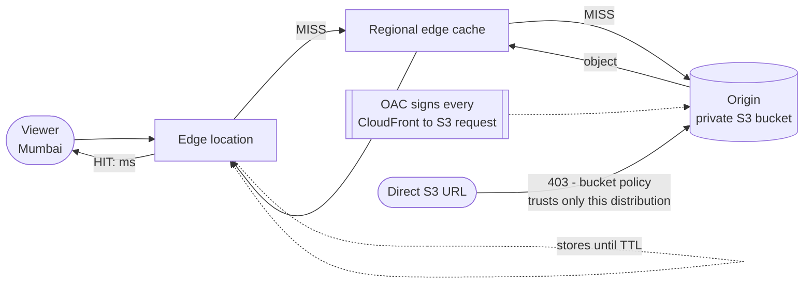

# Revision — 11 – CloudFront (CDN)

> [!abstract] Night-before read · ~10 min · self-contained
> Everything you need is here — no need to jump back mid-revision.
> Full teaching explanations, Terraform and diagrams: **[[11-cloudfront]]**
> *Generated by `_scripts/build_revision.py` — do not edit.*
## The shape of it

> [!info] Exam TL;DR
> - **Cache miss → fetch from origin → store at the edge → serve hits until the TTL expires.** A **regional edge cache** sits between the edge and your origin, checked on a miss before the origin is.
> - **Not just static content.** Dynamic, uncacheable requests still benefit, because they enter the AWS backbone at the edge instead of crossing the public internet.
> - **OAC (Origin Access Control)** locks an S3 origin so CloudFront is the only way in — Block Public Access stays **fully on**. OAC is current; **OAI is legacy**. The bucket policy trusts `cloudfront.amazonaws.com` **with an `AWS:SourceArn` condition pinning your distribution** — the confused-deputy defence again.
> - **An S3 *website* endpoint is a custom origin and cannot use OAC or OAI at all.** OAC needs the **S3 REST endpoint** (`bucket.s3.region.amazonaws.com`).
> - **Versioned filenames beat invalidation.** Invalidation is the emergency tool: **1,000 paths/month free** per account, `/*` counts as **one path**.
> - **An ACM certificate for CloudFront must live in `us-east-1`**, no matter where the origin is.
> - **CloudFront Functions** (JS, sub-ms, viewer events only, no network) vs **Lambda@Edge** (Node/Python, up to 30 s, all four events, network + request body).
> - **CloudFront vs Global Accelerator:** CloudFront caches HTTP at the edge. Global Accelerator gives **two static anycast IPs**, works at **TCP/UDP**, **caches nothing**, and fails over **without DNS or TTL** because the IPs never change.

## Architecture diagram

## Key facts, limits & pricing

- **Origins:** an S3 bucket (REST endpoint), an S3 bucket configured as a **website endpoint** (treated as a *custom* origin), S3 Access Points, S3 Object Lambda, S3 Multi-Region Access Points, MediaStore/MediaPackage, **ALB**, **NLB**, **EC2**, **Lambda function URLs**, **API Gateway**, and **any public HTTP(S) server, including on-premises**.
- **VPC origins** let an **ALB, NLB or EC2 instance in a private subnet** be an origin without any public internet exposure — the modern way to keep the load balancer private while still fronting it with CloudFront.
- **Origin groups** provide CloudFront's own failover: a primary and a secondary origin, switching when the primary returns configured HTTP failure codes. (Distinct from Route 53 failover — no DNS involved.)
- **OAC vs OAI:** AWS recommends **OAC**. OAI does **not** support all Regions (including opt-in Regions launched after Dec 2022/Jan 2023), **SSE-KMS**, or dynamic `PUT`/`POST`/`DELETE`. Migration path: allow both principals in the bucket policy, switch the distribution, then remove the OAI statement.
- **OAC requirements:** S3 **Object Ownership** must be *Bucket owner enforced* (the default for new buckets). With `signing_behavior = always`, CloudFront→S3 is **always HTTPS**. For **SSE-KMS** objects you must also add CloudFront to the **KMS key policy**, with the same `AWS:SourceArn` condition.
- **Invalidation:** the first **1,000 invalidation paths per month per AWS account** (across all distributions) are free; a path containing `*` counts as **one path** however many files it clears. AWS explicitly recommends **versioned file names instead**, because invalidation can't reach a user's browser cache or a corporate proxy — and because versioning gives you clean rollbacks and readable access logs.
- **HTTPS / certificates:** an ACM certificate used for **viewer↔CloudFront** HTTPS must be requested or imported in **`us-east-1`**. (Exception: for **CloudFront↔origin** HTTPS with an **ELB** origin, the certificate may be in any Region.) RSA 1024–4096-bit (ACM issues up to 2048) or ECDSA 256/384-bit. If no domain in the origin's certificate matches the origin domain name, viewers get **502 Bad Gateway**.
- **Price classes:** `PriceClass_100` (US, Canada, Europe, Israel), `PriceClass_200` (adds most of Asia, Middle East, Africa), `PriceClass_All` (everywhere). Fewer edge locations = cheaper but further from some users. Observable in the `X-Amz-Cf-Pop` response header.
- **Data transfer from your AWS origin to CloudFront is waived.** You pay for CloudFront's data transfer out to viewers and for requests.
- **Response headers worth knowing:** `X-Cache: Hit from cloudfront` / `Miss from cloudfront`, `Age` (seconds cached), `X-Amz-Cf-Pop` (which edge served you), `X-Amz-Cf-Id` (log correlation).
- **Geo restriction** allows or blocks whole countries at the edge (`whitelist` / `blacklist`). It's CloudFront-native and free — distinct from Route 53 **geolocation routing**, which chooses *where to send* rather than *whether to allow*.
- Integrates with **AWS WAF** and **Shield** (Standard is automatic and free; Advanced is paid) for DDoS and application-layer protection at the edge.

## Comparisons

### CloudFront vs S3 Transfer Acceleration vs Global Accelerator

|   | **CloudFront** | **S3 Transfer Acceleration** | **Global Accelerator** |
|---|---|---|---|
| What it does | caches HTTP content at edges | speeds S3 **uploads** via an edge + the AWS backbone | routes **any TCP/UDP** over the AWS backbone to the nearest healthy Region |
| Caches? | ✅ | ❌ | ❌ |
| Protocols | HTTP/HTTPS | S3 API | **TCP / UDP** |
| Static IPs | ❌ (DNS name) | ❌ | ✅ **two static anycast IPs** (four dual-stack) |
| Failover speed | origin groups, per request | n/a | **instant — no DNS, no TTL** |
| Endpoints | origins | one bucket | **NLB, ALB, EC2, Elastic IP** |
| Reach for it when | cacheable web content, global static/dynamic sites | large uploads to S3 from far away | gaming, VoIP, IoT/MQTT, non-HTTP, static IPs required, sub-minute regional failover |

*The Global Accelerator discriminator that matters: the IPs **never change**, so there is nothing for a resolver to cache. Compare with [[10-route53]] failover, which is bounded by `(interval × threshold) + TTL`.*

### CloudFront Functions vs Lambda@Edge

|   | **CloudFront Functions** | **Lambda@Edge** |
|---|---|---|
| Language | JavaScript (ECMAScript 5.1) | Node.js and Python |
| Events | **viewer request / viewer response only** | viewer request/response **+ origin request/response** |
| Duration | **sub-millisecond** | up to **30 seconds** |
| Memory | 2 MB | 128 MB (viewer) / 10 GB (origin) |
| Code + libraries | 10 KB | 50 MB |
| Network access | ❌ | ✅ |
| File system / request **body** | ❌ | ✅ |
| Scale | millions of req/sec | 10,000 req/sec per Region |
| Use for | cache-key normalisation, header manipulation, URL rewrites/redirects, JWT validation | anything needing the SDK, third-party libraries, network calls, or the request body |

### Signed URLs vs signed cookies (private content)

|   | Signed URL | Signed cookies |
|---|---|---|
| Grants access to | **one individual file** | **multiple files** (a whole section, all HLS segments) |
| Use when | the client can't handle cookies; you're distributing a single object | you don't want to change your existing URLs |
| Works with | S3 **and** custom origins | S3 **and** custom origins |

Signers are configured as **trusted key groups** (recommended) or the legacy **trusted signers**. Note the contrast with **S3 presigned URLs** ([[09-s3-security]]): those carry the permissions of whoever generated them and are S3-only; CloudFront signed URLs are a CloudFront-level control that also works for custom origins.

## Worked examples

> [!example] Worked example — a private S3 origin that is still globally fast
> A company wants a static site served worldwide with the bucket completely private. Create the bucket with **Block Public Access fully on** and no bucket policy. Create an **OAC** (`signing_behavior = always`), attach it to an S3 **REST-endpoint** origin on the distribution, then add a bucket policy allowing `s3:GetObject` to the service principal `cloudfront.amazonaws.com` **conditioned on `AWS:SourceArn` equal to that distribution's ARN**. Result: `https://d111.cloudfront.net/index.html` returns 200, and `https://bucket.s3.us-east-1.amazonaws.com/index.html` returns **403**. The only way in is through CloudFront, where WAF, geo restriction and signed URLs can be applied. Contrast with [[10-route53]], where S3 *website* endpoints forced the buckets public — website endpoints are custom origins and cannot use OAC at all.

> [!example] Worked example — the two-tier caching pattern
> A deploy updates both `index.html` and the app's CSS. Cache them the same way and you must choose between slow updates or constant invalidation. The production pattern splits them: **`index.html` gets a short TTL** (60 s) because it is tiny and is the only thing that must change quickly; **`/static/app.a1b2c3.css` gets a one-year TTL** because the hash is *in the filename*, so a new build produces a new name and therefore a **new cache key**. Nothing needs invalidating, ever, and users mid-session keep working off the old asset instead of getting a half-updated page. In Terraform that's a custom `aws_cloudfront_cache_policy` on the default behaviour plus `Managed-CachingOptimized` on an `ordered_cache_behavior` for `/static/*`.

> [!failure] Failure mode — the bucket policy that trusts every CloudFront distribution on earth
> A team writes the OAC bucket policy but omits the `Condition` block, leaving `Principal: {"Service": "cloudfront.amazonaws.com"}` and nothing else. **Everything works perfectly** — their site serves, direct S3 URLs still 403 for anonymous users, tests pass. But `cloudfront.amazonaws.com` is the *same principal for every AWS customer*, so anyone who learns the bucket name can point **their own** distribution at it and serve the content as their own, on their own domain, billed to them but read from you. The bug is invisible because the condition isn't what makes *your* distribution work — it's what stops *everyone else's*. Same shape as the S3 event-notification and replication-role conditions in [[09-s3-security]]: the service principal identifies the *service*, never the *customer*.

## Traps

> [!warning] Trap — "put CloudFront in front of the S3 website endpoint and use OAC"
> You can't. An S3 bucket configured as a **website endpoint** is a **custom origin**, and custom origins support **neither OAC nor OAI**. If a question requires a private bucket, the origin must be the **REST endpoint** — which also means you lose S3's website features (index documents on subfolders, S3 redirect rules), and use CloudFront's `default_root_object` and custom error pages instead.

> [!warning] Trap — the ACM certificate in the wrong Region
> A certificate for **viewer↔CloudFront** HTTPS must be in **`us-east-1`**, regardless of where the origin, the bucket, or you are. A perfectly valid certificate in `eu-west-1` simply won't appear in the distribution's certificate list. (The one exception: a certificate used for **CloudFront↔origin** HTTPS with an **ELB** origin may live in any Region.)

> [!warning] Trap — CloudFront vs Global Accelerator
> Both "make it faster globally" and both use the AWS edge network. **CloudFront caches HTTP content**; **Global Accelerator caches nothing** and works at **TCP/UDP**. Trigger words for Global Accelerator: *static IP addresses*, *non-HTTP protocol*, *gaming / VoIP / IoT*, or *failover in seconds without waiting for DNS*. Trigger words for CloudFront: *cache*, *static assets*, *media delivery*, *WAF at the edge*.

> [!warning] Trap — "invalidate on every deploy"
> It works, and for small sites the free 1,000 paths/month absorbs it. But it doesn't reach browser or corporate-proxy caches, so some users still see stale content, and it makes access logs ambiguous. AWS's documented recommendation is **versioned file names**. Reserve invalidation for genuine mistakes.

> [!warning] Trap — CloudFront Functions asked to do too much
> CloudFront Functions cannot make **network calls**, read the **request body**, or run on **origin** events, and cap at **10 KB** of code. Anything calling another AWS service, using the SDK, or inspecting a POST body is **Lambda@Edge**. Conversely, a simple header rewrite or URL redirect at millions of requests per second is Functions — Lambda@Edge would be slower and pricier.

> [!warning] Trap — geo restriction vs geolocation routing
> **CloudFront geo restriction** decides *whether a country may access the content at all* (allow/block list, enforced at the edge). **Route 53 geolocation routing** ([[10-route53]]) decides *which endpoint a country is sent to*. "Block viewers in country X for licensing reasons" → CloudFront. "Send German users to the German site" → Route 53.

## Also worth carrying

> [!warning] Not yet applied
> Written and `terraform validate`-clean, but **not applied or verified live** as of 2026-09-04 — the human deferred the practical. Everything in this note comes from AWS documentation (dated in `## 🔗 Docs`), **not** from observed behaviour. Worth doing when it is applied: delete the `SourceArn` condition from the bucket policy and observe that nothing visibly breaks — that condition is not what makes your distribution work, it is what stops everyone else's.
